16S analyses
================
Isabella, Rebecca
2025-08-12

## Setup

## Import and format data

OTU table, taxonomy assignment, metadata

``` r
##### load OTU file (rownames as sequences, cols as samples) #####
otufile <- "./seqtab_nochim_transposed_RD-Mar2025_v4.csv"
otu_df <- read.csv(otufile, row.names = 1)

## extract ASV sequences
seqs <- rownames(otu_df)
## save asv sequences
seqs_df <- as.data.frame(seqs)
rownames(seqs_df) <- paste0("OTU", 1:nrow(seqs_df))
write.csv(seqs_df, file="./16S_outputs/ASV_sequencesv4R1.csv")
seqs.fasta <- dataframe2fas(seqs, file="./16S_outputs/ASVseqs.fasta")
## get rid of ASVs as rownames
otu.rn <- otu_df
rownames(otu.rn) <- NULL

## initial plotting (distribution of reads)
long_otu <- otu.rn %>% 
  gather(key = "Sample_ID", value = "n_seqs")

sampling_coverage <- long_otu %>% 
  group_by(Sample_ID) %>% 
  summarise(n_seqs = sum(n_seqs))
## negative controls, water samples

ggplot(sampling_coverage, 
       aes(x=n_seqs)) + 
       geom_density() # density plot
```

<!-- -->

``` r
ggplot(sampling_coverage,
       aes(x=n_seqs)) + 
    geom_histogram(binwidth=5000) + 
    coord_cartesian(xlim=c(0,170000)) 
```

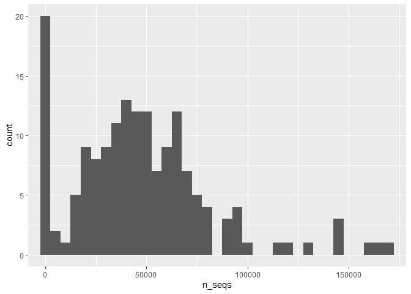<!-- -->

``` r
# to get count, coord_cartesian() zooms in on parts of histogram, 
# can change bin width

ggplot(sampling_coverage,
       aes(x=1, y=n_seqs)) + 
geom_jitter() + 
scale_y_log10() +
  geom_hline(aes(yintercept = 12000), linetype = 2)
```

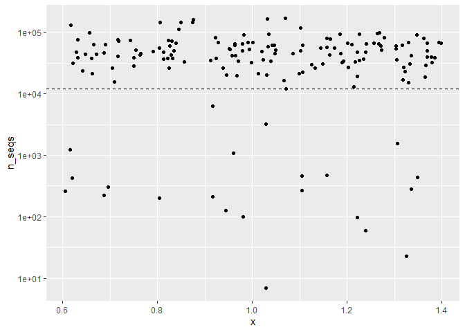<!-- -->

``` r
# position on x axis is randomized so points don't overlap eachother, 
# y is the actual number of sequences, putting on log scale to see if there 
# is a threshold of points that some seqs fall beneath, where is the critical 
# mass of seqs

sampling_coverage %>% 
  arrange(n_seqs) %>% 
  ggplot(aes(x=1:nrow(.), y=n_seqs)) + 
  geom_line() + 
  coord_cartesian(xlim=c(0,50), ylim=c(0, 25000)) +
  geom_hline(aes(yintercept = 12000), linetype = 2)
```

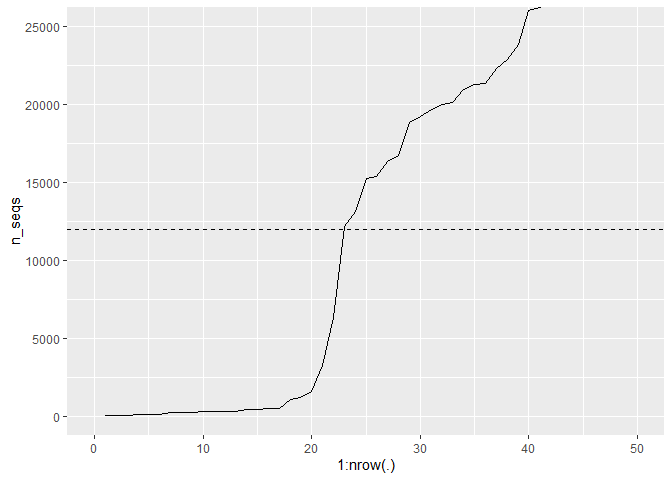<!-- -->

``` r
# arranging samples in order of n_seqs, see number of samples we have on the 
# x axis and number of seqs in each of those samples, where the shoulder is, 
# that's probably where we want to cut, also zooming into shoulder

##### taxa file (rownames as ASVs, cols as taxonomic information) #####
taxfile <- "./taxa_RD-Mar2025_v4_silva1382WSP.csv"
tax_df <- read.csv(taxfile, row.names = 1)
all(seqs == rownames(tax_df)) ## TRUE
```

    ## [1] TRUE

``` r
## get rid of rownames
tax.rn <- tax_df
rownames(tax.rn) <- NULL

## save taxonomy file
save(tax.rn, file = "./16S_outputs/tax_cleaned.Rda")

##### metadata file (rows as samples, cols as metadata) #####
metfile <- "./mapfileV4 2.csv"
met_df <- read.csv(metfile)
met_df$Sample_ID <- met_df$NAME ## to make consistent with full metadata

## check missing metadata
meta.check <- left_join(sampling_coverage, met_df, by = "Sample_ID")

## add in missing info
sample_info <- 
  read_excel("./RD-Fate of contaminants- sample info sheet - Mar2025 - updated05Aug2025.xlsx")
sample_info$pot_ID <- sample_info$`Sample ID`
meta_full <- left_join(meta.check, sample_info, by = "ID")
all(meta_full$Sample_ID == meta_full$`Study ID`) ## NA
```

    ## [1] NA

``` r
## only the four -ve controls didn't match
## plus samples RD 157-159 (redone samples?)

## get rid of unnecessary cols
meta.s <- meta_full %>%
  select(!where(~all(is.na(.))))

## add in more sample type info
meta.s$type <- ifelse(is.na(meta.s$Sample_type) &
                                 grepl("neg", meta.s$Sample_ID),
                               "neg_control", 
                               ifelse(meta.s$Sample_ID %in% c("RD157",
                                                              "RD158",
                                                              "RD159"),
                                      "Commercial soil",
                                      paste0(meta.s$Sample_type)))

## look at n_seqs depending on sample type
ggplot(meta.s, aes(x = type, y = n_seqs)) +
  geom_boxplot()
```

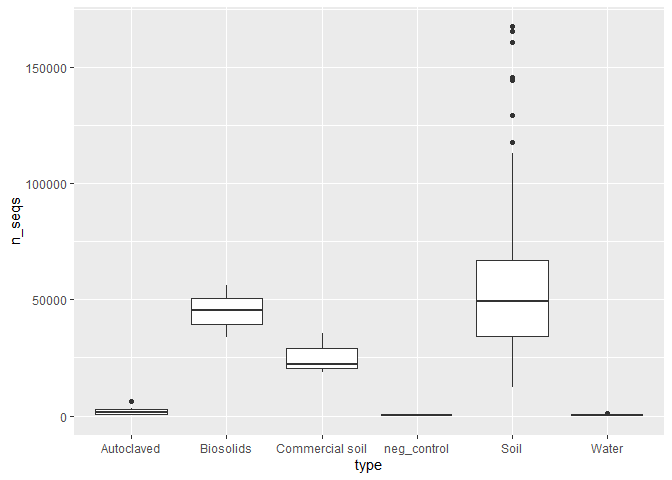<!-- -->

``` r
## exclude water and NA for now
## also exclude autoclaved soil samples
meta.f <- meta.s %>% 
  filter(!type %in% c("Water", "Commercial soil", "neg_control") &
           !grepl("Autoclaved", meta.s$`Sample ID`)) %>%
  droplevels(.)
## 138 samples to include going forward

## replace NAs in treatment with relevant grouping info
meta.f$treat <- ifelse(meta.f$`Sample ID` %in% c("BS1","BS2","BS3"),
                          "GH: Soil + BS",
                          ifelse(meta.f$`Sample ID` %in% c("S1","S2","S3"),
                                 "GH: Soil only",
                                 ifelse(is.na(meta.f$Treatment) == TRUE,
                                        paste0(meta.f$`Sample ID`),
                           paste0(meta.f$Treatment))))

## plot distribution after exluding samples
ggplot(meta.f,
       aes(x=n_seqs)) + 
       geom_density() # density plot
```

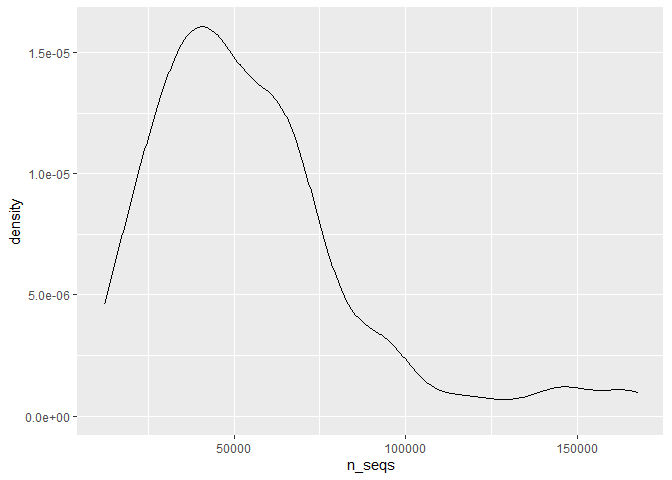<!-- -->

``` r
meta.f %>% 
  arrange(n_seqs) %>% 
  ggplot(aes(x=1:nrow(.), y=n_seqs)) + 
  geom_line() + 
  coord_cartesian(xlim=c(0,10), ylim=c(10000, 25000)) +
  geom_hline(aes(yintercept = 12000), linetype = 2)
```

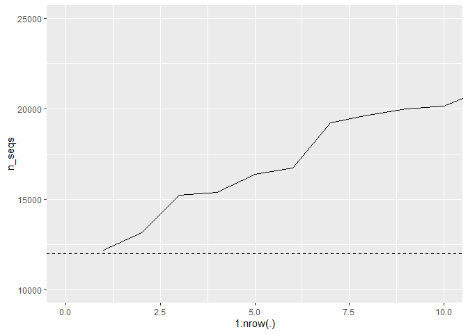<!-- -->

``` r
## add in other formatting for metadata file (factor specification)
# Recode levels
meta.f$treat.rn <- dplyr::recode(meta.f$treat, 
                          `Biosolids` = "Biosolids",
                          `Garden Soil` = "Garden Soil",
                          `GH: Soil only` = "GH: Soil only", 
                          `GH: Soil + BS` = "GH: Soil + BS", 
                          `C` = "control-0",
                          `US-RW` = "RW-0",
                          `SL1-RW` = "RW-1",
                          `SL2-RW` = "RW-2",
                          `US-BS` = "BS-0",
                          `SL1-BS` = "BS-1",
                          `SL2-BS` = "BS-2")

treat_ordered <- c("Garden Soil",
                 "Biosolids",
                 "GH: Soil only",
                 "GH: Soil + BS",
                 "control-0",
                 "RW-0",
                 "RW-1",
                 "RW-2",
                 "BS-0",
                 "BS-1",
                 "BS-2")

meta.f$treat.rn <- factor(meta.f$treat.rn, 
                                levels = treat_ordered)

## create timepoint sampling
meta.f$timepoint <- ifelse(meta.f$Sampling_date == "2024-07-11",
                               "TP1",
                               ifelse(meta.f$Sampling_date %in% 
                                        c("2024-08-06", ## radish
                                          "2024-08-18", ## lettuce
                                          "2024-08-19", ## pea
                                          "2024-08-26"), ## pea
                                      "TP2","other"))
## initial sampling for peas (first batch planted)
## second pea sampling for second batch

## create timepoint_species var (for PCoA plot)
meta.f$species <- ifelse(is.na(meta.f$Species) == FALSE,
                            paste0(meta.f$Species),
                            "no_plant")
meta.f$species <- factor(meta.f$species,
                            levels = c("no_plant", "L", "P", "R"))

meta.f$species_tp <- ifelse(is.na(meta.f$Species) == FALSE,
                            paste0(meta.f$Species,"_",meta.f$timepoint),
                            "no_plant")
meta.f$species_tp <- factor(meta.f$species_tp,
                            levels = c("no_plant", "L_TP1", "P_TP1", "R_TP1",
                                       "L_TP2", "P_TP2", "R_TP2"))

## Add in trait data from indirect experiment (peas only, TP2)
### load emmeans
load(file = "./model_outputs/indirect/emm1.Rda") ## loads emm

### normalize to controls
emm.controls <- emm %>%
  filter(contam == "control") %>%
  group_by(trait) %>%
  summarize(mean_controls = mean(response, na.rm = TRUE))
emm$mean_controls <- 
  emm.controls$mean_controls[match(emm$trait, 
                                      emm.controls$trait)]
emm.c <- emm %>%
  mutate(resp_norm = log2(response/mean_controls))

### normalize to controls
emm.c$slurry_trait <- paste0(emm.c$treatment,"-",
                                emm.c$trait)
emm.s <- emm.c %>%
  select(where(is.numeric), slurry_trait, treatment, trait)
### pivot wider
emm.w <- emm.s %>%
  pivot_wider(
    names_from = trait,
    values_from = c(resp_norm,response),
    id_cols = treatment
  )

### change treatment to pot_ID for merging
emm.w$treatment <- as.character(emm.w$treatment)
### need to add the dash between pot number and treatment (to merge with meta)
emm_clean <- emm.w %>%
  mutate(
    pot_number = as.numeric(str_extract(treatment, "\\d+")),
    treat = str_replace(treatment, "\\d+\\s*", ""),
    pot_ID = ifelse(is.na(pot_number) == FALSE,
                       paste0(pot_number,"-", treat),
                       paste0(treat)),
    timepoint = "TP2",
    ### make pot_IDs for controls the same as in meta
    pot_ID = ifelse(grepl("55-Control", pot_ID), "55-C-P", 
                    ifelse(grepl("56-Control", pot_ID), "56-C-P", 
                           ifelse(grepl("57-Control", pot_ID), "57-C-P",
                                  pot_ID)))
  ) %>%
  select(-treatment, -treat, - pot_number)

### merge with meta
meta <- left_join(meta.f, emm_clean, by = c("pot_ID","timepoint"))

save(meta, file = "./16S_outputs/metadata_cleaned.Rda")
write.csv(meta, "./16S_outputs/metadata_cleaned.csv", row.names = FALSE)

### subset otu file to just the samples of interest (in experiment)
samples_to_include <- unique(meta$Sample_ID)

otu.f <- otu.rn %>%
  select(all_of(samples_to_include))

all(meta$Sample_ID == colnames(otu.f)) ## TRUE
```

    ## [1] TRUE

``` r
### Overview of Seq run (colSums adds up number of reads for each sample)
sort(colSums(otu.f)) ## num of reads for each sample (we had 138 total) 
```

    ##   RD21   RD20   RD46   RD63   RD18   RD16   RD22   RD17   RD30   RD45   RD40 
    ##  12162  13136  15241  15379  16373  16706  19225  19655  20005  20143  20984 
    ##   RD10   RD19   RD73   RD11   RD44   RD76   RD43   RD42   RD39   RD71   RD12 
    ##  21288  21331  22867  23856  26044  26242  26452  26475  26528  26746  28489 
    ##   RD70    RD9   RD27   RD38   RD60   RD32   RD34   RD33   RD36   RD41   RD14 
    ##  29344  29652  30244  30769  31334  31814  32097  32230  32904  33381  33512 
    ##  RD143   RD35  RD106   RD77   RD95   RD13   RD56   RD55   RD62   RD66   RD31 
    ##  33762  34032  34685  34826  35429  36293  36388  37606  37858  38014  38023 
    ##   RD24    RD8   RD28   RD25   RD57   RD50   RD69  RD110    RD4   RD37   RD48 
    ##  38203  38744  38938  39197  39216  40984  41573  41585  41707  42638  42737 
    ##   RD89   RD51  RD101   RD58    RD5  RD144    RD7   RD49    RD3    RD6   RD68 
    ##  42981  43879  44430  44493  44783  45298  45535  46418  46839  46847  47807 
    ##   RD26   RD99  RD125   RD64   RD74   RD47   RD61  RD114    RD1  RD140   RD91 
    ##  47821  48263  48522  49394  49740  49955  50438  51056  51255  51658  52343 
    ##    RD2  RD100   RD52  RD102   RD88  RD112  RD142   RD15  RD119   RD59   RD78 
    ##  53224  53667  53682  55008  55680  55885  56380  58517  60188  60272  60646 
    ##   RD86   RD75   RD29  RD104   RD87  RD103   RD67   RD54  RD109   RD98   RD65 
    ##  61446  61534  61608  62110  62190  62621  62754  62773  64871  64912  65294 
    ##   RD96  RD141   RD84  RD107  RD122   RD94   RD92  RD120   RD72  RD118   RD23 
    ##  65460  65707  65812  66278  66976  67008  67706  67796  67869  68016  68061 
    ##  RD124   RD93   RD82   RD53  RD113   RD83   RD79   RD90   RD80  RD115   RD85 
    ##  71206  71871  74219  74227  74836  75817  76720  79159  79180  80885  81136 
    ##  RD116   RD81  RD111  RD108  RD117  RD121  RD123  RD139   RD97  RD105  RD128 
    ##  91139  91638  92010  92543  93286  95678  97286  98666 112983 117702 129398 
    ##  RD129  RD132  RD126  RD127  RD131  RD130 
    ## 144628 145697 145995 160753 165795 167693

``` r
sort(colSums(otu.f !=0)) ## this is sorting the num of ASVs for ea. sample
```

    ##   RD6  RD90   RD5   RD3  RD21 RD143   RD2   RD4   RD1  RD20  RD63  RD45 RD144 
    ##   556   578   603   614   629   633   692   723   729   736   747   782   786 
    ##  RD89  RD46 RD142  RD18  RD10  RD30  RD73  RD16  RD22  RD40 RD100  RD17  RD19 
    ##   797   816   818   837   865   867   870   887   888   914   919   920   926 
    ##  RD43  RD34  RD82  RD44  RD71  RD95 RD114  RD77  RD33  RD41  RD11  RD12  RD81 
    ##   927   932   955   959  1014  1017  1025  1029  1038  1040  1055  1069  1069 
    ##  RD42  RD74  RD39  RD76  RD70  RD27  RD38  RD15  RD32  RD86  RD48 RD120  RD47 
    ##  1075  1079  1083  1094  1103  1133  1133  1154  1157  1164  1165  1179  1179 
    ##   RD8   RD9  RD35  RD36  RD14  RD94 RD106  RD87  RD80 RD101  RD56  RD75  RD55 
    ##  1195  1195  1199  1204  1218  1221  1227  1229  1232  1242  1243  1262  1265 
    ##  RD60 RD112  RD13  RD37  RD28  RD50  RD84  RD58  RD31 RD110 RD104  RD57  RD24 
    ##  1293  1308  1311  1317  1327  1336  1347  1370  1376  1385  1408  1414  1422 
    ##  RD78  RD62  RD66   RD7  RD49  RD51 RD113  RD99  RD83  RD88  RD25  RD79  RD98 
    ##  1423  1428  1434  1438  1449  1482  1485  1494  1503  1503  1513  1533  1544 
    ##  RD92  RD52  RD93  RD68 RD125 RD140 RD117  RD29  RD64  RD85  RD91  RD26 RD102 
    ##  1553  1563  1568  1570  1575  1580  1587  1591  1592  1598  1605  1616  1620 
    ## RD107  RD96 RD103  RD69  RD65  RD61  RD54 RD141  RD72  RD97 RD122  RD23  RD59 
    ##  1635  1661  1680  1686  1746  1808  1811  1847  1875  1898  1935  1987  2005 
    ##  RD53 RD124 RD109 RD108 RD121  RD67 RD126 RD118 RD111 RD116 RD139 RD119 RD115 
    ##  2010  2015  2024  2029  2112  2116  2134  2169  2206  2209  2226  2227  2233 
    ## RD129 RD123 RD128 RD127 RD105 RD132 RD130 RD131 
    ##  2353  2356  2376  2439  2529  2640  3068  3443

``` r
save(otu.f, file = "./16S_outputs/OTU-tab_cleaned.Rda")
```

## Create phyloseq objects

Making phyloseq object This link explains what these variables mean in
phyloseq: <https://joey711.github.io/phyloseq/import-data.html>

``` r
## load relevant files
load(file = "./16S_outputs/tax_cleaned.Rda") ## loads tax.rn
load(file = "./16S_outputs/metadata_cleaned.Rda") ## loads meta
load(file = "./16S_outputs/OTU-tab_cleaned.Rda") ## loads otu.f

## ensuring sample and OTU names match
rownames(otu.f) <- paste0("OTU", 1:nrow(otu.f))
rownames(tax.rn) <- paste0("OTU", 1:nrow(tax.rn))
rownames(meta) <- meta$NAME
```

    ## Warning: Setting row names on a tibble is deprecated.

``` r
## create the phyloseq object
OTU <- otu_table(otu.f, taxa_are_rows = TRUE)
TAX <- tax_table(as.matrix(tax.rn))
SAMPLE <- sample_data(meta)
### need to reset rownames so they match
rownames(SAMPLE) <- meta$NAME
### put them together
ps <- phyloseq(OTU, TAX, SAMPLE)

samplesums <- sort(sample_sums(ps))
write.csv(samplesums, file="./16S_outputs/readcounts_per_sample_sorted.csv")
plot(samplesums) ## distribution of sampling depth
```

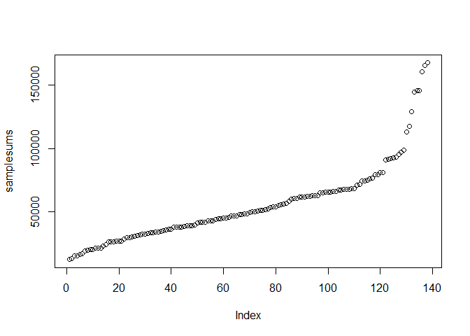<!-- -->

``` r
save(ps, file = "./16S_outputs/phyloseq.Rda") ## saves full phyloseq

## Filter table of bacterial taxa

### host DNA?
(tax.rn.host <- tax.rn %>%
  filter(Family == "Mitochondria") %>%
  summarize(count = n()))
```

    ##   count
    ## 1   390

``` r
## 390 OTUs

(tax.rn.rhizo <- tax.rn %>%
  filter(Family == "Rhizobiaceae") %>%
  summarize(count = n()))
```

    ##   count
    ## 1    75

``` r
## 75 OTUs

## subset to only bacteria, excluding mitochondria
dat_lessHOST <- subset_taxa(ps, Kingdom=="Bacteria", 
                            Family!="Mitochondria")
### save
save(dat_lessHOST, file = "./16S_outputs/phyloseq_noHOST.Rda")
write.csv(t(otu_table(dat_lessHOST)), 
          file="./16S_outputs/otu_table_noHOST.csv")

# rarefy, rarefying to 12000 based on curve
min_lib <- min(sample_sums(dat_lessHOST))
rare_ps <- rarefy_even_depth(dat_lessHOST,
                           sample.size= min_lib,
                           verbose=FALSE,
                           replace = FALSE)

save(rare_ps, file = "./16S_outputs/phyloseq_noHOST_rarified.Rda")
rare_ps.t <- t(otu_table(rare_ps))
write.csv(rare_ps.t, 
          file="./16S_outputs/otu_table_noHOST_rarified.csv")

## remove OTUs less than 1%
rel_abun_all <- transform_sample_counts(dat_lessHOST, function(x) x/sum(x))
rel_abun_all_prune <- prune_taxa(taxa_sums(rel_abun_all) > 0.01,
                                dat_lessHOST)
save(rel_abun_all_prune, file = "./16S_outputs/phyloseq_noHOST_pruned1.Rda")
write.csv(otu_table(rel_abun_all_prune), 
          file="./16S_outputs/otu_table_noHOST_prune1.csv")

# glom to phylum level, this function merges taxa based on their taxonomic 
# rank, grouping into broader categories, was originally phylum, doesn't have 
# to be this data aggregation step, Example, Imagine a phyloseq object with 
# thousands of OTUs. Using tax_glom at the Genus level would merge all OTUs 
# belonging to the same genus, resulting in a much smaller set of genus-level 
# taxa.

## glom to family level
rare_ps_family <- tax_glom(rare_ps, taxrank="Family")
write.csv(otu_table(rare_ps_family), 
          file="./16S_outputs/otu_table_noHOST_rarified_family.csv")
save(rare_ps_family, 
     file = "./16S_outputs/phyloseq_noHOST_rarified_family.Rda")
### on non-rarified (in case it matters)
noHost_family <- tax_glom(dat_lessHOST, taxrank="Family")
write.csv(otu_table(noHost_family), 
          file="./16S_outputs/otu_table_noHOST_family.csv")
save(noHost_family, 
     file = "./16S_outputs/phyloseq_noHOST_family.Rda")
### after removing rare ASVs (in case it matters)
rel_abund_family <- tax_glom(rel_abun_all_prune, taxrank="Family")
write.csv(otu_table(rel_abund_family), 
          file="./16S_outputs/otu_table_noHOST_prune1_family.csv")
save(rel_abund_family, 
     file = "./16S_outputs/phyloseq_noHOST_prune1_family.Rda")
```

## Rarefaction curve

Using the vegan package:
<https://fromthebottomoftheheap.net/2015/04/16/drawing-rarefaction-curves-with-custom-colours/>

``` r
## load relevant file
load(file = "./16S_outputs/OTU-tab_cleaned.Rda") ## loads otu.f
load(file = "./16S_outputs/metadata_cleaned.Rda") ## loads meta

## transpose OTU (samples as rows, ASVs as cols)
otu.t <- t(otu.f)
raremax <- min(rowSums(otu.t)) ## rowsums now adds up reads
raremax ## 12162
```

    ## [1] 12162

``` r
## sort cols by rowSums, pick bottom 26
row_sums <- rowSums(otu.t)
sorted_indices_asc <- order(row_sums)
otu.s <- otu.t[sorted_indices_asc, ]
otu.26 <- otu.s[1:26, ]

## testing the code: set up plotting parameters
col <- c("black", "darkred", "forestgreen", 
         "orange", "blue", "yellow", "hotpink")
lty <- c("solid", "dashed", "longdash", "dotdash")
pars <- expand.grid(col = col, lty = lty, stringsAsFactors = FALSE)
head(pars)
```

    ##           col   lty
    ## 1       black solid
    ## 2     darkred solid
    ## 3 forestgreen solid
    ## 4      orange solid
    ## 5        blue solid
    ## 6      yellow solid

``` r
## creating the initial plot
out <- with(pars[1:26, ],
            rarecurve(otu.26, step = 20, sample = raremax, col = col,
                      lty = lty, label = FALSE))
```

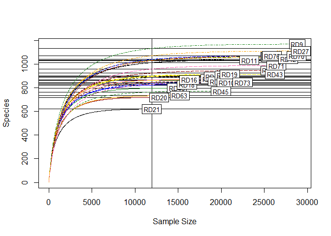<!-- -->

``` r
## re-plot using different parameters
col <- c("black", "darkred", "forestgreen", "hotpink", "blue")
lty <- c("solid", "dashed", "dotdash")
lwd <- c(1, 2)
pars <- expand.grid(col = col, lty = lty, lwd = lwd, 
                    stringsAsFactors = FALSE)
head(pars)
```

    ##           col    lty lwd
    ## 1       black  solid   1
    ## 2     darkred  solid   1
    ## 3 forestgreen  solid   1
    ## 4     hotpink  solid   1
    ## 5        blue  solid   1
    ## 6       black dashed   1

``` r
## pull out required parameters from out
Nmax <- sapply(out, function(x) max(attr(x, "Subsample")))
Smax <- sapply(out, max)

## remake plot using new parameters
plot(c(1, max(Nmax)), c(1, max(Smax)), xlab = "Sample Size",
     ylab = "Species", type = "n")
abline(v = raremax)
for (i in seq_along(out)) {
    N <- attr(out[[i]], "Subsample")
    with(pars, lines(N, out[[i]], col = col[i], lwd = lwd[i]))
}
```

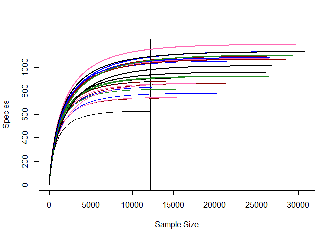<!-- -->

``` r
## set colours to grouping var (treat)
### determine how many treatment groups
length(unique(meta$treat.rn)) ## 11
```

    ## [1] 11

``` r
mycols <- c(rep("black",4),   ## source controls
            "gray",           ## unamended controls          
            "lightblue",      ## RW-0
            "cornflowerblue", ## RW-2
            "blue",           ## RW-3
            "#EABD8C",        ## BS-0
            "#FFAD00",        ## BS-1
            "#B06500")        ## BS-2

## grouping factor (treatment)
grp <- factor(meta$treat.rn)
cols <- mycols[grp]

png(filename = "./16S_outputs/rarefaction_curve.png",
    width = 6, height = 5, units = "in",
    res = 300)
plot(c(1, max(Nmax)), c(1, max(Smax)), xlab = "Sample Size",
     ylab = "ASVs", type = "n")
abline(v = raremax, lty = 2)
for (i in seq_along(out)) {
    N <- attr(out[[i]], "Subsample")
    lines(N, out[[i]], col = cols[i], lwd = 2)
}
dev.off()
```

    ## png 
    ##   2

## Alpha diversity

Run on rarified data in which host DNA is removed

Rarefaction is generally recommended for alpha diversity metrics (e.g.,
Shannon, Simpson, Observed OTUs) because these are sensitive to sampling
depth. It ensures that differences in diversity are due to biological
variation, not sequencing effort.

Shannon What it measures: \* Richness (number of taxa) \* Evenness (how
evenly distributed the taxa are) Interpretation: \* Higher values = more
diverse communities. \* Sensitive to rare taxa — even low-abundance
species contribute to the index. \* Typical range: Usually between 1.5
and 3.5 for ecological datasets. Higher for soil

InvSimpson What it measures: \* Dominance and evenness. \* Less
sensitive to rare taxa; emphasizes common taxa. Interpretation: \*
Higher values = more even communities. \* A community dominated by one
or few taxa will have a low inverse Simpson value. \* Typical range:
Starts at 1 (minimum diversity); higher values indicate more diversity.

``` r
## load relevant phyloseqs
load(file = "./16S_outputs/phyloseq_noHOST_rarified.Rda") ## loads rare_ps

## Extract richness metrics to pair with metadata
richness.df <- estimate_richness(rare_ps, measures = c("Shannon", 
                                                            "InvSimpson"))

## Combine with sample metadata
richness.df <- cbind(sample_data(rare_ps), richness.df)

## does diversity depend on species, amendment, timepoint?
### should just treat as a trait in indirect exp set up

richness.df$treat.rn <- relevel(richness.df$treat.rn, ref = "control-0")
richness.df$tp_treat <- paste0(richness.df$timepoint, richness.df$treat.rn)
richness.df$tp_treat <- as.factor(richness.df$tp_treat)
richness.df$tp_treat <- relevel(richness.df$tp_treat, ref = "TP1control-0")
richness.df$species_treat <- paste0(richness.df$species, "-",
                                    richness.df$treat.rn)
richness.df$species_treat <- as.factor(richness.df$species_treat)
richness.df$species_treat <- relevel(richness.df$species_treat, 
                                     ref = "no_plant-Garden Soil")

## set contrasts
options(contrasts=c("contr.treatment","contr.poly")) 

## 1) test single timepoint first to compare source materials

### function
source("./Source_code/div_tp1.func.R")

metric.list <- c("Shannon","InvSimpson")

div.out <- sapply(metric.list, 
                div_tp1.func, 
                df = richness.df %>%
                  filter(timepoint %in% c("other","TP1")) %>%
                  droplevels(.),
                      USE.NAMES = TRUE, 
                      simplify = FALSE)
```

    ## [1] "Shannon"

    ## `summarise()` has grouped output by 'species', 'treat.rn', 'tp_treat',
    ## 'species_tp'. You can override using the `.groups` argument.

    ## 
    ## Call:
    ## lm(formula = log(metric_value) ~ species_treat, data = df)
    ## 
    ## Residuals:
    ##      Min       1Q   Median       3Q      Max 
    ## -0.33695 -0.03621  0.01078  0.04056  0.30362 
    ## 
    ## Coefficients:
    ##                                     Estimate Std. Error t value Pr(>|t|)    
    ## (Intercept)                          1.90728    0.06306  30.248  < 2e-16 ***
    ## species_treatL-BS-0                 -0.04000    0.08917  -0.449 0.655720    
    ## species_treatL-BS-1                 -0.05127    0.08917  -0.575 0.567875    
    ## species_treatL-BS-2                 -0.04062    0.08917  -0.456 0.650720    
    ## species_treatL-control-0             0.01256    0.08917   0.141 0.888562    
    ## species_treatL-RW-0                 -0.25691    0.08917  -2.881 0.005826 ** 
    ## species_treatL-RW-1                 -0.08339    0.08917  -0.935 0.354202    
    ## species_treatL-RW-2                 -0.12192    0.08917  -1.367 0.177669    
    ## species_treatno_plant-Biosolids     -0.21826    0.08917  -2.448 0.017936 *  
    ## species_treatno_plant-GH: Soil + BS -0.31085    0.08917  -3.486 0.001031 ** 
    ## species_treatno_plant-GH: Soil only -0.24933    0.08917  -2.796 0.007322 ** 
    ## species_treatP-BS-0                 -0.20082    0.08917  -2.252 0.028748 *  
    ## species_treatP-BS-1                 -0.18628    0.08917  -2.089 0.041828 *  
    ## species_treatP-BS-2                 -0.11378    0.08917  -1.276 0.207880    
    ## species_treatP-control-0            -0.34867    0.08917  -3.910 0.000279 ***
    ## species_treatP-RW-0                 -0.13048    0.08917  -1.463 0.149657    
    ## species_treatP-RW-1                 -0.25117    0.08917  -2.817 0.006928 ** 
    ## species_treatP-RW-2                 -0.13492    0.08917  -1.513 0.136570    
    ## species_treatR-BS-0                 -0.11140    0.08917  -1.249 0.217402    
    ## species_treatR-BS-1                 -0.06572    0.08917  -0.737 0.464592    
    ## species_treatR-BS-2                 -0.06537    0.08917  -0.733 0.466954    
    ## species_treatR-control-0            -0.06445    0.08917  -0.723 0.473200    
    ## species_treatR-RW-0                 -0.07924    0.08917  -0.889 0.378468    
    ## species_treatR-RW-1                 -0.16452    0.08917  -1.845 0.070967 .  
    ## species_treatR-RW-2                 -0.10377    0.08917  -1.164 0.250067    
    ## ---
    ## Signif. codes:  0 '***' 0.001 '**' 0.01 '*' 0.05 '.' 0.1 ' ' 1
    ## 
    ## Residual standard error: 0.1092 on 50 degrees of freedom
    ## Multiple R-squared:  0.5256, Adjusted R-squared:  0.2979 
    ## F-statistic: 2.308 on 24 and 50 DF,  p-value: 0.006334
    ## 
    ## [1] "InvSimpson"

    ## `summarise()` has grouped output by 'species', 'treat.rn', 'tp_treat',
    ## 'species_tp'. You can override using the `.groups` argument.

    ## 
    ## Call:
    ## lm(formula = log(metric_value) ~ species_treat, data = df)
    ## 
    ## Residuals:
    ##      Min       1Q   Median       3Q      Max 
    ## -2.07629 -0.47144  0.05363  0.47027  1.91560 
    ## 
    ## Coefficients:
    ##                                     Estimate Std. Error t value Pr(>|t|)    
    ## (Intercept)                           6.0820     0.5196  11.706 6.19e-16 ***
    ## species_treatL-BS-0                  -0.8062     0.7348  -1.097 0.277832    
    ## species_treatL-BS-1                  -0.9106     0.7348  -1.239 0.221018    
    ## species_treatL-BS-2                  -0.7172     0.7348  -0.976 0.333735    
    ## species_treatL-control-0             -0.4328     0.7348  -0.589 0.558526    
    ## species_treatL-RW-0                  -2.6449     0.7348  -3.600 0.000731 ***
    ## species_treatL-RW-1                  -1.2106     0.7348  -1.648 0.105707    
    ## species_treatL-RW-2                  -1.1313     0.7348  -1.540 0.129939    
    ## species_treatno_plant-Biosolids      -1.4664     0.7348  -1.996 0.051437 .  
    ## species_treatno_plant-GH: Soil + BS  -2.2633     0.7348  -3.080 0.003358 ** 
    ## species_treatno_plant-GH: Soil only  -1.7700     0.7348  -2.409 0.019726 *  
    ## species_treatP-BS-0                  -1.8499     0.7348  -2.518 0.015067 *  
    ## species_treatP-BS-1                  -2.0119     0.7348  -2.738 0.008539 ** 
    ## species_treatP-BS-2                  -1.1804     0.7348  -1.606 0.114485    
    ## species_treatP-control-0             -2.4183     0.7348  -3.291 0.001834 ** 
    ## species_treatP-RW-0                  -1.9338     0.7348  -2.632 0.011264 *  
    ## species_treatP-RW-1                  -2.5686     0.7348  -3.496 0.001001 ** 
    ## species_treatP-RW-2                  -1.6132     0.7348  -2.195 0.032801 *  
    ## species_treatR-BS-0                  -1.0299     0.7348  -1.402 0.167190    
    ## species_treatR-BS-1                  -1.0590     0.7348  -1.441 0.155767    
    ## species_treatR-BS-2                  -0.8750     0.7348  -1.191 0.239341    
    ## species_treatR-control-0             -1.2858     0.7348  -1.750 0.086275 .  
    ## species_treatR-RW-0                  -1.3068     0.7348  -1.778 0.081404 .  
    ## species_treatR-RW-1                  -1.7178     0.7348  -2.338 0.023435 *  
    ## species_treatR-RW-2                  -1.5212     0.7348  -2.070 0.043618 *  
    ## ---
    ## Signif. codes:  0 '***' 0.001 '**' 0.01 '*' 0.05 '.' 0.1 ' ' 1
    ## 
    ## Residual standard error: 0.8999 on 50 degrees of freedom
    ## Multiple R-squared:  0.4376, Adjusted R-squared:  0.1676 
    ## F-statistic: 1.621 on 24 and 50 DF,  p-value: 0.07493

``` r
### combine dfs and save
aov <- lapply(div.out, `[[`, 2) %>%
  bind_rows(.)
write.csv(aov, "./16S_outputs/div_tp1_aov.csv",
          row.names = FALSE)
emm <- lapply(div.out, `[[`, 3) %>%
  bind_rows(.)
write.csv(emm, "./16S_outputs/div_tp1_emm.csv",
          row.names = FALSE)
cont <- lapply(div.out, `[[`, 4) %>%
  bind_rows(.)
write.csv(cont, "./16S_outputs/div_tp1_cont.csv",
          row.names = FALSE)
### Combine plots
TP1_plots <- plot_grid(div.out[["Shannon"]][[1]] +
                         labs(y = "Shannon"),
                       div.out[["InvSimpson"]][[1]] +
                         labs(y = "Inv. Simpson"),
                       ncol = 1)
### save plots
TP1_plots
```

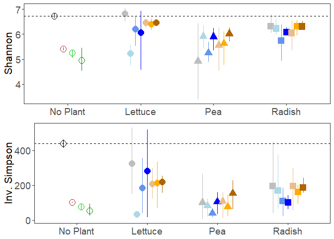<!-- -->

``` r
ggsave("./16S_outputs/TP1_div_plots.png",
       width=6, height=8, units = "in")

## 2)  species x timepoint x amendment? (exclude sources from TP1)

### function
source("./Source_code/div_treat.func.R")

metric.list <- c("Shannon","InvSimpson")

div.out <- sapply(metric.list, 
                div_treat.func, 
                df = richness.df %>%
                  filter(timepoint != "other") %>%
                  droplevels(.),
                      USE.NAMES = TRUE, 
                      simplify = FALSE)
```

    ## [1] "Shannon"

    ## `summarise()` has grouped output by 'timepoint', 'species', 'treat.rn',
    ## 'tp_treat'. You can override using the `.groups` argument.

    ## 
    ## Call:
    ## lm(formula = log(metric_value) ~ species * timepoint * treat.rn, 
    ##     data = df)
    ## 
    ## Residuals:
    ##      Min       1Q   Median       3Q      Max 
    ## -0.33695 -0.02280  0.00642  0.03390  0.30362 
    ## 
    ## Coefficients:
    ##                                     Estimate Std. Error t value Pr(>|t|)    
    ## (Intercept)                         1.919837   0.050256  38.201  < 2e-16 ***
    ## speciesP                           -0.361225   0.071072  -5.083 2.22e-06 ***
    ## speciesR                           -0.077010   0.071072  -1.084 0.281666    
    ## timepointTP2                       -0.046731   0.071072  -0.658 0.512644    
    ## treat.rnRW-0                       -0.269467   0.071072  -3.791 0.000281 ***
    ## treat.rnRW-1                       -0.095951   0.071072  -1.350 0.180626    
    ## treat.rnRW-2                       -0.134481   0.071072  -1.892 0.061913 .  
    ## treat.rnBS-0                       -0.052555   0.071072  -0.739 0.461688    
    ## treat.rnBS-1                       -0.063834   0.071072  -0.898 0.371670    
    ## treat.rnBS-2                       -0.053178   0.071072  -0.748 0.456411    
    ## speciesP:timepointTP2               0.367729   0.100511   3.659 0.000442 ***
    ## speciesR:timepointTP2               0.007549   0.100511   0.075 0.940306    
    ## speciesP:treat.rnRW-0               0.487648   0.100511   4.852 5.57e-06 ***
    ## speciesR:treat.rnRW-0               0.254677   0.100511   2.534 0.013140 *  
    ## speciesP:treat.rnRW-1               0.193442   0.100511   1.925 0.057667 .  
    ## speciesR:treat.rnRW-1              -0.004123   0.100511  -0.041 0.967377    
    ## speciesP:treat.rnRW-2               0.348224   0.100511   3.465 0.000839 ***
    ## speciesR:treat.rnRW-2               0.095159   0.100511   0.947 0.346481    
    ## speciesP:treat.rnBS-0               0.200405   0.100511   1.994 0.049412 *  
    ## speciesR:treat.rnBS-0               0.005608   0.100511   0.056 0.955639    
    ## speciesP:treat.rnBS-1               0.226224   0.100511   2.251 0.027015 *  
    ## speciesR:treat.rnBS-1               0.062567   0.100511   0.622 0.535308    
    ## speciesP:treat.rnBS-2               0.288065   0.100511   2.866 0.005252 ** 
    ## speciesR:treat.rnBS-2               0.052260   0.100511   0.520 0.604470    
    ## timepointTP2:treat.rnRW-0           0.275535   0.100511   2.741 0.007475 ** 
    ## timepointTP2:treat.rnRW-1           0.128882   0.100511   1.282 0.203276    
    ## timepointTP2:treat.rnRW-2           0.134782   0.100511   1.341 0.183548    
    ## timepointTP2:treat.rnBS-0           0.067337   0.100511   0.670 0.504731    
    ## timepointTP2:treat.rnBS-1           0.056697   0.100511   0.564 0.574200    
    ## timepointTP2:treat.rnBS-2           0.066560   0.100511   0.662 0.509647    
    ## speciesP:timepointTP2:treat.rnRW-0 -0.541248   0.142144  -3.808 0.000266 ***
    ## speciesR:timepointTP2:treat.rnRW-0 -0.201670   0.142144  -1.419 0.159665    
    ## speciesP:timepointTP2:treat.rnRW-1 -0.302613   0.142144  -2.129 0.036189 *  
    ## speciesR:timepointTP2:treat.rnRW-1  0.015337   0.142144   0.108 0.914334    
    ## speciesP:timepointTP2:treat.rnRW-2 -0.342604   0.142144  -2.410 0.018124 *  
    ## speciesR:timepointTP2:treat.rnRW-2 -0.078609   0.142144  -0.553 0.581715    
    ## speciesP:timepointTP2:treat.rnBS-0 -0.234831   0.142144  -1.652 0.102256    
    ## speciesR:timepointTP2:treat.rnBS-0  0.031298   0.142144   0.220 0.826263    
    ## speciesP:timepointTP2:treat.rnBS-1 -0.262260   0.142144  -1.845 0.068558 .  
    ## speciesR:timepointTP2:treat.rnBS-1 -0.021809   0.142144  -0.153 0.878430    
    ## speciesP:timepointTP2:treat.rnBS-2 -0.336643   0.142144  -2.368 0.020165 *  
    ## speciesR:timepointTP2:treat.rnBS-2 -0.059237   0.142144  -0.417 0.677931    
    ## ---
    ## Signif. codes:  0 '***' 0.001 '**' 0.01 '*' 0.05 '.' 0.1 ' ' 1
    ## 
    ## Residual standard error: 0.08705 on 84 degrees of freedom
    ## Multiple R-squared:  0.5087, Adjusted R-squared:  0.2689 
    ## F-statistic: 2.121 on 41 and 84 DF,  p-value: 0.001851
    ## 
    ## [1] "InvSimpson"

    ## `summarise()` has grouped output by 'timepoint', 'species', 'treat.rn',
    ## 'tp_treat'. You can override using the `.groups` argument.

    ## 
    ## Call:
    ## lm(formula = log(metric_value) ~ species * timepoint * treat.rn, 
    ##     data = df)
    ## 
    ## Residuals:
    ##      Min       1Q   Median       3Q      Max 
    ## -2.07629 -0.26775  0.04226  0.30974  1.91560 
    ## 
    ## Coefficients:
    ##                                    Estimate Std. Error t value Pr(>|t|)    
    ## (Intercept)                          5.6492     0.4476  12.620  < 2e-16 ***
    ## speciesP                            -1.9855     0.6331  -3.136 0.002358 ** 
    ## speciesR                            -0.8530     0.6331  -1.347 0.181461    
    ## timepointTP2                        -0.3878     0.6331  -0.613 0.541774    
    ## treat.rnRW-0                        -2.2122     0.6331  -3.494 0.000761 ***
    ## treat.rnRW-1                        -0.7779     0.6331  -1.229 0.222607    
    ## treat.rnRW-2                        -0.6986     0.6331  -1.103 0.272965    
    ## treat.rnBS-0                        -0.3734     0.6331  -0.590 0.556889    
    ## treat.rnBS-1                        -0.4779     0.6331  -0.755 0.452463    
    ## treat.rnBS-2                        -0.2844     0.6331  -0.449 0.654389    
    ## speciesP:timepointTP2                2.5917     0.8953   2.895 0.004833 ** 
    ## speciesR:timepointTP2                0.6514     0.8953   0.728 0.468872    
    ## speciesP:treat.rnRW-0                2.6966     0.8953   3.012 0.003428 ** 
    ## speciesR:treat.rnRW-0                2.1911     0.8953   2.447 0.016471 *  
    ## speciesP:treat.rnRW-1                0.6275     0.8953   0.701 0.485271    
    ## speciesR:treat.rnRW-1                0.3458     0.8953   0.386 0.700297    
    ## speciesP:treat.rnRW-2                1.5037     0.8953   1.680 0.096757 .  
    ## speciesR:treat.rnRW-2                0.4632     0.8953   0.517 0.606249    
    ## speciesP:treat.rnBS-0                0.9418     0.8953   1.052 0.295820    
    ## speciesR:treat.rnBS-0                0.6292     0.8953   0.703 0.484092    
    ## speciesP:treat.rnBS-1                0.8842     0.8953   0.988 0.326148    
    ## speciesR:treat.rnBS-1                0.7047     0.8953   0.787 0.433439    
    ## speciesP:treat.rnBS-2                1.5224     0.8953   1.700 0.092751 .  
    ## speciesR:treat.rnBS-2                0.6952     0.8953   0.777 0.439629    
    ## timepointTP2:treat.rnRW-0            2.7002     0.8953   3.016 0.003388 ** 
    ## timepointTP2:treat.rnRW-1            1.6050     0.8953   1.793 0.076623 .  
    ## timepointTP2:treat.rnRW-2            1.3158     0.8953   1.470 0.145376    
    ## timepointTP2:treat.rnBS-0            1.0082     0.8953   1.126 0.263310    
    ## timepointTP2:treat.rnBS-1            1.0518     0.8953   1.175 0.243365    
    ## timepointTP2:treat.rnBS-2            0.9350     0.8953   1.044 0.299296    
    ## speciesP:timepointTP2:treat.rnRW-0  -3.3179     1.2661  -2.621 0.010417 *  
    ## speciesR:timepointTP2:treat.rnRW-0  -1.9384     1.2661  -1.531 0.129539    
    ## speciesP:timepointTP2:treat.rnRW-1  -1.8285     1.2661  -1.444 0.152411    
    ## speciesR:timepointTP2:treat.rnRW-1  -0.6772     1.2661  -0.535 0.594170    
    ## speciesP:timepointTP2:treat.rnRW-2  -1.9589     1.2661  -1.547 0.125579    
    ## speciesR:timepointTP2:treat.rnRW-2  -0.8136     1.2661  -0.643 0.522246    
    ## speciesP:timepointTP2:treat.rnBS-0  -1.7595     1.2661  -1.390 0.168306    
    ## speciesR:timepointTP2:treat.rnBS-0  -0.6402     1.2661  -0.506 0.614461    
    ## speciesP:timepointTP2:treat.rnBS-1  -1.6856     1.2661  -1.331 0.186685    
    ## speciesR:timepointTP2:treat.rnBS-1  -0.6689     1.2661  -0.528 0.598702    
    ## speciesP:timepointTP2:treat.rnBS-2  -2.4064     1.2661  -1.901 0.060787 .  
    ## speciesR:timepointTP2:treat.rnBS-2  -1.0289     1.2661  -0.813 0.418729    
    ## ---
    ## Signif. codes:  0 '***' 0.001 '**' 0.01 '*' 0.05 '.' 0.1 ' ' 1
    ## 
    ## Residual standard error: 0.7753 on 84 degrees of freedom
    ## Multiple R-squared:  0.5452, Adjusted R-squared:  0.3232 
    ## F-statistic: 2.456 on 41 and 84 DF,  p-value: 0.0002559

``` r
aov <- lapply(div.out, `[[`, 2) %>%
  bind_rows(.)
write.csv(aov, "./16S_outputs/div_treat_aov.csv",
          row.names = FALSE)
emm <- lapply(div.out, `[[`, 3) %>%
  bind_rows(.)
write.csv(emm, "./16S_outputs/div_treat_emm.csv",
          row.names = FALSE)
cont <- lapply(div.out, `[[`, 4) %>%
  bind_rows(.)
write.csv(cont, "./16S_outputs/div_treat_cont.csv",
          row.names = FALSE)
### Combine plots
treat_plots <- plot_grid(div.out[["Shannon"]][[1]] +
                         labs(y = "Shannon"),
                       div.out[["InvSimpson"]][[1]] +
                         labs(y = "Inv. Simpson"),
                       ncol = 2)
### save plots
treat_plots
```

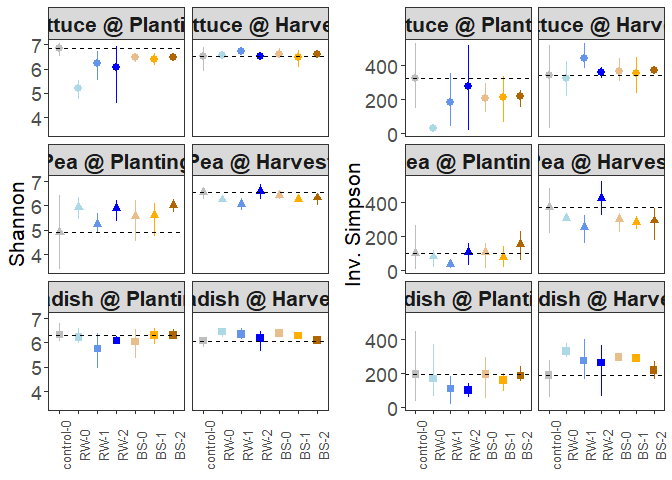<!-- -->

``` r
ggsave("./16S_outputs/treat_div_plots.png",
       width=10, height=7, units = "in")

## examine how diversity changes over time:
richness.df.l <- richness.df %>%
      filter(!timepoint %in% c("other")) %>%
      droplevels(.) %>%
  pivot_longer(
    cols = c("Shannon", "InvSimpson"),
    names_to = "Metric",
    values_to = "units"
  )

richness.df.l$Metric <- factor(richness.df.l$Metric,
                               levels = c("Shannon",
                                          "InvSimpson"))
richness.df.l$timepoint <- factor(richness.df.l$timepoint,
                                  levels = c("other","TP1","TP2"))
levels(richness.df.l$timepoint) <- c("other","Planting","Harvest")

# Custom labels for the 'species_tp' facet
  labs <- c(
    no_plant = "No Plant",
    L = "Lettuce",
    P = "Pea",
    R = "Radish"
  )
## plot
p <-
    ggplot(data = richness.df.l,
      aes(x = timepoint, y = units, colour = treat.rn)) +
    geom_line(aes(group = pot_ID),
              position = position_dodge2(0.2)) +
    geom_point(size = 3, alpha = 0.8, aes(group = pot_ID),
               position = position_dodge2(0.2)) + 
    scale_color_manual(values = c("gray",
                                  "lightblue",
                                  "cornflowerblue",
                                  "blue",
                                  "#EABD8C",
                                  "#FFAD00",
                                  "#B06500")) +
    guides(color = "none", shape = "none") +
    scale_shape_manual(values = c(16,17,15),
                       labels = c("Lettuce", "Pea", "Radish")) + 
    ggtitle(NULL) + 
    labs(x = NULL, y = NULL) +
    facet_grid(Metric~Species, scales = "free_y",
               labeller = labeller("Species" = labs)) +  
    theme_bw() + 
    theme(axis.title.x = element_text(size = 16),
          axis.text.x = element_text(size = 14),
          axis.title.y = element_text(size = 16),
          axis.text.y = element_text(size = 14),
          strip.text = element_text(size = 14, face = "bold"),
          panel.grid.major = element_blank(),
          panel.grid.minor = element_blank())
p
```

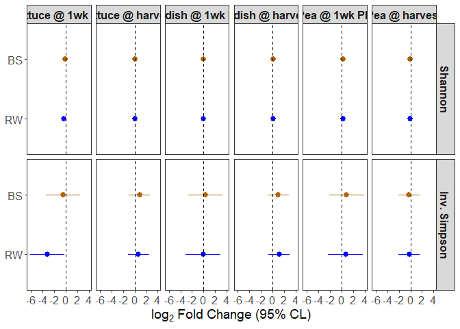<!-- -->

``` r
## save plot
ggsave("./16S_outputs/alphadiv_noHOST_TP_rarified.png",
       width = 8, height = 5, units = "in")


## optional code: from phyloseq package
## figures
source("./Source_code/alpha_plot.func.R")

times.list <- rep(c("TP1","TP2"),2)
metrics.list <- c(rep("Shannon",2),rep("InvSimpson",2))
combs.list <- paste0(times.list, "_", metrics.list)

plots.out <- mapply(FUN = alpha_plot.func, 
                      combs = combs.list, 
                      times = times.list, 
                      metrics = metrics.list, 
                      USE.NAMES = TRUE, 
                      SIMPLIFY = FALSE,
                      MoreArgs = list(df = rare_ps)
                   )
```

    ## [1] "TP1_Shannon"
    ## [1] "TP2_Shannon"
    ## [1] "TP1_InvSimpson"
    ## [1] "TP2_InvSimpson"

``` r
## combine plots (all crops)
fig1 <- plot_grid(plots.out[["TP1_Shannon"]] +
                    ggtitle("One week post planting") +
                    labs(y = "Shannons") +
                    scale_y_continuous(limits = c(3, 8)) +
                    theme(axis.title.y = element_text(size = 14,
                                                      angle = 90,
                                                      vjust = 0.5),
                          axis.text.y = element_text(size = 12),
                          plot.title = element_text(hjust = 0.5, 
                                                    size = 18,
                                                    face = "bold"),
                          plot.margin = margin(t = 0.1, r = 0.1,
                                               b = 0.1, l = 0.1, unit = "cm"),
                          strip.text.x = element_text(size = 14, face = "bold")), 
                  plots.out[["TP1_InvSimpson"]] +
                    labs(y = "Inverse Simpsons") +
                    scale_y_continuous(limits = c(0, 600)) +
                    theme(axis.title.y = element_text(size = 14,
                                                      angle = 90,
                                                      vjust = 0.5),
                          axis.text.y = element_text(size = 12),
                          axis.title.x = element_text(size = 14),
                          axis.text.x = element_text(size = 12,
                                                     angle = 90,
                                                     vjust = 0.5),
                          plot.margin = margin(t = 0.1, r = 0.1,
                                               b = 0.1, l = 0.1, unit = "cm")),
                  rel_widths = c(1.1, 1),
          ncol = 1,
          nrow = 2,
          align = "v",
          labels = NULL)

fig2 <- plot_grid(plots.out[["TP2_Shannon"]] +
                    ggtitle("At harvest") +
                    scale_y_continuous(limits = c(3, 8)) +
                    theme(plot.title = element_text(hjust = 0.5, 
                                                    size = 18,
                                                    face = "bold"),
                          plot.margin = margin(t = 0.1, r = 0.1,
                                               b = 0.1, l = 0.5, unit = "cm"),
                          strip.text.x = element_text(size = 14, face = "bold")),
                  
                  plots.out[["TP2_InvSimpson"]] +
                    scale_y_continuous(limits = c(0, 600)) +
                    theme(axis.title.x = element_text(size = 14),
                          axis.text.x = element_text(size = 12,
                                                     angle = 90,
                                                     vjust = 0.5),
                          plot.margin = margin(t = 0.1, r = 0.1,
                                               b = 0.1, l = 0.5, unit = "cm")),
                  rel_widths = c(1.1, 1),
          ncol = 1,
          nrow = 2,
          align = "v",
          labels = NULL)

fig <- plot_grid(fig1, fig2,
                ncol = 2,
                nrow = 1,
                rel_widths = c(1.1, 1),
                align = "h",
                labels = NULL)
fig
```

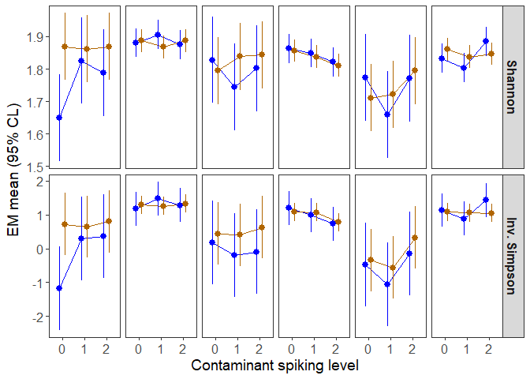<!-- -->

``` r
ggsave("./16S_outputs/alphadiv_noHOST_rarified.png",
       width = 8, height = 5, units = "in")
  
## 3) does alpha diversity correlate with plant traits? only look at tp2

### filter to P_TP1
richness.peaTP2 <- richness.df %>%
  filter(species_tp == "P_TP2") %>%
  droplevels(.)

### traits to run through
trait.list <- rep(c(
               "plant_height4",
               "chlorophyll_content4_mean", 
               "leaf_number2",              
               "wet_shoot_weight",         
               "dry_shoot_weight",          
               "wet_root_weight",           
               "dry_root_weight",           
               "dry_total_weight",         
               "shoot_root_ratio",          
               "shoot_moisture"  
                ), 2)

## add response before each trait (to get emmean)
trait.list <- paste0("resp_norm_", trait.list)

## create list of traits/amends to loop through:
metric.list <- c(rep(c("Shannon"),10), rep(c("InvSimpson"),10))
comb.list <- paste0(trait.list, ", ", metric.list)

## source the function:
source("./Source_code/div_trait.func.R")

lm.out <- mapply(FUN = div_trait.func, 
                      combs = comb.list, 
                      traits = trait.list, 
                      metrics = metric.list, 
                      USE.NAMES = TRUE, 
                      SIMPLIFY = FALSE,
                      MoreArgs = list(df = richness.peaTP2))
```

    ## [1] "resp_norm_plant_height4, Shannon"

    ## [1] "resp_norm_chlorophyll_content4_mean, Shannon"

    ## [1] "resp_norm_leaf_number2, Shannon"

    ## [1] "resp_norm_wet_shoot_weight, Shannon"

    ## [1] "resp_norm_dry_shoot_weight, Shannon"

    ## [1] "resp_norm_wet_root_weight, Shannon"

    ## [1] "resp_norm_dry_root_weight, Shannon"

    ## [1] "resp_norm_dry_total_weight, Shannon"

    ## [1] "resp_norm_shoot_root_ratio, Shannon"

    ## [1] "resp_norm_shoot_moisture, Shannon"

    ## [1] "resp_norm_plant_height4, InvSimpson"

    ## [1] "resp_norm_chlorophyll_content4_mean, InvSimpson"

    ## [1] "resp_norm_leaf_number2, InvSimpson"

    ## [1] "resp_norm_wet_shoot_weight, InvSimpson"

    ## [1] "resp_norm_dry_shoot_weight, InvSimpson"

    ## [1] "resp_norm_wet_root_weight, InvSimpson"

    ## [1] "resp_norm_dry_root_weight, InvSimpson"

    ## [1] "resp_norm_dry_total_weight, InvSimpson"

    ## [1] "resp_norm_shoot_root_ratio, InvSimpson"

    ## [1] "resp_norm_shoot_moisture, InvSimpson"

``` r
### coeffs
lm_coeffs <- lapply(lm.out, `[[`, 2) %>%
  bind_rows(.)
write.csv(lm_coeffs, "./16S_outputs/models/lm_coeff.csv", 
          row.names = TRUE)

### Combine plots
plot_list <- lapply(lm.out, `[[`, 1) %>%
  list(.)
Shannon_plots <- plot_grid(plotlist = plot_list[[1]][1:10], ncol = 2)
Simpson_plots <- plot_grid(plotlist = plot_list[[1]][11:20], ncol = 2)

### save plots
Shannon_plots
```

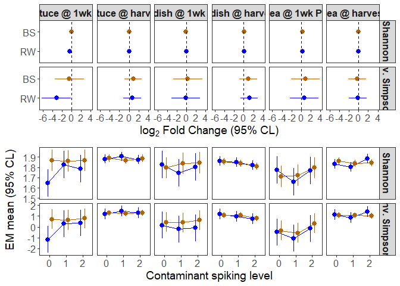<!-- -->

``` r
ggsave("./16S_outputs/Shannon_v_traits.png",
       width=6, height=12, units = "in")

Simpson_plots
```

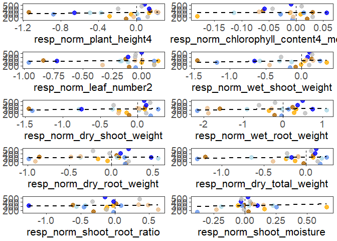<!-- -->

``` r
ggsave("./16S_outputs/Simpson_v_traits.png",
       width=6, height=12, units = "in")
```

## Beta diversity

PCoA relative abundance OTUs

If your samples have widely varying sequencing depths, rarefaction can
help make comparisons more fair. If your depths are fairly uniform, you
might skip rarefaction and use methods that account for library size
(e.g., DESeq2, variance-stabilizing transformation, or CLR
transformation for compositional data)

Our samples have widely varying sequencing depths. Use rarefied df

``` r
## load relevant data
load(file = "./16S_outputs/phyloseq_noHOST_rarified.Rda") ## loads rare_ps
## metadata file
load(file = "./16S_outputs/metadata_cleaned.Rda") ## loads meta

## PCoA plot with Bray Curtis distances
## ordinate
RA.ord <- ordinate(rare_ps, method = "PCoA", 
                            distance = "bray")

## plot
### add in ggplot aesthetics:
p1 <-  plot_ordination(rare_ps, RA.ord, axes = c(1,2))

p1$layers <- p1$layers[-1]
# To remove the extra jitter layer

p <- p1 +
  geom_point(aes(colour = treat.rn, shape = timepoint), 
             size = 5,
             alpha = 0.7) + 
  scale_color_manual(values = c("black",
                                "brown",
                                "green3",
                                "green4",
                                "gray",
                                "lightblue",
                                "cornflowerblue",
                                "blue",
                                "#EABD8C",
                                "#FFAD00",
                                "#B06500")) +
  # guides(colour = "none", shape = "none") +
  theme_bw() + 
  theme(plot.title = element_text(hjust = 0.5, size = 16, face = "bold"), 
        axis.title.x = element_text(size=14), 
        axis.title.y = element_text(size=14), 
        axis.text.x = element_text(size = 12), 
        axis.text.y = element_text(size= 12), 
        legend.text = element_text(size = 10), 
        legend.title = element_text(size =10),
        panel.grid.major = element_blank(),
        panel.grid.minor = element_blank())
p
```

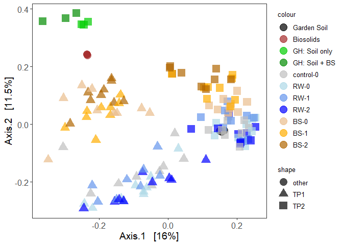<!-- -->

``` r
ggsave("./16S_outputs/PCoA_plots_all-data.png",
       width = 6, height = 6, units = "in",
       dpi = 400)

#Extract Eigenvalues
eigenvalues <- RA.ord$values$Eigenvalues

# Number of components
n <- length(eigenvalues)

# Calculate broken stick model
broken_stick <- sapply(1:n, function(i) {
  sum(1 / (i:n)) / n * 100
})

# Create a dataframe for plotting
scree_data <- data.frame(
  PrincipalCoordinate = 1:n,
  VarianceExplained = eigenvalues / sum(eigenvalues) * 100,
  BrokenStickModel = broken_stick
)

# Visualize observed vs. broken stick model (optional)
scree_bs <- ggplot(scree_data, 
                   aes(x = PrincipalCoordinate)) + 
  geom_line(aes(y = VarianceExplained),
                  color = "blue", 
                  size = 1, 
                  linetype = "solid") + 
    geom_line(aes(y = BrokenStickModel), 
              color = "red", 
              size = 1, 
              linetype = "dashed") +
    geom_point(aes(y = VarianceExplained)) +
    labs(title = "Scree Plot for PCoA and Broken Stick Model",
         x = "Principal Coordinate",
         y = "Variance Explained (%)") + 
    theme_minimal() +
  theme(plot.title = element_text(hjust = 0.5, size = 16, face = "bold"))
```

    ## Warning: Using `size` aesthetic for lines was deprecated in ggplot2 3.4.0.
    ## ℹ Please use `linewidth` instead.
    ## This warning is displayed once every 8 hours.
    ## Call `lifecycle::last_lifecycle_warnings()` to see where this warning was
    ## generated.

``` r
scree_bs
```

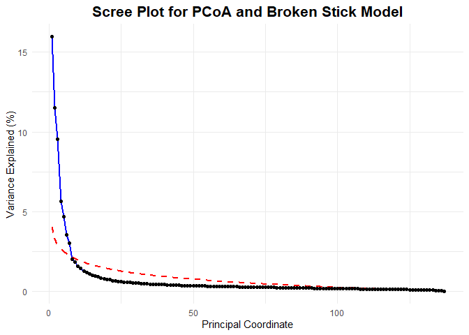<!-- -->

``` r
ggsave("./16S_outputs/scree_plot_all-data.png",
       width = 6, height = 5, units = "in",
       dpi = 400)

## function to compare treatments within each timepoint
source("./Source_code/beta_plot.func.R")

times.list <- rep(c("TP1","TP2"),2)
metrics.list <- c(rep("PCoA",2),rep("NMDS",2))
combs.list <- paste0(times.list, "_", metrics.list)

plots.out <- mapply(FUN = beta_plot.func, 
                      combs = combs.list, 
                      times = times.list, 
                      metrics = metrics.list, 
                      USE.NAMES = TRUE, 
                      SIMPLIFY = FALSE,
                      MoreArgs = list(df = rare_ps)
                   )
```

    ## [1] "TP1_PCoA"

    ## [1] "TP2_PCoA"

    ## [1] "TP1_NMDS"
    ## Square root transformation
    ## Wisconsin double standardization
    ## Run 0 stress 0.1555584 
    ## Run 1 stress 0.1555585 
    ## ... Procrustes: rmse 0.0002853673  max resid 0.001351522 
    ## ... Similar to previous best
    ## Run 2 stress 0.15584 
    ## ... Procrustes: rmse 0.009057366  max resid 0.04899202 
    ## Run 3 stress 0.1555194 
    ## ... New best solution
    ## ... Procrustes: rmse 0.01367243  max resid 0.08235869 
    ## Run 4 stress 0.1818336 
    ## Run 5 stress 0.1558786 
    ## ... Procrustes: rmse 0.01485937  max resid 0.0795835 
    ## Run 6 stress 0.1558138 
    ## ... Procrustes: rmse 0.006869595  max resid 0.0432071 
    ## Run 7 stress 0.155752 
    ## ... Procrustes: rmse 0.007971097  max resid 0.04527803 
    ## Run 8 stress 0.1562218 
    ## Run 9 stress 0.1555168 
    ## ... New best solution
    ## ... Procrustes: rmse 0.002675339  max resid 0.01181843 
    ## Run 10 stress 0.1558462 
    ## ... Procrustes: rmse 0.01312687  max resid 0.05505922 
    ## Run 11 stress 0.1556561 
    ## ... Procrustes: rmse 0.0147205  max resid 0.08397963 
    ## Run 12 stress 0.1555165 
    ## ... New best solution
    ## ... Procrustes: rmse 0.0001264491  max resid 0.0005630328 
    ## ... Similar to previous best
    ## Run 13 stress 0.1562219 
    ## Run 14 stress 0.1559911 
    ## ... Procrustes: rmse 0.0172251  max resid 0.07905925 
    ## Run 15 stress 0.1556562 
    ## ... Procrustes: rmse 0.01476321  max resid 0.08417513 
    ## Run 16 stress 0.1824192 
    ## Run 17 stress 0.1557521 
    ## ... Procrustes: rmse 0.009442058  max resid 0.05049906 
    ## Run 18 stress 0.1557507 
    ## ... Procrustes: rmse 0.009699316  max resid 0.05135317 
    ## Run 19 stress 0.1558176 
    ## ... Procrustes: rmse 0.01454108  max resid 0.08080951 
    ## Run 20 stress 0.1556438 
    ## ... Procrustes: rmse 0.005353962  max resid 0.02834264 
    ## *** Best solution repeated 1 times
    ## [1] "TP2_NMDS"
    ## Square root transformation
    ## Wisconsin double standardization
    ## Run 0 stress 0.1792268 
    ## Run 1 stress 0.1791917 
    ## ... New best solution
    ## ... Procrustes: rmse 0.01009445  max resid 0.05997876 
    ## Run 2 stress 0.2484264 
    ## Run 3 stress 0.1791301 
    ## ... New best solution
    ## ... Procrustes: rmse 0.009054095  max resid 0.06459537 
    ## Run 4 stress 0.2684059 
    ## Run 5 stress 0.1791917 
    ## ... Procrustes: rmse 0.009058001  max resid 0.06457342 
    ## Run 6 stress 0.1792268 
    ## ... Procrustes: rmse 0.007159028  max resid 0.05098633 
    ## Run 7 stress 0.1791301 
    ## ... Procrustes: rmse 1.458656e-05  max resid 0.000102312 
    ## ... Similar to previous best
    ## Run 8 stress 0.1791302 
    ## ... Procrustes: rmse 5.52962e-05  max resid 0.0004017329 
    ## ... Similar to previous best
    ## Run 9 stress 0.1790861 
    ## ... New best solution
    ## ... Procrustes: rmse 0.01182448  max resid 0.06564732 
    ## Run 10 stress 0.1792872 
    ## ... Procrustes: rmse 0.009505274  max resid 0.06218172 
    ## Run 11 stress 0.2097836 
    ## Run 12 stress 0.1791917 
    ## ... Procrustes: rmse 0.006197701  max resid 0.04308765 
    ## Run 13 stress 0.1790861 
    ## ... Procrustes: rmse 2.34598e-05  max resid 0.0001566091 
    ## ... Similar to previous best
    ## Run 14 stress 0.1791301 
    ## ... Procrustes: rmse 0.01183017  max resid 0.06573204 
    ## Run 15 stress 0.1792267 
    ## ... Procrustes: rmse 0.008540531  max resid 0.06160735 
    ## Run 16 stress 0.1791301 
    ## ... Procrustes: rmse 0.01182662  max resid 0.06573828 
    ## Run 17 stress 0.1791917 
    ## ... Procrustes: rmse 0.006159348  max resid 0.0427883 
    ## Run 18 stress 0.1792268 
    ## ... Procrustes: rmse 0.008492581  max resid 0.06131902 
    ## Run 19 stress 0.1792267 
    ## ... Procrustes: rmse 0.008520721  max resid 0.06149965 
    ## Run 20 stress 0.1792871 
    ## ... Procrustes: rmse 0.009534003  max resid 0.06236567 
    ## *** Best solution repeated 1 times

``` r
## combine plots (all crops)
fig1 <- plot_grid(plots.out[["TP1_PCoA"]][[1]] +
                    ggtitle("One week post planting") +
                    scale_y_continuous(limits = c(-0.55,0.25)), 
                  plots.out[["TP2_PCoA"]][[1]] +
                    ggtitle("At harvest") +
                    scale_y_continuous(limits = c(-0.55,0.25)),
                  rel_widths = c(1, 1),
          ncol = 2,
          nrow = 1,
          align = "h",
          labels = NULL)
```

    ## Warning: Removed 1 row containing missing values or values outside the scale range
    ## (`geom_point()`).

``` r
fig1
```

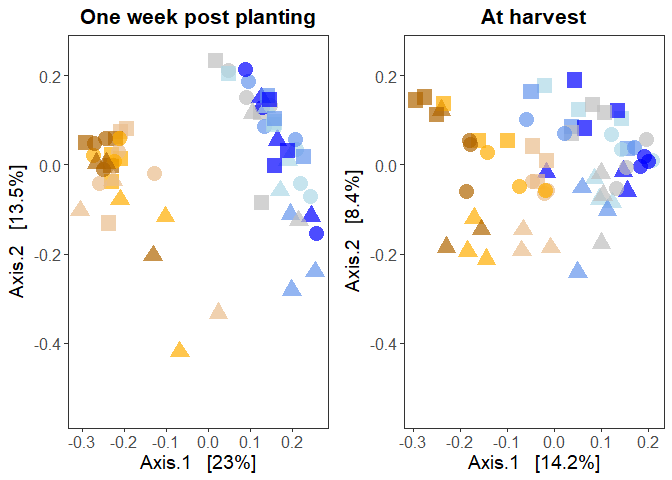<!-- -->

``` r
ggsave("./16S_outputs/PCoA_plots.png",
       width = 8, height = 4, units = "in",
       dpi = 400)

fig2 <- plot_grid(plots.out[["TP1_NMDS"]][[1]] +
                    ggtitle("One week post planting") +
                    scale_y_continuous(limits = c(-0.7,0.6)), 
                  plots.out[["TP2_NMDS"]][[1]] +
                    ggtitle("At harvest") +
                    scale_y_continuous(limits = c(-0.7,0.6)),
                  rel_widths = c(1, 1),
          ncol = 2,
          nrow = 1,
          align = "h",
          labels = NULL)
fig2
```

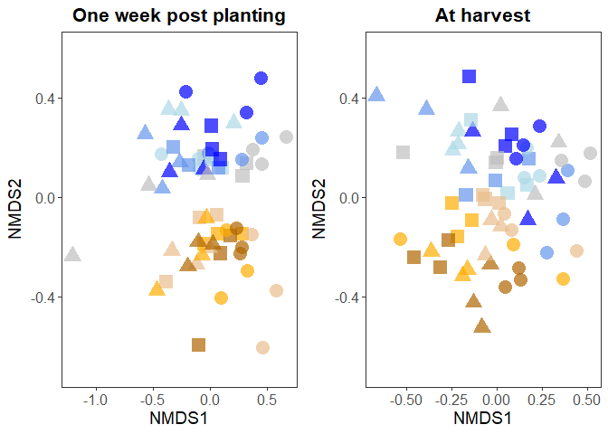<!-- -->

``` r
ggsave("./16S_outputs/NMDS_plots.png",
       width = 8, height = 4, units = "in",
       dpi = 400)
```

### Overlay traits as vectors (peas only, TP2)

``` r
## load relevant data
load(file = "./16S_outputs/phyloseq_noHOST_rarified.Rda") ## loads rare_ps
## metadata file
load(file = "./16S_outputs/metadata_cleaned.Rda") ## loads meta

## subset both to peas only and TP2
rare_ps.peas <- prune_samples(sample_data(rare_ps)$species_tp %in% c("P_TP2"), 
                              rare_ps)
meta.peas <- meta %>%
  filter(species_tp == "P_TP2") %>%
  droplevels(.)

sample_list <- unique(meta.peas$Sample_ID) ## 21 samples

# Example: abundance_table is a data frame or matrix
# Rows = samples, Columns = taxa
otu_table <- read.csv("./16S_outputs/otu_table_noHOST_rarified.csv", 
                      row.names = 1)

## subset OTU table to these samples
otu_subset <- otu_table[rownames(otu_table) %in% sample_list, ]

## normalize
rel_abundance <- decostand(otu_subset, method = "total")

# Bray-Curtis dissimilarity
bray_dist <- vegdist(otu_subset, method = "bray")

# Perform ordination (e.g., NMDS or PCoA)
nmds <- metaMDS(bray_dist, k = 2, trymax = 100)
```

    ## Run 0 stress 0.1029304 
    ## Run 1 stress 0.1029304 
    ## ... New best solution
    ## ... Procrustes: rmse 6.938708e-05  max resid 0.0002245845 
    ## ... Similar to previous best
    ## Run 2 stress 0.1050569 
    ## Run 3 stress 0.1036993 
    ## Run 4 stress 0.1054208 
    ## Run 5 stress 0.1052144 
    ## Run 6 stress 0.1054211 
    ## Run 7 stress 0.1036995 
    ## Run 8 stress 0.1036994 
    ## Run 9 stress 0.1036994 
    ## Run 10 stress 0.1029303 
    ## ... New best solution
    ## ... Procrustes: rmse 0.0002050833  max resid 0.0006671094 
    ## ... Similar to previous best
    ## Run 11 stress 0.1029304 
    ## ... Procrustes: rmse 0.0002306846  max resid 0.0007535619 
    ## ... Similar to previous best
    ## Run 12 stress 0.1050571 
    ## Run 13 stress 0.1052141 
    ## Run 14 stress 0.1251926 
    ## Run 15 stress 0.1052146 
    ## Run 16 stress 0.1051955 
    ## Run 17 stress 0.1226563 
    ## Run 18 stress 0.105215 
    ## Run 19 stress 0.1304674 
    ## Run 20 stress 0.1052147 
    ## *** Best solution repeated 2 times

``` r
trait.list <- c(
               "plant_height4",
               "chlorophyll_content4_mean", 
               "leaf_number2",              
               "wet_shoot_weight",         
               "dry_shoot_weight",          
               "wet_root_weight",           
               "dry_root_weight",           
               "dry_total_weight",         
               "shoot_root_ratio",          
               "shoot_moisture"  
                )

## add response before each trait (to get emmean)
trait.list.f <- paste0("response_", trait.list)

env_data <- meta.peas[, c(trait.list.f, "treat.rn")]

fit <- envfit(nmds, env_data, permutations = 999)

# Plot NMDS ordination
plot(nmds, type = "n")
```

    ## species scores not available

``` r
points(nmds, display = "sites", col = "gray", pch = 16)
plot(fit)
```

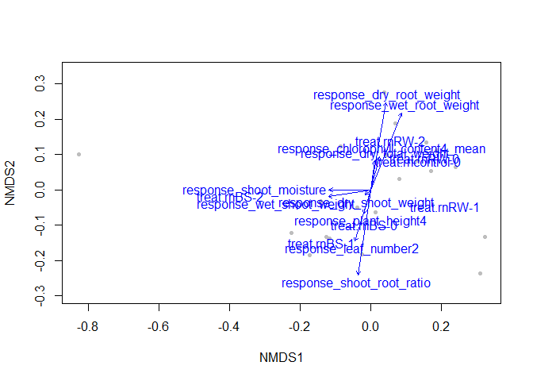<!-- -->

``` r
# summarize covariate results
results.traits <- data.frame(
  r = fit$vectors$r,
  p = fit$vectors$pvals,
  fit$vectors$arrows)
print(results.traits)
```

    ##                                               r     p      NMDS1         NMDS2
    ## response_plant_height4             0.0057047585 0.944 -0.2933777 -0.9559966003
    ## response_chlorophyll_content4_mean 0.0110074680 0.906  0.2597082  0.9656871508
    ## response_leaf_number2              0.0266358575 0.763 -0.2934237 -0.9559824975
    ## response_wet_shoot_weight          0.0171222135 0.855 -0.9891642 -0.1468136954
    ## response_dry_shoot_weight          0.0005665145 0.995 -0.7551156 -0.6555916110
    ## response_wet_root_weight           0.0642071782 0.528  0.3695530  0.9292096478
    ## response_dry_root_weight           0.0734630382 0.500  0.1694548  0.9855379572
    ## response_dry_total_weight          0.0079539174 0.931  0.1194045  0.9928456887
    ## response_shoot_root_ratio          0.0688519468 0.500 -0.1526812 -0.9882754892
    ## response_shoot_moisture            0.0163073384 0.842 -1.0000000 -0.0001506837

``` r
## summarize factor results
centroids <- as.data.frame(fit$factors$centroids)
centroids$Group <- rownames(centroids)
r_squared <- fit$factors$r
p_value <- fit$factors$pvals

results.treats <- data.frame(
  Factor = names(r_squared),
  R2 = r_squared,
  P = p_value
)
print(results.treats)
```

    ##            Factor        R2     P
    ## treat.rn treat.rn 0.6328404 0.001

``` r
# 1. Extract NMDS site scores (sample coordinates)
nmds_scores <- as.data.frame(scores(nmds, display = "sites"))
nmds_scores$SampleID <- rownames(nmds_scores)

# 2. Extract envfit vectors (arrows)
vectors <- as.data.frame(fit$vectors$arrows)
vectors$r <- fit$vectors$r
vectors$pval <- fit$vectors$pvals
vectors$Trait <- rownames(vectors)

# 3. Extract Factor Centroids (e.g., Treatment)
centroids <- as.data.frame(fit$factors$centroids)
centroids$Group <- rownames(centroids)


# 4. Filter significant vectors (optional)
#vectors_sig <- subset(vectors, pval <= 0.05)

## add in other relevant metadata (treat)
nmds_scores$treat <- meta.peas$treat.rn[match(nmds_scores$SampleID, 
                                      meta.peas$Sample_ID)]
nmds_scores$Source <- meta.peas$Source[match(nmds_scores$SampleID, 
                                      meta.peas$Sample_ID)]

selected.traits <- c("response_shoot_root_ratio",
            "response_dry_root_weight",
            "response_shoot_moisture")

new.names <- c("Shoot to root ratio",
               "Dry root weight", 
               "Shoot moisture")

# Create a copy of the trait names
vectors$trait.rn <- vectors$Trait

# Replace matched traits with new names
match_idx <- match(vectors$Trait, selected.traits)

# Only replace where there's a match
vectors$trait.rn[!is.na(match_idx)] <- new.names[match_idx[!is.na(match_idx)]]

scale_factor <- 3  # Try 3–10 depending on your plot

# 4. Plot using ggplot2
ggplot(data = nmds_scores, aes(x = NMDS1, y = NMDS2)) +
  geom_point(aes(color = treat), size = 3) +
  # stat_ellipse(type = "t", level = 0.95,
  #             aes(group = Source),
  #             linetype = 2) +  # 95% confidence ellipse
  # Factor centroids
  # geom_point(data = centroids, aes(x = NMDS1, y = NMDS2), 
  #            color = "red", size = 4, shape = 17) +
  # geom_text_repel(data = centroids, 
  #                 aes(x = NMDS1, y = NMDS2, label = Group), 
  #                 color = "red", size = 4) +
  # Continuous trait vectors
  geom_segment(data = vectors %>%
              filter(Trait %in% selected.traits),
             aes(x = 0, y = 0, xend = NMDS1 * r * scale_factor, 
                 yend = NMDS2 * r * scale_factor),
             arrow = arrow(length = unit(0.25, "cm")),
             color = "blue") +
  geom_text(data = vectors %>%
              filter(Trait %in% selected.traits),
          aes(x = NMDS1 * r * scale_factor * 1.1, 
              y = NMDS2 * r * scale_factor * 1.1, 
              label = trait.rn),
          color = "blue", size = 4) +
  # additional formatting
  scale_color_manual(values = c("gray",
                                  "lightblue",
                                  "cornflowerblue",
                                  "blue",
                                  "#EABD8C",
                                  "#FFAD00",
                                  "#B06500")) +
  guides(colour = "none") +
  labs(x = "NMDS1", y = "NMDS2") +
  theme_bw() +
  theme(
    axis.title.x = element_text(size = 16),
          axis.text.x = element_text(size = 14),
          axis.title.y = element_text(size = 16),
          axis.text.y = element_text(size = 14),
          panel.grid.major = element_blank(),
          panel.grid.minor = element_blank()
  )
```

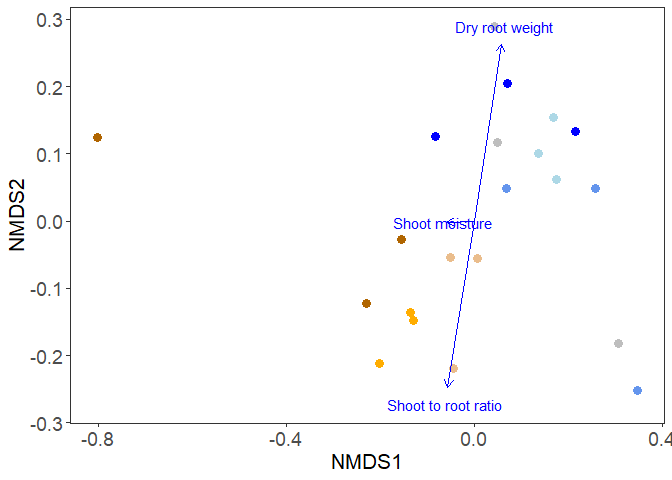<!-- -->

``` r
ggsave("./16S_outputs/NMDS_trait_vec.png",
       width = 7, height = 6, units = "in",
       dpi = 400)
```

### Capscale analysis

CAPSCALE (constrained analysis of principal coordinates) is a form of
distance-based redundancy analysis (db-RDA), and it’s particularly
useful when you want to relate microbiome community structure (based on
a distance matrix) to environmental variables.

``` r
load(file = "./16S_outputs/phyloseq_noHOST_rarified.Rda") ## loads rare_ps
## metadata file
load(file = "./16S_outputs/metadata_cleaned.Rda") ## loads meta

## calculate Bray Curtis distnaces
dist_bc <- phyloseq::distance(rare_ps, method = "bray")

# Run capscale
cap_result <- capscale(dist_bc ~ 
                         treat.rn + timepoint, 
                       data = meta)
```

    ## 
    ## Some constraints or conditions were aliased because they were redundant. This
    ## can happen if terms are constant or linearly dependent (collinear):
    ## 'timepointTP2'

``` r
# Total constrained inertia
(total_constrained <- cap_result$CCA$tot.chi)
```

    ## [1] 12.50106

``` r
# Run ANOVA by term
anova_terms <- anova(cap_result, by = "term")

# Extract Sum of Squares
sum_sqs <- anova_terms$"SumOfSqs"

# Calculate total variation (including residuals)
total_variation <- sum(sum_sqs)

# Calculate proportion explained
prop_explained <- sum_sqs / total_variation

# Combine into a data frame
explained_df <- data.frame(
  Term = rownames(anova_terms),
  SumOfSqs = sum_sqs,
  Proportion = prop_explained
)

print(explained_df)
```

    ##        Term  SumOfSqs Proportion
    ## 1  treat.rn  8.836346  0.3141101
    ## 2 timepoint  3.664716  0.1302715
    ## 3  Residual 15.630304  0.5556184

``` r
## capscale analysis for each timepoint separately

## function
source("./Source_code/capscale.func.R")

times.list <- c("TP1","TP2")

CS.out <- sapply(times.list, 
                capscale.func, 
                df = rare_ps,
                      USE.NAMES = TRUE, 
                      simplify = FALSE)
```

    ## [1] "TP1"
    ##       Term  SumOfSqs Proportion
    ## 1 treat.rn 3.0143969 0.29801991
    ## 2  Species 0.7508638 0.07423454
    ## 3 Residual 6.3494895 0.62774556
    ## [1] "TP2"
    ##       Term  SumOfSqs Proportion
    ## 1 treat.rn 1.8834236  0.2227790
    ## 2  Species 0.9038921  0.1069160
    ## 3 Residual 5.6669079  0.6703049

``` r
CS_all <- lapply(CS.out, `[[`, 1) %>%
  bind_rows(.)

write.csv(CS_all, "./16S_outputs/capscale_analyses.csv",
          row.names = FALSE)
```

### PERMANOVA

``` r
# Microbiome data (e.g., OTU table)
otu_table <- read.csv("./16S_outputs/otu_table_noHOST_rarified.csv", 
                      row.names = 1)

# Metadata
metadata <- read.csv("./16S_outputs/metadata_cleaned.csv", 
                     row.names = 1)


# Bray-Curtis dissimilarity
bray_dist <- vegdist(otu_table, method = "bray")


# Example with multiple variables
adonis2_result <- adonis2(bray_dist ~ treat.rn + timepoint, 
                          data = metadata, permutations = 999,
                          by = "terms")
## check dispersion
dispersion <- betadisper(bray_dist, metadata$timepoint)
anova(dispersion)
```

    ## Analysis of Variance Table
    ## 
    ## Response: Distances
    ##            Df  Sum Sq  Mean Sq F value    Pr(>F)    
    ## Groups      2 0.34769 0.173847  38.984 4.329e-14 ***
    ## Residuals 135 0.60203 0.004459                      
    ## ---
    ## Signif. codes:  0 '***' 0.001 '**' 0.01 '*' 0.05 '.' 0.1 ' ' 1

``` r
boxplot(dispersion)
```

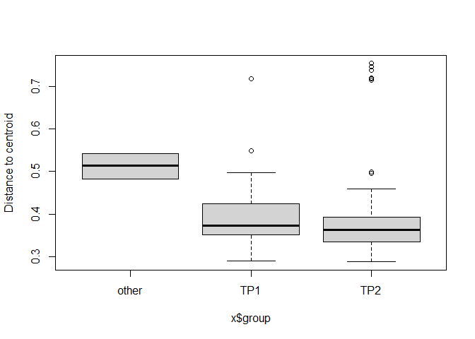<!-- -->

``` r
plot(dispersion)
```

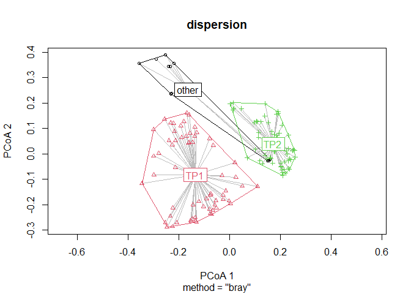<!-- -->

``` r
permutest(dispersion, permutations = 999)
```

    ## 
    ## Permutation test for homogeneity of multivariate dispersions
    ## Permutation: free
    ## Number of permutations: 999
    ## 
    ## Response: Distances
    ##            Df  Sum Sq  Mean Sq      F N.Perm Pr(>F)    
    ## Groups      2 0.34769 0.173847 38.984    999  0.001 ***
    ## Residuals 135 0.60203 0.004459                         
    ## ---
    ## Signif. codes:  0 '***' 0.001 '**' 0.01 '*' 0.05 '.' 0.1 ' ' 1

``` r
## exclude non-experiment samples
metadata.f <- metadata %>%
  filter(timepoint %in% c("TP1","TP2")) %>%
  droplevels(.)

## samples to include
sample_list <- unique(metadata.f$NAME)

## subset OTU table to these samples
otu_subset <- otu_table[rownames(otu_table) %in% sample_list, ]

# Bray-Curtis dissimilarity
bray_dist <- vegdist(otu_subset, method = "bray")


# Example with multiple variables
adonis2_result <- adonis2(bray_dist ~ treat.rn + timepoint, 
                          data = metadata.f, permutations = 999,
                          by = "terms")
## check dispersion
dispersion <- betadisper(bray_dist, metadata.f$timepoint)
anova(dispersion)
```

    ## Analysis of Variance Table
    ## 
    ## Response: Distances
    ##            Df  Sum Sq  Mean Sq F value   Pr(>F)   
    ## Groups      1 0.03260 0.032601  9.8423 0.002131 **
    ## Residuals 124 0.41073 0.003312                    
    ## ---
    ## Signif. codes:  0 '***' 0.001 '**' 0.01 '*' 0.05 '.' 0.1 ' ' 1

``` r
boxplot(dispersion)
```

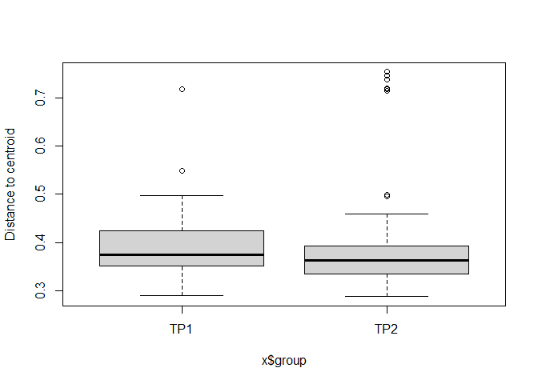<!-- -->

``` r
plot(dispersion)
```

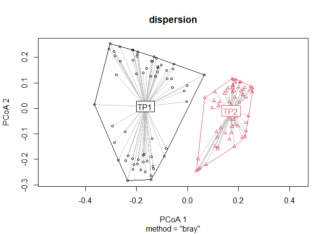<!-- -->

``` r
permutest(dispersion, permutations = 999)
```

    ## 
    ## Permutation test for homogeneity of multivariate dispersions
    ## Permutation: free
    ## Number of permutations: 999
    ## 
    ## Response: Distances
    ##            Df  Sum Sq  Mean Sq      F N.Perm Pr(>F)   
    ## Groups      1 0.03260 0.032601 9.8423    999  0.004 **
    ## Residuals 124 0.41073 0.003312                        
    ## ---
    ## Signif. codes:  0 '***' 0.001 '**' 0.01 '*' 0.05 '.' 0.1 ' ' 1

``` r
## still significant dispersion between timepoints

## look within each timepoint
source("./Source_code/permanova.func.R")

times.list <- c("TP1","TP2")

perm.out <- sapply(times.list, 
                   permanova.func,
                   df = metadata,
                   simplify = FALSE,
                   USE.NAMES = TRUE)
```

    ## [1] "TP1"
    ## Analysis of Variance Table
    ## 
    ## Response: Distances
    ##           Df  Sum Sq   Mean Sq F value Pr(>F)
    ## Groups     6 0.06818 0.0113630  1.6488  0.151
    ## Residuals 56 0.38594 0.0068918

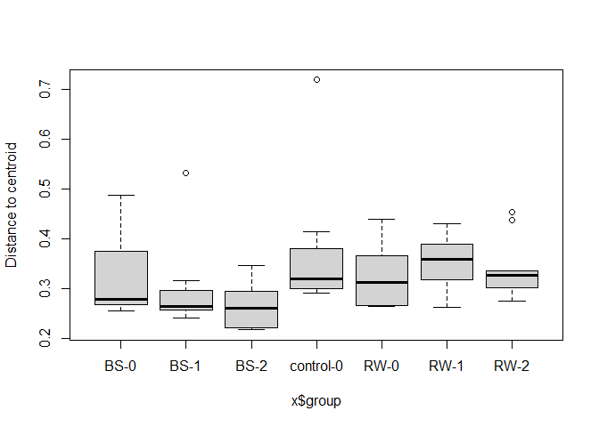<!-- -->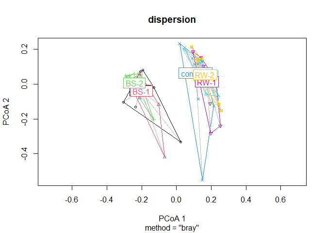<!-- -->

    ## [1] "TP2"
    ## Analysis of Variance Table
    ## 
    ## Response: Distances
    ##           Df   Sum Sq   Mean Sq F value Pr(>F)  
    ## Groups     6 0.027837 0.0046394  2.4684 0.0345 *
    ## Residuals 56 0.105254 0.0018795                 
    ## ---
    ## Signif. codes:  0 '***' 0.001 '**' 0.01 '*' 0.05 '.' 0.1 ' ' 1

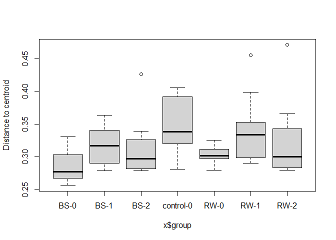<!-- -->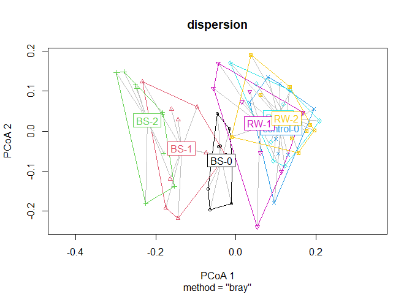<!-- -->

``` r
perm_all <- lapply(perm.out, `[[`, 1) %>%
  bind_rows(.)

write.csv(perm_all, "./16S_outputs/permanova_analyses.csv",
          row.names = FALSE)
```

## Differential abundance analysis

Only include ASVs with rel_abund \> 1%

Input: \* A count matrix: rows = ASV families, columns = samples. \* A
metadata table: rows = samples, columns = variables (e.g., timepoint,
plant species, treatment, replicate).

1)  Do different crops enrich for different ASVs (family-level)?

- Use Garden soil as a relevant comparison?

species (no_plant \[GS\], lettuce, radish, pea) exclude timepoint (TP1)
exclude amendment treatments (BS, RW)

``` r
## load relevant dataframe (summarized to family level)

### load OTU table
counts <- read.csv("16S_outputs/otu_table_noHOST_prune1.csv",
                                    row.names = 1)

## add in Taxonomic information (rather than OTUs)

### save taxonomy file
load(file = "./16S_outputs/phyloseq_noHOST_pruned1.Rda") ## loads phyloseq object
tax_table_df <- as.data.frame(tax_table(rel_abun_all_prune))

### create taxon name
tax_table_df$taxon <- paste0(tax_table_df$Genus,
                                 " ", tax_table_df$Species)
### Species unknown
tax_table_df$taxon <- 
  ifelse(is.na(tax_table_df$Species) == TRUE,
         paste0(tax_table_df$Genus, " sp."),
         paste0(tax_table_df$taxon))
### Genus unknown
tax_table_df$taxon <- 
  ifelse(tax_table_df$taxon == "NA sp.",
         paste0("F: ", tax_table_df$Family),
         paste0(tax_table_df$taxon))
### Family unknown
tax_table_df$taxon <- 
  ifelse(tax_table_df$taxon == "F: NA",
         paste0("O: ", tax_table_df$Order),
         paste0(tax_table_df$taxon))
### Order unknown
tax_table_df$taxon <- 
  ifelse(tax_table_df$taxon == "O: NA",
         paste0("C: ", tax_table_df$Class),
         paste0(tax_table_df$taxon))
### Class unknown
tax_table_df$taxon <- 
  ifelse(tax_table_df$taxon == "C: NA",
         paste0("P: ", tax_table_df$Phylum),
         paste0(tax_table_df$taxon))
### Phylum unknown
tax_table_df$taxon <- 
  ifelse(tax_table_df$taxon == "P: NA",
         "Unclassified Bacteria",
         paste0(tax_table_df$taxon))

## make unique (to add rownames)
tax_table_df$taxon <- make.unique(tax_table_df$taxon,
                                  sep = "_")

## Use taxon as rownames
rownames(counts) <- tax_table_df$taxon

## Metadata
metadata <- read.csv("./16S_outputs/metadata_cleaned.csv", 
                     row.names = 1)

## question 1

### drop all non-experimental samples
meta <- metadata %>%
  filter(treat.rn %in% c("control-0","Garden Soil"),
         timepoint != "TP1") %>%
  droplevels(.)
meta$species <- as.factor(meta$species)
meta$species <- relevel(meta$species, ref = "no_plant")

### setset otu table to same samples
samples_to_include <- unique(meta$NAME)

counts.f <- counts %>%
  select(all_of(samples_to_include))

### create DESeq2 dataset

dds <- DESeqDataSetFromMatrix(countData = counts.f,
                              colData = meta,
                              design = ~ species)

## do this for each species separately, treat:timepoint

dds <- DESeq(dds)
```

    ## estimating size factors

    ## estimating dispersions

    ## gene-wise dispersion estimates

    ## mean-dispersion relationship

    ## final dispersion estimates

    ## fitting model and testing

``` r
# dds <- nbinomWaldTest(dds, maxit = 1000)

# resultsNames(dds)

#  [1] "Intercept"                "species_P_vs_L"           "species_R_vs_L"           "treat_SL1.BS_vs_C"       
#  [5] "treat_SL1.RW_vs_C"        "treat_SL2.BS_vs_C"        "treat_SL2.RW_vs_C"        "treat_US.BS_vs_C"        
#  [9] "treat_US.RW_vs_C"         "timepoint_TP2_vs_TP1"     "speciesP.timepointTP2"    "speciesR.timepointTP2"   
# [13] "treatSL1.BS.timepointTP2" "treatSL1.RW.timepointTP2" "treatSL2.BS.timepointTP2" "treatSL2.RW.timepointTP2"
# [17] "treatUS.BS.timepointTP2"  "treatUS.RW.timepointTP2" 

## pull out significance for overall model
res_intercept <- results(dds, name = "Intercept")
## pull out significance for different comparisons
res_lettuce <- results(dds, name = "species_L_vs_no_plant")
res_lettuce_df <- as.data.frame(res_lettuce@listData)
res_lettuce_df$crop <- "Lettuce"
res_lettuce_df$taxon <- rownames(res_lettuce)
res_radish <- results(dds, name = "species_R_vs_no_plant")
res_radish_df <- as.data.frame(res_radish@listData)
res_radish_df$crop <- "Radish"
res_radish_df$taxon <- rownames(res_radish)
res_pea <- results(dds, name = "species_P_vs_no_plant")
res_pea_df <- as.data.frame(res_pea@listData)
res_pea_df$crop <- "Pea"
res_pea_df$taxon <- rownames(res_pea)

## combine dfs
res_all <- rbind(res_lettuce_df, res_radish_df, res_pea_df)

## plot (species)
plotMA(res_lettuce, main = "Lettuce")
```

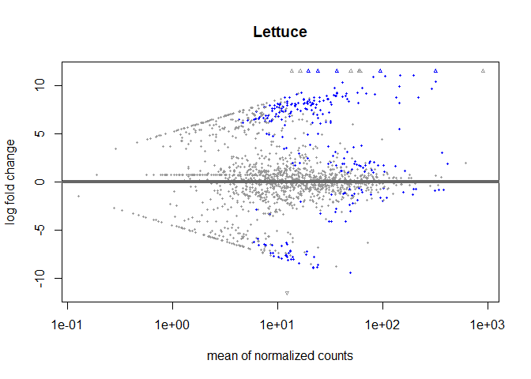<!-- -->

``` r
plotMA(res_radish, main = "Radish")
```

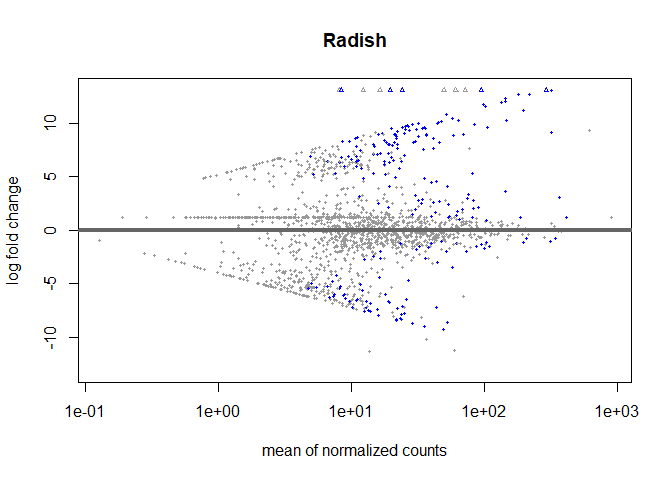<!-- -->

``` r
plotMA(res_pea, main = "Pea")
```

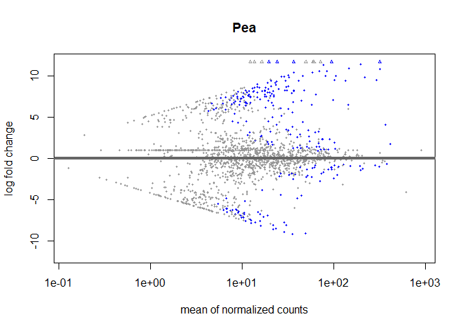<!-- -->

``` r
## make pheatmap based on reads (per taxon)

## Filter significant taxa (padj < 0.05)
sig_lettuce <- 
  rownames(res_lettuce[which(res_lettuce$padj < 0.05), ])
sig_radish <- rownames(res_radish[which(res_radish$padj < 0.05), ])
sig_pea <- rownames(res_pea[which(res_pea$padj < 0.05), ])

sig_all <- c(sig_lettuce, sig_pea, sig_radish)

# Remove duplicates
sig_all.u <- unique(sig_all)

## combine into one list

### Extract normalized counts for significant families
vsd <- varianceStabilizingTransformation(dds, blind = TRUE)
plotPCA(vsd, intgroup = c("species"))
```

    ## using ntop=500 top features by variance

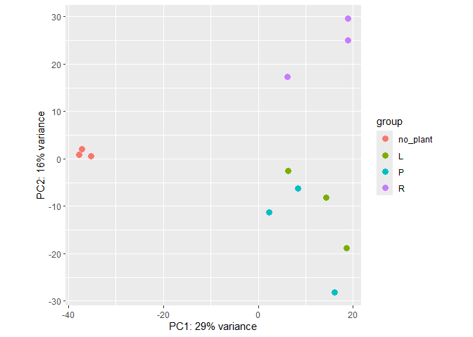<!-- -->

``` r
norm_counts <- assay(vsd)

### normalized counts 
sig_counts <- norm_counts[sig_all.u, ]

## change to NA for non-sig 

# Replace values in norm columns with NA where rownames do not match
sig_counts[!rownames(sig_counts) %in% sig_lettuce, 10:12] <- NA
sig_counts[!rownames(sig_counts) %in% sig_radish, 7:9] <- NA
sig_counts[!rownames(sig_counts) %in% sig_pea, 4:6] <- NA

## set colour to mean of controls
control_means <- rowMeans(sig_counts[, 1:3])
normalized_matrix <- sweep(sig_counts, 1, 
                           control_means, 
                           FUN = "-")

# Exclude controls: Samples to exclude
exclude_samples <- c("RD139", "RD140","RD141") ## garden soil

# Subset to keep only desired samples
filtered_matrix <- 
  normalized_matrix[, !colnames(normalized_matrix) %in%
                                 exclude_samples]

### Define diverging color scale
breaks <- seq(min(filtered_matrix, na.rm = TRUE), 
              max(filtered_matrix, na.rm = TRUE), 
              length.out = 100)
color_palette <- 
  colorRampPalette(c("blue", 
                     "white", 
                     "red"))(length(breaks) - 1)

## add in species information

### Create a data frame with treatment conditions
### filter meta
meta.f <- meta %>%
  filter(!NAME %in% exclude_samples) %>%
  droplevels(.)
treatment_info <- data.frame(Species = meta.f$species)
rownames(treatment_info) <- colnames(filtered_matrix)

## set colours

# Define custom colors for treatment groups
treatment_colors <- list(
  Species = c(P = "purple", R = "red", L = "green3")
)

### Create heatmap
pheatmap(filtered_matrix,
         cluster_rows = FALSE,
         cluster_cols = TRUE,
         show_rownames = FALSE,
         show_colnames = FALSE,
         colour = color_palette,
         breaks = breaks,
         fontsize_row = 8,
         annotation_col = treatment_info,
         annotation_legend = FALSE,  
         annotation_names_col = FALSE,
         annotation_colors = treatment_colors,
         legend_labels = FALSE,
         na_col = "black",
         main = "Normalized Heatmap (Relative to Control)")
```

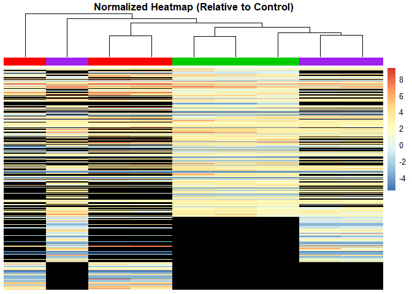<!-- -->

``` r
## create heatmap based on log2fold change
res_sig <- res_all %>%
  filter(padj < 0.05) %>%
  droplevels(.)

## add in Family (or higher order grouping)
res_sig$Family <- 
  tax_table_df$Family[match(res_sig$taxon, 
                                      tax_table_df$taxon)]
res_sig$Family <- ifelse(is.na(res_sig$Family) == TRUE,
                         "Unclassified Family",
         paste0(res_sig$Family))
## Phylum
res_sig$Phylum <- 
  tax_table_df$Phylum[match(res_sig$taxon, 
                                      tax_table_df$taxon)]
res_sig$Phylum <- ifelse(is.na(res_sig$Phylum) == TRUE,
                         "Unclassified Bacteria",
         paste0(res_sig$Phylum))

# Calculate mean log2FoldChange per Family
family_order <- res_sig %>%
  group_by(Family) %>%
  summarise(mean_log2FC = mean(log2FoldChange, na.rm = TRUE)) %>%
  arrange(desc(mean_log2FC)) %>%
  pull(Family)

# Reorder Family factor levels
res_sig <- res_sig %>%
  mutate(Family = factor(Family, levels = family_order))

## plot heatmap
ggplot(res_sig, aes(x = crop, 
                    y = Family, 
                    fill = log2FoldChange)) +
  geom_tile() +
  scale_fill_gradient2(low = "blue", 
                       mid = "white", 
                       high = "red", midpoint = 0) +
  labs(x = "Crop species",
       y = "ASV Family") +
  theme_minimal() +
  theme(axis.text.x = element_text(size = 14),
        axis.ticks.x = element_blank(),
        strip.text.x = element_text(angle = 90))
```

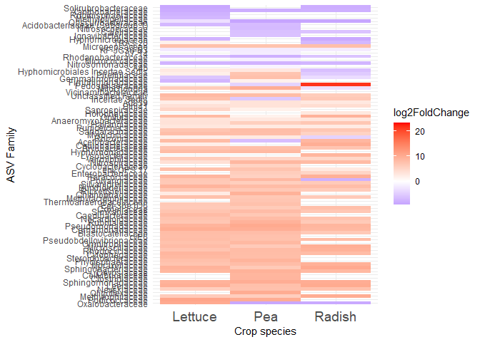<!-- -->

``` r
## save
ggsave("./16S_outputs/heatmap_ASVfamily.png",
       width = 6, height = 12, units = "in")

# Calculate mean log2FoldChange per Phylum
phylum_order <- res_sig %>%
  group_by(Phylum) %>%
  summarise(mean_log2FC = mean(log2FoldChange, na.rm = TRUE)) %>%
  arrange(desc(mean_log2FC)) %>%
  pull(Phylum)

# Reorder Family factor levels
res_sig <- res_sig %>%
  mutate(Phylum = factor(Phylum, levels = phylum_order))

## plot heatmap
ggplot(res_sig, aes(x = crop, 
                    y = Phylum, 
                    fill = log2FoldChange)) +
  geom_tile() +
  scale_fill_gradient2(low = "blue", 
                       mid = "white", 
                       high = "red", midpoint = 0) +
  labs(x = "Crop species",
       y = "ASV Phylum") +
  theme_minimal() +
  theme(axis.text.x = element_text(size = 14),
        axis.ticks.x = element_blank(),
        strip.text.x = element_text(angle = 90))
```

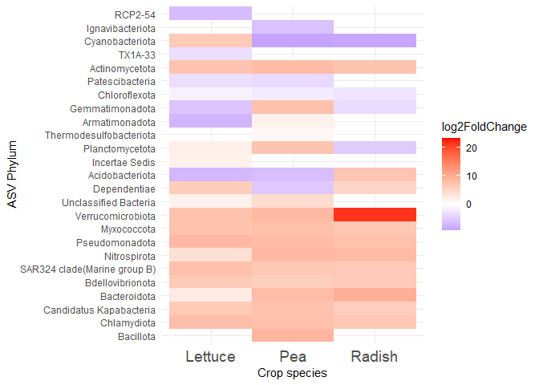<!-- -->

``` r
## save
ggsave("./16S_outputs/heatmap_ASVphylum.png",
       width = 6, height = 10, units = "in")
```

## Extra code

``` r
# top20 for T1 and T2
top20_T1 <- names(sort(taxa_sums(T1), decreasing=TRUE))[1:20]
dat.top20_T1 <- transform_sample_counts(T1, function(OTU) OTU/sum(OTU))
prune.dat.top20_T1 <- prune_taxa(top20_T1, dat.top20_T1)

top20_T2 <- names(sort(taxa_sums(T2), decreasing=TRUE))[1:20]
dat.top20_T2 <- transform_sample_counts(T2, function(OTU) OTU/sum(OTU))
prune.dat.top20_T2 <- prune_taxa(top20_T2, dat.top20_T2)

# top50 for T1 and T2
T1 <- subset_samples(rare_ps_family, Sampling_date == "2024-07-11")
T2 <- subset_samples(rare_ps_family, Sampling_date %in% c("2024-08-18", "2024-08-06", "2024-08-19", "2024-08-26"))

top50_T1 <- names(sort(taxa_sums(T1), decreasing=TRUE))[1:50]
dat.top50_T1 <- transform_sample_counts(T1, function(OTU) OTU/sum(OTU)) #this is making it into relative abundance
prune.dat.top50_T1 <- prune_taxa(top50_T1, dat.top50_T1)

top50_T2 <- names(sort(taxa_sums(T2), decreasing=TRUE))[1:50]
dat.top50_T2 <- transform_sample_counts(T2, function(OTU) OTU/sum(OTU))
prune.dat.top50_T2 <- prune_taxa(top50_T2, dat.top50_T2)

#top100 for T1 and T2
top100_T1 <- names(sort(taxa_sums(T1), decreasing=TRUE))[1:100]
dat.top100_T1 <- transform_sample_counts(T1, function(OTU) OTU/sum(OTU))
dat.top100_T1 <- prune_taxa(top100_T1, dat.top100_T1)

top100_T2 <- names(sort(taxa_sums(T2), decreasing=TRUE))[1:100]
dat.top100_T2 <- transform_sample_counts(T2, function(OTU) OTU/sum(OTU))
dat.top100_T2 <- prune_taxa(top100_T2, dat.top100_T2)

#rename so there are no errors
colnames(sample_data(prune.dat.top20_T1)) <- gsub("Species", "sample_Species", colnames(sample_data(prune.dat.top20_T1)))
colnames(sample_data(prune.dat.top20_T2)) <- gsub("Species", "sample_Species", colnames(sample_data(prune.dat.top20_T2)))
colnames(sample_data(prune.dat.top50_T1)) <- gsub("Species", "sample_Species", colnames(sample_data(prune.dat.top50_T1)))
colnames(sample_data(prune.dat.top50_T2)) <- gsub("Species", "sample_Species", colnames(sample_data(prune.dat.top50_T2)))
colnames(sample_data(dat.top100)) <- gsub("Species", "sample_Species", colnames(sample_data(dat.top100)))

### change sample order:
NAME_order <- c("RD1","RD2","RD3","RD4","RD5","RD6","RD7","RD8","RD9","RD10","RD11","RD12","RD13","RD14","RD15","RD16","RD17","RD18","RD19","RD20","RD21","RD22","RD23","RD24","RD25","RD26","RD27","RD28","RD29","RD30","RD31","RD32","RD33","RD34","RD35","RD36","RD37","RD38","RD39","RD40","RD41","RD42","RD43","RD44","RD45","RD46","RD47","RD48","RD49","RD50","RD51","RD52","RD53","RD54","RD55","RD56","RD57","RD58","RD59","RD60","RD61","RD62","RD63","RD64","RD65","RD66","RD67","RD68","RD69","RD70","RD71","RD72","RD73","RD74","RD75","RD76","RD77","RD78","RD79","RD80","RD81","RD82","RD83","RD84","RD85","RD86","RD87","RD88","RD89","RD90","RD91","RD92","RD93","RD94","RD95","RD96","RD97","RD98","RD99","RD100","RD101","RD102","RD103","RD104","RD105","RD106","RD107","RD108","RD109","RD110","RD111","RD112","RD113","RD114","RD115","RD116","RD117","RD118","RD119","RD120","RD121","RD122","RD123","RD124","RD125","RD126","RD127","RD128","RD129","RD130","RD131","RD132","RD133","RD134","RD135","RD136","RD137","RD138","RD139","RD140","RD141","RD142","RD143","RD144","RD145","RD146","RD147","RD148","RD149","RD150","RD151","RD152","RD153","RD154","RD155","RD156")


##### Relative abundance plots #####
https://karstenslab.github.io/microshades/articles/microshades-HMP.html

library(microshades)
library(speedyseq)

mdf_prep <- prep_mdf(prune.dat.top20_T1, subgroup_level = "Family")
colour_object <- create_color_dfs(mdf_prep, group_level = "Phylum", selected_groups = c("Bryobacteraceae", "Burkholderiaceae", "Caulobacteraceae", "Chitinophagaceae", "Comamonadaceae", "Enterobacteriaceae", "Gallinellaceae", "Gemmatimonadaceae", "Lysobacteraceae", "Micropepsaceae", "Moraxellaceae", "Nitrosomonadaceae", "Oxalobacteraceae", "Pseudomonadaceae", "Rhodanobacteraceae", "Sandaracinaceae", "SC-I-84", "Sphingomonadaceae", "Streptomycetaceae", "Xanthobacteraceae"), subgroup_level = "Family", cvd = TRUE)

colour_object <- create_color_dfs(mdf_prep, group_level = "Phylum", subgroup_level = "Family", cvd = TRUE)

mdf <- colour_object$mdf
cdf <- colour_object$cdf


melted_T1 <- prune.dat.top50_T1 %>%
  psmelt() #making the phyloseq object into a dataframe for easier manipulation
melted_T2 <- prune.dat.top50_T2 %>%
  psmelt()
labs <- c("Biosolid", "Control", "Reclaimed Water")
names(labs) <- c("BS", "C", "RW")


melted_T1$Source <- factor(melted_T1$Source, levels=c("BS", "RW", "C"))#change order of facet
melted_T1$Sample_ID <- factor(melted_T1$Sample_ID, levels=c("28-US-BS-P", "29-US-BS-P", "30-US-BS-P", "37-SL1-BS-P", "38-SL1-BS-P", "39-SL1-BS-P", "46-SL2-BS-P", "47-SL2-BS-P", "48-SL2-BS-P", "31-US-BS-R", "32-US-BS-R", "33-US-BS-R", "40-SL1-BS-R", "41-SL1-BS-R", "42-SL1-BS-R", "49-SL2-BS-R", "50-SL2-BS-R", "51-SL2-BS-R", "34-US-BS-L", "35-US-BS-L", "36-US-BS-L", "43-SL1-BS-L", "44-SL1-BS-L", "45-SL1-BS-L", "52-SL2-BS-L", "53-SL2-BS-L", "54-SL2-BS-L", "1-US-RW-P", "2-US-RW-P", "3-US-RW-P", "10-SL1-RW-P", "11-SL1-RW-P", "12-SL1-RW-P", "19-SL2-RW-P", "20-SL2-RW-P", "21-SL2-RW-P", "4-US-RW-R", "5-US-RW-R", "6-US-RW-R", "13-SL1-RW-R", "14-SL1-RW-R", "15-SL1-RW-R", "22-SL2-RW-R", "23-SL2-RW-R", "24-SL2-RW-R", "7-US-RW-L", "8-US-RW-L", "9-US-RW-L", "16-SL1-RW-L", "17-SL1-RW-L", "18-SL1-RW-L", "25-SL2-RW-L", "26-SL2-RW-L", "27-SL2-RW-L", "55-C-P", "56-C-P", "57-C-P", "58-C-R", "59-C-R", "60-C-R", "61-C-L", "62-C-L", "63-C-L")) #change order of columns to group within each facet

T1 <- melted_T1 %>% mutate(Family = fct_reorder(Family, Abundance, .desc=FALSE)) %>% ggplot(aes(x = Sample_ID, y = Abundance, fill = Family)) + geom_col(position = "fill") + labs(x= "Sample ID", y = "Relative Abundance") + theme_classic() + facet_wrap(~Source, scales="free_x", labeller=labeller("Source" = labs)) + scale_y_continuous(expand=c(0,0)) + scale_fill_manual(name = NULL, values = c("#E69F00", "#56B4E9", "#009E73", "#F0E442", "#0072B2", "#D55E00", "#CC79A7", "#999999", "#332288", "#88CCEE", "#44AA99", "#117733", "#DDCC77", "#CC6677", "#882255", "#AA4499", "#DDAA77", "#EE3377", "#66CCEE", "#4477AA", "#228833", "#DDDD77", "#AA7744", "#99DDFF", "#771122", "#AA1122", "#33BBEE", "#EE7733", "#3377AA", "#222255", "#113355", "#772255", "#AA5555", "#55AA55", "#557799", "#FFDD44", "#FF9999", "#33CC55", "#9999DD", "#4444AA", "#BB4422", "#BB2244", "#BB9933", "#993322", "#99BB88", "#88AAEE", "#225577", "#337744", "#22BB66", "#BB6633")) + ggtitle ("Alpha diversity one week after planting") + theme(plot.title = element_text(hjust = 0.5), axis.text.x = element_text(angle = 90, size = 8, vjust = 0.5, hjust =1), legend.text = element_text(face="italic"), legend.key.size = unit(10, "pt"))

melted_T2$Source <- factor(melted_T2$Source, levels=c("BS", "RW", "C"))#change order of facet
melted_T2$Sample_ID <- factor(melted_T2$Sample_ID, levels=c("28-US-BS-P", "29-US-BS-P", "30-US-BS-P", "37-SL1-BS-P", "38-SL1-BS-P", "39-SL1-BS-P", "46-SL2-BS-P", "47-SL2-BS-P", "48-SL2-BS-P", "31-US-BS-R", "32-US-BS-R", "33-US-BS-R", "40-SL1-BS-R", "41-SL1-BS-R", "42-SL1-BS-R", "49-SL2-BS-R", "50-SL2-BS-R", "51-SL2-BS-R", "34-US-BS-L", "35-US-BS-L", "36-US-BS-L", "43-SL1-BS-L", "44-SL1-BS-L", "45-SL1-BS-L", "52-SL2-BS-L", "53-SL2-BS-L", "54-SL2-BS-L", "1-US-RW-P", "2-US-RW-P", "3-US-RW-P", "10-SL1-RW-P", "11-SL1-RW-P", "12-SL1-RW-P", "19-SL2-RW-P", "20-SL2-RW-P", "21-SL2-RW-P", "4-US-RW-R", "5-US-RW-R", "6-US-RW-R", "13-SL1-RW-R", "14-SL1-RW-R", "15-SL1-RW-R", "22-SL2-RW-R", "23-SL2-RW-R", "24-SL2-RW-R", "7-US-RW-L", "8-US-RW-L", "9-US-RW-L", "16-SL1-RW-L", "17-SL1-RW-L", "18-SL1-RW-L", "25-SL2-RW-L", "26-SL2-RW-L", "27-SL2-RW-L", "55-C-P", "56-C-P", "57-C-P", "58-C-R", "59-C-R", "60-C-R", "61-C-L", "62-C-L", "63-C-L")) #change order of columns to group within each facet

T2 <- melted_T2 %>% mutate(Family = fct_reorder(Family, Abundance, .desc=FALSE)) %>% ggplot(aes(x = Sample_ID, y = Abundance, fill = Family)) + geom_col(position = "fill") + labs(x= "Sample ID", y = "Relative Abundance") + theme_classic() + facet_wrap(~Source, scales="free_x", labeller=labeller("Source" = labs)) + scale_y_continuous(expand=c(0,0)) + scale_fill_manual(name = NULL, values = c("#F5793A", "#85C0F9", "#A1D76A", "#E1BE6A", "#882255", "#E66101", "#5D3A9B", "#B2ABD2", "#D55E00", "#E69F00", "#009E73", "#3377AA", "#D55E00", "#332288", "#CC6677", "#DDCC77", "#F4A582", "#99DDFF", "#4DAF4A", "#66CCEE", "#99BB88", "#0072B2", "#DDAA77", "#EE3377", "#44AA99", "#BB6633", "#AA7744", "#FF9999", "#EE7733", "#33BBEE", "#557799", "#DDDD77", "#771122", "#55AA55", "#113355", "#9999DD", "#AA5555", "#4444AA", "#AA1122", "#FFDD44", "#772255", "#337744", "#33CC55", "#BB9933", "#993322", "#BB2244", "#22BB66", "#BB4422", "#225577", "#88AAEE")) + ggtitle ("Alpha diversity post planting") + theme(plot.title = element_text(hjust = 0.5), axis.text.x = element_text(angle = 90, size = 8, vjust = 0.5, hjust =1), legend.text = element_text(face="italic"), legend.key.size = unit(10, "pt"))

##### RDA #####

#I am doing an RDA from the rarefied phyloseq object.
T1 <- subset_samples(rare_ps_family, Sampling_date == "2024-07-11")
T2 <- subset_samples(rare_ps_family, Sampling_date %in% c("2024-08-18", "2024-08-06", "2024-08-19", "2024-08-26"))

#DO example and run through 


T1rarefy.ord <- ordinate(T1, method="RDA", distance = "bray") #how to pull out values
anova(T1rarefy.ord, by = "term")
#anova(T1rarefy.ord, by = "axis")

T1rare.plot <- plot_ordination(T1, T1rarefy.ord,
                           axes = c(1,2),
                           title = "RDA one week post planting")
### add in ggplot aesthetics:
T1pcoa <- T1rare.plot + geom_point(aes(colour = Treatment, shape = Species), size = 4, alpha = 0.5) + theme(plot.title = element_text(hjust = 0.5)) + scale_colour_manual(values = c("#0072B2", "#E69F00", "#56B4E9", "#009E73", "#F0E442", "#D55E00", "#CC79A7"))

#now making it with the rarefied data for T2
T2rarefy.ord <- ordinate(T2, method="RDA", distance = "bray")
T2rare.plot <- plot_ordination(T2, T2rarefy.ord,
                           axes = c(1,2),
                           title = "RDA post harvest")
### add in ggplot aesthetics:
T2pcoa <- T2rare.plot + geom_point(aes(colour = Treatment, shape = Species), size = 4, alpha = 0.5) + theme(plot.title = element_text(hjust = 0.5)) + scale_colour_manual(values = c("#0072B2", "#E69F00", "#56B4E9", "#009E73", "#F0E442", "#D55E00", "#CC79A7"))

T1pcoa + T2pcoa #Fix titles, as well

#From the phyloseq object I am converting the otu table to relative abundance using a hellinger trasformation, why, distance based RDA? there is a package in R that will do capscale analysis 
otu_rel <- decostand(otu_table(rare_ps_family), method = "hellinger")
otu_rel <- as.data.frame(t(otu_rel)) #Need to transpose so the samples are the rows and taxa are the columns 

#I want to pick the relevant environmental variables from the metadata and make them dummy variables since they are all categorical
dummy_met = data.frame(met_df$NAME, met_df$Treatment, met_df$Species)
colnames(dummy_met) <- c('NAME', 'Treatment', 'Species') #This is renaming the columns

#Making the dummy variables using ifelse statements
dummy_met$USBS <- ifelse(dummy_met$Treatment == "US-BS", 1, 0)
dummy_met$SL1BS <- ifelse(dummy_met$Treatment == "SL1-BS", 1, 0)
dummy_met$SL2BS <- ifelse(dummy_met$Treatment == "SL2-BS", 1, 0)
dummy_met$C <- ifelse(dummy_met$Treatment == "C", 1, 0)
dummy_met$USRW <- ifelse(dummy_met$Treatment == "US-RW", 1, 0)
dummy_met$SL1RW <- ifelse(dummy_met$Treatment == "SL1-RW", 1, 0)
dummy_met$SL2RW <- ifelse(dummy_met$Treatment == "SL2-RW", 1, 0)
dummy_met$P <- ifelse(dummy_met$Species == "P", 1, 0)
dummy_met$L <- ifelse(dummy_met$Species == "L", 1, 0)
dummy_met$R <- ifelse(dummy_met$Species == "R", 1, 0)

dummy_met = subset(dummy_met, select = -c(Treatment, Species)) #cleaning up the dataframe so it is just dummy variables

#Now I am replacing all the NA's with 0
dummy_met[is.na(dummy_met)] <- 0
dummy_met <- data.frame(dummy_met[,-1], row.names=dummy_met[,1]) #making the first column into the rownames 

#Need to make the dataframes the same length, I am filtering based off the rownames in the otu_rel dataframe, so only rownames in both dataframes will be kept in the final dummy_met dataframe
dummy_met <- dummy_met[rownames(dummy_met) %in% rownames(otu_rel), ]

#Now I can perform a RDA
my_rda <- rda(otu_rel ~ USBS + SL1BS + SL2BS + C + USRW + SL1RW + SL2RW + P + L + R, data = dummy_met)
#Alternative format, this means y as a function of all variables in x
#my_rda rda(otu_rel ~., data = dummy_met)


#Constrained inertia explains the variation explained by the explanatory variables. Unconstrained  is the variation not explained by they variables. More variation seems to be not be explained by the explanatory variables. 

#Now looking at the summary
summary(my_rda)

#plot this
plot(my_rda)


#We are doing this to get a computation of the unbiased R^2. This gives the total explained varaince by the RDA, which is little. 

RsquareAdj(my_rda)

#Here doing permutation tests to test for significance. This is in the vegan package, has nothing to do with an ANOVA test. Default is 999. Here p = 0.001, meaning that the RDA model is significant. 

anova.cca(my_rda, permutations = 999)

# We can look at axis significance to test which axes are significant. 

anova.cca(my_rda, permuations = 999, by = "axis")
# Gives significance of each terms

anova.cca(my_rda, permutations = 999, by = "terms")

#We can look at multicolinarity. Typically if VIF >2 it is considered redundant and we would want to drop it from the analysis. Why is R NA?

sqrt(vif.cca(my_rda))

##### Permanova #####

head(sample_data(rare_ps))
bray <- phyloseq::distance(rare_ps_family, method = "bray")
sam <- data.frame(sample_data(rare_ps_family))
sam$Treatment[is.na(sam$Treatment)] <- "None" #Had to change NA to "none" so it would work, filter out the NAs, NAs correspond to diff. treatments, so filter out with a new df, maybe interaction with crop species  
adonis2(bray ~ Treatment, data = sam) #add amendment and species, split for two different time points

rel_abun_rare <- transform_sample_counts(rare_ps_family, function(x) x/sum(x))
rel_abun_rare_prune <- prune_taxa(taxa_sums(rel_abun_rare) > 0.001,
                                rel_abun_rare)

#top50 for T1 and T2
T1 <- subset_samples(rel_abun_rare_prune, Sampling_date == "2024-07-11")
T2 <- subset_samples(rel_abun_rare_prune, Sampling_date %in% c("2024-08-18", "2024-08-06", "2024-08-19", "2024-08-26"))

top20_T1 <- names(sort(taxa_sums(T1), decreasing=TRUE))[1:20]
dat.top20_T1 <- transform_sample_counts(T1, function(OTU) OTU/sum(OTU))
prune.dat.top20_T1 <- prune_taxa(top20_T1, dat.top20_T1)

top20_T2 <- names(sort(taxa_sums(T2), decreasing=TRUE))[1:20]
dat.top20_T2 <- transform_sample_counts(T2, function(OTU) OTU/sum(OTU))
prune.dat.top20_T2 <- prune_taxa(top20_T2, dat.top20_T2)

top50_T1 <- names(sort(taxa_sums(T1), decreasing=TRUE))[1:50]
dat.top50_T1 <- transform_sample_counts(T1, function(OTU) OTU/sum(OTU)) #this is making it into relative abundance
prune.dat.top50_T1 <- prune_taxa(top50_T1, dat.top50_T1)

top50_T2 <- names(sort(taxa_sums(T2), decreasing=TRUE))[1:50]
dat.top50_T2 <- transform_sample_counts(T2, function(OTU) OTU/sum(OTU))
prune.dat.top50_T2 <- prune_taxa(top50_T2, dat.top50_T2)

#rename so there are no errors
colnames(sample_data(prune.dat.top20_T1)) <- gsub("Species", "sample_Species", colnames(sample_data(prune.dat.top20_T1)))
colnames(sample_data(prune.dat.top20_T2)) <- gsub("Species", "sample_Species", colnames(sample_data(prune.dat.top20_T2)))
colnames(sample_data(prune.dat.top50_T1)) <- gsub("Species", "sample_Species", colnames(sample_data(prune.dat.top50_T1)))
colnames(sample_data(prune.dat.top50_T2)) <- gsub("Species", "sample_Species", colnames(sample_data(prune.dat.top50_T2)))

### change sample order:
NAME_order <- c("RD1","RD2","RD3","RD4","RD5","RD6","RD7","RD8","RD9","RD10","RD11","RD12","RD13","RD14","RD15","RD16","RD17","RD18","RD19","RD20","RD21","RD22","RD23","RD24","RD25","RD26","RD27","RD28","RD29","RD30","RD31","RD32","RD33","RD34","RD35","RD36","RD37","RD38","RD39","RD40","RD41","RD42","RD43","RD44","RD45","RD46","RD47","RD48","RD49","RD50","RD51","RD52","RD53","RD54","RD55","RD56","RD57","RD58","RD59","RD60","RD61","RD62","RD63","RD64","RD65","RD66","RD67","RD68","RD69","RD70","RD71","RD72","RD73","RD74","RD75","RD76","RD77","RD78","RD79","RD80","RD81","RD82","RD83","RD84","RD85","RD86","RD87","RD88","RD89","RD90","RD91","RD92","RD93","RD94","RD95","RD96","RD97","RD98","RD99","RD100","RD101","RD102","RD103","RD104","RD105","RD106","RD107","RD108","RD109","RD110","RD111","RD112","RD113","RD114","RD115","RD116","RD117","RD118","RD119","RD120","RD121","RD122","RD123","RD124","RD125","RD126","RD127","RD128","RD129","RD130","RD131","RD132","RD133","RD134","RD135","RD136","RD137","RD138","RD139","RD140","RD141","RD142","RD143","RD144","RD145","RD146","RD147","RD148","RD149","RD150","RD151","RD152","RD153","RD154","RD155","RD156")

melted_T1 <- prune.dat.top20_T1 %>%
  psmelt() #making the phyloseq object into a dataframe for easier manipulation
melted_T2 <- prune.dat.top20_T2 %>%
  psmelt()
labs <- c("Biosolid", "Control", "Reclaimed Water")
names(labs) <- c("BS", "C", "RW")


melted_T1$Source <- factor(melted_T1$Source, levels=c("BS", "RW", "C"))#change order of facet
melted_T1$Sample_ID <- factor(melted_T1$Sample_ID, levels=c("28-US-BS-P", "29-US-BS-P", "30-US-BS-P", "37-SL1-BS-P", "38-SL1-BS-P", "39-SL1-BS-P", "46-SL2-BS-P", "47-SL2-BS-P", "48-SL2-BS-P", "31-US-BS-R", "32-US-BS-R", "33-US-BS-R", "40-SL1-BS-R", "41-SL1-BS-R", "42-SL1-BS-R", "49-SL2-BS-R", "50-SL2-BS-R", "51-SL2-BS-R", "34-US-BS-L", "35-US-BS-L", "36-US-BS-L", "43-SL1-BS-L", "44-SL1-BS-L", "45-SL1-BS-L", "52-SL2-BS-L", "53-SL2-BS-L", "54-SL2-BS-L", "1-US-RW-P", "2-US-RW-P", "3-US-RW-P", "10-SL1-RW-P", "11-SL1-RW-P", "12-SL1-RW-P", "19-SL2-RW-P", "20-SL2-RW-P", "21-SL2-RW-P", "4-US-RW-R", "5-US-RW-R", "6-US-RW-R", "13-SL1-RW-R", "14-SL1-RW-R", "15-SL1-RW-R", "22-SL2-RW-R", "23-SL2-RW-R", "24-SL2-RW-R", "7-US-RW-L", "8-US-RW-L", "9-US-RW-L", "16-SL1-RW-L", "17-SL1-RW-L", "18-SL1-RW-L", "25-SL2-RW-L", "26-SL2-RW-L", "27-SL2-RW-L", "55-C-P", "56-C-P", "57-C-P", "58-C-R", "59-C-R", "60-C-R", "61-C-L", "62-C-L", "63-C-L")) #change order of columns to group within each facet

T1 <-  melted_T1 %>% mutate(Family = fct_reorder(Family, Abundance, .desc=FALSE)) %>% ggplot(aes(x = Sample_ID, y = Abundance, fill = Family)) + geom_col(position = "fill") + labs(x= "Sample ID", y = "Relative Abundance") + theme_classic() + facet_wrap(~Source, scales="free_x", labeller=labeller("Source" = labs)) + scale_y_continuous(expand=c(0,0)) + scale_fill_manual(name = NULL, values = c("Moraxellaceae"="#330066", "Pseudomonadaceae" = "#663399", "Comamonadaceae"="#9966CC", "Micropepsaceae"="#CCCCFF", "Xanthobacteraceae" = "#0000CC", "Rhodanobacteraceae"="#6699FF", "Burkholderiaceae"="#66CCFF", "Oxalobacteraceae"="#CCFFFF", "Gemmatimonadaceae"="#003300", "Nitrosomonadaceae"="#006600", "Caulobacteraceae"="#009900", "Sphigomonadaceae"="#99CC66", "Lysobacteraceae"="#CCFFCC", "Gallionellaceae"="#993300", "SC-I-84"="#996633", "Bryobacteraceae"="#CC9966", "Sandaracinaceae"="#FFCC99", "Chitinophagaceae"="#FFFFCC", "Streptomycetaceae"="#666666", "Enterobacteriaceae"="#999999")) + ggtitle ("Top 20 families one week after planting") + theme(plot.title = element_text(hjust = 0.5, size=(15)), axis.text.x = element_text(angle = 90, size = 15, vjust = 0.5, hjust =1), legend.text = element_text(face="italic", size=(15)), legend.key.size = unit(10, "pt"), axis.text.y = element_text(size=15), axis.title.x = element_text(size=15), axis.title.y = element_text(size=15), strip.text.x=element_text(size = 15)) 

melted_T2$Source <- factor(melted_T2$Source, levels=c("BS", "RW", "C"))#change order of facet
melted_T2$Sample_ID <- factor(melted_T2$Sample_ID, levels=c("28-US-BS-P", "29-US-BS-P", "30-US-BS-P", "37-SL1-BS-P", "38-SL1-BS-P", "39-SL1-BS-P", "46-SL2-BS-P", "47-SL2-BS-P", "48-SL2-BS-P", "31-US-BS-R", "32-US-BS-R", "33-US-BS-R", "40-SL1-BS-R", "41-SL1-BS-R", "42-SL1-BS-R", "49-SL2-BS-R", "50-SL2-BS-R", "51-SL2-BS-R", "34-US-BS-L", "35-US-BS-L", "36-US-BS-L", "43-SL1-BS-L", "44-SL1-BS-L", "45-SL1-BS-L", "52-SL2-BS-L", "53-SL2-BS-L", "54-SL2-BS-L", "1-US-RW-P", "2-US-RW-P", "3-US-RW-P", "10-SL1-RW-P", "11-SL1-RW-P", "12-SL1-RW-P", "19-SL2-RW-P", "20-SL2-RW-P", "21-SL2-RW-P", "4-US-RW-R", "5-US-RW-R", "6-US-RW-R", "13-SL1-RW-R", "14-SL1-RW-R", "15-SL1-RW-R", "22-SL2-RW-R", "23-SL2-RW-R", "24-SL2-RW-R", "7-US-RW-L", "8-US-RW-L", "9-US-RW-L", "16-SL1-RW-L", "17-SL1-RW-L", "18-SL1-RW-L", "25-SL2-RW-L", "26-SL2-RW-L", "27-SL2-RW-L", "55-C-P", "56-C-P", "57-C-P", "58-C-R", "59-C-R", "60-C-R", "61-C-L", "62-C-L", "63-C-L")) #change order of columns to group within each facet

T2 <- melted_T2 %>% mutate(Family = fct_reorder(Family, Abundance, .desc=FALSE)) %>% ggplot(aes(x = Sample_ID, y = Abundance, fill = Family)) + geom_col(position = "fill") + labs(x= "Sample ID", y = "Relative Abundance") + theme_classic() + facet_wrap(~Source, scales="free_x", labeller=labeller("Source" = labs)) + scale_y_continuous(expand=c(0,0)) + scale_fill_manual(values = c("Bryobacteraceae"="#FFCC66", "Burkholderiaceae"="#66CCFF", "Caulobacteraceae"="#99CC66", "Comamonadaceae"="#CCCCFF", "Gemmatimonadaceae"="#0000CC", "Haliangiaceae"="#996633", "Hyphomonadaceae"="#009900", "Lysobacteraceae"="#FFCC99", "Methylophilaceae"="#CCCCCC", "Micropepsaceae"="#663399", "Moraxellaceae"="#333333", "Nitrosomonadaceae"="#9966CC", "Pedosphaeraceae"="#CC9966", "Pseudomonadaceae"="#006600", "Rhodanobacteraceae"="#6699FF", "Sandaracinaceae"="#663300", "Saprospiraceae"="#003300", "SC-I-84"="#CCFFCC", "Sphingomonadaceae"="#99CCFF", "Xanthobacteraceae"="#330066")) + ggtitle ("Top 20 families post harvest") + theme(plot.title = element_text(hjust = 0.5, size=(20)), axis.text.x = element_text(angle = 90, size = 20, vjust = 0.5, hjust =1), legend.text = element_text(face="italic", size=(20)), legend.title=element_text(size=20), legend.key.size = unit(10, "pt"), axis.text.y = element_text(size=20), axis.title.x = element_text(size=20), axis.title.y = element_text(size=20), strip.text.x=element_text(size = 20))  
```

## Helpful URLs

<https://bioconductor.org/help/course-materials/2017/BioC2017/Day1/Workshops/Microbiome/MicrobiomeWorkflowII.html#using_phyloseq>

<https://deneflab.github.io/MicrobeMiseq/demos/mothur_2_phyloseq.html>

<https://rpubs.com/lgschaerer/betadiv>

<https://r.qcbs.ca/workshop10/book-en/redundancy-analysis.html>

<https://joey711.github.io/phyloseq/plot_ordination-examples.html>

<https://rdrr.io/bioc/phyloseq/man/ordinate.html>

<https://joey711.github.io/phyloseq/import-data.html>

<https://astrobiomike.github.io/amplicon/dada2_workflow_ex#analysis-in-r>

<https://rpubs.com/mrgambero/taxa_alpha_beta>

<https://www.yanh.org/2021/01/01/microbiome-r/#preparation>

<https://github.com/joey711/phyloseq/issues/578>

<https://scienceparkstudygroup.github.io/microbiome-lesson/04-alpha-diversity/index.html>

<https://rpubs.com/lgschaerer/alphadiv> \#kruskalwallistest

<https://github.com/joey711/phyloseq/issues/1100>
