16S analyses
================
Isabella, Rebecca
2026-01-27

## Setup

Various ways to install phyloseq package. Here is the code we used: For
Bioconductor packages:
`if (!require("BiocManager", quietly = TRUE)) install.packages("BiocManager")`
`BiocManager::install("phyloseq")`

We also used seqFLP to save the full 16S sequences:

`library("devtools")` –\> this needs to be installed and loaded prior to
running the following: `install_github("helixcn/seqRFLP")`

## Import and format data

### OTU table, taxonomy assignment

``` r
## directories
in_dir <- "./raw_data/"

# Create output directory if it doesn't exist
## set output directory
out_dir <- "./16S_analyses_files/"
if (!dir.exists(out_dir)) {
  dir.create(out_dir, recursive = TRUE)
}

##### load OTU file (rownames as sequences, cols as samples) #####
otufile <- paste0(in_dir, "seqtab_nochim_transposed_RD-Mar2025_v4.csv")
otu_df <- read.csv(otufile, row.names = 1)
otu_df$ASV <- paste0("ASV", seq_len(nrow(otu_df)))

## extract ASV sequences
seqs <- rownames(otu_df)
seqs_df <- as.data.frame(seqs)
rownames(seqs_df) <- paste0("ASV", 1:nrow(seqs_df))
###  write to FASTA
seqs.fasta <- dataframe2fas(seqs_df, file = paste0(out_dir, "ASVseqs.fasta"))
### save as .csv
write.csv(seqs_df, file = paste0(out_dir, "ASV_sequencesv4R1.csv"))

##### taxa file (rownames as ASVs, cols as taxonomic information) #####
taxfile <- paste0(in_dir, "taxa_RD-Mar2025_v4_silva1382WSP.csv")
tax_df <- read.csv(taxfile, row.names = 1)
## ensure that ASVs match between tax and OTU file
tax_df$ASV <- otu_df$ASV[match(rownames(tax_df), rownames(otu_df))]

## replace full seq with ASV number (both files)
rownames(otu_df) <- otu_df$ASV
rownames(tax_df) <- tax_df$ASV

## drop ASV from both
otu <- otu_df %>%
  select(-ASV)
tax <- tax_df %>%
  select(-ASV)

## save otu file
save(otu, file = paste0(out_dir, "otu.Rda"))
## save taxonomy file
save(tax, file = paste0(out_dir, "tax.Rda"))

##### load metadata file (rownames as samples, cols as info) #####
metafile <- paste0(in_dir, "Sample info sheet - updated21Sept2025.csv")
meta_df <- read.csv(metafile)
## limit to relevant cols
meta <- meta_df %>%
  select("ID", "Sample_ID", "Study_ID",
         "Sampling_Date",
         "Sample_Type","Sample_Treatment",
         "species","pot_ID", "Spiking_level",
         "Amendment")
## save metadata file
save(meta, file = paste0(out_dir, "meta.Rda"))
```

Breakdown: 160 samples total

126 experimental samples (63 pots x 2 timepoints)

24 Source samples, three technical reps of each: \* Biosolids (BS) (x 3)
\* Garden soil (GS) (x 3) \* Autoclaved GS (x 3) \* Autoclaved GS + BS
(1%) (x 3) \* Reclaimed water Spiking level 1 (RW-SL1) (x 3) \* RW-SL2
(x 3) \* RW-SL3 (x 3) \* Tap water (x 3)

6 Soil-only controls, included in greenhouse exp., three bio. reps of
each: \* Autoclaved GS (x 3) \* Autoclaved GS + 1% BS added (x 3)

156 samples total, PLUS: \* 4 negative controls (lab contamination)

## Examine read coverage across samples and treatments

Need formatted OTU file

``` r
## output directory
dir <- "./16S_analyses_files/"

load(file = paste0(dir, "otu.Rda")) ## loads otu

## create long version for number of reads
long_otu <- otu %>% 
  pivot_longer(
    cols = everything(),
    names_to = "Study_ID",
    values_to = "n_seqs"
      )

## summarize to get sample coverage
sampling_coverage <- long_otu %>% 
  group_by(Study_ID) %>% 
  summarise(n_seqs = sum(n_seqs))
## 163 rows, one for each sample

## visualize
ggplot(sampling_coverage, 
       aes(x=n_seqs)) + 
       geom_density() # density plot
```

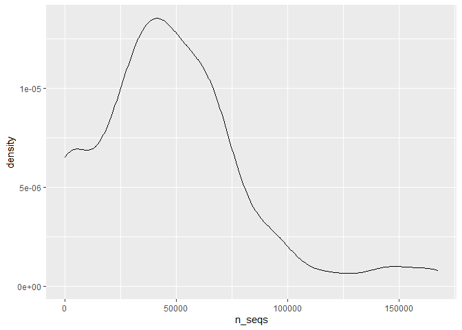<!-- -->

``` r
## zoom into lower end of distribution
ggplot(sampling_coverage,
       aes(x=n_seqs)) + 
    geom_histogram(binwidth=2000) + 
    coord_cartesian(xlim=c(0,50000)) 
```

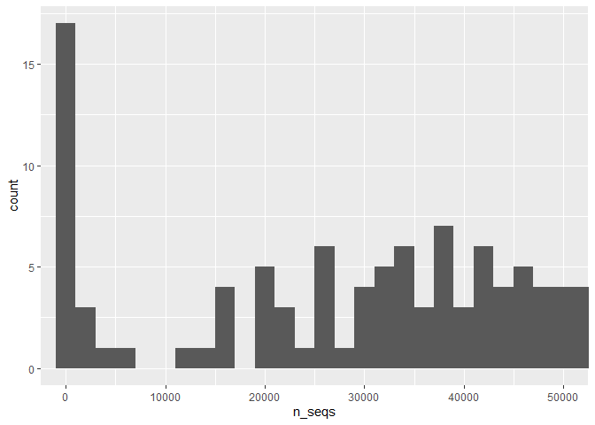<!-- -->

``` r
# to get count, coord_cartesian() zooms in on parts of histogram, 
# can change bin width
## natural "break point" at 10 k reads?

ggplot(sampling_coverage,
       aes(x=1, y=n_seqs)) + 
geom_jitter() + 
scale_y_log10() +
  geom_hline(aes(yintercept = 10000), linetype = 2)
```

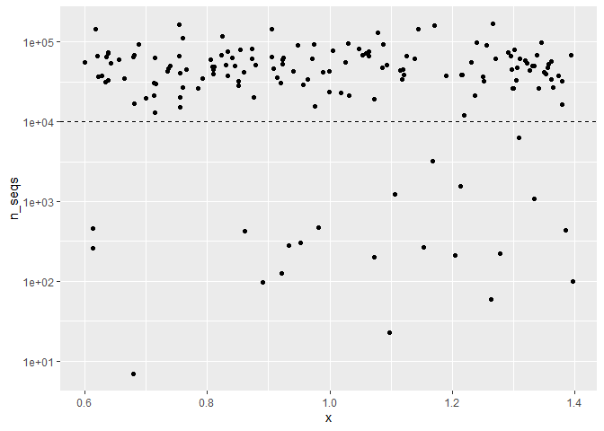<!-- -->

``` r
# position on x axis is randomized so points don't overlap each other, 
# y is the actual number of sequences, putting on log scale to see if there 
# is a threshold of points that some seqs fall beneath, where is the critical 
# mass of seqs

## for first 50 samples (ordered by total read count):
sampling_coverage %>% 
  arrange(n_seqs) %>% 
  ggplot(aes(x=1:nrow(.), y=n_seqs)) + 
  geom_line() + 
  coord_cartesian(xlim=c(0,50), ylim=c(0, 25000)) +
  geom_hline(aes(yintercept = 10000), linetype = 2)
```

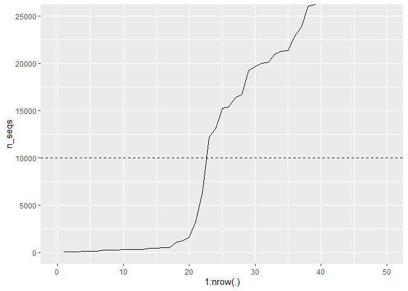<!-- -->

``` r
# arranging samples in order of n_seqs, see number of samples we have on the 
# x axis and number of seqs in each of those samples, where the shoulder is, 
# that's probably where we want to cut, also zooming into shoulder
save(sampling_coverage, file = paste0(dir, "sampling_coverage.Rda"))

## load meta
load(file = paste0(dir, "meta.Rda")) ## loads meta

## merge read coverage with meta
meta_df <- left_join(meta, sampling_coverage, by = "Study_ID")

## Add in timepoints (when sampling took place), summarize first
meta_df.sum <- meta_df %>%
  group_by(Sample_ID) %>%
  summarize(paste(`Sampling_Date`, collapse = " | "),
            paste(`Study_ID`, collapse = " | "))
## all Sample_IDs with two dates = experimental samples
## samples with one date = source

## create timepoints sampling
meta_df$timepoint <- 
  ifelse(is.na(meta_df$Sampling_Date) == TRUE,
                              "Source",
    ifelse(meta_df$Sampling_Date == "2024-07-11",
           "TP1",
       ifelse(meta_df$Sampling_Date %in% 
                c("2024-08-06", ## radish
                  "2024-08-18", ## lettuce
                  "2024-08-19", ## pea (first batch)
                  "2024-08-26"), ## pea (second batch)
              "TP2",
          "Source")
   ))

## look at n_seqs depending on sample type (source, Soil controls, Experimental)
ggplot(meta_df, aes(x = Sample_Type, y = n_seqs)) +
  geom_boxplot() +
  coord_flip()
```

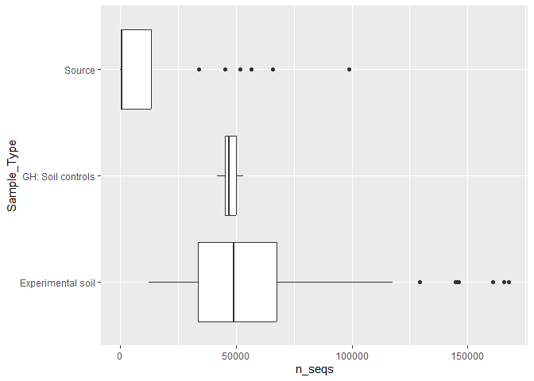<!-- -->

``` r
## look at n_seqs depending on sample treatment
ggplot(meta_df, aes(x = Sample_Treatment, y = n_seqs)) +
  geom_boxplot(aes(fill = timepoint)) +
  coord_flip()
```

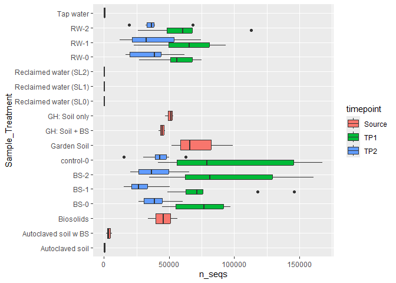<!-- -->

``` r
## exclude water samples + autoclaved soils (source)
meta.f <- meta_df %>% 
  filter(!str_detect(Sample_Treatment, "water") &
         !str_detect(Sample_Treatment, "Autoclaved")) %>%
  droplevels(.)
## 138 samples to include going forward

## plot distribution after excluding samples
ggplot(meta.f,
       aes(x=n_seqs)) + 
  geom_vline(aes(xintercept = 10000), linetype = 2) +
       geom_density() # density plot
```

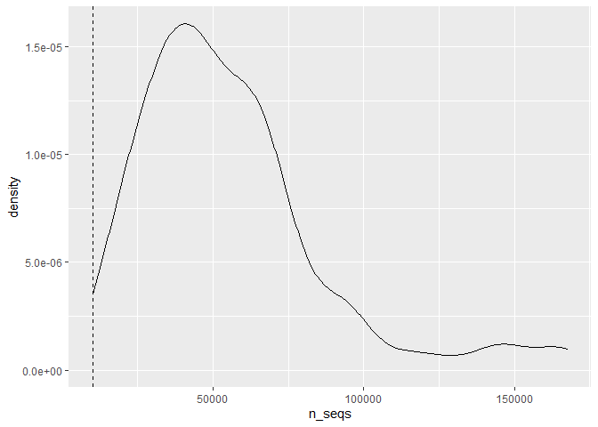<!-- -->

``` r
## zoom into relevant cut off range
meta.f %>% 
  arrange(n_seqs) %>% 
  ggplot(aes(x=1:nrow(.), y=n_seqs)) + 
  geom_line() + 
  coord_cartesian(xlim=c(0,50), ylim=c(5000, 50000)) +
  geom_hline(aes(yintercept = 10000), linetype = 2)
```

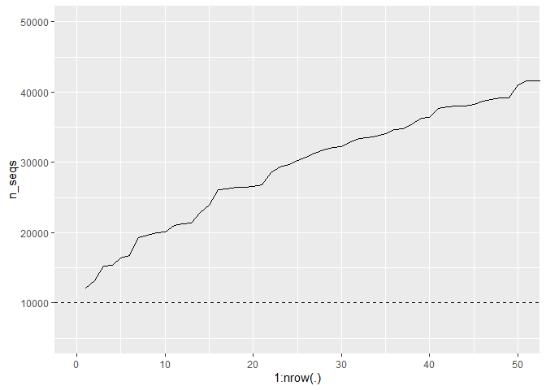<!-- -->

``` r
## none below 10 k reads now

## save metadata file (post-filtering)
save(meta.f, file = paste0(dir, "meta_filtered.Rda"))

## also need to save OTU file after removing non-relevant samples
samples_to_include <- unique(meta.f$Study_ID)

## select only relevant cols
otu.s <- otu %>%
  select(all_of(samples_to_include))

## double check that sample names match up
all(meta.f$Study_ID == colnames(otu.s)) ## TRUE
```

    ## [1] TRUE

``` r
## Remove ASVs that are no longer present in any sample
otu.f <- otu.s[rowSums(otu.s) > 0, ]

## save filtered OTU
save(otu.f, file = paste0(dir, "otu_filtered.Rda"))

## filter TAX table to remove ASVs without any reads
load(file = paste0(dir, "tax.Rda")) ## loads tax

## also need to save OTU file after removing non-relevant sampples
tax.f <- tax[rownames(tax) %in% rownames(otu.f), ]

## ensuring ASVs match
all(rownames(otu.f) == rownames(tax.f)) ## TRUE
```

    ## [1] TRUE

``` r
## save filtered tax table
save(tax.f, file = paste0(dir, "tax_filtered.Rda"))
```

## Metafile formatting

Encoding factor cols, et c.

``` r
## output directory
dir <- "./16S_analyses_files/"

## load the meta file
load(file = paste0(dir, "meta_filtered.Rda")) ## loads meta.f

### Recode levels
treat_ordered <- c("control-0", ## reference
                   "Garden Soil",
                   "Biosolids",
                   "GH: Soil only",
                   "GH: Soil + BS",
                   "RW-0",
                   "RW-1",
                   "RW-2",
                   "BS-0",
                   "BS-1",
                   "BS-2")

meta.f$treat.rn <- factor(meta.f$Sample_Treatment, 
                                levels = treat_ordered)

meta.f$species <- ifelse(is.na(meta.f$species) == FALSE,
                            paste0(meta.f$species),
                            "no_plant")
# unique(meta.f$species)
# [1] "no_plant" "P"        "R"        "L" 
meta.f$species <- factor(meta.f$species,
                            levels = c("no_plant", "L", "R", "P"))

meta.f$species_tp <- ifelse(is.na(meta.f$species) == FALSE,
                            paste0(meta.f$species,"_",meta.f$timepoint),
                            "no_plant")
# unique(meta.f$species_tp)
# [1] "no_plant" "P_TP2"    "R_TP1"    "L_TP1"    "R_TP2"    "L_TP2"    "P_TP1" 
meta.f$species_tp <- factor(meta.f$species_tp,
                            levels = c("no_plant_Source",
                                       "L_TP1", "R_TP1","P_TP1",
                                       "L_TP2", "R_TP2", "P_TP2"))

meta.f$tp_treat <- paste(meta.f$timepoint, meta.f$treat.rn, sep = "_")
meta.f$tp_treat <- as.factor(meta.f$tp_treat)
meta.f$species_treat <- paste(meta.f$species, meta.f$treat.rn, sep = "_")
# unique(meta.f$species_treat)
ordered <- c(
  ## source
  "no_plant_Garden Soil", "no_plant_Biosolids",
  "no_plant_GH: Soil only", "no_plant_GH: Soil + BS",
  ## lettuce
  "L_control-0", "L_RW-0", "L_RW-1", "L_RW-2",
  "L_BS-0", "L_BS-1", "L_BS-2",
  ## radish
  "R_control-0", "R_RW-0", "R_RW-1", "R_RW-2",
  "R_BS-0", "R_BS-1", "R_BS-2",
  ## pea
  "P_control-0", "P_RW-0", "P_RW-1", "P_RW-2",
  "P_BS-0", "P_BS-1", "P_BS-2")
meta.f$species_treat <- factor(meta.f$species_treat,
                               levels = ordered)

### relevel Amendment to compare to control
meta.f$Amendment <- factor(meta.f$Amendment,
                                levels = c("control","RW","BS"))
### make new factor (spikeFac, ordered)
meta.f$spikeFac <- factor(meta.f$Spiking_level,
                               levels = c("SL-0","SL-1","SL-2"),
                               ordered = TRUE)
### make new factor (spikeFac, ordered)
meta.f$timepoint <- factor(meta.f$timepoint,
                               levels = c("Source","TP1","TP2"),
                               ordered = TRUE)

## add back in trait data
load(file = "./direct_indirect-combined.Rda") ## loads direct.w

## only traits and pot ID
direct.d <- direct.w %>%
  select(pot_ID, where(is.numeric))

## combine into one
meta.f <- left_join(meta.f, direct.d, by = "pot_ID")

### save 
save(meta.f, file = paste0(dir, "meta_formatted.Rda"))
```

## Create phyloseq object and filter

Making phyloseq object This link explains what these variables mean in
phyloseq: <https://joey711.github.io/phyloseq/import-data.html>

``` r
## set directory
dir <- "./16S_analyses_files/"

## load relevant files
load(file = paste0(dir, "tax_filtered.Rda")) ## loads tax.f
load(file = paste0(dir, "meta_formatted.Rda")) ## loads meta.f
load(file = paste0(dir, "otu_filtered.Rda")) ## loads otu.f

## add rownames to meta to match up with OTU tab
rownames(meta.f) <- meta.f$Study_ID

## create the phyloseq object
OTU <- otu_table(otu.f, taxa_are_rows = TRUE) ## ASVs appear as rows
TAX <- tax_table(as.matrix(tax.f))
SAMPLE <- sample_data(meta.f)
### put them together to create phyloseq (ps) object
ps <- phyloseq(OTU, TAX, SAMPLE)

## plot number of reads per ASV and read depth per sample
readsumsdf <- data.frame(nreads = sort(taxa_sums(ps), TRUE), 
                        sorted = 1:ntaxa(ps), 
                        type = "ASVs")
readsumsdf <- rbind(readsumsdf, 
                    data.frame(nreads = sort(sample_sums(ps), 
                                             TRUE), 
                               sorted = 1:nsamples(ps), 
                               type = "Samples"))
title <- "Total number of reads"
p <- ggplot(readsumsdf, 
           aes(x = sorted, y = nreads)) + 
  geom_bar(stat = "identity")
p + ggtitle(title) + 
  scale_y_log10() + 
  facet_wrap(~type, 1, scales = "free")
```

<!-- -->

``` r
## save object
save(ps, file = paste0(dir, "phyloseq.Rda")) ## saves full phyloseq obj

## Filter table of bacterial taxa

## pull out tax_df
tax_df <- data.frame(tax_table(ps))
### 21092 ASVs

## Filter table of taxa

### bacteria ASVs?
(tax.bac <- tax_df %>%
  filter(Kingdom == "Bacteria") %>%
  summarize(count = n()))
```

    ##   count
    ## 1 20685

``` r
## 20685/21092 ASVs (98% of all reads)

### mito DNA?
(tax.mito <- tax_df %>%
  filter(Family == "Mitochondria") %>%
  summarize(count = n()))
```

    ##   count
    ## 1   384

``` r
## 384 ASVs

### rhizobia?
(tax.rhizo <- tax_df %>%
  filter(Family == "Rhizobiaceae") %>%
  summarize(count = n()))
```

    ##   count
    ## 1    73

``` r
## 73 OTUs

## subset to only bacteria, excluding mitochondria
ps_bac <- subset_taxa(ps, Kingdom == "Bacteria" & 
                        (is.na(Family) | Family != "Mitochondria"))

## double check all mito are no longer present
## pull out tax_df
tax_df <- data.frame(tax_table(ps_bac))
### 20301 ASVs (20685 [bac] - 384 [mito])

### bacteria ASVs?
(tax.bac <- tax_df %>%
  filter(Kingdom == "Bacteria") %>%
  summarize(count = n()))
```

    ##   count
    ## 1 20301

``` r
## 20301 ASVs

(tax.mito <- tax_df %>%
  filter(Family == "Mitochondria") %>%
  summarize(count = n()))
```

    ##   count
    ## 1     0

``` r
## none

### save 
save(ps_bac, file = paste0(dir, "phyloseq_bac.Rda"))

## save filtered OTU table
write.csv(t(otu_table(ps_bac)), 
          file= paste0(dir, "otu_bac.csv"))

## plot number of reads per ASV and read depth per sample
readsumsdf <- data.frame(nreads = sort(taxa_sums(ps_bac), TRUE), 
                        sorted = 1:ntaxa(ps_bac), 
                        type = "ASVs")
readsumsdf <- rbind(readsumsdf, 
                    data.frame(nreads = sort(sample_sums(ps_bac), 
                                             TRUE), 
                               sorted = 1:nsamples(ps_bac), 
                               type = "Samples"))

# Build the full plot
p <- ggplot(readsumsdf, aes(x = sorted, y = nreads)) + 
  geom_bar(stat = "identity") +
  ggtitle("Total number of reads") +
  scale_y_log10() +
  facet_wrap(~type, nrow = 1, scales = "free") +
  theme_bw() +
  theme(plot.title = element_text(hjust = 0.5),
        strip.text.x = element_text(size = 12, face = "bold"),
        axis.title = element_text(size = 16),
        axis.text = element_text(size = 14))
p
```

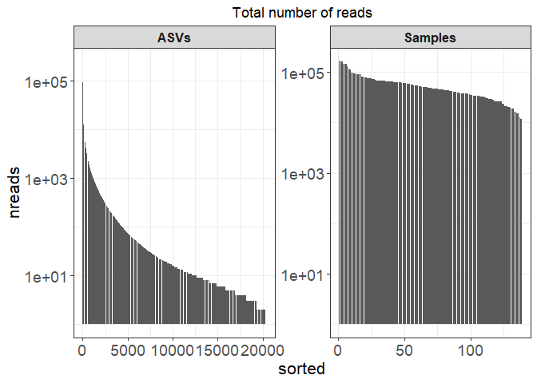<!-- -->

``` r
## save
# Create output directory if it doesn't exist
## set output directory
fig_dir <- "./16S_analyses_files/figs/"
if (!dir.exists(fig_dir)) {
  dir.create(fig_dir, recursive = TRUE)
}
ggsave(paste0(fig_dir, "Nreads_per_ASV-Sample.png"),
       width = 8, height = 4, units = "in", plot = p,
       dpi = 400)
```

## Rarefaction curve

Using the vegan package:
<https://fromthebottomoftheheap.net/2015/04/16/drawing-rarefaction-curves-with-custom-colours/>

The rarecurve() function expects a community matrix with samples in rows
and species (OTUs/ASVs) in columns.

``` r
## set directory
dir <- "./16S_analyses_files/"

## load relevant phyloseq obj 
load(file = paste0(dir, "phyloseq_bac.Rda")) ## loads ps_bac

## pull out meta and otu file
meta <- data.frame(sample_data(ps_bac))
otu <- data.frame(otu_table(ps_bac))

## transpose OTU (samples in rows, ASVs in cols)
otu.t <- t(otu)
raremax <- min(rowSums(otu.t)) ## rowsums adds up reads
raremax ## 11934
```

    ## [1] 11934

``` r
## sort cols by rowSums, pick bottom 25
row_sums <- rowSums(otu.t)
sorted_indices_asc <- order(row_sums)
otu.s <- otu.t[sorted_indices_asc, ]
otu.25 <- otu.s[1:25, ] ## lowest 25 samples

## testing the code: set up plotting parameters
col <- c("black", "darkred", "forestgreen", 
         "orange", "blue", "yellow", "hotpink")
lty <- c("solid", "dashed", "longdash", "dotdash")
pars <- expand.grid(col = col, lty = lty, stringsAsFactors = FALSE)
head(pars)
```

    ##           col   lty
    ## 1       black solid
    ## 2     darkred solid
    ## 3 forestgreen solid
    ## 4      orange solid
    ## 5        blue solid
    ## 6      yellow solid

``` r
## creating the initial plot
out <- with(pars[1:25, ],
            rarecurve(otu.25, step = 20, sample = raremax, col = col,
                      lty = lty, label = TRUE))
```

    ## Warning in rarecurve(otu.25, step = 20, sample = raremax, col = col, lty = lty,
    ## : most observed count data have counts 1, but smallest count is 2

<!-- -->

``` r
## colour curves by treatment

## sort meta to match otu.50
meta_ordered <- meta[rownames(otu.25), ]

meta_ordered <- meta_ordered %>%
  droplevels(.)

meta_ordered$treat <- factor(meta_ordered$treat.rn, 
  levels = c(
    "control-0",
    "RW-0",
    "RW-1",
    "RW-2",
    "BS-0",
    "BS-1",
    "BS-2")
)

length(levels(meta_ordered$treat.rn)) # 7 levels
```

    ## [1] 7

``` r
## set colours to grouping var (treat)
### determine how many treatment groups

mycols <- c("gray",
            "lightblue",
            "cornflowerblue",
            "blue",
            "#EABD8C",
            "#FFAD00",
            "#B06500")

# Set levels of the factor to match the order of colours in mycols
grp <- factor(meta_ordered$treat.rn, 
              levels = levels(meta_ordered$treat.rn))  
# or use unique(meta_ordered$treat.rn) if needed
cols <- mycols[as.numeric(grp)]

## pull out required parameters from out
Nmax <- sapply(out, function(x) max(attr(x, "Subsample")))
Smax <- sapply(out, max)

## plot
png(filename = paste0(dir, "figs/rarefaction_curve.png"),
    width = 6, height = 6, units = "in", res = 300)
plot(c(1, max(Nmax)), c(1, max(Smax)), 
     xlab = "Sample Coverage \n (read counts per sample)",
     ylab = "ASVs", type = "n")
abline(v = raremax)
for (i in seq_along(out)) {
    N <- attr(out[[i]], "Subsample")
    lines(N, out[[i]], col = cols[i], lwd = 2)
}
dev.off()
```

    ## png 
    ##   2

``` r
include_graphics(paste0(dir, "figs/rarefaction_curve.png"))
```

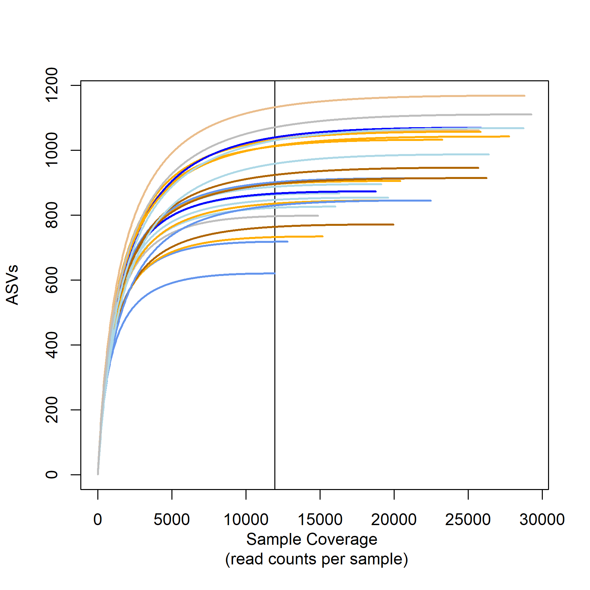

``` r
## convert to ggplot with a legend
meta.o <- meta_ordered %>%
  mutate(Sample = paste0("Sample_", row_number()))

sample_ids <- if (!is.null(names(out))) names(out) else paste0("Sample_", seq_along(out))

df_rare <- map2_dfr(out, sample_ids, function(vec, sid) {
  tibble(
    Sample = sid,
    N = as.numeric(attr(vec, "Subsample")),
    S = as.numeric(vec)
  )
}) %>%
  left_join(meta.o %>% select(Sample, Treatment = treat.rn), by = "Sample")

# Set treatment levels to ensure proper mapping
treat_levels <- levels(meta.o$treat.rn)
length(treat_levels); treat_levels
```

    ## [1] 7

    ## [1] "control-0" "RW-0"      "RW-1"      "RW-2"      "BS-0"      "BS-1"     
    ## [7] "BS-2"

``` r
# Ensure Treatment is a factor with those levels after the join
df_rare <- df_rare %>%
  mutate(Treatment = factor(Treatment, levels = treat_levels))

stopifnot(length(mycols) == length(treat_levels))  # sanity check (should be 7)

p_rare <- ggplot(df_rare, aes(x = N, y = S, color = Treatment, group = Sample)) +
  geom_line(linewidth = 0.7, alpha = 0.9) +
  geom_vline(xintercept = raremax, linetype = "dashed") +
  scale_color_manual(values = mycols) +
  labs(x = "Sample Coverage", y = "ASVs") +
  theme_bw(base_size = 11) +
  theme(legend.position = "bottom")

p_rare
```

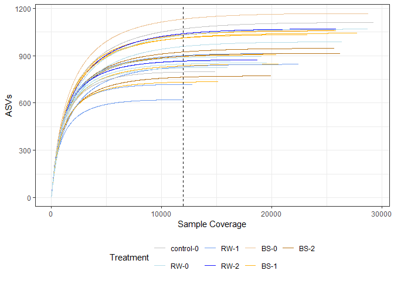<!-- -->

``` r
# ---- Calculating coverage ----
# otu_table: rows = samples, columns = ASV counts
# rare_depth: rarefaction threshold
rare_depth <- raremax

## top 25 samples
otu.t25 <- otu.s[114:138, ] ## highest 25 samples

# Ensure row names are sample IDs
sample_names <- rownames(otu.t25)

# ---- Compute Rarefaction Curves ----
rare_curves <- rarecurve(otu.t25, step = 100, sample = rare_depth, label = FALSE)
```

    ## Warning in rarecurve(otu.t25, step = 100, sample = rare_depth, label = FALSE):
    ## most observed count data have counts 1, but smallest count is 2

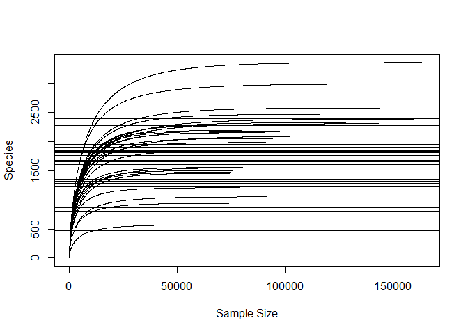<!-- -->

``` r
# ---- Calculate Coverage ----
coverage_df <- map_df(seq_along(rare_curves), function(i) {
  curve <- rare_curves[[i]]
  sample_name <- sample_names[i]
  
  # Reconstruct read counts
  read_counts <- seq(100, length(curve) * 100, by = 100)
  
  max_richness <- max(curve)
  
  # If sample has fewer reads than rare_depth, use last point
  if (rare_depth > max(read_counts)) {
    richness_at_threshold <- tail(curve, 1)
    depth_used <- max(read_counts)
    note <- "Below rarefaction depth"
  } else {
    idx <- which.min(abs(read_counts - rare_depth))
    richness_at_threshold <- curve[idx]
    depth_used <- read_counts[idx]
    note <- "OK"
  }
  
  tibble(
    Sample = sample_name,
    MaxRichness = max_richness,
    RichnessAtThreshold = richness_at_threshold,
    Coverage = richness_at_threshold / max_richness,
    DepthUsed = depth_used,
    Status = note
  )
})

## put into one plot
# packages
library(ggplot2)
library(cowplot)
library(ggplotify)  # for as.ggplot()
```

    ## Warning: package 'ggplotify' was built under R version 4.5.2

``` r
## colour samples by treat

coverage_df <- coverage_df %>%
  left_join(., meta %>% select(Sample = Study_ID, treat.rn), by = "Sample")

## 2) Your ggplot coverage chart (small tweaks for consistency)
cov <- ggplot(coverage_df, aes(x = reorder(Sample, Coverage, mean), 
                               y = Coverage, fill = treat.rn)) +
  geom_bar(stat = "identity") +
  labs(title = paste0("Coverage at Rarefaction Depth (", rare_depth, " reads)"), 
       y = "Coverage", x = "Sample",
       fill = "Treatment") +
  scale_fill_manual(values = c("gray",
                                "black",
                                "brown",
                                "green3",
                                "green4",
                                "lightblue",
                                "cornflowerblue",
                                "blue",
                                "#EABD8C",
                                "#FFAD00",
                                "#B06500")) +
  theme_bw() +
  theme(axis.text.x = element_text(angle = 90, hjust = 0.5, vjust = 0.5),
        legend.position = "bottom",
        plot.title = element_text(hjust = 0.5))
cov
```

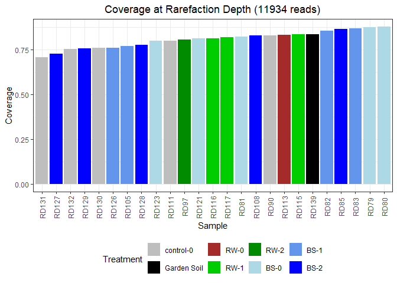<!-- -->

``` r
## 3) Arrange with cowplot
panel <- cowplot::plot_grid(
  p_rare, cov,
  labels = c("A", "B"),
  ncol = 2, align = "h", rel_widths = c(1, 1.2)
)

panel
```

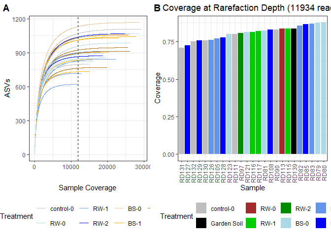<!-- -->

``` r
## 4) Save
ggsave(filename = file.path(dir, "figs/rarefaction_plus_coverage.png"),
       plot = panel, width = 10, height = 5, dpi = 300)
```

## Alpha diversity

Run on rarified data in which host DNA is removed

Rarefaction is generally recommended for alpha diversity metrics (e.g.,
Shannon, Simpson, Observed OTUs) because these are sensitive to sampling
depth. It ensures that differences in diversity are due to biological
variation, not sequencing effort.

Shannon What it measures: \* Richness (number of taxa) \* Evenness (how
evenly distributed the taxa are) Interpretation: \* Higher values = more
diverse communities. \* Sensitive to rare taxa — even low-abundance
species contribute to the index. \* Typical range: Usually between 1.5
and 3.5 for ecological datasets. Higher for soil

InvSimpson What it measures: \* Dominance and evenness. \* Less
sensitive to rare taxa; emphasizes common taxa. Interpretation: \*
Higher values = more even communities. \* A community dominated by one
or few taxa will have a low inverse Simpson value. \* Typical range:
Starts at 1 (minimum diversity); higher values indicate more diversity.

### Calculate diveristy (shannon, simpson)

Need to normalize to garden soil to get diversity loss

To capture how diversity changes between T1 and T2, we calculated rate
of recovery relative to the initial loss:

RR = (Div T2 - Div T1) / Div initial (garden soil)

expressing the change between TP2 and TP1 as a fraction of the initial
diversity: \* Positive value → diversity increased from TP1 to TP2
(recovery). \* Negative value → diversity decreased further from TP1 to
TP2 (continued loss). \* Magnitude → how large the change is relative to
the initial diversity baseline.

``` r
## set directory
dir <- "./16S_analyses_files/"

## load relevant phyloseq obj 
load(file = paste0(dir, "phyloseq_bac.Rda")) ## loads ps_bac

# rarefy, rarefying to ~12000 based on curve
min_lib <- min(sample_sums(ps_bac))
rare_ps <- rarefy_even_depth(ps_bac,
                           sample.size= min_lib,
                           verbose=FALSE,
                           replace = FALSE)

## plot number of reads per ASV and read depth per sample
readsumsdf <- data.frame(nreads = sort(taxa_sums(rare_ps), TRUE), 
                        sorted = 1:ntaxa(rare_ps), 
                        type = "ASVs")
readsumsdf <- rbind(readsumsdf, 
                    data.frame(nreads = sort(sample_sums(rare_ps), 
                                             TRUE), 
                               sorted = 1:nsamples(rare_ps), 
                               type = "Samples"))
title <- "Total number of reads"
p <- ggplot(readsumsdf, 
           aes(x = sorted, y = nreads)) + 
  geom_bar(stat = "identity")
p + ggtitle(title) + 
  scale_y_log10() + 
  facet_wrap(~type, 1, scales = "free")
```

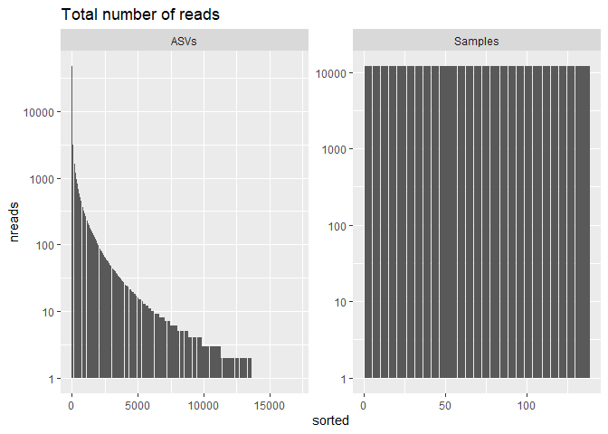<!-- -->

``` r
## save
save(rare_ps, file = paste0(dir, "phyloseq_bac.rare.Rda"))
write.csv(t(otu_table(rare_ps)), 
          file= paste0(dir, "otu_bac.rare.csv"))

## calculate richness metrics to pair with metadata
richness.df <- estimate_richness(rare_ps, 
                                 measures = 
                                   c("Shannon",
                                     "InvSimpson"))

## correction to InvSimp (x100)
richness.df$InvSimpson.c <- richness.df$InvSimpson /100

## create a col for sample ID
richness.df$Study_ID <- rownames(richness.df)

## Combine with sample metadata
meta <- data.frame(sample_data(rare_ps))
meta <- left_join(meta, richness.df, by = "Study_ID")

## recovery rates
### convert to long for traits
meta.l <- meta %>%
  pivot_longer(
    cols = c("Shannon","InvSimpson"),
    names_to = "metric",
    values_to = "units"
  )
### 138 samples x 2 traits = 276 rows

### calculate prop of total diversity (relative to Garden Soil) and loss
meta.GS <- meta.l %>%
  filter(Sample_Treatment == "Garden Soil") %>%
  group_by(metric) %>%
  summarize(mean_GS = mean(units, na.rm = TRUE)) %>%
  ungroup(.)

GS_shannon <- meta.GS$mean_GS[meta.GS$metric == "Shannon"]
GS_simpson <- meta.GS$mean_GS[meta.GS$metric == "InvSimpson"]

## add in control means to long df
meta.l <- meta.l %>%
  left_join(
    meta.GS,
    by = c("metric")
  ) %>%
  mutate(FC.loss = log2(units/mean_GS),
         prop.loss = 1 - (units/mean_GS))

## convert back to wide (each row = sample)
meta.w <- meta.l %>%
  pivot_wider(
    names_from = metric,
    values_from = c("FC.loss","prop.loss"),
    id_cols = Study_ID
  )
## 138 samples

### add back to meta
meta <- left_join(meta, meta.w, by = c("Study_ID"))

## save formatted file
save(meta, file = paste0(dir, "meta_div.Rda"))

## pivot_wider for timepoint
meta.tp <- meta %>%
  filter(Sample_Type == "Experimental soil") %>%
  droplevels(.) %>%
  pivot_wider(
    names_from = timepoint,
    values_from = c("Shannon","InvSimpson"),
    id_cols = c("pot_ID","species","Amendment",
                "spikeFac","treat.rn")
  ) %>% ## 63 samples
  ## calculate diversity recovery rates (RR)
  mutate(div.RR.Shannon = 
    (Shannon_TP2 - Shannon_TP1) / GS_shannon,
         div.RR.Simpson = 
    (InvSimpson_TP2 - InvSimpson_TP1) / GS_simpson
         )

## add back in trait data
load(file = "./direct_indirect-combined.Rda") ## loads direct.w

## only traits and pot ID
direct.d <- direct.w %>%
  select(pot_ID, where(is.numeric))

## combine into one
meta <- left_join(meta, direct.d, by = "pot_ID")
meta.tp <- left_join(meta.tp, direct.d, by = "pot_ID")

## save formatted files
save(meta, file = paste0(dir, "meta_div.traits.Rda"))
save(meta.tp, file = paste0(dir, "meta_div.w.traits.Rda"))
```

### Plots: alpha diversity

``` r
## directory
dir <- "./16S_analyses_files/"

## load file
load(file = paste0(dir, "meta_div.Rda")) ## loads meta

##### Plots (species, timepoint, treatment) #####
metric.list <- c("Shannon","InvSimpson.c",
                 "FC.loss_Shannon","FC.loss_InvSimpson",
                 "prop.loss_Shannon","prop.loss_InvSimpson")
### function
source("./Source_code/5_alpha-plot.func.R")

plots.out <- sapply(metric.list, 
                plot_alpha_div, 
                df = meta %>%
                  filter(!treat.rn %in% 
                           c("GH: Soil only",
                             "GH: Soil + BS",
                             "Biosolids")) %>%
                          droplevels(.),
                      USE.NAMES = TRUE, 
                      simplify = FALSE)
```

    ## [1] "Shannon"

    ## `summarise()` has grouped output by 'species', 'treat.rn', 'tp_treat',
    ## 'species_tp', 'species_treat'. You can override using the `.groups` argument.
    ## `summarise()` has grouped output by 'species', 'treat.rn', 'tp_treat',
    ## 'species_tp', 'species_treat'. You can override using the `.groups` argument.

    ## [1] "InvSimpson.c"

    ## `summarise()` has grouped output by 'species', 'treat.rn', 'tp_treat',
    ## 'species_tp', 'species_treat'. You can override using the `.groups` argument.
    ## `summarise()` has grouped output by 'species', 'treat.rn', 'tp_treat',
    ## 'species_tp', 'species_treat'. You can override using the `.groups` argument.

    ## [1] "FC.loss_Shannon"

    ## `summarise()` has grouped output by 'species', 'treat.rn', 'tp_treat',
    ## 'species_tp', 'species_treat'. You can override using the `.groups` argument.
    ## `summarise()` has grouped output by 'species', 'treat.rn', 'tp_treat',
    ## 'species_tp', 'species_treat'. You can override using the `.groups` argument.

    ## [1] "FC.loss_InvSimpson"

    ## `summarise()` has grouped output by 'species', 'treat.rn', 'tp_treat',
    ## 'species_tp', 'species_treat'. You can override using the `.groups` argument.
    ## `summarise()` has grouped output by 'species', 'treat.rn', 'tp_treat',
    ## 'species_tp', 'species_treat'. You can override using the `.groups` argument.

    ## [1] "prop.loss_Shannon"

    ## `summarise()` has grouped output by 'species', 'treat.rn', 'tp_treat',
    ## 'species_tp', 'species_treat'. You can override using the `.groups` argument.
    ## `summarise()` has grouped output by 'species', 'treat.rn', 'tp_treat',
    ## 'species_tp', 'species_treat'. You can override using the `.groups` argument.

    ## [1] "prop.loss_InvSimpson"

    ## `summarise()` has grouped output by 'species', 'treat.rn', 'tp_treat',
    ## 'species_tp', 'species_treat'. You can override using the `.groups` argument.
    ## `summarise()` has grouped output by 'species', 'treat.rn', 'tp_treat',
    ## 'species_tp', 'species_treat'. You can override using the `.groups` argument.

``` r
### Combine plots
plots <- plot_grid(plots.out[["Shannon"]] +
                         labs(y = "Shannon"),
                       plots.out[["InvSimpson.c"]] +
                         labs(y = "Inv. Simpson (/100)"),
                       ncol = 1,
                       nrow = 2,
                       align = "v",
                       rel_heights = c(1,1))
plots
```

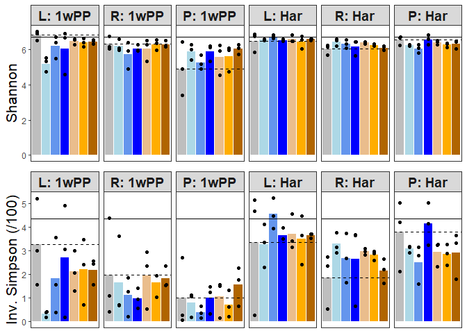<!-- -->

``` r
### save plots
ggsave(paste0(dir, "figs/plots-alpha_div.png"),
       width=12, height=6, units = "in")
saveRDS(plots, file = paste0(dir, "figs/plots-alpha_div.rds"))
```

### Models

#### M1: species x amend x timepoint

``` r
## directory
dir <- "./16S_analyses_files/"

## M1: species x amendment (for ea. timepoint separately)
## load file
load(file = paste0(dir, "meta_div.Rda")) ## loads meta

## set contrasts
options(contrasts=c("contr.sum","contr.poly")) 

# Create output directory if it doesn't exist
## set output directory
mod_dir <- paste0(dir, "models/")
if (!dir.exists(mod_dir)) {
  dir.create(mod_dir, recursive = TRUE)
}

meta.f <- meta %>%
  filter(species != "no_plant") %>%
  droplevels(.)

## 1)  species x amendment (for each timepoint sep)
source("./Source_code/6_alpha-mod_species.vs.amend.func.R")
```

    ## 
    ## Attaching package: 'lmerTest'

    ## The following object is masked from 'package:lme4':
    ## 
    ##     lmer

    ## The following object is masked from 'package:stats':
    ## 
    ##     step

``` r
metrics_list <- c("Shannon", "InvSimpson")
results_list.amend <- map(metrics_list, ~ 
                          div_species.vs.amend(metrics = .x, df = meta.f, 
                                               output_dir = mod_dir)
                          )
```

    ## [1] "Shannon"

    ## Analysis of Deviance Table (Type III Wald chisquare tests)
    ## 
    ## Response: log(metric_value)
    ##                                  Chisq Df Pr(>Chisq)    
    ## (Intercept)                 15670.9732  1  < 2.2e-16 ***
    ## species                         5.2507  2  0.0724142 .  
    ## Amendment                       0.5245  2  0.7693064    
    ## timepoint                      11.8348  1  0.0005813 ***
    ## species:Amendment               7.0645  4  0.1325170    
    ## species:timepoint               7.0752  2  0.0290834 *  
    ## Amendment:timepoint             0.3741  2  0.8294173    
    ## species:Amendment:timepoint    14.5903  4  0.0056310 ** 
    ## ---
    ## Signif. codes:  0 '***' 0.001 '**' 0.01 '*' 0.05 '.' 0.1 ' ' 1
    ## [1] "InvSimpson"

    ## Analysis of Deviance Table (Type III Wald chisquare tests)
    ## 
    ## Response: log(metric_value)
    ##                                 Chisq Df Pr(>Chisq)    
    ## (Intercept)                 1560.8556  1  < 2.2e-16 ***
    ## species                        1.3952  2    0.49777    
    ## Amendment                      1.4773  2    0.47776    
    ## timepoint                     23.1963  1  1.463e-06 ***
    ## species:Amendment              3.3768  4    0.49685    
    ## species:timepoint              5.0920  2    0.07839 .  
    ## Amendment:timepoint            3.7177  2    0.15585    
    ## species:Amendment:timepoint    6.7741  4    0.14832    
    ## ---
    ## Signif. codes:  0 '***' 0.001 '**' 0.01 '*' 0.05 '.' 0.1 ' ' 1

``` r
names(results_list.amend) <- metrics_list

save(results_list.amend, file = paste0(dir, "models/results_amend.Rdata"))
```

#### M2: species x contaminant x timepoint

``` r
## directory
dir <- "./16S_analyses_files/"

## M2: species x contam (for ea. timepoint and amend separately)
## load file
load(file = paste0(dir, "meta_div.Rda")) ## loads meta

## set contrasts
options(contrasts=c("contr.sum","contr.poly")) 

# Create output directory if it doesn't exist
## set output directory
mod_dir <- "./16S_analyses_files/models/"
if (!dir.exists(mod_dir)) {
  dir.create(mod_dir, recursive = TRUE)
}

meta.f <- meta %>%
  filter(species != "no_plant") %>%
  droplevels(.)

## 1)  species x contaminant
source("./Source_code/7_alpha-mod_species.vs.contam.func.R")

# Define combinations and corresponding metrics/amendments
combs_list <- c("Shannon_BS", "Shannon_RW", "InvSimpson_BS", "InvSimpson_RW")
metrics_list <- c("Shannon", "Shannon", "InvSimpson", "InvSimpson")
amends_list <- c("BS", "RW", "BS", "RW")

# Map over all combinations
results_list_contam <- map2(metrics_list, amends_list, ~ 
  div_species.vs.contam(combs = paste0(.x, "_", .y),
                        metrics = .x,
                        amends = .y,
                        df = meta.f,
                        output_dir = mod_dir)
)
```

    ## [1] "Shannon_BS"

    ## Analysis of Deviance Table (Type III Wald chisquare tests)
    ## 
    ## Response: log(metric_value)
    ##                                 Chisq Df Pr(>Chisq) metric term amend
    ## (Intercept)                39642.0235  1    0.00000      1    1     1
    ## species                       11.6713  2    0.00292      1    2     1
    ## spikeFac                       0.4702  2    0.79049      1    6     1
    ## timepoint                      6.6799  1    0.00975      1    8     1
    ## species:spikeFac               1.3463  4    0.85347      1    3     1
    ## species:timepoint              6.8830  2    0.03202      1    5     1
    ## spikeFac:timepoint             2.5354  2    0.28147      1    7     1
    ## species:spikeFac:timepoint     1.5656  4    0.81495      1    4     1
    ## [1] "Shannon_RW"

    ## boundary (singular) fit: see help('isSingular')

    ## Analysis of Deviance Table (Type III Wald chisquare tests)
    ## 
    ## Response: log(metric_value)
    ##                                 Chisq Df Pr(>Chisq) metric term amend
    ## (Intercept)                25983.9401  1    0.00000      1    1     1
    ## species                        1.8036  2    0.40585      1    2     1
    ## spikeFac                       0.9356  2    0.62639      1    6     1
    ## timepoint                     19.0824  1    0.00001      1    8     1
    ## species:spikeFac               9.3564  4    0.05278      1    3     1
    ## species:timepoint              2.4331  2    0.29625      1    5     1
    ## spikeFac:timepoint             0.5415  2    0.76282      1    7     1
    ## species:spikeFac:timepoint     4.2815  4    0.36925      1    4     1
    ## [1] "InvSimpson_BS"

    ## Analysis of Deviance Table (Type III Wald chisquare tests)
    ## 
    ## Response: log(metric_value)
    ##                                Chisq Df Pr(>Chisq) metric term amend
    ## (Intercept)                4513.0738  1    0.00000      1    1     1
    ## species                       8.3992  2    0.01500      1    2     1
    ## spikeFac                      0.6966  2    0.70589      1    6     1
    ## timepoint                    28.1309  1    0.00000      1    8     1
    ## species:spikeFac              1.4340  4    0.83826      1    3     1
    ## species:timepoint             5.7403  2    0.05669      1    5     1
    ## spikeFac:timepoint            2.1320  2    0.34438      1    7     1
    ## species:spikeFac:timepoint    1.0570  4    0.90104      1    4     1
    ## [1] "InvSimpson_RW"

    ## Analysis of Deviance Table (Type III Wald chisquare tests)
    ## 
    ## Response: log(metric_value)
    ##                                Chisq Df Pr(>Chisq) metric term amend
    ## (Intercept)                2233.1680  1    0.00000      1    1     1
    ## species                       1.1680  2    0.55766      1    2     1
    ## spikeFac                      1.0685  2    0.58610      1    6     1
    ## timepoint                    45.5418  1    0.00000      1    8     1
    ## species:spikeFac              7.0814  4    0.13165      1    3     1
    ## species:timepoint             2.1046  2    0.34913      1    5     1
    ## spikeFac:timepoint            1.0977  2    0.57762      1    7     1
    ## species:spikeFac:timepoint    1.9038  4    0.75344      1    4     1

``` r
# Name the list for easy access
names(results_list_contam) <- combs_list

## format and save outputs (both models)
source("./Source_code/8_alpha-mod_formatter.func.R")
load(file = paste0(dir, "models/results_amend.Rdata")) ## loads results_list.amend
# Assuming results_list is created by looping over metrics with div_species.vs.amend()
formatted_amend <- format_anova_and_contrasts_flex(results_list.amend, 
                                                    output_dir = mod_dir, 
                                                    analysis_type = "amendment")
```

    ## Warning: package 'kableExtra' was built under R version 4.5.2

    ## 
    ## Attaching package: 'kableExtra'

    ## The following object is masked from 'package:dplyr':
    ## 
    ##     group_rows

    ## Warning: Expected 2 pieces. Missing pieces filled with `NA` in 78 rows [1, 2, 3, 4, 5,
    ## 6, 7, 8, 9, 10, 11, 12, 13, 14, 15, 16, 17, 18, 19, 20, ...].

    ## <table class="table table-striped table-hover" style="color: black; width: auto !important; margin-left: auto; margin-right: auto;">
    ## <caption>Significant contrasts (p &lt; 0.1)</caption>
    ##  <thead>
    ##   <tr>
    ##    <th style="text-align:left;"> amendment </th>
    ##    <th style="text-align:left;"> contrast_id </th>
    ##    <th style="text-align:left;"> Shannon </th>
    ##    <th style="text-align:left;"> InvSimpson </th>
    ##   </tr>
    ##  </thead>
    ## <tbody>
    ##   <tr>
    ##    <td style="text-align:left;"> NA </td>
    ##    <td style="text-align:left;width: 12cm; "> RW / control: L_SL-0_TP1 </td>
    ##    <td style="text-align:left;"> t = -3.36, df = 40, p = 0.00371**; Est. [95% CL] = -0.395 [-0.668 to -0.122] </td>
    ##    <td style="text-align:left;"> t = -3.11, df = 40, p = 0.0071**; Est. [95% CL] = -3.24 [-5.65 to -0.829] </td>
    ##   </tr>
    ##   <tr>
    ##    <td style="text-align:left;"> NA </td>
    ##    <td style="text-align:left;width: 12cm; "> RW / control: P_SL-0_TP1 </td>
    ##    <td style="text-align:left;"> t = 2.64, df = 40, p = 0.0237*; Est. [95% CL] = 0.31 [0.0378 to 0.583] </td>
    ##    <td style="text-align:left;"> NA </td>
    ##   </tr>
    ##   <tr>
    ##    <td style="text-align:left;"> NA </td>
    ##    <td style="text-align:left;width: 12cm; "> L / P: NA_control_TP1 </td>
    ##    <td style="text-align:left;"> t = 4.45, df = 40, p &lt; 0.001; Est. [95% CL] = 0.523 [0.235 to 0.811] </td>
    ##    <td style="text-align:left;"> t = 2.79, df = 40, p = 0.0225*; Est. [95% CL] = 2.9 [0.357 to 5.44] </td>
    ##   </tr>
    ##   <tr>
    ##    <td style="text-align:left;"> NA </td>
    ##    <td style="text-align:left;width: 12cm; "> R / P: NA_control_TP1 </td>
    ##    <td style="text-align:left;"> t = 3.51, df = 40, p = 0.00346**; Est. [95% CL] = 0.413 [0.125 to 0.701] </td>
    ##    <td style="text-align:left;"> NA </td>
    ##   </tr>
    ##   <tr>
    ##    <td style="text-align:left;"> NA </td>
    ##    <td style="text-align:left;width: 12cm; "> L / R: NA_RW_TP1 </td>
    ##    <td style="text-align:left;"> t = -2.22, df = 40, p = 0.0818.; Est. [95% CL] = -0.261 [-0.549 to 0.0268] </td>
    ##    <td style="text-align:left;"> NA </td>
    ##   </tr>
    ##   <tr>
    ##    <td style="text-align:left;"> NA </td>
    ##    <td style="text-align:left;width: 12cm; "> TP2 / TP1: L_RW_NA </td>
    ##    <td style="text-align:left;"> t = 3.08, df = 20, p = 0.00649**; Est. [95% CL] = 0.337 [0.107 to 0.566] </td>
    ##    <td style="text-align:left;"> t = 3.52, df = 20, p = 0.00245**; Est. [95% CL] = 3.36 [1.35 to 5.37] </td>
    ##   </tr>
    ##   <tr>
    ##    <td style="text-align:left;"> NA </td>
    ##    <td style="text-align:left;width: 12cm; "> TP2 / TP1: P_control_NA </td>
    ##    <td style="text-align:left;"> t = 4.25, df = 20, p &lt; 0.001; Est. [95% CL] = 0.465 [0.235 to 0.694] </td>
    ##    <td style="text-align:left;"> t = 3.34, df = 20, p = 0.00361**; Est. [95% CL] = 3.2 [1.19 to 5.2] </td>
    ##   </tr>
    ##   <tr>
    ##    <td style="text-align:left;"> NA </td>
    ##    <td style="text-align:left;width: 12cm; "> TP2 / TP1: P_BS_NA </td>
    ##    <td style="text-align:left;"> t = 1.99, df = 20, p = 0.0615.; Est. [95% CL] = 0.218 [-0.0117 to 0.448] </td>
    ##    <td style="text-align:left;"> t = 2.17, df = 20, p = 0.0432*; Est. [95% CL] = 2.08 [0.0707 to 4.09] </td>
    ##   </tr>
    ##   <tr>
    ##    <td style="text-align:left;"> NA </td>
    ##    <td style="text-align:left;width: 12cm; "> TP2 / TP1: P_RW_NA </td>
    ##    <td style="text-align:left;"> NA </td>
    ##    <td style="text-align:left;"> t = 2.43, df = 20, p = 0.0256*; Est. [95% CL] = 2.33 [0.319 to 4.33] </td>
    ##   </tr>
    ## </tbody>
    ## </table>

    ## Saved ANOVA + contrasts + emmeans tables for amendment analysis.

``` r
# Assuming results_list is created by looping over metrics with div_species.vs.amend()
formatted_contam <- format_anova_and_contrasts_flex(results_list_contam, 
                                                    mod_dir, 
                                                    analysis_type = "contamination")
```

    ## <table class="table table-striped table-hover" style="color: black; width: auto !important; margin-left: auto; margin-right: auto;">
    ## <caption>Significant contrasts (p &lt; 0.1)</caption>
    ##  <thead>
    ##   <tr>
    ##    <th style="text-align:left;"> amendment </th>
    ##    <th style="text-align:left;"> contrast_id </th>
    ##    <th style="text-align:left;"> Shannon </th>
    ##    <th style="text-align:left;"> InvSimpson </th>
    ##   </tr>
    ##  </thead>
    ## <tbody>
    ##   <tr>
    ##    <td style="text-align:left;"> BS </td>
    ##    <td style="text-align:left;width: 12cm; "> L / P: NA_SL-0_TP1 </td>
    ##    <td style="text-align:left;"> t = 3.02, df = 40, p = 0.0127*; Est. [95% CL] = 0.23 [0.0434 to 0.416] </td>
    ##    <td style="text-align:left;"> t = 2.36, df = 40, p = 0.0606.; Est. [95% CL] = 1.55 [-0.0572 to 3.15] </td>
    ##   </tr>
    ##   <tr>
    ##    <td style="text-align:left;"> BS </td>
    ##    <td style="text-align:left;width: 12cm; "> L / P: NA_SL-1_TP1 </td>
    ##    <td style="text-align:left;"> t = 2.62, df = 40, p = 0.0332*; Est. [95% CL] = 0.2 [0.0136 to 0.386] </td>
    ##    <td style="text-align:left;"> t = 2.58, df = 40, p = 0.0371*; Est. [95% CL] = 1.69 [0.0864 to 3.3] </td>
    ##   </tr>
    ##   <tr>
    ##    <td style="text-align:left;"> BS </td>
    ##    <td style="text-align:left;width: 12cm; "> R / P: NA_SL-1_TP1 </td>
    ##    <td style="text-align:left;"> t = 2.32, df = 40, p = 0.0652.; Est. [95% CL] = 0.177 [-0.00917 to 0.363] </td>
    ##    <td style="text-align:left;"> t = 2.27, df = 40, p = 0.0736.; Est. [95% CL] = 1.49 [-0.116 to 3.09] </td>
    ##   </tr>
    ##   <tr>
    ##    <td style="text-align:left;"> BS </td>
    ##    <td style="text-align:left;width: 12cm; "> TP2 / TP1: P_SL-0_NA </td>
    ##    <td style="text-align:left;"> t = 3.01, df = 20, p = 0.00756**; Est. [95% CL] = 0.218 [0.0658 to 0.37] </td>
    ##    <td style="text-align:left;"> t = 3.32, df = 20, p = 0.00384**; Est. [95% CL] = 2.08 [0.761 to 3.39] </td>
    ##   </tr>
    ##   <tr>
    ##    <td style="text-align:left;"> BS </td>
    ##    <td style="text-align:left;width: 12cm; "> TP2 / TP1: P_SL-1_NA </td>
    ##    <td style="text-align:left;"> t = 2.34, df = 20, p = 0.0307*; Est. [95% CL] = 0.17 [0.0177 to 0.322] </td>
    ##    <td style="text-align:left;"> t = 3.72, df = 20, p = 0.00158**; Est. [95% CL] = 2.33 [1.01 to 3.65] </td>
    ##   </tr>
    ##   <tr>
    ##    <td style="text-align:left;"> RW </td>
    ##    <td style="text-align:left;width: 12cm; "> linear: L_NA_TP1 </td>
    ##    <td style="text-align:left;"> t = 2.05, df = 40, p = 0.0479*; Est. [95% CL] = 0.199 [0.0019 to 0.396] </td>
    ##    <td style="text-align:left;"> t = 2.37, df = 40, p = 0.0234*; Est. [95% CL] = 2.16 [0.31 to 4.01] </td>
    ##   </tr>
    ##   <tr>
    ##    <td style="text-align:left;"> RW </td>
    ##    <td style="text-align:left;width: 12cm; "> quadratic: L_NA_TP1 </td>
    ##    <td style="text-align:left;"> t = -1.85, df = 40, p = 0.0729.; Est. [95% CL] = -0.311 [-0.652 to 0.0304] </td>
    ##    <td style="text-align:left;"> NA </td>
    ##   </tr>
    ##   <tr>
    ##    <td style="text-align:left;"> RW </td>
    ##    <td style="text-align:left;width: 12cm; "> quadratic: P_NA_TP1 </td>
    ##    <td style="text-align:left;"> t = 1.93, df = 40, p = 0.0618.; Est. [95% CL] = 0.324 [-0.0169 to 0.665] </td>
    ##    <td style="text-align:left;"> NA </td>
    ##   </tr>
    ##   <tr>
    ##    <td style="text-align:left;"> RW </td>
    ##    <td style="text-align:left;width: 12cm; "> L / R: NA_SL-0_TP1 </td>
    ##    <td style="text-align:left;"> t = -2.69, df = 40, p = 0.0283*; Est. [95% CL] = -0.261 [-0.498 to -0.0239] </td>
    ##    <td style="text-align:left;"> t = -2.15, df = 40, p = 0.0943.; Est. [95% CL] = -1.96 [-4.19 to 0.27] </td>
    ##   </tr>
    ##   <tr>
    ##    <td style="text-align:left;"> RW </td>
    ##    <td style="text-align:left;width: 12cm; "> L / P: NA_SL-1_TP1 </td>
    ##    <td style="text-align:left;"> t = 2.44, df = 40, p = 0.05*; Est. [95% CL] = 0.237 [3.76e-05 to 0.475] </td>
    ##    <td style="text-align:left;"> NA </td>
    ##   </tr>
    ##   <tr>
    ##    <td style="text-align:left;"> RW </td>
    ##    <td style="text-align:left;width: 12cm; "> TP2 / TP1: L_SL-0_NA </td>
    ##    <td style="text-align:left;"> t = 3.47, df = 20, p = 0.00274**; Est. [95% CL] = 0.337 [0.133 to 0.541] </td>
    ##    <td style="text-align:left;"> t = 3.72, df = 20, p = 0.00156**; Est. [95% CL] = 3.36 [1.46 to 5.26] </td>
    ##   </tr>
    ##   <tr>
    ##    <td style="text-align:left;"> RW </td>
    ##    <td style="text-align:left;width: 12cm; "> TP2 / TP1: P_SL-1_NA </td>
    ##    <td style="text-align:left;"> t = 2.14, df = 20, p = 0.0464*; Est. [95% CL] = 0.208 [0.00365 to 0.412] </td>
    ##    <td style="text-align:left;"> t = 3.12, df = 20, p = 0.00596**; Est. [95% CL] = 2.81 [0.917 to 4.71] </td>
    ##   </tr>
    ##   <tr>
    ##    <td style="text-align:left;"> RW </td>
    ##    <td style="text-align:left;width: 12cm; "> TP2 / TP1: L_SL-1_NA </td>
    ##    <td style="text-align:left;"> NA </td>
    ##    <td style="text-align:left;"> t = 2, df = 20, p = 0.0612.; Est. [95% CL] = 1.8 [-0.0938 to 3.7] </td>
    ##   </tr>
    ##   <tr>
    ##    <td style="text-align:left;"> RW </td>
    ##    <td style="text-align:left;width: 12cm; "> TP2 / TP1: R_SL-1_NA </td>
    ##    <td style="text-align:left;"> NA </td>
    ##    <td style="text-align:left;"> t = 1.87, df = 20, p = 0.0779.; Est. [95% CL] = 1.69 [-0.209 to 3.59] </td>
    ##   </tr>
    ##   <tr>
    ##    <td style="text-align:left;"> RW </td>
    ##    <td style="text-align:left;width: 12cm; "> TP2 / TP1: P_SL-0_NA </td>
    ##    <td style="text-align:left;"> NA </td>
    ##    <td style="text-align:left;"> t = 2.58, df = 20, p = 0.0191*; Est. [95% CL] = 2.33 [0.428 to 4.22] </td>
    ##   </tr>
    ##   <tr>
    ##    <td style="text-align:left;"> RW </td>
    ##    <td style="text-align:left;width: 12cm; "> TP2 / TP1: P_SL-2_NA </td>
    ##    <td style="text-align:left;"> NA </td>
    ##    <td style="text-align:left;"> t = 2.51, df = 20, p = 0.0219*; Est. [95% CL] = 2.27 [0.369 to 4.16] </td>
    ##   </tr>
    ## </tbody>
    ## </table>

    ## Saved ANOVA + contrasts + emmeans tables for contamination analysis.

``` r
## combine contrasts
cont.amend <- read_csv(paste0(mod_dir, "contrasts.sum.alpha_amendment.csv"))
```

    ## Rows: 9 Columns: 4

    ## ── Column specification ────────────────────────────────────────────────────────
    ## Delimiter: ","
    ## chr (3): contrast_id, Shannon, InvSimpson
    ## lgl (1): amendment
    ## 
    ## ℹ Use `spec()` to retrieve the full column specification for this data.
    ## ℹ Specify the column types or set `show_col_types = FALSE` to quiet this message.

``` r
cont.amend$amendment <- NA
cont.contam <- read_csv(paste0(mod_dir, "contrasts.sum.alpha_contamination.csv"))
```

    ## Rows: 16 Columns: 4
    ## ── Column specification ────────────────────────────────────────────────────────
    ## Delimiter: ","
    ## chr (4): amendment, contrast_id, Shannon, InvSimpson
    ## 
    ## ℹ Use `spec()` to retrieve the full column specification for this data.
    ## ℹ Specify the column types or set `show_col_types = FALSE` to quiet this message.

``` r
cont <- rbind(cont.amend, cont.contam)
write_excel_csv(cont, file.path(mod_dir, paste0("contrasts.sum.alpha.csv")))

## combine full contrasts
cont1 <- read_csv(file.path(mod_dir, "contrasts.alpha_amendment.csv"))
```

    ## Rows: 78 Columns: 23
    ## ── Column specification ────────────────────────────────────────────────────────
    ## Delimiter: ","
    ## chr  (9): contrast, species, timepoint, treat, Amendment, metric, sig, stat....
    ## dbl (13): SE, df, lower.CL, upper.CL, null, t.ratio, p.value, eff, LCL, UCL,...
    ## lgl  (1): amendment
    ## 
    ## ℹ Use `spec()` to retrieve the full column specification for this data.
    ## ℹ Specify the column types or set `show_col_types = FALSE` to quiet this message.

``` r
cont1.s <- cont1 %>%
  mutate(model = "Amendment") %>%
  select(species, timepoint, treat, contrast, stat.f, eff_fmt, model)
cont2 <- read_csv(file.path(mod_dir, "contrasts.alpha_contamination.csv"))
```

    ## Rows: 156 Columns: 23
    ## ── Column specification ────────────────────────────────────────────────────────
    ## Delimiter: ","
    ## chr (10): contrast, species, timepoint, amend, treat, metric, amendment, sig...
    ## dbl (13): SE, df, lower.CL, upper.CL, null, t.ratio, p.value, eff, LCL, UCL,...
    ## 
    ## ℹ Use `spec()` to retrieve the full column specification for this data.
    ## ℹ Specify the column types or set `show_col_types = FALSE` to quiet this message.

``` r
cont2.s <- cont2 %>%
   mutate(model = "Contamination") %>%
  select(species, timepoint, treat, contrast, stat.f, eff_fmt, model)

cont.f <- rbind(cont1.s, cont2.s)

write_csv(cont.f, paste0("Supplementary_files/File_S2-alpha.csv"))
```

#### Post-hoc tests (supp fig)

``` r
## dir
dir <- "16S_analyses_files/models/"

## figures (contrasts)
cont.all <- read_csv(paste0(dir, "contrasts.alpha_amendment.csv"))
```

    ## Rows: 78 Columns: 23
    ## ── Column specification ────────────────────────────────────────────────────────
    ## Delimiter: ","
    ## chr  (9): contrast, species, timepoint, treat, Amendment, metric, sig, stat....
    ## dbl (13): SE, df, lower.CL, upper.CL, null, t.ratio, p.value, eff, LCL, UCL,...
    ## lgl  (1): amendment
    ## 
    ## ℹ Use `spec()` to retrieve the full column specification for this data.
    ## ℹ Specify the column types or set `show_col_types = FALSE` to quiet this message.

``` r
## limit to just treatment contrasts
cont <- cont.all %>%
  filter(is.na(Amendment) == TRUE) %>%
  droplevels()

## formatting
cont$amend <- ifelse(grepl("BS", cont$contrast, fixed = FALSE),
                      "BS", "RW")
cont$amend <- factor(cont$amend,
                      levels = c("RW",
                                 "BS"))
cont$species <- factor(cont$species,
                       levels = c("L",
                                  "R",
                                  "P"))
cont$timepoint <- factor(cont$timepoint,
                       levels = c("TP1","TP2"))

## run function for each metric
source("./Source_code/9_alpha-plot_amend_PHT.func.R")

## metrics
metric.list <- c("Shannon","InvSimpson")

## run
plot.out <- sapply(metric.list, 
                plot_div_species.vs.amend, 
                df = cont,
                      USE.NAMES = TRUE, 
                      simplify = FALSE)
```

    ## [1] "Shannon"
    ## [1] "InvSimpson"

``` r
## combine
plots_amend <- plot_grid(
  plot.out[["Shannon"]] + 
    labs(x = "Shannon"),
  plot.out[["InvSimpson"]] +
    labs(x = "Inv. Simpson",
         y = expression(log[2]~"Fold Change (95% CL)")),
  ncol = 1,
  nrow = 2,
  align = "v",
  labels = c("A", "C"))
plots_amend
```

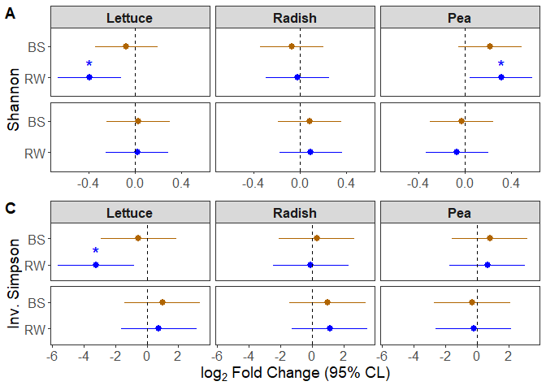<!-- -->

``` r
## M2

## emms (emmeans)
emms <- 
  read_csv(paste0(dir, "emmeans.alpha_contamination.csv"))
```

    ## Rows: 72 Columns: 13
    ## ── Column specification ────────────────────────────────────────────────────────
    ## Delimiter: ","
    ## chr (5): spikeFac, species, timepoint, metric, amend
    ## dbl (8): response, SE, df, lower.CL, upper.CL, null, t.ratio, p.value
    ## 
    ## ℹ Use `spec()` to retrieve the full column specification for this data.
    ## ℹ Specify the column types or set `show_col_types = FALSE` to quiet this message.

``` r
## linear contrasts (to get sig linear trends)
cont <- 
  read_csv(paste0(dir, "contrasts.alpha_contamination.csv"))
```

    ## Rows: 156 Columns: 23
    ## ── Column specification ────────────────────────────────────────────────────────
    ## Delimiter: ","
    ## chr (10): contrast, species, timepoint, amend, treat, metric, amendment, sig...
    ## dbl (13): SE, df, lower.CL, upper.CL, null, t.ratio, p.value, eff, LCL, UCL,...
    ## 
    ## ℹ Use `spec()` to retrieve the full column specification for this data.
    ## ℹ Specify the column types or set `show_col_types = FALSE` to quiet this message.

``` r
## include both quadratic & linear terms
cont.w <- cont %>%
   filter(is.na(treat) == TRUE) %>%
  mutate(metric = paste0(metric, "_", amend)) %>%
  droplevels() %>%
  pivot_wider(
    names_from = contrast,
    values_from = c("eff", "pval"),
    id_cols =  c("species","metric","timepoint","amend")
  )

## combine with emms
emms <- emms %>%
  left_join(
    cont.w,
    by = c("species","amend","timepoint","metric")
  )

## formatting
emms$amend <- factor(emms$amend,
                      levels = c("RW",
                                 "BS"))

emms$species <- factor(emms$species,
                       levels = c("L",
                                  "R",
                                  "P"))
emms$spikeFac <- factor(emms$spikeFac, 
  levels = c(
  "SL-0","SL-1","SL-2"))

## run function for each metric
source("./Source_code/10_alpha-plot_contam_PHT.func.R")

## metrics
metric.list <- c("Shannon","InvSimpson")

## run
plot.out <- sapply(metric.list, 
                plot_div_species.vs.contam, 
                df = emms,
                      USE.NAMES = TRUE, 
                      simplify = FALSE)
```

    ## [1] "Shannon"
    ## [1] "InvSimpson"

``` r
## combine
plots_contam <- plot_grid(
  plot.out[["Shannon"]] + 
    labs(y = "EM mean (log scale)"),
  plot.out[["InvSimpson"]] +
    labs(y = "EM mean (log scale)",
         x = "Contaminant spiking level"),
  ncol = 1,
  nrow = 2,
  align = "v",
  labels = c("B", "D"))
plots_contam
```

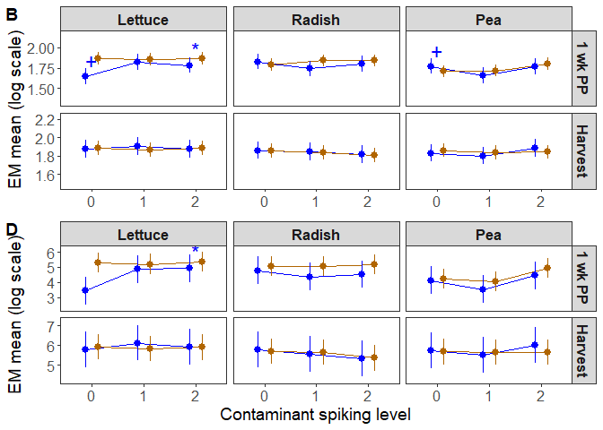<!-- -->

``` r
## combine them together
plots <- plot_grid(plots_amend, plots_contam,
                   ncol = 2,
                   nrow = 1,
                   align = "h",
                   labels = NULL)
plots
```

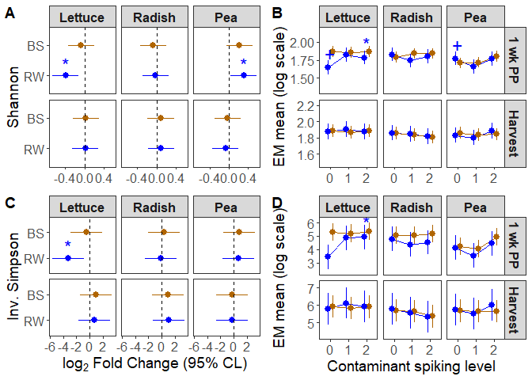<!-- -->

``` r
## save
## directory
fig_dir <- "./16S_analyses_files/figs/"
ggsave(paste0(fig_dir, "plots-div_PHT.png"), 
       width = 10, height = 7, 
       units = "in")
```

### Species x timepoint (Supp fig)

``` r
dir <- "./16S_analyses_files/models/"

##### species and timepoint comparisons #####
## plot

## emms (emmeans)
emms.amend <- 
  read_csv(paste0(dir, "emmeans.alpha_amendment.csv"))
```

    ## Rows: 36 Columns: 12
    ## ── Column specification ────────────────────────────────────────────────────────
    ## Delimiter: ","
    ## chr (4): Amendment, species, timepoint, metric
    ## dbl (8): response, SE, df, lower.CL, upper.CL, null, t.ratio, p.value
    ## 
    ## ℹ Use `spec()` to retrieve the full column specification for this data.
    ## ℹ Specify the column types or set `show_col_types = FALSE` to quiet this message.

``` r
## emms (emmeans) - for contamination
emms.contam <- 
  read_csv(paste0(dir, "emmeans.alpha_contamination.csv"))
```

    ## Rows: 72 Columns: 13
    ## ── Column specification ────────────────────────────────────────────────────────
    ## Delimiter: ","
    ## chr (5): spikeFac, species, timepoint, metric, amend
    ## dbl (8): response, SE, df, lower.CL, upper.CL, null, t.ratio, p.value
    ## 
    ## ℹ Use `spec()` to retrieve the full column specification for this data.
    ## ℹ Specify the column types or set `show_col_types = FALSE` to quiet this message.

``` r
## combine
emms.amend$emmean <- log(emms.amend$response)
emms.amend$LCL <- log(emms.amend$lower.CL)
emms.amend$UCL <- log(emms.amend$upper.CL)
emms.amend$spikeFac <- "SL-0"
emms.amend$model <- "I"

emms.contam$emmean <- log(emms.contam$response)
emms.contam$LCL <- log(emms.contam$lower.CL)
emms.contam$UCL <- log(emms.contam$upper.CL)
emms.contam$model <- "II"
emms.contam <- emms.contam %>%
  separate(metric, into = c("metric", "Amendment"), sep = "_", remove = FALSE)

emms.comb <- rbind(emms.amend %>%
                     filter(Amendment == "control") %>%
                     select(Amendment, species, timepoint, 
                            model, metric, spikeFac,
                            emmean, LCL, UCL),
                   emms.contam %>%
                     select(Amendment, species, timepoint, 
                            model, metric, spikeFac,
                            emmean, LCL, UCL))

emms.comb$Amendment <- factor(emms.comb$Amendment, levels = c(
  "control","RW","BS"
))

emms.comb$species <- factor(emms.comb$species, levels = c(
  "L","R","P"
))

emms.comb$metric <- factor(emms.comb$metric, levels = c(
  "Shannon","InvSimpson"
))

## create species_treat
## create treat
emms.comb$treat <- paste0(emms.comb$Amendment, "_", emms.comb$spikeFac) 
emms.comb$species_treat <- paste0(emms.comb$species, "_", emms.comb$treat) 
emms.comb$treat <- factor(emms.comb$treat, levels = c(
  "control_SL-0",
  "RW_SL-0", "RW_SL-1", "RW_SL-2",
  "BS_SL-0", "BS_SL-1", "BS_SL-2"
))

# Define custom shapes and labels for species
shape_map <- c("L" = 15, "R" = 16, "P" = 17)
species_labels <- c("L" = "Lettuce", "R" = "Radish", "P" = "Pea")
metric_labs <- c(
  Shannon = "Shannon",
  InvSimpson = "Inv. Simpson (/100)"
)
time_labs <- c(
  TP1 = "1 wk PP", 
  TP2 = "Harvest"
)

## plot
p1 <- ggplot(emms.comb,
            aes(x = timepoint, 
                        y = emmean, 
                        shape = species, 
                        group = species_treat,
                        colour = treat)) +
  geom_line(linewidth = 1,
            position = position_dodge(0.2)) +
  geom_pointrange(aes(ymin = LCL, 
                      ymax = UCL),
                  position = position_dodge(0.2)) +
  labs(
    #title = "Interaction Plot: Species × Timepoint",
    x = "Timepoint",
    y = "Estimated Mean (log scale)",
    colour = "Amendment - \n Spiking level"
  ) +
  guides(shape = "none") +
  facet_grid(metric~species, scales = "free",
             labeller = labeller(species = species_labels,
                                 metric = metric_labs)) +
  scale_shape_manual(values = shape_map) +
  scale_x_discrete(labels = c("TP1" = "1 wk PP", "TP2" = "Harvest")) +
  scale_colour_manual(
    values = c("grey",
      "lightblue",
               "cornflowerblue",
               "blue",
               "#EABD8C",
               "#FFAD00",
               "#B06500")
  ) +
  theme_bw(base_size = 14) +
  theme(
      axis.text.y = element_text(size = 12),
      axis.title.y = element_text(size = 14),
      axis.text.x = element_text(size = 12),
      axis.title.x = element_text(size = 14),
      strip.text.y = element_text(size = 12, face = "bold"),
      strip.text.x = element_text(size = 12, face = "bold"),
      panel.grid.major = element_blank(),
      panel.grid.minor = element_blank(),
    legend.position = "none",
    plot.title = element_text(face = "bold"))
p1
```

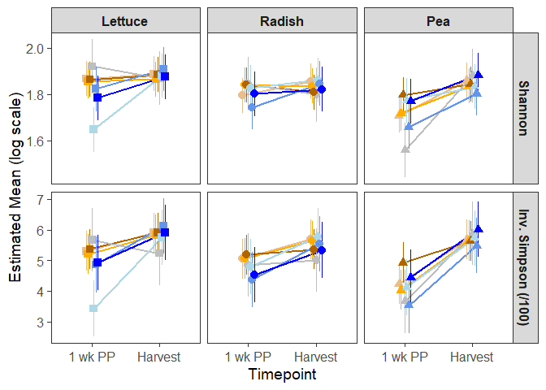<!-- -->

``` r
## PW species comp within each timepoint + treatment?

p2 <- ggplot(emms.comb,
            aes(x = treat, 
                        y = emmean, 
                        shape = species, 
                        colour = treat)) +
  geom_pointrange(aes(ymin = LCL, 
                      ymax = UCL),
                  position = position_dodge(0.3)) +
  labs(
    #title = "Interaction Plot: Species × Timepoint",
    x = NULL,
    y = "Estimated Mean (log scale)",
    colour = "Amendment - \n Spiking level"
  ) +
  guides(shape = "none") +
  facet_grid(metric~timepoint, scales = "free",
             labeller = labeller(timepoint = time_labs,
                                 metric = metric_labs)) +
  scale_shape_manual(values = shape_map) +
  #scale_x_discrete(labels = c("TP1" = "1 wk PP", "TP2" = "Harvest")) +
  scale_colour_manual(
    values = c("grey",
      "lightblue",
               "cornflowerblue",
               "blue",
               "#EABD8C",
               "#FFAD00",
               "#B06500")
  ) +
  theme_bw(base_size = 14) +
  theme(
      axis.text.x = element_blank(),
      axis.ticks.x = element_blank(), 
      axis.title.y = element_text(size = 14),
      axis.text.y = element_text(size = 12),
      axis.title.x = element_text(size = 14),
      strip.text.y = element_text(size = 12, face = "bold"),
      strip.text.x = element_text(size = 12, face = "bold"),
      panel.grid.major = element_blank(),
      panel.grid.minor = element_blank(),
    legend.position = "none",
    plot.title = element_text(face = "bold"))
p2
```

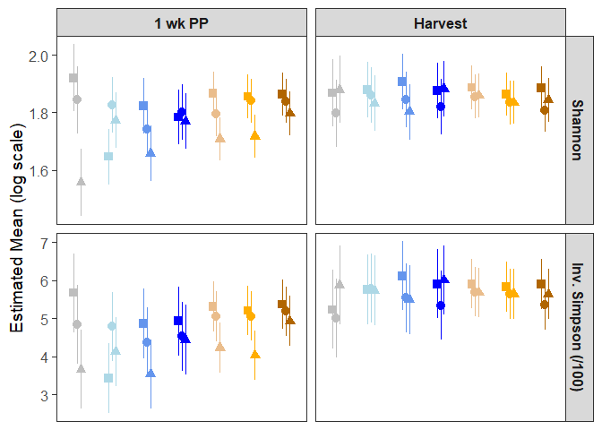<!-- -->

``` r
## get legend

legend_plot <- p2   # or any plot with legend
legend <- get_legend(legend_plot + 
                       theme(legend.position = "bottom"))
legend_scaled <- cowplot::ggdraw(legend) + 
  theme(plot.margin = margin(0,0,0,0))


p_comb <- plot_grid(plot_grid(p1, p2,
                    ncol = 2,
                    align = "h",
                    labels = c("A","B"),
                    rel_widths = c(1, 1)),
                    legend_scaled,
                    ncol = 1,
                    rel_heights = c(1.7,0.3))
p_comb
```

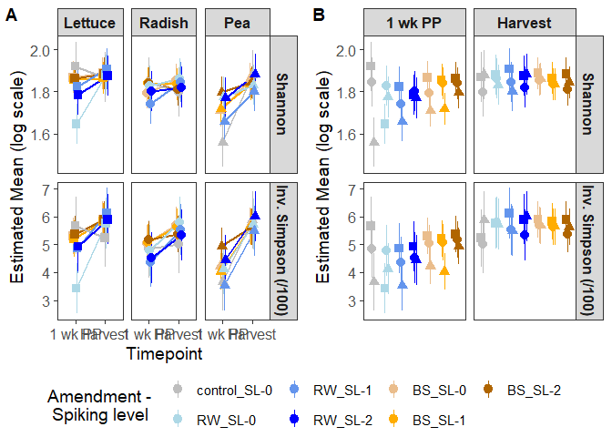<!-- -->

``` r
## save
fig_dir <- "./16S_analyses_files/figs/"
ggsave(paste0(fig_dir, "plot-species.vs.time.png"), 
       width = 12, height = 6, plot = p_comb,
       units = "in")
```

## Beta diversity

### PCoA and NMDS on relative abundance OTUs

If your samples have widely varying sequencing depths, rarefaction can
help make comparisons more fair. If your depths are fairly uniform, you
might skip rarefaction and use methods that account for library size
(e.g., DESeq2, variance-stabilizing transformation, or CLR
transformation for compositional data)

Use non-rarefied data, but filter for rare taxa (\< 0.1%)

``` r
dir <- "./16S_analyses_files/"

## load relevant phyloseqs
load(file = paste0(dir, "phyloseq_bac.Rda")) ## loads ps_bac

## remove OTUs less than 0.1%
rel_abun_all <- transform_sample_counts(ps_bac, function(x) x/sum(x))
ps_prune <- 
  prune_taxa(taxa_sums(rel_abun_all) > 0.001, ps_bac)
## check sampling depth
## plot number of reads per ASV and read depth per sample
readsumsdf <- data.frame(nreads = sort(taxa_sums(ps_prune), TRUE), 
                        sorted = 1:ntaxa(ps_prune), 
                        type = "ASVs")
readsumsdf <- rbind(readsumsdf, 
                    data.frame(nreads = sort(sample_sums(ps_prune), 
                                             TRUE), 
                               sorted = 1:nsamples(ps_prune), 
                               type = "Samples"))
title <- "Total number of reads"
p <- ggplot(readsumsdf, 
           aes(x = sorted, y = nreads)) + 
  geom_bar(stat = "identity")
p + ggtitle(title) + 
  scale_y_log10() + 
  facet_wrap(~type, 1, scales = "free")
```

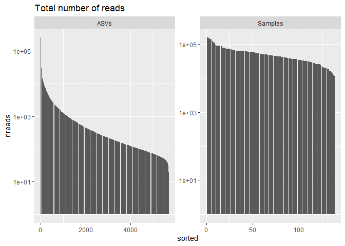<!-- -->

``` r
## save
save(ps_prune, 
     file = paste0(dir, "phyloseq_bac.pruned1.Rda"))
otu_tab <- data.frame(t(otu_table(ps_prune))) ## 5711 ASVs
write.csv(otu_tab, 
          file= paste0(dir, "otu_bac.pruned1.csv"))

## load metadata file
load(file = paste0(dir, "meta_div.Rda")) ## loads meta
rownames(meta) <- meta$Study_ID

## PCoA plot with Bray Curtis distances
## ordinate
ord_data <- ordinate(ps_prune, method = "PCoA", 
                            distance = "bray")

var_explained <- ord_data$values$Relative_eig * 100

# Extract ordination coordinates for samples
ord_df <- plot_ordination(ps_prune, 
                          ord_data, 
                          axes = c(1, 2), justDF = TRUE)

## plot

## formatting
species_tp.names <- c(
    no_plant_Source = "Source",
    no_plant_TP2 = "Soil only: Harvest",
    L_TP1 = 'Lettuce: 1 wk PP',
    L_TP2 = 'Lettuce: Harvest',
    R_TP1 = 'Radish: 1 wk PP',
    R_TP2 = 'Radish: Harvest',
    P_TP1 = 'Pea: 1 wk PP',
    P_TP2 = 'Pea: Harvest'
  )

## plot
p.pc <- ggplot(ord_df, aes(x = Axis.1, y = Axis.2, color = treat.rn)) +
  geom_point(aes(colour = treat.rn, shape = species_tp),
             size = 4, stroke = 2,
             alpha = 0.7) + 
  scale_color_manual(values = c("gray",
                                "black",
                                "brown",
                                "green3",
                                "green4",
                                "lightblue",
                                "cornflowerblue",
                                "blue",
                                "#EABD8C",
                                "#FFAD00",
                                "#B06500")) +
  scale_shape_manual(values = c(3, 4, 0, 1, 2, 15,16, 17),
                     labels = species_tp.names) +
  labs(x = paste0("PCoA Axis 1 [", round(var_explained[1], 1), "%]"),
       y = paste0("PCoA Axis 2 [", round(var_explained[2], 1), "%]"),
       shape = "Crop species: \n timepoint",
       colour = "Treatment") +
  guides(color = guide_legend(ncol = 2),
        shape = guide_legend(ncol = 2)) +
  theme_bw() + 
  theme(plot.title = element_text(hjust = 0.5, size = 16, face = "bold"), 
        axis.title.x = element_text(size=14), 
        axis.title.y = element_text(size=14), 
        axis.text.x = element_text(size = 12), 
        axis.text.y = element_text(size= 12), 
        legend.text = element_text(size = 10), 
        legend.title = element_text(size =10, face = "bold"),
        panel.grid.major = element_blank(),
        panel.grid.minor = element_blank())
p.pc
```

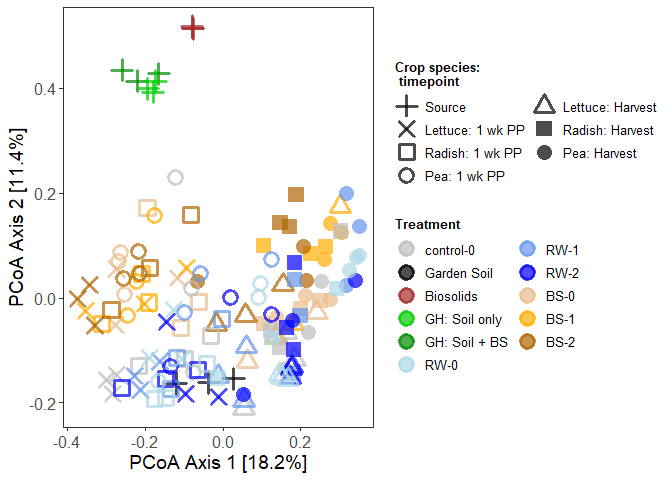<!-- -->

``` r
## save
ggsave(paste0(dir, "figs/plots-PCoA_all_prune1.png"),
       width = 10, height = 6, units = "in", plot = p.pc,
       dpi = 400)

#Extract Eigenvalues
eigenvalues <- ord_data$values$Eigenvalues

# Number of components
n <- length(eigenvalues)

# Calculate broken stick model
broken_stick <- sapply(1:n, function(i) {
  sum(1 / (i:n)) / n * 100
})

# Create a dataframe for plotting
scree_data <- data.frame(
  PrincipalCoordinate = 1:n,
  VarianceExplained = eigenvalues / sum(eigenvalues) * 100,
  BrokenStickModel = broken_stick
)

# Visualize observed vs. broken stick model (optional)
scree_bs <- ggplot(scree_data, 
                   aes(x = PrincipalCoordinate)) + 
  geom_line(aes(y = VarianceExplained),
                  color = "blue", 
                  linewidth = 1, 
                  linetype = "solid") + 
    geom_line(aes(y = BrokenStickModel), 
              color = "red", 
              linewidth = 1, 
              linetype = "dashed") +
    geom_point(aes(y = VarianceExplained)) +
    labs(title = "Scree Plot for PCoA and Broken Stick Model",
         x = "Principal Coordinate",
         y = "Variance Explained (%)") + 
    theme_minimal() +
  theme(plot.title = element_text(hjust = 0.5, size = 16, face = "bold"))
scree_bs
```

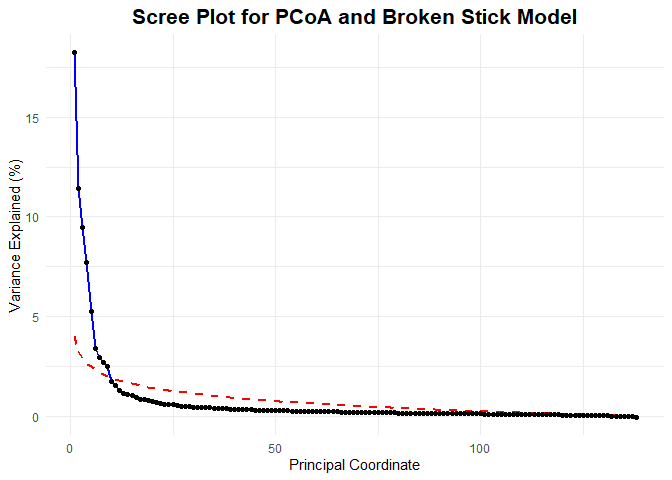<!-- -->

``` r
## save
ggsave(paste0(dir, "figs/plot-scree_all_prune1.png"),
       width = 6, height = 5, units = "in", plot = scree_bs,
       dpi = 400)

## function to compare treatments within each timepoint
source("./Source_code/11_beta-plot.func.R")

time.list <- c("TP1","TP2")
metric.list <- c("PCoA","NMDS")
comb_df <- expand_grid(metrics = metric.list, times = time.list)
## Combine into a single string
comb_df <- comb_df %>%
  mutate(
    combs = paste(metrics, times, sep = "_")
  )
## run function
plots.out <- mapply(FUN = plot_beta, 
                      combs = comb_df$combs, 
                      times = comb_df$times, 
                      metrics = comb_df$metrics, 
                      USE.NAMES = TRUE, 
                      SIMPLIFY = FALSE,
                      MoreArgs = list(df = ps_prune)
                   )
```

    ## [1] "PCoA_TP1"

    ## [1] "PCoA_TP2"

    ## [1] "NMDS_TP1"
    ## Square root transformation
    ## Wisconsin double standardization
    ## Run 0 stress 0.1537798 
    ## Run 1 stress 0.154139 
    ## ... Procrustes: rmse 0.008776346  max resid 0.04581295 
    ## Run 2 stress 0.1538883 
    ## ... Procrustes: rmse 0.007159978  max resid 0.04590596 
    ## Run 3 stress 0.1539341 
    ## ... Procrustes: rmse 0.002860166  max resid 0.01635772 
    ## Run 4 stress 0.1799835 
    ## Run 5 stress 0.1540627 
    ## ... Procrustes: rmse 0.01081768  max resid 0.0617953 
    ## Run 6 stress 0.1799046 
    ## Run 7 stress 0.1542037 
    ## ... Procrustes: rmse 0.01148657  max resid 0.05991722 
    ## Run 8 stress 0.1540598 
    ## ... Procrustes: rmse 0.00411158  max resid 0.01670762 
    ## Run 9 stress 0.1537599 
    ## ... New best solution
    ## ... Procrustes: rmse 0.006587987  max resid 0.04606836 
    ## Run 10 stress 0.1537798 
    ## ... Procrustes: rmse 0.006579835  max resid 0.04593993 
    ## Run 11 stress 0.1538719 
    ## ... Procrustes: rmse 0.01059911  max resid 0.05716958 
    ## Run 12 stress 0.1537799 
    ## ... Procrustes: rmse 0.006581098  max resid 0.04595212 
    ## Run 13 stress 0.1537798 
    ## ... Procrustes: rmse 0.006576012  max resid 0.04588703 
    ## Run 14 stress 0.405739 
    ## Run 15 stress 0.1540598 
    ## ... Procrustes: rmse 0.007617648  max resid 0.04460798 
    ## Run 16 stress 0.1539842 
    ## ... Procrustes: rmse 0.0109486  max resid 0.05694638 
    ## Run 17 stress 0.1540274 
    ## ... Procrustes: rmse 0.01092592  max resid 0.05715816 
    ## Run 18 stress 0.1539054 
    ## ... Procrustes: rmse 0.007163799  max resid 0.04532721 
    ## Run 19 stress 0.15376 
    ## ... Procrustes: rmse 0.0001434014  max resid 0.0006972157 
    ## ... Similar to previous best
    ## Run 20 stress 0.4068962 
    ## *** Best solution repeated 1 times
    ## [1] "NMDS_TP2"
    ## Square root transformation
    ## Wisconsin double standardization
    ## Run 0 stress 0.1856632 
    ## Run 1 stress 0.1856632 
    ## ... Procrustes: rmse 0.0001293084  max resid 0.0009332325 
    ## ... Similar to previous best
    ## Run 2 stress 0.1860394 
    ## ... Procrustes: rmse 0.006528293  max resid 0.04217439 
    ## Run 3 stress 0.1856631 
    ## ... New best solution
    ## ... Procrustes: rmse 7.909632e-05  max resid 0.0005758648 
    ## ... Similar to previous best
    ## Run 4 stress 0.1856632 
    ## ... Procrustes: rmse 9.292875e-05  max resid 0.0006691121 
    ## ... Similar to previous best
    ## Run 5 stress 0.1856632 
    ## ... Procrustes: rmse 3.776575e-05  max resid 0.0002106419 
    ## ... Similar to previous best
    ## Run 6 stress 0.1856631 
    ## ... New best solution
    ## ... Procrustes: rmse 1.090314e-05  max resid 5.065943e-05 
    ## ... Similar to previous best
    ## Run 7 stress 0.1856945 
    ## ... Procrustes: rmse 0.002263348  max resid 0.01563868 
    ## Run 8 stress 0.1860395 
    ## ... Procrustes: rmse 0.006540844  max resid 0.04218576 
    ## Run 9 stress 0.1860803 
    ## ... Procrustes: rmse 0.00683072  max resid 0.0419746 
    ## Run 10 stress 0.1860395 
    ## ... Procrustes: rmse 0.006539493  max resid 0.04218879 
    ## Run 11 stress 0.1860803 
    ## ... Procrustes: rmse 0.006830649  max resid 0.04197209 
    ## Run 12 stress 0.1856945 
    ## ... Procrustes: rmse 0.002267387  max resid 0.01564894 
    ## Run 13 stress 0.1860803 
    ## ... Procrustes: rmse 0.006834858  max resid 0.04199612 
    ## Run 14 stress 0.1860394 
    ## ... Procrustes: rmse 0.006534734  max resid 0.04220183 
    ## Run 15 stress 0.1860395 
    ## ... Procrustes: rmse 0.006539642  max resid 0.04218825 
    ## Run 16 stress 0.1856945 
    ## ... Procrustes: rmse 0.002259593  max resid 0.01559551 
    ## Run 17 stress 0.2031285 
    ## Run 18 stress 0.1856945 
    ## ... Procrustes: rmse 0.002265732  max resid 0.0156496 
    ## Run 19 stress 0.1856945 
    ## ... Procrustes: rmse 0.002284956  max resid 0.01579805 
    ## Run 20 stress 0.1856631 
    ## ... Procrustes: rmse 5.712093e-05  max resid 0.0004024797 
    ## ... Similar to previous best
    ## *** Best solution repeated 2 times

``` r
# Get shared limits

# Build the plot to access its components
p1_built <- ggplot_build(plots.out[["PCoA_TP1"]])
p2_built <- ggplot_build(plots.out[["PCoA_TP2"]])

# Extract y-axis limits
(y1_limits <- range(p1_built$layout$panel_scales_y[[1]]$range$range))
```

    ## [1] -0.3384735  0.3179580

``` r
(y2_limits <- range(p2_built$layout$panel_scales_y[[1]]$range$range))
```

    ## [1] -0.1985130  0.2735748

``` r
## combine plots (all crops)
fig1 <- plot_grid(plots.out[["PCoA_TP1"]] +
                    ggtitle("1 wk PP") +
                    coord_cartesian(ylim = y1_limits) +
                    theme(legend.position = "none"), 
                  plots.out[["PCoA_TP2"]] +
                    ggtitle("Harvest") +
                    coord_cartesian(ylim = y1_limits) +
                    theme(legend.position = "none"),
                  rel_widths = c(1, 1),
          ncol = 2,
          nrow = 1,
          align = "h",
          labels = NULL)
fig1
```

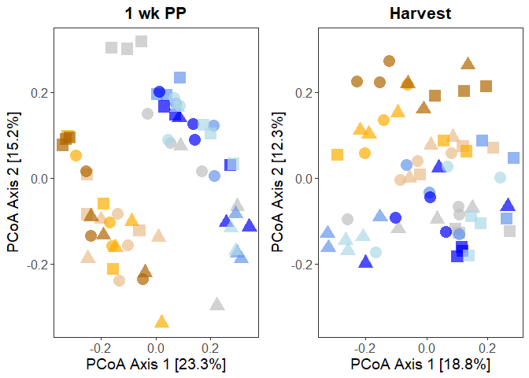<!-- -->

``` r
## save
ggsave(paste0(dir, "figs/plots-PCoA.prune1.png"),
       width = 8, height = 4, units = "in", plot = fig1,
       dpi = 400)

## save legend
# Extract legend from one original plot (before theme(legend.position = "none"))
legend_plot <- plots.out[["PCoA_TP1"]]   # or any plot with legend
legend <- get_legend(legend_plot + 
                       theme(legend.position = "bottom"))
legend_scaled <- cowplot::ggdraw(legend) + 
  theme(plot.margin = margin(0,0,0,0))

# NMDS: Get shared limits

# Build the plot to access its components
p1_built <- ggplot_build(plots.out[["NMDS_TP1"]])
p2_built <- ggplot_build(plots.out[["NMDS_TP2"]])

# Extract y-axis limits
(y1_limits <- range(p1_built$layout$panel_scales_y[[1]]$range$range))
```

    ## [1] -0.6028824  0.4923564

``` r
(y2_limits <- range(p2_built$layout$panel_scales_y[[1]]$range$range))
```

    ## [1] -0.5275626  0.5303576

``` r
(x1_limits <- range(p1_built$layout$panel_scales_x[[1]]$range$range))
```

    ## [1] -0.4316853  1.2102438

``` r
(x2_limits <- range(p2_built$layout$panel_scales_x[[1]]$range$range))
```

    ## [1] -0.4092750  0.6505254

``` r
fig2 <- plot_grid(plots.out[["NMDS_TP1"]] +
                    ggtitle("1 wk PP") +
                    coord_cartesian(ylim = c(y2_limits[[1]],
                                             y1_limits[[2]]),
                                    xlim = c(x2_limits[[1]],
                                             x1_limits[[2]])) +
                    labs(x = "NMDS Axis 1",
                         y = "NMDS Axis 2") +
                    theme(legend.position = "none"),
                  plots.out[["NMDS_TP2"]] +
                    ggtitle("Harvest") +
                    coord_cartesian(ylim = c(y2_limits[[1]],
                                             y1_limits[[2]]),
                                    xlim = c(x2_limits[[1]],
                                             x1_limits[[2]])) +
                     labs(x = "NMDS Axis 1",
                         y = "NMDS Axis 2") +
                    theme(legend.position = "none"),
                  rel_widths = c(1, 1),
          ncol = 2,
          nrow = 1,
          align = "h",
          labels = NULL)
fig2
```

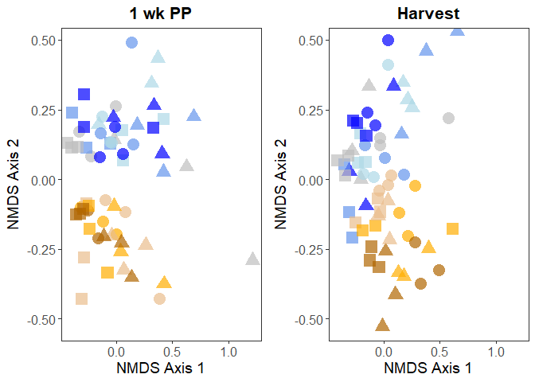<!-- -->

``` r
## plus legend
fig2_wleg <- plot_grid(fig2,
                       legend_scaled,
                       nrow = 2,
                       rel_heights = c(1,0.3))
fig2_wleg
```

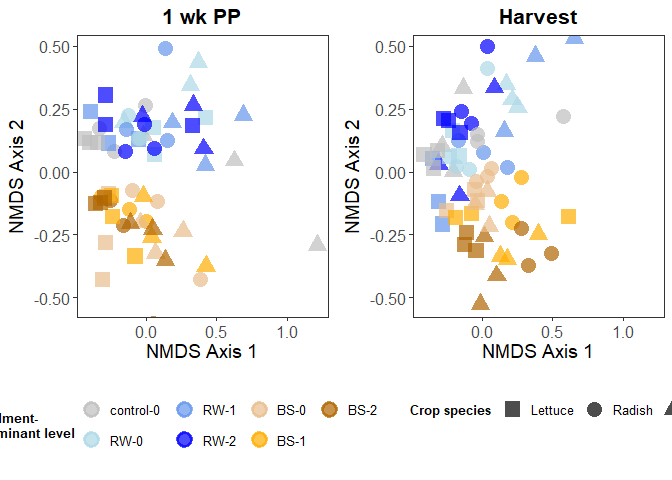<!-- -->

``` r
## save
ggsave(paste0(dir, "figs/plots-NMDS.prune1.png"),
       width = 9, height = 4, units = "in", plot = fig2_wleg,
       dpi = 400)
```

### Capscale analysis (dbRDA)

CAPSCALE (constrained analysis of principal coordinates) is a form of
distance-based redundancy analysis (db-RDA), and it’s particularly
useful when you want to relate microbiome community structure (based on
a distance matrix) to environmental variables.

``` r
dir <- "./16S_analyses_files/"
## load relevant data
load(file = paste0(dir, "phyloseq_bac.pruned1.Rda"))
## loads ps_prune (ps object)

## subset to experimental samples
df.f <- 
  prune_samples(!sample_data(ps_prune)$species %in%
                  "no_plant", ps_prune)

## Extract OTU table and sample data
otu_table_df <- as.data.frame(phyloseq::otu_table(df.f))
  if (phyloseq::taxa_are_rows(df.f)) {
    otu_table_df <- t(otu_table_df)
  }
sample_data_df <- as(sample_data(df.f), "data.frame")

## source function
source("./Source_code/12_beta-mod_div.vs.trait_dbRDA.func.R")

results_list <- mod_beta.vs.trait_dbRDA_species(df.f, return_mode = "both")
```

    ## 
    ## Start: dist_bc ~ 1 
    ## 
    ##                              Df    AIC       F Pr(>F)    
    ## + timepoint                   1 80.132 12.9827  0.001 ***
    ## + direct.survival_perc.corr   1 88.178  3.7468  0.002 ** 
    ## + treat.rn                    6 91.520  1.6423  0.002 ** 
    ## + direct.flowers              1 89.313  2.5799  0.006 ** 
    ## + direct.dry_total_weight     1 89.622  2.2681  0.017 *  
    ## + direct.shoot_moisture       1 90.204  1.6858  0.075 .  
    ## + direct.pods                 1 90.252  1.6383  0.094 .  
    ## + direct.dry_pod_weight.corr  1 90.620  1.2755  0.211    
    ## + direct.per_plant_weight     1 91.011  0.8930  0.490    
    ## + direct.shoot_root_ratio     1 91.083  0.8223  0.593    
    ## ---
    ## Signif. codes:  0 '***' 0.001 '**' 0.01 '*' 0.05 '.' 0.1 ' ' 1
    ## 
    ## Step: dist_bc ~ timepoint 
    ## 
    ##                              Df    AIC      F Pr(>F)    
    ## + direct.survival_perc.corr   1 77.075 4.9905  0.001 ***
    ## + treat.rn                    6 77.689 2.3257  0.001 ***
    ## + direct.flowers              1 78.619 3.4031  0.001 ***
    ## + direct.dry_total_weight     1 79.036 2.9841  0.002 ** 
    ## + direct.pods                 1 79.884 2.1443  0.007 ** 
    ## + direct.shoot_moisture       1 79.820 2.2073  0.010 ** 
    ## + direct.dry_pod_weight.corr  1 80.377 1.6645  0.051 .  
    ## + direct.per_plant_weight     1 80.900 1.1617  0.283    
    ## + direct.shoot_root_ratio     1 80.997 1.0691  0.334    
    ## ---
    ## Signif. codes:  0 '***' 0.001 '**' 0.01 '*' 0.05 '.' 0.1 ' ' 1
    ## 
    ## Step: dist_bc ~ timepoint + direct.survival_perc.corr 
    ## 
    ##                              Df    AIC      F Pr(>F)    
    ## + treat.rn                    6 76.820 1.8635  0.001 ***
    ## + direct.pods                 1 77.403 1.5437  0.070 .  
    ## + direct.flowers              1 77.711 1.2541  0.178    
    ## + direct.dry_pod_weight.corr  1 77.787 1.1832  0.228    
    ## + direct.per_plant_weight     1 77.936 1.0445  0.348    
    ## + direct.shoot_root_ratio     1 77.965 1.0174  0.379    
    ## + direct.dry_total_weight     1 78.110 0.8831  0.585    
    ## + direct.shoot_moisture       1 78.164 0.8331  0.647    
    ## ---
    ## Signif. codes:  0 '***' 0.001 '**' 0.01 '*' 0.05 '.' 0.1 ' ' 1
    ## 
    ## Step: dist_bc ~ timepoint + direct.survival_perc.corr + treat.rn 
    ## 
    ##                              Df    AIC      F Pr(>F)    
    ## + treat.rn:timepoint          6 76.301 1.5626  0.001 ***
    ## + direct.flowers              1 77.644 0.9086  0.588    
    ## + direct.dry_total_weight     1 77.829 0.7636  0.791    
    ## + direct.pods                 1 77.894 0.7137  0.870    
    ## + direct.shoot_root_ratio     1 77.925 0.6894  0.872    
    ## + direct.per_plant_weight     1 77.971 0.6535  0.936    
    ## + direct.shoot_moisture       1 77.988 0.6402  0.941    
    ## + direct.dry_pod_weight.corr  1 78.026 0.6110  0.959    
    ## ---
    ## Signif. codes:  0 '***' 0.001 '**' 0.01 '*' 0.05 '.' 0.1 ' ' 1
    ## 
    ## Step: dist_bc ~ timepoint + direct.survival_perc.corr + treat.rn +      timepoint:treat.rn 
    ## 
    ##                              Df    AIC      F Pr(>F)
    ## + direct.flowers              1 76.709 1.0045  0.443
    ## + direct.dry_total_weight     1 76.961 0.8429  0.686
    ## + direct.pods                 1 77.048 0.7873  0.739
    ## + direct.shoot_root_ratio     1 77.091 0.7603  0.779
    ## + direct.per_plant_weight     1 77.153 0.7205  0.847
    ## + direct.shoot_moisture       1 77.177 0.7057  0.851
    ## + direct.dry_pod_weight.corr  1 77.228 0.6733  0.889
    ## 
    ## 
    ## Start: dist_bc ~ 1 
    ## 
    ##                              Df    AIC      F Pr(>F)    
    ## + treat.rn                    6 20.767 2.2142  0.001 ***
    ## + direct.flowers              1 21.814 2.8818  0.003 ** 
    ## + direct.survival_perc.corr   1 21.840 2.8556  0.008 ** 
    ## + direct.dry_total_weight     1 22.681 1.9974  0.027 *  
    ## + direct.per_plant_weight     1 22.830 1.8484  0.043 *  
    ## + direct.shoot_moisture       1 23.092 1.5903  0.076 .  
    ## + direct.pods                 1 23.243 1.4428  0.112    
    ## + direct.dry_pod_weight.corr  1 23.611 1.0874  0.311    
    ## + direct.shoot_root_ratio     1 23.715 0.9882  0.416    
    ## ---
    ## Signif. codes:  0 '***' 0.001 '**' 0.01 '*' 0.05 '.' 0.1 ' ' 1
    ## 
    ## Step: dist_bc ~ treat.rn 
    ## 
    ##                              Df    AIC      F Pr(>F)  
    ## + direct.survival_perc.corr   1 20.078 1.7760  0.037 *
    ## + direct.per_plant_weight     1 20.866 1.2315  0.215  
    ## + direct.pods                 1 21.018 1.1289  0.306  
    ## + direct.dry_pod_weight.corr  1 21.074 1.0915  0.338  
    ## + direct.dry_total_weight     1 21.331 0.9198  0.557  
    ## + direct.shoot_root_ratio     1 21.437 0.8499  0.650  
    ## + direct.shoot_moisture       1 21.519 0.7962  0.731  
    ## + direct.flowers              1 21.637 0.7186  0.811  
    ## ---
    ## Signif. codes:  0 '***' 0.001 '**' 0.01 '*' 0.05 '.' 0.1 ' ' 1
    ## 
    ## Step: dist_bc ~ treat.rn + direct.survival_perc.corr 
    ## 
    ##                              Df    AIC      F Pr(>F)
    ## + direct.per_plant_weight     1 20.062 1.2088  0.228
    ## + direct.dry_total_weight     1 20.354 1.0266  0.412
    ## + direct.shoot_root_ratio     1 20.654 0.8418  0.653
    ## + direct.shoot_moisture       1 20.661 0.8376  0.657
    ## + direct.pods                 1 20.697 0.8156  0.681
    ## + direct.flowers              1 20.736 0.7920  0.687
    ## + direct.dry_pod_weight.corr  1 20.903 0.6904  0.830
    ## 
    ## 
    ## Start: dist_bc ~ 1 
    ## 
    ##                              Df    AIC      F Pr(>F)    
    ## + direct.survival_perc.corr   1 24.433 4.6066  0.001 ***
    ## + treat.rn                    6 26.778 1.8409  0.003 ** 
    ## + direct.flowers              1 26.547 2.3466  0.020 *  
    ## + direct.dry_total_weight     1 26.591 2.3013  0.034 *  
    ## + direct.pods                 1 27.082 1.8097  0.076 .  
    ## + direct.shoot_moisture       1 27.272 1.6224  0.110    
    ## + direct.dry_pod_weight.corr  1 27.404 1.4923  0.143    
    ## + direct.shoot_root_ratio     1 27.879 1.0348  0.372    
    ## + direct.per_plant_weight     1 28.048 0.8736  0.552    
    ## ---
    ## Signif. codes:  0 '***' 0.001 '**' 0.01 '*' 0.05 '.' 0.1 ' ' 1
    ## 
    ## Step: dist_bc ~ direct.survival_perc.corr 
    ## 
    ##                              Df    AIC      F Pr(>F)  
    ## + treat.rn                    6 24.626 1.6351  0.012 *
    ## + direct.pods                 1 24.295 1.9296  0.044 *
    ## + direct.dry_pod_weight.corr  1 25.061 1.2159  0.215  
    ## + direct.flowers              1 25.395 0.9126  0.470  
    ## + direct.dry_total_weight     1 25.383 0.9235  0.486  
    ## + direct.shoot_root_ratio     1 25.402 0.9066  0.494  
    ## + direct.shoot_moisture       1 25.481 0.8352  0.563  
    ## + direct.per_plant_weight     1 25.846 0.5111  0.943  
    ## ---
    ## Signif. codes:  0 '***' 0.001 '**' 0.01 '*' 0.05 '.' 0.1 ' ' 1
    ## 
    ## Step: dist_bc ~ direct.survival_perc.corr + treat.rn 
    ## 
    ##                              Df    AIC      F Pr(>F)  
    ## + direct.flowers              1 23.762 1.7531  0.069 .
    ## + direct.pods                 1 25.202 0.8415  0.607  
    ## + direct.dry_total_weight     1 25.288 0.7892  0.625  
    ## + direct.shoot_root_ratio     1 25.407 0.7168  0.745  
    ## + direct.shoot_moisture       1 25.523 0.6470  0.816  
    ## + direct.dry_pod_weight.corr  1 25.555 0.6274  0.851  
    ## + direct.per_plant_weight     1 25.748 0.5122  0.912  
    ## ---
    ## Signif. codes:  0 '***' 0.001 '**' 0.01 '*' 0.05 '.' 0.1 ' ' 1

    ## 
    ## Some constraints or conditions were aliased because they were redundant. This
    ## can happen if terms are constant or linearly dependent (collinear):
    ## 'direct.per_plant_weight'

    ## 
    ## Start: dist_bc ~ 1 
    ## 
    ##                             Df    AIC       F Pr(>F)    
    ## + timepoint                  1 73.266 10.4307  0.001 ***
    ## + treat.rn                   6 80.994  1.9298  0.001 ***
    ## + direct.shoot_moisture      1 80.885  2.0640  0.023 *  
    ## + direct.shoot_root_ratio    1 80.943  2.0055  0.027 *  
    ## + direct.survival_perc.corr  1 81.914  1.0459  0.371    
    ## + direct.dry_total_weight    1 81.974  0.9873  0.407    
    ## + direct.per_plant_weight    1 81.974  0.9873  0.419    
    ## ---
    ## Signif. codes:  0 '***' 0.001 '**' 0.01 '*' 0.05 '.' 0.1 ' ' 1
    ## 
    ## Step: dist_bc ~ timepoint 
    ## 
    ##                             Df    AIC      F Pr(>F)    
    ## + treat.rn                   6 69.473 2.5867  0.001 ***
    ## + direct.shoot_root_ratio    1 72.658 2.4979  0.001 ***
    ## + direct.shoot_moisture      1 72.584 2.5718  0.002 ** 
    ## + direct.survival_perc.corr  1 73.894 1.2945  0.172    
    ## + direct.per_plant_weight    1 73.971 1.2214  0.199    
    ## + direct.dry_total_weight    1 73.971 1.2214  0.203    
    ## ---
    ## Signif. codes:  0 '***' 0.001 '**' 0.01 '*' 0.05 '.' 0.1 ' ' 1
    ## 
    ## Step: dist_bc ~ timepoint + treat.rn 
    ## 
    ##                             Df    AIC      F Pr(>F)  
    ## + treat.rn:timepoint         6 70.939 1.3302  0.012 *
    ## + direct.shoot_root_ratio    1 69.866 1.2872  0.146  
    ## + direct.survival_perc.corr  1 69.896 1.2625  0.174  
    ## + direct.dry_total_weight    1 70.165 1.0436  0.353  
    ## + direct.per_plant_weight    1 70.165 1.0436  0.388  
    ## + direct.shoot_moisture      1 70.325 0.9146  0.563  
    ## ---
    ## Signif. codes:  0 '***' 0.001 '**' 0.01 '*' 0.05 '.' 0.1 ' ' 1
    ## 
    ## Step: dist_bc ~ timepoint + treat.rn + timepoint:treat.rn 
    ## 
    ##                             Df    AIC      F Pr(>F)  
    ## + direct.shoot_root_ratio    1 70.863 1.3686  0.098 .
    ## + direct.survival_perc.corr  1 70.902 1.3420  0.124  
    ## + direct.dry_total_weight    1 71.251 1.1072  0.297  
    ## + direct.per_plant_weight    1 71.251 1.1072  0.305  
    ## + direct.shoot_moisture      1 71.458 0.9692  0.467  
    ## ---
    ## Signif. codes:  0 '***' 0.001 '**' 0.01 '*' 0.05 '.' 0.1 ' ' 1

    ## 
    ## Some constraints or conditions were aliased because they were redundant. This
    ## can happen if terms are constant or linearly dependent (collinear):
    ## 'direct.per_plant_weight'

    ## 
    ## Start: dist_bc ~ 1 
    ## 
    ##                             Df    AIC      F Pr(>F)    
    ## + treat.rn                   6 20.973 1.8875  0.001 ***
    ## + direct.shoot_root_ratio    1 20.716 2.6105  0.002 ** 
    ## + direct.shoot_moisture      1 21.545 1.7746  0.027 *  
    ## + direct.per_plant_weight    1 22.180 1.1559  0.263    
    ## + direct.dry_total_weight    1 22.180 1.1559  0.281    
    ## + direct.survival_perc.corr  1 22.417 0.9297  0.512    
    ## ---
    ## Signif. codes:  0 '***' 0.001 '**' 0.01 '*' 0.05 '.' 0.1 ' ' 1
    ## 
    ## Step: dist_bc ~ treat.rn 
    ## 
    ##                             Df    AIC      F Pr(>F)   
    ## + direct.shoot_root_ratio    1 18.908 2.7764  0.002 **
    ## + direct.survival_perc.corr  1 21.027 1.2623  0.216   
    ## + direct.dry_total_weight    1 21.095 1.2163  0.227   
    ## + direct.per_plant_weight    1 21.095 1.2163  0.265   
    ## + direct.shoot_moisture      1 21.634 0.8556  0.593   
    ## ---
    ## Signif. codes:  0 '***' 0.001 '**' 0.01 '*' 0.05 '.' 0.1 ' ' 1
    ## 
    ## Step: dist_bc ~ treat.rn + direct.shoot_root_ratio 
    ## 
    ##                             Df    AIC      F Pr(>F)  
    ## + direct.survival_perc.corr  1 18.262 1.6113  0.086 .
    ## + direct.shoot_moisture      1 19.277 0.9692  0.485  
    ## + direct.per_plant_weight    1 19.414 0.8845  0.587  
    ## + direct.dry_total_weight    1 19.414 0.8845  0.595  
    ## ---
    ## Signif. codes:  0 '***' 0.001 '**' 0.01 '*' 0.05 '.' 0.1 ' ' 1

    ## 
    ## Some constraints or conditions were aliased because they were redundant. This
    ## can happen if terms are constant or linearly dependent (collinear):
    ## 'direct.per_plant_weight'

    ## 
    ## Start: dist_bc ~ 1 
    ## 
    ##                             Df    AIC      F Pr(>F)    
    ## + treat.rn                   6 19.801 2.1886  0.001 ***
    ## + direct.shoot_root_ratio    1 21.262 2.3347  0.017 *  
    ## + direct.shoot_moisture      1 21.620 1.9741  0.036 *  
    ## + direct.survival_perc.corr  1 22.159 1.4425  0.169    
    ## + direct.per_plant_weight    1 22.593 1.0248  0.388    
    ## + direct.dry_total_weight    1 22.593 1.0248  0.417    
    ## ---
    ## Signif. codes:  0 '***' 0.001 '**' 0.01 '*' 0.05 '.' 0.1 ' ' 1
    ## 
    ## Step: dist_bc ~ treat.rn 
    ## 
    ##                             Df    AIC      F Pr(>F)  
    ## + direct.dry_total_weight    1 19.103 1.7821  0.043 *
    ## + direct.per_plant_weight    1 19.103 1.7821  0.068 .
    ## + direct.survival_perc.corr  1 19.776 1.3164  0.191  
    ## + direct.shoot_root_ratio    1 19.842 1.2710  0.219  
    ## + direct.shoot_moisture      1 20.262 0.9886  0.442  
    ## ---
    ## Signif. codes:  0 '***' 0.001 '**' 0.01 '*' 0.05 '.' 0.1 ' ' 1
    ## 
    ## Step: dist_bc ~ treat.rn + direct.dry_total_weight 
    ## 
    ##                             Df    AIC      F Pr(>F)
    ## + direct.survival_perc.corr  1 18.848 1.3606  0.185
    ## + direct.shoot_moisture      1 19.704 0.8267  0.624
    ## + direct.shoot_root_ratio    1 19.715 0.8198  0.625
    ## + direct.per_plant_weight    0 19.103              
    ## 
    ## 
    ## Start: dist_bc ~ 1 
    ## 
    ##                             Df    AIC       F Pr(>F)    
    ## + timepoint                  1 74.476 11.5813  0.001 ***
    ## + treat.rn                   6 82.903  1.9760  0.001 ***
    ## + direct.survival_perc.corr  1 82.741  2.3665  0.014 *  
    ## + direct.per_plant_weight    1 83.893  1.2209  0.216    
    ## + direct.shoot_root_ratio    1 83.860  1.2529  0.245    
    ## + direct.dry_total_weight    1 84.151  0.9679  0.454    
    ## + direct.shoot_moisture      1 84.532  0.5984  0.890    
    ## ---
    ## Signif. codes:  0 '***' 0.001 '**' 0.01 '*' 0.05 '.' 0.1 ' ' 1
    ## 
    ## Step: dist_bc ~ timepoint 
    ## 
    ##                             Df    AIC      F Pr(>F)    
    ## + treat.rn                   6 69.888 2.7445  0.001 ***
    ## + direct.survival_perc.corr  1 73.336 3.0272  0.003 ** 
    ## + direct.shoot_root_ratio    1 74.798 1.5897  0.060 .  
    ## + direct.per_plant_weight    1 74.840 1.5487  0.085 .  
    ## + direct.dry_total_weight    1 75.176 1.2255  0.201    
    ## + direct.shoot_moisture      1 75.670 0.7557  0.757    
    ## ---
    ## Signif. codes:  0 '***' 0.001 '**' 0.01 '*' 0.05 '.' 0.1 ' ' 1
    ## 
    ## Step: dist_bc ~ timepoint + treat.rn 
    ## 
    ##                             Df    AIC      F Pr(>F)    
    ## + treat.rn:timepoint         6 67.022 1.9818  0.001 ***
    ## + direct.survival_perc.corr  1 70.683 0.9600  0.474    
    ## + direct.shoot_root_ratio    1 70.736 0.9171  0.533    
    ## + direct.shoot_moisture      1 70.828 0.8432  0.674    
    ## + direct.per_plant_weight    1 70.904 0.7816  0.754    
    ## + direct.dry_total_weight    1 70.985 0.7172  0.846    
    ## ---
    ## Signif. codes:  0 '***' 0.001 '**' 0.01 '*' 0.05 '.' 0.1 ' ' 1
    ## 
    ## Step: dist_bc ~ timepoint + treat.rn + timepoint:treat.rn 
    ## 
    ##                             Df    AIC      F Pr(>F)
    ## + direct.survival_perc.corr  1 67.295 1.1330  0.265
    ## + direct.shoot_root_ratio    1 67.372 1.0818  0.359
    ## + direct.shoot_moisture      1 67.504 0.9937  0.459
    ## + direct.per_plant_weight    1 67.614 0.9204  0.561
    ## + direct.dry_total_weight    1 67.729 0.8438  0.677
    ## 
    ## 
    ## Start: dist_bc ~ 1 
    ## 
    ##                             Df    AIC      F Pr(>F)    
    ## + treat.rn                   6 17.549 1.9761  0.001 ***
    ## + direct.survival_perc.corr  1 18.615 1.7179  0.030 *  
    ## + direct.per_plant_weight    1 18.963 1.3768  0.109    
    ## + direct.dry_total_weight    1 19.001 1.3404  0.131    
    ## + direct.shoot_root_ratio    1 19.092 1.2523  0.210    
    ## + direct.shoot_moisture      1 19.391 0.9657  0.481    
    ## ---
    ## Signif. codes:  0 '***' 0.001 '**' 0.01 '*' 0.05 '.' 0.1 ' ' 1
    ## 
    ## Step: dist_bc ~ treat.rn 
    ## 
    ##                             Df    AIC      F Pr(>F)
    ## + direct.survival_perc.corr  1 17.597 1.2661  0.189
    ## + direct.shoot_root_ratio    1 17.730 1.1760  0.250
    ## + direct.dry_total_weight    1 18.019 0.9822  0.449
    ## + direct.per_plant_weight    1 18.097 0.9306  0.488
    ## + direct.shoot_moisture      1 18.261 0.8219  0.690
    ## 
    ## 
    ## Start: dist_bc ~ 1 
    ## 
    ##                             Df    AIC      F Pr(>F)    
    ## + treat.rn                   6 19.288 3.1760  0.001 ***
    ## + direct.survival_perc.corr  1 24.632 2.6046  0.012 *  
    ## + direct.shoot_root_ratio    1 25.882 1.3562  0.165    
    ## + direct.per_plant_weight    1 25.989 1.2531  0.238    
    ## + direct.dry_total_weight    1 26.396 0.8640  0.524    
    ## + direct.shoot_moisture      1 26.496 0.7700  0.632    
    ## ---
    ## Signif. codes:  0 '***' 0.001 '**' 0.01 '*' 0.05 '.' 0.1 ' ' 1
    ## 
    ## Step: dist_bc ~ treat.rn 
    ## 
    ##                             Df    AIC      F Pr(>F)
    ## + direct.shoot_moisture      1 19.872 0.9066  0.548
    ## + direct.per_plant_weight    1 19.937 0.8636  0.558
    ## + direct.shoot_root_ratio    1 19.873 0.9062  0.579
    ## + direct.survival_perc.corr  1 19.966 0.8447  0.600
    ## + direct.dry_total_weight    1 20.075 0.7728  0.705
    ## 
    ## 
    ## Start: dist_bc ~ 1 
    ## 
    ##                             Df    AIC       F Pr(>F)    
    ## + timepoint                  1 376.05 27.0385  0.001 ***
    ## + treat.rn                   6 392.08  3.1958  0.001 ***
    ## + species                    2 395.16  3.8973  0.001 ***
    ## + direct.survival_perc.corr  1 398.33  2.5553  0.008 ** 
    ## + direct.shoot_root_ratio    1 398.76  2.1255  0.015 *  
    ## + direct.per_plant_weight    1 399.68  1.2067  0.230    
    ## + direct.dry_total_weight    1 400.13  0.7613  0.675    
    ## + direct.shoot_moisture      1 400.17  0.7219  0.765    
    ## ---
    ## Signif. codes:  0 '***' 0.001 '**' 0.01 '*' 0.05 '.' 0.1 ' ' 1
    ## 
    ## Step: dist_bc ~ timepoint 
    ## 
    ##                             Df    AIC      F Pr(>F)    
    ## + treat.rn                   6 364.72 4.0005  0.001 ***
    ## + species                    2 370.55 4.7745  0.001 ***
    ## + direct.survival_perc.corr  1 374.91 3.1013  0.001 ***
    ## + direct.shoot_root_ratio    1 375.44 2.5778  0.005 ** 
    ## + direct.per_plant_weight    1 376.56 1.4610  0.073 .  
    ## + direct.dry_total_weight    1 377.11 0.9210  0.530    
    ## + direct.shoot_moisture      1 377.16 0.8734  0.572    
    ## ---
    ## Signif. codes:  0 '***' 0.001 '**' 0.01 '*' 0.05 '.' 0.1 ' ' 1
    ## 
    ## Step: dist_bc ~ timepoint + treat.rn 
    ## 
    ##                             Df    AIC      F Pr(>F)    
    ## + species                    2 357.20 5.5516  0.001 ***
    ## + treat.rn:timepoint         6 364.25 1.9419  0.001 ***
    ## + direct.survival_perc.corr  1 364.93 1.6763  0.040 *  
    ## + direct.shoot_moisture      1 365.45 1.1814  0.228    
    ## + direct.shoot_root_ratio    1 365.49 1.1458  0.240    
    ## + direct.dry_total_weight    1 365.72 0.9316  0.527    
    ## + direct.per_plant_weight    1 365.94 0.7210  0.864    
    ## ---
    ## Signif. codes:  0 '***' 0.001 '**' 0.01 '*' 0.05 '.' 0.1 ' ' 1
    ## 
    ## Step: dist_bc ~ timepoint + treat.rn + species 
    ## 
    ##                             Df    AIC      F Pr(>F)    
    ## + species:timepoint          2 354.09 3.3113  0.001 ***
    ## + treat.rn:timepoint         6 355.47 2.1108  0.001 ***
    ## + treat.rn:species          12 362.46 1.3898  0.001 ***
    ## + direct.survival_perc.corr  1 357.24 1.8079  0.018 *  
    ## + direct.shoot_moisture      1 357.81 1.2735  0.123    
    ## + direct.shoot_root_ratio    1 357.85 1.2351  0.193    
    ## + direct.dry_total_weight    1 358.11 1.0041  0.407    
    ## + direct.per_plant_weight    1 358.35 0.7770  0.829    
    ## ---
    ## Signif. codes:  0 '***' 0.001 '**' 0.01 '*' 0.05 '.' 0.1 ' ' 1
    ## 
    ## Step: dist_bc ~ timepoint + treat.rn + species + timepoint:species 
    ## 
    ##                             Df    AIC      F Pr(>F)    
    ## + treat.rn:timepoint         6 351.51 2.2076  0.001 ***
    ## + treat.rn:species          12 358.17 1.4558  0.001 ***
    ## + direct.survival_perc.corr  1 354.01 1.8813  0.011 *  
    ## + direct.shoot_root_ratio    1 354.66 1.2850  0.118    
    ## + direct.shoot_moisture      1 354.62 1.3250  0.132    
    ## + direct.dry_total_weight    1 354.93 1.0444  0.350    
    ## + direct.per_plant_weight    1 355.19 0.8081  0.768    
    ## ---
    ## Signif. codes:  0 '***' 0.001 '**' 0.01 '*' 0.05 '.' 0.1 ' ' 1
    ## 
    ## Step: dist_bc ~ timepoint + treat.rn + species + timepoint:species +      timepoint:treat.rn 
    ## 
    ##                             Df    AIC      F Pr(>F)    
    ## + treat.rn:species          12 352.92 1.5712  0.001 ***
    ## + direct.survival_perc.corr  1 351.17 2.0040  0.010 ** 
    ## + direct.shoot_moisture      1 351.86 1.4105  0.076 .  
    ## + direct.shoot_root_ratio    1 351.91 1.3679  0.089 .  
    ## + direct.dry_total_weight    1 352.21 1.1115  0.269    
    ## + direct.per_plant_weight    1 352.50 0.8598  0.640    
    ## ---
    ## Signif. codes:  0 '***' 0.001 '**' 0.01 '*' 0.05 '.' 0.1 ' ' 1
    ## 
    ## Step: dist_bc ~ timepoint + treat.rn + species + timepoint:species +      timepoint:treat.rn + treat.rn:species 
    ## 
    ##                              Df    AIC      F Pr(>F)  
    ## + treat.rn:species:timepoint 12 357.47 1.1685  0.016 *
    ## + direct.survival_perc.corr   1 352.79 1.6183  0.029 *
    ## + direct.dry_total_weight     1 353.44 1.1170  0.283  
    ## + direct.shoot_root_ratio     1 353.57 1.0199  0.401  
    ## + direct.shoot_moisture       1 353.61 0.9903  0.460  
    ## + direct.per_plant_weight     1 353.97 0.7193  0.932  
    ## ---
    ## Signif. codes:  0 '***' 0.001 '**' 0.01 '*' 0.05 '.' 0.1 ' ' 1
    ## 
    ## Step: dist_bc ~ timepoint + treat.rn + species + timepoint:species +      timepoint:treat.rn + treat.rn:species + timepoint:treat.rn:species 
    ## 
    ##                             Df    AIC      F Pr(>F)  
    ## + direct.survival_perc.corr  1 356.98 1.6545  0.023 *
    ## + direct.dry_total_weight    1 357.74 1.1411  0.227  
    ## + direct.shoot_root_ratio    1 357.89 1.0417  0.350  
    ## + direct.shoot_moisture      1 357.94 1.0114  0.436  
    ## + direct.per_plant_weight    1 358.36 0.7343  0.892  
    ## ---
    ## Signif. codes:  0 '***' 0.001 '**' 0.01 '*' 0.05 '.' 0.1 ' ' 1
    ## 
    ## Step: dist_bc ~ timepoint + treat.rn + species + direct.survival_perc.corr +      timepoint:species + timepoint:treat.rn + treat.rn:species +      timepoint:treat.rn:species 
    ## 
    ##                           Df    AIC      F Pr(>F)
    ## + direct.dry_total_weight  1 357.26 1.1257  0.266
    ## + direct.shoot_moisture    1 357.50 0.9659  0.460
    ## + direct.shoot_root_ratio  1 357.57 0.9189  0.566
    ## + direct.per_plant_weight  1 357.91 0.7007  0.924
    ## 
    ## 
    ## Start: dist_bc ~ 1 
    ## 
    ##                             Df    AIC      F Pr(>F)    
    ## + species                    2 134.14 4.4351  0.001 ***
    ## + treat.rn                   6 136.06 2.4654  0.001 ***
    ## + direct.shoot_root_ratio    1 138.76 2.0393  0.010 ** 
    ## + direct.survival_perc.corr  1 139.05 1.7456  0.038 *  
    ## + direct.per_plant_weight    1 139.33 1.4720  0.099 .  
    ## + direct.shoot_moisture      1 139.72 1.0865  0.303    
    ## + direct.dry_total_weight    1 139.83 0.9729  0.437    
    ## ---
    ## Signif. codes:  0 '***' 0.001 '**' 0.01 '*' 0.05 '.' 0.1 ' ' 1
    ## 
    ## Step: dist_bc ~ species 
    ## 
    ##                             Df    AIC      F Pr(>F)    
    ## + treat.rn                   6 128.87 2.8397  0.001 ***
    ## + direct.shoot_root_ratio    1 133.76 2.2753  0.003 ** 
    ## + direct.survival_perc.corr  1 134.10 1.9462  0.017 *  
    ## + direct.per_plant_weight    1 134.42 1.6401  0.038 *  
    ## + direct.shoot_moisture      1 134.87 1.2094  0.175    
    ## + direct.dry_total_weight    1 135.00 1.0827  0.289    
    ## ---
    ## Signif. codes:  0 '***' 0.001 '**' 0.01 '*' 0.05 '.' 0.1 ' ' 1
    ## 
    ## Step: dist_bc ~ species + treat.rn 
    ## 
    ##                             Df    AIC      F Pr(>F)    
    ## + treat.rn:species          12 130.74 1.4728  0.001 ***
    ## + direct.shoot_root_ratio    1 128.75 1.8124  0.021 *  
    ## + direct.survival_perc.corr  1 129.15 1.4625  0.075 .  
    ## + direct.shoot_moisture      1 129.30 1.3357  0.109    
    ## + direct.dry_total_weight    1 129.48 1.1793  0.197    
    ## + direct.per_plant_weight    1 129.78 0.9246  0.545    
    ## ---
    ## Signif. codes:  0 '***' 0.001 '**' 0.01 '*' 0.05 '.' 0.1 ' ' 1
    ## 
    ## Step: dist_bc ~ species + treat.rn + species:treat.rn 
    ## 
    ##                             Df    AIC      F Pr(>F)  
    ## + direct.shoot_root_ratio    1 130.48 1.4974  0.043 *
    ## + direct.survival_perc.corr  1 130.72 1.3336  0.142  
    ## + direct.dry_total_weight    1 131.18 1.0254  0.404  
    ## + direct.shoot_moisture      1 131.32 0.9327  0.535  
    ## + direct.per_plant_weight    1 131.54 0.7903  0.810  
    ## ---
    ## Signif. codes:  0 '***' 0.001 '**' 0.01 '*' 0.05 '.' 0.1 ' ' 1
    ## 
    ## Step: dist_bc ~ species + treat.rn + direct.shoot_root_ratio + species:treat.rn 
    ## 
    ##                             Df    AIC      F Pr(>F)
    ## + direct.survival_perc.corr  1 130.45 1.3120  0.119
    ## + direct.shoot_moisture      1 131.01 0.9439  0.522
    ## + direct.dry_total_weight    1 131.19 0.8294  0.733
    ## + direct.per_plant_weight    1 131.22 0.8086  0.767
    ## 
    ## 
    ## Start: dist_bc ~ 1 
    ## 
    ##                             Df    AIC      F Pr(>F)    
    ## + treat.rn                   6 139.71 3.6379  0.001 ***
    ## + species                    2 145.69 3.3997  0.001 ***
    ## + direct.survival_perc.corr  1 147.62 2.7985  0.004 ** 
    ## + direct.shoot_root_ratio    1 148.07 2.3489  0.013 *  
    ## + direct.per_plant_weight    1 149.42 1.0077  0.384    
    ## + direct.dry_total_weight    1 149.51 0.9211  0.487    
    ## + direct.shoot_moisture      1 149.95 0.4903  0.977    
    ## ---
    ## Signif. codes:  0 '***' 0.001 '**' 0.01 '*' 0.05 '.' 0.1 ' ' 1
    ## 
    ## Step: dist_bc ~ treat.rn 
    ## 
    ##                             Df    AIC      F Pr(>F)    
    ## + species                    2 134.10 4.4489  0.001 ***
    ## + direct.survival_perc.corr  1 140.02 1.4996  0.121    
    ## + direct.dry_total_weight    1 140.59 0.9894  0.433    
    ## + direct.shoot_moisture      1 140.78 0.8199  0.605    
    ## + direct.per_plant_weight    1 140.98 0.6450  0.855    
    ## + direct.shoot_root_ratio    1 140.99 0.6354  0.880    
    ## ---
    ## Signif. codes:  0 '***' 0.001 '**' 0.01 '*' 0.05 '.' 0.1 ' ' 1
    ## 
    ## Step: dist_bc ~ treat.rn + species 
    ## 
    ##                             Df    AIC      F Pr(>F)   
    ## + treat.rn:species          12 138.07 1.3102  0.006 **
    ## + direct.survival_perc.corr  1 134.13 1.6907  0.043 * 
    ## + direct.dry_total_weight    1 134.79 1.1138  0.315   
    ## + direct.shoot_moisture      1 135.02 0.9226  0.531   
    ## + direct.per_plant_weight    1 135.25 0.7253  0.794   
    ## + direct.shoot_root_ratio    1 135.26 0.7146  0.819   
    ## ---
    ## Signif. codes:  0 '***' 0.001 '**' 0.01 '*' 0.05 '.' 0.1 ' ' 1
    ## 
    ## Step: dist_bc ~ treat.rn + species + treat.rn:species 
    ## 
    ##                             Df    AIC      F Pr(>F)  
    ## + direct.survival_perc.corr  1 137.29 1.8516  0.027 *
    ## + direct.dry_total_weight    1 138.09 1.3115  0.145  
    ## + direct.shoot_moisture      1 138.68 0.9197  0.528  
    ## + direct.shoot_root_ratio    1 138.99 0.7111  0.814  
    ## + direct.per_plant_weight    1 139.06 0.6649  0.872  
    ## ---
    ## Signif. codes:  0 '***' 0.001 '**' 0.01 '*' 0.05 '.' 0.1 ' ' 1
    ## 
    ## Step: dist_bc ~ treat.rn + species + direct.survival_perc.corr + treat.rn:species 
    ## 
    ##                           Df    AIC      F Pr(>F)
    ## + direct.dry_total_weight  1 137.29 1.2907  0.171
    ## + direct.shoot_moisture    1 137.65 1.0521  0.360
    ## + direct.shoot_root_ratio  1 138.28 0.6440  0.891
    ## + direct.per_plant_weight  1 138.34 0.6071  0.929

``` r
## helper function to flatten results
source("./Source_code/13_beta-mod_div.vs.trait_dbRDA.results.func.R")

flattened_results <- flatten_dbRDA_results(results_list)

# Access combined data frames and combine
aov_all <- flattened_results$aov_df_all
vectors_all <- flattened_results$vector_df_all

aov_all$comb <- paste(aov_all$Term, aov_all$Time, aov_all$Species, sep = "_")
vectors_all$comb <- paste(vectors_all$Term, vectors_all$Time, vectors_all$Species, sep = "_")

results_comb <- left_join(aov_all, vectors_all %>%
                            select(-Time, -Species, -Term), 
                          by = "comb")

## formatting

# get residual df for each Time-Species combination
residual_df_lookup <- aov_all %>%
  filter(Term == "Residual") %>%
  select(Time, Species, res_df = Df)

# Add residual df to combined results
results_comb <- results_comb %>%
  left_join(residual_df_lookup, by = c("Time", "Species"))

results_comb$Fsig <- ifelse(results_comb$Sig <= 0.001, ", P < 0.001",
            ifelse(results_comb$Sig < 0.01, 
                   paste0(", P = ", results_comb$Sig, "**"),
            ifelse(results_comb$Sig < 0.05, 
                   paste0(", P = ", results_comb$Sig, "*"),
            ifelse(results_comb$Sig < 0.1, 
                   paste0(", P = ", results_comb$Sig, "."),
                               ", P > 0.1"))))

results_comb$Fstat <- paste0("F [",
                     results_comb$Df, ", ", results_comb$res_df,  "] =",
                     signif(results_comb$F_value, 3),
                     results_comb$Fsig)

results_comb$Rsig <- ifelse(results_comb$P_value <= 0.001, ", P < 0.001",
            ifelse(results_comb$P_value < 0.01, 
                   paste0(", P = ", results_comb$P_value, "**"),
            ifelse(results_comb$P_value < 0.05, 
                   paste0(", P = ", results_comb$P_value, "*"),
            ifelse(results_comb$P_value < 0.1, 
                   paste0(", P = ", results_comb$P_value, "."),
                               ", P > 0.1"))))

results_comb$Rstat <- paste0("R_sqr = ",
                     signif(results_comb$R_squared, 3),
                     results_comb$Rsig)

results_comb$Prop_exp <- signif((results_comb$Proportion * 100), 3)

aov.s <- results_comb %>%
  select(Term, Time, Species, Prop_exp, Fstat, Rstat)

## save
write.csv(aov.s, 
          paste0("Supplementary_files/File_S3-beta.csv"), 
          row.names = FALSE)

## plots for figure: all species + just peas within each timepoint

# Plot for combined model across all species
p.all_TP1 <- results_list[["all_species"]]$per_time[["TP1"]]$plot
p.all_TP2 <- results_list[["all_species"]]$per_time[["TP2"]]$plot
p.pea_TP1 <- results_list[["P"]]$per_time[["TP1"]]$plot
p.pea_TP2 <- results_list[["P"]]$per_time[["TP2"]]$plot

# Build plots to get axis limits
built_plots <- lapply(c(p.all_TP1, p.all_TP2,
                        p.pea_TP1, p.pea_TP2), 
                      ggplot_build)

# Helper function to extract axis limits safely
get_axis_limits <- function(built_plots, axis = "x") {
  ranges <- lapply(built_plots, function(bp) {
    scale <- if (axis == "x") bp$layout$panel_scales_x[[1]] else bp$layout$panel_scales_y[[1]]
    scale$range$range
  })
  unlist(ranges)
}

# Calculate limits with buffer
x_limits <- range(get_axis_limits(built_plots, "x"))
y_limits <- range(get_axis_limits(built_plots, "y"))

x_buffer <- 0.1 * diff(x_limits)
y_buffer <- 0.1 * diff(y_limits)

x_limits <- c(x_limits[1] - x_buffer, x_limits[2] + x_buffer)
y_limits <- c(y_limits[1] - y_buffer, y_limits[2] + y_buffer)

# Apply limits and formatting
plots_all <- list(
  p.all_TP1 + coord_cartesian(xlim = x_limits, ylim = y_limits) +
    ggtitle("All species: 1 wk PP") + theme(legend.position = "none"),
  p.all_TP2 + coord_cartesian(xlim = x_limits, ylim = y_limits) +
    ggtitle("All species: Harvest") + theme(legend.position = "none")
)

plots_pea <- list(
  p.pea_TP1 + coord_cartesian(xlim = x_limits, ylim = y_limits) +
    ggtitle("Pea only: 1 wk PP") + theme(legend.position = "none"),
  p.pea_TP2 + coord_cartesian(xlim = x_limits, ylim = y_limits) +
    ggtitle("Pea only: Harvest") + theme(legend.position = "none")
)

# Combine into figure
row_all <- plot_grid(plotlist = plots_all, ncol = 2)
row_pea <- plot_grid(plotlist = plots_pea, ncol = 2)
combined_panel <- plot_grid(row_all, row_pea, nrow = 2)
combined_panel
```

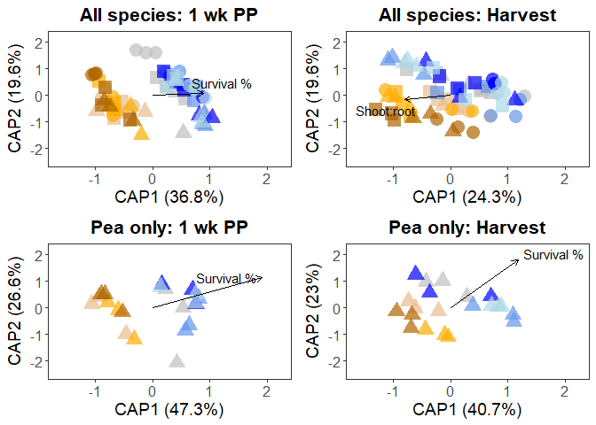<!-- -->

``` r
# Extract legend from one original plot (before theme(legend.position = "none"))
legend_plot <- results_list[["all_species"]]$per_time[["TP1"]]$plot
legend <- get_legend(
  legend_plot +
    theme(legend.position = "bottom",
          legend.title.align = 0.5) +
    guides(colour = guide_legend(title.position = "left", nrow = 2),
           shape = guide_legend(title.position = "top"))
)

final_figure <- plot_grid(combined_panel, legend, ncol = 1, rel_heights = c(1, 0.2))
final_figure
```

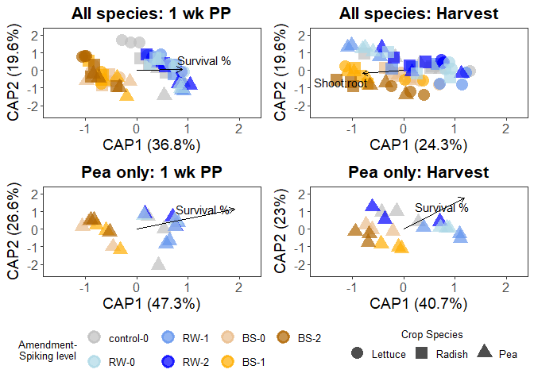<!-- -->

``` r
## save
saveRDS(final_figure, file = paste0(dir, "figs/plots-Fig2_dbRDA.rds"))

## plots for Supp. figure: each species within each timpoint

# Plot for combined model across all species
p.L_TP1 <- results_list[["L"]]$per_time[["TP1"]]$plot
p.R_TP1 <- results_list[["R"]]$per_time[["TP1"]]$plot
p.P_TP1 <- results_list[["P"]]$per_time[["TP1"]]$plot
p.L_TP2 <- results_list[["L"]]$per_time[["TP2"]]$plot
p.R_TP2 <- results_list[["R"]]$per_time[["TP2"]]$plot
p.P_TP2 <- results_list[["P"]]$per_time[["TP2"]]$plot

# Build plots to get axis limits
built_plots <- lapply(c(p.L_TP1, p.R_TP1, p.P_TP1,
                        p.L_TP2, p.R_TP2, p.P_TP2), 
                      ggplot_build)

# Helper function to extract axis limits safely
get_axis_limits <- function(built_plots, axis = "x") {
  ranges <- lapply(built_plots, function(bp) {
    scale <- if (axis == "x") bp$layout$panel_scales_x[[1]] else bp$layout$panel_scales_y[[1]]
    scale$range$range
  })
  unlist(ranges)
}

# Calculate limits with buffer
x_limits <- range(get_axis_limits(built_plots, "x"))
y_limits <- range(get_axis_limits(built_plots, "y"))

x_buffer <- 0.1 * diff(x_limits)
y_buffer <- 0.1 * diff(y_limits)

x_limits <- c(x_limits[1] - x_buffer, x_limits[2] + x_buffer)
y_limits <- c(y_limits[1] - y_buffer, y_limits[2] + y_buffer)

# Apply limits and formatting
plots_top.row <- list(
  p.L_TP1 + coord_cartesian(xlim = x_limits, ylim = y_limits) +
    ggtitle("Lettuce: 1 wk PP") + theme(legend.position = "none"),
  p.R_TP1 + coord_cartesian(xlim = x_limits, ylim = y_limits) +
    ggtitle("Radish: 1 wk PP") + theme(legend.position = "none"),
   p.P_TP1 + coord_cartesian(xlim = x_limits, ylim = y_limits) +
    ggtitle("Pea: 1 wk PP") + theme(legend.position = "none")
)

plots_bottom.row <- list(
  p.L_TP2 + coord_cartesian(xlim = x_limits, ylim = y_limits) +
    ggtitle("Lettuce: Harvest") + theme(legend.position = "none"),
  p.R_TP2 + coord_cartesian(xlim = x_limits, ylim = y_limits) +
    ggtitle("Radish: Harvest") + theme(legend.position = "none"),
   p.P_TP2 + coord_cartesian(xlim = x_limits, ylim = y_limits) +
    ggtitle("Pea: Harvest") + theme(legend.position = "none")
)

# Combine into figure
row_top <- plot_grid(plotlist = plots_top.row, ncol = 3)
row_bot <- plot_grid(plotlist = plots_bottom.row, ncol = 3)
combined_panel <- plot_grid(row_top, row_bot, nrow = 2)
combined_panel
```

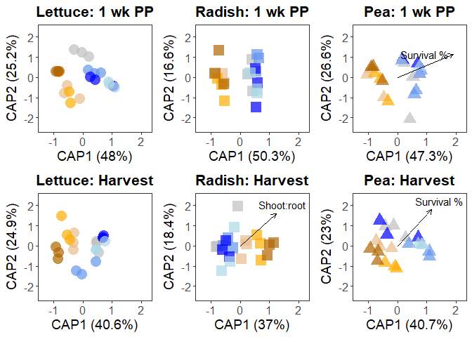<!-- -->

``` r
# Extract legend from one original plot (before theme(legend.position = "none"))
legend_plot <- results_list[["all_species"]]$per_time[["TP1"]]$plot
legend <- get_legend(
  legend_plot +
    theme(legend.position = "bottom",
          legend.title.align = 0.5) +
    guides(colour = guide_legend(title.position = "left", nrow = 2),
           shape = guide_legend(title.position = "top"))
)

final_figure <- plot_grid(combined_panel, legend, ncol = 1, rel_heights = c(1, 0.2))
final_figure
```

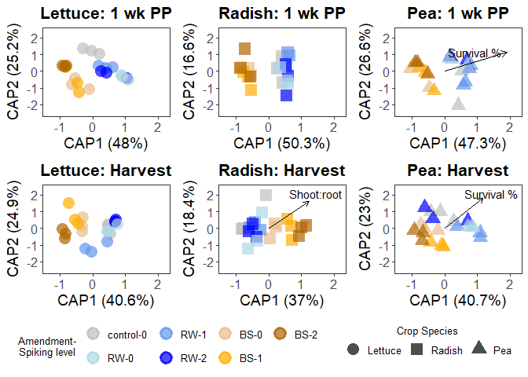<!-- -->

``` r
## save
ggsave(paste0(dir, "figs/plots-SuppFigS3_dbRDA.png"),
        plot = final_figure,
       width=10, height=8, units = "in")
```

## Fig 2 panel: microbiome analyses

``` r
dir <- "./16S_analyses_files/figs/"

## stitch together with effect comparisons
alpha_plot <- readRDS(paste0(dir, "plots-alpha_div.rds"))
CAP_plot <- readRDS(paste0(dir, "plots-Fig2_dbRDA.rds"))

# Combine into final figure
micro_plot <- plot_grid(
  alpha_plot,
  CAP_plot,
  ncol = 2,
  nrow = 1,
  labels = c("A","B"),
  rel_widths = c(0.9, 1.1)
  #rel_heights = c(0.9, 1.1)
)
## cannot print(micro_plot) -- too complex
## save
ggsave(paste0(dir, "Fig2.png"), 
       plot = micro_plot,
       width=12, height=7, units = "in")
```

## Relative abundance plots (unpruned)

``` r
dir <- "./16S_analyses_files/"

## load relevant phyloseqs
load(file = paste0(dir, "phyloseq_bac.Rda")) ## loads ps_bac

## look at metadata file
meta <- data.frame(sample_data(ps_bac))

# Transform to relative abundance
ps_rel <- transform_sample_counts(ps_bac, function(x) x / sum(x))

# Calculate mean relative abundance across all samples
mean_abund <- taxa_sums(ps_rel) / sum(taxa_sums(ps_rel))

# do not prune
ps_filtered <- prune_taxa(mean_abund >= 0.000, ps_rel)

#  re-normalize each sample so that its total abundance sums to 1 again
ps_filtered_norm <- transform_sample_counts(ps_filtered, function(x) x / sum(x))

# Aggregate to Phylum level
ps_phylum <- tax_glom(ps_filtered_norm, taxrank = "Phylum")

#  re-normalize each sample so that its total abundance sums to 1 again
ps_phylum_norm <- transform_sample_counts(ps_phylum, function(x) x / sum(x))

# Convert to long format for ggplot
df <- psmelt(ps_phylum_norm)

## select top 40 Phyla
top_phyla <- df %>%
  group_by(Phylum) %>%
  summarise(total_abundance = sum(Abundance)) %>%
  arrange(desc(total_abundance)) %>%
  slice(1:40) %>%
  pull(Phylum)

df_top <- df %>%
  filter(Phylum %in% top_phyla) %>%
  group_by(Sample_ID, timepoint) %>%
  mutate(total_abund = sum(Abundance)) %>%
  mutate(Abundance = ifelse(total_abund > 0, Abundance / total_abund, 0)) %>%
  ungroup(.)

# Get unique taxa (e.g., Phyla)
taxa_levels <- unique(df_top$Phylum)

# Generate a palette with enough distinct colors
# If you need more than 12 colors, use colorRampPalette
palette_extended <- colorRampPalette(brewer.pal(8, "Set2"))(length(taxa_levels))

## plot
p1 <- ggplot(df_top, 
             aes(x = Sample_ID, y = Abundance, fill = Phylum)) +
  geom_bar(stat = "identity") +
  facet_wrap(~ timepoint, scales = "free_x") +  # Facet by treatment
  scale_fill_manual(values = setNames(palette_extended, taxa_levels)) +
  theme_minimal() +
  theme(axis.text.x = element_text(angle = 45, hjust = 1))
p1
```

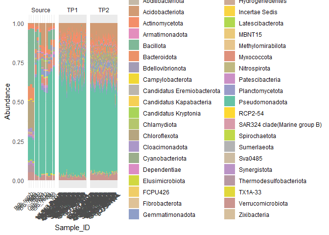<!-- -->

``` r
## save
ggsave(paste0(dir, "figs/rel_abund_phylum.png"),
       width = 10, height = 6, units = "in", plot = p1,
       dpi = 400)

# Aggregate to Family level
ps_family <- tax_glom(ps_filtered_norm, taxrank = "Family")

# Convert to long format for ggplot
df <- psmelt(ps_family)

## select top 20 families
top_families <- df %>%
  group_by(Family) %>%
  summarise(total_abundance = sum(Abundance)) %>%
  arrange(desc(total_abundance)) %>%
  slice(1:20) %>%
  pull(Family)

df_top <- df %>%
  filter(Family %in% top_families) %>%
  group_by(Sample_ID) %>%
  mutate(total_abund = sum(Abundance)) %>%
  mutate(Abundance = ifelse(total_abund > 0, Abundance / total_abund, 0)) %>%
  ungroup(.)

palette <- colorRampPalette(brewer.pal(12, "Set3"))(20)

## Show per-sample bars (keep Sample_ID on x-axis)
## Aggregate by sample_ID and normalize again
df_grouped <- df_top %>%
  group_by(Sample_ID, timepoint, Family) %>%
  summarise(Abundance = mean(Abundance), .groups = "drop") %>%
  group_by(Sample_ID, timepoint) %>%
  mutate(Abundance = Abundance / sum(Abundance)) %>%
  ungroup()

ggplot(df_grouped, aes(x = Sample_ID, y = Abundance, fill = Family)) +
  geom_bar(stat = "identity", position = "stack") +
  facet_wrap(~ timepoint, ncol = 4, scales = "free_x") +
  scale_fill_manual(values = palette) +
  theme_minimal() +
  theme(axis.text.x = element_text(angle = 45, hjust = 1))
```

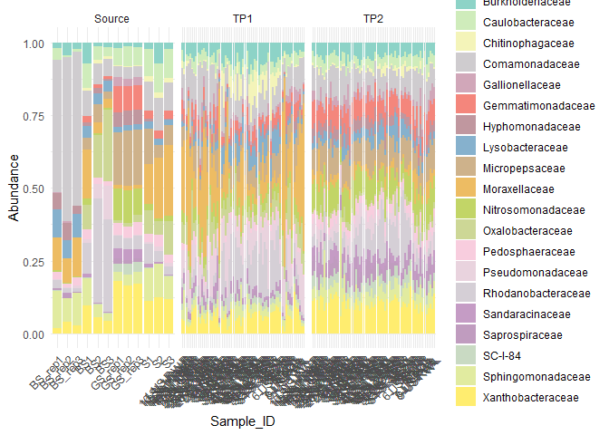<!-- -->

``` r
## Aggregate by species_treat and normalize again
df_grouped <- df_top %>%
  group_by(species_treat, species, treat.rn, timepoint, Family) %>%
  summarise(Abundance = mean(Abundance), .groups = "drop") %>%
  group_by(species_treat, timepoint) %>%
  mutate(Abundance = Abundance / sum(Abundance)) %>%
  ungroup()

p2 <- ggplot(df_grouped, aes(x = treat.rn, y = Abundance, fill = Family)) +
  geom_bar(stat = "identity", position = "stack") +
  facet_wrap(~ timepoint:species, ncol = 4, scales = "free_x") +
  scale_fill_manual(values = palette) +
  theme_minimal() +
  theme(axis.text.x = element_text(angle = 45, hjust = 1))
p2
```

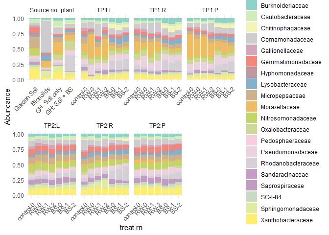<!-- -->

``` r
## save
ggsave(paste0(dir, "figs/rel_abund_family.png"),
       width = 10, height = 6, units = "in", plot = p2,
       dpi = 400)

# Aggregate to genus level
ps_genus <- tax_glom(ps_filtered_norm, taxrank = "Genus")

# Convert to long format for ggplot
df <- psmelt(ps_genus)

## select top 20 genera
top_genera <- df %>%
  group_by(Genus) %>%
  summarise(total_abundance = sum(Abundance)) %>%
  arrange(desc(total_abundance)) %>%
  slice(1:20) %>%
  pull(Genus)

df_top <- df %>%
  filter(Genus %in% top_genera) %>%
  group_by(Sample_ID) %>%
  mutate(total_abund = sum(Abundance)) %>%
  mutate(Abundance = ifelse(total_abund > 0, Abundance / total_abund, 0)) %>%
  ungroup(.)

palette <- colorRampPalette(brewer.pal(12, "Paired"))(20)

## Show per-sample bars (keep Sample_ID on x-axis)
## Aggregate by sample_ID and normalize again
df_grouped <- df_top %>%
  group_by(Sample_ID, timepoint, Genus) %>%
  summarise(Abundance = mean(Abundance), .groups = "drop") %>%
  group_by(Sample_ID, timepoint) %>%
  mutate(Abundance = Abundance / sum(Abundance)) %>%
  ungroup()

ggplot(df_grouped, aes(x = Sample_ID, y = Abundance, fill = Genus)) +
  geom_bar(stat = "identity", position = "stack") +
  facet_wrap(~ timepoint, ncol = 4, scales = "free_x") +
  scale_fill_manual(values = palette) +
  theme_minimal() +
  theme(axis.text.x = element_text(angle = 45, hjust = 1))
```

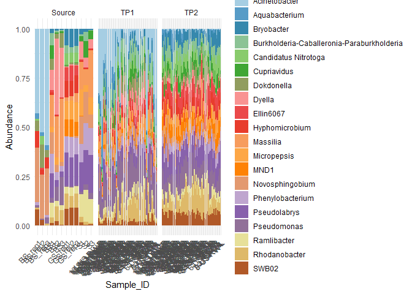<!-- -->

``` r
## Aggregate by species_treat and normalize again
df_grouped <- df_top %>%
  group_by(species, treat.rn, timepoint, Genus) %>%
  summarise(Abundance = mean(Abundance), .groups = "drop") %>%
  group_by(species, treat.rn, timepoint) %>%
  mutate(Abundance = Abundance / sum(Abundance)) %>%
  ungroup()

p3 <- ggplot(df_grouped, aes(x = treat.rn, y = Abundance, fill = Genus)) +
  geom_bar(stat = "identity", position = "stack") +
  facet_wrap(~ timepoint:species, ncol = 4, scales = "free_x") +
  scale_fill_manual(values = palette) +
  theme_minimal() +
  theme(axis.text.x = element_text(angle = 45, hjust = 1))
p3
```

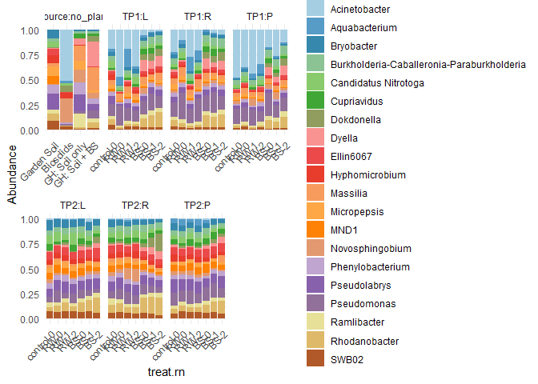<!-- -->

``` r
## save
ggsave(paste0(dir, "figs/rel_abund_genus.png"),
       width = 10, height = 6, units = "in", plot = p3,
       dpi = 400)
```

## Relative abundance plots (pruned)

``` r
dir <- "./16S_analyses_files/"
## load relevant phyloseqs
load(file = paste0(dir, "phyloseq_bac.Rda")) ## loads ps_bac

## look at metadata file
meta <- data.frame(sample_data(ps_bac))

# Transform to relative abundance
ps_rel <- transform_sample_counts(ps_bac, function(x) x / sum(x))

# Calculate mean relative abundance across all samples
mean_abund <- taxa_sums(ps_rel) / sum(taxa_sums(ps_rel))

# Filter ASVs with >= 0.001 (i.e., 0.1%) relative abundance
ps_filtered <- prune_taxa(mean_abund >= 0.001, ps_rel)

#  re-normalize each sample so that its total abundance sums to 1 again
ps_filtered_norm <- transform_sample_counts(ps_filtered, function(x) x / sum(x))

# Aggregate to Phylum level
ps_phylum <- tax_glom(ps_filtered_norm, taxrank = "Phylum")

#  re-normalize each sample so that its total abundance sums to 1 again
ps_phylum_norm <- transform_sample_counts(ps_phylum, function(x) x / sum(x))

# Convert to long format for ggplot
df <- psmelt(ps_phylum_norm)

# Get unique taxa (e.g., Phyla)
taxa_levels <- unique(df$Phylum)

# Generate a palette with enough distinct colors
# If you need more than 12 colors, use colorRampPalette
palette_extended <- colorRampPalette(brewer.pal(8, "Set2"))(length(taxa_levels))

## plot
p1 <- ggplot(df, aes(x = Sample_ID, y = Abundance, fill = Phylum)) +
  geom_bar(stat = "identity") +
  facet_wrap(~ timepoint, scales = "free_x") +  # Facet by treatment
  scale_fill_manual(values = setNames(palette_extended, taxa_levels)) +
  theme_minimal() +
  theme(axis.text.x = element_text(angle = 45, hjust = 1))
p1
```

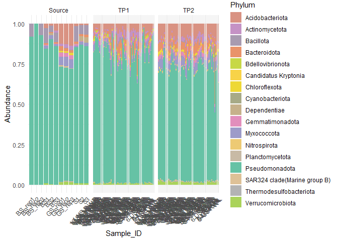<!-- -->

``` r
## save
ggsave(paste0(dir, "figs/rel_abund_phylum.pruned1.png"),
       width = 10, height = 6, units = "in", plot = p1,
       dpi = 400)

# Aggregate to Family level
ps_family <- tax_glom(ps_filtered_norm, taxrank = "Family")

# Convert to long format for ggplot
df <- psmelt(ps_family)

## select top 20 families
top_families <- df %>%
  group_by(Family) %>%
  summarise(total_abundance = sum(Abundance)) %>%
  arrange(desc(total_abundance)) %>%
  slice(1:20) %>%
  pull(Family)

df_top <- df %>%
  filter(Family %in% top_families) %>%
  group_by(Sample_ID) %>%
  mutate(total_abund = sum(Abundance)) %>%
  mutate(Abundance = ifelse(total_abund > 0, Abundance / total_abund, 0)) %>%
  ungroup(.)

palette <- colorRampPalette(brewer.pal(12, "Set3"))(20)

## Show per-sample bars (keep Sample_ID on x-axis)
## Aggregate by sample_ID and normalize again
df_grouped <- df_top %>%
  group_by(Sample_ID, timepoint, Family) %>%
  summarise(Abundance = mean(Abundance), .groups = "drop") %>%
  group_by(Sample_ID, timepoint) %>%
  mutate(Abundance = Abundance / sum(Abundance)) %>%
  ungroup()

ggplot(df_grouped, aes(x = Sample_ID, y = Abundance, fill = Family)) +
  geom_bar(stat = "identity", position = "stack") +
  facet_wrap(~ timepoint, ncol = 4, scales = "free_x") +
  scale_fill_manual(values = palette) +
  theme_minimal() +
  theme(axis.text.x = element_text(angle = 45, hjust = 1))
```

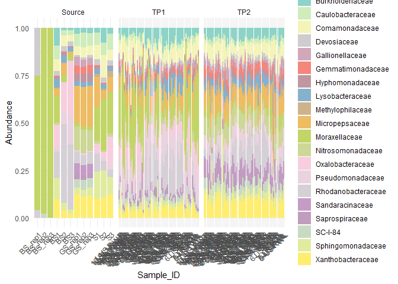<!-- -->

``` r
## Aggregate by species_treat and normalize again
df_grouped <- df_top %>%
  group_by(species_treat, species, treat.rn, timepoint, Family) %>%
  summarise(Abundance = mean(Abundance), .groups = "drop") %>%
  group_by(species_treat, timepoint) %>%
  mutate(Abundance = Abundance / sum(Abundance)) %>%
  ungroup()

p2 <- ggplot(df_grouped, aes(x = treat.rn, y = Abundance, fill = Family)) +
  geom_bar(stat = "identity", position = "stack") +
  facet_wrap(~ timepoint:species, ncol = 4, scales = "free_x") +
  scale_fill_manual(values = palette) +
  theme_minimal() +
  theme(axis.text.x = element_text(angle = 45, hjust = 1))
p2
```

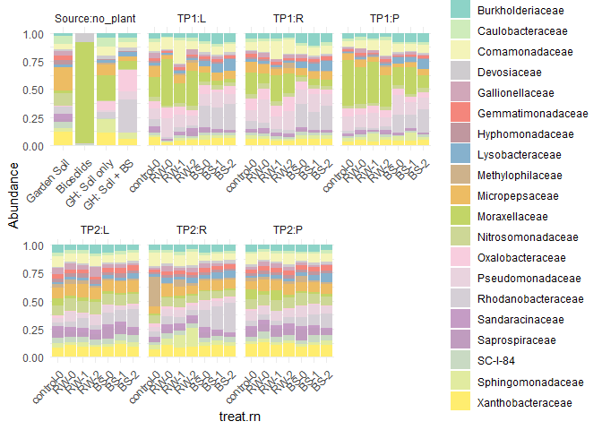<!-- -->

``` r
## save
ggsave(paste0(dir, "figs/rel_abund_family.pruned1.png"),
       width = 10, height = 6, units = "in", plot = p2,
       dpi = 400)

# Aggregate to genus level
ps_genus <- tax_glom(ps_filtered_norm, taxrank = "Genus")

# Convert to long format for ggplot
df <- psmelt(ps_genus)

## select top 20 genera
top_genera <- df %>%
  group_by(Genus) %>%
  summarise(total_abundance = sum(Abundance)) %>%
  arrange(desc(total_abundance)) %>%
  slice(1:20) %>%
  pull(Genus)

df_top <- df %>%
  filter(Genus %in% top_genera) %>%
  group_by(Sample_ID) %>%
  mutate(total_abund = sum(Abundance)) %>%
  mutate(Abundance = ifelse(total_abund > 0, Abundance / total_abund, 0)) %>%
  ungroup(.)

palette <- colorRampPalette(brewer.pal(12, "Paired"))(20)

## Show per-sample bars (keep Sample_ID on x-axis)
## Aggregate by sample_ID and normalize again
df_grouped <- df_top %>%
  group_by(Sample_ID, timepoint, Genus) %>%
  summarise(Abundance = mean(Abundance), .groups = "drop") %>%
  group_by(Sample_ID, timepoint) %>%
  mutate(Abundance = Abundance / sum(Abundance)) %>%
  ungroup()

ggplot(df_grouped, aes(x = Sample_ID, y = Abundance, fill = Genus)) +
  geom_bar(stat = "identity", position = "stack") +
  facet_wrap(~ timepoint, ncol = 4, scales = "free_x") +
  scale_fill_manual(values = palette) +
  theme_minimal() +
  theme(axis.text.x = element_text(angle = 45, hjust = 1))
```

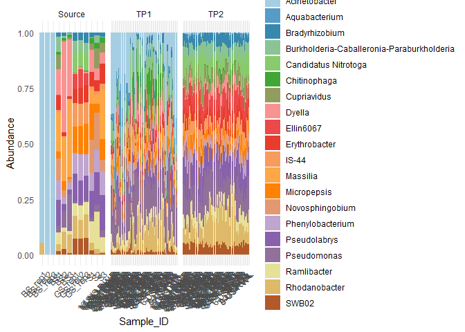<!-- -->

``` r
## Aggregate by species_treat and normalize again
df_grouped <- df_top %>%
  group_by(species, treat.rn, timepoint, Genus) %>%
  summarise(Abundance = mean(Abundance), .groups = "drop") %>%
  group_by(species, treat.rn, timepoint) %>%
  mutate(Abundance = Abundance / sum(Abundance)) %>%
  ungroup()

p3 <- ggplot(df_grouped, aes(x = treat.rn, y = Abundance, fill = Genus)) +
  geom_bar(stat = "identity", position = "stack") +
  facet_wrap(~ timepoint:species, ncol = 4, scales = "free_x") +
  scale_fill_manual(values = palette) +
  theme_minimal() +
  theme(axis.text.x = element_text(angle = 45, hjust = 1))
p3
```

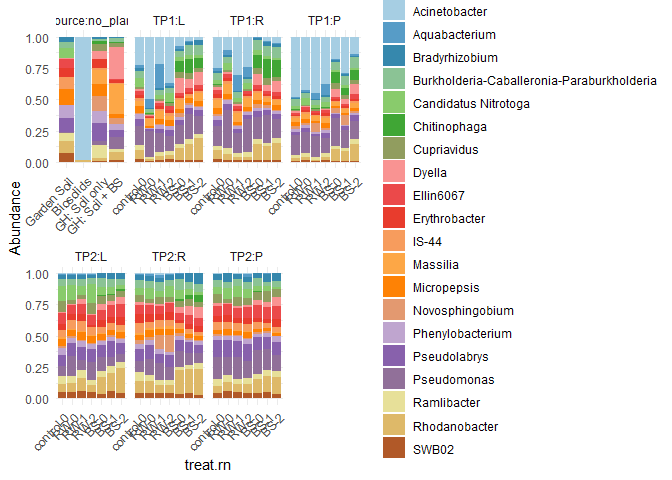<!-- -->

``` r
## save
ggsave(paste0(dir, "figs/rel_abund_genus.pruned1.png"),
       width = 10, height = 6, units = "in", plot = p3,
       dpi = 400)
```
