Direct exposure experiment: effects of amendments and contamination
concentration on crop performance
================
RTD, II
2025-11-28

## Direct impacts of amendinants on crop growth

What impacts do amendments spiked with different levels of contaminants
have on plant traits, and are these impacts crop-species dependent?

Experimental design:

- Crossed two amendment types (biosolids \[BS\] and reclaimed water
  \[RW\]) with three amendinant spiking levels (0 \[no spiking\], 1
  \[ecologically relevant concentrations\], and 2 \[higher than
  ecological concentrations, to detect in plant tissues downstream\]).
- Exposed the resulting six treatments to each of three crop species
  commonly used in agriculture (lettuce, radish, and green peas), each
  growing separately in pots, resulting in a total of 18 treatment
  combinations (2 amendments x 3 spiking levels x 3 crop species).
- To account for environmental heterogeneity in growth conditions across
  the greenhouse, each treatment combination was spatially replicated
  three times, for a total of 54 experimental units (i.e., pots).
- Finally, we included nine controls in which no amendments were added,
  for a total of 63 pots (n = 3 controls per crop species x 3 crops = 9
  pots).

Traits measured:

- Post-planting:
  - Germination rates (proportion of germinated seeds out of total
    number of seeds planted)
  - Survival rates (proportion of plants that survived out of total
    number of seeds planted)  
- At harvest:
  - Normalized Difference Vegetation Index (NDVI) value, which reflects
    leaf chlorophyll A content and is a close correlate of nitrogen
    content,
  - Above- and below-ground wet and dry biomass
- For peas only:
  - Wet and dry pod weights (the portion of the plant most relevant to
    agricultural yield).
  - Number of flowers and pods
  - Infection rate (proportion of plants infected by fungus out of
    total)

### Load data and format

``` r
## load raw data
direct <- read_csv("./raw_data/direct-updated.csv")
```

    ## Rows: 63 Columns: 23
    ## ── Column specification ────────────────────────────────────────────────────────
    ## Delimiter: ","
    ## chr   (4): species, source, treat, dry_shoot_weight_notes
    ## dbl  (17): sample_ID, spiking_level, plants, wet_shoot_weight, dry_shoot_wei...
    ## date  (2): planting_date1, planting_date2
    ## 
    ## ℹ Use `spec()` to retrieve the full column specification for this data.
    ## ℹ Specify the column types or set `show_col_types = FALSE` to quiet this message.

``` r
## calculate other traits
direct <- direct %>%
  mutate(seeds_planted_total = 
           rowSums(across(c(seeds_planted1, seeds_planted2)),
                                       na.rm=TRUE),
         seeds_germinated_total = 
           rowSums(across(c(seeds_germinated,
                            seeds_germinated2)),
                                       na.rm=TRUE),
         germination_perc.r = (seeds_germinated_total / 
                               seeds_planted_total)*100,
         germination_perc = ifelse(germination_perc.r > 100,
                                   100,
                                   germination_perc.r),
         survival_perc.r = (plants / seeds_planted_total) * 100,
         survival_perc = ifelse(survival_perc.r > 100,
                                100,
                                survival_perc.r),
         dry_total_weight = rowSums(across(c(dry_shoot_weight, 
                                             dry_root_weight))),
         shoot_root_ratio = dry_shoot_weight / dry_root_weight,
         shoot_moisture = (wet_shoot_weight - dry_shoot_weight) /
           dry_shoot_weight,
         per_plant_weight = dry_total_weight / plants,
         infected_peas_perc = 
           (infected_peas/seeds_planted_total)*100
         )

### change weight pod weight to NA for samples without pods
direct$wet_pod_weight.corr <- ifelse(direct$pods > 0, 
                                     direct$wet_pod_weight,
                                     NA)

direct$dry_pod_weight.corr <- ifelse(direct$pods > 0, 
                                     direct$dry_pod_weight,
                                     NA)

direct$per_pod_weight <- ifelse(is.na(direct$pods) == FALSE,
                                direct$dry_pod_weight.corr / direct$pods,
                                NA)
  
### add 1's to survival percentage (to take log)
direct$survival_perc.corr <- direct$survival_perc + 1

### add 1's to percent infected
direct$infected_peas_perc.corr <- 
  ifelse(is.na(direct$infected_peas_perc) == 
           FALSE,
         direct$infected_peas_perc + 1,
         NA)

## add in NDVI data
ndvi <- read_csv("./raw_data/direct_biomass_ndvi.csv")
```

    ## New names:
    ## Rows: 63 Columns: 18
    ## ── Column specification
    ## ──────────────────────────────────────────────────────── Delimiter: "," chr
    ## (3): species, source, treat dbl (14): sample_ID, spiking_level, plants,
    ## wet_shoot_weight, dry_shoot_weig... lgl (1): ...18
    ## ℹ Use `spec()` to retrieve the full column specification for this data. ℹ
    ## Specify the column types or set `show_col_types = FALSE` to quiet this message.
    ## • `` -> `...18`

``` r
ndvi$NDVI_mean <- 
  rowMeans(ndvi[, c("ndvi_1", "ndvi_2", "ndvi_3")], 
                           na.rm = TRUE)

direct$NDVI_mean <- ndvi$NDVI_mean[match(direct$sample_ID, 
                                      ndvi$sample_ID)]
direct$NDVI_mean <- ifelse(is.nan(direct$NDVI_mean) == TRUE,
                           NA,
                           direct$NDVI_mean)

## Code factors

### specify spiking level as an ordered factor
direct$spikeFac <- factor(direct$spiking_level,
                          levels = c("0","1","2"),
                          ordered = TRUE)

### rename source to be consistent with indirect
direct$amend <- ifelse(
  is.na(direct$source) == TRUE, "control",
                        ifelse(
                          direct$source ==
                            "effluents","RW",
                               "BS"))

direct$amend <- factor(direct$amend,
                        levels = c(
                          "control",
                          "RW",
                          "BS"
                        ))

### spiking level plus amend
direct$amend_spike <- paste0(direct$amend, 
                                "-", 
                                direct$spiking_level)

### treatment
direct$amend_spike <- factor(direct$amend_spike, 
                                levels = c("control-0",
                                           "RW-0",
                                           "RW-1",
                                           "RW-2",
                                           "BS-0",
                                           "BS-1",
                                           "BS-2"
                                           ),
                              ordered = TRUE)

### species
direct$species <- factor(direct$species, 
                                levels = c("lettuce",
                                           "radish",
                                           "pea"))

## save formatted data file
save(direct, file = "./direct_files/direct-formatted.Rda")

## write csv file
write.csv(direct, "./direct_files/raw_data.formatted.csv",
          row.names = FALSE)
```

### Examine correlations among traits

Ensuring we are picking traits that are not highly correlated

``` r
## set output directory
dir <- "./direct_files/figs" 

## load required packages
library(readr)
library(ggplot2)
library(dplyr)
library(pheatmap)
library(factoextra)
```

    ## Warning: package 'factoextra' was built under R version 4.5.2

    ## Welcome! Want to learn more? See two factoextra-related books at https://goo.gl/ve3WBa

``` r
library(FactoMineR)
```

    ## Warning: package 'FactoMineR' was built under R version 4.5.2

``` r
library(cowplot)
library(tidyr)
library(tibble)
library(purrr)

## load data
load(file = "./direct_files/direct-formatted.Rda") ## loads direct

## specify trait vars (all species)
trait.list.all <- c(
                "wet_shoot_weight", 
                "dry_shoot_weight",
                "wet_root_weight", 
                "dry_root_weight",
                "dry_total_weight",
                "per_plant_weight",
                "shoot_moisture",
                "shoot_root_ratio",
                "germination_perc",
                "survival_perc",
                ## pea specific
                "wet_pod_weight",
                "dry_pod_weight",
                "per_pod_weight",
                "infected_peas_perc",
                ## "NDVI_mean", ## too many NAs
                "pods",
                "flowers")

### select all traits
direct_cols_df <- direct[, c(trait.list.all, "species", "sample_ID")]

# ## replace NAs with 0s for all
# direct_cols_df <- direct_cols_df %>%
#   mutate(across(where(is.numeric), ~ ifelse(is.na(.), 0, .)))

## run the following function to examine correlations across and within species
source("./Source_code/run_corr.func.R")

all_traits <- c("wet_shoot_weight", "dry_shoot_weight", "wet_root_weight", "dry_root_weight",
            "dry_total_weight", "per_plant_weight", "shoot_moisture", "shoot_root_ratio",
            "germination_perc", "survival_perc")

pea_traits <- c("wet_shoot_weight", "dry_shoot_weight", "wet_root_weight", "dry_root_weight",
            "dry_total_weight", "per_plant_weight", "shoot_moisture", "shoot_root_ratio",
            "germination_perc", "survival_perc",
            "wet_pod_weight", "dry_pod_weight", "per_pod_weight",
            "infected_peas_perc", "pods", "flowers")

vars_by_species <- list(
  "ALL" = all_traits,
  "lettuce" = all_traits,
  "radish" = all_traits,
  "pea" = pea_traits)

result <- run_corr(data = direct_cols_df,
                   species_col = "species",
                   output_dir = dir,
                   top_n_vars = 3,
                   vars_by_species = vars_by_species)
```

    ## [1] "Using existing output directory: ./direct_files/figs"
    ## [1] "---- Processing species: ALL ----"
    ## [1] "Available vars: wet_shoot_weight, dry_shoot_weight, wet_root_weight, dry_root_weight, dry_total_weight, per_plant_weight, shoot_moisture, shoot_root_ratio, germination_perc, survival_perc"
    ## [1] "Rows: 63 Cols: 10"
    ## [1] "Running PCA..."

    ## Warning in geom_bar(stat = "identity", fill = barfill, color = barcolor, :
    ## Ignoring empty aesthetic: `width`.

    ## Warning: Using `size` aesthetic for lines was deprecated in ggplot2 3.4.0.
    ## ℹ Please use `linewidth` instead.
    ## ℹ The deprecated feature was likely used in the ggpubr package.
    ##   Please report the issue at <https://github.com/kassambara/ggpubr/issues>.
    ## This warning is displayed once every 8 hours.
    ## Call `lifecycle::last_lifecycle_warnings()` to see where this warning was
    ## generated.

    ## Warning: `aes_string()` was deprecated in ggplot2 3.0.0.
    ## ℹ Please use tidy evaluation idioms with `aes()`.
    ## ℹ See also `vignette("ggplot2-in-packages")` for more information.
    ## ℹ The deprecated feature was likely used in the factoextra package.
    ##   Please report the issue at <https://github.com/kassambara/factoextra/issues>.
    ## This warning is displayed once every 8 hours.
    ## Call `lifecycle::last_lifecycle_warnings()` to see where this warning was
    ## generated.

    ## Coordinate system already present.
    ## ℹ Adding new coordinate system, which will replace the existing one.

    ## Ignoring unknown labels:
    ## • linetype : "Species"

    ## [1] "Finished species: ALL"
    ## [1] "---- Processing species: lettuce ----"
    ## [1] "Available vars: wet_shoot_weight, dry_shoot_weight, wet_root_weight, dry_root_weight, dry_total_weight, per_plant_weight, shoot_moisture, shoot_root_ratio, germination_perc, survival_perc"
    ## [1] "Rows: 21 Cols: 10"
    ## [1] "Running PCA..."

    ## Warning in geom_bar(stat = "identity", fill = barfill, color = barcolor, :
    ## Ignoring empty aesthetic: `width`.

    ## Coordinate system already present.
    ## ℹ Adding new coordinate system, which will replace the existing one.

    ## [1] "Finished species: lettuce"
    ## [1] "---- Processing species: radish ----"
    ## [1] "Available vars: wet_shoot_weight, dry_shoot_weight, wet_root_weight, dry_root_weight, dry_total_weight, per_plant_weight, shoot_moisture, shoot_root_ratio, germination_perc, survival_perc"
    ## [1] "Rows: 21 Cols: 10"
    ## [1] "Running PCA..."

    ## Warning in geom_bar(stat = "identity", fill = barfill, color = barcolor, :
    ## Ignoring empty aesthetic: `width`.

    ## Coordinate system already present.
    ## ℹ Adding new coordinate system, which will replace the existing one.

    ## [1] "Finished species: radish"
    ## [1] "---- Processing species: pea ----"
    ## [1] "Available vars: wet_shoot_weight, dry_shoot_weight, wet_root_weight, dry_root_weight, dry_total_weight, per_plant_weight, shoot_moisture, shoot_root_ratio, germination_perc, survival_perc, wet_pod_weight, dry_pod_weight, per_pod_weight, infected_peas_perc, pods, flowers"
    ## [1] "Rows: 21 Cols: 16"
    ## [1] "Running PCA..."

    ## Warning in geom_bar(stat = "identity", fill = barfill, color = barcolor, :
    ## Ignoring empty aesthetic: `width`.

    ## Coordinate system already present.
    ## ℹ Adding new coordinate system, which will replace the existing one.

    ## [1] "Finished species: pea"
    ## [1] "All species processed."
    ## [1] "No species were skipped."

### Direct exposure experiment: models

#### Model 1: amendment x species

Impact of amendment type on plant traits, compared across different crop
species

Include controls. Limit to Spiking level 0 (no additional contaminants
added)

``` r
## load data
load(file = "./direct_files/direct-formatted.Rda") ## loads direct

## set contrasts for ANOVA
options(contrasts=c("contr.sum","contr.poly")) 

### traits to run through
trait.list <- c(
                "dry_total_weight",
                "per_plant_weight",
                "shoot_moisture",
                "shoot_root_ratio",
                "germination_perc",
                "survival_perc.corr",
                ### pea specific
                "dry_pod_weight.corr",
                "per_pod_weight",
                "NDVI_mean",
                "pods",
                "flowers"
                )

# Create output directory if it doesn't exist
## set output directory
output_dir <- "./direct_files/models/"
if (!dir.exists(output_dir)) {
  dir.create(output_dir, recursive = TRUE)
}

## source function
source("./Source_code/mod-direct_species.vs.amend.func.R")

## model
mod.out <- sapply(trait.list, 
                   mod_species.vs.amend,
                   df = direct,
                   simplify = FALSE, 
                   USE.NAMES = TRUE)
```

    ## [1] "dry_total_weight"

    ## 
    ## Call:
    ## lm(formula = log(get(traits)) ~ species * amend, data = df.f)
    ## 
    ## Residuals:
    ##      Min       1Q   Median       3Q      Max 
    ## -1.07172 -0.19932  0.00523  0.16221  0.77755 
    ## 
    ## Coefficients:
    ##                 Estimate Std. Error t value Pr(>|t|)    
    ## (Intercept)      2.08092    0.08387  24.811 2.27e-15 ***
    ## species1         0.45731    0.11861   3.856  0.00116 ** 
    ## species2         0.10640    0.11861   0.897  0.38155    
    ## amend1          -0.08748    0.11861  -0.738  0.47029    
    ## amend2           0.20058    0.11861   1.691  0.10806    
    ## species1:amend1 -0.06276    0.16774  -0.374  0.71267    
    ## species2:amend1  0.03083    0.16774   0.184  0.85625    
    ## species1:amend2 -0.01234    0.16774  -0.074  0.94219    
    ## species2:amend2 -0.11804    0.16774  -0.704  0.49061    
    ## ---
    ## Signif. codes:  0 '***' 0.001 '**' 0.01 '*' 0.05 '.' 0.1 ' ' 1
    ## 
    ## Residual standard error: 0.4358 on 18 degrees of freedom
    ## Multiple R-squared:  0.6218, Adjusted R-squared:  0.4537 
    ## F-statistic: 3.699 on 8 and 18 DF,  p-value: 0.01009

    ## Warning in ref_grid(lmm): There are unevaluated constants in the response formula
    ## Auto-detection of the response transformation may be incorrect

    ## NOTE: Results may be misleading due to involvement in interactions

    ## [1] "per_plant_weight"

    ## 
    ## Call:
    ## lm(formula = log(get(traits)) ~ species * amend, data = df.f)
    ## 
    ## Residuals:
    ##      Min       1Q   Median       3Q      Max 
    ## -0.64438 -0.11483 -0.03029  0.12545  0.33659 
    ## 
    ## Coefficients:
    ##                  Estimate Std. Error t value Pr(>|t|)    
    ## (Intercept)     -0.456823   0.050192  -9.102 3.73e-08 ***
    ## species1         0.559102   0.070982   7.877 3.06e-07 ***
    ## species2        -0.063909   0.070982  -0.900    0.380    
    ## amend1          -0.004375   0.070982  -0.062    0.952    
    ## amend2           0.051207   0.070982   0.721    0.480    
    ## species1:amend1  0.074621   0.100383   0.743    0.467    
    ## species2:amend1 -0.052282   0.100383  -0.521    0.609    
    ## species1:amend2  0.061403   0.100383   0.612    0.548    
    ## species2:amend2  0.031332   0.100383   0.312    0.759    
    ## ---
    ## Signif. codes:  0 '***' 0.001 '**' 0.01 '*' 0.05 '.' 0.1 ' ' 1
    ## 
    ## Residual standard error: 0.2608 on 18 degrees of freedom
    ## Multiple R-squared:  0.8113, Adjusted R-squared:  0.7274 
    ## F-statistic: 9.673 on 8 and 18 DF,  p-value: 3.825e-05

    ## Warning in ref_grid(lmm): There are unevaluated constants in the response formula
    ## Auto-detection of the response transformation may be incorrect

    ## NOTE: Results may be misleading due to involvement in interactions

    ## [1] "shoot_moisture"

    ## 
    ## Call:
    ## lm(formula = log(get(traits)) ~ species * amend, data = df.f)
    ## 
    ## Residuals:
    ##      Min       1Q   Median       3Q      Max 
    ## -0.51349 -0.06301  0.03570  0.07064  0.53440 
    ## 
    ## Coefficients:
    ##                  Estimate Std. Error t value Pr(>|t|)    
    ## (Intercept)      2.858527   0.054686  52.272  < 2e-16 ***
    ## species1         0.191965   0.077338   2.482 0.023149 *  
    ## species2         0.371616   0.077338   4.805 0.000142 ***
    ## amend1           0.005657   0.077338   0.073 0.942494    
    ## amend2          -0.063951   0.077338  -0.827 0.419113    
    ## species1:amend1  0.126225   0.109372   1.154 0.263555    
    ## species2:amend1 -0.185850   0.109372  -1.699 0.106489    
    ## species1:amend2 -0.087148   0.109372  -0.797 0.435951    
    ## species2:amend2 -0.126137   0.109372  -1.153 0.263878    
    ## ---
    ## Signif. codes:  0 '***' 0.001 '**' 0.01 '*' 0.05 '.' 0.1 ' ' 1
    ## 
    ## Residual standard error: 0.2842 on 18 degrees of freedom
    ## Multiple R-squared:  0.7876, Adjusted R-squared:  0.6932 
    ## F-statistic: 8.344 on 8 and 18 DF,  p-value: 0.0001025

    ## Warning in ref_grid(lmm): There are unevaluated constants in the response formula
    ## Auto-detection of the response transformation may be incorrect

    ## NOTE: Results may be misleading due to involvement in interactions

    ## [1] "shoot_root_ratio"

    ## 
    ## Call:
    ## lm(formula = log(get(traits)) ~ species * amend, data = df.f)
    ## 
    ## Residuals:
    ##      Min       1Q   Median       3Q      Max 
    ## -0.72864 -0.29155 -0.05589  0.28939  0.92363 
    ## 
    ## Coefficients:
    ##                 Estimate Std. Error t value Pr(>|t|)    
    ## (Intercept)      2.43783    0.09875  24.686 2.47e-15 ***
    ## species1         0.32336    0.13966   2.315   0.0326 *  
    ## species2        -0.98743    0.13966  -7.070 1.36e-06 ***
    ## amend1          -0.20830    0.13966  -1.492   0.1531    
    ## amend2          -0.13604    0.13966  -0.974   0.3429    
    ## species1:amend1 -0.30269    0.19750  -1.533   0.1428    
    ## species2:amend1  0.27086    0.19750   1.371   0.1871    
    ## species1:amend2  0.29614    0.19750   1.499   0.1511    
    ## species2:amend2 -0.30141    0.19750  -1.526   0.1444    
    ## ---
    ## Signif. codes:  0 '***' 0.001 '**' 0.01 '*' 0.05 '.' 0.1 ' ' 1
    ## 
    ## Residual standard error: 0.5131 on 18 degrees of freedom
    ## Multiple R-squared:  0.7753, Adjusted R-squared:  0.6754 
    ## F-statistic: 7.762 on 8 and 18 DF,  p-value: 0.0001636

    ## Warning in ref_grid(lmm): There are unevaluated constants in the response formula
    ## Auto-detection of the response transformation may be incorrect

    ## NOTE: Results may be misleading due to involvement in interactions

    ## [1] "germination_perc"

    ## 
    ## Call:
    ## lm(formula = log(get(traits)) ~ species * amend, data = df.f)
    ## 
    ## Residuals:
    ##      Min       1Q   Median       3Q      Max 
    ## -1.30513 -0.03967  0.00000  0.08230  1.10619 
    ## 
    ## Coefficients:
    ##                 Estimate Std. Error t value Pr(>|t|)    
    ## (Intercept)      4.25367    0.09763  43.569   <2e-16 ***
    ## species1        -0.05634    0.13807  -0.408    0.688    
    ## species2         0.26813    0.13807   1.942    0.068 .  
    ## amend1           0.10733    0.13807   0.777    0.447    
    ## amend2           0.29749    0.13807   2.155    0.045 *  
    ## species1:amend1 -0.02032    0.19526  -0.104    0.918    
    ## species2:amend1 -0.09421    0.19526  -0.482    0.635    
    ## species1:amend2  0.11035    0.19526   0.565    0.579    
    ## species2:amend2 -0.24832    0.19526  -1.272    0.220    
    ## ---
    ## Signif. codes:  0 '***' 0.001 '**' 0.01 '*' 0.05 '.' 0.1 ' ' 1
    ## 
    ## Residual standard error: 0.5073 on 18 degrees of freedom
    ## Multiple R-squared:  0.4853, Adjusted R-squared:  0.2565 
    ## F-statistic: 2.121 on 8 and 18 DF,  p-value: 0.08829

    ## Warning in ref_grid(lmm): There are unevaluated constants in the response formula
    ## Auto-detection of the response transformation may be incorrect

    ## NOTE: Results may be misleading due to involvement in interactions

    ## [1] "survival_perc.corr"

    ## 
    ## Call:
    ## lm(formula = log(get(traits)) ~ species * amend, data = df.f)
    ## 
    ## Residuals:
    ##     Min      1Q  Median      3Q     Max 
    ## -1.0450  0.0000  0.0000  0.0668  0.6685 
    ## 
    ## Coefficients:
    ##                 Estimate Std. Error t value Pr(>|t|)    
    ## (Intercept)      4.15036    0.07066  58.734   <2e-16 ***
    ## species1         0.27552    0.09993   2.757   0.0130 *  
    ## species2         0.18038    0.09993   1.805   0.0878 .  
    ## amend1           0.02617    0.09993   0.262   0.7964    
    ## amend2           0.24581    0.09993   2.460   0.0242 *  
    ## species1:amend1 -0.10306    0.14133  -0.729   0.4752    
    ## species2:amend1 -0.02617    0.14133  -0.185   0.8552    
    ## species1:amend2 -0.05657    0.14133  -0.400   0.6937    
    ## species2:amend2 -0.24581    0.14133  -1.739   0.0990 .  
    ## ---
    ## Signif. codes:  0 '***' 0.001 '**' 0.01 '*' 0.05 '.' 0.1 ' ' 1
    ## 
    ## Residual standard error: 0.3672 on 18 degrees of freedom
    ## Multiple R-squared:  0.6926, Adjusted R-squared:  0.556 
    ## F-statistic: 5.071 on 8 and 18 DF,  p-value: 0.002048

    ## Warning in ref_grid(lmm): There are unevaluated constants in the response formula
    ## Auto-detection of the response transformation may be incorrect

    ## NOTE: Results may be misleading due to involvement in interactions

    ## [1] "dry_pod_weight.corr"

    ## 
    ## Call:
    ## lm(formula = log(get(traits)) ~ amend, data = df.f)
    ## 
    ## Residuals:
    ##     Min      1Q  Median      3Q     Max 
    ## -1.5056 -0.3271  0.0708  0.2429  1.4348 
    ## 
    ## Coefficients:
    ##             Estimate Std. Error t value Pr(>|t|)
    ## (Intercept)   0.3487     0.3383   1.031    0.342
    ## amend1       -0.2807     0.4784  -0.587    0.579
    ## amend2        0.5155     0.4784   1.078    0.323
    ## 
    ## Residual standard error: 1.015 on 6 degrees of freedom
    ## Multiple R-squared:  0.1625, Adjusted R-squared:  -0.1167 
    ## F-statistic: 0.5821 on 2 and 6 DF,  p-value: 0.5874

    ## Warning in ref_grid(lmm): There are unevaluated constants in the response formula
    ## Auto-detection of the response transformation may be incorrect

    ## [1] "per_pod_weight"

    ## 
    ## Call:
    ## lm(formula = log(get(traits)) ~ amend, data = df.f)
    ## 
    ## Residuals:
    ##      Min       1Q   Median       3Q      Max 
    ## -0.58140 -0.09954  0.01416  0.08866  0.56724 
    ## 
    ## Coefficients:
    ##             Estimate Std. Error t value Pr(>|t|)    
    ## (Intercept) -1.86571    0.14184 -13.154 1.19e-05 ***
    ## amend1      -0.08909    0.20059  -0.444    0.673    
    ## amend2       0.01737    0.20059   0.087    0.934    
    ## ---
    ## Signif. codes:  0 '***' 0.001 '**' 0.01 '*' 0.05 '.' 0.1 ' ' 1
    ## 
    ## Residual standard error: 0.4255 on 6 degrees of freedom
    ## Multiple R-squared:  0.03563,    Adjusted R-squared:  -0.2858 
    ## F-statistic: 0.1109 on 2 and 6 DF,  p-value: 0.8969

    ## Warning in ref_grid(lmm): There are unevaluated constants in the response formula
    ## Auto-detection of the response transformation may be incorrect

    ## [1] "NDVI_mean"

    ## 
    ## Call:
    ## lm(formula = log(get(traits)) ~ amend, data = df.f)
    ## 
    ## Residuals:
    ##        1        2        3        4        5        6        7        9 
    ##  0.03105 -0.08968  0.05785 -0.05785  0.04448  0.04521 -0.06863  0.03758 
    ## 
    ## Coefficients:
    ##              Estimate Std. Error t value Pr(>|t|)    
    ## (Intercept) -0.343172   0.025886 -13.257 4.36e-05 ***
    ## amend1       0.000875   0.035277   0.025    0.981    
    ## amend2      -0.017660   0.035277  -0.501    0.638    
    ## ---
    ## Signif. codes:  0 '***' 0.001 '**' 0.01 '*' 0.05 '.' 0.1 ' ' 1
    ## 
    ## Residual standard error: 0.0719 on 5 degrees of freedom
    ##   (1 observation deleted due to missingness)
    ## Multiple R-squared:  0.05368,    Adjusted R-squared:  -0.3248 
    ## F-statistic: 0.1418 on 2 and 5 DF,  p-value: 0.8712

    ## Warning in ref_grid(lmm): There are unevaluated constants in the response formula
    ## Auto-detection of the response transformation may be incorrect

    ## [1] "pods"

    ## 
    ## Call:
    ## glm(formula = form, family = poisson(link = "log"), data = df.f)
    ## 
    ## Coefficients:
    ##             Estimate Std. Error z value Pr(>|z|)    
    ## (Intercept)   2.4108     0.1011  23.852   <2e-16 ***
    ## amend1       -0.1421     0.1473  -0.964   0.3349    
    ## amend2        0.3193     0.1321   2.416   0.0157 *  
    ## ---
    ## Signif. codes:  0 '***' 0.001 '**' 0.01 '*' 0.05 '.' 0.1 ' ' 1
    ## 
    ## (Dispersion parameter for poisson family taken to be 1)
    ## 
    ##     Null deviance: 33.210  on 8  degrees of freedom
    ## Residual deviance: 27.508  on 6  degrees of freedom
    ## AIC: 70.209
    ## 
    ## Number of Fisher Scoring iterations: 5
    ## 
    ## [1] "flowers"

    ## 
    ## Call:
    ## glm(formula = form, family = poisson(link = "log"), data = df.f)
    ## 
    ## Coefficients:
    ##              Estimate Std. Error z value Pr(>|z|)    
    ## (Intercept)  0.985997   0.211325   4.666 3.07e-06 ***
    ## amend1      -0.005168   0.293811  -0.018    0.986    
    ## amend2       0.480340   0.265140   1.812    0.070 .  
    ## ---
    ## Signif. codes:  0 '***' 0.001 '**' 0.01 '*' 0.05 '.' 0.1 ' ' 1
    ## 
    ## (Dispersion parameter for poisson family taken to be 1)
    ## 
    ##     Null deviance: 8.9711  on 8  degrees of freedom
    ## Residual deviance: 5.2102  on 6  degrees of freedom
    ## AIC: 36.579
    ## 
    ## Number of Fisher Scoring iterations: 5

``` r
## combine dfs
### ANOVAs
aov <- lapply(mod.out, `[[`, 1) %>%
  bind_rows(.)
### format
aov$pval <- ifelse(is.na(aov$`Pr(>F)`) == FALSE,
                   signif(aov$`Pr(>F)`, 3),
                   signif(aov$`Pr(>Chisq)`, 3))
aov$sig <- ifelse(aov$pval< 0.001, ", p < 0.001",
            ifelse(aov$pval < 0.01, paste0(", p = ", aov$pval, "**"),
            ifelse(aov$pval < 0.05, paste0(", p = ", aov$pval, "*"),
            ifelse(aov$pval < 0.1, paste0(", p = ", aov$pval, "."),
                               ", p > 0.1"))))
aov$stat <- ifelse(is.na(aov$`F value`) == FALSE,
                        signif(aov$`F value`, 3),
                        signif(aov$`LR Chisq`, 3))

## pivot wider for each model term
aov.w <- aov %>%
  select(-c(`F value`,"Pr(>F)", "LR Chisq", 
            "Pr(>Chisq)","pval", "Sum Sq")) %>%
  pivot_wider(
    names_from = term,
    values_from = c(stat, Df, sig)
  ) ## 15 traits total, 15 rows

## formatting
aov.f <- aov.w %>%
  mutate(Amendment = ifelse(trait %in% c("pods","flowers"),
                         paste0("X2 = ", stat_amend, 
                                ", df = ", Df_amend,
                                sig_amend),
                         paste0("F [", Df_amend, ", ",
                                Df_Residuals, "] = ", stat_amend,
                                sig_amend)),
         Species = ifelse(trait %in% c(
                               "dry_pod_weight.corr", 
                               "per_pod_weight",
                               "NDVI_mean",
                               "pods",
                               "flowers"), 
                          "N/A (Pea only)",
                    paste0("F [", Df_species, ", ",
                           Df_Residuals, "] = ", stat_species,
                           sig_species)),
         `Species x Amendment` = 
           ifelse(trait %in% c(
                               "dry_pod_weight.corr", 
                               "per_pod_weight",
                               "NDVI_mean",
                               "pods",
                               "flowers"), 
                                  "N/A (Pea only)",
                        paste0("F [", 
                               `Df_species:amend`, ", ",
                                Df_Residuals, "] = ",
                               `stat_species:amend`,
                               `sig_species:amend`))
         ) %>%
  select(trait, Species, Amendment, `Species x Amendment`)

### CONTRASTS (amendment within species)
cont <- lapply(mod.out, `[[`, 3) %>%
  bind_rows(.)

## Amendment (regardless of species)
cont.amend.germ <- mod.out[["germination_perc"]][[4]]
cont.amend.surv <- mod.out[["survival_perc.corr"]][[4]]
cont <- rbind(cont, cont.amend.germ, cont.amend.surv)

## add in pea
cont$crop <- ifelse(is.na(cont$species) == TRUE, "pea", 
                    ifelse(cont$species == ".", "all",
                           paste0(cont$species)))
## round pval
cont$pval <- signif(cont$p.value, 3)
### format
cont$sig <- ifelse(cont$p.value < 0.001, ", p < 0.001",
            ifelse(cont$p.value < 0.01, paste0(", p = ", cont$pval, "**"),
            ifelse(cont$p.value < 0.05, paste0(", p = ", cont$pval, "*"),
            ifelse(cont$p.value < 0.1, paste0(", p = ", cont$pval, "."),
                               ", p > 0.1"))))
## test stats
cont$stat <- ifelse(is.na(cont$t.ratio) == FALSE,
                        signif(cont$t.ratio, 3),
                        signif(cont$z.ratio, 3))

cont$stat.f <- ifelse(cont$trait %in% c("pods","flowers"),
                      paste0("z = ", cont$stat,
                    cont$sig),
                    paste0("t = ", cont$stat, ", ", 
                    "df = ", cont$df,
                    cont$sig)
)
## estimates
cont$log2FC <- log2(cont$ratio)
cont$LCL <- ifelse(is.na(cont$lower.CL) == TRUE,
                   signif(log2(cont$asymp.LCL), 3),
                   signif(log2(cont$lower.CL), 3))
cont$UCL <- ifelse(is.na(cont$upper.CL) == TRUE,
                   signif(log2(cont$asymp.UCL), 3),
                   signif(log2(cont$upper.CL), 3))
cont$log2FC_CL <- paste0(signif(cont$log2FC, 3), " [",
                        cont$LCL," to ",
                        cont$UCL,"]")
## save as R data file
save(cont, file = paste0(output_dir, "cont1-species.vs.amend.Rdata"))
## save as csv
cont.s <- cont %>%
  select(contrast, crop, trait, log2FC_CL, stat.f)
write_csv(cont.s, file = paste0(output_dir, "cont1-species.vs.amend.csv"))

## save relevant output for table
cont.s <- cont %>%
  filter(p.value < 0.1) %>%
  mutate(
    contrast_info = paste0(crop, "_", contrast, ": ", 
                           stat.f, "; ", 
                           "log2FC [95% CL] = ", log2FC_CL)
    ) %>%
  select(trait, contrast_info) %>%
  group_by(trait) %>%
  summarize(
    sig_contrasts = paste(contrast_info, collapse = " | ")
    )

## add to anova
aov.f$sig_contrasts <- cont.s$sig_contrasts[match(aov.f$trait, cont.s$trait)] 
## save
write.csv(aov.f, file = paste0(output_dir, "aov1-species.vs.amend.csv"), 
          row.names = FALSE)
kable(aov.f)
```

| trait | Species | Amendment | Species x Amendment | sig_contrasts |
|:---|:---|:---|:---|:---|
| dry_total_weight | F \[2, 18\] = 12.8, p \< 0.001 | F \[2, 18\] = 1.44, p \> 0.1 | F \[4, 18\] = 0.302, p \> 0.1 | NA |
| per_plant_weight | F \[2, 18\] = 37.2, p \< 0.001 | F \[2, 18\] = 0.32, p \> 0.1 | F \[4, 18\] = 0.599, p \> 0.1 | NA |
| shoot_moisture | F \[2, 18\] = 27.5, p \< 0.001 | F \[2, 18\] = 0.419, p \> 0.1 | F \[4, 18\] = 2.75, p = 0.0602. | radish_BS / control: t = 2.37, df = 18, p = 0.0544.; log2FC \[95% CL\] = 0.794 \[-0.014 to 1.6\] |
| shoot_root_ratio | F \[2, 18\] = 26, p \< 0.001 | F \[2, 18\] = 3.08, p = 0.0705. | F \[4, 18\] = 0.988, p \> 0.1 | NA |
| germination_perc | F \[2, 18\] = 2.1, p \> 0.1 | F \[2, 18\] = 4.61, p = 0.0241\* | F \[4, 18\] = 0.887, p \> 0.1 | pea_BS / control: t = -2.12, df = 18, p = 0.0885.; log2FC \[95% CL\] = -1.27 \[-2.71 to 0.174\] \| all_BS / control: t = -2.14, df = 18, p = 0.0854.; log2FC \[95% CL\] = -0.739 \[-1.57 to 0.0942\] |
| survival_perc.corr | F \[2, 18\] = 10.6, p \< 0.001 | F \[2, 18\] = 4.51, p = 0.0259\* | F \[4, 18\] = 2.61, p = 0.0703. | pea_BS / control: t = -2.87, df = 18, p = 0.0197\*; log2FC \[95% CL\] = -1.24 \[-2.28 to -0.195\] |
| dry_pod_weight.corr | N/A (Pea only) | F \[2, 6\] = 0.582, p \> 0.1 | N/A (Pea only) | NA |
| per_pod_weight | N/A (Pea only) | F \[2, 6\] = 0.111, p \> 0.1 | N/A (Pea only) | NA |
| NDVI_mean | N/A (Pea only) | F \[2, 5\] = 0.142, p \> 0.1 | N/A (Pea only) | NA |
| pods | N/A (Pea only) | X2 = 5.7, df = 2, p = 0.0578. | N/A (Pea only) | pea_RW / control: z = 1.95, p = 0.0962.; log2FC \[95% CL\] = 0.666 \[-0.0945 to 1.43\] |
| flowers | N/A (Pea only) | X2 = 3.76, df = 2, p \> 0.1 | N/A (Pea only) | NA |

``` r
### emmeans
emm <- lapply(mod.out, `[[`, 2) %>%
  bind_rows(.)
write.csv(emm, file = paste0(output_dir, "emm1-species.vs.amend.csv"), 
          row.names = FALSE)
```

#### Model 2: species x contamination level

Impact of contamination concentration on plant traits, compared within
amendment types

Exclude controls (non-spiked)

``` r
## load data
load(file = "./direct_files/direct-formatted.Rda") ## loads direct

## set contrasts for ANOVA
options(contrasts=c("contr.sum","contr.poly")) 

### traits to run through
### traits to run through
trait.list <- c(
                "dry_total_weight",
                "per_plant_weight",
                "shoot_moisture",
                "shoot_root_ratio",
                "germination_perc",
                "survival_perc.corr",
                ### pea specific
                "dry_pod_weight.corr",
                "per_pod_weight",
                ## "NDVI_mean", ## excluded due to not being measured in 2/3 BS treats
                "pods",
                "flowers"
                )

## create list of traits/amends to loop through:
amend.list <- c("RW","BS")
comb_df <- expand_grid(traits = trait.list,
                       amends = amend.list)
## Combine into a single string
comb_df <- comb_df %>%
  mutate(
    combs = paste(traits, amends, sep = "_")
  )
### 28 combinations: 14 traits x 2 amends = 28

# Create output directory if it doesn't exist
## set output directory
output_dir <- "./direct_files/models/"
if (!dir.exists(output_dir)) {
  dir.create(output_dir, recursive = TRUE)
}

## source the function:
source("./Source_code/mod-direct_species.vs.contam.func.R")

mod.out <- mapply(FUN = mod_species.vs.contam, 
                      combs = comb_df$combs, 
                      traits = comb_df$traits, 
                      amends = comb_df$amends, 
                      USE.NAMES = TRUE, 
                      SIMPLIFY = FALSE,
                      MoreArgs = list(df = direct))
```

    ## [1] "dry_total_weight_RW"

    ## 
    ## Call:
    ## lm(formula = log(get(traits)) ~ species * spikeFac, data = df.f)
    ## 
    ## Residuals:
    ##      Min       1Q   Median       3Q      Max 
    ## -0.42637 -0.13817  0.04801  0.14052  0.31536 
    ## 
    ## Coefficients:
    ##                     Estimate Std. Error t value Pr(>|t|)    
    ## (Intercept)          2.21485    0.04754  46.594  < 2e-16 ***
    ## species1             0.58706    0.06722   8.733 6.88e-08 ***
    ## species2            -0.13361    0.06722  -1.987   0.0623 .  
    ## spikeFac.L          -0.07756    0.08233  -0.942   0.3587    
    ## spikeFac.Q           0.02892    0.08233   0.351   0.7295    
    ## species1:spikeFac.L  0.02721    0.11644   0.234   0.8179    
    ## species2:spikeFac.L  0.01010    0.11644   0.087   0.9318    
    ## species1:spikeFac.Q -0.30093    0.11644  -2.584   0.0187 *  
    ## species2:spikeFac.Q  0.31623    0.11644   2.716   0.0142 *  
    ## ---
    ## Signif. codes:  0 '***' 0.001 '**' 0.01 '*' 0.05 '.' 0.1 ' ' 1
    ## 
    ## Residual standard error: 0.247 on 18 degrees of freedom
    ## Multiple R-squared:  0.8397, Adjusted R-squared:  0.7685 
    ## F-statistic: 11.79 on 8 and 18 DF,  p-value: 9.628e-06

    ## Warning in (function (object, at, cov.reduce = mean, cov.keep = get_emm_option("cov.keep"), : There are unevaluated constants in the response formula
    ## Auto-detection of the response transformation may be incorrect
    ## Warning in (function (object, at, cov.reduce = mean, cov.keep = get_emm_option("cov.keep"), : There are unevaluated constants in the response formula
    ## Auto-detection of the response transformation may be incorrect

    ## NOTE: Results may be misleading due to involvement in interactions

    ## [1] "dry_total_weight_BS"

    ## 
    ## Call:
    ## lm(formula = log(get(traits)) ~ species * spikeFac, data = df.f)
    ## 
    ## Residuals:
    ##      Min       1Q   Median       3Q      Max 
    ## -1.07172 -0.20373 -0.01038  0.29320  0.62895 
    ## 
    ## Coefficients:
    ##                     Estimate Std. Error t value Pr(>|t|)    
    ## (Intercept)          1.88691    0.10835  17.415 2.84e-12 ***
    ## species1             0.89932    0.15120   5.948 1.59e-05 ***
    ## species2             0.30922    0.15120   2.045   0.0566 .  
    ## spikeFac.L          -0.13334    0.19012  -0.701   0.4926    
    ## spikeFac.Q          -0.03276    0.18518  -0.177   0.8617    
    ## species1:spikeFac.L  0.53801    0.26365   2.041   0.0571 .  
    ## species2:spikeFac.L  0.16969    0.26365   0.644   0.5284    
    ## species1:spikeFac.Q  0.03311    0.26011   0.127   0.9002    
    ## species2:spikeFac.Q  0.01075    0.26011   0.041   0.9675    
    ## ---
    ## Signif. codes:  0 '***' 0.001 '**' 0.01 '*' 0.05 '.' 0.1 ' ' 1
    ## 
    ## Residual standard error: 0.548 on 17 degrees of freedom
    ##   (1 observation deleted due to missingness)
    ## Multiple R-squared:  0.8001, Adjusted R-squared:  0.706 
    ## F-statistic: 8.503 on 8 and 17 DF,  p-value: 0.0001211

    ## Warning in (function (object, at, cov.reduce = mean, cov.keep = get_emm_option("cov.keep"), : There are unevaluated constants in the response formula
    ## Auto-detection of the response transformation may be incorrect

    ## Warning in (function (object, at, cov.reduce = mean, cov.keep = get_emm_option("cov.keep"), : There are unevaluated constants in the response formula
    ## Auto-detection of the response transformation may be incorrect

    ## NOTE: Results may be misleading due to involvement in interactions

    ## [1] "per_plant_weight_RW"

    ## 
    ## Call:
    ## lm(formula = log(get(traits)) ~ species * spikeFac, data = df.f)
    ## 
    ## Residuals:
    ##      Min       1Q   Median       3Q      Max 
    ## -0.42637 -0.13681 -0.02369  0.16384  0.33659 
    ## 
    ## Coefficients:
    ##                      Estimate Std. Error t value Pr(>|t|)    
    ## (Intercept)         -0.399871   0.048115  -8.311 1.42e-07 ***
    ## species1             0.781584   0.068044  11.486 1.02e-09 ***
    ## species2            -0.226933   0.068044  -3.335 0.003685 ** 
    ## spikeFac.L          -0.065824   0.083337  -0.790 0.439892    
    ## spikeFac.Q          -0.128086   0.083337  -1.537 0.141694    
    ## species1:spikeFac.L  0.054846   0.117856   0.465 0.647253    
    ## species2:spikeFac.L -0.001636   0.117856  -0.014 0.989079    
    ## species1:spikeFac.Q -0.299566   0.117856  -2.542 0.020447 *  
    ## species2:spikeFac.Q  0.473239   0.117856   4.015 0.000812 ***
    ## ---
    ## Signif. codes:  0 '***' 0.001 '**' 0.01 '*' 0.05 '.' 0.1 ' ' 1
    ## 
    ## Residual standard error: 0.25 on 18 degrees of freedom
    ## Multiple R-squared:  0.8986, Adjusted R-squared:  0.8535 
    ## F-statistic: 19.93 on 8 and 18 DF,  p-value: 1.879e-07

    ## Warning in (function (object, at, cov.reduce = mean, cov.keep = get_emm_option("cov.keep"), : There are unevaluated constants in the response formula
    ## Auto-detection of the response transformation may be incorrect

    ## Warning in (function (object, at, cov.reduce = mean, cov.keep = get_emm_option("cov.keep"), : There are unevaluated constants in the response formula
    ## Auto-detection of the response transformation may be incorrect

    ## NOTE: Results may be misleading due to involvement in interactions

    ## [1] "per_plant_weight_BS"

    ## 
    ## Call:
    ## lm(formula = log(get(traits)) ~ species * spikeFac, data = df.f)
    ## 
    ## Residuals:
    ##      Min       1Q   Median       3Q      Max 
    ## -0.45951 -0.20863 -0.05113  0.19760  0.68500 
    ## 
    ## Coefficients:
    ##                     Estimate Std. Error t value Pr(>|t|)    
    ## (Intercept)         -0.22116    0.07070  -3.128  0.00612 ** 
    ## species1             0.65422    0.09866   6.631 4.25e-06 ***
    ## species2            -0.29076    0.09866  -2.947  0.00902 ** 
    ## spikeFac.L           0.24040    0.12406   1.938  0.06945 .  
    ## spikeFac.Q          -0.27558    0.12084  -2.281  0.03574 *  
    ## species1:spikeFac.L  0.41597    0.17204   2.418  0.02713 *  
    ## species2:spikeFac.L -0.20405    0.17204  -1.186  0.25192    
    ## species1:spikeFac.Q  0.15430    0.16973   0.909  0.37602    
    ## species2:spikeFac.Q  0.25357    0.16973   1.494  0.15352    
    ## ---
    ## Signif. codes:  0 '***' 0.001 '**' 0.01 '*' 0.05 '.' 0.1 ' ' 1
    ## 
    ## Residual standard error: 0.3576 on 17 degrees of freedom
    ##   (1 observation deleted due to missingness)
    ## Multiple R-squared:  0.7894, Adjusted R-squared:  0.6902 
    ## F-statistic: 7.963 on 8 and 17 DF,  p-value: 0.0001821

    ## Warning in (function (object, at, cov.reduce = mean, cov.keep = get_emm_option("cov.keep"), : There are unevaluated constants in the response formula
    ## Auto-detection of the response transformation may be incorrect

    ## Warning in (function (object, at, cov.reduce = mean, cov.keep = get_emm_option("cov.keep"), : There are unevaluated constants in the response formula
    ## Auto-detection of the response transformation may be incorrect

    ## NOTE: Results may be misleading due to involvement in interactions

    ## [1] "shoot_moisture_RW"

    ## 
    ## Call:
    ## lm(formula = log(get(traits)) ~ species * spikeFac, data = df.f)
    ## 
    ## Residuals:
    ##      Min       1Q   Median       3Q      Max 
    ## -0.25203 -0.08749  0.00643  0.05289  0.42758 
    ## 
    ## Coefficients:
    ##                      Estimate Std. Error t value Pr(>|t|)    
    ## (Intercept)          2.793167   0.037582  74.323  < 2e-16 ***
    ## species1             0.060607   0.053148   1.140  0.26909    
    ## species2             0.346716   0.053148   6.524 3.93e-06 ***
    ## spikeFac.L           0.001209   0.065093   0.019  0.98539    
    ## spikeFac.Q           0.005545   0.065093   0.085  0.93306    
    ## species1:spikeFac.L -0.034736   0.092056  -0.377  0.71033    
    ## species2:spikeFac.L -0.052958   0.092056  -0.575  0.57222    
    ## species1:spikeFac.Q  0.048127   0.092056   0.523  0.60749    
    ## species2:spikeFac.Q -0.339705   0.092056  -3.690  0.00167 ** 
    ## ---
    ## Signif. codes:  0 '***' 0.001 '**' 0.01 '*' 0.05 '.' 0.1 ' ' 1
    ## 
    ## Residual standard error: 0.1953 on 18 degrees of freedom
    ## Multiple R-squared:  0.8257, Adjusted R-squared:  0.7482 
    ## F-statistic: 10.66 on 8 and 18 DF,  p-value: 1.96e-05

    ## Warning in (function (object, at, cov.reduce = mean, cov.keep = get_emm_option("cov.keep"), : There are unevaluated constants in the response formula
    ## Auto-detection of the response transformation may be incorrect

    ## Warning in (function (object, at, cov.reduce = mean, cov.keep = get_emm_option("cov.keep"), : There are unevaluated constants in the response formula
    ## Auto-detection of the response transformation may be incorrect

    ## NOTE: Results may be misleading due to involvement in interactions

    ## [1] "shoot_moisture_BS"

    ## 
    ## Call:
    ## lm(formula = log(get(traits)) ~ species * spikeFac, data = df.f)
    ## 
    ## Residuals:
    ##     Min      1Q  Median      3Q     Max 
    ## -0.5135 -0.1603 -0.0211  0.1571  0.5344 
    ## 
    ## Coefficients:
    ##                     Estimate Std. Error t value Pr(>|t|)    
    ## (Intercept)          2.81373    0.05319  52.902  < 2e-16 ***
    ## species1             0.13732    0.07422   1.850   0.0817 .  
    ## species2             0.69276    0.07422   9.334 4.21e-08 ***
    ## spikeFac.L          -0.17758    0.09333  -1.903   0.0742 .  
    ## spikeFac.Q          -0.05504    0.09090  -0.606   0.5528    
    ## species1:spikeFac.L -0.08287    0.12942  -0.640   0.5305    
    ## species2:spikeFac.L  0.08191    0.12942   0.633   0.5352    
    ## species1:spikeFac.Q -0.10541    0.12769  -0.826   0.4205    
    ## species2:spikeFac.Q  0.11945    0.12769   0.935   0.3626    
    ## ---
    ## Signif. codes:  0 '***' 0.001 '**' 0.01 '*' 0.05 '.' 0.1 ' ' 1
    ## 
    ## Residual standard error: 0.269 on 17 degrees of freedom
    ##   (1 observation deleted due to missingness)
    ## Multiple R-squared:  0.8916, Adjusted R-squared:  0.8405 
    ## F-statistic: 17.47 on 8 and 17 DF,  p-value: 8.86e-07

    ## Warning in (function (object, at, cov.reduce = mean, cov.keep = get_emm_option("cov.keep"), : There are unevaluated constants in the response formula
    ## Auto-detection of the response transformation may be incorrect

    ## Warning in (function (object, at, cov.reduce = mean, cov.keep = get_emm_option("cov.keep"), : There are unevaluated constants in the response formula
    ## Auto-detection of the response transformation may be incorrect

    ## NOTE: Results may be misleading due to involvement in interactions

    ## [1] "shoot_root_ratio_RW"

    ## 
    ## Call:
    ## lm(formula = log(get(traits)) ~ species * spikeFac, data = df.f)
    ## 
    ## Residuals:
    ##     Min      1Q  Median      3Q     Max 
    ## -0.8903 -0.2596 -0.0427  0.2605  1.2317 
    ## 
    ## Coefficients:
    ##                     Estimate Std. Error t value Pr(>|t|)    
    ## (Intercept)          2.23346    0.10111  22.088 1.72e-14 ***
    ## species1             0.42950    0.14300   3.004  0.00763 ** 
    ## species2            -1.13869    0.14300  -7.963 2.62e-07 ***
    ## spikeFac.L          -0.16249    0.17514  -0.928  0.36579    
    ## spikeFac.Q          -0.11405    0.17514  -0.651  0.52314    
    ## species1:spikeFac.L -0.02513    0.24768  -0.101  0.92031    
    ## species2:spikeFac.L  0.16463    0.24768   0.665  0.51468    
    ## species1:spikeFac.Q  0.42188    0.24768   1.703  0.10571    
    ## species2:spikeFac.Q -0.08266    0.24768  -0.334  0.74243    
    ## ---
    ## Signif. codes:  0 '***' 0.001 '**' 0.01 '*' 0.05 '.' 0.1 ' ' 1
    ## 
    ## Residual standard error: 0.5254 on 18 degrees of freedom
    ## Multiple R-squared:  0.7949, Adjusted R-squared:  0.7037 
    ## F-statistic: 8.718 on 8 and 18 DF,  p-value: 7.687e-05

    ## Warning in (function (object, at, cov.reduce = mean, cov.keep = get_emm_option("cov.keep"), : There are unevaluated constants in the response formula
    ## Auto-detection of the response transformation may be incorrect

    ## Warning in (function (object, at, cov.reduce = mean, cov.keep = get_emm_option("cov.keep"), : There are unevaluated constants in the response formula
    ## Auto-detection of the response transformation may be incorrect

    ## NOTE: Results may be misleading due to involvement in interactions

    ## [1] "shoot_root_ratio_BS"

    ## 
    ## Call:
    ## lm(formula = log(get(traits)) ~ species * spikeFac, data = df.f)
    ## 
    ## Residuals:
    ##      Min       1Q   Median       3Q      Max 
    ## -0.72864 -0.33586  0.03066  0.23256  0.92363 
    ## 
    ## Coefficients:
    ##                     Estimate Std. Error t value Pr(>|t|)    
    ## (Intercept)          2.67227    0.11014  24.263 1.25e-14 ***
    ## species1             0.49989    0.15369   3.252  0.00469 ** 
    ## species2            -0.93988    0.15369  -6.115 1.14e-05 ***
    ## spikeFac.L          -0.21982    0.19326  -1.137  0.27112    
    ## spikeFac.Q          -0.11155    0.18824  -0.593  0.56125    
    ## species1:spikeFac.L  0.35134    0.26800   1.311  0.20729    
    ## species2:spikeFac.L  0.04228    0.26800   0.158  0.87652    
    ## species1:spikeFac.Q  0.19222    0.26440   0.727  0.47713    
    ## species2:spikeFac.Q  0.03157    0.26440   0.119  0.90637    
    ## ---
    ## Signif. codes:  0 '***' 0.001 '**' 0.01 '*' 0.05 '.' 0.1 ' ' 1
    ## 
    ## Residual standard error: 0.557 on 17 degrees of freedom
    ##   (1 observation deleted due to missingness)
    ## Multiple R-squared:  0.7202, Adjusted R-squared:  0.5885 
    ## F-statistic: 5.469 on 8 and 17 DF,  p-value: 0.001608

    ## Warning in (function (object, at, cov.reduce = mean, cov.keep = get_emm_option("cov.keep"), : There are unevaluated constants in the response formula
    ## Auto-detection of the response transformation may be incorrect

    ## Warning in (function (object, at, cov.reduce = mean, cov.keep = get_emm_option("cov.keep"), : There are unevaluated constants in the response formula
    ## Auto-detection of the response transformation may be incorrect

    ## NOTE: Results may be misleading due to involvement in interactions

    ## [1] "germination_perc_RW"

    ## 
    ## Call:
    ## lm(formula = log(get(traits)) ~ species * spikeFac, data = df.f)
    ## 
    ## Residuals:
    ##      Min       1Q   Median       3Q      Max 
    ## -0.42698 -0.02406  0.00000  0.03160  0.26617 
    ## 
    ## Coefficients:
    ##                      Estimate Std. Error t value Pr(>|t|)    
    ## (Intercept)          4.461711   0.034666 128.705  < 2e-16 ***
    ## species1             0.069862   0.049025   1.425  0.17126    
    ## species2             0.040174   0.049025   0.819  0.42325    
    ## spikeFac.L          -0.014739   0.060043  -0.245  0.80887    
    ## spikeFac.Q           0.193578   0.060043   3.224  0.00471 ** 
    ## species1:spikeFac.L -0.005770   0.084914  -0.068  0.94658    
    ## species2:spikeFac.L  0.001995   0.084914   0.023  0.98151    
    ## species1:spikeFac.Q -0.048824   0.084914  -0.575  0.57242    
    ## species2:spikeFac.Q -0.046414   0.084914  -0.547  0.59136    
    ## ---
    ## Signif. codes:  0 '***' 0.001 '**' 0.01 '*' 0.05 '.' 0.1 ' ' 1
    ## 
    ## Residual standard error: 0.1801 on 18 degrees of freedom
    ## Multiple R-squared:  0.4839, Adjusted R-squared:  0.2545 
    ## F-statistic:  2.11 on 8 and 18 DF,  p-value: 0.08985

    ## Warning in (function (object, at, cov.reduce = mean, cov.keep = get_emm_option("cov.keep"), : There are unevaluated constants in the response formula
    ## Auto-detection of the response transformation may be incorrect

    ## Warning in (function (object, at, cov.reduce = mean, cov.keep = get_emm_option("cov.keep"), : There are unevaluated constants in the response formula
    ## Auto-detection of the response transformation may be incorrect

    ## NOTE: Results may be misleading due to involvement in interactions

    ## [1] "germination_perc_BS"

    ## 
    ## Call:
    ## lm(formula = log(get(traits)) ~ species * spikeFac, data = df.f)
    ## 
    ## Residuals:
    ##      Min       1Q   Median       3Q      Max 
    ## -1.30513 -0.17571 -0.01687  0.19537  1.10619 
    ## 
    ## Coefficients:
    ##                     Estimate Std. Error t value Pr(>|t|)    
    ## (Intercept)          3.58859    0.11089  32.361  < 2e-16 ***
    ## species1             0.43959    0.15683   2.803   0.0118 *  
    ## species2             0.90246    0.15683   5.755 1.87e-05 ***
    ## spikeFac.L          -0.38148    0.19207  -1.986   0.0625 .  
    ## spikeFac.Q          -0.02321    0.19207  -0.121   0.9052    
    ## species1:spikeFac.L  0.59745    0.27163   2.199   0.0412 *  
    ## species2:spikeFac.L  0.43407    0.27163   1.598   0.1274    
    ## species1:spikeFac.Q -0.40049    0.27163  -1.474   0.1577    
    ## species2:spikeFac.Q  0.03707    0.27163   0.136   0.8930    
    ## ---
    ## Signif. codes:  0 '***' 0.001 '**' 0.01 '*' 0.05 '.' 0.1 ' ' 1
    ## 
    ## Residual standard error: 0.5762 on 18 degrees of freedom
    ## Multiple R-squared:  0.8439, Adjusted R-squared:  0.7745 
    ## F-statistic: 12.16 on 8 and 18 DF,  p-value: 7.705e-06

    ## Warning in (function (object, at, cov.reduce = mean, cov.keep = get_emm_option("cov.keep"), : There are unevaluated constants in the response formula
    ## Auto-detection of the response transformation may be incorrect

    ## Warning in (function (object, at, cov.reduce = mean, cov.keep = get_emm_option("cov.keep"), : There are unevaluated constants in the response formula
    ## Auto-detection of the response transformation may be incorrect

    ## NOTE: Results may be misleading due to involvement in interactions

    ## [1] "survival_perc.corr_RW"

    ## 
    ## Call:
    ## lm(formula = log(get(traits)) ~ species * spikeFac, data = df.f)
    ## 
    ## Residuals:
    ##      Min       1Q   Median       3Q      Max 
    ## -0.50034 -0.02870  0.00000  0.04494  0.47616 
    ## 
    ## Coefficients:
    ##                      Estimate Std. Error t value Pr(>|t|)    
    ## (Intercept)          4.306608   0.043458  99.099  < 2e-16 ***
    ## species1             0.235748   0.061459   3.836  0.00121 ** 
    ## species2            -0.048697   0.061459  -0.792  0.43847    
    ## spikeFac.L          -0.005416   0.075271  -0.072  0.94343    
    ## spikeFac.Q           0.209999   0.075271   2.790  0.01210 *  
    ## species1:spikeFac.L -0.014881   0.106449  -0.140  0.89038    
    ## species2:spikeFac.L  0.005416   0.106449   0.051  0.95998    
    ## species1:spikeFac.Q -0.066916   0.106449  -0.629  0.53749    
    ## species2:spikeFac.Q -0.031620   0.106449  -0.297  0.76984    
    ## ---
    ## Signif. codes:  0 '***' 0.001 '**' 0.01 '*' 0.05 '.' 0.1 ' ' 1
    ## 
    ## Residual standard error: 0.2258 on 18 degrees of freedom
    ## Multiple R-squared:  0.5824, Adjusted R-squared:  0.3968 
    ## F-statistic: 3.138 on 8 and 18 DF,  p-value: 0.02089

    ## Warning in (function (object, at, cov.reduce = mean, cov.keep = get_emm_option("cov.keep"), : There are unevaluated constants in the response formula
    ## Auto-detection of the response transformation may be incorrect

    ## Warning in (function (object, at, cov.reduce = mean, cov.keep = get_emm_option("cov.keep"), : There are unevaluated constants in the response formula
    ## Auto-detection of the response transformation may be incorrect

    ## NOTE: Results may be misleading due to involvement in interactions

    ## [1] "survival_perc.corr_BS"

    ## 
    ## Call:
    ## lm(formula = log(get(traits)) ~ species * spikeFac, data = df.f)
    ## 
    ## Residuals:
    ##      Min       1Q   Median       3Q      Max 
    ## -1.18512 -0.09644  0.00000  0.16714  0.76079 
    ## 
    ## Coefficients:
    ##                     Estimate Std. Error t value Pr(>|t|)    
    ## (Intercept)          3.53331    0.10074  35.075  < 2e-16 ***
    ## species1             0.77506    0.14246   5.440 3.62e-05 ***
    ## species2             0.79743    0.14246   5.597 2.60e-05 ***
    ## spikeFac.L          -0.44654    0.17448  -2.559   0.0197 *  
    ## spikeFac.Q           0.07181    0.17448   0.412   0.6855    
    ## species1:spikeFac.L  0.38377    0.24675   1.555   0.1373    
    ## species2:spikeFac.L  0.44654    0.24675   1.810   0.0871 .  
    ## species1:spikeFac.Q -0.16789    0.24675  -0.680   0.5049    
    ## species2:spikeFac.Q -0.07181    0.24675  -0.291   0.7744    
    ## ---
    ## Signif. codes:  0 '***' 0.001 '**' 0.01 '*' 0.05 '.' 0.1 ' ' 1
    ## 
    ## Residual standard error: 0.5234 on 18 degrees of freedom
    ## Multiple R-squared:  0.8867, Adjusted R-squared:  0.8364 
    ## F-statistic: 17.61 on 8 and 18 DF,  p-value: 4.896e-07

    ## Warning in (function (object, at, cov.reduce = mean, cov.keep = get_emm_option("cov.keep"), : There are unevaluated constants in the response formula
    ## Auto-detection of the response transformation may be incorrect

    ## Warning in (function (object, at, cov.reduce = mean, cov.keep = get_emm_option("cov.keep"), : There are unevaluated constants in the response formula
    ## Auto-detection of the response transformation may be incorrect

    ## NOTE: Results may be misleading due to involvement in interactions

    ## [1] "dry_pod_weight.corr_RW"

    ## 
    ## Call:
    ## lm(formula = log(get(traits)) ~ spikeFac, data = df.f)
    ## 
    ## Residuals:
    ##      Min       1Q   Median       3Q      Max 
    ## -1.82913 -0.32710  0.08425  0.24285  1.71378 
    ## 
    ## Coefficients:
    ##             Estimate Std. Error t value Pr(>|t|)
    ## (Intercept)  0.40726    0.35122   1.160    0.290
    ## spikeFac.L  -0.09073    0.60832  -0.149    0.886
    ## spikeFac.Q   0.96193    0.60832   1.581    0.165
    ## 
    ## Residual standard error: 1.054 on 6 degrees of freedom
    ## Multiple R-squared:  0.296,  Adjusted R-squared:  0.06133 
    ## F-statistic: 1.261 on 2 and 6 DF,  p-value: 0.3489

    ## Warning in (function (object, at, cov.reduce = mean, cov.keep = get_emm_option("cov.keep"), : There are unevaluated constants in the response formula
    ## Auto-detection of the response transformation may be incorrect

    ## [1] "dry_pod_weight.corr_BS"

    ## Warning: not plotting observations with leverage one:
    ##   1

    ## 
    ## Call:
    ## lm(formula = log(get(traits)) ~ spikeFac, data = df.f)
    ## 
    ## Residuals:
    ##       2       3       4       5       6       8       9 
    ##  0.0000  0.7102  0.7547 -0.1940  0.9966 -1.4649 -0.8026 
    ## 
    ## Coefficients:
    ##              Estimate Std. Error t value Pr(>|t|)
    ## (Intercept)  0.003068   0.476037   0.006    0.995
    ## spikeFac.L  -0.192609   0.903216  -0.213    0.842
    ## spikeFac.Q  -0.062215   0.737473  -0.084    0.937
    ## 
    ## Residual standard error: 1.106 on 4 degrees of freedom
    ##   (2 observations deleted due to missingness)
    ## Multiple R-squared:  0.01126,    Adjusted R-squared:  -0.4831 
    ## F-statistic: 0.02278 on 2 and 4 DF,  p-value: 0.9776

    ## Warning in (function (object, at, cov.reduce = mean, cov.keep = get_emm_option("cov.keep"), : There are unevaluated constants in the response formula
    ## Auto-detection of the response transformation may be incorrect

    ## [1] "per_pod_weight_RW"

    ## 
    ## Call:
    ## lm(formula = log(get(traits)) ~ spikeFac, data = df.f)
    ## 
    ## Residuals:
    ##      Min       1Q   Median       3Q      Max 
    ## -0.79129 -0.09954  0.01088  0.23690  0.55439 
    ## 
    ## Coefficients:
    ##             Estimate Std. Error t value Pr(>|t|)    
    ## (Intercept)  -1.8794     0.1489 -12.618 1.52e-05 ***
    ## spikeFac.L    0.1185     0.2580   0.459    0.662    
    ## spikeFac.Q    0.2813     0.2580   1.090    0.317    
    ## ---
    ## Signif. codes:  0 '***' 0.001 '**' 0.01 '*' 0.05 '.' 0.1 ' ' 1
    ## 
    ## Residual standard error: 0.4468 on 6 degrees of freedom
    ## Multiple R-squared:  0.1892, Adjusted R-squared:  -0.0811 
    ## F-statistic:   0.7 on 2 and 6 DF,  p-value: 0.5331

    ## Warning in (function (object, at, cov.reduce = mean, cov.keep = get_emm_option("cov.keep"), : There are unevaluated constants in the response formula
    ## Auto-detection of the response transformation may be incorrect

    ## [1] "per_pod_weight_BS"

    ## Warning: not plotting observations with leverage one:
    ##   1

    ## 
    ## Call:
    ## lm(formula = log(get(traits)) ~ spikeFac, data = df.f)
    ## 
    ## Residuals:
    ##          2          3          4          5          6          8          9 
    ## -5.551e-17  2.088e-01 -3.434e-02 -4.834e-01  7.126e-02 -1.745e-01  4.121e-01 
    ## 
    ## Coefficients:
    ##             Estimate Std. Error t value Pr(>|t|)    
    ## (Intercept)  -1.4292     0.1497  -9.550 0.000671 ***
    ## spikeFac.L    0.3796     0.2839   1.337 0.252210    
    ## spikeFac.Q   -0.2360     0.2318  -1.018 0.366271    
    ## ---
    ## Signif. codes:  0 '***' 0.001 '**' 0.01 '*' 0.05 '.' 0.1 ' ' 1
    ## 
    ## Residual standard error: 0.3478 on 4 degrees of freedom
    ##   (2 observations deleted due to missingness)
    ## Multiple R-squared:  0.5196, Adjusted R-squared:  0.2794 
    ## F-statistic: 2.163 on 2 and 4 DF,  p-value: 0.2308

    ## Warning in (function (object, at, cov.reduce = mean, cov.keep = get_emm_option("cov.keep"), : There are unevaluated constants in the response formula
    ## Auto-detection of the response transformation may be incorrect

    ## [1] "pods_RW"

    ## 
    ## Call:
    ## glm(formula = form, family = poisson(link = "log"), data = df.f)
    ## 
    ## Coefficients:
    ##             Estimate Std. Error z value Pr(>|z|)    
    ## (Intercept)   2.4357     0.1002  24.315   <2e-16 ***
    ## spikeFac.L   -0.1932     0.1586  -1.218   0.2231    
    ## spikeFac.Q    0.3863     0.1872   2.063   0.0391 *  
    ## ---
    ## Signif. codes:  0 '***' 0.001 '**' 0.01 '*' 0.05 '.' 0.1 ' ' 1
    ## 
    ## (Dispersion parameter for poisson family taken to be 1)
    ## 
    ##     Null deviance: 27.598  on 8  degrees of freedom
    ## Residual deviance: 21.289  on 6  degrees of freedom
    ## AIC: 64.615
    ## 
    ## Number of Fisher Scoring iterations: 5
    ## 
    ## [1] "pods_BS"

    ## 
    ## Call:
    ## glm(formula = form, family = poisson(link = "log"), data = df.f)
    ## 
    ## Coefficients:
    ##             Estimate Std. Error z value Pr(>|z|)    
    ## (Intercept)   1.4162     0.2200   6.436 1.22e-10 ***
    ## spikeFac.L   -1.2927     0.4296  -3.009  0.00262 ** 
    ## spikeFac.Q   -0.2367     0.3255  -0.727  0.46709    
    ## ---
    ## Signif. codes:  0 '***' 0.001 '**' 0.01 '*' 0.05 '.' 0.1 ' ' 1
    ## 
    ## (Dispersion parameter for poisson family taken to be 1)
    ## 
    ##     Null deviance: 39.089  on 7  degrees of freedom
    ## Residual deviance: 24.219  on 5  degrees of freedom
    ##   (1 observation deleted due to missingness)
    ## AIC: 54.154
    ## 
    ## Number of Fisher Scoring iterations: 5
    ## 
    ## [1] "flowers_RW"

    ## 
    ## Call:
    ## glm(formula = form, family = poisson(link = "log"), data = df.f)
    ## 
    ## Coefficients:
    ##               Estimate Std. Error z value Pr(>|z|)    
    ## (Intercept)  1.491e+00  1.582e-01   9.424   <2e-16 ***
    ## spikeFac.L  -3.822e-16  2.774e-01   0.000    1.000    
    ## spikeFac.Q  -6.051e-02  2.707e-01  -0.224    0.823    
    ## ---
    ## Signif. codes:  0 '***' 0.001 '**' 0.01 '*' 0.05 '.' 0.1 ' ' 1
    ## 
    ## (Dispersion parameter for poisson family taken to be 1)
    ## 
    ##     Null deviance: 5.7652  on 8  degrees of freedom
    ## Residual deviance: 5.7156  on 6  degrees of freedom
    ## AIC: 41.401
    ## 
    ## Number of Fisher Scoring iterations: 5
    ## 
    ## [1] "flowers_BS"

    ## 
    ## Call:
    ## glm(formula = form, family = poisson(link = "log"), data = df.f)
    ## 
    ## Coefficients:
    ##             Estimate Std. Error z value Pr(>|z|)
    ## (Intercept)   0.4527     0.3060   1.479    0.139
    ## spikeFac.L   -0.3612     0.5916  -0.611    0.541
    ## spikeFac.Q   -0.4833     0.4603  -1.050    0.294
    ## 
    ## (Dispersion parameter for poisson family taken to be 1)
    ## 
    ##     Null deviance: 2.0128  on 7  degrees of freedom
    ## Residual deviance: 0.7116  on 5  degrees of freedom
    ##   (1 observation deleted due to missingness)
    ## AIC: 26.158
    ## 
    ## Number of Fisher Scoring iterations: 4

``` r
## combine dfs
### ANOVAs
aov <- lapply(mod.out, `[[`, 1) %>%
  bind_rows(.)

### format
aov$pval <- ifelse(is.na(aov$`Pr(>F)`) == FALSE,
                   signif(aov$`Pr(>F)`, 3),
                   signif(aov$`Pr(>Chisq)`, 3))
aov$sig <- ifelse(aov$pval< 0.001, ", p < 0.001",
            ifelse(aov$pval < 0.01, paste0(", p = ", aov$pval, "**"),
            ifelse(aov$pval < 0.05, paste0(", p = ", aov$pval, "*"),
            ifelse(aov$pval < 0.1, paste0(", p = ", aov$pval, "."),
                               ", p > 0.1"))))
aov$stat <- ifelse(is.na(aov$`F value`) == FALSE,
                        signif(aov$`F value`, 3),
                        signif(aov$`LR Chisq`, 3))

## pivot wider for each model term
aov.w <- aov %>%
  select(-c(`F value`,"Pr(>F)", "LR Chisq", 
            "Pr(>Chisq)","pval", "Sum Sq")) %>%
  pivot_wider(
    names_from = term,
    values_from = c(stat, Df, sig)
  ) ## 14 traits by two amend types = 28 rows

## formatting
aov.f <- aov.w %>%
  mutate(`Spiking level (SL)` = ifelse(trait %in% c("pods","flowers"),
                         paste0("X2 = ", stat_spikeFac, 
                                ", df = ", Df_spikeFac,
                                sig_spikeFac),
                         paste0("F [", Df_spikeFac, ", ",
                                Df_Residuals, "] = ", stat_spikeFac,
                                sig_spikeFac)),
         Species = ifelse(trait %in% c("wet_pod_weight.corr",
                               "dry_pod_weight.corr", 
                               "per_pod_weight",
                               "NDVI_mean",
                               "pods",
                               "flowers"), "N/A (Pea only)",
                    paste0("F [", Df_species, ", ",
                           Df_Residuals, "] = ", stat_species,
                           sig_species)),
         `Species x SL` = 
           ifelse(trait %in% c("wet_pod_weight.corr",
                               "dry_pod_weight.corr", 
                               "NDVI_mean",
                               "per_pod_weight",
                               "pods",
                               "flowers"), "N/A (Pea only)",
                        paste0("F [", 
                               `Df_species:spikeFac`, ", ",
                                Df_Residuals, "] = ",
                               `stat_species:spikeFac`,
                               `sig_species:spikeFac`))
         ) %>%
  select(trait, Amendment = amend, Species, 
         `Spiking level (SL)`, 
         `Species x SL`)

### CONTRASTS
cont <- lapply(mod.out, `[[`, 3) %>%
  bind_rows(.)

## Spiking level (regardless of species)
cont.SL.germ.RW <- mod.out[["germination_perc_RW"]][[4]]
cont.SL.germ.BS <- mod.out[["germination_perc_BS"]][[4]]
cont.SL.surv.RW <- mod.out[["survival_perc.corr_RW"]][[4]]
cont.SL.surv.BS <- mod.out[["survival_perc.corr_BS"]][[4]]
cont <- rbind(cont, cont.SL.germ.RW, cont.SL.surv.RW,
              cont.SL.germ.BS, cont.SL.surv.BS)

## add in pea
cont$crop <- ifelse(is.na(cont$species) == TRUE, "pea", 
                    ifelse(cont$species == ".", "all",
                           paste0(cont$species)))
## round pval
cont$pval <- signif(cont$p.value, 3)
### format
cont$sig <- ifelse(cont$p.value < 0.001, ", p < 0.001",
            ifelse(cont$p.value < 0.01, paste0(", p = ", cont$pval, "**"),
            ifelse(cont$p.value < 0.05, paste0(", p = ", cont$pval, "*"),
            ifelse(cont$p.value < 0.1, paste0(", p = ", cont$pval, "."),
                               ", p > 0.1"))))
## test stats
cont$stat <- ifelse(is.na(cont$t.ratio) == FALSE,
                        signif(cont$t.ratio, 3),
                        signif(cont$z.ratio, 3))

cont$stat.f <- ifelse(cont$trait %in% c("pods","flowers"),
                      paste0("z = ", cont$stat,
                    cont$sig),
                    paste0("t = ", cont$stat, ", ", 
                    "df = ", cont$df,
                    cont$sig)
)
## estimates
cont$Est_r <- signif(cont$estimate, 3)
cont$LCL <- ifelse(is.na(cont$lower.CL) == TRUE,
                   signif(cont$asymp.LCL, 3),
                   signif(cont$lower.CL, 3))
cont$UCL <- ifelse(is.na(cont$upper.CL) == TRUE,
                   signif(cont$asymp.UCL, 3),
                   signif(cont$upper.CL, 3))
cont$Est_CL <- paste0(cont$Est_r, " [",
                        cont$LCL," to ",
                        cont$UCL,"]")
## save as R data file
save(cont, file = paste0(output_dir, "cont2-species.vs.contam.Rdata"))
## save as csv
cont.s <- cont %>%
  select(contrast, amend, crop, trait, Est_CL, stat.f)
write_csv(cont.s, file = paste0(output_dir, "cont2-species.vs.contam.csv"))

## save relevant output for table
cont.s <- cont %>%
  filter(p.value < 0.1) %>%
  mutate(
    contrast_info = paste0(crop, "_", contrast, ": ", 
                           stat.f, "; ", 
                           "Est. [95% CL] = ", Est_CL)
    ) %>%
  select(trait, Amendment = amend, contrast_info) %>%
  group_by(trait, Amendment) %>%
  summarize(
    sig_contrasts = paste(contrast_info, collapse = " | ")
    )
```

    ## `summarise()` has grouped output by 'trait'. You can override using the
    ## `.groups` argument.

``` r
## add to anova
aov.f <- left_join(aov.f, cont.s, by = c("trait","Amendment"))
## save
write.csv(aov.f, file = paste0(output_dir, "aov2-species.vs.contam.csv"), 
          row.names = FALSE)
kable(aov.f)
```

| trait | Amendment | Species | Spiking level (SL) | Species x SL | sig_contrasts |
|:---|:---|:---|:---|:---|:---|
| dry_total_weight | RW | F \[2, 18\] = 41.9, p \< 0.001 | F \[2, 18\] = 0.505, p \> 0.1 | F \[4, 18\] = 2.37, p = 0.0908. | lettuce_quadratic: t = -1.91, df = 18, p = 0.0726.; Est. \[95% CL\] = -0.666 \[-1.4 to 0.0676\] \| radish_quadratic: t = 2.42, df = 18, p = 0.0263\*; Est. \[95% CL\] = 0.845 \[0.112 to 1.58\] |
| dry_total_weight | BS | F \[2, 17\] = 32.2, p \< 0.001 | F \[2, 17\] = 0.256, p \> 0.1 | F \[4, 17\] = 1.78, p \> 0.1 | pea_linear: t = -2.38, df = 17, p = 0.0294\*; Est. \[95% CL\] = -1.19 \[-2.24 to -0.134\] |
| per_plant_weight | RW | F \[2, 18\] = 69.8, p \< 0.001 | F \[2, 18\] = 1.49, p \> 0.1 | F \[4, 18\] = 4.2, p = 0.0142\* | lettuce_quadratic: t = -2.96, df = 18, p = 0.00833\*\*; Est. \[95% CL\] = -1.05 \[-1.79 to -0.305\] \| radish_quadratic: t = 2.39, df = 18, p = 0.0279\*; Est. \[95% CL\] = 0.845 \[0.103 to 1.59\] \| pea_quadratic: t = -2.09, df = 18, p = 0.051.; Est. \[95% CL\] = -0.739 \[-1.48 to 0.00366\] |
| per_plant_weight | BS | F \[2, 17\] = 22, p \< 0.001 | F \[2, 17\] = 4.69, p = 0.0239\* | F \[4, 17\] = 2.77, p = 0.0608. | lettuce_linear: t = 3.18, df = 17, p = 0.00549**; Est. \[95% CL\] = 0.928 \[0.312 to 1.54\] \| pea_quadratic: t = -3.18, df = 17, p = 0.00547**; Est. \[95% CL\] = -1.67 \[-2.78 to -0.564\] |
| shoot_moisture | RW | F \[2, 18\] = 34.2, p \< 0.001 | F \[2, 18\] = 0.0038, p \> 0.1 | F \[4, 18\] = 4.22, p = 0.0139\* | radish_quadratic: t = -2.96, df = 18, p = 0.00831\*\*; Est. \[95% CL\] = -0.819 \[-1.4 to -0.238\] \| pea_quadratic: t = 2.64, df = 18, p = 0.0168\*; Est. \[95% CL\] = 0.728 \[0.148 to 1.31\] |
| shoot_moisture | BS | F \[2, 17\] = 67.4, p \< 0.001 | F \[2, 17\] = 1.94, p \> 0.1 | F \[4, 17\] = 0.406, p \> 0.1 | NA |
| shoot_root_ratio | RW | F \[2, 18\] = 32.3, p \< 0.001 | F \[2, 18\] = 0.642, p \> 0.1 | F \[4, 18\] = 0.943, p \> 0.1 | NA |
| shoot_root_ratio | BS | F \[2, 17\] = 18.8, p \< 0.001 | F \[2, 17\] = 0.793, p \> 0.1 | F \[4, 17\] = 0.755, p \> 0.1 | NA |
| germination_perc | RW | F \[2, 18\] = 2.58, p \> 0.1 | F \[2, 18\] = 5.23, p = 0.0162\* | F \[4, 18\] = 0.316, p \> 0.1 | pea_quadratic: t = 2.78, df = 18, p = 0.0124\*; Est. \[95% CL\] = 0.707 \[0.172 to 1.24\] \| all_quadratic: t = 3.22, df = 18, p = 0.00471\*\*; Est. \[95% CL\] = 0.474 \[0.165 to 0.783\] |
| germination_perc | BS | F \[2, 18\] = 38.1, p \< 0.001 | F \[2, 18\] = 1.98, p \> 0.1 | F \[4, 18\] = 4.3, p = 0.0129\* | pea_linear: t = -4.25, df = 18, p \< 0.001; Est. \[95% CL\] = -2 \[-2.99 to -1.01\] \| all_linear: t = -1.99, df = 18, p = 0.0625.; Est. \[95% CL\] = -0.539 \[-1.11 to 0.0312\] |
| survival_perc.corr | RW | F \[2, 18\] = 8.2, p = 0.00294\*\* | F \[2, 18\] = 3.89, p = 0.0393\* | F \[4, 18\] = 0.228, p \> 0.1 | pea_quadratic: t = 2.37, df = 18, p = 0.0294*; Est. \[95% CL\] = 0.756 \[0.0848 to 1.43\] \| all_quadratic: t = 2.79, df = 18, p = 0.0121*; Est. \[95% CL\] = 0.514 \[0.127 to 0.902\] |
| survival_perc.corr | BS | F \[2, 18\] = 60.9, p \< 0.001 | F \[2, 18\] = 3.36, p = 0.0576. | F \[4, 18\] = 3.08, p = 0.0425\* | pea_linear: t = -4.23, df = 18, p \< 0.001; Est. \[95% CL\] = -1.81 \[-2.7 to -0.908\] \| all_linear: t = -2.56, df = 18, p = 0.0197\*; Est. \[95% CL\] = -0.632 \[-1.15 to -0.113\] |
| dry_pod_weight.corr | RW | N/A (Pea only) | F \[2, 6\] = 1.26, p \> 0.1 | N/A (Pea only) | NA |
| dry_pod_weight.corr | BS | N/A (Pea only) | F \[2, 4\] = 0.0228, p \> 0.1 | N/A (Pea only) | NA |
| per_pod_weight | RW | N/A (Pea only) | F \[2, 6\] = 0.7, p \> 0.1 | N/A (Pea only) | NA |
| per_pod_weight | BS | N/A (Pea only) | F \[2, 4\] = 2.16, p \> 0.1 | N/A (Pea only) | NA |
| pods | RW | N/A (Pea only) | X2 = 6.31, df = 2, p = 0.0426\* | N/A (Pea only) | pea_quadratic: z = 2.06, p = 0.0391\*; Est. \[95% CL\] = 0.946 \[0.0474 to 1.85\] |
| pods | BS | N/A (Pea only) | X2 = 14.9, df = 2, p \< 0.001 | N/A (Pea only) | pea_linear: z = -3.01, p = 0.00262\*\*; Est. \[95% CL\] = -1.83 \[-3.02 to -0.637\] |
| flowers | RW | N/A (Pea only) | X2 = 0.0496, df = 2, p \> 0.1 | N/A (Pea only) | NA |
| flowers | BS | N/A (Pea only) | X2 = 1.3, df = 2, p \> 0.1 | N/A (Pea only) | NA |

``` r
### emmeans (back-transformed manually)
emm <- lapply(mod.out, `[[`, 2) %>%
  bind_rows(.)
emm$emmean.bt <- exp(emm$emmean)
emm$LCL.bt <- ifelse(is.na(emm$lower.CL) == TRUE,
                         exp(emm$asymp.LCL),
                         exp(emm$lower.CL))
emm$UCL.bt <- ifelse(is.na(emm$upper.CL) == TRUE,
                         exp(emm$asymp.UCL),
                         exp(emm$upper.CL))
## save
write.csv(emm, file = paste0(output_dir, "emm2-species.vs.contam.csv"), 
          row.names = FALSE)
```

#### Models 3 & 4: infection rate and survival

- M3: Is infection rate impacted by contaminant level?
- M4: Is survival rate impacted by infection rate?

``` r
# Create output directory if it doesn't exist
## set output directory
output_dir <- "./direct_files/models/"
if (!dir.exists(output_dir)) {
  dir.create(output_dir, recursive = TRUE)
}

## load data
load(file = "./direct_files/direct-formatted.Rda") ## loads direct

## set contrasts for ANOVA
options(contrasts=c("contr.sum","contr.poly")) 

## infection rate and contaminant levels
m3 <- lm(log(infected_peas_perc.corr) ~ spikeFac, 
         data = direct %>%
           filter(species == "pea" & amend == "BS"))
m3_sum <- summary(m3)
## res vs fits plots
png(paste0(output_dir, "resfits_plots/m3-infect.vs.contam.png"), 
      width=6, height=6, units='in', res=300)
  layout(matrix(1:4, ncol = 2))
  plot(m3)
  layout(1)
dev.off()
```

    ## png 
    ##   2

``` r
## format output
aov <- as.data.frame(Anova(m3, type = 2))
aov$term <- rownames(aov)
aov$trait <- "infection_rate"
aov$amend <- "BS"
### format
aov$pval <- signif(aov$`Pr(>F)`, 3)
aov$sig <- ifelse(aov$pval< 0.001, ", p < 0.001",
            ifelse(aov$pval < 0.01, paste0(", p = ", aov$pval, "**"),
            ifelse(aov$pval < 0.05, paste0(", p = ", aov$pval, "*"),
            ifelse(aov$pval < 0.1, paste0(", p = ", aov$pval, "."),
                               ", p > 0.1"))))
aov$stat <- signif(aov$`F value`, 3)

## pivot wider for each model term
aov.w <- aov %>%
  select(-c(`F value`,"Pr(>F)", "pval", "Sum Sq")) %>%
  pivot_wider(
    names_from = term,
    values_from = c(stat, Df, sig)
  ) ## 1 traits by one amend types = 1 row

## formatting
aov.f <- aov.w %>%
  mutate(`Spiking level (SL)` = paste0("F [", Df_spikeFac, ", ",
                                Df_Residuals, "] = ",
                                stat_spikeFac,
                                sig_spikeFac),
         ) %>%
  select(trait, Amendment = amend, `Spiking level (SL)`)

### CONTRASTS
emm <- emmeans(m3, poly ~ spikeFac,
                       infer = TRUE)
cont <- as.data.frame(emm$contrasts)
cont$trait <- "infection_rate"
cont$amend <- "BS"
## round pval
cont$pval <- signif(cont$p.value, 3)
### format
cont$sig <- ifelse(cont$p.value < 0.001, ", p < 0.001",
            ifelse(cont$p.value < 0.01, paste0(", p = ", cont$pval, "**"),
            ifelse(cont$p.value < 0.05, paste0(", p = ", cont$pval, "*"),
            ifelse(cont$p.value < 0.1, paste0(", p = ", cont$pval, "."),
                               ", p > 0.1"))))
## test stats
cont$stat <- signif(cont$t.ratio, 3)

cont$stat.f <- paste0("t = ", cont$stat, ", ", 
                    "df = ", cont$df,
                    cont$sig)
## estimates
cont$Est_r <- signif(cont$estimate, 3)
cont$LCL <- signif(cont$lower.CL, 3)
cont$UCL <- signif(cont$upper.CL, 3)
cont$Est_CL <- paste0(cont$Est_r, " [",
                        cont$LCL," to ",
                        cont$UCL,"]")
## save relevant output for table
cont.s <- cont %>%
  filter(p.value < 0.1 &
           contrast == "linear") %>%
  mutate(
    contrast_info = paste0(contrast, ": ", 
                           stat.f, "; ", 
                           "Est. [95% CL] = ", Est_CL)
    ) %>%
  select(trait, Amendment = amend, contrast_info) %>%
  group_by(trait, Amendment) %>%
  summarize(
    sig_contrasts = paste(contrast_info, collapse = " | ")
    )
```

    ## `summarise()` has grouped output by 'trait'. You can override using the
    ## `.groups` argument.

``` r
## add to anova
aov.f <- left_join(aov.f, cont.s, by = c("trait","Amendment"))
## save
write.csv(aov.f, file = paste0(output_dir, "m3-infect.vs.contam.csv"), 
          row.names = FALSE)
kable(aov.f)
```

| trait | Amendment | Spiking level (SL) | sig_contrasts |
|:---|:---|:---|:---|
| infection_rate | BS | F \[2, 6\] = 4.13, p = 0.0744. | linear: t = 2.67, df = 6, p = 0.0368\*; Est. \[95% CL\] = 2.3 \[0.195 to 4.4\] |

``` r
## infection rate and survival
## set contrasts (for linear regression)
options(contrasts=c("contr.treatment","contr.poly")) 
## model
m4 <- lm(survival_perc ~ infected_peas_perc, 
         data = direct %>%
           filter(species == "pea" & amend == "BS"))
m4_sum <- summary(m4)
png(paste0(output_dir, "resfits_plots/m4-surv.vs.infect.png"), 
      width=6, height=6, units='in', res=300)
  layout(matrix(1:4, ncol = 2))
  plot(m4)
  layout(1)
dev.off()
```

    ## png 
    ##   2

``` r
aov <- Anova(m4, type = 2)
aov$term <- rownames(aov)
aov$trait <- "survival_rate"
aov$amend <- "BS"
### format
aov$pval <- signif(aov$`Pr(>F)`, 3)
aov$sig <- ifelse(aov$pval< 0.001, ", p < 0.001",
            ifelse(aov$pval < 0.01, paste0(", p = ", aov$pval, "**"),
            ifelse(aov$pval < 0.05, paste0(", p = ", aov$pval, "*"),
            ifelse(aov$pval < 0.1, paste0(", p = ", aov$pval, "."),
                               ", p > 0.1"))))
aov$stat <- signif(aov$`F value`, 3)

## pivot wider for each model term
aov.w <- aov %>%
  select(-c(`F value`,"Pr(>F)", "pval", "Sum Sq")) %>%
  pivot_wider(
    names_from = term,
    values_from = c(stat, Df, sig)
  ) ## 1 traits by one amend types = 1 row

## formatting
aov.f <- aov.w %>%
  mutate(`Infection (%)` = paste0("F [", 
                                  Df_infected_peas_perc, ", ",
                                Df_Residuals, "] = ",
                                stat_infected_peas_perc,
                                sig_infected_peas_perc),
         ) %>%
  select(trait, Amendment = amend, `Infection (%)`)
## get model coeffs
m4_coeff <- as.data.frame(m4_sum[["coefficients"]])
m4_coeff$term <- rownames(m4_coeff)
m4_coeff$trait <- "survival_rate"
m4_coeff <- m4_coeff %>%
  filter(term != "(Intercept)")
m4_coeff$`linear reg.` <- paste0("t = ",
  signif(m4_coeff$`t value`, 3), ", p = ",
  signif(m4_coeff$`Pr(>|t|)`, 3), "; Slope +/- SE = ",
  signif(m4_coeff$Estimate, 3), " +/- ",
  signif(m4_coeff$`Std. Error`, 3))
## merge together
m4_aov <- left_join(aov.f, 
                    m4_coeff[,c("trait","linear reg.")], 
                    by = "trait")
## save
write.csv(m4_aov, paste0(output_dir, "m4-surv.vs.infect.csv"), 
          row.names = TRUE)
kable(m4_aov)
```

| trait | Amendment | Infection (%) | linear reg. |
|:---|:---|:---|:---|
| survival_rate | BS | F \[1, 7\] = 26.1, p = 0.00139\*\* | t = -5.1, p = 0.00139; Slope +/- SE = -0.983 +/- 0.192 |

### Figures (Direct)

#### Fig. 1: raw data

``` r
### raw data
load(file = "./direct_files/direct-formatted.Rda") ## loads direct

## source function
source("./Source_code/plot-direct_raw_data.func.R")

## plots (traits at harvest)

### traits to run through
trait.list <- c(
                "wet_shoot_weight", 
                "dry_shoot_weight",
                "wet_root_weight", 
                "dry_root_weight",
                "dry_total_weight",
                "per_plant_weight",
                "shoot_moisture",
                "shoot_root_ratio",
                "germination_perc",
                "survival_perc",
                ### pea specific
                "wet_pod_weight",
                "dry_pod_weight",
                "per_pod_weight",
                "infected_peas_perc",
                "NDVI_mean",
                "pods",
                "flowers"
                )

## plotting function
plots.out <- sapply(trait.list, 
                     plot_raw_data,
                     df = direct,
                   simplify = FALSE, 
                   USE.NAMES = TRUE)
```

    ## [1] "wet_shoot_weight"

    ## `summarise()` has grouped output by 'species', 'amend_spike', 'amend'. You can
    ## override using the `.groups` argument.
    ## `summarise()` has grouped output by 'species', 'amend_spike', 'amend'. You can
    ## override using the `.groups` argument.

    ## [1] "dry_shoot_weight"

    ## `summarise()` has grouped output by 'species', 'amend_spike', 'amend'. You can
    ## override using the `.groups` argument.
    ## `summarise()` has grouped output by 'species', 'amend_spike', 'amend'. You can
    ## override using the `.groups` argument.

    ## [1] "wet_root_weight"

    ## `summarise()` has grouped output by 'species', 'amend_spike', 'amend'. You can
    ## override using the `.groups` argument.
    ## `summarise()` has grouped output by 'species', 'amend_spike', 'amend'. You can
    ## override using the `.groups` argument.

    ## [1] "dry_root_weight"

    ## `summarise()` has grouped output by 'species', 'amend_spike', 'amend'. You can
    ## override using the `.groups` argument.
    ## `summarise()` has grouped output by 'species', 'amend_spike', 'amend'. You can
    ## override using the `.groups` argument.

    ## [1] "dry_total_weight"

    ## `summarise()` has grouped output by 'species', 'amend_spike', 'amend'. You can
    ## override using the `.groups` argument.
    ## `summarise()` has grouped output by 'species', 'amend_spike', 'amend'. You can
    ## override using the `.groups` argument.

    ## [1] "per_plant_weight"

    ## `summarise()` has grouped output by 'species', 'amend_spike', 'amend'. You can
    ## override using the `.groups` argument.
    ## `summarise()` has grouped output by 'species', 'amend_spike', 'amend'. You can
    ## override using the `.groups` argument.

    ## [1] "shoot_moisture"

    ## `summarise()` has grouped output by 'species', 'amend_spike', 'amend'. You can
    ## override using the `.groups` argument.
    ## `summarise()` has grouped output by 'species', 'amend_spike', 'amend'. You can
    ## override using the `.groups` argument.

    ## [1] "shoot_root_ratio"

    ## `summarise()` has grouped output by 'species', 'amend_spike', 'amend'. You can
    ## override using the `.groups` argument.
    ## `summarise()` has grouped output by 'species', 'amend_spike', 'amend'. You can
    ## override using the `.groups` argument.

    ## [1] "germination_perc"

    ## `summarise()` has grouped output by 'species', 'amend_spike', 'amend'. You can
    ## override using the `.groups` argument.
    ## `summarise()` has grouped output by 'species', 'amend_spike', 'amend'. You can
    ## override using the `.groups` argument.

    ## [1] "survival_perc"

    ## `summarise()` has grouped output by 'species', 'amend_spike', 'amend'. You can
    ## override using the `.groups` argument.
    ## `summarise()` has grouped output by 'species', 'amend_spike', 'amend'. You can
    ## override using the `.groups` argument.

    ## [1] "wet_pod_weight"

    ## `summarise()` has grouped output by 'species', 'amend_spike', 'amend'. You can
    ## override using the `.groups` argument.
    ## `summarise()` has grouped output by 'species', 'amend_spike', 'amend'. You can
    ## override using the `.groups` argument.

    ## [1] "dry_pod_weight"

    ## `summarise()` has grouped output by 'species', 'amend_spike', 'amend'. You can
    ## override using the `.groups` argument.
    ## `summarise()` has grouped output by 'species', 'amend_spike', 'amend'. You can
    ## override using the `.groups` argument.

    ## [1] "per_pod_weight"

    ## `summarise()` has grouped output by 'species', 'amend_spike', 'amend'. You can
    ## override using the `.groups` argument.
    ## `summarise()` has grouped output by 'species', 'amend_spike', 'amend'. You can
    ## override using the `.groups` argument.

    ## [1] "infected_peas_perc"

    ## `summarise()` has grouped output by 'species', 'amend_spike', 'amend'. You can
    ## override using the `.groups` argument.
    ## `summarise()` has grouped output by 'species', 'amend_spike', 'amend'. You can
    ## override using the `.groups` argument.

    ## [1] "NDVI_mean"

    ## `summarise()` has grouped output by 'species', 'amend_spike', 'amend'. You can
    ## override using the `.groups` argument.
    ## `summarise()` has grouped output by 'species', 'amend_spike', 'amend'. You can
    ## override using the `.groups` argument.

    ## [1] "pods"

    ## `summarise()` has grouped output by 'species', 'amend_spike', 'amend'. You can
    ## override using the `.groups` argument.
    ## `summarise()` has grouped output by 'species', 'amend_spike', 'amend'. You can
    ## override using the `.groups` argument.

    ## [1] "flowers"

    ## `summarise()` has grouped output by 'species', 'amend_spike', 'amend'. You can
    ## override using the `.groups` argument.
    ## `summarise()` has grouped output by 'species', 'amend_spike', 'amend'. You can
    ## override using the `.groups` argument.

``` r
##### Raw data (all crops) #####
fig1 <- plot_grid(plots.out[["dry_total_weight"]] +
                    labs(y = "Dry total \n biomass (g)"),
                  plots.out[["per_plant_weight"]] +
                    labs(y = "Per plant \n biomass (g)"),
                   plots.out[["shoot_root_ratio"]] +
                    labs(y = "Shoot:root ratio"),
                  plots.out[["shoot_moisture"]] +
                    labs(y = "Shoot moisture \n (%)"),
                  plots.out[["germination_perc"]] +
                    labs(y = "Germination \n (%)"),
          ncol = 1,
          nrow = 5,
          align = "v",
          labels = NULL)
```

    ## Warning: Removed 1 row containing missing values or values outside the scale range
    ## (`geom_point()`).
    ## Removed 1 row containing missing values or values outside the scale range
    ## (`geom_point()`).
    ## Removed 1 row containing missing values or values outside the scale range
    ## (`geom_point()`).
    ## Removed 1 row containing missing values or values outside the scale range
    ## (`geom_point()`).

``` r
fig1
```

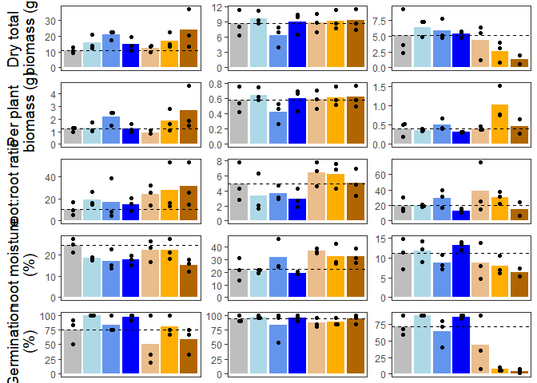<!-- -->

``` r
## extract just the legend (for final fig)
legend <- get_legend(
  plots.out[["dry_pod_weight"]] +
    theme(legend.position = "bottom"))
```

    ## Warning: Removed 1 row containing missing values or values outside the scale range
    ## (`geom_point()`).

``` r
## add a outline around plot
fig1.box <- ggdraw() +
  draw_plot(fig1, x = 0.02, y = 0.02, width = 0.96, height = 0.96) +
  theme_void() +
  theme(plot.background = element_rect(color = "black", 
                                       linewidth = 2, 
                                       fill = NA))
fig1.box
```

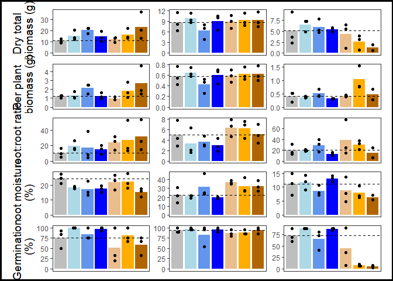<!-- -->

``` r
##### Raw data (peas only) #####

##### Infection by contaminant level (peas only) #####

## model 3: infection and contaminant level
direct.f <- direct %>%
         filter(species == "pea" & amend == "BS") %>%
  droplevels(.)

### means
df.means <- direct.f %>% 
  group_by(spikeFac) %>%
  summarize(mean = mean(infected_peas_perc, 
                        na.rm = TRUE))

## plot
M3_plot <- ggplot(df.means,
                  aes(x = spikeFac, y = mean)) +
    geom_bar(aes(fill = spikeFac),
             stat = "identity") +
    geom_beeswarm(data = direct.f,
                  aes(y = infected_peas_perc)) +
    scale_fill_manual(values = c("#EABD8C",
                                 "#FFAD00",
                                 "#B06500")) +
    labs(x = "Contamination level", 
         y = "Infected (%)") +
    guides(fill = "none") +
    theme_bw() +
    theme(
      axis.text.x = element_text(size = 12),
      axis.title.x = element_text(size = 14),
      axis.text.y = element_text(size = 12),
      axis.title.y = element_text(size = 14),
      strip.text = element_text(size = 14, face = "bold"),
      panel.grid.major = element_blank(),
      panel.grid.minor = element_blank(),
    )
M3_plot
```

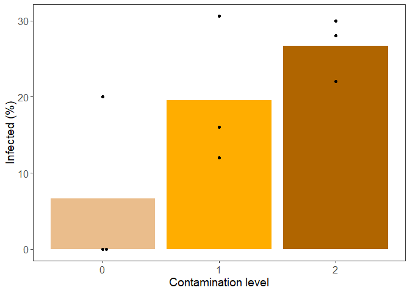<!-- -->

``` r
## model 4: infection and survival
##### Infection vs Survival (peas only) #####
M4_plot <- ggplot(direct %>%
         filter(species == "pea" & amend == "BS"),
       aes(x = infected_peas_perc, y = survival_perc)) +
  geom_smooth(method = "lm", colour = "black") +
  geom_point(aes(colour = spikeFac), size = 3) +
  scale_colour_manual(values = c("#EABD8C",
                                 "#FFAD00",
                                 "#B06500")) +
  labs(y = "Survival (%)", 
         x = "Infected (%)") +
    guides(colour = "none") +
    theme_bw() +
    theme(
      axis.text.x = element_text(size = 12),
      axis.title.x = element_text(size = 14),
      axis.text.y = element_text(size = 12),
      axis.title.y = element_text(size = 14),
      strip.text = element_text(size = 14, face = "bold"),
      panel.grid.major = element_blank(),
      panel.grid.minor = element_blank(),
    )
M4_plot
```

    ## `geom_smooth()` using formula = 'y ~ x'

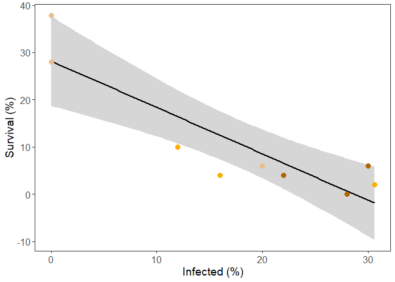<!-- -->

``` r
## plot grid for just the pea traits
peas_top <- plot_grid(
  plots.out[["dry_pod_weight"]] + ## TL 
    labs(y = "Dry pod weight (g)"),
   plots.out[["per_pod_weight"]] + ## TL 
    labs(y = "Per pod weight (g)"),
 plots.out[["pods"]] + ## TR
    labs(y = "Pods (no.)"),
  plots.out[["flowers"]] + ## ML
    labs(y = "Flowers (no.)"), 
    M3_plot,
    M4_plot,
  ncol = 2,
  nrow = 3,
  align = "hv",
  axis = "tblr",
  labels = NULL)
```

    ## Warning: Removed 1 row containing missing values or values outside the scale range
    ## (`geom_point()`).

    ## Warning: Removed 2 rows containing missing values or values outside the scale range
    ## (`geom_point()`).

    ## Warning: Removed 1 row containing missing values or values outside the scale range
    ## (`geom_point()`).
    ## Removed 1 row containing missing values or values outside the scale range
    ## (`geom_point()`).

    ## `geom_smooth()` using formula = 'y ~ x'

``` r
peas_top
```

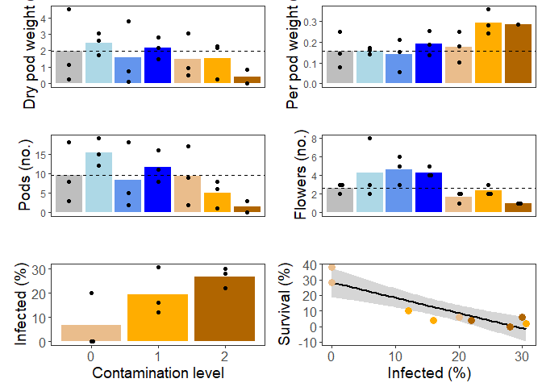<!-- -->

``` r
## put the legend along the bottom
legend_bottom <- plot_grid(legend, ncol = 1)
legend_bottom
```

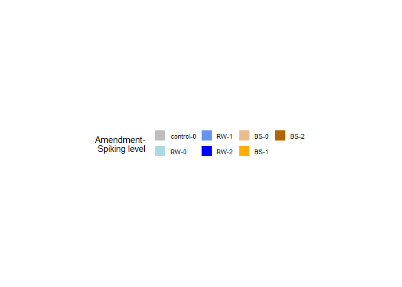<!-- -->

``` r
## put them together
fig_peas <- plot_grid(
  peas_top,
  legend_bottom,
  nrow = 2,
  ncol = 1,
  rel_heights = c(1, 0.1),
  align = "v"
)
fig_peas
```

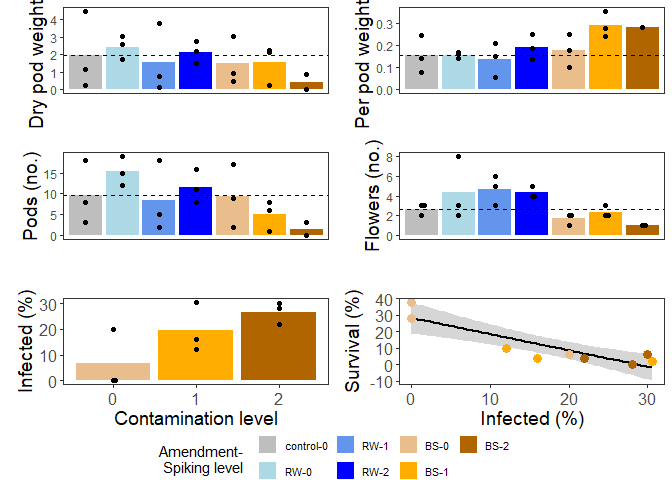<!-- -->

``` r
## add an outline around fig
fig_peas.box <- ggdraw() +
  draw_plot(fig_peas, x = 0.02, y = 0.02, width = 0.96, height = 0.96) +
  theme_void() +
  theme(plot.background = element_rect(color = "black", 
                                       linewidth = 2, 
                                       fill = NA))
fig_peas.box
```

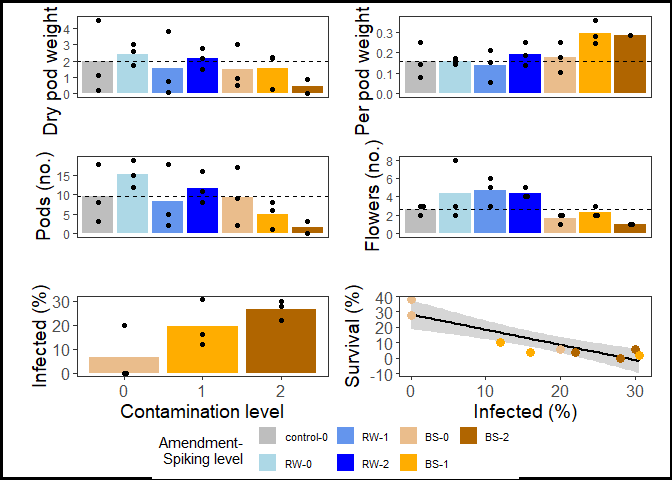<!-- -->

``` r
## plot grid for all traits
fig_all <- plot_grid(
          fig1.box, 
          fig_peas.box,
          ncol = 2,
          rel_widths = c(1, 1),
          align = "hv",
          axis = "tblr",
          labels = NULL)
fig_all
```

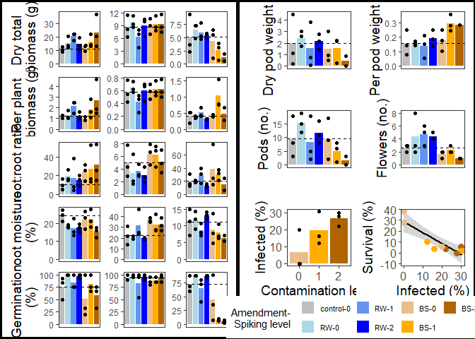<!-- -->

``` r
## add titles for each column (to specify species)

# Create a row of subtitles

# Create a row of four subtitles
x_coords <- seq(1/12, 11/12, length.out = 6)
subtitle_row <- ggdraw() +
  draw_label("Lettuce", x = x_coords[[1]] + 0.04, y = 0.5, 
             hjust = 0.5, size = 14, fontface = "bold") +
  draw_label("Radish", x = x_coords[[2]] + 0.02, y = 0.5, 
             hjust = 0.5, size = 14, fontface = "bold") +
  draw_label("Pea", x = x_coords[[3]], y = 0.5, 
             hjust = 0.5, size = 14, fontface = "bold") +
  draw_label("Pea", x = x_coords[[5]], y = 0.5, 
             hjust = 0.5, size = 14, fontface = "bold")

# Combine subtitle row and main panel
final_plot <- plot_grid(
  subtitle_row,
  fig_all,
  ncol = 1,
  rel_heights = c(0.02, 1)
)
final_plot
```

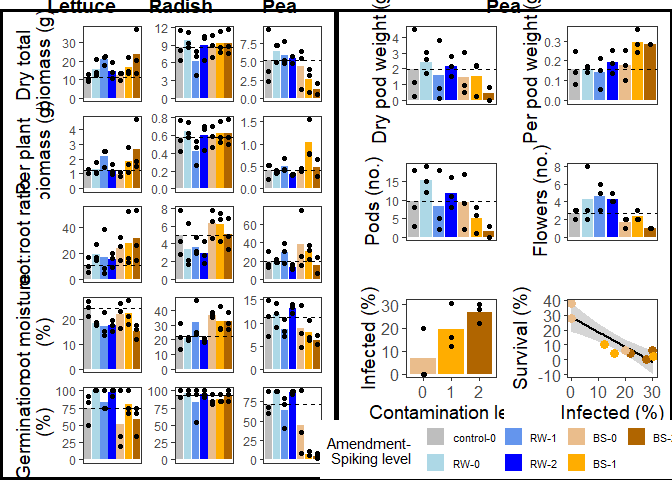<!-- -->

``` r
## save
ggsave("./direct_files/figs/Fig1-direct.png", 
       width = 10, height = 8, 
       units = "in")
```

#### Post-hoc tests (supplementary figs)

``` r
## figures (contrasts)
load(file = "./direct_files/models/cont1-species.vs.amend.Rdata") ## loads cont

## formatting
cont$amend <- ifelse(grepl("BS", cont$contrast, fixed = FALSE),
                      "BS", "RW")

cont$amend <- factor(cont$amend,
                      levels = c("RW",
                                 "BS"))

### sig traits
sig.traits <- c("dry_total_weight",
                "per_plant_weight",
                "shoot_root_ratio",
                "shoot_moisture",
                "survival_perc.corr"
                #"germination_perc"
                )

### filter dataset to sig traits
cont.f <- cont %>%
         filter(trait %in% sig.traits) %>%
         droplevels(.)

cont.f$trait <- factor(cont.f$trait,
          levels = c(#"dry_shoot_weight","dry_root_weight",
                "dry_total_weight",
                "per_plant_weight",
                "shoot_root_ratio",
                "shoot_moisture",
                "survival_perc.corr"
                #"germination_perc"
                ))

### rename traits
trait_names <- c(
  per_plant_weight = 'Per plant \n biomass (g)',
  dry_shoot_weight = 'Dry shoot \n biomass (g)',
  dry_total_weight = 'Dry total \n biomass (g)',
  dry_root_weight = 'Dry root \n biomass (g)',
  shoot_root_ratio = 'Shoot to \n root ratio',
  shoot_moisture = 'Shoot \n moisture \n (%)',
  germination_perc = 'Germination \n (%)',
  survival_perc.corr = 'Survival \n (%)',
  pods = "Pods (no.)"
)

species_names <- c(
  lettuce = 'Lettuce',
  pea = 'Pea',
  radish = 'Radish'
)

##### Contrasts (amendment type) #####
M1_plot <- ggplot(data = cont.f,
   aes(x = amend, 
       y = log2(ratio), 
       colour = amend)) +
  geom_pointrange(aes(ymin = log2(lower.CL),
                      ymax = log2(upper.CL)),
                  position = position_dodge(0.5)) +
  geom_hline(aes(yintercept = 0),
             linetype = 2) +
  ### add in significance (0.05 <= p < 0.1) 
  geom_text(
    data = cont.f %>% filter(pval >= 0.05 & pval < 0.1),
    aes(x = amend, y = log2FC),
    label = "+",
    size = 6,
    position = position_dodge(0.5),
    vjust = -0.5
  ) +
  ### add in significance (p < 0.05) 
  geom_text(
    data = cont.f %>% filter(pval < 0.05),
    aes(x = amend, y = log2FC),
    label = "*",
    size = 6,
    position = position_dodge(0.5),
    vjust = -0.3
  ) +
  coord_flip() +
   scale_colour_manual(values = c(
                                  "blue",
                                 "#B06500")) +
  facet_grid(trait~species, scales = "fixed",
             labeller = labeller(trait = trait_names,
                                 species = species_names)) +
  labs(x = "Amendment", y = expression(log[2]~"Fold Change (95% CL)")) +
  guides(colour = "none") +
  theme_bw() +
  theme(
    axis.text = element_text(size = 12),
    axis.title.x = element_text(size =  14),
    axis.title.y = element_text(size =  14),
    strip.text.y = element_blank(),
    strip.text.x = element_text(size = 12, face = "bold"),
    panel.grid.major = element_blank(),
    panel.grid.minor = element_blank(),
  )
M1_plot
```

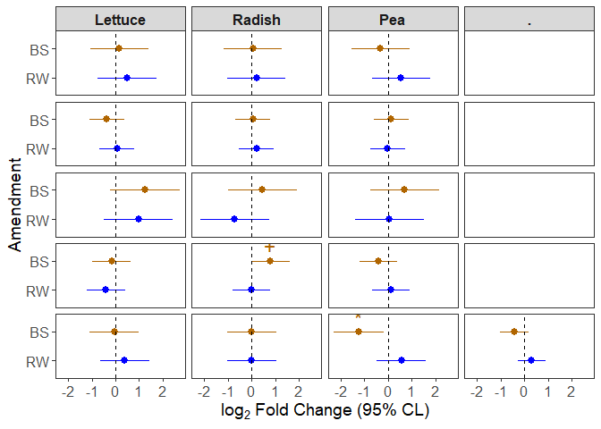<!-- -->

``` r
## M2

## emms (emmeans)
emms <- read_csv("./direct_files/models/emm2-species.vs.contam.csv")
```

    ## Rows: 132 Columns: 17
    ## ── Column specification ────────────────────────────────────────────────────────
    ## Delimiter: ","
    ## chr  (3): species, trait, amend
    ## dbl (14): spikeFac, emmean, SE, df, lower.CL, upper.CL, t.ratio, p.value, as...
    ## 
    ## ℹ Use `spec()` to retrieve the full column specification for this data.
    ## ℹ Specify the column types or set `show_col_types = FALSE` to quiet this message.

``` r
## linear contrasts (to get sig linear trends)
load(file = "./direct_files/models/cont2-species.vs.contam.Rdata")

## include non-linear & linear terms
cont.w <- cont %>%
  pivot_wider(
    names_from = contrast,
    values_from = c("Est_CL", "pval"),
    id_cols =  c("crop","amend","trait")
  )

## combine emms and contrasts
emms <- emms %>%
  left_join(
    cont.w %>% select(species = crop, everything()),
    by = c("species","amend","trait")
  )

## format
emms$amend <- factor(emms$amend,
                      levels = c("RW",
                                 "BS"))

emms$species <- ifelse(is.na(emms$species) == TRUE,
                       "pea", emms$species)
emms$species <- factor(emms$species,
                       levels = c("lettuce",
                                  "radish",
                                  "pea"))

### filter dataset to sig traits
emms.f <- emms %>%
         filter(trait %in% sig.traits) %>%
         droplevels(.)

## trait order
emms.f$trait <- factor(emms.f$trait,
          levels = c(
         "dry_total_weight",
                "per_plant_weight",
                "shoot_root_ratio",
                "shoot_moisture",
                "survival_perc.corr"
         #"germination_perc"
         ))

##### Contrasts (contamination level) #####
M2_plot <- ggplot(data = emms.f,
   aes(x = factor(spikeFac), 
       y = emmean, 
       colour = amend)) +
  geom_line(aes(group = amend),
            position = position_dodge(0.2)) +
  geom_pointrange(data = emms.f %>%
                    filter(trait != "pods"),
                           aes(ymin = lower.CL,
                      ymax = upper.CL),
                  position = position_dodge(0.2)) +
  geom_pointrange(data = emms.f %>%
                    filter(trait == "pods"),
                           aes(ymin = asymp.LCL,
                      ymax = asymp.UCL),
                  position = position_dodge(0.2)) +
  ### add in significance (0.05 <= p < 0.1) 
  geom_text(
    data = emms.f %>% filter(spikeFac == 2 &
                               pval_linear >= 0.05 & pval_linear < 0.1),
    aes(x = factor(spikeFac), y = emmean),
    label = "+",
    size = 6,
    position = position_dodge(0.5),
    vjust = -0.5
  ) +
  ### add in significance (p < 0.05) 
  geom_text(
    data = emms.f %>% filter(spikeFac == 2 &
                               pval_linear < 0.05),
    aes(x = factor(spikeFac), y = emmean),
    label = "*",
    size = 6,
    position = position_dodge(0.5),
    vjust = -0.5
  ) +
  ### add in significance (p < 0.05) - quadratic
  geom_text(
    data = emms.f %>% filter(spikeFac == 0 &
                               pval_quadratic < 0.05),
    aes(x = factor(spikeFac), y = emmean),
    label = "*",
    size = 6,
    position = position_dodge(0.5),
    vjust = -0.5
  ) +
  ### add in significance (p ms) - quadratic
  geom_text(
    data = emms.f %>% filter(spikeFac == 0 &
                               pval_quadratic >= 0.05 & pval_quadratic < 0.1),
    aes(x = factor(spikeFac), y = emmean),
    label = "+",
    size = 6,
    position = position_dodge(0.5),
    vjust = -0.5
  ) +
   scale_colour_manual(values = c(
                                  "blue",
                                 "#B06500")) +
  facet_grid(trait~species, scales = "fixed",
             labeller = labeller(trait = trait_names,
                                 species = species_names)) +
  labs(y = expression("EM mean (95% CL)"), 
       x = "Contaminant level") +
  guides(colour = "none") +
  theme_bw() +
  theme(
    axis.text = element_text(size = 12),
   axis.title.x = element_text(size =  14),
    axis.title.y = element_text(size =  14),
    strip.text = element_text(size = 12, face = "bold"),
    panel.grid.major = element_blank(),
    panel.grid.minor = element_blank(),
  )
M2_plot
```

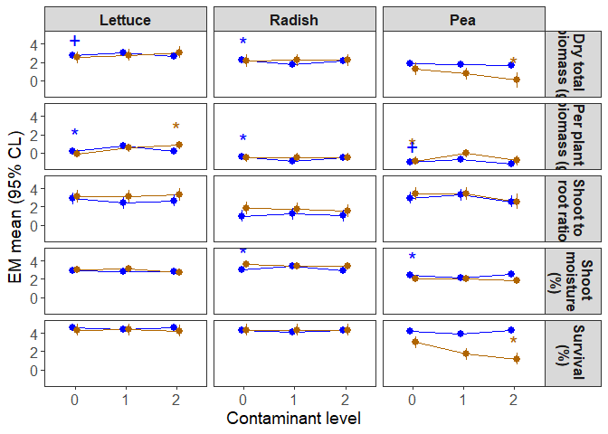<!-- -->

``` r
plots <- plot_grid(M1_plot, M2_plot,
                   ncol = 2,
                   rel_widths = c(0.8, 1),
                   align = "h",
                   labels = c("A","B"))
plots
```

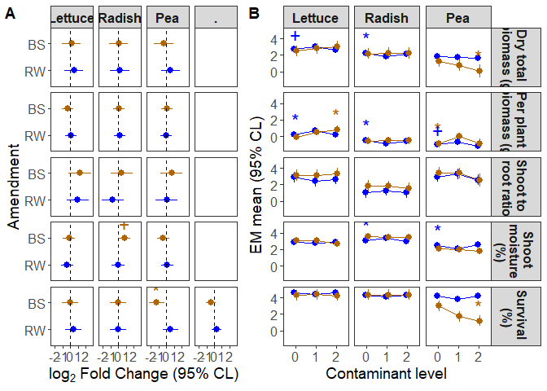<!-- -->

``` r
## save
ggsave("./direct_files/figs/plots-PHT.png", 
       width = 10, height = 6, 
       units = "in")
```
