Microbially-mediated (i.e., indirect) impacts of amendments and
contaminants
================
RTD, II
2026-01-31

## Soil slurry experiment

DESCRIPTION

### Load data

``` r
indirect <- read_csv("./raw_data/indirect.csv")
```

    ## Rows: 73 Columns: 51
    ## ── Column specification ────────────────────────────────────────────────────────
    ## Delimiter: ","
    ## chr (16): treatment, control, amend, t1, t2, t3, t4, leaf_num_notes, chlorop...
    ## dbl (32): plant_ID, num_seeds, num_plants, spiking_level, leaf_num, plant_he...
    ## lgl  (3): nitrogen_content, num_flower_time, num_pods
    ## 
    ## ℹ Use `spec()` to retrieve the full column specification for this data.
    ## ℹ Specify the column types or set `show_col_types = FALSE` to quiet this message.

``` r
## calculate other traits
indirect$dry_total_weight <- indirect$dry_shoot_weight + 
  indirect$dry_root_weight
indirect$shoot_root_ratio <- indirect$dry_shoot_weight / 
  indirect$dry_root_weight
indirect$shoot_moisture <- (indirect$wet_shoot_weight - 
                              indirect$dry_shoot_weight) / 
  indirect$dry_shoot_weight

## set factors

### relevel treatment
indirect$treatment <- as.factor(indirect$treatment)
indirect$treatment <- relevel(indirect$treatment, ref = "Saline Control")

### specify spiking level as an ordered factor
indirect$spikeFac <- factor(indirect$spiking_level,
                          levels = c("0","1","2"),
                          ordered = TRUE)

### rename source to be consistent with direct
indirect$amend <- factor(indirect$amend,
                        levels = c("no_treat",
                                   "saline",
                                   "control",
                                   "RW",
                                   "BS"
                        ))

### spiking level plus amend
indirect$amend_spike <- paste0(indirect$amend, 
                                "-", 
                                indirect$spiking_level)

### order factor
indirect$amend_spike <- factor(indirect$amend_spike, 
                                levels = c("saline-0",
                                           "no_treat-0",
                                           "control-0",
                                           "RW-0",
                                           "RW-1",
                                           "RW-2",
                                           "BS-0",
                                           "BS-1",
                                           "BS-2"
                                          ))


## save formatted data file
save(indirect, file = "./indirect_files/indirect-formatted.Rda")
```

### Trait correlations

Ensuring we are picking traits that are not highly correlated

``` r
## loaf formatted data file
load(file = "./indirect_files/indirect-formatted.Rda") ## loads indirect

## traits to run through
trait.list <- c(## non-destructive traits prior to harvest
                "plant_height1", 
                "plant_height2", 
                "plant_height3",
                "chlorophyll_content1_mean",
                "chlorophyll_content2_mean",
                "chlorophyll_content3_mean",
                "leaf_num",
                ## traits at harvest
                "plant_height4",
                "chlorophyll_content4_mean", 
                "leaf_num2",
                "wet_shoot_weight", 
                "dry_shoot_weight",
                "wet_root_weight", 
                "dry_root_weight",
                "dry_total_weight",
                "shoot_root_ratio",
                "shoot_moisture")

### select all traits
indirect_cols_df <- indirect[, trait.list]

## check correlations among traits
# Select numeric columns
numeric_cols <- indirect_cols_df %>%
  select(where(is.numeric))

# Impute missing values with column means
imputed_df <- numeric_cols %>%
  mutate(across(where(is.numeric),
                ~ ifelse(is.na(.), 
                         mean(., na.rm = TRUE), .)))

# Correlation matrix
cor_matrix <- cor(imputed_df, use = "pairwise.complete.obs")

# Plot heatmap
pheatmap(cor_matrix,
       color = colorRampPalette(c("blue", "white", "red"))(50),
       display_numbers = TRUE,
       cluster_rows = TRUE,
       cluster_cols = TRUE)
```

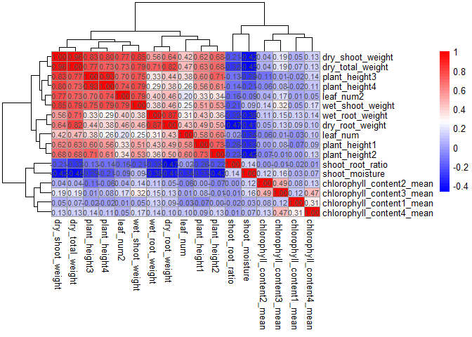<!-- -->

``` r
## remove highly correlated vars

# Find highly correlated variables
high_corr <- findCorrelation(cor_matrix, cutoff = 0.7)

# Remove them
reduced_traits <- numeric_cols[, -high_corr]

selected_traits <- names(reduced_traits)
## "plant_height1"             "chlorophyll_content1_mean" "chlorophyll_content2_mean"
## "chlorophyll_content3_mean" "leaf_num"                  "chlorophyll_content4_mean"
## "leaf_num2"                 "wet_root_weight"           "shoot_root_ratio"         
## "shoot_moisture"           

# Correlation matrix
cor_matrix <- cor(reduced_traits, use = "pairwise.complete.obs")

# Plot heatmap
pheatmap(cor_matrix,
       color = colorRampPalette(c("blue", "white", "red"))(50),
       display_numbers = TRUE,
       cluster_rows = TRUE,
       cluster_cols = TRUE)
```

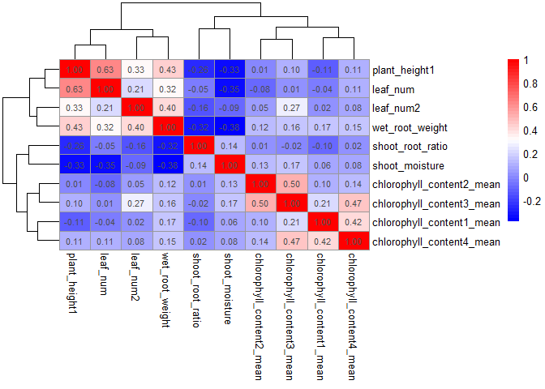<!-- -->

### Models

#### M1: emmeans for each trait and soil slurry

Impact of prior amendment type on pea traits. Exclude contaminants
Include controls (from prior experiment). No interactions.

NOTE: recommended by data lunch to calculate the geometric means from
the soil slurries, then input those in the model

``` r
## loaf formatted data file
load(file = "./indirect_files/indirect-formatted.Rda") ## loads indirect

## set contrasts
options(contrasts=c("contr.sum","contr.poly")) 

## traits to run through
trait.list <- c(## non-destructive traits prior to harvest
                "plant_height1", 
                "plant_height2", 
                "plant_height3",
                "chlorophyll_content1_mean",
                "chlorophyll_content2_mean",
                "chlorophyll_content3_mean",
                "leaf_num",
                ## traits at harvest
                "plant_height4",
                "chlorophyll_content4_mean", 
                "leaf_num2",
                "wet_shoot_weight", 
                "dry_shoot_weight",
                "wet_root_weight", 
                "dry_root_weight",
                "dry_total_weight",
                "shoot_root_ratio",
                "shoot_moisture")

## source function
source("./Source_code/14_indirect-mod_emmeans.func.R")

# Create output directory if it doesn't exist
## set output directory
output_dir <- "./indirect_files/models/"
if (!dir.exists(output_dir)) {
  dir.create(output_dir, recursive = TRUE)
}

mod.out <- sapply(trait.list, 
                   mod_indirect_emms,
                   df = indirect %>%
                     filter(treatment != "No treatment"),
                   simplify = FALSE, 
                   USE.NAMES = TRUE)
```

    ## [1] "plant_height1"

    ## 
    ## Call:
    ## lm(formula = log(get(traits)) ~ treatment, data = df)
    ## 
    ## Residuals:
    ##      Min       1Q   Median       3Q      Max 
    ## -0.63651 -0.06077  0.01285  0.12051  0.46210 
    ## 
    ## Coefficients:
    ##             Estimate Std. Error t value Pr(>|t|)    
    ## (Intercept)  1.91853    0.02830  67.799  < 2e-16 ***
    ## treatment1   0.02985    0.08858   0.337  0.73763    
    ## treatment2   0.17368    0.13131   1.323  0.19221    
    ## treatment3  -0.36721    0.13131  -2.796  0.00741 ** 
    ## treatment4   0.07189    0.13131   0.547  0.58659    
    ## treatment5   0.05038    0.13131   0.384  0.70294    
    ## treatment6  -0.58887    0.13131  -4.485 4.55e-05 ***
    ## treatment7   0.04350    0.13131   0.331  0.74186    
    ## treatment8   0.20523    0.13131   1.563  0.12465    
    ## treatment9  -0.01067    0.13131  -0.081  0.93558    
    ## treatment10  0.04071    0.13131   0.310  0.75786    
    ## treatment11 -0.17128    0.13131  -1.304  0.19832    
    ## treatment12  0.17866    0.13131   1.361  0.18000    
    ## treatment13 -0.13616    0.13131  -1.037  0.30496    
    ## treatment14  0.15715    0.13131   1.197  0.23728    
    ## treatment15  0.07189    0.13131   0.547  0.58659    
    ## treatment16  0.13415    0.13131   1.022  0.31209    
    ## treatment17  0.11640    0.13131   0.886  0.37980    
    ## treatment18 -0.18386    0.13131  -1.400  0.16788    
    ## treatment19  0.07018    0.13131   0.534  0.59547    
    ## treatment20 -0.13616    0.13131  -1.037  0.30496    
    ## treatment21  0.09489    0.13131   0.723  0.47342    
    ## ---
    ## Signif. codes:  0 '***' 0.001 '**' 0.01 '*' 0.05 '.' 0.1 ' ' 1
    ## 
    ## Residual standard error: 0.2329 on 48 degrees of freedom
    ## Multiple R-squared:  0.4793, Adjusted R-squared:  0.2514 
    ## F-statistic: 2.104 on 21 and 48 DF,  p-value: 0.01694

    ## Warning in ref_grid(lmm): There are unevaluated constants in the response formula
    ## Auto-detection of the response transformation may be incorrect

    ## [1] "plant_height2"

    ## 
    ## Call:
    ## lm(formula = log(get(traits)) ~ treatment, data = df)
    ## 
    ## Residuals:
    ##      Min       1Q   Median       3Q      Max 
    ## -0.72827 -0.07167  0.01967  0.07700  0.47571 
    ## 
    ## Coefficients:
    ##              Estimate Std. Error t value Pr(>|t|)    
    ## (Intercept)  2.269332   0.028104  80.748  < 2e-16 ***
    ## treatment1   0.113248   0.087980   1.287  0.20419    
    ## treatment2   0.197745   0.130414   1.516  0.13601    
    ## treatment3  -0.403191   0.130414  -3.092  0.00331 ** 
    ## treatment4   0.137703   0.130414   1.056  0.29630    
    ## treatment5   0.065023   0.130414   0.499  0.62034    
    ## treatment6  -0.442452   0.130414  -3.393  0.00139 ** 
    ## treatment7  -0.022098   0.130414  -0.169  0.86616    
    ## treatment8   0.111611   0.130414   0.856  0.39635    
    ## treatment9   0.085588   0.130414   0.656  0.51478    
    ## treatment10  0.119681   0.130414   0.918  0.36336    
    ## treatment11 -0.211403   0.130414  -1.621  0.11157    
    ## treatment12  0.142061   0.130414   1.089  0.28146    
    ## treatment13 -0.211403   0.130414  -1.621  0.11157    
    ## treatment14  0.096793   0.130414   0.742  0.46158    
    ## treatment15 -0.041128   0.130414  -0.315  0.75385    
    ## treatment16  0.171064   0.130414   1.312  0.19586    
    ## treatment17 -0.009358   0.130414  -0.072  0.94310    
    ## treatment18 -0.236266   0.130414  -1.812  0.07630 .  
    ## treatment19  0.016156   0.130414   0.124  0.90193    
    ## treatment20  0.143381   0.130414   1.099  0.27707    
    ## treatment21  0.079696   0.130414   0.611  0.54402    
    ## ---
    ## Signif. codes:  0 '***' 0.001 '**' 0.01 '*' 0.05 '.' 0.1 ' ' 1
    ## 
    ## Residual standard error: 0.2313 on 48 degrees of freedom
    ## Multiple R-squared:  0.459,  Adjusted R-squared:  0.2224 
    ## F-statistic:  1.94 on 21 and 48 DF,  p-value: 0.02943

    ## Warning in ref_grid(lmm): There are unevaluated constants in the response formula
    ## Auto-detection of the response transformation may be incorrect

    ## [1] "plant_height3"

    ## 
    ## Call:
    ## lm(formula = log(get(traits)) ~ treatment, data = df)
    ## 
    ## Residuals:
    ##      Min       1Q   Median       3Q      Max 
    ## -1.33854 -0.06951  0.00714  0.11153  0.70105 
    ## 
    ## Coefficients:
    ##             Estimate Std. Error t value Pr(>|t|)    
    ## (Intercept)  2.46452    0.04366  56.443  < 2e-16 ***
    ## treatment1   0.12858    0.13669   0.941  0.35158    
    ## treatment2   0.24207    0.20262   1.195  0.23807    
    ## treatment3  -0.61613    0.20262  -3.041  0.00382 ** 
    ## treatment4   0.17283    0.20262   0.853  0.39790    
    ## treatment5  -0.48413    0.20262  -2.389  0.02085 *  
    ## treatment6  -0.25866    0.20262  -1.277  0.20788    
    ## treatment7   0.12474    0.20262   0.616  0.54103    
    ## treatment8   0.20923    0.20262   1.033  0.30695    
    ## treatment9   0.19902    0.20262   0.982  0.33091    
    ## treatment10  0.13485    0.20262   0.666  0.50889    
    ## treatment11 -0.26484    0.20262  -1.307  0.19742    
    ## treatment12  0.18918    0.20262   0.934  0.35515    
    ## treatment13 -0.20144    0.20262  -0.994  0.32513    
    ## treatment14  0.21294    0.20262   1.051  0.29855    
    ## treatment15  0.01285    0.20262   0.063  0.94971    
    ## treatment16  0.19546    0.20262   0.965  0.33955    
    ## treatment17  0.21614    0.20262   1.067  0.29142    
    ## treatment18 -0.62738    0.20262  -3.096  0.00327 ** 
    ## treatment19  0.11826    0.20262   0.584  0.56217    
    ## treatment20  0.12559    0.20262   0.620  0.53830    
    ## treatment21  0.02858    0.20262   0.141  0.88842    
    ## ---
    ## Signif. codes:  0 '***' 0.001 '**' 0.01 '*' 0.05 '.' 0.1 ' ' 1
    ## 
    ## Residual standard error: 0.3594 on 48 degrees of freedom
    ## Multiple R-squared:  0.4432, Adjusted R-squared:  0.1996 
    ## F-statistic: 1.819 on 21 and 48 DF,  p-value: 0.04394

    ## Warning in ref_grid(lmm): There are unevaluated constants in the response formula
    ## Auto-detection of the response transformation may be incorrect

    ## [1] "chlorophyll_content1_mean"

    ## Warning: not plotting observations with leverage one:
    ##   5, 6, 10, 14, 20, 32

    ## 
    ## Call:
    ## lm(formula = log(get(traits)) ~ treatment, data = df)
    ## 
    ## Residuals:
    ##      Min       1Q   Median       3Q      Max 
    ## -0.21232 -0.01429  0.00000  0.01983  0.19590 
    ## 
    ## Coefficients:
    ##              Estimate Std. Error t value Pr(>|t|)    
    ## (Intercept) -0.271649   0.015168 -17.910 5.29e-15 ***
    ## treatment1   0.008881   0.044917   0.198   0.8450    
    ## treatment2   0.020169   0.051122   0.395   0.6968    
    ## treatment3  -0.015411   0.085908  -0.179   0.8592    
    ## treatment4  -0.005999   0.051122  -0.117   0.9076    
    ## treatment5   0.038101   0.051122   0.745   0.4636    
    ## treatment6   0.011785   0.051122   0.231   0.8197    
    ## treatment7   0.030272   0.061685   0.491   0.6283    
    ## treatment8   0.034449   0.085908   0.401   0.6921    
    ## treatment9   0.040768   0.085908   0.475   0.6396    
    ## treatment10  0.031317   0.085908   0.365   0.7188    
    ## treatment11  0.012274   0.051122   0.240   0.8124    
    ## treatment12 -0.089169   0.061685  -1.446   0.1618    
    ## treatment13 -0.138315   0.061685  -2.242   0.0349 *  
    ## treatment14  0.061360   0.061685   0.995   0.3302    
    ## treatment15  0.029681   0.051122   0.581   0.5672    
    ## treatment16 -0.130741   0.051122  -2.557   0.0176 *  
    ## treatment17  0.021115   0.061685   0.342   0.7352    
    ## treatment18  0.052033   0.061685   0.844   0.4076    
    ## treatment19  0.038329   0.085908   0.446   0.6596    
    ## ---
    ## Signif. codes:  0 '***' 0.001 '**' 0.01 '*' 0.05 '.' 0.1 ' ' 1
    ## 
    ## Residual standard error: 0.08913 on 23 degrees of freedom
    ##   (27 observations deleted due to missingness)
    ## Multiple R-squared:  0.4313, Adjusted R-squared:  -0.03848 
    ## F-statistic: 0.9181 on 19 and 23 DF,  p-value: 0.5708

    ## Warning in ref_grid(lmm): There are unevaluated constants in the response formula
    ## Auto-detection of the response transformation may be incorrect

    ## [1] "chlorophyll_content2_mean"

    ## Warning: not plotting observations with leverage one:
    ##   49

    ## 
    ## Call:
    ## lm(formula = log(get(traits)) ~ treatment, data = df)
    ## 
    ## Residuals:
    ##       Min        1Q    Median        3Q       Max 
    ## -0.039078 -0.009400 -0.001493  0.010926  0.038804 
    ## 
    ## Coefficients:
    ##              Estimate Std. Error t value Pr(>|t|)    
    ## (Intercept) -0.267766   0.002805 -95.458  < 2e-16 ***
    ## treatment1  -0.017156   0.008209  -2.090  0.04258 *  
    ## treatment2  -0.003035   0.012114  -0.251  0.80334    
    ## treatment3   0.006878   0.020604   0.334  0.74014    
    ## treatment4  -0.012921   0.012114  -1.067  0.29209    
    ## treatment5   0.033836   0.012114   2.793  0.00776 ** 
    ## treatment6  -0.018231   0.014703  -1.240  0.22173    
    ## treatment7  -0.029001   0.012114  -2.394  0.02110 *  
    ## treatment8  -0.011885   0.012114  -0.981  0.33203    
    ## treatment9   0.023308   0.012114   1.924  0.06099 .  
    ## treatment10 -0.004562   0.012114  -0.377  0.70831    
    ## treatment11  0.024772   0.014703   1.685  0.09927 .  
    ## treatment12 -0.008322   0.012114  -0.687  0.49578    
    ## treatment13  0.019150   0.012114   1.581  0.12125    
    ## treatment14 -0.015670   0.012114  -1.294  0.20272    
    ## treatment15  0.003271   0.012114   0.270  0.78844    
    ## treatment16 -0.004092   0.012114  -0.338  0.73717    
    ## treatment17  0.015649   0.012114   1.292  0.20334    
    ## treatment18  0.021221   0.014703   1.443  0.15618    
    ## treatment19  0.007552   0.012114   0.623  0.53632    
    ## treatment20 -0.017845   0.012114  -1.473  0.14801    
    ## treatment21 -0.010610   0.012114  -0.876  0.38598    
    ## ---
    ## Signif. codes:  0 '***' 0.001 '**' 0.01 '*' 0.05 '.' 0.1 ' ' 1
    ## 
    ## Residual standard error: 0.02141 on 43 degrees of freedom
    ##   (5 observations deleted due to missingness)
    ## Multiple R-squared:  0.4726, Adjusted R-squared:  0.215 
    ## F-statistic: 1.835 on 21 and 43 DF,  p-value: 0.04577

    ## Warning in ref_grid(lmm): There are unevaluated constants in the response formula
    ## Auto-detection of the response transformation may be incorrect

    ## [1] "chlorophyll_content3_mean"

    ## Warning: not plotting observations with leverage one:
    ##   45

    ## 
    ## Call:
    ## lm(formula = log(get(traits)) ~ treatment, data = df)
    ## 
    ## Residuals:
    ##       Min        1Q    Median        3Q       Max 
    ## -0.182199 -0.019277  0.000872  0.022204  0.074681 
    ## 
    ## Coefficients:
    ##              Estimate Std. Error t value Pr(>|t|)    
    ## (Intercept) -0.296460   0.006264 -47.330   <2e-16 ***
    ## treatment1  -0.024805   0.018044  -1.375    0.177    
    ## treatment2   0.005791   0.026597   0.218    0.829    
    ## treatment3   0.008952   0.026597   0.337    0.738    
    ## treatment4   0.043716   0.032272   1.355    0.183    
    ## treatment5   0.002907   0.032272   0.090    0.929    
    ## treatment6  -0.009132   0.026597  -0.343    0.733    
    ## treatment7  -0.024480   0.026597  -0.920    0.363    
    ## treatment8   0.010706   0.026597   0.403    0.689    
    ## treatment9  -0.022588   0.026597  -0.849    0.401    
    ## treatment10  0.029151   0.026597   1.096    0.279    
    ## treatment11 -0.019492   0.026597  -0.733    0.468    
    ## treatment12 -0.030794   0.026597  -1.158    0.253    
    ## treatment13  0.006378   0.026597   0.240    0.812    
    ## treatment14  0.010508   0.026597   0.395    0.695    
    ## treatment15 -0.017891   0.026597  -0.673    0.505    
    ## treatment16  0.008161   0.026597   0.307    0.760    
    ## treatment17  0.040535   0.045208   0.897    0.375    
    ## treatment18 -0.001356   0.026597  -0.051    0.960    
    ## treatment19 -0.013133   0.026597  -0.494    0.624    
    ## treatment20 -0.012477   0.026597  -0.469    0.641    
    ## ---
    ## Signif. codes:  0 '***' 0.001 '**' 0.01 '*' 0.05 '.' 0.1 ' ' 1
    ## 
    ## Residual standard error: 0.04707 on 42 degrees of freedom
    ##   (7 observations deleted due to missingness)
    ## Multiple R-squared:  0.1957, Adjusted R-squared:  -0.1874 
    ## F-statistic: 0.5108 on 20 and 42 DF,  p-value: 0.9463

    ## Warning in ref_grid(lmm): There are unevaluated constants in the response formula
    ## Auto-detection of the response transformation may be incorrect

    ## [1] "leaf_num"

    ## 
    ## Call:
    ## glm(formula = form, family = poisson(link = "log"), data = df)
    ## 
    ## Coefficients:
    ##             Estimate Std. Error z value Pr(>|z|)    
    ## (Intercept)  1.36096    0.06202  21.943   <2e-16 ***
    ## treatment1   0.21458    0.18760   1.144    0.253    
    ## treatment2   0.02533    0.28214   0.090    0.928    
    ## treatment3  -0.26235    0.32381  -0.810    0.418    
    ## treatment4   0.17948    0.26226   0.684    0.494    
    ## treatment5   0.10538    0.27162   0.388    0.698    
    ## treatment6  -0.15699    0.30782  -0.510    0.610    
    ## treatment7  -0.06168    0.29409  -0.210    0.834    
    ## treatment8   0.02533    0.28214   0.090    0.928    
    ## treatment9  -0.26235    0.32382  -0.810    0.418    
    ## treatment10  0.02533    0.28214   0.090    0.928    
    ## treatment11 -0.15699    0.30782  -0.510    0.610    
    ## treatment12  0.17948    0.26226   0.684    0.494    
    ## treatment13 -0.06168    0.29409  -0.210    0.834    
    ## treatment14  0.02533    0.28214   0.090    0.928    
    ## treatment15 -0.06168    0.29409  -0.210    0.834    
    ## treatment16  0.02533    0.28214   0.090    0.928    
    ## treatment17  0.10538    0.27162   0.388    0.698    
    ## treatment18 -0.06168    0.29409  -0.210    0.834    
    ## treatment19  0.02533    0.28214   0.090    0.928    
    ## treatment20 -0.06168    0.29409  -0.210    0.834    
    ## treatment21  0.10538    0.27162   0.388    0.698    
    ## ---
    ## Signif. codes:  0 '***' 0.001 '**' 0.01 '*' 0.05 '.' 0.1 ' ' 1
    ## 
    ## (Dispersion parameter for poisson family taken to be 1)
    ## 
    ##     Null deviance: 13.4660  on 68  degrees of freedom
    ## Residual deviance:  8.7682  on 47  degrees of freedom
    ##   (1 observation deleted due to missingness)
    ## AIC: 275.82
    ## 
    ## Number of Fisher Scoring iterations: 4
    ## 
    ## [1] "plant_height4"

    ## 
    ## Call:
    ## lm(formula = log(get(traits)) ~ treatment, data = df)
    ## 
    ## Residuals:
    ##      Min       1Q   Median       3Q      Max 
    ## -0.96957 -0.06594  0.01178  0.09327  0.63986 
    ## 
    ## Coefficients:
    ##             Estimate Std. Error t value Pr(>|t|)    
    ## (Intercept)  2.58801    0.03612  71.645  < 2e-16 ***
    ## treatment1   0.08871    0.11308   0.784 0.436630    
    ## treatment2   0.24404    0.16762   1.456 0.151932    
    ## treatment3  -0.51983    0.16762  -3.101 0.003224 ** 
    ## treatment4   0.10643    0.16762   0.635 0.528493    
    ## treatment5  -0.36654    0.16762  -2.187 0.033671 *  
    ## treatment6  -0.25245    0.16762  -1.506 0.138611    
    ## treatment7   0.14969    0.16762   0.893 0.376310    
    ## treatment8   0.18223    0.16762   1.087 0.282417    
    ## treatment9   0.25052    0.16762   1.495 0.141588    
    ## treatment10  0.06993    0.16762   0.417 0.678387    
    ## treatment11 -0.16913    0.16762  -1.009 0.318042    
    ## treatment12  0.23525    0.16762   1.403 0.166927    
    ## treatment13 -0.10733    0.16762  -0.640 0.525025    
    ## treatment14  0.18327    0.16762   1.093 0.279703    
    ## treatment15  0.04934    0.16762   0.294 0.769769    
    ## treatment16  0.09420    0.16762   0.562 0.576769    
    ## treatment17  0.18958    0.16762   1.131 0.263677    
    ## treatment18 -0.69949    0.16762  -4.173 0.000126 ***
    ## treatment19  0.01422    0.16762   0.085 0.932756    
    ## treatment20  0.12881    0.16762   0.768 0.445993    
    ## treatment21 -0.04412    0.16762  -0.263 0.793506    
    ## ---
    ## Signif. codes:  0 '***' 0.001 '**' 0.01 '*' 0.05 '.' 0.1 ' ' 1
    ## 
    ## Residual standard error: 0.2974 on 48 degrees of freedom
    ## Multiple R-squared:  0.4964, Adjusted R-squared:  0.2761 
    ## F-statistic: 2.253 on 21 and 48 DF,  p-value: 0.01022

    ## Warning in ref_grid(lmm): There are unevaluated constants in the response formula
    ## Auto-detection of the response transformation may be incorrect

    ## [1] "chlorophyll_content4_mean"

    ## Warning: not plotting observations with leverage one:
    ##   46

    ## 
    ## Call:
    ## lm(formula = log(get(traits)) ~ treatment, data = df)
    ## 
    ## Residuals:
    ##      Min       1Q   Median       3Q      Max 
    ## -0.11609 -0.02994  0.00000  0.03166  0.08810 
    ## 
    ## Coefficients:
    ##              Estimate Std. Error t value Pr(>|t|)    
    ## (Intercept) -0.344233   0.006947 -49.553  < 2e-16 ***
    ## treatment1   0.016093   0.020330   0.792 0.432934    
    ## treatment2   0.023102   0.030000   0.770 0.445469    
    ## treatment3  -0.006057   0.036413  -0.166 0.868663    
    ## treatment4   0.009440   0.030000   0.315 0.754545    
    ## treatment5   0.053101   0.036413   1.458 0.152021    
    ## treatment6   0.024293   0.036413   0.667 0.508234    
    ## treatment7   0.007109   0.030000   0.237 0.813817    
    ## treatment8  -0.026408   0.030000  -0.880 0.383618    
    ## treatment9   0.006747   0.030000   0.225 0.823136    
    ## treatment10  0.009749   0.030000   0.325 0.746780    
    ## treatment11 -0.065443   0.030000  -2.181 0.034668 *  
    ## treatment12 -0.033599   0.030000  -1.120 0.268951    
    ## treatment13 -0.112230   0.030000  -3.741 0.000538 ***
    ## treatment14  0.005859   0.030000   0.195 0.846081    
    ## treatment15  0.019633   0.030000   0.654 0.516324    
    ## treatment16 -0.006255   0.030000  -0.209 0.835816    
    ## treatment17 -0.028401   0.030000  -0.947 0.349088    
    ## treatment18  0.034987   0.051025   0.686 0.496590    
    ## treatment19  0.028218   0.030000   0.941 0.352176    
    ## treatment20  0.021138   0.030000   0.705 0.484858    
    ## treatment21 -0.016223   0.030000  -0.541 0.591469    
    ## ---
    ## Signif. codes:  0 '***' 0.001 '**' 0.01 '*' 0.05 '.' 0.1 ' ' 1
    ## 
    ## Residual standard error: 0.05302 on 43 degrees of freedom
    ##   (5 observations deleted due to missingness)
    ## Multiple R-squared:  0.3995, Adjusted R-squared:  0.1063 
    ## F-statistic: 1.362 on 21 and 43 DF,  p-value: 0.1919

    ## Warning in ref_grid(lmm): There are unevaluated constants in the response formula
    ## Auto-detection of the response transformation may be incorrect

    ## [1] "leaf_num2"

    ## 
    ## Call:
    ## glm(formula = form, family = poisson(link = "log"), data = df)
    ## 
    ## Coefficients:
    ##              Estimate Std. Error z value Pr(>|z|)    
    ## (Intercept)  2.114070   0.042484  49.762   <2e-16 ***
    ## treatment1   0.017557   0.131199   0.134   0.8935    
    ## treatment2   0.154613   0.182079   0.849   0.3958    
    ## treatment3  -0.440094   0.242120  -1.818   0.0691 .  
    ## treatment4   0.045414   0.191755   0.237   0.8128    
    ## treatment5  -0.216950   0.217386  -0.998   0.3183    
    ## treatment6  -0.034629   0.199208  -0.174   0.8620    
    ## treatment7   0.083154   0.188348   0.441   0.6589    
    ## treatment8   0.006193   0.195368   0.032   0.9747    
    ## treatment9   0.045414   0.191755   0.237   0.8128    
    ## treatment10 -0.077188   0.203299  -0.380   0.7042    
    ## treatment11 -0.034629   0.199208  -0.174   0.8620    
    ## treatment12  0.083154   0.188348   0.441   0.6589    
    ## treatment13  0.154613   0.182079   0.849   0.3958    
    ## treatment14  0.188515   0.179187   1.052   0.2928    
    ## treatment15  0.083154   0.188348   0.441   0.6589    
    ## treatment16  0.006193   0.195368   0.032   0.9747    
    ## treatment17  0.006193   0.195368   0.032   0.9747    
    ## treatment18 -0.322311   0.228709  -1.409   0.1588    
    ## treatment19  0.006193   0.195368   0.032   0.9747    
    ## treatment20  0.045414   0.191755   0.237   0.8128    
    ## treatment21  0.045414   0.191755   0.237   0.8128    
    ## ---
    ## Signif. codes:  0 '***' 0.001 '**' 0.01 '*' 0.05 '.' 0.1 ' ' 1
    ## 
    ## (Dispersion parameter for poisson family taken to be 1)
    ## 
    ##     Null deviance: 34.070  on 69  degrees of freedom
    ## Residual deviance: 23.473  on 48  degrees of freedom
    ## AIC: 343.61
    ## 
    ## Number of Fisher Scoring iterations: 4
    ## 
    ## [1] "wet_shoot_weight"

    ## 
    ## Call:
    ## lm(formula = log(get(traits)) ~ treatment, data = df)
    ## 
    ## Residuals:
    ##      Min       1Q   Median       3Q      Max 
    ## -1.26852 -0.12952  0.02664  0.14479  0.97427 
    ## 
    ## Coefficients:
    ##             Estimate Std. Error t value Pr(>|t|)    
    ## (Intercept)  6.92290    0.05418 127.778  < 2e-16 ***
    ## treatment1   0.01575    0.16961   0.093  0.92640    
    ## treatment2   0.30499    0.25141   1.213  0.23102    
    ## treatment3  -0.69475    0.25141  -2.763  0.00809 ** 
    ## treatment4   0.01698    0.25141   0.068  0.94644    
    ## treatment5  -0.33089    0.25141  -1.316  0.19439    
    ## treatment6  -0.27669    0.25141  -1.101  0.27659    
    ## treatment7   0.20273    0.25141   0.806  0.42402    
    ## treatment8   0.18424    0.25141   0.733  0.46723    
    ## treatment9   0.23889    0.25141   0.950  0.34677    
    ## treatment10 -0.18658    0.25141  -0.742  0.46163    
    ## treatment11 -0.08482    0.25141  -0.337  0.73730    
    ## treatment12  0.17010    0.25141   0.677  0.50193    
    ## treatment13  0.12091    0.25141   0.481  0.63275    
    ## treatment14  0.15613    0.25141   0.621  0.53752    
    ## treatment15  0.37047    0.25141   1.474  0.14713    
    ## treatment16  0.02818    0.25141   0.112  0.91122    
    ## treatment17  0.22493    0.25141   0.895  0.37543    
    ## treatment18 -0.88119    0.25141  -3.505  0.00100 ** 
    ## treatment19  0.06709    0.25141   0.267  0.79072    
    ## treatment20  0.22631    0.25141   0.900  0.37253    
    ## treatment21 -0.07255    0.25141  -0.289  0.77414    
    ## ---
    ## Signif. codes:  0 '***' 0.001 '**' 0.01 '*' 0.05 '.' 0.1 ' ' 1
    ## 
    ## Residual standard error: 0.446 on 48 degrees of freedom
    ## Multiple R-squared:  0.3942, Adjusted R-squared:  0.1291 
    ## F-statistic: 1.487 on 21 and 48 DF,  p-value: 0.1276

    ## Warning in ref_grid(lmm): There are unevaluated constants in the response formula
    ## Auto-detection of the response transformation may be incorrect

    ## [1] "dry_shoot_weight"

    ## 
    ## Call:
    ## lm(formula = log(get(traits)) ~ treatment, data = df)
    ## 
    ## Residuals:
    ##      Min       1Q   Median       3Q      Max 
    ## -1.39363 -0.17484  0.04001  0.22168  0.86211 
    ## 
    ## Coefficients:
    ##             Estimate Std. Error t value Pr(>|t|)    
    ## (Intercept)  4.74072    0.05641  84.044  < 2e-16 ***
    ## treatment1   0.09375    0.17658   0.531  0.59794    
    ## treatment2   0.34133    0.26175   1.304  0.19845    
    ## treatment3  -0.82915    0.26175  -3.168  0.00267 ** 
    ## treatment4   0.26976    0.26175   1.031  0.30790    
    ## treatment5  -0.37156    0.26175  -1.420  0.16221    
    ## treatment6  -0.39333    0.26175  -1.503  0.13947    
    ## treatment7   0.21102    0.26175   0.806  0.42411    
    ## treatment8   0.22680    0.26175   0.866  0.39055    
    ## treatment9   0.16758    0.26175   0.640  0.52507    
    ## treatment10 -0.02624    0.26175  -0.100  0.92056    
    ## treatment11 -0.08294    0.26175  -0.317  0.75273    
    ## treatment12  0.14838    0.26175   0.567  0.57344    
    ## treatment13  0.04510    0.26175   0.172  0.86392    
    ## treatment14  0.21278    0.26175   0.813  0.42028    
    ## treatment15 -0.02436    0.26175  -0.093  0.92624    
    ## treatment16  0.16512    0.26175   0.631  0.53114    
    ## treatment17  0.21726    0.26175   0.830  0.41063    
    ## treatment18 -0.85789    0.26175  -3.277  0.00195 ** 
    ## treatment19  0.07113    0.26175   0.272  0.78699    
    ## treatment20  0.26354    0.26175   1.007  0.31907    
    ## treatment21 -0.07484    0.26175  -0.286  0.77616    
    ## ---
    ## Signif. codes:  0 '***' 0.001 '**' 0.01 '*' 0.05 '.' 0.1 ' ' 1
    ## 
    ## Residual standard error: 0.4643 on 48 degrees of freedom
    ## Multiple R-squared:  0.4034, Adjusted R-squared:  0.1424 
    ## F-statistic: 1.546 on 21 and 48 DF,  p-value: 0.1063

    ## Warning in ref_grid(lmm): There are unevaluated constants in the response formula
    ## Auto-detection of the response transformation may be incorrect

    ## [1] "wet_root_weight"

    ## 
    ## Call:
    ## lm(formula = log(get(traits)) ~ treatment, data = df)
    ## 
    ## Residuals:
    ##     Min      1Q  Median      3Q     Max 
    ## -2.7330 -0.4111  0.1398  0.5745  1.9313 
    ## 
    ## Coefficients:
    ##             Estimate Std. Error t value Pr(>|t|)    
    ## (Intercept)  5.75209    0.12061  47.690   <2e-16 ***
    ## treatment1   0.34006    0.37758   0.901   0.3723    
    ## treatment2   0.27885    0.55970   0.498   0.6206    
    ## treatment3  -1.32157    0.55970  -2.361   0.0223 *  
    ## treatment4   0.15064    0.55970   0.269   0.7890    
    ## treatment5   0.70008    0.55970   1.251   0.2171    
    ## treatment6  -0.45024    0.55970  -0.804   0.4251    
    ## treatment7   0.52011    0.55970   0.929   0.3574    
    ## treatment8   0.43521    0.55970   0.778   0.4406    
    ## treatment9  -0.01827    0.55970  -0.033   0.9741    
    ## treatment10 -1.13199    0.55970  -2.023   0.0487 *  
    ## treatment11  0.16412    0.55970   0.293   0.7706    
    ## treatment12 -1.15037    0.55970  -2.055   0.0453 *  
    ## treatment13  0.37325    0.55970   0.667   0.5080    
    ## treatment14  0.41133    0.55970   0.735   0.4660    
    ## treatment15 -0.06278    0.55970  -0.112   0.9112    
    ## treatment16  0.94833    0.55970   1.694   0.0967 .  
    ## treatment17  0.34768    0.55970   0.621   0.5374    
    ## treatment18 -0.92982    0.55970  -1.661   0.1032    
    ## treatment19  0.03244    0.55970   0.058   0.9540    
    ## treatment20  0.04305    0.55970   0.077   0.9390    
    ## treatment21 -0.24594    0.55970  -0.439   0.6623    
    ## ---
    ## Signif. codes:  0 '***' 0.001 '**' 0.01 '*' 0.05 '.' 0.1 ' ' 1
    ## 
    ## Residual standard error: 0.9928 on 48 degrees of freedom
    ## Multiple R-squared:  0.3495, Adjusted R-squared:  0.06489 
    ## F-statistic: 1.228 on 21 and 48 DF,  p-value: 0.2722

    ## Warning in ref_grid(lmm): There are unevaluated constants in the response formula
    ## Auto-detection of the response transformation may be incorrect

    ## [1] "dry_root_weight"

    ## 
    ## Call:
    ## lm(formula = log(get(traits)) ~ treatment, data = df)
    ## 
    ## Residuals:
    ##      Min       1Q   Median       3Q      Max 
    ## -1.48179 -0.18709 -0.00576  0.23381  1.06896 
    ## 
    ## Coefficients:
    ##             Estimate Std. Error t value Pr(>|t|)    
    ## (Intercept)  3.84899    0.05749  66.949   <2e-16 ***
    ## treatment1   0.29870    0.17998   1.660   0.1035    
    ## treatment2   0.16720    0.26678   0.627   0.5338    
    ## treatment3  -0.62711    0.26678  -2.351   0.0229 *  
    ## treatment4   0.17206    0.26678   0.645   0.5220    
    ## treatment5   0.38851    0.26678   1.456   0.1518    
    ## treatment6  -0.20004    0.26678  -0.750   0.4570    
    ## treatment7   0.19896    0.26678   0.746   0.4594    
    ## treatment8   0.13214    0.26678   0.495   0.6227    
    ## treatment9  -0.28103    0.26678  -1.053   0.2974    
    ## treatment10 -0.57544    0.26678  -2.157   0.0360 *  
    ## treatment11  0.10521    0.26678   0.394   0.6951    
    ## treatment12 -0.20110    0.26678  -0.754   0.4547    
    ## treatment13  0.02610    0.26678   0.098   0.9225    
    ## treatment14  0.12252    0.26678   0.459   0.6481    
    ## treatment15 -0.05565    0.26678  -0.209   0.8356    
    ## treatment16  0.44653    0.26678   1.674   0.1007    
    ## treatment17  0.09788    0.26678   0.367   0.7153    
    ## treatment18 -0.54014    0.26678  -2.025   0.0485 *  
    ## treatment19  0.17736    0.26678   0.665   0.5093    
    ## treatment20 -0.09729    0.26678  -0.365   0.7169    
    ## treatment21  0.04291    0.26678   0.161   0.8729    
    ## ---
    ## Signif. codes:  0 '***' 0.001 '**' 0.01 '*' 0.05 '.' 0.1 ' ' 1
    ## 
    ## Residual standard error: 0.4732 on 48 degrees of freedom
    ## Multiple R-squared:  0.3541, Adjusted R-squared:  0.07156 
    ## F-statistic: 1.253 on 21 and 48 DF,  p-value: 0.2539

    ## Warning in ref_grid(lmm): There are unevaluated constants in the response formula
    ## Auto-detection of the response transformation may be incorrect

    ## [1] "dry_total_weight"

    ## 
    ## Call:
    ## lm(formula = log(get(traits)) ~ treatment, data = df)
    ## 
    ## Residuals:
    ##      Min       1Q   Median       3Q      Max 
    ## -1.14028 -0.15826  0.04136  0.19305  0.82974 
    ## 
    ## Coefficients:
    ##              Estimate Std. Error t value Pr(>|t|)    
    ## (Intercept)  5.104403   0.048765 104.673  < 2e-16 ***
    ## treatment1   0.140772   0.152659   0.922  0.36107    
    ## treatment2   0.281616   0.226289   1.244  0.21936    
    ## treatment3  -0.786065   0.226289  -3.474  0.00110 ** 
    ## treatment4   0.225177   0.226289   0.995  0.32468    
    ## treatment5  -0.009591   0.226289  -0.042  0.96637    
    ## treatment6  -0.341158   0.226289  -1.508  0.13821    
    ## treatment7   0.193611   0.226289   0.856  0.39648    
    ## treatment8   0.186190   0.226289   0.823  0.41469    
    ## treatment9   0.045534   0.226289   0.201  0.84138    
    ## treatment10 -0.161396   0.226289  -0.713  0.47916    
    ## treatment11 -0.039639   0.226289  -0.175  0.86168    
    ## treatment12  0.043859   0.226289   0.194  0.84714    
    ## treatment13  0.020262   0.226289   0.090  0.92902    
    ## treatment14  0.169282   0.226289   0.748  0.45806    
    ## treatment15 -0.053155   0.226289  -0.235  0.81529    
    ## treatment16  0.237603   0.226289   1.050  0.29898    
    ## treatment17  0.167028   0.226289   0.738  0.46404    
    ## treatment18 -0.721049   0.226289  -3.186  0.00253 ** 
    ## treatment19  0.089203   0.226289   0.394  0.69518    
    ## treatment20  0.151740   0.226289   0.671  0.50572    
    ## treatment21 -0.046468   0.226289  -0.205  0.83817    
    ## ---
    ## Signif. codes:  0 '***' 0.001 '**' 0.01 '*' 0.05 '.' 0.1 ' ' 1
    ## 
    ## Residual standard error: 0.4014 on 48 degrees of freedom
    ## Multiple R-squared:  0.4009, Adjusted R-squared:  0.1387 
    ## F-statistic: 1.529 on 21 and 48 DF,  p-value: 0.112

    ## Warning in ref_grid(lmm): There are unevaluated constants in the response formula
    ## Auto-detection of the response transformation may be incorrect

    ## [1] "shoot_root_ratio"

    ## 
    ## Call:
    ## lm(formula = log(get(traits)) ~ treatment, data = df)
    ## 
    ## Residuals:
    ##      Min       1Q   Median       3Q      Max 
    ## -1.20965 -0.17157 -0.02213  0.19596  0.93392 
    ## 
    ## Coefficients:
    ##             Estimate Std. Error t value Pr(>|t|)    
    ## (Intercept)  0.89173    0.04762  18.725  < 2e-16 ***
    ## treatment1  -0.20495    0.14908  -1.375  0.17559    
    ## treatment2   0.17413    0.22099   0.788  0.43460    
    ## treatment3  -0.20204    0.22099  -0.914  0.36515    
    ## treatment4   0.09770    0.22099   0.442  0.66040    
    ## treatment5  -0.76007    0.22099  -3.439  0.00122 ** 
    ## treatment6  -0.19329    0.22099  -0.875  0.38611    
    ## treatment7   0.01206    0.22099   0.055  0.95670    
    ## treatment8   0.09466    0.22099   0.428  0.67032    
    ## treatment9   0.44861    0.22099   2.030  0.04792 *  
    ## treatment10  0.54920    0.22099   2.485  0.01649 *  
    ## treatment11 -0.18815    0.22099  -0.851  0.39878    
    ## treatment12  0.34948    0.22099   1.581  0.12034    
    ## treatment13  0.01901    0.22099   0.086  0.93182    
    ## treatment14  0.09026    0.22099   0.408  0.68477    
    ## treatment15  0.03129    0.22099   0.142  0.88800    
    ## treatment16 -0.28141    0.22099  -1.273  0.20901    
    ## treatment17  0.11939    0.22099   0.540  0.59154    
    ## treatment18 -0.31775    0.22099  -1.438  0.15696    
    ## treatment19 -0.10624    0.22099  -0.481  0.63289    
    ## treatment20  0.36083    0.22099   1.633  0.10905    
    ## treatment21 -0.11775    0.22099  -0.533  0.59661    
    ## ---
    ## Signif. codes:  0 '***' 0.001 '**' 0.01 '*' 0.05 '.' 0.1 ' ' 1
    ## 
    ## Residual standard error: 0.392 on 48 degrees of freedom
    ## Multiple R-squared:  0.4253, Adjusted R-squared:  0.1739 
    ## F-statistic: 1.692 on 21 and 48 DF,  p-value: 0.06671

    ## Warning in ref_grid(lmm): There are unevaluated constants in the response formula
    ## Auto-detection of the response transformation may be incorrect

    ## [1] "shoot_moisture"

    ## 
    ## Call:
    ## lm(formula = log(get(traits)) ~ treatment, data = df)
    ## 
    ## Residuals:
    ##      Min       1Q   Median       3Q      Max 
    ## -0.38807 -0.08253 -0.00302  0.07899  0.44619 
    ## 
    ## Coefficients:
    ##               Estimate Std. Error t value Pr(>|t|)    
    ## (Intercept)  2.0604140  0.0207485  99.304  < 2e-16 ***
    ## treatment1  -0.0866953  0.0649530  -1.335  0.18826    
    ## treatment2  -0.0394193  0.0962812  -0.409  0.68405    
    ## treatment3   0.1514050  0.0962812   1.573  0.12240    
    ## treatment4  -0.2879551  0.0962812  -2.991  0.00438 ** 
    ## treatment5   0.0472968  0.0962812   0.491  0.62550    
    ## treatment6   0.1325421  0.0962812   1.377  0.17502    
    ## treatment7  -0.0077311  0.0962812  -0.080  0.93633    
    ## treatment8  -0.0460786  0.0962812  -0.479  0.63441    
    ## treatment9   0.0805368  0.0962812   0.836  0.40703    
    ## treatment10 -0.1815152  0.0962812  -1.885  0.06546 .  
    ## treatment11 -0.0002412  0.0962812  -0.003  0.99801    
    ## treatment12  0.0256850  0.0962812   0.267  0.79079    
    ## treatment13  0.0857057  0.0962812   0.890  0.37782    
    ## treatment14 -0.0620544  0.0962812  -0.645  0.52231    
    ## treatment15  0.4331439  0.0962812   4.499 4.34e-05 ***
    ## treatment16 -0.1542339  0.0962812  -1.602  0.11574    
    ## treatment17  0.0106469  0.0962812   0.111  0.91241    
    ## treatment18 -0.0288761  0.0962812  -0.300  0.76554    
    ## treatment19 -0.0038436  0.0962812  -0.040  0.96832    
    ## treatment20 -0.0429356  0.0962812  -0.446  0.65765    
    ## treatment21  0.0036286  0.0962812   0.038  0.97009    
    ## ---
    ## Signif. codes:  0 '***' 0.001 '**' 0.01 '*' 0.05 '.' 0.1 ' ' 1
    ## 
    ## Residual standard error: 0.1708 on 48 degrees of freedom
    ## Multiple R-squared:  0.4693, Adjusted R-squared:  0.2371 
    ## F-statistic: 2.021 on 21 and 48 DF,  p-value: 0.02238

    ## Warning in ref_grid(lmm): There are unevaluated constants in the response formula
    ## Auto-detection of the response transformation may be incorrect

``` r
### aovs
aov <- lapply(mod.out, `[[`, 1) %>%
  bind_rows(.)

### format
aov$pval <- ifelse(is.na(aov$`LR Chisq`) == FALSE, 
                   signif(aov$`Pr(>Chisq)`, 3),
                   signif(aov$`Pr(>F)`, 3))
aov$sig <- ifelse(aov$pval< 0.001, ", p < 0.001",
            ifelse(aov$pval < 0.01, paste0(", P = ", aov$pval, "**"),
            ifelse(aov$pval < 0.05, paste0(", P = ", aov$pval, "*"),
            ifelse(aov$pval < 0.1, paste0(", P = ", aov$pval, "."),
                               ", P > 0.1"))))
aov$stat <- ifelse(is.na(aov$`LR Chisq`) == FALSE, signif(aov$`LR Chisq`, 3),
                   signif(aov$`F value`, 3))

## pivot wider for each model term
aov.w <- aov %>%
  select(-c(`F value`,"Pr(>F)" ,"pval", "Sum Sq",
            "Pr(>Chisq)", "LR Chisq")) %>%
  pivot_wider(
    names_from = term,
    values_from = c(stat, Df, sig)
  ) ## 10 traits total, 10 rows

## formatting
aov.f <- aov.w %>%
  mutate(`Soil slurry` =  ifelse(aov.w$trait %in% c("leaf_num", "leaf_num2"),
                                 paste0("Chisq [", Df_treatment, ", ",
                                Df_Residuals, "] = ", stat_treatment,
                                sig_treatment),
                                 paste0("F [", Df_treatment, ", ",
                                Df_Residuals, "] = ", stat_treatment,
                                sig_treatment))
         ) %>%
  select(trait, `Soil slurry`)

### CONTRASTS
cont <- lapply(mod.out, `[[`, 3) %>%
  bind_rows(.)

## round pval
cont$pval <- signif(cont$p.value, 3)
### format
cont$sig <- ifelse(cont$p.value < 0.001, ", p < 0.001",
            ifelse(cont$p.value < 0.01, paste0(", P = ", cont$pval, "**"),
            ifelse(cont$p.value < 0.05, paste0(", P = ", cont$pval, "*"),
            ifelse(cont$p.value < 0.1, paste0(", P = ", cont$pval, "."),
                               ", P > 0.1"))))
## test stats
cont$stat <- ifelse(is.na(cont$z.ratio) == FALSE, 
                    paste0("z = ", signif(cont$z.ratio, 3)),
                     paste0("t = ", signif(cont$t.ratio, 3), 
                           ", df = , ", cont$df)
)

## estimates
cont$log2FC <- log2(cont$ratio)
cont$LCL <- ifelse(cont$trait == "leaf_num",
                   signif(log2(cont$asymp.LCL), 3),
                   signif(log2(cont$lower.CL), 3))
cont$UCL <- ifelse(cont$trait == "leaf_num",
                   signif(log2(cont$asymp.UCL), 3),
                   signif(log2(cont$upper.CL), 3))
cont$log2FC_CL <- paste0(signif(cont$log2FC, 3), " [",
                        cont$LCL," to ",
                        cont$UCL,"]")
## save as R data file
save(cont, file = paste0(output_dir, "cont1-slurry.means.Rdata"))

## save relevant output for table
cont.s <- cont %>%
  filter(p.value < 0.1) %>%
  mutate(
    contrast_info = paste0(contrast, ": ", 
                           stat, "; ", 
                           "log2FC [95% CL] = ", log2FC_CL)
    ) %>%
  select(trait, contrast_info) %>%
  group_by(trait) %>%
  summarize(
    sig_contrasts = paste(contrast_info, collapse = " | ")
    )

## add to anova
aov.f$sig_contrasts <- cont.s$sig_contrasts[match(aov.f$trait, cont.s$trait)] 
## save
write.csv(aov.f, paste0(output_dir, "aov1-slurry.means.csv"), 
          row.names = FALSE)
kable(aov.f)
```

| trait | Soil slurry | sig_contrasts |
|:---|:---|:---|
| plant_height1 | F \[21, 48\] = 2.1, P = 0.0169\* | (1US-RW-P) / Saline Control: t = -3.85, df = , 48; log2FC \[95% CL\] = -0.893 \[-1.61 to -0.177\] |
| plant_height2 | F \[21, 48\] = 1.94, P = 0.0294\* | (11SL1-RW-P) / Saline Control: t = -3.23, df = , 48; log2FC \[95% CL\] = -0.745 \[-1.46 to -0.0347\] \| (1US-RW-P) / Saline Control: t = -3.48, df = , 48; log2FC \[95% CL\] = -0.802 \[-1.51 to -0.0914\] |
| plant_height3 | F \[21, 48\] = 1.82, P = 0.0439\* | (11SL1-RW-P) / Saline Control: t = -3, df = , 48; log2FC \[95% CL\] = -1.07 \[-2.18 to 0.0293\] \| (47SL2-BS-P) / Saline Control: t = -3.05, df = , 48; log2FC \[95% CL\] = -1.09 \[-2.19 to 0.013\] |
| chlorophyll_content1_mean | F \[19, 23\] = 0.918, P \> 0.1 | NA |
| chlorophyll_content2_mean | F \[21, 43\] = 1.83, P = 0.0458\* | (19SL2-RW-P) / Saline Control: t = 3.45, df = , 43; log2FC \[95% CL\] = 0.0736 \[0.0075 to 0.14\] |
| chlorophyll_content3_mean | F \[20, 42\] = 0.511, P \> 0.1 | NA |
| leaf_num | Chisq \[21, NA\] = 4.7, P \> 0.1 | NA |
| plant_height4 | F \[21, 48\] = 2.25, P = 0.0102\* | (11SL1-RW-P) / Saline Control: t = -2.97, df = , 48; log2FC \[95% CL\] = -0.878 \[-1.79 to 0.0351\] \| (47SL2-BS-P) / Saline Control: t = -3.84, df = , 48; log2FC \[95% CL\] = -1.14 \[-2.05 to -0.224\] |
| chlorophyll_content4_mean | F \[21, 43\] = 1.36, P \> 0.1 | (37SL1-BS-P) / Saline Control: t = -3.51, df = , 43; log2FC \[95% CL\] = -0.185 \[-0.349 to -0.0215\] |
| leaf_num2 | Chisq \[21, NA\] = 10.6, P \> 0.1 | NA |
| wet_shoot_weight | F \[21, 48\] = 1.49, P \> 0.1 | (47SL2-BS-P) / Saline Control: t = -2.91, df = , 48; log2FC \[95% CL\] = -1.29 \[-2.66 to 0.0754\] |
| dry_shoot_weight | F \[21, 48\] = 1.55, P \> 0.1 | (11SL1-RW-P) / Saline Control: t = -2.88, df = , 48; log2FC \[95% CL\] = -1.33 \[-2.76 to 0.0943\] \| (47SL2-BS-P) / Saline Control: t = -2.97, df = , 48; log2FC \[95% CL\] = -1.37 \[-2.8 to 0.0528\] |
| wet_root_weight | F \[21, 48\] = 1.23, P \> 0.1 | NA |
| dry_root_weight | F \[21, 48\] = 1.25, P \> 0.1 | (11SL1-RW-P) / Saline Control: t = -2.83, df = , 48; log2FC \[95% CL\] = -1.34 \[-2.79 to 0.117\] |
| dry_total_weight | F \[21, 48\] = 1.53, P \> 0.1 | (11SL1-RW-P) / Saline Control: t = -3.35, df = , 48; log2FC \[95% CL\] = -1.34 \[-2.57 to -0.105\] \| (47SL2-BS-P) / Saline Control: t = -3.11, df = , 48; log2FC \[95% CL\] = -1.24 \[-2.48 to -0.0108\] |
| shoot_root_ratio | F \[21, 48\] = 1.69, P = 0.0667. | NA |
| shoot_moisture | F \[21, 48\] = 2.02, P = 0.0224\* | (39SL1-BS-P) / Saline Control: t = 4.41, df = , 48; log2FC \[95% CL\] = 0.75 \[0.226 to 1.27\] |

``` r
### emmeans
emm <- lapply(mod.out, `[[`, 2) %>%
  bind_rows(.)

## format response and rate
emm$emmean <- ifelse(is.na(emm$response) == TRUE,
                     emm$rate,
                     emm$response)
emm$LCL <- ifelse(is.na(emm$lower.CL) == TRUE,
                     emm$asymp.LCL,
                     emm$lower.CL)
emm$UCL <- ifelse(is.na(emm$upper.CL) == TRUE,
                     emm$asymp.UCL,
                     emm$upper.CL)
emm$stat <- ifelse(is.na(emm$t.ratio) == TRUE,
                     emm$z.ratio,
                     emm$t.ratio)

emm.s <- emm %>% ## get rid of extra cols
  select(-response, -rate, 
         -lower.CL, -upper.CL, 
         -asymp.LCL, -asymp.UCL,
         -t.ratio, -z.ratio)
## save
save(emm.s, file = paste0(output_dir, "emm1-slurry.means.Rda"))
write.csv(emm.s, paste0(output_dir, "emm1-slurry.means.csv"), 
          row.names = FALSE)

## plot contrasts

cont <- cont %>%
  mutate(sampleID = str_extract(cont$contrast, "(?<=\\().*?(?=\\))"),
         sampleID.c = ifelse(is.na(sampleID) == TRUE, "control", 
                             paste0(sampleID)),
         treat = str_remove(sampleID.c, "^\\d{1,2}"))

cont$treat <- factor(cont$treat, levels = c(
  "control",
  "US-RW-P", "SL1-RW-P", "SL2-RW-P",   
  "US-BS-P",  "SL1-BS-P", "SL2-BS-P")
  )

plot <- ggplot(cont %>%
                 filter(trait %in% c("plant_height3",
                                     "chlorophyll_content4_mean",
                                     "leaf_num",
                                     "dry_total_weight",
                                     "shoot_root_ratio",
                                     "shoot_moisture")), 
               aes(x = treat, y = log2FC)) +
  geom_pointrange(aes(colour = treat,
                      ymin = LCL,
                      ymax = UCL),
                  position = position_dodge2(0.5)) +
  geom_hline(aes(yintercept = 0), linetype = 2) +
  scale_colour_manual(values = c(  "gray",
                                  "lightblue",
                                  "cornflowerblue",
                                  "blue",
                                  "#EABD8C",
                                  "#FFAD00",
                                  "#B06500")) +
  facet_wrap(~trait, scales = "free") +
  labs(colour = "Prior exposure treatment",
       x = NULL) +
  theme_bw() +
  theme(axis.title.x = element_blank(),
          axis.text.x = element_blank(),
          axis.title.y = element_text(size = 16),
          axis.text.y = element_text(size = 14),
          strip.text = element_text(size = 14, face = "bold"),
          legend.position = "bottom",
          panel.grid.major = element_blank(),
          panel.grid.minor = element_blank())
plot
```

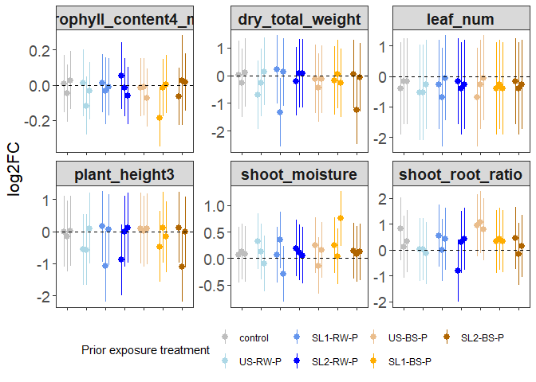<!-- -->

``` r
## save plot
ggsave("./indirect_files/figs/contrasts-slurries.png", 
       width = 10, height = 4, 
       units = "in")
```

#### M2: Examine non-destructive traits over time

``` r
## load emmeans
load(file = "./indirect_files/models/emm1-slurry.means.Rda") ## loads emm.s

## select cols to analyze
trait.list <- c("plant_height1", "plant_height2", 
                "plant_height3", "plant_height4",
                "chlorophyll_content1_mean",
                "chlorophyll_content2_mean",
                "chlorophyll_content3_mean",
                "chlorophyll_content4_mean",
                "leaf_num",
                "leaf_num2")

## create long df
emm.f <- emm.s %>%
  filter(trait %in% trait.list &
           !amend %in% c("no_treat",
                         "saline")) %>% ## removed controls
  droplevels(.)
## 21 samples x 10 traits = 210

## pull out weeks
emm.f$week <- str_extract(emm.f$trait, "\\d+\\.?\\d*")

## add in week for leaf num
emm.f$week <- ifelse(is.na(emm.f$week) == TRUE,
                          1,
                          emm.f$week)

## treat week as an ordered factor
emm.f$weekFac <- factor(emm.f$week,
                             levels = c("1","2","3","4"),
                             ordered = TRUE)

## treat week as an integer
emm.f$week <- as.integer(emm.f$week)

## remove numbers from traits
emm.f$trait <- str_replace_all(emm.f$trait,
                                    "\\d+\\.?\\d*", "")
### three traits: "plant_height", chlorophyll_content_mean", "leaf_num"

## relativize treatments to controls (within each week)
emm.controls <- emm.f %>%
  filter(amend_spike == "control-0") %>%
  group_by(trait, weekFac) %>%
  summarize(mean_control = mean(emmean, na.rm = TRUE)) %>%
  ungroup(.)
```

    ## `summarise()` has grouped output by 'trait'. You can override using the
    ## `.groups` argument.

``` r
## add in control means to long df
emm.f <- emm.f %>%
  left_join(
    emm.controls,
    by = c("trait","weekFac")
  ) %>%
  mutate(emmean.r = log2(emmean/mean_control))

## summarize for each treatment
emm.f.sum <- emm.f %>%
  group_by(trait, weekFac, amend_spike) %>%
  summarize(mean = mean(emmean, na.rm = TRUE),
            count = n(),
            SE = sd(emmean, na.rm = TRUE)/sqrt(count))
```

    ## `summarise()` has grouped output by 'trait', 'weekFac'. You can override using
    ## the `.groups` argument.

``` r
## formatting for plot

trait_labs <- c(
  chlorophyll_content_mean = "Leaf chlorophyll A",
  leaf_num = "Leaves (no.)",
  plant_height = "Plant height (cm)"
)

## plot traits over time
plot <- ggplot(emm.f.sum,
       aes(x = weekFac, y = mean)) +
  geom_pointrange(aes(
    ymin = mean - SE,
    ymax = mean + SE,
    colour = amend_spike),
    position = position_dodge(0.3)) +
  geom_line(
    aes(group = amend_spike,
        colour = amend_spike),
    position = position_dodge(0.3)) +
  facet_wrap(~trait, scales = "free",
             labeller = 
                 labeller(trait = trait_labs)) +
  scale_color_manual(values = c(  "gray",
                                  "lightblue",
                                  "cornflowerblue",
                                  "blue",
                                  "#EABD8C",
                                  "#FFAD00",
                                  "#B06500"),
                     guide = guide_legend(nrow = 1)) +
  labs(y = "Means +/- 1 SE",
       x = "Weeks post planting",
       colour = "Amendment- \n contaminant level") +
  guides(shape = "none") +
  theme_bw() +
  theme(axis.title.x = element_text(size = 16),
          axis.text.x = element_text(size = 14),
          axis.title.y = element_text(size = 16),
          axis.text.y = element_text(size = 14),
          strip.text = element_text(size = 14, face = "bold"),
          legend.position = "bottom",
          panel.grid.major = element_blank(),
          panel.grid.minor = element_blank())
plot
```

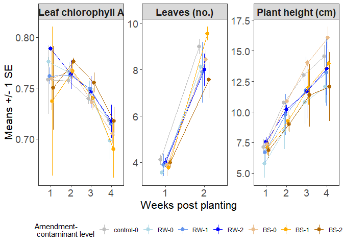<!-- -->

``` r
## save plot
ggsave("./indirect_files/figs/traits_vs_time.png", 
       width = 9, height = 3, 
       units = "in")

## save just for plant height
## plot traits over time
plot <- ggplot(emm.f.sum %>%
                 filter(trait == "plant_height"),
       aes(x = weekFac, y = mean)) +
  geom_pointrange(aes(
    ymin = mean - SE,
    ymax = mean + SE,
    colour = amend_spike),
    position = position_dodge(0.3)) +
  geom_line(
    aes(group = amend_spike,
        colour = amend_spike),
    position = position_dodge(0.3)) +
  facet_wrap(~trait, scales = "free",
             labeller = 
                 labeller(trait = trait_labs)) +
  scale_color_manual(values = c(  "gray",
                                  "lightblue",
                                  "cornflowerblue",
                                  "blue",
                                  "#EABD8C",
                                  "#FFAD00",
                                  "#B06500"),
                     guide = guide_legend(nrow = 1)) +
  labs(y = "Means +/- 1 SE",
       x = "Weeks post planting",
       colour = "Amendment- \n contaminant level") +
  guides(shape = "none") +
  theme_bw() +
  theme(axis.title.x = element_text(size = 16),
          axis.text.x = element_text(size = 14),
          axis.title.y = element_text(size = 16),
          axis.text.y = element_text(size = 14),
          strip.text = element_text(size = 14, face = "bold"),
          legend.position = "bottom",
          panel.grid.major = element_blank(),
          panel.grid.minor = element_blank())
plot
```

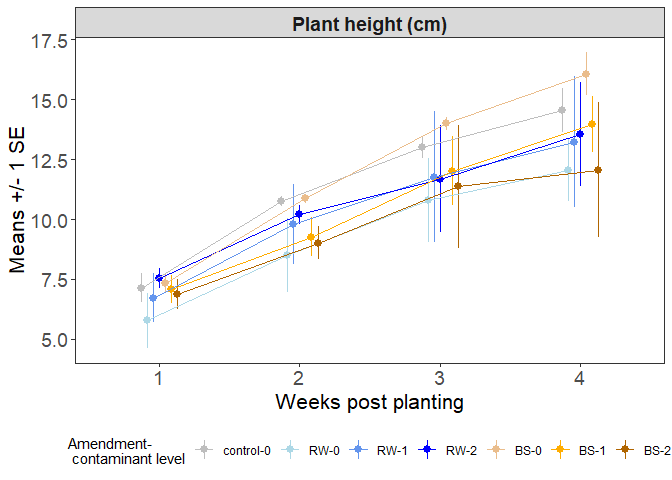<!-- -->

``` r
# Save the plot object
saveRDS(plot, file = "./indirect_files/figs/height_vs_time.rds")

##### m2-treat.vs.time #####

## set contrasts
options(contrasts=c("contr.sum","contr.poly")) 

# Create output directory if it doesn't exist
## set output directory
output_dir <- "./indirect_files/models/"
if (!dir.exists(output_dir)) {
  dir.create(output_dir, recursive = TRUE)
}


## create directory
dir.create(file.path(output_dir, "resfits_plots/m2-treat.vs.time/"), 
           recursive = TRUE, 
           showWarnings = FALSE)

## traits
trait.list <- unique(emm.f$trait)

## 1)  species x amendment (for each timepoint sep)
source("./Source_code/15_indirect-mod_treat.vs.time.func.R")

## run function
mod.out <- sapply(trait.list, 
                   mod_treat.v.time,
                   df = emm.f,
                   simplify = FALSE, 
                   USE.NAMES = TRUE)
```

    ## [1] "plant_height"

    ## 
    ## Call:
    ## lm(formula = log(emmean) ~ amend_spike * weekFac, data = df.f)
    ## 
    ## Residuals:
    ##      Min       1Q   Median       3Q      Max 
    ## -0.54905 -0.11895  0.02653  0.14331  0.35481 
    ## 
    ## Coefficients:
    ##                         Estimate Std. Error t value Pr(>|t|)    
    ## (Intercept)             2.305809   0.027820  82.883  < 2e-16 ***
    ## amend_spike1            0.086691   0.068145   1.272   0.2086    
    ## amend_spike2           -0.142728   0.068145  -2.094   0.0408 *  
    ## amend_spike3           -0.042373   0.068145  -0.622   0.5366    
    ## amend_spike4            0.026695   0.068145   0.392   0.6967    
    ## amend_spike5            0.140522   0.068145   2.062   0.0438 *  
    ## amend_spike6            0.011521   0.068145   0.169   0.8664    
    ## weekFac.L               0.490705   0.055640   8.819 3.54e-12 ***
    ## weekFac.Q              -0.110719   0.055640  -1.990   0.0515 .  
    ## weekFac.C               0.018627   0.055640   0.335   0.7390    
    ## amend_spike1:weekFac.L  0.032213   0.136290   0.236   0.8140    
    ## amend_spike2:weekFac.L  0.080351   0.136290   0.590   0.5579    
    ## amend_spike3:weekFac.L -0.018576   0.136290  -0.136   0.8921    
    ## amend_spike4:weekFac.L -0.095292   0.136290  -0.699   0.4873    
    ## amend_spike5:weekFac.L  0.092731   0.136290   0.680   0.4991    
    ## amend_spike6:weekFac.L  0.022712   0.136290   0.167   0.8682    
    ## amend_spike1:weekFac.Q -0.043817   0.136290  -0.322   0.7490    
    ## amend_spike2:weekFac.Q -0.026694   0.136290  -0.196   0.8454    
    ## amend_spike3:weekFac.Q -0.006605   0.136290  -0.048   0.9615    
    ## amend_spike4:weekFac.Q  0.040415   0.136290   0.297   0.7679    
    ## amend_spike5:weekFac.Q -0.020597   0.136290  -0.151   0.8804    
    ## amend_spike6:weekFac.Q  0.055322   0.136290   0.406   0.6864    
    ## amend_spike1:weekFac.C  0.016206   0.136290   0.119   0.9058    
    ## amend_spike2:weekFac.C -0.012208   0.136290  -0.090   0.9289    
    ## amend_spike3:weekFac.C  0.026429   0.136290   0.194   0.8469    
    ## amend_spike4:weekFac.C  0.043393   0.136290   0.318   0.7514    
    ## amend_spike5:weekFac.C -0.013291   0.136290  -0.098   0.9227    
    ## amend_spike6:weekFac.C -0.037717   0.136290  -0.277   0.7830    
    ## ---
    ## Signif. codes:  0 '***' 0.001 '**' 0.01 '*' 0.05 '.' 0.1 ' ' 1
    ## 
    ## Residual standard error: 0.255 on 56 degrees of freedom
    ## Multiple R-squared:  0.6285, Adjusted R-squared:  0.4493 
    ## F-statistic: 3.508 on 27 and 56 DF,  p-value: 3.639e-05
    ## 
    ## [1] "chlorophyll_content_mean"

    ## 
    ## Call:
    ## lm(formula = log(emmean) ~ amend_spike * weekFac, data = df.f)
    ## 
    ## Residuals:
    ##       Min        1Q    Median        3Q       Max 
    ## -0.111543 -0.012130 -0.000009  0.016900  0.099838 
    ## 
    ## Coefficients:
    ##                         Estimate Std. Error t value Pr(>|t|)    
    ## (Intercept)            -0.295270   0.004593 -64.293  < 2e-16 ***
    ## amend_spike1           -0.001909   0.011563  -0.165  0.86950    
    ## amend_spike2            0.002156   0.011009   0.196  0.84550    
    ## amend_spike3            0.003433   0.011563   0.297  0.76771    
    ## amend_spike4            0.011883   0.011009   1.079  0.28529    
    ## amend_spike5           -0.004352   0.011009  -0.395  0.69420    
    ## amend_spike6           -0.017201   0.011563  -1.488  0.14278    
    ## weekFac.L              -0.053747   0.009247  -5.812  3.6e-07 ***
    ## weekFac.Q              -0.028663   0.009185  -3.121  0.00292 ** 
    ## weekFac.C               0.002938   0.009123   0.322  0.74870    
    ## amend_spike1:weekFac.L  0.012895   0.024000   0.537  0.59330    
    ## amend_spike2:weekFac.L -0.023103   0.022043  -1.048  0.29937    
    ## amend_spike3:weekFac.L  0.007165   0.022269   0.322  0.74891    
    ## amend_spike4:weekFac.L -0.015514   0.022043  -0.704  0.48463    
    ## amend_spike5:weekFac.L -0.004479   0.022043  -0.203  0.83976    
    ## amend_spike6:weekFac.L  0.003517   0.024000   0.147  0.88405    
    ## amend_spike1:weekFac.Q  0.014207   0.023126   0.614  0.54162    
    ## amend_spike2:weekFac.Q  0.001121   0.022017   0.051  0.95957    
    ## amend_spike3:weekFac.Q  0.004870   0.023126   0.211  0.83402    
    ## amend_spike4:weekFac.Q  0.025097   0.022017   1.140  0.25947    
    ## amend_spike5:weekFac.Q  0.000629   0.022017   0.029  0.97732    
    ## amend_spike6:weekFac.Q -0.029667   0.023126  -1.283  0.20512    
    ## amend_spike1:weekFac.C  0.001231   0.022218   0.055  0.95604    
    ## amend_spike2:weekFac.C -0.010079   0.021991  -0.458  0.64859    
    ## amend_spike3:weekFac.C -0.004829   0.023952  -0.202  0.84101    
    ## amend_spike4:weekFac.C -0.008900   0.021991  -0.405  0.68732    
    ## amend_spike5:weekFac.C  0.009425   0.021991   0.429  0.66997    
    ## amend_spike6:weekFac.C  0.006838   0.022218   0.308  0.75946    
    ## ---
    ## Signif. codes:  0 '***' 0.001 '**' 0.01 '*' 0.05 '.' 0.1 ' ' 1
    ## 
    ## Residual standard error: 0.04101 on 53 degrees of freedom
    ## Multiple R-squared:  0.5161, Adjusted R-squared:  0.2695 
    ## F-statistic: 2.093 on 27 and 53 DF,  p-value: 0.0108
    ## 
    ## [1] "leaf_num"

    ## 
    ## Call:
    ## lm(formula = log(emmean) ~ amend_spike * weekFac, data = df.f)
    ## 
    ## Residuals:
    ##      Min       1Q   Median       3Q      Max 
    ## -0.36007 -0.06032  0.01987  0.07111  0.23464 
    ## 
    ## Coefficients:
    ##                         Estimate Std. Error t value Pr(>|t|)    
    ## (Intercept)             1.731988   0.023049  75.143  < 2e-16 ***
    ## amend_spike1            0.071280   0.056459   1.263    0.217    
    ## amend_spike2           -0.053091   0.056459  -0.940    0.355    
    ## amend_spike3           -0.044072   0.056459  -0.781    0.442    
    ## amend_spike4           -0.004235   0.056459  -0.075    0.941    
    ## amend_spike5            0.004502   0.056459   0.080    0.937    
    ## amend_spike6            0.060237   0.056459   1.067    0.295    
    ## weekFac.L               0.539163   0.032597  16.540 5.53e-16 ***
    ## amend_spike1:weekFac.L  0.016079   0.079845   0.201    0.842    
    ## amend_spike2:weekFac.L  0.046535   0.079845   0.583    0.565    
    ## amend_spike3:weekFac.L -0.049659   0.079845  -0.622    0.539    
    ## amend_spike4:weekFac.L -0.052982   0.079845  -0.664    0.512    
    ## amend_spike5:weekFac.L  0.019036   0.079845   0.238    0.813    
    ## amend_spike6:weekFac.L  0.116945   0.079845   1.465    0.154    
    ## ---
    ## Signif. codes:  0 '***' 0.001 '**' 0.01 '*' 0.05 '.' 0.1 ' ' 1
    ## 
    ## Residual standard error: 0.1494 on 28 degrees of freedom
    ## Multiple R-squared:  0.9096, Adjusted R-squared:  0.8676 
    ## F-statistic: 21.67 on 13 and 28 DF,  p-value: 3.235e-11

``` r
## save models
aov <- lapply(mod.out, `[[`, 1) %>%
  bind_rows(.)

### format
aov$pval <- signif(aov$`Pr(>F)`, 3)
aov$sig <- ifelse(aov$pval< 0.001, ", p < 0.001",
            ifelse(aov$pval < 0.01, paste0(", P = ", aov$pval, "**"),
            ifelse(aov$pval < 0.05, paste0(", P = ", aov$pval, "*"),
            ifelse(aov$pval < 0.1, paste0(", P = ", aov$pval, "."),
                               ", P > 0.1"))))
aov$stat <- signif(aov$`F value`, 3)

## pivot wider for each model term
aov.w <- aov %>%
  select(-c(`F value`,"Pr(>F)","pval", "Sum Sq")) %>%
  pivot_wider(
    names_from = term,
    values_from = c(stat, Df, sig)
  ) ## 3 traits total, 3 rows

## formatting
aov.f <- aov.w %>%
  mutate(Treatment = paste0("F [", Df_amend_spike, ", ",
                                Df_Residuals, "] = ", stat_amend_spike,
                                sig_amend_spike),
         Week = paste0("F [", Df_weekFac, ", ",
                           Df_Residuals, "] = ", stat_weekFac,
                           sig_weekFac),
         `Treatment x Week` = 
                             paste0("F [", 
                               `Df_amend_spike:weekFac`, ", ",
                                Df_Residuals, "] = ",
                               `stat_amend_spike:weekFac`,
                               `sig_amend_spike:weekFac`)
         ) %>%
  select(trait, Treatment, Week, `Treatment x Week`)

### CONTRASTS
cont <- lapply(mod.out, `[[`, 3) %>%
  bind_rows(.)

## round pval
cont$pval <- signif(cont$p.value, 3)
### format
cont$sig <- ifelse(cont$p.value < 0.001, ", P < 0.001",
            ifelse(cont$p.value < 0.01, paste0(", P = ", cont$pval, "**"),
            ifelse(cont$p.value < 0.05, paste0(", P = ", cont$pval, "*"),
            ifelse(cont$p.value < 0.1, paste0(", P = ", cont$pval, "."),
                               ", P > 0.1"))))
## test stats
cont$stat <- signif(cont$t.ratio, 3)

cont$stat.f <- paste0("t = ", cont$stat, ", ", 
                    "df = ", cont$df,
                    cont$sig)
## estimates
cont$log2FC <- log2(cont$ratio)
cont$LCL <-signif(log2(cont$lower.CL), 3)
cont$UCL <- signif(log2(cont$upper.CL), 3)
cont$log2FC_CL <- paste0(signif(cont$log2FC, 3), " [",
                        cont$LCL," to ",
                        cont$UCL,"]")
## save as R data file
save(cont, file = paste0(output_dir, "cont2-treat.vs.time.Rdata"))

## save relevant output for table
cont.s <- cont %>%
  filter(p.value < 0.1) %>%
  mutate(
    contrast_info = paste0(contrast, ": ", 
                           stat.f, "; ", 
                           "log2FC [95% CL] = ", log2FC_CL)
    ) %>%
  select(trait, Week = weekFac, contrast_info) %>%
  group_by(trait) %>%
  summarize(
    sig_contrasts = paste(contrast_info, collapse = " | ")
    )

## no sig contrasts


### CONTRASTS
cont <- lapply(mod.out, `[[`, 4) %>%
  bind_rows(.)

## round pval
cont$pval <- signif(cont$p.value, 3)
### format
cont$sig <- ifelse(cont$p.value < 0.001, ", P < 0.001",
            ifelse(cont$p.value < 0.01, paste0(", P = ", cont$pval, "**"),
            ifelse(cont$p.value < 0.05, paste0(", P = ", cont$pval, "*"),
            ifelse(cont$p.value < 0.1, paste0(", P = ", cont$pval, "."),
                               ", P > 0.1"))))
## test stats
cont$stat <- signif(cont$t.ratio, 3)

cont$stat.f <- paste0("t = ", cont$stat, ", ", 
                    "df = ", cont$df,
                    cont$sig)
## estimates
cont$Est <- signif(cont$estimate,3)
cont$LCL <-signif(cont$lower.CL, 3)
cont$UCL <- signif(cont$upper.CL, 3)
cont$Est_CL <- paste0(signif(cont$Est, 3), " [",
                        cont$LCL," to ",
                        cont$UCL,"]")
## save as R data file
save(cont, file = paste0(output_dir, "cont2-treat.vs.time-poly.Rdata"))

## save relevant output for table
cont.s <- cont %>%
  filter(p.value < 0.1 & contrast == "linear") %>%
  mutate(
    contrast_info = paste0(amend_spike, "_", 
                           contrast, ": ", 
                           stat.f, "; ", 
                           "linear est. [95% CL] = ", Est_CL)
    ) %>%
  select(trait, contrast_info) %>%
  group_by(trait) %>%
  summarize(
    sig_contrasts = paste(contrast_info, collapse = " | ")
    )

## add to anova
aov.f <- left_join(aov.f, cont.s, by = c("trait")) 

## save
write.csv(aov.f, file = paste0(output_dir, "aov2-treat.vs.time.csv"), 
          row.names = FALSE)
kable(aov.f)
```

| trait | Treatment | Week | Treatment x Week | sig_contrasts |
|:---|:---|:---|:---|:---|
| plant_height | F \[6, 56\] = 1.75, P \> 0.1 | F \[3, 56\] = 27.3, p \< 0.001 | F \[18, 56\] = 0.133, P \> 0.1 | control-0_linear: t = 3.55, df = 56, P \< 0.001; linear est. \[95% CL\] = 2.34 \[1.02 to 3.66\] \| RW-0_linear: t = 3.88, df = 56, P \< 0.001; linear est. \[95% CL\] = 2.55 \[1.24 to 3.87\] \| RW-1_linear: t = 3.21, df = 56, P = 0.00222**; linear est. \[95% CL\] = 2.11 \[0.793 to 3.43\] \| RW-2_linear: t = 2.69, df = 56, P = 0.0095**; linear est. \[95% CL\] = 1.77 \[0.45 to 3.09\] \| BS-0_linear: t = 3.96, df = 56, P \< 0.001; linear est. \[95% CL\] = 2.61 \[1.29 to 3.93\] \| BS-1_linear: t = 3.49, df = 56, P \< 0.001; linear est. \[95% CL\] = 2.3 \[0.977 to 3.61\] \| BS-2_linear: t = 2.56, df = 56, P = 0.0133\*; linear est. \[95% CL\] = 1.68 \[0.365 to 3\] |
| chlorophyll_content_mean | F \[6, 53\] = 0.567, P \> 0.1 | F \[3, 53\] = 15.2, p \< 0.001 | F \[18, 53\] = 0.362, P \> 0.1 | RW-0_linear: t = -3.25, df = 53, P = 0.00203**; linear est. \[95% CL\] = -0.344 \[-0.556 to -0.131\] \| RW-1_linear: t = -1.94, df = 53, P = 0.0573.; linear est. \[95% CL\] = -0.208 \[-0.423 to 0.00669\] \| RW-2_linear: t = -2.93, df = 53, P = 0.00505**; linear est. \[95% CL\] = -0.31 \[-0.522 to -0.0974\] \| BS-0_linear: t = -2.46, df = 53, P = 0.0172\*; linear est. \[95% CL\] = -0.26 \[-0.473 to -0.048\] \| BS-1_linear: t = -1.92, df = 53, P = 0.0607.; linear est. \[95% CL\] = -0.225 \[-0.46 to 0.0104\] |
| leaf_num | F \[6, 28\] = 0.659, P \> 0.1 | F \[1, 28\] = 274, p \< 0.001 | F \[6, 28\] = 0.693, P \> 0.1 | control-0_linear: t = 6.44, df = 28, P \< 0.001; linear est. \[95% CL\] = 0.785 \[0.535 to 1.04\] \| RW-0_linear: t = 6.79, df = 28, P \< 0.001; linear est. \[95% CL\] = 0.828 \[0.578 to 1.08\] \| RW-1_linear: t = 5.68, df = 28, P \< 0.001; linear est. \[95% CL\] = 0.692 \[0.442 to 0.942\] \| RW-2_linear: t = 5.64, df = 28, P \< 0.001; linear est. \[95% CL\] = 0.688 \[0.438 to 0.937\] \| BS-0_linear: t = 6.47, df = 28, P \< 0.001; linear est. \[95% CL\] = 0.789 \[0.54 to 1.04\] \| BS-1_linear: t = 7.61, df = 28, P \< 0.001; linear est. \[95% CL\] = 0.928 \[0.678 to 1.18\] \| BS-2_linear: t = 5.14, df = 28, P \< 0.001; linear est. \[95% CL\] = 0.627 \[0.377 to 0.877\] |

#### M3: impact of prior amendment type on traits

``` r
## load emmeans
load(file = "./indirect_files/models/emm1-slurry.means.Rda") ## loads emm.s

## set contrasts
options(contrasts=c("contr.sum","contr.poly")) 

## source function
source("./Source_code/16_indirect-mod_amend.func.R")

## traits measured at harvest
trait.list <- c("plant_height4",
                "chlorophyll_content4_mean", 
                "leaf_num2",
                "dry_total_weight",
                "shoot_root_ratio",
                "shoot_moisture")

# Create output directory if it doesn't exist
## set output directory
output_dir <- "./indirect_files/models/"
if (!dir.exists(output_dir)) {
  dir.create(output_dir, recursive = TRUE)
}

## run 
mod.out <- sapply(trait.list, 
                   mod_amend,
                   df = emm.s %>%
                         filter(!amend %in% 
                                  c("no_treat","saline") &
                                  spikeFac == "0") %>%
                         droplevels(.),
                   simplify = FALSE, 
                   USE.NAMES = TRUE)
```

    ## [1] "plant_height4"

    ## 
    ## Call:
    ## lm(formula = log(emmean) ~ amend, data = df.f)
    ## 
    ## Residuals:
    ##      Min       1Q   Median       3Q      Max 
    ## -0.14332 -0.11530  0.04302  0.06528  0.20332 
    ## 
    ## Coefficients:
    ##             Estimate Std. Error t value Pr(>|t|)    
    ## (Intercept)  2.64198    0.04551  58.059 1.75e-09 ***
    ## amend1       0.03183    0.06435   0.495   0.6385    
    ## amend2      -0.16309    0.06435  -2.534   0.0444 *  
    ## ---
    ## Signif. codes:  0 '***' 0.001 '**' 0.01 '*' 0.05 '.' 0.1 ' ' 1
    ## 
    ## Residual standard error: 0.1365 on 6 degrees of freedom
    ## Multiple R-squared:  0.5461, Adjusted R-squared:  0.3948 
    ## F-statistic: 3.609 on 2 and 6 DF,  p-value: 0.09352
    ## 
    ## [1] "chlorophyll_content4_mean"

    ## 
    ## Call:
    ## lm(formula = log(emmean) ~ amend, data = df.f)
    ## 
    ## Residuals:
    ##       Min        1Q    Median        3Q       Max 
    ## -0.049641 -0.027898  0.009546  0.015450  0.040095 
    ## 
    ## Coefficients:
    ##             Estimate Std. Error t value Pr(>|t|)    
    ## (Intercept) -0.34695    0.01118 -31.043 7.42e-08 ***
    ## amend1       0.01607    0.01581   1.017    0.349    
    ## amend2      -0.01309    0.01581  -0.828    0.439    
    ## ---
    ## Signif. codes:  0 '***' 0.001 '**' 0.01 '*' 0.05 '.' 0.1 ' ' 1
    ## 
    ## Residual standard error: 0.03353 on 6 degrees of freedom
    ## Multiple R-squared:  0.1632, Adjusted R-squared:  -0.1158 
    ## F-statistic: 0.5849 on 2 and 6 DF,  p-value: 0.586
    ## 
    ## [1] "leaf_num2"

    ## Warning in dpois(y, mu, log = TRUE): non-integer x = 8.666667

    ## Warning in dpois(y, mu, log = TRUE): non-integer x = 7.666667

    ## Warning in dpois(y, mu, log = TRUE): non-integer x = 8.333333

    ## Warning in dpois(y, mu, log = TRUE): non-integer x = 8.666667
    ## Warning in dpois(y, mu, log = TRUE): non-integer x = 8.666667

    ## Warning in dpois(y, mu, log = TRUE): non-integer x = 9.666667

    ## 
    ## Call:
    ## glm(formula = emmean ~ amend, family = poisson(link = "log"), 
    ##     data = df.f)
    ## 
    ## Coefficients:
    ##             Estimate Std. Error z value Pr(>|z|)    
    ## (Intercept)  2.14132    0.11431  18.732   <2e-16 ***
    ## amend1       0.05590    0.15941   0.351    0.726    
    ## amend2      -0.04809    0.16360  -0.294    0.769    
    ## ---
    ## Signif. codes:  0 '***' 0.001 '**' 0.01 '*' 0.05 '.' 0.1 ' ' 1
    ## 
    ## (Dispersion parameter for poisson family taken to be 1)
    ## 
    ##     Null deviance: 0.33931  on 8  degrees of freedom
    ## Residual deviance: 0.19782  on 6  degrees of freedom
    ## AIC: Inf
    ## 
    ## Number of Fisher Scoring iterations: 3

    ## Warning in dpois(y, mu, log = TRUE): non-integer x = 8.666667

    ## Warning in dpois(y, mu, log = TRUE): non-integer x = 7.666667

    ## Warning in dpois(y, mu, log = TRUE): non-integer x = 8.333333

    ## Warning in dpois(y, mu, log = TRUE): non-integer x = 8.666667
    ## Warning in dpois(y, mu, log = TRUE): non-integer x = 8.666667

    ## Warning in dpois(y, mu, log = TRUE): non-integer x = 9.666667

    ## [1] "dry_total_weight"

    ## 
    ## Call:
    ## lm(formula = log(emmean) ~ amend, data = df.f)
    ## 
    ## Residuals:
    ##      Min       1Q   Median       3Q      Max 
    ## -0.29343 -0.13739  0.04777  0.06953  0.28533 
    ## 
    ## Coefficients:
    ##             Estimate Std. Error t value Pr(>|t|)    
    ## (Intercept)  5.11515    0.06545  78.148 2.96e-10 ***
    ## amend1       0.09322    0.09257   1.007    0.353    
    ## amend2      -0.05848    0.09257  -0.632    0.551    
    ## ---
    ## Signif. codes:  0 '***' 0.001 '**' 0.01 '*' 0.05 '.' 0.1 ' ' 1
    ## 
    ## Residual standard error: 0.1964 on 6 degrees of freedom
    ## Multiple R-squared:  0.1473, Adjusted R-squared:  -0.137 
    ## F-statistic: 0.5181 on 2 and 6 DF,  p-value: 0.6201
    ## 
    ## [1] "shoot_root_ratio"

    ## 
    ## Call:
    ## lm(formula = log(emmean) ~ amend, data = df.f)
    ## 
    ## Residuals:
    ##       Min        1Q    Median        3Q       Max 
    ## -0.207125 -0.064335 -0.000488  0.032801  0.271461 
    ## 
    ## Coefficients:
    ##             Estimate Std. Error t value Pr(>|t|)    
    ## (Intercept)  0.99757    0.05203  19.174  1.3e-06 ***
    ## amend1      -0.01647    0.07358  -0.224  0.83034    
    ## amend2      -0.32679    0.07358  -4.441  0.00437 ** 
    ## ---
    ## Signif. codes:  0 '***' 0.001 '**' 0.01 '*' 0.05 '.' 0.1 ' ' 1
    ## 
    ## Residual standard error: 0.1561 on 6 degrees of freedom
    ## Multiple R-squared:  0.8219, Adjusted R-squared:  0.7626 
    ## F-statistic: 13.85 on 2 and 6 DF,  p-value: 0.005647
    ## 
    ## [1] "shoot_moisture"

    ## 
    ## Call:
    ## lm(formula = log(emmean) ~ amend, data = df.f)
    ## 
    ## Residuals:
    ##      Min       1Q   Median       3Q      Max 
    ## -0.15642 -0.02016  0.00707  0.05078  0.13985 
    ## 
    ## Coefficients:
    ##              Estimate Std. Error t value Pr(>|t|)    
    ## (Intercept)  2.042020   0.038620  52.875 3.07e-09 ***
    ## amend1      -0.004379   0.054617  -0.080    0.939    
    ## amend2       0.011083   0.054617   0.203    0.846    
    ## ---
    ## Signif. codes:  0 '***' 0.001 '**' 0.01 '*' 0.05 '.' 0.1 ' ' 1
    ## 
    ## Residual standard error: 0.1159 on 6 degrees of freedom
    ## Multiple R-squared:  0.006915,   Adjusted R-squared:  -0.3241 
    ## F-statistic: 0.02089 on 2 and 6 DF,  p-value: 0.9794

``` r
## combine dfs
### ANOVAs
aov <- lapply(mod.out, `[[`, 1) %>%
  bind_rows(.)

### format
aov$pval <- ifelse(is.na(aov$`Pr(>F)`) == FALSE,
                   signif(aov$`Pr(>F)`, 3),
                   signif(aov$`Pr(>Chisq)`, 3))
aov$sig <- ifelse(aov$pval< 0.001, ", P < 0.001",
            ifelse(aov$pval < 0.01, paste0(", P =", aov$pval, "**"),
            ifelse(aov$pval < 0.05, paste0(", P =", aov$pval, "*"),
            ifelse(aov$pval < 0.1, paste0(", P =", aov$pval, "."),
                               ", P > 0.1"))))
aov$stat <- ifelse(is.na(aov$`F value`) == FALSE,
                        signif(aov$`F value`, 3),
                        signif(aov$`LR Chisq`, 3))

## pivot wider for each model term
aov.w <- aov %>%
  select(-c(`F value`,"Pr(>F)", "LR Chisq", 
            "Pr(>Chisq)","pval", "Sum Sq")) %>%
  pivot_wider(
    names_from = term,
    values_from = c(stat, Df, sig)
  ) ## 10 traits total, 10 rows

## formatting
aov.f <- aov.w %>%
  mutate(Amendment =  ifelse(trait %in% c("leaf_num2"),
                         paste0("X2 = ", stat_amend, 
                                ", df = ", Df_amend,
                                sig_amend),
                         paste0("F [", Df_amend, ", ",
                                Df_Residuals, "] = ", stat_amend,
                                sig_amend))
         ) %>%
  select(trait, Amendment)

### CONTRASTS
cont <- lapply(mod.out, `[[`, 3) %>%
  bind_rows(.)

## round pval
cont$pval <- signif(cont$p.value, 3)
### format
cont$sig <- ifelse(cont$p.value < 0.001, ", P < 0.001",
            ifelse(cont$p.value < 0.01, paste0(", P =", cont$pval, "**"),
            ifelse(cont$p.value < 0.05, paste0(", P =", cont$pval, "*"),
            ifelse(cont$p.value < 0.1, paste0(", P =", cont$pval, "."),
                               ", P > 0.1"))))
## test stats
cont$stat <- ifelse(is.na(cont$t.ratio) == FALSE,
                        signif(cont$t.ratio, 3),
                        signif(cont$z.ratio, 3))

cont$stat.f <- ifelse(cont$trait %in% c("leaf_num2"),
                      paste0("z = ", cont$stat,
                    cont$sig),
                    paste0("t = ", cont$stat, ", ", 
                    "df = ", cont$df,
                    cont$sig)
)
## estimates
cont$log2FC <- log2(cont$ratio)
cont$LCL <- ifelse(is.na(cont$lower.CL) == TRUE,
                   signif(log2(cont$asymp.LCL), 3),
                   signif(log2(cont$lower.CL), 3))
cont$UCL <- ifelse(is.na(cont$upper.CL) == TRUE,
                   signif(log2(cont$asymp.UCL), 3),
                   signif(log2(cont$upper.CL), 3))
cont$log2FC_CL <- paste0(signif(cont$log2FC, 3), " [",
                        cont$LCL," to ",
                        cont$UCL,"]")
## save as R data file
save(cont, file = paste0(output_dir, "cont3-amend.Rdata"))

## save as csv (Supp file)
cont.s <- cont %>%
  mutate(amend = ifelse(grepl("RW", contrast, fixed = FALSE) == TRUE,
                        "RW", "BS")) %>%
  select(trait, amend, log2FC_CL, stat.f)
write_csv(cont.s, file = paste0(output_dir, "cont1-amend.csv"))


## save relevant output for table
cont.f <- cont %>%
  filter(p.value < 0.1) %>%
  mutate(
    contrast_info = paste0(contrast, ": ", 
                           stat.f, "; ", 
                           "log2FC [95% CL] = ", log2FC_CL)
    ) %>%
  select(trait, contrast_info) %>%
  group_by(trait) %>%
  summarize(
    sig_contrasts = paste(contrast_info, collapse = " | ")
    )

## add to anova
aov.f$sig_contrasts <- cont.f$sig_contrasts[match(aov.f$trait, cont.f$trait)] 
## save
write.csv(aov.f, file = paste0(output_dir, "aov3-amend.csv"), 
          row.names = FALSE)
## print nicely
knitr::kable(
 aov.f,
  format = "markdown",   # ensures Markdown-friendly table
  digits = 3,
  align = "c",
  caption = "ANOVA (T3SS) for prior amendment exposure on performance"
)
```

| trait | Amendment | sig_contrasts |
|:--:|:--:|:--:|
| plant_height4 | F \[2, 6\] = 3.61, P =0.0935. | NA |
| chlorophyll_content4_mean | F \[2, 6\] = 0.585, P \> 0.1 | NA |
| leaf_num2 | X2 = 0.141, df = 2, P \> 0.1 | NA |
| dry_total_weight | F \[2, 6\] = 0.518, P \> 0.1 | NA |
| shoot_root_ratio | F \[2, 6\] = 13.8, P =0.00565\*\* | RW / control: t = -2.44, df = 6, P =0.0917.; log2FC \[95% CL\] = -0.448 \[-0.981 to 0.0857\] \| BS / control: t = 2.82, df = 6, P =0.0553.; log2FC \[95% CL\] = 0.519 \[-0.0144 to 1.05\] |
| shoot_moisture | F \[2, 6\] = 0.0209, P \> 0.1 | NA |

ANOVA (T3SS) for prior amendment exposure on performance

``` r
### emmeans
emm <- lapply(mod.out, `[[`, 2) %>%
  bind_rows(.)
write.csv(emm, file = paste0(output_dir, "emm3-amend.csv"), 
          row.names = FALSE)
```

#### M4: impact of prior contaminant level

``` r
## load emmeans
load(file = "./indirect_files/models/emm1-slurry.means.Rda") ## loads emm.s

## set contrasts
options(contrasts=c("contr.sum","contr.poly")) 

## traits measured at harvest
trait.list <- c("plant_height4",
                "chlorophyll_content4_mean", 
                "leaf_num2",
                "dry_total_weight",
                "shoot_root_ratio",
                "shoot_moisture")

## create list of traits/amends to loop through:
amend.list <- c("RW","BS")
comb_df <- expand_grid(traits = trait.list,
                       amends = amend.list)
## Combine into a single string
comb_df <- comb_df %>%
  mutate(
    combs = paste(traits, amends, sep ="_")
  )

## source function
source("./Source_code/17_indirect-mod_contam.func.R")

# Create output directory if it doesn't exist
## set output directory
output_dir <- "./indirect_files/models/"
if (!dir.exists(output_dir)) {
  dir.create(output_dir, recursive = TRUE)
}

## run model
mod.out <- mapply(FUN = mod_contam, 
                      combs = comb_df$combs, 
                      traits = comb_df$traits, 
                      amends = comb_df$amends, 
                      USE.NAMES = TRUE, 
                      SIMPLIFY = FALSE,
                      MoreArgs = list(df = emm.s)
                   )
```

    ## [1] "plant_height4_RW"

    ## 
    ## Call:
    ## lm(formula = log(emmean) ~ spikeFac, data = df.f)
    ## 
    ## Residuals:
    ##     Min      1Q  Median      3Q     Max 
    ## -0.4634 -0.1433  0.1612  0.1938  0.3005 
    ## 
    ## Coefficients:
    ##              Estimate Std. Error t value Pr(>|t|)    
    ## (Intercept)  2.528973   0.104225  24.265 3.22e-07 ***
    ## spikeFac.L   0.069003   0.180523   0.382    0.715    
    ## spikeFac.Q  -0.003171   0.180523  -0.018    0.987    
    ## ---
    ## Signif. codes:  0 '***' 0.001 '**' 0.01 '*' 0.05 '.' 0.1 ' ' 1
    ## 
    ## Residual standard error: 0.3127 on 6 degrees of freedom
    ## Multiple R-squared:  0.02382,    Adjusted R-squared:  -0.3016 
    ## F-statistic: 0.07321 on 2 and 6 DF,  p-value: 0.9302
    ## 
    ## [1] "plant_height4_BS"

    ## 
    ## Call:
    ## lm(formula = log(emmean) ~ spikeFac, data = df.f)
    ## 
    ## Residuals:
    ##      Min       1Q   Median       3Q      Max 
    ## -0.53426 -0.11530  0.05002  0.14151  0.35481 
    ## 
    ## Coefficients:
    ##             Estimate Std. Error t value Pr(>|t|)    
    ## (Intercept)  2.60860    0.09679  26.951 1.72e-07 ***
    ## spikeFac.L  -0.24782    0.16765  -1.478    0.190    
    ## spikeFac.Q  -0.02593    0.16765  -0.155    0.882    
    ## ---
    ## Signif. codes:  0 '***' 0.001 '**' 0.01 '*' 0.05 '.' 0.1 ' ' 1
    ## 
    ## Residual standard error: 0.2904 on 6 degrees of freedom
    ## Multiple R-squared:  0.2691, Adjusted R-squared:  0.02546 
    ## F-statistic: 1.104 on 2 and 6 DF,  p-value: 0.3905
    ## 
    ## [1] "chlorophyll_content4_mean_RW"

    ## 
    ## Call:
    ## lm(formula = log(emmean) ~ spikeFac, data = df.f)
    ## 
    ## Residuals:
    ##       Min        1Q    Median        3Q       Max 
    ## -0.049641 -0.014885  0.000611  0.014274  0.041834 
    ## 
    ## Coefficients:
    ##              Estimate Std. Error t value Pr(>|t|)    
    ## (Intercept) -0.342802   0.012000 -28.568 1.22e-07 ***
    ## spikeFac.L   0.019141   0.020784   0.921    0.393    
    ## spikeFac.Q  -0.009059   0.020784  -0.436    0.678    
    ## ---
    ## Signif. codes:  0 '***' 0.001 '**' 0.01 '*' 0.05 '.' 0.1 ' ' 1
    ## 
    ## Residual standard error: 0.036 on 6 degrees of freedom
    ## Multiple R-squared:  0.1475, Adjusted R-squared:  -0.1367 
    ## F-statistic: 0.5191 on 2 and 6 DF,  p-value: 0.6196
    ## 
    ## [1] "chlorophyll_content4_mean_BS"

    ## 
    ## Call:
    ## lm(formula = log(emmean) ~ spikeFac, data = df.f)
    ## 
    ## Residuals:
    ##      Min       1Q   Median       3Q      Max 
    ## -0.08332 -0.02790  0.01545  0.02339  0.04855 
    ## 
    ## Coefficients:
    ##             Estimate Std. Error t value Pr(>|t|)    
    ## (Intercept) -0.35190    0.01616 -21.776 6.13e-07 ***
    ## spikeFac.L   0.01223    0.02799   0.437    0.677    
    ## spikeFac.Q   0.02602    0.02799   0.929    0.389    
    ## ---
    ## Signif. codes:  0 '***' 0.001 '**' 0.01 '*' 0.05 '.' 0.1 ' ' 1
    ## 
    ## Residual standard error: 0.04848 on 6 degrees of freedom
    ## Multiple R-squared:  0.1495, Adjusted R-squared:  -0.134 
    ## F-statistic: 0.5275 on 2 and 6 DF,  p-value: 0.6151
    ## 
    ## [1] "leaf_num2_RW"

    ## Warning in dpois(y, mu, log = TRUE): non-integer x = 9.666667

    ## Warning in dpois(y, mu, log = TRUE): non-integer x = 5.333333

    ## Warning in dpois(y, mu, log = TRUE): non-integer x = 8.666667

    ## Warning in dpois(y, mu, log = TRUE): non-integer x = 6.666667

    ## Warning in dpois(y, mu, log = TRUE): non-integer x = 8.333333
    ## Warning in dpois(y, mu, log = TRUE): non-integer x = 8.333333

    ## 
    ## Call:
    ## glm(formula = emmean ~ spikeFac, family = poisson(link = "log"), 
    ##     data = df.f)
    ## 
    ## Coefficients:
    ##              Estimate Std. Error z value Pr(>|z|)    
    ## (Intercept)  2.079377   0.117859  17.643   <2e-16 ***
    ## spikeFac.L  -0.009753   0.203424  -0.048    0.962    
    ## spikeFac.Q   0.017051   0.204848   0.083    0.934    
    ## ---
    ## Signif. codes:  0 '***' 0.001 '**' 0.01 '*' 0.05 '.' 0.1 ' ' 1
    ## 
    ## (Dispersion parameter for poisson family taken to be 1)
    ## 
    ##     Null deviance: 1.7710  on 8  degrees of freedom
    ## Residual deviance: 1.7617  on 6  degrees of freedom
    ## AIC: Inf
    ## 
    ## Number of Fisher Scoring iterations: 4

    ## Warning in dpois(y, mu, log = TRUE): non-integer x = 9.666667

    ## Warning in dpois(y, mu, log = TRUE): non-integer x = 5.333333

    ## Warning in dpois(y, mu, log = TRUE): non-integer x = 8.666667

    ## Warning in dpois(y, mu, log = TRUE): non-integer x = 6.666667

    ## Warning in dpois(y, mu, log = TRUE): non-integer x = 8.333333
    ## Warning in dpois(y, mu, log = TRUE): non-integer x = 8.333333

    ## [1] "leaf_num2_BS"

    ## Warning in dpois(y, mu, log = TRUE): non-integer x = 8.666667

    ## Warning in dpois(y, mu, log = TRUE): non-integer x = 7.666667

    ## Warning in dpois(y, mu, log = TRUE): non-integer x = 9.666667

    ## Warning in dpois(y, mu, log = TRUE): non-integer x = 8.333333
    ## Warning in dpois(y, mu, log = TRUE): non-integer x = 8.333333

    ## 
    ## Call:
    ## glm(formula = emmean ~ spikeFac, family = poisson(link = "log"), 
    ##     data = df.f)
    ## 
    ## Coefficients:
    ##             Estimate Std. Error z value Pr(>|z|)    
    ## (Intercept)  2.13764    0.11473  18.631   <2e-16 ***
    ## spikeFac.L  -0.07865    0.20444  -0.385    0.700    
    ## spikeFac.Q  -0.14634    0.19284  -0.759    0.448    
    ## ---
    ## Signif. codes:  0 '***' 0.001 '**' 0.01 '*' 0.05 '.' 0.1 ' ' 1
    ## 
    ## (Dispersion parameter for poisson family taken to be 1)
    ## 
    ##     Null deviance: 1.37564  on 8  degrees of freedom
    ## Residual deviance: 0.66983  on 6  degrees of freedom
    ## AIC: Inf
    ## 
    ## Number of Fisher Scoring iterations: 4

    ## Warning in dpois(y, mu, log = TRUE): non-integer x = 8.666667

    ## Warning in dpois(y, mu, log = TRUE): non-integer x = 7.666667

    ## Warning in dpois(y, mu, log = TRUE): non-integer x = 9.666667

    ## Warning in dpois(y, mu, log = TRUE): non-integer x = 8.333333
    ## Warning in dpois(y, mu, log = TRUE): non-integer x = 8.333333

    ## [1] "dry_total_weight_RW"

    ## 
    ## Call:
    ## lm(formula = log(emmean) ~ spikeFac, data = df.f)
    ## 
    ## Residuals:
    ##      Min       1Q   Median       3Q      Max 
    ## -0.69297 -0.13299  0.06279  0.28533  0.37471 
    ## 
    ## Coefficients:
    ##             Estimate Std. Error t value Pr(>|t|)    
    ## (Intercept)   5.0986     0.1302  39.146 1.86e-08 ***
    ## spikeFac.L    0.1210     0.2256   0.536    0.611    
    ## spikeFac.Q    0.1069     0.2256   0.474    0.652    
    ## ---
    ## Signif. codes:  0 '***' 0.001 '**' 0.01 '*' 0.05 '.' 0.1 ' ' 1
    ## 
    ## Residual standard error: 0.3907 on 6 degrees of freedom
    ## Multiple R-squared:  0.07867,    Adjusted R-squared:  -0.2284 
    ## F-statistic: 0.2561 on 2 and 6 DF,  p-value: 0.7821
    ## 
    ## [1] "dry_total_weight_BS"

    ## 
    ## Call:
    ## lm(formula = log(emmean) ~ spikeFac, data = df.f)
    ## 
    ## Residuals:
    ##      Min       1Q   Median       3Q      Max 
    ## -0.56611 -0.09862  0.06786  0.12382  0.32197 
    ## 
    ## Coefficients:
    ##             Estimate Std. Error t value Pr(>|t|)    
    ## (Intercept)  5.05991    0.09979  50.704 3.95e-09 ***
    ## spikeFac.L  -0.09259    0.17285  -0.536    0.611    
    ## spikeFac.Q  -0.11017    0.17285  -0.637    0.547    
    ## ---
    ## Signif. codes:  0 '***' 0.001 '**' 0.01 '*' 0.05 '.' 0.1 ' ' 1
    ## 
    ## Residual standard error: 0.2994 on 6 degrees of freedom
    ## Multiple R-squared:  0.1036, Adjusted R-squared:  -0.1952 
    ## F-statistic: 0.3466 on 2 and 6 DF,  p-value: 0.7204
    ## 
    ## [1] "shoot_root_ratio_RW"

    ## 
    ## Call:
    ## lm(formula = log(emmean) ~ spikeFac, data = df.f)
    ## 
    ## Residuals:
    ##      Min       1Q   Median       3Q      Max 
    ## -0.54229 -0.06046  0.03280  0.15087  0.31244 
    ## 
    ## Coefficients:
    ##              Estimate Std. Error t value Pr(>|t|)    
    ## (Intercept)  0.753236   0.098984   7.610 0.000268 ***
    ## spikeFac.L   0.002241   0.171445   0.013 0.989997    
    ## spikeFac.Q  -0.198106   0.171445  -1.156 0.291816    
    ## ---
    ## Signif. codes:  0 '***' 0.001 '**' 0.01 '*' 0.05 '.' 0.1 ' ' 1
    ## 
    ## Residual standard error: 0.297 on 6 degrees of freedom
    ## Multiple R-squared:  0.182,  Adjusted R-squared:  -0.09061 
    ## F-statistic: 0.6677 on 2 and 6 DF,  p-value: 0.5473
    ## 
    ## [1] "shoot_root_ratio_BS"

    ## 
    ## Call:
    ## lm(formula = log(emmean) ~ spikeFac, data = df.f)
    ## 
    ## Residuals:
    ##       Min        1Q    Median        3Q       Max 
    ## -0.216219 -0.027846 -0.004702  0.043408  0.220920 
    ## 
    ## Coefficients:
    ##             Estimate Std. Error t value Pr(>|t|)    
    ## (Intercept)  1.02320    0.04683  21.849    6e-07 ***
    ## spikeFac.L  -0.38936    0.08111  -4.800    0.003 ** 
    ## spikeFac.Q   0.10364    0.08111   1.278    0.249    
    ## ---
    ## Signif. codes:  0 '***' 0.001 '**' 0.01 '*' 0.05 '.' 0.1 ' ' 1
    ## 
    ## Residual standard error: 0.1405 on 6 degrees of freedom
    ## Multiple R-squared:  0.8044, Adjusted R-squared:  0.7392 
    ## F-statistic: 12.34 on 2 and 6 DF,  p-value: 0.007483
    ## 
    ## [1] "shoot_moisture_RW"

    ## 
    ## Call:
    ## lm(formula = log(emmean) ~ spikeFac, data = df.f)
    ## 
    ## Residuals:
    ##      Min       1Q   Median       3Q      Max 
    ## -0.22930 -0.04391  0.00707  0.04947  0.21006 
    ## 
    ## Coefficients:
    ##             Estimate Std. Error t value Pr(>|t|)    
    ## (Intercept) 2.037701   0.051402  39.643 1.72e-08 ***
    ## spikeFac.L  0.003635   0.089030   0.041    0.969    
    ## spikeFac.Q  0.044022   0.089030   0.494    0.639    
    ## ---
    ## Signif. codes:  0 '***' 0.001 '**' 0.01 '*' 0.05 '.' 0.1 ' ' 1
    ## 
    ## Residual standard error: 0.1542 on 6 degrees of freedom
    ## Multiple R-squared:  0.03941,    Adjusted R-squared:  -0.2808 
    ## F-statistic: 0.1231 on 2 and 6 DF,  p-value: 0.8864
    ## 
    ## [1] "shoot_moisture_BS"

    ## 
    ## Call:
    ## lm(formula = log(emmean) ~ spikeFac, data = df.f)
    ## 
    ## Residuals:
    ##       Min        1Q    Median        3Q       Max 
    ## -0.214319 -0.066559  0.003514  0.050783  0.280879 
    ## 
    ## Coefficients:
    ##             Estimate Std. Error t value Pr(>|t|)    
    ## (Intercept)  2.10035    0.05582  37.627 2.35e-08 ***
    ## spikeFac.L   0.01254    0.09668   0.130    0.901    
    ## spikeFac.Q  -0.13757    0.09668  -1.423    0.205    
    ## ---
    ## Signif. codes:  0 '***' 0.001 '**' 0.01 '*' 0.05 '.' 0.1 ' ' 1
    ## 
    ## Residual standard error: 0.1675 on 6 degrees of freedom
    ## Multiple R-squared:  0.2539, Adjusted R-squared:  0.005167 
    ## F-statistic: 1.021 on 2 and 6 DF,  p-value: 0.4154

``` r
## combine dfs
### ANOVAs
aov <- lapply(mod.out, `[[`, 1) %>%
  bind_rows(.)

### format
aov$pval <- ifelse(is.na(aov$`Pr(>F)`) == FALSE,
                   signif(aov$`Pr(>F)`, 3),
                   signif(aov$`Pr(>Chisq)`, 3))
aov$sig <- ifelse(aov$pval< 0.001, ", P < 0.001",
            ifelse(aov$pval < 0.01, paste0(", P =", aov$pval, "**"),
            ifelse(aov$pval < 0.05, paste0(", P =", aov$pval, "*"),
            ifelse(aov$pval < 0.1, paste0(", P =", aov$pval, "."),
                               ", P > 0.1"))))
aov$stat <- ifelse(is.na(aov$`F value`) == FALSE,
                        signif(aov$`F value`, 3),
                        signif(aov$`LR Chisq`, 3))

## pivot wider for each model term
aov.w <- aov %>%
  select(-c(`F value`,"Pr(>F)", "LR Chisq", 
            "Pr(>Chisq)","pval", "Sum Sq")) %>%
  pivot_wider(
    names_from = term,
    values_from = c(stat, Df, sig)
  ) ## 10 traits total, 2 amendments, 20 rows total

## formatting
aov.f <- aov.w %>%
  mutate(`Spiking level` =  ifelse(trait %in% c("leaf_num2"),
                         paste0("X2 = ", stat_spikeFac, 
                                ", df = ", Df_spikeFac,
                                sig_spikeFac),
                         paste0("F [", Df_spikeFac, ", ",
                                Df_Residuals, "] = ", stat_spikeFac,
                                sig_spikeFac))
         ) %>%
  select(trait, Amendment = amend, `Spiking level`)

### CONTRASTS
cont <- lapply(mod.out, `[[`, 3) %>%
  bind_rows(.)

## round pval
cont$pval <- signif(cont$p.value, 3)
### format
cont$sig <- ifelse(cont$p.value < 0.001, ", P < 0.001",
            ifelse(cont$p.value < 0.01, paste0(", P =", cont$pval, "**"),
            ifelse(cont$p.value < 0.05, paste0(", P =", cont$pval, "*"),
            ifelse(cont$p.value < 0.1, paste0(", P =", cont$pval, "."),
                               ", P > 0.1"))))

## test stats
cont$stat <- ifelse(is.na(cont$t.ratio) == FALSE,
                        signif(cont$t.ratio, 3),
                        signif(cont$z.ratio, 3))

cont$stat.f <- ifelse(cont$trait %in% c("pods","flowers"),
                      paste0("z = ", cont$stat,
                    cont$sig),
                    paste0("t = ", cont$stat, ", ", 
                    "df = ", cont$df,
                    cont$sig)
)
## estimates
cont$Est_r <- signif(cont$estimate, 3)
cont$LCL <- ifelse(is.na(cont$lower.CL) == TRUE,
                   signif(cont$asymp.LCL, 3),
                   signif(cont$lower.CL, 3))
cont$UCL <- ifelse(is.na(cont$upper.CL) == TRUE,
                   signif(cont$asymp.UCL, 3),
                   signif(cont$upper.CL, 3))
cont$Est_CL <- paste0(signif(cont$Est_r, 3), " [",
                        cont$LCL," to ",
                        cont$UCL,"]")
## save as R data file
save(cont, file = paste0(output_dir, "cont4-contam.Rdata"))
## save as csv
cont.w <- cont %>%
  select(contrast, amend, trait, Est_CL, stat.f) %>%
  pivot_wider(
    names_from = "contrast",
    values_from = c("Est_CL", "stat.f")
  ) %>%
  select(trait, amend, Est_CL_linear, stat.f_linear,
          Est_CL_quadratic, stat.f_quadratic)

## combine contrasts for both models
cont1 <- read_csv(file = paste0(output_dir, "cont1-amend.csv"))
```

    ## Rows: 12 Columns: 4
    ## ── Column specification ────────────────────────────────────────────────────────
    ## Delimiter: ","
    ## chr (4): trait, amend, log2FC_CL, stat.f
    ## 
    ## ℹ Use `spec()` to retrieve the full column specification for this data.
    ## ℹ Specify the column types or set `show_col_types = FALSE` to quiet this message.

``` r
cont.s <- cont1 %>%
  left_join(., cont.w, by = c("trait", "amend"))
  
write_csv(cont.s, file = paste0("Supplementary_files/File_S4-indirect.csv"))


## save relevant output for table
cont.f <- cont %>%
  filter(p.value < 0.1) %>%
  mutate(
    contrast_info = paste0(contrast, ": ", 
                           stat.f, "; ",
                           Est_CL)
    ) %>%
  select(trait, Amendment = amend, contrast_info) %>%
  group_by(trait, Amendment) %>%
  summarize(
    sig_contrasts = paste(contrast_info, collapse = " | ")
    )
```

    ## `summarise()` has grouped output by 'trait'. You can override using the
    ## `.groups` argument.

``` r
## add to anova
aov.f <- left_join(aov.f, cont.f, by = c("trait","Amendment")) %>%
  pivot_wider(
    names_from = Amendment,
    values_from = c(`Spiking level`, `sig_contrasts`)
  )
## save
write.csv(aov.f, file = paste0(output_dir, "aov4-contam.csv"), 
          row.names = FALSE)
kable(aov.f)
```

| trait | Spiking level_RW | Spiking level_BS | sig_contrasts_RW | sig_contrasts_BS |
|:---|:---|:---|:---|:---|
| plant_height4 | F \[2, 6\] = 0.0732, P \> 0.1 | F \[2, 6\] = 1.1, P \> 0.1 | NA | NA |
| chlorophyll_content4_mean | F \[2, 6\] = 0.519, P \> 0.1 | F \[2, 6\] = 0.527, P \> 0.1 | NA | NA |
| leaf_num2 | X2 = 0.00926, df = 2, P \> 0.1 | X2 = 0.706, df = 2, P \> 0.1 | NA | NA |
| dry_total_weight | F \[2, 6\] = 0.256, P \> 0.1 | F \[2, 6\] = 0.347, P \> 0.1 | NA | NA |
| shoot_root_ratio | F \[2, 6\] = 0.668, P \> 0.1 | F \[2, 6\] = 12.3, P =0.00748\*\* | NA | linear: t = -4.8, df = 6, P =0.003\*\*; -0.551 \[-0.831 to -0.27\] |
| shoot_moisture | F \[2, 6\] = 0.123, P \> 0.1 | F \[2, 6\] = 1.02, P \> 0.1 | NA | NA |

``` r
### emmeans
emm <- lapply(mod.out, `[[`, 2) %>%
  bind_rows(.)
write.csv(emm, file = paste0(output_dir, "emm4-contam.csv"), 
          row.names = FALSE)
```

#### M5: comparing effect sizes for direct and indirect

##### center and scale traits

``` r
## load raw data
load(file = "./direct_files/direct-formatted.Rda") ## loads direct

## create pot ID (to merge with indirect afterwards)
direct$pot_ID <- as.character(direct$sample_ID)

### traits to run through
trait.list <- c(
                "shoot_root_ratio",
                "dry_total_weight",
                "per_plant_weight",
                "shoot_moisture",
                "germination_perc",
                "survival_perc.corr",
                ### pea specific
                "dry_pod_weight.corr",
                "per_pod_weight",
                "infected_peas_perc.corr",
                ## "NDVI_mean", too few measured
                "pods",
                "flowers"
                )

# Replace NAs with 0 in selected columns for the row with matching pot_ID
target_pot <- "48" ## pea in BS-2 
direct <- direct %>% 
  mutate(across(all_of(trait.list),
                ~ ifelse(pot_ID == target_pot & is.na(.), 0, .)))
target_pot <- "46"
direct <- direct %>% ## pea in BS-2
  mutate(across(all_of(trait.list),
                ~ ifelse(pot_ID == target_pot & is.na(.), 0, .)))

## center & scale traits 
direct.s <- direct %>%
  group_by(species) %>%
  mutate(across(all_of(trait.list), ~ scale(.)[,1], .names = "direct.{.col}")) %>%
  select(species, spikeFac, amend, amend_spike, pot_ID, contains("direct")) %>%
  ungroup(.)
  

## Add in trait data from indirect experiment (peas only, TP2)
## load emmeans
load(file = "./indirect_files/models/emm1-slurry.means.Rda") ## loads emm.s

### pivot wider
emm.w <- emm.s %>%
  pivot_wider(
    names_from = trait,
    values_from = emmean,
    id_cols = treatment
  )

### change treatment to pot_ID for merging with meta
emm.w$treatment <- as.character(emm.w$treatment)
### need to add the dash between pot number and treatment (to merge with meta)
emm.w <- emm.w %>%
  mutate(
    pot_ID = as.character(str_extract(treatment, "\\d+")))

## center & scale traits 
emm.s <- emm.w %>%
  mutate(across(where(is.numeric),
                ~ scale(.)[,1], 
                .names = "indirect.{.col}")) %>%
  select(contains("indirect"), pot_ID)
  
### merge with direct
direct.w <- direct.s %>%
  left_join(
    emm.s, by = c("pot_ID")
  )

## save combined data frame
save(direct.w, file = "./direct_indirect-combined.Rda")
```

##### correlations

``` r
load(file = "./direct_indirect-combined.Rda") ## loads direct.w

### filter direct to just peas
direct.p <- direct.w %>%
  filter(species == "pea") %>%
  droplevels(.)

# Identify relevant columns
direct_cols <- grep("^direct", names(direct.p), value = TRUE)
indirect_cols <- grep("^indirect", names(direct.p), value = TRUE)

# Initialize lists
results <- list()
quadrant_data_list <- list()

# Create output directory if it doesn't exist
## set output directory
output_dir <- "./indirect_files/figs/"
if (!dir.exists(output_dir)) {
  dir.create(output_dir, recursive = TRUE)
}

# Loop through all combinations
for (d in direct_cols) {
  for (i in indirect_cols) {
    
    # Create output directory if it doesn't exist
      ## set output directory
      output_dir2 <- paste0(output_dir, "corr_plots/")
      if (!dir.exists(output_dir2)) {
        dir.create(output_dir2, recursive = TRUE)
      }
      
    # Prepare data
    plot_df <- direct.p %>%
      select(all_of(c(d, i, "amend_spike"))) %>%
      rename(direct = !!d, indirect = !!i, 
             treatment = amend_spike)

    # Linear model and correlation
    model <- lm(indirect ~ direct, data = plot_df)
    tidy_model <- tidy(model)
    r_squared <- summary(model)$r.squared
    corr <- cor.test(plot_df$direct, plot_df$indirect)

    # Save regression results
    results[[paste(d, i, sep = "_vs_")]] <- data.frame(
      Direct = d,
      Indirect = i,
      R_squared = r_squared,
      P_value_regression = tidy_model$p.value[2],
      Pearson_corr = corr$estimate,
      P_value_correlation = corr$p.value
    )

    # Plot correlation
    if (corr$p.value < 0.1){
      p <- ggplot(plot_df, aes(x = direct, y = indirect)) +
         geom_hline(aes(yintercept = 0), linetype = 2) +
         geom_vline(aes(xintercept = 0), linetype = 2) +
        geom_point(alpha = 0.6, aes(colour = treatment)) +
        geom_smooth(method = "lm", se = TRUE, color = "blue") +
        labs(title = paste("Correlation:", d, "vs", i),
             subtitle = paste0("R² = ", round(r_squared, 3),
                               ", r = ", round(corr$estimate, 3),
                               ", P = ", signif(corr$p.value, 3))) +
        scale_color_manual(values = c("gray",
                                  "lightblue",
                                  "cornflowerblue",
                                  "blue",
                                  "#EABD8C",
                                  "#FFAD00",
                                  "#B06500")) +
        theme_minimal()
      ## save
      ggsave(filename = 
               paste0(output_dir2, d, "_vs_", i, ".png"),
             plot = p, width = 6, height = 4)
    }
    
    # Quadrant classification
    plot_df <- plot_df %>%
      mutate(quadrant = case_when(
        direct > 0 & indirect > 0 ~ "D+/I+",
        direct <  0 & indirect > 0 ~ "D-/I+",
        direct <  0 & indirect <  0 ~ "D-/I-",
        direct > 0 & indirect <  0 ~ "D+/I-"
      ))

    # Count and calculate proportions
    quadrant_summary <- plot_df %>%
      filter(!is.na(quadrant)) %>%
      count(quadrant) %>%
      mutate(proportion = n / sum(n)) %>%
      ungroup() %>%
      mutate(pair = paste(d, "vs", i))

    quadrant_data_list[[paste(d, i, sep = "_")]] <- quadrant_summary
  }
}
```

    ## `geom_smooth()` using formula = 'y ~ x'

    ## Warning: Removed 2 rows containing non-finite outside the scale range
    ## (`stat_smooth()`).

    ## Warning: Removed 2 rows containing missing values or values outside the scale range
    ## (`geom_point()`).

    ## `geom_smooth()` using formula = 'y ~ x'
    ## `geom_smooth()` using formula = 'y ~ x'

    ## Warning: Removed 2 rows containing non-finite outside the scale range (`stat_smooth()`).
    ## Removed 2 rows containing missing values or values outside the scale range
    ## (`geom_point()`).

    ## `geom_smooth()` using formula = 'y ~ x'

    ## Warning: Removed 2 rows containing non-finite outside the scale range (`stat_smooth()`).
    ## Removed 2 rows containing missing values or values outside the scale range
    ## (`geom_point()`).

    ## `geom_smooth()` using formula = 'y ~ x'
    ## `geom_smooth()` using formula = 'y ~ x'

    ## Warning: Removed 2 rows containing non-finite outside the scale range (`stat_smooth()`).
    ## Removed 2 rows containing missing values or values outside the scale range
    ## (`geom_point()`).

    ## `geom_smooth()` using formula = 'y ~ x'
    ## `geom_smooth()` using formula = 'y ~ x'

``` r
# Combine results
results_df <- bind_rows(results)

# visualize Pearson correlations as a heatmap
heatmap_data <- results_df %>%
  select(Direct, Indirect, Pearson_corr) %>%
  pivot_wider(names_from = Indirect, values_from = Pearson_corr)

heatmap_matrix <- as.matrix(heatmap_data[,-1])
rownames(heatmap_matrix) <- heatmap_data$Direct

# Plot heatmap
p <- pheatmap(t(heatmap_matrix),
         display_numbers = TRUE,
         color = colorRampPalette(c("blue", "white", "red"))(100),
         breaks = seq(-1, 1, length.out = 101),  # Ensures white is at 0
         main = "Pearson Correlation Heatmap",
         fontsize_row = 14,
         fontsize_col = 14,
         fontsize_number = 12)
```

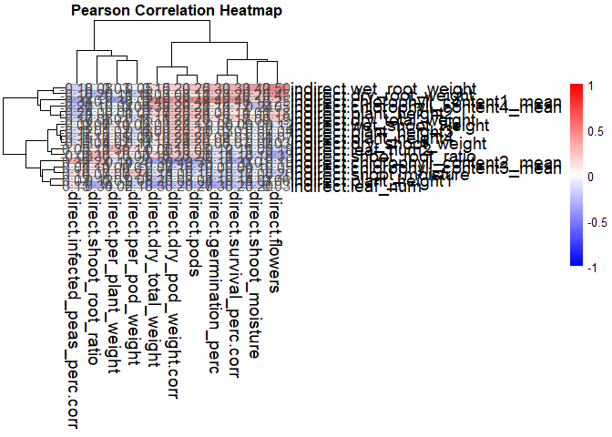<!-- -->

``` r
ggsave(paste0(output_dir, "./corr_plots/corr_heatmap.png"), 
       plot = p,
    width = 12, height = 10, dpi = 400)

## combine quadrant data
quadrant_data <- bind_rows(quadrant_data_list)

# Plot quadrant proportions as bar plots (only for select traits)

# Separate 'pair' into 'Direct' and 'Indirect' traits
quadrant_data_split <- quadrant_data %>%
  separate(pair, into = c("Direct", "Indirect"), sep = " vs ") 

quadrant_data_split <- quadrant_data_split %>%
  rowwise() %>%
  mutate(
    Indirect = str_remove(Indirect, "^direct\\.|^indirect\\."),
    Direct = str_remove(Direct, "^direct\\.|^indirect\\.")
    )

# Filter for partial matches between Direct and Indirect
filtered_quadrant_data <- quadrant_data_split %>%
  filter(str_detect(Direct, regex(Indirect, ignore_case = TRUE)) |
         str_detect(Indirect, regex(Direct, ignore_case = TRUE)))


filtered_quadrant_data$quadrant <- 
  factor(filtered_quadrant_data$quadrant,
         levels = c("D+/I+","D+/I-","D-/I+","D-/I-"))


# Assign colors to levels
colors <- c("D-/I-" = "purple", 
            "D-/I+" = "blue", 
            "D+/I-" = "orange",
            "D+/I+" = "red")


# Define new labels
new_labels <- c("wet_shoot_weight" = "Wet shoot weight",
                "wet_root_weight" = "Wet root weight",
                "dry_shoot_weight" = "Dry shoot weight",
                "dry_total_weight" = "Dry total weight",
                "dry_root_weight" = "Dry root weight",
                "shoot_root_ratio" = "Shoot to root ratio",
                "shoot_moisture" = "Shoot moisture")


## plot
eff_plot <- ggplot(filtered_quadrant_data, aes(x = Direct, 
                                   y = proportion,
                                   fill = quadrant)) +
  geom_bar(stat = "identity") +
  geom_hline(aes(yintercept = 0.5), linetype = 2) +
  scale_fill_manual(
    values = colors) +
  scale_x_discrete(labels = new_labels) +
  labs(x = "Trait", y = "Proportion", fill = "Effect direction") +
  coord_flip() +
  theme_minimal() +
  theme(axis.title.y = element_text(size = 16),
        axis.title.x = element_text(size = 16),
        panel.grid.major = element_blank(),
          panel.grid.minor = element_blank())
eff_plot
```

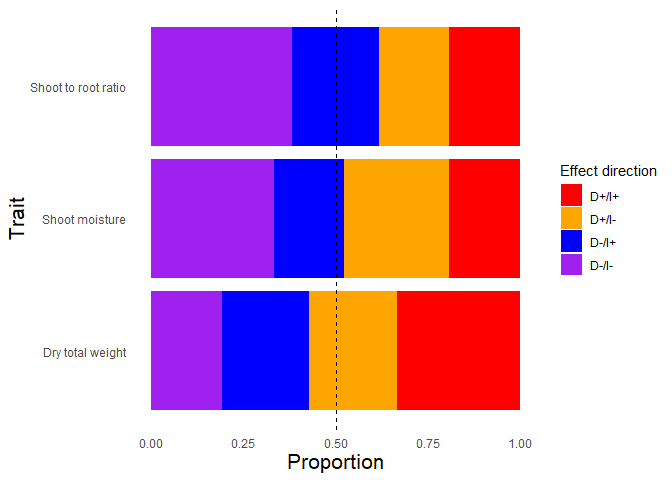<!-- -->

``` r
ggsave(filename = paste0(output_dir, "effect_directions.png"),
       width = 6, height = 3, units = "in")
# Save the plot object
saveRDS(eff_plot, file = paste0(output_dir, "eff_plot.rds"))

## extract correlation results
corr_res <- results_df %>%
  filter(P_value_correlation < 0.1) %>%
  droplevels(.)
  
## correlation plot
corr_plot <- ggplot(direct.p, aes(x = direct.dry_total_weight, 
           y = indirect.chlorophyll_content1_mean, 
           colour = amend_spike)) +
      geom_smooth(method = "lm", se = FALSE, color = "black",
                  linetype = 2) +
      geom_hline(aes(yintercept = 0), linetype = 2) +
      geom_vline(aes(xintercept = 0), linetype = 2) +
      geom_point(size = 3) +
      scale_color_manual(values = c("gray",
                                  "lightblue",
                                  "cornflowerblue",
                                  "blue",
                                  "#EABD8C",
                                  "#FFAD00",
                                  "#B06500"),
                         guide = guide_legend(nrow = 2)) +
      labs(y = "Indirect (Leaf chlorophyll A)",
           x = "Direct (Dry total biomass)",
           color = "Amendment - \n Spiking level",
        subtitle = paste0(
  "R² = ", 
  round(corr_res$R_squared[corr_res$Direct == 
                        "direct.dry_total_weight"],3),
  ", r = ", 
  round(corr_res$Pearson_corr[corr_res$Direct == 
                        "direct.dry_total_weight"],3),
  ", P = ", 
  signif(corr_res$P_value_regression[corr_res$Direct == 
                        "direct.dry_total_weight"],3)
        )) +
      theme_bw() +
  theme(axis.title.y = element_text(size = 16),
        axis.title.x = element_text(size = 16),
        legend.position = "bottom",
        panel.grid.major = element_blank(),
          panel.grid.minor = element_blank())
corr_plot
```

    ## `geom_smooth()` using formula = 'y ~ x'

    ## Warning: Removed 2 rows containing non-finite outside the scale range (`stat_smooth()`).
    ## Removed 2 rows containing missing values or values outside the scale range
    ## (`geom_point()`).

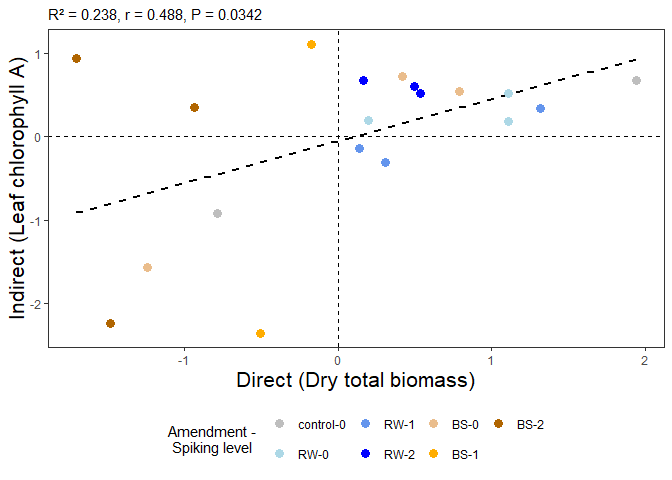<!-- -->

``` r
ggsave(filename = paste0(output_dir, 
                         "effect_corr-D(dryTotalWeight)_vs_I(chloro).png"),
       width = 5, height = 4, units = "in")
```

    ## `geom_smooth()` using formula = 'y ~ x'

    ## Warning: Removed 2 rows containing non-finite outside the scale range (`stat_smooth()`).
    ## Removed 2 rows containing missing values or values outside the scale range
    ## (`geom_point()`).

``` r
# Save the plot object
saveRDS(corr_plot, 
        file = paste0(output_dir,
                      "corr_plot-D(dryTotalWeight)_vs_I(chloro).rds"))
```

#### Post-hoc test Figures

``` r
## figures (contrasts)
load(file = "./indirect_files/models/cont3-amend.Rdata") ## loads cont

## formatting
cont$amend <- ifelse(grepl("BS", cont$contrast, fixed = FALSE),
                      "BS", "RW")

cont$amend <- factor(cont$amend,
                      levels = c("RW",
                                 "BS"))

### sig traits
sig.traits <- c(
  "dry_total_weight",
  "shoot_root_ratio",
  "shoot_moisture",
  "plant_height4")

### filter dataset to sig traits
cont.f <- cont %>%
         filter(trait %in% sig.traits) %>%
         droplevels(.)

cont.f$trait <- factor(cont.f$trait,
          levels = c(#"dry_shoot_weight","dry_root_weight",
         "dry_total_weight", 
         "shoot_root_ratio",
         "shoot_moisture",
         "plant_height4"))

### rename traits
trait_names <- c(
  per_plant_weight = 'Per plant \n biomass (g)',
  dry_shoot_weight = 'Dry shoot \n biomass (g)',
  dry_total_weight = 'Dry total \n biomass (g)',
  dry_root_weight = 'Dry root \n biomass (g)',
  shoot_root_ratio = 'Shoot to \n root ratio',
  shoot_moisture = 'Shoot \n moisture \n (%)',
  germination_perc = 'Germination \n (%)',
  survival_perc.corr = 'Survival \n (%)',
  pods = "Pods (no.)",
  plant_height4 = "Plant height \n (cm)",
  leaf_num2 = "Leaves (no.)"
)

##### Contrasts (amendment type) #####
M1_plot <- ggplot(data = cont.f,
   aes(x = amend, 
       y = log2(ratio), 
       colour = amend)) +
  geom_pointrange(aes(ymin = log2(lower.CL),
                      ymax = log2(upper.CL)),
                  position = position_dodge(0.5)) +
  geom_hline(aes(yintercept = 0),
             linetype = 2) +
  ### add in significance (0.05 <= p < 0.1) 
  geom_text(
    data = cont.f %>% filter(pval >= 0.05 & pval < 0.1),
    aes(x = amend, y = log2FC),
    label = "+",
    size = 6,
    position = position_dodge(0.5),
    vjust = -0.5
  ) +
  ### add in significance (p < 0.05) 
  geom_text(
    data = cont.f %>% filter(pval < 0.05),
    aes(x = amend, y = log2FC),
    label = "*",
    size = 6,
    position = position_dodge(0.5),
    vjust = -0.3
  ) +
  coord_flip() +
   scale_colour_manual(values = c(
                                  "blue",
                                 "#B06500")) +
  facet_grid(trait~., scales = "fixed",
             labeller = labeller(trait = trait_names)) +
  labs(x = "Amendment",
     y = expression(log[2]~"FC (95% CL)")) +
  guides(colour = "none") +
  theme_bw() +
  theme(
    axis.text = element_text(size = 12),
    axis.title.x = element_text(size =  14),
    axis.title.y = element_text(size =  14),
    strip.text.y = element_blank(),
    strip.text.x = element_text(size = 12, face = "bold"),
    panel.grid.major = element_blank(),
    panel.grid.minor = element_blank(),
  )
M1_plot
```

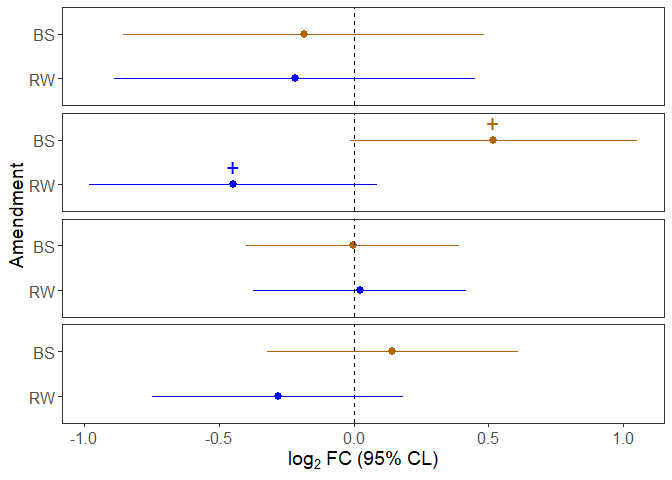<!-- -->

``` r
## M2

## emms (emmeans)
emms <- read_csv("./indirect_files/models/emm4-contam.csv")
```

    ## Rows: 36 Columns: 13
    ## ── Column specification ────────────────────────────────────────────────────────
    ## Delimiter: ","
    ## chr  (2): trait, amend
    ## dbl (11): spikeFac, emmean, SE, df, lower.CL, upper.CL, t.ratio, p.value, as...
    ## 
    ## ℹ Use `spec()` to retrieve the full column specification for this data.
    ## ℹ Specify the column types or set `show_col_types = FALSE` to quiet this message.

``` r
## linear contrasts (to get sig linear trends)
load(file = "./indirect_files/models/cont4-contam.Rdata")

## include non-linear & linear terms
cont.w <- cont %>%
  pivot_wider(
    names_from = contrast,
    values_from = c("Est_CL", "pval"),
    id_cols =  c("amend","trait")
  )

## combine emms and contrasts
emms <- emms %>%
  left_join(
    cont.w %>% select(everything()),
    by = c("amend","trait")
  )

## format
emms$amend <- factor(emms$amend,
                      levels = c("RW",
                                 "BS"))

### filter dataset to sig traits
emms.f <- emms %>%
         filter(trait %in% sig.traits) %>%
         droplevels(.)

## trait order
emms.f$trait <- factor(emms.f$trait,
          levels = c(
         "dry_total_weight", 
         "shoot_root_ratio",
         "shoot_moisture",
         "plant_height4"))

##### Contrasts (contamination level) #####
M2_plot <- ggplot(data = emms.f,
   aes(x = factor(spikeFac), 
       y = emmean, 
       colour = amend)) +
  
  geom_line(aes(group = amend),
            position = position_dodge(0.2)) +
  
  geom_pointrange(aes(ymin = lower.CL,
                      ymax = upper.CL),
                  position = position_dodge(0.2)) +
  
  ### linear: marginal (0.05 <= p < 0.1)
  geom_text(
    data = emms.f %>% filter(spikeFac == 2,
                             pval_linear >= 0.05, pval_linear < 0.1),
    aes(x = factor(spikeFac), y = emmean),
    label = "+", size = 6,
    position = position_dodge(0.5),
    vjust = -0.5
  ) +
  
  ### linear: significant (p < 0.05)
  geom_text(
    data = emms.f %>% filter(spikeFac == 2,
                             pval_linear < 0.05),
    aes(x = factor(spikeFac), y = emmean),
    label = "*", size = 6,
    position = position_dodge(0.5),
    vjust = -0.5
  ) +
  
  ### quadratic: significant (p < 0.05)
  geom_text(
    data = emms.f %>% filter(spikeFac == 0,
                             pval_quadratic < 0.05),
    aes(x = factor(spikeFac), y = emmean),
    label = "*", size = 6,
    position = position_dodge(0.5),
    vjust = -0.5
  ) +
  
  ### quadratic: marginal (0.05 <= p < 0.1)
  geom_text(
    data = emms.f %>% filter(spikeFac == 0,
                             pval_quadratic >= 0.05, pval_quadratic < 0.1),
    aes(x = factor(spikeFac), y = emmean),
    label = "+", size = 6,
    position = position_dodge(0.5),
    vjust = -0.5
  ) +
  
  scale_colour_manual(values = c("blue", "#B06500")) +
  
  facet_grid(trait ~ ., scales = "free",
             labeller = labeller(trait = trait_names)) +
  
  labs(y = expression("EM mean (log scale)"),
       x = "Contaminant level") +
  
  guides(colour = "none") +
  
  ### ⭐ Key additions to prevent clipping of BOTH error bars and annotations
  scale_y_continuous(expand = c(0.05, 0.25)) +   # 5% below, 25% above
  coord_cartesian(clip = "off") +                # allow drawing outside panel
  theme(plot.margin = margin(t = 12, r = 8, b = 12, l = 8)) +
  
  theme_bw() +
  theme(
    axis.text = element_text(size = 12),
    axis.title.x = element_text(size = 14),
    axis.title.y = element_text(size = 14),
    strip.text.y = element_blank(),
    panel.grid.major = element_blank(),
    panel.grid.minor = element_blank()
  )

M2_plot
```

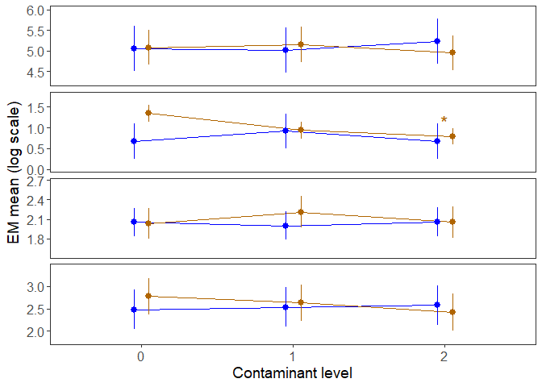<!-- -->

``` r
## combine together
plots <- plot_grid(M1_plot, M2_plot,
                   ncol = 2,
                   rel_widths = c(1, 1),
                   align = "h",
                   labels = c("B","C"))
plots
```

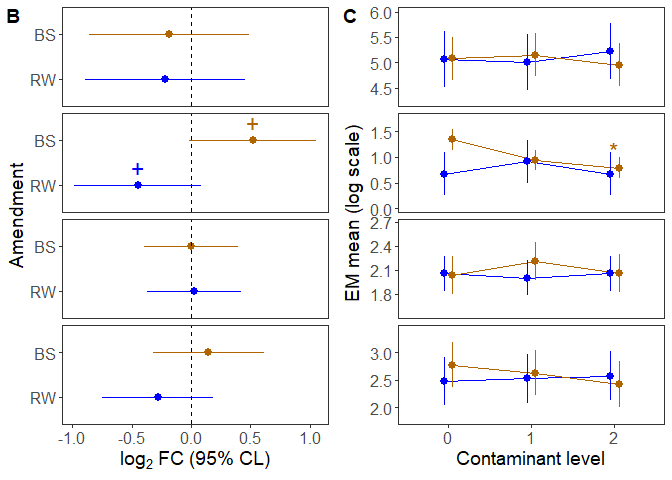<!-- -->

``` r
## save
ggsave("./indirect_files/figs/plots-PHT.png", plot = plots,
       width = 5, height = 6, 
       units = "in")
saveRDS(plots, file = "indirect_files/figs/plot-PHT.rds")
```

### Figures (main text Fig. 3)

``` r
## loaf formatted data file
load(file = "./indirect_files/indirect-formatted.Rda") ## loads indirect

## load emmeans
load(file = "./indirect_files/models/emm1-slurry.means.Rda") ## loads emm.s

## source function
source("./Source_code/18_indirect-plot_emms.func.R")

## traits to run through
trait.list <- c("plant_height4",
                "chlorophyll_content4_mean", 
                "leaf_num2",
                "wet_shoot_weight", 
                "dry_shoot_weight",
                "wet_root_weight", 
                "dry_root_weight",
                "dry_total_weight",
                "shoot_root_ratio",
                "shoot_moisture")

plots.out <- sapply(trait.list, 
                   plot_emms,
                   df = indirect %>%
                     filter(!amend %in% c("saline","no_treat")) %>%
                     droplevels(.),
                   simplify = FALSE, 
                   USE.NAMES = TRUE)
```

    ## [1] "plant_height4"

    ## `summarise()` has grouped output by 'amend_spike', 'amend'. You can override
    ## using the `.groups` argument.
    ## `summarise()` has grouped output by 'amend_spike', 'amend'. You can override
    ## using the `.groups` argument.

    ## [1] "chlorophyll_content4_mean"

    ## `summarise()` has grouped output by 'amend_spike', 'amend'. You can override
    ## using the `.groups` argument.
    ## `summarise()` has grouped output by 'amend_spike', 'amend'. You can override
    ## using the `.groups` argument.

    ## [1] "leaf_num2"

    ## `summarise()` has grouped output by 'amend_spike', 'amend'. You can override
    ## using the `.groups` argument.
    ## `summarise()` has grouped output by 'amend_spike', 'amend'. You can override
    ## using the `.groups` argument.

    ## [1] "wet_shoot_weight"

    ## `summarise()` has grouped output by 'amend_spike', 'amend'. You can override
    ## using the `.groups` argument.
    ## `summarise()` has grouped output by 'amend_spike', 'amend'. You can override
    ## using the `.groups` argument.

    ## [1] "dry_shoot_weight"

    ## `summarise()` has grouped output by 'amend_spike', 'amend'. You can override
    ## using the `.groups` argument.
    ## `summarise()` has grouped output by 'amend_spike', 'amend'. You can override
    ## using the `.groups` argument.

    ## [1] "wet_root_weight"

    ## `summarise()` has grouped output by 'amend_spike', 'amend'. You can override
    ## using the `.groups` argument.
    ## `summarise()` has grouped output by 'amend_spike', 'amend'. You can override
    ## using the `.groups` argument.

    ## [1] "dry_root_weight"

    ## `summarise()` has grouped output by 'amend_spike', 'amend'. You can override
    ## using the `.groups` argument.
    ## `summarise()` has grouped output by 'amend_spike', 'amend'. You can override
    ## using the `.groups` argument.

    ## [1] "dry_total_weight"

    ## `summarise()` has grouped output by 'amend_spike', 'amend'. You can override
    ## using the `.groups` argument.
    ## `summarise()` has grouped output by 'amend_spike', 'amend'. You can override
    ## using the `.groups` argument.

    ## [1] "shoot_root_ratio"

    ## `summarise()` has grouped output by 'amend_spike', 'amend'. You can override
    ## using the `.groups` argument.
    ## `summarise()` has grouped output by 'amend_spike', 'amend'. You can override
    ## using the `.groups` argument.

    ## [1] "shoot_moisture"

    ## `summarise()` has grouped output by 'amend_spike', 'amend'. You can override
    ## using the `.groups` argument.
    ## `summarise()` has grouped output by 'amend_spike', 'amend'. You can override
    ## using the `.groups` argument.

``` r
##### Raw data (peas-only) #####
fig1 <- plot_grid(plots.out[["dry_total_weight"]] +
                    labs(y = "Dry total \n biomass (g)"),
                  plots.out[["shoot_root_ratio"]] +
                    labs(y = "Shoot to \n root ratio"),
                  plots.out[["shoot_moisture"]] +
                    labs(y = "Shoot \n moisture (%)"),
                  plots.out[["plant_height4"]] +
                    labs(y = "Plant height \n (cm)") +
                    theme(axis.title.x = element_text(
                      size = 14),
                      axis.text.x = element_text(
                      size = 12)),
          ncol = 1,
          nrow = 4,
          align = "v",
          rel_heights = c(0.9,0.9,0.9,1.1),
          labels = NULL)
fig1
```

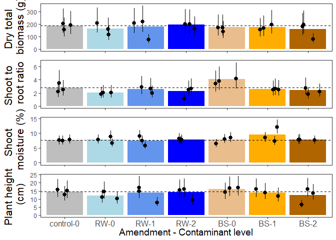<!-- -->

``` r
ggsave("./indirect_files/figs/raw_peas.png",
       width=5, height=8, units = "in")

# ## stitch together with effect comparisons
corr_plot <- 
  readRDS("./indirect_files/figs/corr_plot-D(dryTotalWeight)_vs_I(chloro).rds")
# eff_plot <- readRDS("./indirect_files/figs/eff_plot.rds")
trait_plot <- 
  readRDS(file = "./indirect_files/figs/height_vs_time.rds")
PHT_plot <-
  readRDS(file = "./indirect_files/figs/plot-PHT.rds")

## combine
fig <- plot_grid(
  fig1,
  PHT_plot,
  ncol = 2,
  rel_widths = c(1, 1),  # reduce height for legend
  labels = c("A", "")
)
fig
```

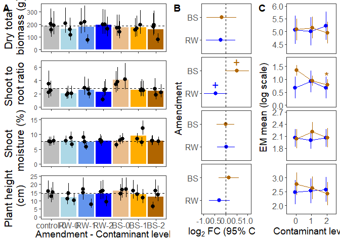<!-- -->

``` r
## save
ggsave("./indirect_files/figs/Fig3.png", plot = fig,
       width=10, height=6, units = "in")
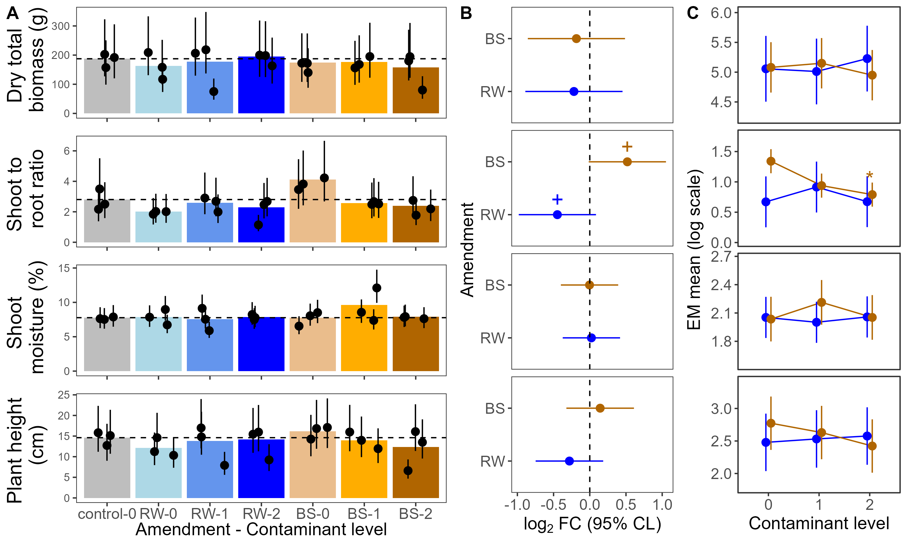
```


