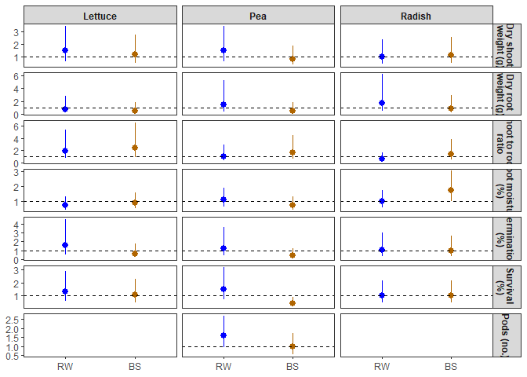

stat_analyses
================
RTD, II
2025-07-24

## Direct impacts of contaminants on crop growth

What impacts do amendments spiked with different levels of contaminants
have on plant traits, and are these impacts crop-species dependent?

Experimental design:

- Crossed two amendment types (biosolids \[BS\] and reclaimed water
  \[RW\]) with three contaminant spiking levels (0 \[no spiking\], 1
  \[ecologically relevant concentrations\], and 2 \[higher than
  ecological concentrations, to detect in plant tissues downstream\]).
- Exposed the resulting six treatments to each of three crop species
  commonly used in agriculture (lettuce, radish, and green peas), each
  growing separately in pots, resulting in a total of 18 treatment
  combinations (2 amendments x 3 spiking levels x 3 crop species).
- To account for environmental heterogeneity in growth conditions across
  the greenhouse, each treatment combination was spatially replicated
  three times, for a total of 54 experimental units (i.e., pots).
- Finally, we included nine controls in which no amendments were added,
  for a total of 63 pots (n = 3 controls per crop species x 3 crops = 9
  pots).

Traits measured:

- Post-planting:
  - Germination rates (proportion of germinated seeds out of total
    number of seeds planted)
  - Survival rates (proportion of plants that survived out of total
    number of seeds planted)  
- At harvest:
  - Normalized Difference Vegetation Index (NDVI) value, which reflects
    leaf chlorophyll A content and is a close correlate of nitrogen
    content,
  - Above- and below-ground wet and dry biomass
- For peas only:
  - Wet and dry pod weights (the portion of the plant most relevant to
    agricultural yield).
  - Number of flowers and pods
  - Infection rate (proportion of plants infected by fungus out of
    total)

### Load data

``` r
direct <- read_csv("./direct-updated.csv")
```

    ## Rows: 63 Columns: 23
    ## ── Column specification ────────────────────────────────────────────────────────
    ## Delimiter: ","
    ## chr   (4): species, source, treat, dry_shoot_weight_notes
    ## dbl  (17): sample_ID, spiking_level, plants, wet_shoot_weight, dry_shoot_wei...
    ## date  (2): planting_date1, planting_date2
    ## 
    ## ℹ Use `spec()` to retrieve the full column specification for this data.
    ## ℹ Specify the column types or set `show_col_types = FALSE` to quiet this message.

``` r
## calculate other traits
direct <- direct %>%
  mutate(seeds_planted_total = 
           rowSums(across(c(seeds_planted1, seeds_planted2)),
                                       na.rm=TRUE),
         seeds_germinated_total = 
           rowSums(across(c(seeds_germinated, seeds_germinated2)),
                                       na.rm=TRUE),
         germination_perc = (seeds_germinated_total / 
                               seeds_planted_total)*100,
         dry_total_weight = rowSums(across(c(dry_shoot_weight, 
                                             dry_root_weight))),
         shoot_root_ratio = dry_shoot_weight / dry_root_weight,
         shoot_moisture = (wet_shoot_weight - dry_shoot_weight) / 
           dry_shoot_weight,
         per_plant_weight = dry_total_weight / plants,
         survival_perc = (plants / seeds_planted_total) * 100,
         infected_peas_perc = (infected_peas/seeds_planted_total)*100
         )

## Code factors

### specify spiking level as an ordered factor
direct$spikeFac <- factor(direct$spiking_level,
                          levels = c("0","1","2"),
                          ordered = TRUE)

### rename source to be consistent with indirect
direct$contam <- ifelse(
  is.na(direct$source) == TRUE, "control",
                        ifelse(
                          direct$source ==
                            "effluents","RW",
                               "BS"))

direct$contam <- factor(direct$contam,
                        levels = c(
                          "control",
                          "RW",
                          "BS"
                        ))

### spiking level plus contam
direct$contam_spike <- paste0(direct$contam, 
                                "-", 
                                direct$spiking_level)

### treatment
direct$contam_spike <- factor(direct$contam_spike, 
                                levels = c("control-0",
                                           "RW-0",
                                           "RW-1",
                                           "RW-2",
                                           "BS-0",
                                           "BS-1",
                                           "BS-2"
                                           ),
                              ordered = TRUE)

## save formatted data file
save(direct, file = "./direct-formatted.Rda")
```

### Figures (raw data)

``` r
load(file = "./direct-formatted.Rda") ## loads direct

## plots (traits at harvest)

### traits to run through (all crops)
trait.list1 <- c(
                "wet_shoot_weight", 
                "dry_shoot_weight",
                "wet_root_weight", 
                "dry_root_weight",
                "shoot_root_ratio",
                "dry_total_weight",
                "per_plant_weight",
                "shoot_moisture",
                "germination_perc",
                "survival_perc"
                )

## source function
source("./Source_code/plot_raw_data_func.R")

## plotting function
plots.out1 <- sapply(trait.list1, 
                     plot_raw_data_func,
                     df = direct,
                   simplify = FALSE, 
                   USE.NAMES = TRUE)
```

    ## [1] "wet_shoot_weight"

    ## `summarise()` has grouped output by 'species', 'contam_spike', 'contam'. You
    ## can override using the `.groups` argument.
    ## `summarise()` has grouped output by 'species', 'contam_spike', 'contam'. You
    ## can override using the `.groups` argument.

    ## [1] "dry_shoot_weight"

    ## `summarise()` has grouped output by 'species', 'contam_spike', 'contam'. You
    ## can override using the `.groups` argument.
    ## `summarise()` has grouped output by 'species', 'contam_spike', 'contam'. You
    ## can override using the `.groups` argument.

    ## [1] "wet_root_weight"

    ## `summarise()` has grouped output by 'species', 'contam_spike', 'contam'. You
    ## can override using the `.groups` argument.
    ## `summarise()` has grouped output by 'species', 'contam_spike', 'contam'. You
    ## can override using the `.groups` argument.

    ## [1] "dry_root_weight"

    ## `summarise()` has grouped output by 'species', 'contam_spike', 'contam'. You
    ## can override using the `.groups` argument.
    ## `summarise()` has grouped output by 'species', 'contam_spike', 'contam'. You
    ## can override using the `.groups` argument.

    ## [1] "shoot_root_ratio"

    ## `summarise()` has grouped output by 'species', 'contam_spike', 'contam'. You
    ## can override using the `.groups` argument.
    ## `summarise()` has grouped output by 'species', 'contam_spike', 'contam'. You
    ## can override using the `.groups` argument.

    ## [1] "dry_total_weight"

    ## `summarise()` has grouped output by 'species', 'contam_spike', 'contam'. You
    ## can override using the `.groups` argument.
    ## `summarise()` has grouped output by 'species', 'contam_spike', 'contam'. You
    ## can override using the `.groups` argument.

    ## [1] "per_plant_weight"

    ## `summarise()` has grouped output by 'species', 'contam_spike', 'contam'. You
    ## can override using the `.groups` argument.
    ## `summarise()` has grouped output by 'species', 'contam_spike', 'contam'. You
    ## can override using the `.groups` argument.

    ## [1] "shoot_moisture"

    ## `summarise()` has grouped output by 'species', 'contam_spike', 'contam'. You
    ## can override using the `.groups` argument.
    ## `summarise()` has grouped output by 'species', 'contam_spike', 'contam'. You
    ## can override using the `.groups` argument.

    ## [1] "germination_perc"

    ## `summarise()` has grouped output by 'species', 'contam_spike', 'contam'. You
    ## can override using the `.groups` argument.
    ## `summarise()` has grouped output by 'species', 'contam_spike', 'contam'. You
    ## can override using the `.groups` argument.

    ## [1] "survival_perc"

    ## `summarise()` has grouped output by 'species', 'contam_spike', 'contam'. You
    ## can override using the `.groups` argument.
    ## `summarise()` has grouped output by 'species', 'contam_spike', 'contam'. You
    ## can override using the `.groups` argument.

``` r
## peas only

### traits to run through (peas only)
trait.list2 <- c(
                "wet_pod_weight",
                "dry_pod_weight",
                "pods",
                "flowers",
                "infected_peas_perc"
                )

## source function
source("./Source_code/plot_raw_data.peas_func.R")

## plotting function
plots.out2 <- sapply(trait.list2,
                    plot_raw_data.peas_func,
                    df = direct,
                   simplify = FALSE, 
                   USE.NAMES = TRUE)
```

    ## [1] "wet_pod_weight"

    ## `summarise()` has grouped output by 'species', 'contam_spike', 'contam'. You
    ## can override using the `.groups` argument.
    ## `summarise()` has grouped output by 'species', 'contam_spike', 'contam'. You
    ## can override using the `.groups` argument.

    ## [1] "dry_pod_weight"

    ## `summarise()` has grouped output by 'species', 'contam_spike', 'contam'. You
    ## can override using the `.groups` argument.
    ## `summarise()` has grouped output by 'species', 'contam_spike', 'contam'. You
    ## can override using the `.groups` argument.

    ## [1] "pods"

    ## `summarise()` has grouped output by 'species', 'contam_spike', 'contam'. You
    ## can override using the `.groups` argument.
    ## `summarise()` has grouped output by 'species', 'contam_spike', 'contam'. You
    ## can override using the `.groups` argument.

    ## [1] "flowers"

    ## `summarise()` has grouped output by 'species', 'contam_spike', 'contam'. You
    ## can override using the `.groups` argument.
    ## `summarise()` has grouped output by 'species', 'contam_spike', 'contam'. You
    ## can override using the `.groups` argument.

    ## [1] "infected_peas_perc"

    ## `summarise()` has grouped output by 'species', 'contam_spike', 'contam'. You
    ## can override using the `.groups` argument.
    ## `summarise()` has grouped output by 'species', 'contam_spike', 'contam'. You
    ## can override using the `.groups` argument.

``` r
## combine plots (all crops)
fig1 <- plot_grid(plots.out1[["dry_shoot_weight"]] +
                    labs(y = "Dry shoot \n weight (g)"),
                  plots.out1[["dry_root_weight"]] +
                    labs(y = "Dry root \n weight (g)"),
                  plots.out1[["shoot_root_ratio"]] +
                    labs(y = "Shoot:root \n ratio"),
                  plots.out1[["shoot_moisture"]] +
                    labs(y = "Shoot moisture"),
                  plots.out1[["survival_perc"]] +
                    labs(y = "Survival (%)"),
          ncol = 1,
          nrow = 5,
          align = "hv",
          labels = NULL)
```

    ## Warning: Removed 1 row containing missing values or values outside the scale range
    ## (`geom_point()`).
    ## Removed 1 row containing missing values or values outside the scale range
    ## (`geom_point()`).
    ## Removed 1 row containing missing values or values outside the scale range
    ## (`geom_point()`).
    ## Removed 1 row containing missing values or values outside the scale range
    ## (`geom_point()`).

``` r
## combine plots (peas only)
fig2 <- plot_grid(plots.out2[["dry_pod_weight"]] +
                    labs(y = "Dry pod \n weight (g)"),
                  plots.out2[["infected_peas_perc"]] +
                    labs(y = "Peas Infected (%)"),
          ncol = 2,
          nrow = 1,
          align = "hv",
          labels = NULL)
```

    ## Warning: Removed 1 row containing missing values or values outside the scale range
    ## (`geom_point()`).

``` r
## combine plots
fig <- plot_grid(fig1, fig2,
          ncol = 1,
          nrow = 2,
          rel_heights = c(0.8,0.2),
          align = "hv",
          labels = NULL)

save_plot("./raw_data-direct.png", fig,
          ncol = 2, 
          nrow = 5,
          base_aspect_ratio = 1.3)
```

## Models

### Model 1

Impact of amendment type on plant traits, compared across different crop
species

Include controls. Limit to Spiking level 0 (no additional contaminants
added)

``` r
## load data
load(file = "./direct-formatted.Rda") ## loads direct

## set contrasts for ANOVA
options(contrasts=c("contr.sum","contr.poly")) 

### add 1's to survival (to take log)
direct$survival_perc.corr <- direct$survival_perc + 1

### traits to run through (non-peas)
trait.list1 <- c(
                "wet_shoot_weight", 
                "dry_shoot_weight",
                "wet_root_weight", 
                "dry_root_weight",
                "shoot_root_ratio",
                "dry_total_weight",
                "per_plant_weight",
                "shoot_moisture",
                "germination_perc",
                "survival_perc.corr"
                )

## source function
source("./Source_code/lmm1_func.R")

## model
mod1.out <- sapply(trait.list1, 
                   lmm1_func,
                   df = direct,
                   simplify = FALSE, 
                   USE.NAMES = TRUE)
```

    ## [1] "wet_shoot_weight"

    ## 
    ## Call:
    ## lm(formula = log(get(traits)) ~ species * contam, data = df.f)
    ## 
    ## Residuals:
    ##      Min       1Q   Median       3Q      Max 
    ## -1.52222 -0.15219 -0.02159  0.13074  0.95952 
    ## 
    ## Coefficients:
    ##                  Estimate Std. Error t value Pr(>|t|)    
    ## (Intercept)       4.88480    0.09558  51.108  < 2e-16 ***
    ## species1          0.68092    0.13517   5.038 8.56e-05 ***
    ## species2         -1.01917    0.13517  -7.540 5.64e-07 ***
    ## contam1          -0.09150    0.13517  -0.677   0.5070    
    ## contam2           0.10434    0.13517   0.772   0.4502    
    ## species1:contam1  0.02726    0.19116   0.143   0.8882    
    ## species2:contam1  0.08651    0.19116   0.453   0.6563    
    ## species1:contam2 -0.04451    0.19116  -0.233   0.8185    
    ## species2:contam2  0.35699    0.19116   1.868   0.0782 .  
    ## ---
    ## Signif. codes:  0 '***' 0.001 '**' 0.01 '*' 0.05 '.' 0.1 ' ' 1
    ## 
    ## Residual standard error: 0.4966 on 18 degrees of freedom
    ## Multiple R-squared:  0.7891, Adjusted R-squared:  0.6953 
    ## F-statistic: 8.416 on 8 and 18 DF,  p-value: 9.693e-05

    ## Warning in ref_grid(lmm): There are unevaluated constants in the response formula
    ## Auto-detection of the response transformation may be incorrect

    ## [1] "dry_shoot_weight"

    ## 
    ## Call:
    ## lm(formula = log(get(traits)) ~ species * contam, data = df.f)
    ## 
    ## Residuals:
    ##     Min      1Q  Median      3Q     Max 
    ## -1.0716 -0.1792  0.0570  0.1322  0.7728 
    ## 
    ## Coefficients:
    ##                  Estimate Std. Error t value Pr(>|t|)    
    ## (Intercept)       1.96308    0.08222  23.875 4.44e-15 ***
    ## species1          0.50523    0.11628   4.345 0.000390 ***
    ## species2         -0.49420    0.11628  -4.250 0.000482 ***
    ## contam1          -0.09523    0.11628  -0.819 0.423534    
    ## contam2           0.16981    0.11628   1.460 0.161425    
    ## species1:contam1 -0.09487    0.16445  -0.577 0.571154    
    ## species2:contam1  0.03267    0.16445   0.199 0.844742    
    ## species1:contam2  0.03440    0.16445   0.209 0.836656    
    ## species2:contam2  0.15940    0.16445   0.969 0.345234    
    ## ---
    ## Signif. codes:  0 '***' 0.001 '**' 0.01 '*' 0.05 '.' 0.1 ' ' 1
    ## 
    ## Residual standard error: 0.4272 on 18 degrees of freedom
    ## Multiple R-squared:  0.6171, Adjusted R-squared:  0.4469 
    ## F-statistic: 3.626 on 8 and 18 DF,  p-value: 0.01105

    ## Warning in ref_grid(lmm): There are unevaluated constants in the response formula
    ## Auto-detection of the response transformation may be incorrect

    ## [1] "wet_root_weight"

    ## 
    ## Call:
    ## lm(formula = log(get(traits)) ~ species * contam, data = df.f)
    ## 
    ## Residuals:
    ##      Min       1Q   Median       3Q      Max 
    ## -1.58499 -0.24166  0.03554  0.34942  0.99523 
    ## 
    ## Coefficients:
    ##                   Estimate Std. Error t value Pr(>|t|)    
    ## (Intercept)       2.171564   0.120084  18.084 5.44e-13 ***
    ## species1          0.610482   0.169825   3.595  0.00207 ** 
    ## species2         -1.472416   0.169825  -8.670 7.65e-08 ***
    ## contam1           0.043380   0.169825   0.255  0.80128    
    ## contam2           0.136457   0.169825   0.804  0.43216    
    ## species1:contam1 -0.005192   0.240169  -0.022  0.98299    
    ## species2:contam1  0.147956   0.240169   0.616  0.54557    
    ## species1:contam2 -0.450850   0.240169  -1.877  0.07679 .  
    ## species2:contam2  0.395804   0.240169   1.648  0.11669    
    ## ---
    ## Signif. codes:  0 '***' 0.001 '**' 0.01 '*' 0.05 '.' 0.1 ' ' 1
    ## 
    ## Residual standard error: 0.624 on 18 degrees of freedom
    ## Multiple R-squared:  0.8239, Adjusted R-squared:  0.7456 
    ## F-statistic: 10.52 on 8 and 18 DF,  p-value: 2.142e-05

    ## Warning in ref_grid(lmm): There are unevaluated constants in the response formula
    ## Auto-detection of the response transformation may be incorrect

    ## [1] "dry_root_weight"

    ## 
    ## Call:
    ## lm(formula = log(get(traits)) ~ species * contam, data = df.f)
    ## 
    ## Residuals:
    ##     Min      1Q  Median      3Q     Max 
    ## -0.8766 -0.3824 -0.1751  0.4883  1.3190 
    ## 
    ## Coefficients:
    ##                    Estimate Std. Error t value Pr(>|t|)    
    ## (Intercept)      -0.4747539  0.1288483  -3.685   0.0017 ** 
    ## species1          0.1818721  0.1822190   0.998   0.3315    
    ## species2         -1.1582719  0.1822190  -6.356 5.48e-06 ***
    ## contam1           0.1130726  0.1822190   0.621   0.5427    
    ## contam2           0.3058492  0.1822190   1.678   0.1105    
    ## species1:contam1  0.2078262  0.2576965   0.806   0.4305    
    ## species2:contam1  0.0008393  0.2576965   0.003   0.9974    
    ## species1:contam2 -0.2617389  0.2576965  -1.016   0.3232    
    ## species2:contam2  0.1541221  0.2576965   0.598   0.5572    
    ## ---
    ## Signif. codes:  0 '***' 0.001 '**' 0.01 '*' 0.05 '.' 0.1 ' ' 1
    ## 
    ## Residual standard error: 0.6695 on 18 degrees of freedom
    ## Multiple R-squared:  0.7497, Adjusted R-squared:  0.6385 
    ## F-statistic: 6.741 on 8 and 18 DF,  p-value: 0.000395

    ## Warning in ref_grid(lmm): There are unevaluated constants in the response formula
    ## Auto-detection of the response transformation may be incorrect

    ## [1] "shoot_root_ratio"

    ## 
    ## Call:
    ## lm(formula = log(get(traits)) ~ species * contam, data = df.f)
    ## 
    ## Residuals:
    ##      Min       1Q   Median       3Q      Max 
    ## -0.72864 -0.29155 -0.05589  0.28939  0.92363 
    ## 
    ## Coefficients:
    ##                   Estimate Std. Error t value Pr(>|t|)    
    ## (Intercept)       2.437834   0.098752  24.686 2.47e-15 ***
    ## species1          0.323363   0.139657   2.315 0.032594 *  
    ## species2          0.664071   0.139657   4.755 0.000158 ***
    ## contam1          -0.208299   0.139657  -1.492 0.153147    
    ## contam2          -0.136038   0.139657  -0.974 0.342924    
    ## species1:contam1 -0.302694   0.197504  -1.533 0.142763    
    ## species2:contam1  0.031832   0.197504   0.161 0.873753    
    ## species1:contam2  0.296138   0.197504   1.499 0.151105    
    ## species2:contam2  0.005277   0.197504   0.027 0.978979    
    ## ---
    ## Signif. codes:  0 '***' 0.001 '**' 0.01 '*' 0.05 '.' 0.1 ' ' 1
    ## 
    ## Residual standard error: 0.5131 on 18 degrees of freedom
    ## Multiple R-squared:  0.7753, Adjusted R-squared:  0.6754 
    ## F-statistic: 7.762 on 8 and 18 DF,  p-value: 0.0001636

    ## Warning in ref_grid(lmm): There are unevaluated constants in the response formula
    ## Auto-detection of the response transformation may be incorrect

    ## [1] "dry_total_weight"

    ## 
    ## Call:
    ## lm(formula = log(get(traits)) ~ species * contam, data = df.f)
    ## 
    ## Residuals:
    ##      Min       1Q   Median       3Q      Max 
    ## -1.07172 -0.19932  0.00523  0.16221  0.77755 
    ## 
    ## Coefficients:
    ##                  Estimate Std. Error t value Pr(>|t|)    
    ## (Intercept)       2.08092    0.08387  24.811 2.27e-15 ***
    ## species1          0.45731    0.11861   3.856 0.001159 ** 
    ## species2         -0.56371    0.11861  -4.753 0.000159 ***
    ## contam1          -0.08748    0.11861  -0.738 0.470290    
    ## contam2           0.20058    0.11861   1.691 0.108061    
    ## species1:contam1 -0.06276    0.16774  -0.374 0.712671    
    ## species2:contam1  0.03193    0.16774   0.190 0.851146    
    ## species1:contam2 -0.01234    0.16774  -0.074 0.942186    
    ## species2:contam2  0.13038    0.16774   0.777 0.447098    
    ## ---
    ## Signif. codes:  0 '***' 0.001 '**' 0.01 '*' 0.05 '.' 0.1 ' ' 1
    ## 
    ## Residual standard error: 0.4358 on 18 degrees of freedom
    ## Multiple R-squared:  0.6218, Adjusted R-squared:  0.4537 
    ## F-statistic: 3.699 on 8 and 18 DF,  p-value: 0.01009

    ## Warning in ref_grid(lmm): There are unevaluated constants in the response formula
    ## Auto-detection of the response transformation may be incorrect

    ## [1] "per_plant_weight"

    ## 
    ## Call:
    ## lm(formula = log(get(traits)) ~ species * contam, data = df.f)
    ## 
    ## Residuals:
    ##      Min       1Q   Median       3Q      Max 
    ## -0.64438 -0.11483 -0.03029  0.12545  0.33659 
    ## 
    ## Coefficients:
    ##                   Estimate Std. Error t value Pr(>|t|)    
    ## (Intercept)      -0.456823   0.050192  -9.102 3.73e-08 ***
    ## species1          0.559102   0.070982   7.877 3.06e-07 ***
    ## species2         -0.495193   0.070982  -6.976 1.63e-06 ***
    ## contam1          -0.004375   0.070982  -0.062    0.952    
    ## contam2           0.051207   0.070982   0.721    0.480    
    ## species1:contam1  0.074621   0.100383   0.743    0.467    
    ## species2:contam1 -0.022339   0.100383  -0.223    0.826    
    ## species1:contam2  0.061403   0.100383   0.612    0.548    
    ## species2:contam2 -0.092734   0.100383  -0.924    0.368    
    ## ---
    ## Signif. codes:  0 '***' 0.001 '**' 0.01 '*' 0.05 '.' 0.1 ' ' 1
    ## 
    ## Residual standard error: 0.2608 on 18 degrees of freedom
    ## Multiple R-squared:  0.8113, Adjusted R-squared:  0.7274 
    ## F-statistic: 9.673 on 8 and 18 DF,  p-value: 3.825e-05

    ## Warning in ref_grid(lmm): There are unevaluated constants in the response formula
    ## Auto-detection of the response transformation may be incorrect

    ## [1] "shoot_moisture"

    ## 
    ## Call:
    ## lm(formula = log(get(traits)) ~ species * contam, data = df.f)
    ## 
    ## Residuals:
    ##      Min       1Q   Median       3Q      Max 
    ## -0.51349 -0.06301  0.03570  0.07064  0.53440 
    ## 
    ## Coefficients:
    ##                   Estimate Std. Error t value Pr(>|t|)    
    ## (Intercept)       2.858527   0.054686  52.272  < 2e-16 ***
    ## species1          0.191965   0.077338   2.482   0.0231 *  
    ## species2         -0.563581   0.077338  -7.287 9.01e-07 ***
    ## contam1           0.005657   0.077338   0.073   0.9425    
    ## contam2          -0.063951   0.077338  -0.827   0.4191    
    ## species1:contam1  0.126225   0.109372   1.154   0.2636    
    ## species2:contam1  0.059625   0.109372   0.545   0.5923    
    ## species1:contam2 -0.087148   0.109372  -0.797   0.4360    
    ## species2:contam2  0.213285   0.109372   1.950   0.0669 .  
    ## ---
    ## Signif. codes:  0 '***' 0.001 '**' 0.01 '*' 0.05 '.' 0.1 ' ' 1
    ## 
    ## Residual standard error: 0.2842 on 18 degrees of freedom
    ## Multiple R-squared:  0.7876, Adjusted R-squared:  0.6932 
    ## F-statistic: 8.344 on 8 and 18 DF,  p-value: 0.0001025

    ## Warning in ref_grid(lmm): There are unevaluated constants in the response formula
    ## Auto-detection of the response transformation may be incorrect

    ## [1] "germination_perc"

    ## 
    ## Call:
    ## lm(formula = log(get(traits)) ~ species * contam, data = df.f)
    ## 
    ## Residuals:
    ##      Min       1Q   Median       3Q      Max 
    ## -1.30513 -0.06086 -0.01687  0.11643  1.10619 
    ## 
    ## Coefficients:
    ##                   Estimate Std. Error t value Pr(>|t|)    
    ## (Intercept)       4.277948   0.103945  41.156   <2e-16 ***
    ## species1         -0.007792   0.147001  -0.053   0.9583    
    ## species2         -0.236068   0.147001  -1.606   0.1257    
    ## contam1           0.083053   0.147001   0.565   0.5791    
    ## contam2           0.314071   0.147001   2.137   0.0466 *  
    ## species1:contam1 -0.068866   0.207891  -0.331   0.7443    
    ## species2:contam1  0.138797   0.207891   0.668   0.5128    
    ## species1:contam2  0.143518   0.207891   0.690   0.4988    
    ## species2:contam2  0.121386   0.207891   0.584   0.5665    
    ## ---
    ## Signif. codes:  0 '***' 0.001 '**' 0.01 '*' 0.05 '.' 0.1 ' ' 1
    ## 
    ## Residual standard error: 0.5401 on 18 degrees of freedom
    ## Multiple R-squared:  0.454,  Adjusted R-squared:  0.2113 
    ## F-statistic: 1.871 on 8 and 18 DF,  p-value: 0.1286

    ## Warning in ref_grid(lmm): There are unevaluated constants in the response formula
    ## Auto-detection of the response transformation may be incorrect

    ## [1] "survival_perc.corr"

    ## 
    ## Call:
    ## lm(formula = log(get(traits)) ~ species * contam, data = df.f)
    ## 
    ## Residuals:
    ##      Min       1Q   Median       3Q      Max 
    ## -1.04496 -0.02643  0.00000  0.06932  0.66853 
    ## 
    ## Coefficients:
    ##                  Estimate Std. Error t value Pr(>|t|)    
    ## (Intercept)       4.16386    0.07394  56.312  < 2e-16 ***
    ## species1          0.30252    0.10457   2.893 0.009691 ** 
    ## species2         -0.46940    0.10457  -4.489 0.000284 ***
    ## contam1           0.01267    0.10457   0.121 0.904910    
    ## contam2           0.24112    0.10457   2.306 0.033233 *  
    ## species1:contam1 -0.13006    0.14788  -0.879 0.390735    
    ## species2:contam1  0.14273    0.14788   0.965 0.347262    
    ## species1:contam2 -0.06595    0.14788  -0.446 0.660942    
    ## species2:contam2  0.30707    0.14788   2.076 0.052452 .  
    ## ---
    ## Signif. codes:  0 '***' 0.001 '**' 0.01 '*' 0.05 '.' 0.1 ' ' 1
    ## 
    ## Residual standard error: 0.3842 on 18 degrees of freedom
    ## Multiple R-squared:  0.6805, Adjusted R-squared:  0.5385 
    ## F-statistic: 4.793 on 8 and 18 DF,  p-value: 0.002773

    ## Warning in ref_grid(lmm): There are unevaluated constants in the response formula
    ## Auto-detection of the response transformation may be incorrect

``` r
## combine dfs
### ANOVAs
aov <- lapply(mod1.out, `[[`, 1) %>%
  bind_rows(.)
write.csv(aov, "./model_outputs/direct/aov1.csv", 
          row.names = FALSE)
### emmeans
emm <- lapply(mod1.out, `[[`, 2) %>%
  bind_rows(.)
write.csv(emm, "./model_outputs/direct/emm1.csv", 
          row.names = FALSE)
### CONTRASTS
cont <- lapply(mod1.out, `[[`, 3) %>%
  bind_rows(.)
write.csv(cont, "./model_outputs/direct/cont1.csv", 
          row.names = FALSE)

## peas only

### add 1's to infected
direct$infected_peas_perc.corr <- 
  ifelse(is.na(direct$infected_peas_perc) == FALSE,
                                         direct$infected_peas_perc + 1,
                                         NA)

### traits to run through (peas only)
trait.list2 <- c("wet_pod_weight",
                "dry_pod_weight",
                "infected_peas_perc.corr",
                "pods",
                "flowers"
                )

## source function
source("./Source_code/lmm1.peas_func.R")

## model
mod1_peas.out <- sapply(trait.list2, 
                   lmm1.peas_func,
                   df = direct,
                   simplify = FALSE, 
                   USE.NAMES = TRUE)
```

    ## [1] "wet_pod_weight"

    ## 
    ## Call:
    ## lm(formula = log(get(traits)) ~ contam, data = df.f)
    ## 
    ## Residuals:
    ##     Min      1Q  Median      3Q     Max 
    ## -1.5951 -0.2590  0.1513  0.1944  1.4006 
    ## 
    ## Coefficients:
    ##             Estimate Std. Error t value Pr(>|t|)    
    ## (Intercept)   2.1995     0.3665   6.002 0.000963 ***
    ## contam1      -0.2124     0.5183  -0.410 0.696218    
    ## contam2       0.5403     0.5183   1.043 0.337344    
    ## ---
    ## Signif. codes:  0 '***' 0.001 '**' 0.01 '*' 0.05 '.' 0.1 ' ' 1
    ## 
    ## Residual standard error: 1.099 on 6 degrees of freedom
    ## Multiple R-squared:  0.1553, Adjusted R-squared:  -0.1262 
    ## F-statistic: 0.5517 on 2 and 6 DF,  p-value: 0.6026

    ## Warning in ref_grid(lmm): There are unevaluated constants in the response formula
    ## Auto-detection of the response transformation may be incorrect

    ## [1] "dry_pod_weight"

    ## 
    ## Call:
    ## lm(formula = log(get(traits)) ~ contam, data = df.f)
    ## 
    ## Residuals:
    ##     Min      1Q  Median      3Q     Max 
    ## -1.5056 -0.3271  0.0708  0.2429  1.4348 
    ## 
    ## Coefficients:
    ##             Estimate Std. Error t value Pr(>|t|)
    ## (Intercept)   0.3487     0.3383   1.031    0.342
    ## contam1      -0.2807     0.4784  -0.587    0.579
    ## contam2       0.5155     0.4784   1.078    0.323
    ## 
    ## Residual standard error: 1.015 on 6 degrees of freedom
    ## Multiple R-squared:  0.1625, Adjusted R-squared:  -0.1167 
    ## F-statistic: 0.5821 on 2 and 6 DF,  p-value: 0.5874

    ## Warning in ref_grid(lmm): There are unevaluated constants in the response formula
    ## Auto-detection of the response transformation may be incorrect

    ## [1] "infected_peas_perc.corr"

    ## 
    ## Call:
    ## lm(formula = log(get(traits)) ~ contam, data = df.f)
    ## 
    ## Residuals:
    ##    Min     1Q Median     3Q    Max 
    ## -1.015  0.000  0.000  0.000  2.030 
    ## 
    ## Coefficients:
    ##             Estimate Std. Error t value Pr(>|t|)
    ## (Intercept)   0.3383     0.3383   1.000    0.356
    ## contam1      -0.3383     0.4784  -0.707    0.506
    ## contam2      -0.3383     0.4784  -0.707    0.506
    ## 
    ## Residual standard error: 1.015 on 6 degrees of freedom
    ## Multiple R-squared:   0.25,  Adjusted R-squared:  3.331e-16 
    ## F-statistic:     1 on 2 and 6 DF,  p-value: 0.4219

    ## Warning in ref_grid(lmm): There are unevaluated constants in the response formula
    ## Auto-detection of the response transformation may be incorrect

    ## [1] "pods"

    ## 
    ## Call:
    ## glm(formula = form, family = poisson(link = "log"), data = df.f)
    ## 
    ## Coefficients:
    ##             Estimate Std. Error z value Pr(>|z|)    
    ## (Intercept)   2.4108     0.1011  23.852   <2e-16 ***
    ## contam1      -0.1421     0.1473  -0.964   0.3349    
    ## contam2       0.3193     0.1321   2.416   0.0157 *  
    ## ---
    ## Signif. codes:  0 '***' 0.001 '**' 0.01 '*' 0.05 '.' 0.1 ' ' 1
    ## 
    ## (Dispersion parameter for poisson family taken to be 1)
    ## 
    ##     Null deviance: 33.210  on 8  degrees of freedom
    ## Residual deviance: 27.508  on 6  degrees of freedom
    ## AIC: 70.209
    ## 
    ## Number of Fisher Scoring iterations: 5
    ## 
    ## [1] "flowers"

    ## 
    ## Call:
    ## glm(formula = form, family = poisson(link = "log"), data = df.f)
    ## 
    ## Coefficients:
    ##              Estimate Std. Error z value Pr(>|z|)    
    ## (Intercept)  0.985997   0.211325   4.666 3.07e-06 ***
    ## contam1     -0.005168   0.293811  -0.018    0.986    
    ## contam2      0.480340   0.265140   1.812    0.070 .  
    ## ---
    ## Signif. codes:  0 '***' 0.001 '**' 0.01 '*' 0.05 '.' 0.1 ' ' 1
    ## 
    ## (Dispersion parameter for poisson family taken to be 1)
    ## 
    ##     Null deviance: 8.9711  on 8  degrees of freedom
    ## Residual deviance: 5.2102  on 6  degrees of freedom
    ## AIC: 36.579
    ## 
    ## Number of Fisher Scoring iterations: 5

``` r
## combine dfs
### ANOVAs
aov <- lapply(mod1_peas.out, `[[`, 1) %>%
  bind_rows(.)
write.csv(aov, "./model_outputs/direct/aov_peas.csv", 
          row.names = FALSE)
### emmeans
emm <- lapply(mod1_peas.out, `[[`, 2) %>%
  bind_rows(.)
write.csv(emm, "./model_outputs/direct/emm_peas.csv", 
          row.names = FALSE)
### CONTRASTS
cont <- lapply(mod1_peas.out, `[[`, 3) %>%
  bind_rows(.)
write.csv(cont, "./model_outputs/direct/cont_peas.csv", 
          row.names = FALSE)

## figures (cont)
cont.all <- read_csv("model_outputs/direct/cont1.csv")
```

    ## Rows: 60 Columns: 11
    ## ── Column specification ────────────────────────────────────────────────────────
    ## Delimiter: ","
    ## chr (3): contrast, species, trait
    ## dbl (8): ratio, SE, df, lower.CL, upper.CL, null, t.ratio, p.value
    ## 
    ## ℹ Use `spec()` to retrieve the full column specification for this data.
    ## ℹ Specify the column types or set `show_col_types = FALSE` to quiet this message.

``` r
cont.peas <- read_csv("model_outputs/direct/cont_peas.csv")
```

    ## Rows: 10 Columns: 13
    ## ── Column specification ────────────────────────────────────────────────────────
    ## Delimiter: ","
    ## chr  (2): contrast, trait
    ## dbl (11): ratio, SE, df, lower.CL, upper.CL, null, t.ratio, p.value, asymp.L...
    ## 
    ## ℹ Use `spec()` to retrieve the full column specification for this data.
    ## ℹ Specify the column types or set `show_col_types = FALSE` to quiet this message.

``` r
cont.peas$species <- "pea"
cont.peas$lower.CL <- ifelse(is.na(cont.peas$lower.CL) == TRUE,
                             cont.peas$asymp.LCL,
                             cont.peas$lower.CL)
cont.peas$upper.CL <- ifelse(is.na(cont.peas$upper.CL) == TRUE,
                             cont.peas$asymp.UCL,
                             cont.peas$upper.CL)
cont.peas$t.ratio <- ifelse(is.na(cont.peas$t.ratio) == TRUE,
                             cont.peas$z.ratio,
                             cont.peas$t.ratio)
cont.peas <- cont.peas %>%
  select(-asymp.LCL, -asymp.UCL, -z.ratio)

cont <- rbind(cont.all, cont.peas)

cont$contam <- ifelse(grepl("BS", cont$contrast, fixed = FALSE),
                      "BS", "RW")

cont$contam <- factor(cont$contam,
                      levels = c("RW",
                                 "BS"))

## subset to sig traits
cont.f <- cont %>%
  filter(trait %in% c("dry_shoot_weight","dry_root_weight",
         "shoot_root_ratio","shoot_moisture",
         "germination_perc","survival_perc.corr","pods")) %>%
           droplevels(.)

cont.f$trait <- factor(cont.f$trait,
          levels = c("dry_shoot_weight","dry_root_weight",
         "shoot_root_ratio","shoot_moisture",
         "germination_perc","survival_perc.corr","pods"))

trait_names <- c(
  dry_shoot_weight = 'Dry shoot \n weight (g)',
  dry_root_weight = 'Dry root \n weight (g)',
  shoot_root_ratio = 'Shoot to root \n ratio',
  shoot_moisture = 'Shoot moisture \n (%)',
  germination_perc = 'Germination \n (%)',
  survival_perc.corr = 'Survival \n (%)',
  pods = "Pods (no.)"
)

species_names <- c(
  lettuce = 'Lettuce',
  pea = 'Pea',
  radish = 'Radish'
)

### plot
ggplot(data = cont.f,
   aes(x = contam, 
       y = ratio, 
       colour = contam)) +
  geom_pointrange(aes(ymin = lower.CL,
                      ymax = upper.CL),
                  position = position_dodge(0.5)) +
  geom_hline(aes(yintercept = 1),
             linetype = 2) +
   scale_colour_manual(values = c(
                                  "blue",
                                 "#B06500")) +
  facet_grid(trait~species, scales = "free",
             labeller = labeller(trait = trait_names,
                                 species = species_names)) +
  labs(y = NULL, x = NULL) +
  guides(colour = "none") +
  theme_bw() +
  theme(
    axis.text.x = element_text(),
    strip.text = element_text(face = "bold"),
    panel.grid.major = element_blank(),
    panel.grid.minor = element_blank(),
  )
```

<!-- -->

``` r
ggsave("./model_outputs/direct/cont1.png", width = 6, height = 12, units = "in")
```
