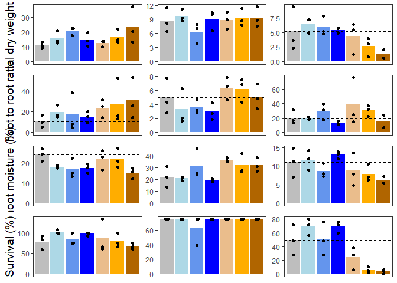
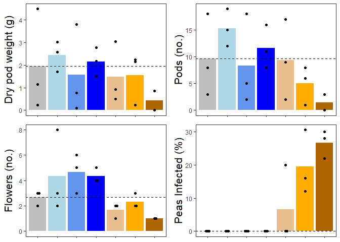
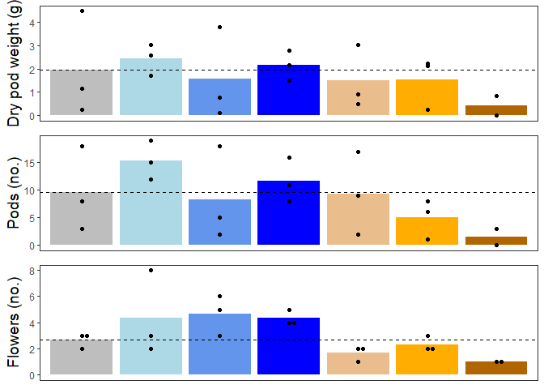
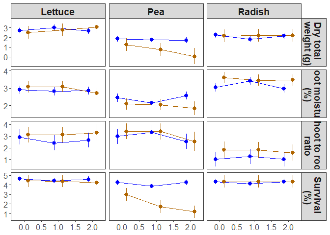
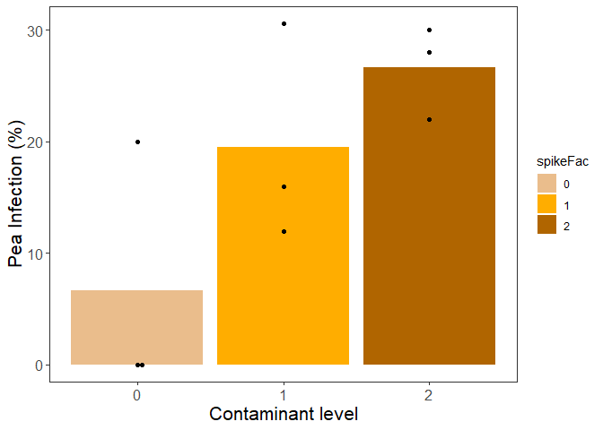
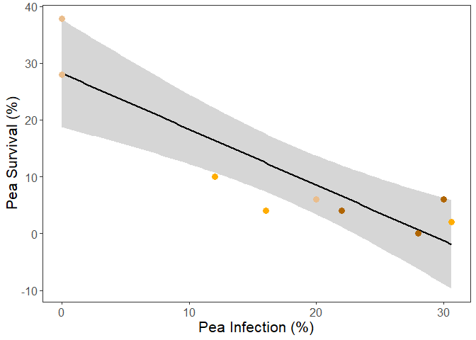
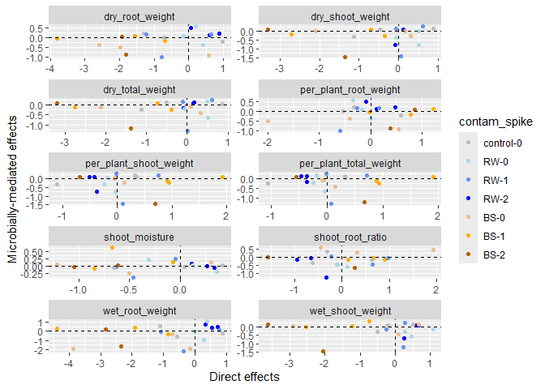
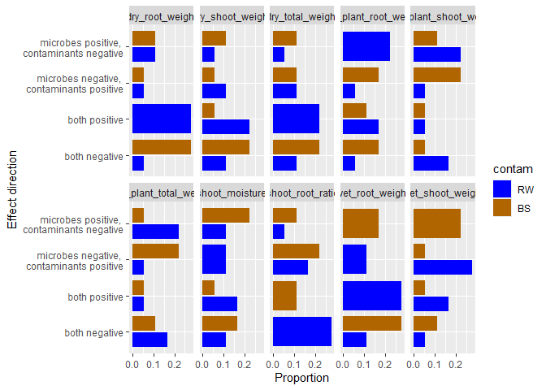

stat_analyses
================
RTD, II
2025-08-05

## Direct impacts of contaminants on crop growth

What impacts do amendments spiked with different levels of contaminants
have on plant traits, and are these impacts crop-species dependent?

Experimental design:

- Crossed two amendment types (biosolids \[BS\] and reclaimed water
  \[RW\]) with three contaminant spiking levels (0 \[no spiking\], 1
  \[ecologically relevant concentrations\], and 2 \[higher than
  ecological concentrations, to detect in plant tissues downstream\]).
- Exposed the resulting six treatments to each of three crop species
  commonly used in agriculture (lettuce, radish, and green peas), each
  growing separately in pots, resulting in a total of 18 treatment
  combinations (2 amendments x 3 spiking levels x 3 crop species).
- To account for environmental heterogeneity in growth conditions across
  the greenhouse, each treatment combination was spatially replicated
  three times, for a total of 54 experimental units (i.e., pots).
- Finally, we included nine controls in which no amendments were added,
  for a total of 63 pots (n = 3 controls per crop species x 3 crops = 9
  pots).

Traits measured:

- Post-planting:
  - Germination rates (proportion of germinated seeds out of total
    number of seeds planted)
  - Survival rates (proportion of plants that survived out of total
    number of seeds planted)  
- At harvest:
  - Normalized Difference Vegetation Index (NDVI) value, which reflects
    leaf chlorophyll A content and is a close correlate of nitrogen
    content,
  - Above- and below-ground wet and dry biomass
- For peas only:
  - Wet and dry pod weights (the portion of the plant most relevant to
    agricultural yield).
  - Number of flowers and pods
  - Infection rate (proportion of plants infected by fungus out of
    total)

### Load data

``` r
direct <- read_csv("./direct-updated.csv")
```

    ## Rows: 63 Columns: 23
    ## ── Column specification ────────────────────────────────────────────────────────
    ## Delimiter: ","
    ## chr   (4): species, source, treat, dry_shoot_weight_notes
    ## dbl  (17): sample_ID, spiking_level, plants, wet_shoot_weight, dry_shoot_wei...
    ## date  (2): planting_date1, planting_date2
    ## 
    ## ℹ Use `spec()` to retrieve the full column specification for this data.
    ## ℹ Specify the column types or set `show_col_types = FALSE` to quiet this message.

``` r
## calculate other traits
direct <- direct %>%
  mutate(seeds_planted_total = 
           rowSums(across(c(seeds_planted1, seeds_planted2)),
                                       na.rm=TRUE),
         seeds_germinated_total = 
           rowSums(across(c(seeds_germinated, seeds_germinated2)),
                                       na.rm=TRUE),
         germination_perc = (seeds_germinated_total / 
                               seeds_planted_total)*100,
         dry_total_weight = rowSums(across(c(dry_shoot_weight, 
                                             dry_root_weight))),
         shoot_root_ratio = dry_shoot_weight / dry_root_weight,
         shoot_moisture = (wet_shoot_weight - dry_shoot_weight) / 
           dry_shoot_weight,
         per_plant_weight = dry_total_weight / plants,
         survival_perc = (plants / seeds_planted_total) * 100,
         infected_peas_perc = (infected_peas/seeds_planted_total)*100
         )

### change weight pod weight to NA for samples without pods
direct$wet_pod_weight.corr <- ifelse(direct$pods > 0, 
                                     direct$wet_pod_weight,
                                     NA)

direct$dry_pod_weight.corr <- ifelse(direct$pods > 0, 
                                     direct$dry_pod_weight,
                                     NA)

### add 1's to survival (to take log)
direct$survival_perc.corr <- direct$survival_perc + 1

### add 1's to percent infected
direct$infected_peas_perc.corr <- 
  ifelse(is.na(direct$infected_peas_perc) == 
           FALSE,
         direct$infected_peas_perc + 1,
         NA)

## Code factors

### specify spiking level as an ordered factor
direct$spikeFac <- factor(direct$spiking_level,
                          levels = c("0","1","2"),
                          ordered = TRUE)

### rename source to be consistent with indirect
direct$contam <- ifelse(
  is.na(direct$source) == TRUE, "control",
                        ifelse(
                          direct$source ==
                            "effluents","RW",
                               "BS"))

direct$contam <- factor(direct$contam,
                        levels = c(
                          "control",
                          "RW",
                          "BS"
                        ))

### spiking level plus contam
direct$contam_spike <- paste0(direct$contam, 
                                "-", 
                                direct$spiking_level)

### treatment
direct$contam_spike <- factor(direct$contam_spike, 
                                levels = c("control-0",
                                           "RW-0",
                                           "RW-1",
                                           "RW-2",
                                           "BS-0",
                                           "BS-1",
                                           "BS-2"
                                           ),
                              ordered = TRUE)

## save formatted data file
save(direct, file = "./direct-formatted.Rda")
```

### Models

#### Model 1: amendment type x species

Impact of amendment type on plant traits, compared across different crop
species

Include controls. Limit to Spiking level 0 (no additional contaminants
added)

``` r
## load data
load(file = "./direct-formatted.Rda") ## loads direct

## set contrasts for ANOVA
options(contrasts=c("contr.sum","contr.poly")) 

### traits to run through (non-peas)
trait.list <- c(
                "wet_shoot_weight", 
                "dry_shoot_weight",
                "wet_root_weight", 
                "dry_root_weight",
                "shoot_root_ratio",
                "dry_total_weight",
                "per_plant_weight",
                "shoot_moisture",
                "germination_perc",
                "survival_perc.corr",
                ### pea specific
                "wet_pod_weight.corr",
                "dry_pod_weight.corr",
                "pods",
                "flowers"
                )

## source function
source("./Source_code/lmm1_func.R")

## model
mod1.out <- sapply(trait.list, 
                   lmm1_func,
                   df = direct,
                   simplify = FALSE, 
                   USE.NAMES = TRUE)
```

    ## [1] "wet_shoot_weight"

    ## 
    ## Call:
    ## lm(formula = log(get(traits)) ~ species * contam, data = df.f)
    ## 
    ## Residuals:
    ##      Min       1Q   Median       3Q      Max 
    ## -1.52222 -0.15219 -0.02159  0.13074  0.95952 
    ## 
    ## Coefficients:
    ##                  Estimate Std. Error t value Pr(>|t|)    
    ## (Intercept)       4.88480    0.09558  51.108  < 2e-16 ***
    ## species1          0.68092    0.13517   5.038 8.56e-05 ***
    ## species2         -1.01917    0.13517  -7.540 5.64e-07 ***
    ## contam1          -0.09150    0.13517  -0.677   0.5070    
    ## contam2           0.10434    0.13517   0.772   0.4502    
    ## species1:contam1  0.02726    0.19116   0.143   0.8882    
    ## species2:contam1  0.08651    0.19116   0.453   0.6563    
    ## species1:contam2 -0.04451    0.19116  -0.233   0.8185    
    ## species2:contam2  0.35699    0.19116   1.868   0.0782 .  
    ## ---
    ## Signif. codes:  0 '***' 0.001 '**' 0.01 '*' 0.05 '.' 0.1 ' ' 1
    ## 
    ## Residual standard error: 0.4966 on 18 degrees of freedom
    ## Multiple R-squared:  0.7891, Adjusted R-squared:  0.6953 
    ## F-statistic: 8.416 on 8 and 18 DF,  p-value: 9.693e-05

    ## Warning in ref_grid(lmm): There are unevaluated constants in the response formula
    ## Auto-detection of the response transformation may be incorrect

    ## [1] "dry_shoot_weight"

    ## 
    ## Call:
    ## lm(formula = log(get(traits)) ~ species * contam, data = df.f)
    ## 
    ## Residuals:
    ##     Min      1Q  Median      3Q     Max 
    ## -1.0716 -0.1792  0.0570  0.1322  0.7728 
    ## 
    ## Coefficients:
    ##                  Estimate Std. Error t value Pr(>|t|)    
    ## (Intercept)       1.96308    0.08222  23.875 4.44e-15 ***
    ## species1          0.50523    0.11628   4.345 0.000390 ***
    ## species2         -0.49420    0.11628  -4.250 0.000482 ***
    ## contam1          -0.09523    0.11628  -0.819 0.423534    
    ## contam2           0.16981    0.11628   1.460 0.161425    
    ## species1:contam1 -0.09487    0.16445  -0.577 0.571154    
    ## species2:contam1  0.03267    0.16445   0.199 0.844742    
    ## species1:contam2  0.03440    0.16445   0.209 0.836656    
    ## species2:contam2  0.15940    0.16445   0.969 0.345234    
    ## ---
    ## Signif. codes:  0 '***' 0.001 '**' 0.01 '*' 0.05 '.' 0.1 ' ' 1
    ## 
    ## Residual standard error: 0.4272 on 18 degrees of freedom
    ## Multiple R-squared:  0.6171, Adjusted R-squared:  0.4469 
    ## F-statistic: 3.626 on 8 and 18 DF,  p-value: 0.01105

    ## Warning in ref_grid(lmm): There are unevaluated constants in the response formula
    ## Auto-detection of the response transformation may be incorrect

    ## [1] "wet_root_weight"

    ## 
    ## Call:
    ## lm(formula = log(get(traits)) ~ species * contam, data = df.f)
    ## 
    ## Residuals:
    ##      Min       1Q   Median       3Q      Max 
    ## -1.58499 -0.24166  0.03554  0.34942  0.99523 
    ## 
    ## Coefficients:
    ##                   Estimate Std. Error t value Pr(>|t|)    
    ## (Intercept)       2.171564   0.120084  18.084 5.44e-13 ***
    ## species1          0.610482   0.169825   3.595  0.00207 ** 
    ## species2         -1.472416   0.169825  -8.670 7.65e-08 ***
    ## contam1           0.043380   0.169825   0.255  0.80128    
    ## contam2           0.136457   0.169825   0.804  0.43216    
    ## species1:contam1 -0.005192   0.240169  -0.022  0.98299    
    ## species2:contam1  0.147956   0.240169   0.616  0.54557    
    ## species1:contam2 -0.450850   0.240169  -1.877  0.07679 .  
    ## species2:contam2  0.395804   0.240169   1.648  0.11669    
    ## ---
    ## Signif. codes:  0 '***' 0.001 '**' 0.01 '*' 0.05 '.' 0.1 ' ' 1
    ## 
    ## Residual standard error: 0.624 on 18 degrees of freedom
    ## Multiple R-squared:  0.8239, Adjusted R-squared:  0.7456 
    ## F-statistic: 10.52 on 8 and 18 DF,  p-value: 2.142e-05

    ## Warning in ref_grid(lmm): There are unevaluated constants in the response formula
    ## Auto-detection of the response transformation may be incorrect

    ## [1] "dry_root_weight"

    ## 
    ## Call:
    ## lm(formula = log(get(traits)) ~ species * contam, data = df.f)
    ## 
    ## Residuals:
    ##     Min      1Q  Median      3Q     Max 
    ## -0.8766 -0.3824 -0.1751  0.4883  1.3190 
    ## 
    ## Coefficients:
    ##                    Estimate Std. Error t value Pr(>|t|)    
    ## (Intercept)      -0.4747539  0.1288483  -3.685   0.0017 ** 
    ## species1          0.1818721  0.1822190   0.998   0.3315    
    ## species2         -1.1582719  0.1822190  -6.356 5.48e-06 ***
    ## contam1           0.1130726  0.1822190   0.621   0.5427    
    ## contam2           0.3058492  0.1822190   1.678   0.1105    
    ## species1:contam1  0.2078262  0.2576965   0.806   0.4305    
    ## species2:contam1  0.0008393  0.2576965   0.003   0.9974    
    ## species1:contam2 -0.2617389  0.2576965  -1.016   0.3232    
    ## species2:contam2  0.1541221  0.2576965   0.598   0.5572    
    ## ---
    ## Signif. codes:  0 '***' 0.001 '**' 0.01 '*' 0.05 '.' 0.1 ' ' 1
    ## 
    ## Residual standard error: 0.6695 on 18 degrees of freedom
    ## Multiple R-squared:  0.7497, Adjusted R-squared:  0.6385 
    ## F-statistic: 6.741 on 8 and 18 DF,  p-value: 0.000395

    ## Warning in ref_grid(lmm): There are unevaluated constants in the response formula
    ## Auto-detection of the response transformation may be incorrect

    ## [1] "shoot_root_ratio"

    ## 
    ## Call:
    ## lm(formula = log(get(traits)) ~ species * contam, data = df.f)
    ## 
    ## Residuals:
    ##      Min       1Q   Median       3Q      Max 
    ## -0.72864 -0.29155 -0.05589  0.28939  0.92363 
    ## 
    ## Coefficients:
    ##                   Estimate Std. Error t value Pr(>|t|)    
    ## (Intercept)       2.437834   0.098752  24.686 2.47e-15 ***
    ## species1          0.323363   0.139657   2.315 0.032594 *  
    ## species2          0.664071   0.139657   4.755 0.000158 ***
    ## contam1          -0.208299   0.139657  -1.492 0.153147    
    ## contam2          -0.136038   0.139657  -0.974 0.342924    
    ## species1:contam1 -0.302694   0.197504  -1.533 0.142763    
    ## species2:contam1  0.031832   0.197504   0.161 0.873753    
    ## species1:contam2  0.296138   0.197504   1.499 0.151105    
    ## species2:contam2  0.005277   0.197504   0.027 0.978979    
    ## ---
    ## Signif. codes:  0 '***' 0.001 '**' 0.01 '*' 0.05 '.' 0.1 ' ' 1
    ## 
    ## Residual standard error: 0.5131 on 18 degrees of freedom
    ## Multiple R-squared:  0.7753, Adjusted R-squared:  0.6754 
    ## F-statistic: 7.762 on 8 and 18 DF,  p-value: 0.0001636

    ## Warning in ref_grid(lmm): There are unevaluated constants in the response formula
    ## Auto-detection of the response transformation may be incorrect

    ## [1] "dry_total_weight"

    ## 
    ## Call:
    ## lm(formula = log(get(traits)) ~ species * contam, data = df.f)
    ## 
    ## Residuals:
    ##      Min       1Q   Median       3Q      Max 
    ## -1.07172 -0.19932  0.00523  0.16221  0.77755 
    ## 
    ## Coefficients:
    ##                  Estimate Std. Error t value Pr(>|t|)    
    ## (Intercept)       2.08092    0.08387  24.811 2.27e-15 ***
    ## species1          0.45731    0.11861   3.856 0.001159 ** 
    ## species2         -0.56371    0.11861  -4.753 0.000159 ***
    ## contam1          -0.08748    0.11861  -0.738 0.470290    
    ## contam2           0.20058    0.11861   1.691 0.108061    
    ## species1:contam1 -0.06276    0.16774  -0.374 0.712671    
    ## species2:contam1  0.03193    0.16774   0.190 0.851146    
    ## species1:contam2 -0.01234    0.16774  -0.074 0.942186    
    ## species2:contam2  0.13038    0.16774   0.777 0.447098    
    ## ---
    ## Signif. codes:  0 '***' 0.001 '**' 0.01 '*' 0.05 '.' 0.1 ' ' 1
    ## 
    ## Residual standard error: 0.4358 on 18 degrees of freedom
    ## Multiple R-squared:  0.6218, Adjusted R-squared:  0.4537 
    ## F-statistic: 3.699 on 8 and 18 DF,  p-value: 0.01009

    ## Warning in ref_grid(lmm): There are unevaluated constants in the response formula
    ## Auto-detection of the response transformation may be incorrect

    ## [1] "per_plant_weight"

    ## 
    ## Call:
    ## lm(formula = log(get(traits)) ~ species * contam, data = df.f)
    ## 
    ## Residuals:
    ##      Min       1Q   Median       3Q      Max 
    ## -0.64438 -0.11483 -0.03029  0.12545  0.33659 
    ## 
    ## Coefficients:
    ##                   Estimate Std. Error t value Pr(>|t|)    
    ## (Intercept)      -0.456823   0.050192  -9.102 3.73e-08 ***
    ## species1          0.559102   0.070982   7.877 3.06e-07 ***
    ## species2         -0.495193   0.070982  -6.976 1.63e-06 ***
    ## contam1          -0.004375   0.070982  -0.062    0.952    
    ## contam2           0.051207   0.070982   0.721    0.480    
    ## species1:contam1  0.074621   0.100383   0.743    0.467    
    ## species2:contam1 -0.022339   0.100383  -0.223    0.826    
    ## species1:contam2  0.061403   0.100383   0.612    0.548    
    ## species2:contam2 -0.092734   0.100383  -0.924    0.368    
    ## ---
    ## Signif. codes:  0 '***' 0.001 '**' 0.01 '*' 0.05 '.' 0.1 ' ' 1
    ## 
    ## Residual standard error: 0.2608 on 18 degrees of freedom
    ## Multiple R-squared:  0.8113, Adjusted R-squared:  0.7274 
    ## F-statistic: 9.673 on 8 and 18 DF,  p-value: 3.825e-05

    ## Warning in ref_grid(lmm): There are unevaluated constants in the response formula
    ## Auto-detection of the response transformation may be incorrect

    ## [1] "shoot_moisture"

    ## 
    ## Call:
    ## lm(formula = log(get(traits)) ~ species * contam, data = df.f)
    ## 
    ## Residuals:
    ##      Min       1Q   Median       3Q      Max 
    ## -0.51349 -0.06301  0.03570  0.07064  0.53440 
    ## 
    ## Coefficients:
    ##                   Estimate Std. Error t value Pr(>|t|)    
    ## (Intercept)       2.858527   0.054686  52.272  < 2e-16 ***
    ## species1          0.191965   0.077338   2.482   0.0231 *  
    ## species2         -0.563581   0.077338  -7.287 9.01e-07 ***
    ## contam1           0.005657   0.077338   0.073   0.9425    
    ## contam2          -0.063951   0.077338  -0.827   0.4191    
    ## species1:contam1  0.126225   0.109372   1.154   0.2636    
    ## species2:contam1  0.059625   0.109372   0.545   0.5923    
    ## species1:contam2 -0.087148   0.109372  -0.797   0.4360    
    ## species2:contam2  0.213285   0.109372   1.950   0.0669 .  
    ## ---
    ## Signif. codes:  0 '***' 0.001 '**' 0.01 '*' 0.05 '.' 0.1 ' ' 1
    ## 
    ## Residual standard error: 0.2842 on 18 degrees of freedom
    ## Multiple R-squared:  0.7876, Adjusted R-squared:  0.6932 
    ## F-statistic: 8.344 on 8 and 18 DF,  p-value: 0.0001025

    ## Warning in ref_grid(lmm): There are unevaluated constants in the response formula
    ## Auto-detection of the response transformation may be incorrect

    ## [1] "germination_perc"

    ## 
    ## Call:
    ## lm(formula = log(get(traits)) ~ species * contam, data = df.f)
    ## 
    ## Residuals:
    ##      Min       1Q   Median       3Q      Max 
    ## -1.30513 -0.06086 -0.01687  0.11643  1.10619 
    ## 
    ## Coefficients:
    ##                   Estimate Std. Error t value Pr(>|t|)    
    ## (Intercept)       4.277948   0.103945  41.156   <2e-16 ***
    ## species1         -0.007792   0.147001  -0.053   0.9583    
    ## species2         -0.236068   0.147001  -1.606   0.1257    
    ## contam1           0.083053   0.147001   0.565   0.5791    
    ## contam2           0.314071   0.147001   2.137   0.0466 *  
    ## species1:contam1 -0.068866   0.207891  -0.331   0.7443    
    ## species2:contam1  0.138797   0.207891   0.668   0.5128    
    ## species1:contam2  0.143518   0.207891   0.690   0.4988    
    ## species2:contam2  0.121386   0.207891   0.584   0.5665    
    ## ---
    ## Signif. codes:  0 '***' 0.001 '**' 0.01 '*' 0.05 '.' 0.1 ' ' 1
    ## 
    ## Residual standard error: 0.5401 on 18 degrees of freedom
    ## Multiple R-squared:  0.454,  Adjusted R-squared:  0.2113 
    ## F-statistic: 1.871 on 8 and 18 DF,  p-value: 0.1286

    ## Warning in ref_grid(lmm): There are unevaluated constants in the response formula
    ## Auto-detection of the response transformation may be incorrect

    ## [1] "survival_perc.corr"

    ## 
    ## Call:
    ## lm(formula = log(get(traits)) ~ species * contam, data = df.f)
    ## 
    ## Residuals:
    ##      Min       1Q   Median       3Q      Max 
    ## -1.04496 -0.02643  0.00000  0.06932  0.66853 
    ## 
    ## Coefficients:
    ##                  Estimate Std. Error t value Pr(>|t|)    
    ## (Intercept)       4.16386    0.07394  56.312  < 2e-16 ***
    ## species1          0.30252    0.10457   2.893 0.009691 ** 
    ## species2         -0.46940    0.10457  -4.489 0.000284 ***
    ## contam1           0.01267    0.10457   0.121 0.904910    
    ## contam2           0.24112    0.10457   2.306 0.033233 *  
    ## species1:contam1 -0.13006    0.14788  -0.879 0.390735    
    ## species2:contam1  0.14273    0.14788   0.965 0.347262    
    ## species1:contam2 -0.06595    0.14788  -0.446 0.660942    
    ## species2:contam2  0.30707    0.14788   2.076 0.052452 .  
    ## ---
    ## Signif. codes:  0 '***' 0.001 '**' 0.01 '*' 0.05 '.' 0.1 ' ' 1
    ## 
    ## Residual standard error: 0.3842 on 18 degrees of freedom
    ## Multiple R-squared:  0.6805, Adjusted R-squared:  0.5385 
    ## F-statistic: 4.793 on 8 and 18 DF,  p-value: 0.002773

    ## Warning in ref_grid(lmm): There are unevaluated constants in the response formula
    ## Auto-detection of the response transformation may be incorrect

    ## [1] "wet_pod_weight.corr"

    ## 
    ## Call:
    ## lm(formula = log(get(traits)) ~ contam, data = df.f)
    ## 
    ## Residuals:
    ##     Min      1Q  Median      3Q     Max 
    ## -1.5951 -0.2590  0.1513  0.1944  1.4006 
    ## 
    ## Coefficients:
    ##             Estimate Std. Error t value Pr(>|t|)    
    ## (Intercept)   2.1995     0.3665   6.002 0.000963 ***
    ## contam1      -0.2124     0.5183  -0.410 0.696218    
    ## contam2       0.5403     0.5183   1.043 0.337344    
    ## ---
    ## Signif. codes:  0 '***' 0.001 '**' 0.01 '*' 0.05 '.' 0.1 ' ' 1
    ## 
    ## Residual standard error: 1.099 on 6 degrees of freedom
    ## Multiple R-squared:  0.1553, Adjusted R-squared:  -0.1262 
    ## F-statistic: 0.5517 on 2 and 6 DF,  p-value: 0.6026

    ## Warning in ref_grid(lmm): There are unevaluated constants in the response formula
    ## Auto-detection of the response transformation may be incorrect

    ## [1] "dry_pod_weight.corr"

    ## 
    ## Call:
    ## lm(formula = log(get(traits)) ~ contam, data = df.f)
    ## 
    ## Residuals:
    ##     Min      1Q  Median      3Q     Max 
    ## -1.5056 -0.3271  0.0708  0.2429  1.4348 
    ## 
    ## Coefficients:
    ##             Estimate Std. Error t value Pr(>|t|)
    ## (Intercept)   0.3487     0.3383   1.031    0.342
    ## contam1      -0.2807     0.4784  -0.587    0.579
    ## contam2       0.5155     0.4784   1.078    0.323
    ## 
    ## Residual standard error: 1.015 on 6 degrees of freedom
    ## Multiple R-squared:  0.1625, Adjusted R-squared:  -0.1167 
    ## F-statistic: 0.5821 on 2 and 6 DF,  p-value: 0.5874

    ## Warning in ref_grid(lmm): There are unevaluated constants in the response formula
    ## Auto-detection of the response transformation may be incorrect

    ## [1] "pods"

    ## 
    ## Call:
    ## glm(formula = form, family = poisson(link = "log"), data = df.f)
    ## 
    ## Coefficients:
    ##             Estimate Std. Error z value Pr(>|z|)    
    ## (Intercept)   2.4108     0.1011  23.852   <2e-16 ***
    ## contam1      -0.1421     0.1473  -0.964   0.3349    
    ## contam2       0.3193     0.1321   2.416   0.0157 *  
    ## ---
    ## Signif. codes:  0 '***' 0.001 '**' 0.01 '*' 0.05 '.' 0.1 ' ' 1
    ## 
    ## (Dispersion parameter for poisson family taken to be 1)
    ## 
    ##     Null deviance: 33.210  on 8  degrees of freedom
    ## Residual deviance: 27.508  on 6  degrees of freedom
    ## AIC: 70.209
    ## 
    ## Number of Fisher Scoring iterations: 5
    ## 
    ## [1] "flowers"

    ## 
    ## Call:
    ## glm(formula = form, family = poisson(link = "log"), data = df.f)
    ## 
    ## Coefficients:
    ##              Estimate Std. Error z value Pr(>|z|)    
    ## (Intercept)  0.985997   0.211325   4.666 3.07e-06 ***
    ## contam1     -0.005168   0.293811  -0.018    0.986    
    ## contam2      0.480340   0.265140   1.812    0.070 .  
    ## ---
    ## Signif. codes:  0 '***' 0.001 '**' 0.01 '*' 0.05 '.' 0.1 ' ' 1
    ## 
    ## (Dispersion parameter for poisson family taken to be 1)
    ## 
    ##     Null deviance: 8.9711  on 8  degrees of freedom
    ## Residual deviance: 5.2102  on 6  degrees of freedom
    ## AIC: 36.579
    ## 
    ## Number of Fisher Scoring iterations: 5

``` r
## combine dfs
### ANOVAs
aov <- lapply(mod1.out, `[[`, 1) %>%
  bind_rows(.)
### format
aov$pval <- ifelse(is.na(aov$`Pr(>F)`) == FALSE,
                   aov$`Pr(>F)`,
                   aov$`Pr(>Chisq)`)
aov$sig <- ifelse(aov$pval< 0.001, "***",
            ifelse(aov$pval < 0.01, "**",
            ifelse(aov$pval < 0.05, "*",
            ifelse(aov$pval < 0.1, ".",
                               "ns"))))
aov$stat <- ifelse(is.na(aov$`F value`) == FALSE,
                   signif(aov$`F value`, 3),
                   signif(aov$`LR Chisq`, 3))
aov$stat_sig <- paste0(aov$stat, aov$sig)
write.csv(aov, "./model_outputs/direct/aov1.csv", 
          row.names = FALSE)
### emmeans
emm <- lapply(mod1.out, `[[`, 2) %>%
  bind_rows(.)
write.csv(emm, "./model_outputs/direct/emm1.csv", 
          row.names = FALSE)
### CONTRASTS
cont <- lapply(mod1.out, `[[`, 3) %>%
  bind_rows(.)
cont$crop <- ifelse(is.na(cont$species) == TRUE, "pea", 
                    paste0(cont$species))
### format
cont$sig <- ifelse(cont$'p.value' 
                     < 0.001, "***",
                    ifelse(cont$'p.value' 
                           < 0.01, "**",
                    ifelse(cont$'p.value' 
                                  < 0.05, "*",
                    ifelse(cont$'p.value' 
                                       < 0.1,
                                       ".",
                                       "ns"))))
cont$LCL <- ifelse(is.na(cont$lower.CL) == TRUE,
                   signif(cont$asymp.LCL, 3),
                   signif(cont$lower.CL, 3))
cont$UCL <- ifelse(is.na(cont$upper.CL) == TRUE,
                   signif(cont$asymp.UCL, 3),
                   signif(cont$upper.CL, 3))
cont$ratio_CL <- paste0(signif(cont$ratio, 3), " (",
                        cont$LCL," - ",
                        cont$UCL,")")
write.csv(cont, "./model_outputs/direct/cont1.csv", 
          row.names = FALSE)
```

#### Model 2: contamination level x species

Impact of contamination level on plant traits, compared within amendment
types

Exclude controls (non-amended)

``` r
## load data
load(file = "./direct-formatted.Rda") ## loads direct

## set contrasts for ANOVA
options(contrasts=c("contr.sum","contr.poly")) 

### traits to run through
trait.list2 <- rep(c(
                "wet_shoot_weight", 
                "dry_shoot_weight",
                "wet_root_weight", 
                "dry_root_weight",
                "shoot_root_ratio",
                "dry_total_weight",
                "per_plant_weight",
                "shoot_moisture",
                "germination_perc",
                "survival_perc.corr",
                ### pea specific
                "wet_pod_weight.corr",
                "dry_pod_weight.corr",
                "pods",
                "flowers"
                ), 2)

## create list of traits/amends to loop through:
amend.list <- c(rep(c("RW"),14), rep(c("BS"),14))
comb.list <- paste0(trait.list2, ", ", amend.list)

## source the function:
source("./Source_code/lmm2_func.R")

mod2.out <- mapply(FUN = lmm2_func, 
                      combs = comb.list, 
                      traits = trait.list2, 
                      amends = amend.list, 
                      USE.NAMES = TRUE, 
                      SIMPLIFY = FALSE,
                      MoreArgs = list(df = direct))
```

    ## [1] "wet_shoot_weight, RW"

    ## 
    ## Call:
    ## lm(formula = log(get(traits)) ~ species * spikeFac, data = df.f)
    ## 
    ## Residuals:
    ##      Min       1Q   Median       3Q      Max 
    ## -0.25409 -0.13114  0.00965  0.10831  0.32691 
    ## 
    ## Coefficients:
    ##                     Estimate Std. Error t value Pr(>|t|)    
    ## (Intercept)          4.92468    0.03682 133.748  < 2e-16 ***
    ## species1             0.70783    0.05207  13.593 6.62e-11 ***
    ## species2            -0.74212    0.05207 -14.252 3.02e-11 ***
    ## spikeFac.L          -0.08279    0.06378  -1.298   0.2106    
    ## spikeFac.Q           0.01448    0.06378   0.227   0.8229    
    ## species1:spikeFac.L -0.01139    0.09019  -0.126   0.9009    
    ## species2:spikeFac.L  0.03050    0.09019   0.338   0.7392    
    ## species1:spikeFac.Q -0.19469    0.09019  -2.159   0.0446 *  
    ## species2:spikeFac.Q  0.24865    0.09019   2.757   0.0130 *  
    ## ---
    ## Signif. codes:  0 '***' 0.001 '**' 0.01 '*' 0.05 '.' 0.1 ' ' 1
    ## 
    ## Residual standard error: 0.1913 on 18 degrees of freedom
    ## Multiple R-squared:  0.9373, Adjusted R-squared:  0.9095 
    ## F-statistic: 33.64 on 8 and 18 DF,  p-value: 2.762e-09

    ## Warning in ref_grid(lmm): There are unevaluated constants in the response formula
    ## Auto-detection of the response transformation may be incorrect

    ## [1] "dry_shoot_weight, RW"

    ## 
    ## Call:
    ## lm(formula = log(get(traits)) ~ species * spikeFac, data = df.f)
    ## 
    ## Residuals:
    ##      Min       1Q   Median       3Q      Max 
    ## -0.44898 -0.14020  0.01587  0.15128  0.29822 
    ## 
    ## Coefficients:
    ##                     Estimate Std. Error t value Pr(>|t|)    
    ## (Intercept)          2.06804    0.04582  45.129  < 2e-16 ***
    ## species1             0.65410    0.06481  10.093 7.74e-09 ***
    ## species2            -0.36155    0.06481  -5.579 2.70e-05 ***
    ## spikeFac.L          -0.08295    0.07937  -1.045   0.3098    
    ## spikeFac.Q           0.01518    0.07937   0.191   0.8505    
    ## species1:spikeFac.L  0.02031    0.11225   0.181   0.8584    
    ## species2:spikeFac.L -0.05067    0.11225  -0.451   0.6571    
    ## species1:spikeFac.Q -0.24519    0.11225  -2.184   0.0424 *  
    ## species2:spikeFac.Q -0.02226    0.11225  -0.198   0.8450    
    ## ---
    ## Signif. codes:  0 '***' 0.001 '**' 0.01 '*' 0.05 '.' 0.1 ' ' 1
    ## 
    ## Residual standard error: 0.2381 on 18 degrees of freedom
    ## Multiple R-squared:   0.86,  Adjusted R-squared:  0.7978 
    ## F-statistic: 13.82 on 8 and 18 DF,  p-value: 3.035e-06

    ## Warning in ref_grid(lmm): There are unevaluated constants in the response formula
    ## Auto-detection of the response transformation may be incorrect

    ## [1] "wet_root_weight, RW"

    ## 
    ## Call:
    ## lm(formula = log(get(traits)) ~ species * spikeFac, data = df.f)
    ## 
    ## Residuals:
    ##      Min       1Q   Median       3Q      Max 
    ## -0.60395 -0.19657  0.03554  0.24171  0.69126 
    ## 
    ## Coefficients:
    ##                     Estimate Std. Error t value Pr(>|t|)    
    ## (Intercept)          2.33404    0.07900  29.546  < 2e-16 ***
    ## species1             0.40288    0.11172   3.606  0.00202 ** 
    ## species2            -1.13509    0.11172 -10.160 6.99e-09 ***
    ## spikeFac.L           0.05337    0.13683   0.390  0.70108    
    ## spikeFac.Q           0.02870    0.13683   0.210  0.83622    
    ## species1:spikeFac.L  0.07153    0.19350   0.370  0.71594    
    ## species2:spikeFac.L  0.09786    0.19350   0.506  0.61918    
    ## species1:spikeFac.Q -0.47192    0.19350  -2.439  0.02532 *  
    ## species2:spikeFac.Q  0.31274    0.19350   1.616  0.12345    
    ## ---
    ## Signif. codes:  0 '***' 0.001 '**' 0.01 '*' 0.05 '.' 0.1 ' ' 1
    ## 
    ## Residual standard error: 0.4105 on 18 degrees of freedom
    ## Multiple R-squared:  0.8629, Adjusted R-squared:  0.8019 
    ## F-statistic: 14.16 on 8 and 18 DF,  p-value: 2.544e-06

    ## Warning in ref_grid(lmm): There are unevaluated constants in the response formula
    ## Auto-detection of the response transformation may be incorrect

    ## [1] "dry_root_weight, RW"

    ## 
    ## Call:
    ## lm(formula = log(get(traits)) ~ species * spikeFac, data = df.f)
    ## 
    ## Residuals:
    ##      Min       1Q   Median       3Q      Max 
    ## -1.06414 -0.32470  0.03643  0.41987  0.76022 
    ## 
    ## Coefficients:
    ##                     Estimate Std. Error t value Pr(>|t|)    
    ## (Intercept)         -0.16542    0.11285  -1.466   0.1599    
    ## species1             0.22460    0.15959   1.407   0.1764    
    ## species2            -1.07074    0.15959  -6.709 2.73e-06 ***
    ## spikeFac.L           0.07954    0.19546   0.407   0.6889    
    ## spikeFac.Q           0.12923    0.19546   0.661   0.5169    
    ## species1:spikeFac.L  0.04544    0.27642   0.164   0.8713    
    ## species2:spikeFac.L  0.08882    0.27642   0.321   0.7517    
    ## species1:spikeFac.Q -0.66707    0.27642  -2.413   0.0267 *  
    ## species2:spikeFac.Q  0.31696    0.27642   1.147   0.2665    
    ## ---
    ## Signif. codes:  0 '***' 0.001 '**' 0.01 '*' 0.05 '.' 0.1 ' ' 1
    ## 
    ## Residual standard error: 0.5864 on 18 degrees of freedom
    ## Multiple R-squared:  0.7592, Adjusted R-squared:  0.6521 
    ## F-statistic: 7.093 on 8 and 18 DF,  p-value: 0.0002887

    ## Warning in ref_grid(lmm): There are unevaluated constants in the response formula
    ## Auto-detection of the response transformation may be incorrect

    ## [1] "shoot_root_ratio, RW"

    ## 
    ## Call:
    ## lm(formula = log(get(traits)) ~ species * spikeFac, data = df.f)
    ## 
    ## Residuals:
    ##     Min      1Q  Median      3Q     Max 
    ## -0.8903 -0.2596 -0.0427  0.2605  1.2317 
    ## 
    ## Coefficients:
    ##                     Estimate Std. Error t value Pr(>|t|)    
    ## (Intercept)          2.23346    0.10111  22.088 1.72e-14 ***
    ## species1             0.42950    0.14300   3.004 0.007626 ** 
    ## species2             0.70919    0.14300   4.959 0.000101 ***
    ## spikeFac.L          -0.16249    0.17514  -0.928 0.365792    
    ## spikeFac.Q          -0.11405    0.17514  -0.651 0.523143    
    ## species1:spikeFac.L -0.02513    0.24768  -0.101 0.920312    
    ## species2:spikeFac.L -0.13950    0.24768  -0.563 0.580232    
    ## species1:spikeFac.Q  0.42188    0.24768   1.703 0.105708    
    ## species2:spikeFac.Q -0.33922    0.24768  -1.370 0.187657    
    ## ---
    ## Signif. codes:  0 '***' 0.001 '**' 0.01 '*' 0.05 '.' 0.1 ' ' 1
    ## 
    ## Residual standard error: 0.5254 on 18 degrees of freedom
    ## Multiple R-squared:  0.7949, Adjusted R-squared:  0.7037 
    ## F-statistic: 8.718 on 8 and 18 DF,  p-value: 7.687e-05

    ## Warning in ref_grid(lmm): There are unevaluated constants in the response formula
    ## Auto-detection of the response transformation may be incorrect

    ## [1] "dry_total_weight, RW"

    ## 
    ## Call:
    ## lm(formula = log(get(traits)) ~ species * spikeFac, data = df.f)
    ## 
    ## Residuals:
    ##      Min       1Q   Median       3Q      Max 
    ## -0.42637 -0.13817  0.04801  0.14052  0.31536 
    ## 
    ## Coefficients:
    ##                     Estimate Std. Error t value Pr(>|t|)    
    ## (Intercept)          2.21485    0.04754  46.594  < 2e-16 ***
    ## species1             0.58706    0.06722   8.733 6.88e-08 ***
    ## species2            -0.45346    0.06722  -6.745 2.54e-06 ***
    ## spikeFac.L          -0.07756    0.08233  -0.942   0.3587    
    ## spikeFac.Q           0.02892    0.08233   0.351   0.7295    
    ## species1:spikeFac.L  0.02721    0.11644   0.234   0.8179    
    ## species2:spikeFac.L -0.03730    0.11644  -0.320   0.7524    
    ## species1:spikeFac.Q -0.30093    0.11644  -2.584   0.0187 *  
    ## species2:spikeFac.Q -0.01531    0.11644  -0.131   0.8969    
    ## ---
    ## Signif. codes:  0 '***' 0.001 '**' 0.01 '*' 0.05 '.' 0.1 ' ' 1
    ## 
    ## Residual standard error: 0.247 on 18 degrees of freedom
    ## Multiple R-squared:  0.8397, Adjusted R-squared:  0.7685 
    ## F-statistic: 11.79 on 8 and 18 DF,  p-value: 9.628e-06

    ## Warning in ref_grid(lmm): There are unevaluated constants in the response formula
    ## Auto-detection of the response transformation may be incorrect

    ## [1] "per_plant_weight, RW"

    ## 
    ## Call:
    ## lm(formula = log(get(traits)) ~ species * spikeFac, data = df.f)
    ## 
    ## Residuals:
    ##      Min       1Q   Median       3Q      Max 
    ## -0.42637 -0.13681 -0.02369  0.16384  0.33659 
    ## 
    ## Coefficients:
    ##                     Estimate Std. Error t value Pr(>|t|)    
    ## (Intercept)         -0.39987    0.04811  -8.311 1.42e-07 ***
    ## species1             0.78158    0.06804  11.486 1.02e-09 ***
    ## species2            -0.55465    0.06804  -8.151 1.87e-07 ***
    ## spikeFac.L          -0.06582    0.08334  -0.790   0.4399    
    ## spikeFac.Q          -0.12809    0.08334  -1.537   0.1417    
    ## species1:spikeFac.L  0.05485    0.11786   0.465   0.6473    
    ## species2:spikeFac.L -0.05321    0.11786  -0.451   0.6570    
    ## species1:spikeFac.Q -0.29957    0.11786  -2.542   0.0204 *  
    ## species2:spikeFac.Q -0.17367    0.11786  -1.474   0.1579    
    ## ---
    ## Signif. codes:  0 '***' 0.001 '**' 0.01 '*' 0.05 '.' 0.1 ' ' 1
    ## 
    ## Residual standard error: 0.25 on 18 degrees of freedom
    ## Multiple R-squared:  0.8986, Adjusted R-squared:  0.8535 
    ## F-statistic: 19.93 on 8 and 18 DF,  p-value: 1.879e-07

    ## Warning in ref_grid(lmm): There are unevaluated constants in the response formula
    ## Auto-detection of the response transformation may be incorrect

    ## [1] "shoot_moisture, RW"

    ## 
    ## Call:
    ## lm(formula = log(get(traits)) ~ species * spikeFac, data = df.f)
    ## 
    ## Residuals:
    ##      Min       1Q   Median       3Q      Max 
    ## -0.25203 -0.08749  0.00643  0.05289  0.42758 
    ## 
    ## Coefficients:
    ##                      Estimate Std. Error t value Pr(>|t|)    
    ## (Intercept)          2.793167   0.037582  74.323  < 2e-16 ***
    ## species1             0.060607   0.053148   1.140  0.26909    
    ## species2            -0.407323   0.053148  -7.664 4.49e-07 ***
    ## spikeFac.L           0.001209   0.065093   0.019  0.98539    
    ## spikeFac.Q           0.005545   0.065093   0.085  0.93306    
    ## species1:spikeFac.L -0.034736   0.092056  -0.377  0.71033    
    ## species2:spikeFac.L  0.087694   0.092056   0.953  0.35340    
    ## species1:spikeFac.Q  0.048127   0.092056   0.523  0.60749    
    ## species2:spikeFac.Q  0.291578   0.092056   3.167  0.00533 ** 
    ## ---
    ## Signif. codes:  0 '***' 0.001 '**' 0.01 '*' 0.05 '.' 0.1 ' ' 1
    ## 
    ## Residual standard error: 0.1953 on 18 degrees of freedom
    ## Multiple R-squared:  0.8257, Adjusted R-squared:  0.7482 
    ## F-statistic: 10.66 on 8 and 18 DF,  p-value: 1.96e-05

    ## Warning in ref_grid(lmm): There are unevaluated constants in the response formula
    ## Auto-detection of the response transformation may be incorrect

    ## [1] "germination_perc, RW"

    ## 
    ## Call:
    ## lm(formula = log(get(traits)) ~ species * spikeFac, data = df.f)
    ## 
    ## Residuals:
    ##      Min       1Q   Median       3Q      Max 
    ## -0.42698 -0.05027  0.00000  0.05947  0.26617 
    ## 
    ## Coefficients:
    ##                     Estimate Std. Error t value Pr(>|t|)    
    ## (Intercept)          4.47714    0.03614 123.878  < 2e-16 ***
    ## species1             0.09529    0.05111   1.864  0.07865 .  
    ## species2            -0.12546    0.05111  -2.455  0.02451 *  
    ## spikeFac.L          -0.03980    0.06260  -0.636  0.53294    
    ## spikeFac.Q           0.21247    0.06260   3.394  0.00323 ** 
    ## species1:spikeFac.L -0.06739    0.08853  -0.761  0.45641    
    ## species2:spikeFac.L  0.02883    0.08853   0.326  0.74842    
    ## species1:spikeFac.Q -0.01768    0.08853  -0.200  0.84398    
    ## species2:spikeFac.Q  0.07634    0.08853   0.862  0.39982    
    ## ---
    ## Signif. codes:  0 '***' 0.001 '**' 0.01 '*' 0.05 '.' 0.1 ' ' 1
    ## 
    ## Residual standard error: 0.1878 on 18 degrees of freedom
    ## Multiple R-squared:  0.5249, Adjusted R-squared:  0.3138 
    ## F-statistic: 2.486 on 8 and 18 DF,  p-value: 0.05175

    ## Warning in ref_grid(lmm): There are unevaluated constants in the response formula
    ## Auto-detection of the response transformation may be incorrect

    ## [1] "survival_perc.corr, RW"

    ## 
    ## Call:
    ## lm(formula = log(get(traits)) ~ species * spikeFac, data = df.f)
    ## 
    ## Residuals:
    ##      Min       1Q   Median       3Q      Max 
    ## -0.50034 -0.04192  0.00000  0.05033  0.47616 
    ## 
    ## Coefficients:
    ##                     Estimate Std. Error t value Pr(>|t|)    
    ## (Intercept)          4.30954    0.04356  98.941  < 2e-16 ***
    ## species1             0.24162    0.06160   3.922 0.000998 ***
    ## species2            -0.18999    0.06160  -3.084 0.006396 ** 
    ## spikeFac.L          -0.01164    0.07544  -0.154 0.879049    
    ## spikeFac.Q           0.21359    0.07544   2.831 0.011070 *  
    ## species1:spikeFac.L -0.02734    0.10669  -0.256 0.800672    
    ## species2:spikeFac.L  0.01569    0.10669   0.147 0.884692    
    ## species1:spikeFac.Q -0.05972    0.10669  -0.560 0.582532    
    ## species2:spikeFac.Q  0.09494    0.10669   0.890 0.385288    
    ## ---
    ## Signif. codes:  0 '***' 0.001 '**' 0.01 '*' 0.05 '.' 0.1 ' ' 1
    ## 
    ## Residual standard error: 0.2263 on 18 degrees of freedom
    ## Multiple R-squared:  0.5907, Adjusted R-squared:  0.4089 
    ## F-statistic: 3.248 on 8 and 18 DF,  p-value: 0.01805

    ## Warning in ref_grid(lmm): There are unevaluated constants in the response formula
    ## Auto-detection of the response transformation may be incorrect

    ## [1] "wet_pod_weight.corr, RW"

    ## 
    ## Call:
    ## lm(formula = log(get(traits)) ~ spikeFac, data = df.f)
    ## 
    ## Residuals:
    ##     Min      1Q  Median      3Q     Max 
    ## -1.7624 -0.2590  0.1085  0.1780  1.6540 
    ## 
    ## Coefficients:
    ##             Estimate Std. Error t value Pr(>|t|)    
    ## (Intercept)   2.3131     0.3383   6.838 0.000481 ***
    ## spikeFac.L   -0.1155     0.5859  -0.197 0.850227    
    ## spikeFac.Q    0.8450     0.5859   1.442 0.199336    
    ## ---
    ## Signif. codes:  0 '***' 0.001 '**' 0.01 '*' 0.05 '.' 0.1 ' ' 1
    ## 
    ## Residual standard error: 1.015 on 6 degrees of freedom
    ## Multiple R-squared:  0.261,  Adjusted R-squared:  0.01464 
    ## F-statistic: 1.059 on 2 and 6 DF,  p-value: 0.4036

    ## Warning in ref_grid(lmm): There are unevaluated constants in the response formula
    ## Auto-detection of the response transformation may be incorrect

    ## [1] "dry_pod_weight.corr, RW"

    ## 
    ## Call:
    ## lm(formula = log(get(traits)) ~ spikeFac, data = df.f)
    ## 
    ## Residuals:
    ##      Min       1Q   Median       3Q      Max 
    ## -1.82913 -0.32710  0.08425  0.24285  1.71378 
    ## 
    ## Coefficients:
    ##             Estimate Std. Error t value Pr(>|t|)
    ## (Intercept)  0.40726    0.35122   1.160    0.290
    ## spikeFac.L  -0.09073    0.60832  -0.149    0.886
    ## spikeFac.Q   0.96193    0.60832   1.581    0.165
    ## 
    ## Residual standard error: 1.054 on 6 degrees of freedom
    ## Multiple R-squared:  0.296,  Adjusted R-squared:  0.06133 
    ## F-statistic: 1.261 on 2 and 6 DF,  p-value: 0.3489

    ## Warning in ref_grid(lmm): There are unevaluated constants in the response formula
    ## Auto-detection of the response transformation may be incorrect

    ## [1] "pods, RW"

    ## 
    ## Call:
    ## glm(formula = form, family = poisson(link = "log"), data = df.f)
    ## 
    ## Coefficients:
    ##             Estimate Std. Error z value Pr(>|z|)    
    ## (Intercept)   2.4357     0.1002  24.315   <2e-16 ***
    ## spikeFac.L   -0.1932     0.1586  -1.218   0.2231    
    ## spikeFac.Q    0.3863     0.1872   2.063   0.0391 *  
    ## ---
    ## Signif. codes:  0 '***' 0.001 '**' 0.01 '*' 0.05 '.' 0.1 ' ' 1
    ## 
    ## (Dispersion parameter for poisson family taken to be 1)
    ## 
    ##     Null deviance: 27.598  on 8  degrees of freedom
    ## Residual deviance: 21.289  on 6  degrees of freedom
    ## AIC: 64.615
    ## 
    ## Number of Fisher Scoring iterations: 5
    ## 
    ## [1] "flowers, RW"

    ## 
    ## Call:
    ## glm(formula = form, family = poisson(link = "log"), data = df.f)
    ## 
    ## Coefficients:
    ##               Estimate Std. Error z value Pr(>|z|)    
    ## (Intercept)  1.491e+00  1.582e-01   9.424   <2e-16 ***
    ## spikeFac.L  -3.822e-16  2.774e-01   0.000    1.000    
    ## spikeFac.Q  -6.051e-02  2.707e-01  -0.224    0.823    
    ## ---
    ## Signif. codes:  0 '***' 0.001 '**' 0.01 '*' 0.05 '.' 0.1 ' ' 1
    ## 
    ## (Dispersion parameter for poisson family taken to be 1)
    ## 
    ##     Null deviance: 5.7652  on 8  degrees of freedom
    ## Residual deviance: 5.7156  on 6  degrees of freedom
    ## AIC: 41.401
    ## 
    ## Number of Fisher Scoring iterations: 5
    ## 
    ## [1] "wet_shoot_weight, BS"

    ## 
    ## Call:
    ## lm(formula = log(get(traits)) ~ species * spikeFac, data = df.f)
    ## 
    ## Residuals:
    ##      Min       1Q   Median       3Q      Max 
    ## -1.52222 -0.17657  0.05886  0.23949  0.95952 
    ## 
    ## Coefficients:
    ##                     Estimate Std. Error t value Pr(>|t|)    
    ## (Intercept)          4.68324    0.11522  40.647  < 2e-16 ***
    ## species1             1.06055    0.16078   6.596 4.54e-06 ***
    ## species2            -1.94189    0.16718 -11.616 1.65e-09 ***
    ## spikeFac.L          -0.32048    0.20217  -1.585   0.1314    
    ## spikeFac.Q          -0.09281    0.19692  -0.471   0.6434    
    ## species1:spikeFac.L  0.48197    0.28036   1.719   0.1038    
    ## species2:spikeFac.L -0.71629    0.29671  -2.414   0.0273 *  
    ## species1:spikeFac.Q -0.05284    0.27660  -0.191   0.8507    
    ## species2:spikeFac.Q -0.06680    0.28223  -0.237   0.8157    
    ## ---
    ## Signif. codes:  0 '***' 0.001 '**' 0.01 '*' 0.05 '.' 0.1 ' ' 1
    ## 
    ## Residual standard error: 0.5827 on 17 degrees of freedom
    ##   (1 observation deleted due to missingness)
    ## Multiple R-squared:   0.89,  Adjusted R-squared:  0.8383 
    ## F-statistic:  17.2 on 8 and 17 DF,  p-value: 9.94e-07

    ## Warning in ref_grid(lmm): There are unevaluated constants in the response formula
    ## Auto-detection of the response transformation may be incorrect

    ## [1] "dry_shoot_weight, BS"

    ## 
    ## Call:
    ## lm(formula = log(get(traits)) ~ species * spikeFac, data = df.f)
    ## 
    ## Residuals:
    ##      Min       1Q   Median       3Q      Max 
    ## -1.07155 -0.19197  0.01716  0.25973  0.67649 
    ## 
    ## Coefficients:
    ##                     Estimate Std. Error t value Pr(>|t|)    
    ## (Intercept)          1.79742    0.10799  16.645 5.88e-12 ***
    ## species1             0.94283    0.15069   6.257 8.69e-06 ***
    ## species2            -1.17357    0.15668  -7.490 8.84e-07 ***
    ## spikeFac.L          -0.15396    0.18948  -0.813   0.4277    
    ## spikeFac.Q          -0.04358    0.18456  -0.236   0.8162    
    ## species1:spikeFac.L  0.56210    0.26276   2.139   0.0472 *  
    ## species2:spikeFac.L -0.72265    0.27808  -2.599   0.0187 *  
    ## species1:spikeFac.Q  0.04980    0.25924   0.192   0.8499    
    ## species2:spikeFac.Q -0.05803    0.26451  -0.219   0.8290    
    ## ---
    ## Signif. codes:  0 '***' 0.001 '**' 0.01 '*' 0.05 '.' 0.1 ' ' 1
    ## 
    ## Residual standard error: 0.5461 on 17 degrees of freedom
    ##   (1 observation deleted due to missingness)
    ## Multiple R-squared:  0.7995, Adjusted R-squared:  0.7051 
    ## F-statistic: 8.473 on 8 and 17 DF,  p-value: 0.0001238

    ## Warning in ref_grid(lmm): There are unevaluated constants in the response formula
    ## Auto-detection of the response transformation may be incorrect

    ## [1] "wet_root_weight, BS"

    ## 
    ## Call:
    ## lm(formula = log(get(traits)) ~ species * spikeFac, data = df.f)
    ## 
    ## Residuals:
    ##      Min       1Q   Median       3Q      Max 
    ## -1.58499 -0.24315  0.08092  0.35878  1.05981 
    ## 
    ## Coefficients:
    ##                     Estimate Std. Error t value Pr(>|t|)    
    ## (Intercept)          1.82193    0.14420  12.635 4.55e-10 ***
    ## species1             1.11447    0.20123   5.538 3.61e-05 ***
    ## species2            -2.26483    0.20923 -10.825 4.79e-09 ***
    ## spikeFac.L          -0.13038    0.25302  -0.515    0.613    
    ## spikeFac.Q           0.19009    0.24645   0.771    0.451    
    ## species1:spikeFac.L  0.18074    0.35088   0.515    0.613    
    ## species2:spikeFac.L -0.36630    0.37134  -0.986    0.338    
    ## species1:spikeFac.Q  0.19562    0.34617   0.565    0.579    
    ## species2:spikeFac.Q -0.02538    0.35321  -0.072    0.944    
    ## ---
    ## Signif. codes:  0 '***' 0.001 '**' 0.01 '*' 0.05 '.' 0.1 ' ' 1
    ## 
    ## Residual standard error: 0.7293 on 17 degrees of freedom
    ##   (1 observation deleted due to missingness)
    ## Multiple R-squared:  0.8759, Adjusted R-squared:  0.8174 
    ## F-statistic: 14.99 on 8 and 17 DF,  p-value: 2.67e-06

    ## Warning in ref_grid(lmm): There are unevaluated constants in the response formula
    ## Auto-detection of the response transformation may be incorrect

    ## [1] "dry_root_weight, BS"

    ## 
    ## Call:
    ## lm(formula = log(get(traits)) ~ species * spikeFac, data = df.f)
    ## 
    ## Residuals:
    ##      Min       1Q   Median       3Q      Max 
    ## -1.23780 -0.30993 -0.03838  0.52778  1.31896 
    ## 
    ## Coefficients:
    ##                     Estimate Std. Error t value Pr(>|t|)    
    ## (Intercept)         -0.87485    0.15435  -5.668 2.78e-05 ***
    ## species1             0.44295    0.21539   2.057   0.0554 .  
    ## species2            -1.61356    0.22395  -7.205 1.47e-06 ***
    ## spikeFac.L           0.06587    0.27083   0.243   0.8108    
    ## spikeFac.Q           0.06797    0.26379   0.258   0.7998    
    ## species1:spikeFac.L  0.21075    0.37557   0.561   0.5820    
    ## species2:spikeFac.L -0.32903    0.39747  -0.828   0.4193    
    ## species1:spikeFac.Q -0.14241    0.37053  -0.384   0.7055    
    ## species2:spikeFac.Q  0.16575    0.37807   0.438   0.6666    
    ## ---
    ## Signif. codes:  0 '***' 0.001 '**' 0.01 '*' 0.05 '.' 0.1 ' ' 1
    ## 
    ## Residual standard error: 0.7806 on 17 degrees of freedom
    ##   (1 observation deleted due to missingness)
    ## Multiple R-squared:  0.7728, Adjusted R-squared:  0.6659 
    ## F-statistic: 7.229 on 8 and 17 DF,  p-value: 0.0003277

    ## Warning in ref_grid(lmm): There are unevaluated constants in the response formula
    ## Auto-detection of the response transformation may be incorrect

    ## [1] "shoot_root_ratio, BS"

    ## 
    ## Call:
    ## lm(formula = log(get(traits)) ~ species * spikeFac, data = df.f)
    ## 
    ## Residuals:
    ##      Min       1Q   Median       3Q      Max 
    ## -0.72864 -0.33586  0.03066  0.23256  0.92363 
    ## 
    ## Coefficients:
    ##                     Estimate Std. Error t value Pr(>|t|)    
    ## (Intercept)           2.6723     0.1101  24.263 1.25e-14 ***
    ## species1              0.4999     0.1537   3.252  0.00469 ** 
    ## species2              0.4400     0.1598   2.753  0.01357 *  
    ## spikeFac.L           -0.2198     0.1933  -1.137  0.27112    
    ## spikeFac.Q           -0.1115     0.1882  -0.593  0.56125    
    ## species1:spikeFac.L   0.3513     0.2680   1.311  0.20729    
    ## species2:spikeFac.L  -0.3936     0.2836  -1.388  0.18311    
    ## species1:spikeFac.Q   0.1922     0.2644   0.727  0.47713    
    ## species2:spikeFac.Q  -0.2238     0.2698  -0.830  0.41832    
    ## ---
    ## Signif. codes:  0 '***' 0.001 '**' 0.01 '*' 0.05 '.' 0.1 ' ' 1
    ## 
    ## Residual standard error: 0.557 on 17 degrees of freedom
    ##   (1 observation deleted due to missingness)
    ## Multiple R-squared:  0.7202, Adjusted R-squared:  0.5885 
    ## F-statistic: 5.469 on 8 and 17 DF,  p-value: 0.001608

    ## Warning in ref_grid(lmm): There are unevaluated constants in the response formula
    ## Auto-detection of the response transformation may be incorrect

    ## [1] "dry_total_weight, BS"

    ## 
    ## Call:
    ## lm(formula = log(get(traits)) ~ species * spikeFac, data = df.f)
    ## 
    ## Residuals:
    ##      Min       1Q   Median       3Q      Max 
    ## -1.07172 -0.20373 -0.01038  0.29320  0.62895 
    ## 
    ## Coefficients:
    ##                     Estimate Std. Error t value Pr(>|t|)    
    ## (Intercept)          1.88691    0.10835  17.415 2.84e-12 ***
    ## species1             0.89932    0.15120   5.948 1.59e-05 ***
    ## species2            -1.20854    0.15721  -7.687 6.25e-07 ***
    ## spikeFac.L          -0.13334    0.19012  -0.701   0.4926    
    ## spikeFac.Q          -0.03276    0.18518  -0.177   0.8617    
    ## species1:spikeFac.L  0.53801    0.26365   2.041   0.0571 .  
    ## species2:spikeFac.L -0.70771    0.27902  -2.536   0.0213 *  
    ## species1:spikeFac.Q  0.03311    0.26011   0.127   0.9002    
    ## species2:spikeFac.Q -0.04387    0.26540  -0.165   0.8707    
    ## ---
    ## Signif. codes:  0 '***' 0.001 '**' 0.01 '*' 0.05 '.' 0.1 ' ' 1
    ## 
    ## Residual standard error: 0.548 on 17 degrees of freedom
    ##   (1 observation deleted due to missingness)
    ## Multiple R-squared:  0.8001, Adjusted R-squared:  0.706 
    ## F-statistic: 8.503 on 8 and 17 DF,  p-value: 0.0001211

    ## Warning in ref_grid(lmm): There are unevaluated constants in the response formula
    ## Auto-detection of the response transformation may be incorrect

    ## [1] "per_plant_weight, BS"

    ## 
    ## Call:
    ## lm(formula = log(get(traits)) ~ species * spikeFac, data = df.f)
    ## 
    ## Residuals:
    ##      Min       1Q   Median       3Q      Max 
    ## -0.45951 -0.20863 -0.05113  0.19760  0.68500 
    ## 
    ## Coefficients:
    ##                     Estimate Std. Error t value Pr(>|t|)    
    ## (Intercept)         -0.22116    0.07070  -3.128  0.00612 ** 
    ## species1             0.65422    0.09866   6.631 4.25e-06 ***
    ## species2            -0.36346    0.10259  -3.543  0.00250 ** 
    ## spikeFac.L           0.24040    0.12406   1.938  0.06945 .  
    ## spikeFac.Q          -0.27558    0.12084  -2.281  0.03574 *  
    ## species1:spikeFac.L  0.41597    0.17204   2.418  0.02713 *  
    ## species2:spikeFac.L -0.21192    0.18207  -1.164  0.26052    
    ## species1:spikeFac.Q  0.15430    0.16973   0.909  0.37602    
    ## species2:spikeFac.Q -0.40787    0.17318  -2.355  0.03079 *  
    ## ---
    ## Signif. codes:  0 '***' 0.001 '**' 0.01 '*' 0.05 '.' 0.1 ' ' 1
    ## 
    ## Residual standard error: 0.3576 on 17 degrees of freedom
    ##   (1 observation deleted due to missingness)
    ## Multiple R-squared:  0.7894, Adjusted R-squared:  0.6902 
    ## F-statistic: 7.963 on 8 and 17 DF,  p-value: 0.0001821

    ## Warning in ref_grid(lmm): There are unevaluated constants in the response formula
    ## Auto-detection of the response transformation may be incorrect

    ## [1] "shoot_moisture, BS"

    ## 
    ## Call:
    ## lm(formula = log(get(traits)) ~ species * spikeFac, data = df.f)
    ## 
    ## Residuals:
    ##     Min      1Q  Median      3Q     Max 
    ## -0.5135 -0.1603 -0.0211  0.1571  0.5344 
    ## 
    ## Coefficients:
    ##                       Estimate Std. Error t value Pr(>|t|)    
    ## (Intercept)          2.8137266  0.0531879  52.902  < 2e-16 ***
    ## species1             0.1373245  0.0742227   1.850   0.0817 .  
    ## species2            -0.8300825  0.0771731 -10.756 5.26e-09 ***
    ## spikeFac.L          -0.1775768  0.0933285  -1.903   0.0742 .  
    ## spikeFac.Q          -0.0550426  0.0909039  -0.606   0.5528    
    ## species1:spikeFac.L -0.0828655  0.1294233  -0.640   0.5305    
    ## species2:spikeFac.L  0.0009555  0.1369687   0.007   0.9945    
    ## species1:spikeFac.Q -0.1054063  0.1276860  -0.826   0.4205    
    ## species2:spikeFac.Q -0.0140397  0.1302832  -0.108   0.9154    
    ## ---
    ## Signif. codes:  0 '***' 0.001 '**' 0.01 '*' 0.05 '.' 0.1 ' ' 1
    ## 
    ## Residual standard error: 0.269 on 17 degrees of freedom
    ##   (1 observation deleted due to missingness)
    ## Multiple R-squared:  0.8916, Adjusted R-squared:  0.8405 
    ## F-statistic: 17.47 on 8 and 17 DF,  p-value: 8.86e-07

    ## Warning in ref_grid(lmm): There are unevaluated constants in the response formula
    ## Auto-detection of the response transformation may be incorrect

    ## [1] "germination_perc, BS"

    ## 
    ## Call:
    ## lm(formula = log(get(traits)) ~ species * spikeFac, data = df.f)
    ## 
    ## Residuals:
    ##      Min       1Q   Median       3Q      Max 
    ## -1.30513 -0.17571 -0.01687  0.19537  1.10619 
    ## 
    ## Coefficients:
    ##                     Estimate Std. Error t value Pr(>|t|)    
    ## (Intercept)          3.59924    0.11610  31.001  < 2e-16 ***
    ## species1             0.46090    0.16419   2.807   0.0117 *  
    ## species2            -1.35270    0.16419  -8.239 1.61e-07 ***
    ## spikeFac.L          -0.40408    0.20109  -2.009   0.0597 .  
    ## spikeFac.Q          -0.01016    0.20109  -0.051   0.9603    
    ## species1:spikeFac.L  0.55224    0.28439   1.942   0.0680 .  
    ## species2:spikeFac.L -1.00892    0.28439  -3.548   0.0023 ** 
    ## species1:spikeFac.Q -0.37439    0.28439  -1.316   0.2045    
    ## species2:spikeFac.Q  0.35036    0.28439   1.232   0.2338    
    ## ---
    ## Signif. codes:  0 '***' 0.001 '**' 0.01 '*' 0.05 '.' 0.1 ' ' 1
    ## 
    ## Residual standard error: 0.6033 on 18 degrees of freedom
    ## Multiple R-squared:  0.8318, Adjusted R-squared:  0.757 
    ## F-statistic: 11.13 on 8 and 18 DF,  p-value: 1.451e-05

    ## Warning in ref_grid(lmm): There are unevaluated constants in the response formula
    ## Auto-detection of the response transformation may be incorrect

    ## [1] "survival_perc.corr, BS"

    ## 
    ## Call:
    ## lm(formula = log(get(traits)) ~ species * spikeFac, data = df.f)
    ## 
    ## Residuals:
    ##      Min       1Q   Median       3Q      Max 
    ## -1.18512 -0.09644  0.00000  0.16714  0.76079 
    ## 
    ## Coefficients:
    ##                     Estimate Std. Error t value Pr(>|t|)    
    ## (Intercept)          3.54387    0.10302  34.399  < 2e-16 ***
    ## species1             0.79618    0.14569   5.465 3.43e-05 ***
    ## species2            -1.58305    0.14569 -10.865 2.45e-09 ***
    ## spikeFac.L          -0.46895    0.17844  -2.628  0.01706 *  
    ## spikeFac.Q           0.08474    0.17844   0.475  0.64056    
    ## species1:spikeFac.L  0.33895    0.25235   1.343  0.19590    
    ## species2:spikeFac.L -0.80791    0.25235  -3.202  0.00495 ** 
    ## species1:spikeFac.Q -0.14201    0.25235  -0.563  0.58054    
    ## species2:spikeFac.Q  0.22676    0.25235   0.899  0.38074    
    ## ---
    ## Signif. codes:  0 '***' 0.001 '**' 0.01 '*' 0.05 '.' 0.1 ' ' 1
    ## 
    ## Residual standard error: 0.5353 on 18 degrees of freedom
    ## Multiple R-squared:  0.8834, Adjusted R-squared:  0.8316 
    ## F-statistic: 17.04 on 8 and 18 DF,  p-value: 6.294e-07

    ## Warning in ref_grid(lmm): There are unevaluated constants in the response formula
    ## Auto-detection of the response transformation may be incorrect

    ## [1] "wet_pod_weight.corr, BS"

    ## Warning: not plotting observations with leverage one:
    ##   1

    ## 
    ## Call:
    ## lm(formula = log(get(traits)) ~ spikeFac, data = df.f)
    ## 
    ## Residuals:
    ##          2          3          4          5          6          8          9 
    ## -2.220e-16  5.378e-01  7.599e-01  1.513e-01  1.058e+00 -1.298e+00 -1.209e+00 
    ## 
    ## Coefficients:
    ##             Estimate Std. Error t value Pr(>|t|)  
    ## (Intercept)   1.7843     0.4884   3.653   0.0217 *
    ## spikeFac.L   -0.1910     0.9267  -0.206   0.8468  
    ## spikeFac.Q   -0.1171     0.7567  -0.155   0.8845  
    ## ---
    ## Signif. codes:  0 '***' 0.001 '**' 0.01 '*' 0.05 '.' 0.1 ' ' 1
    ## 
    ## Residual standard error: 1.135 on 4 degrees of freedom
    ##   (2 observations deleted due to missingness)
    ## Multiple R-squared:  0.01238,    Adjusted R-squared:  -0.4814 
    ## F-statistic: 0.02507 on 2 and 4 DF,  p-value: 0.9754

    ## Warning in ref_grid(lmm): There are unevaluated constants in the response formula
    ## Auto-detection of the response transformation may be incorrect

    ## [1] "dry_pod_weight.corr, BS"

    ## Warning: not plotting observations with leverage one:
    ##   1

    ## 
    ## Call:
    ## lm(formula = log(get(traits)) ~ spikeFac, data = df.f)
    ## 
    ## Residuals:
    ##       2       3       4       5       6       8       9 
    ##  0.0000  0.7102  0.7547 -0.1940  0.9966 -1.4649 -0.8026 
    ## 
    ## Coefficients:
    ##              Estimate Std. Error t value Pr(>|t|)
    ## (Intercept)  0.003068   0.476037   0.006    0.995
    ## spikeFac.L  -0.192609   0.903216  -0.213    0.842
    ## spikeFac.Q  -0.062215   0.737473  -0.084    0.937
    ## 
    ## Residual standard error: 1.106 on 4 degrees of freedom
    ##   (2 observations deleted due to missingness)
    ## Multiple R-squared:  0.01126,    Adjusted R-squared:  -0.4831 
    ## F-statistic: 0.02278 on 2 and 4 DF,  p-value: 0.9776

    ## Warning in ref_grid(lmm): There are unevaluated constants in the response formula
    ## Auto-detection of the response transformation may be incorrect

    ## [1] "pods, BS"

    ## 
    ## Call:
    ## glm(formula = form, family = poisson(link = "log"), data = df.f)
    ## 
    ## Coefficients:
    ##             Estimate Std. Error z value Pr(>|z|)    
    ## (Intercept)   1.4162     0.2200   6.436 1.22e-10 ***
    ## spikeFac.L   -1.2927     0.4296  -3.009  0.00262 ** 
    ## spikeFac.Q   -0.2367     0.3255  -0.727  0.46709    
    ## ---
    ## Signif. codes:  0 '***' 0.001 '**' 0.01 '*' 0.05 '.' 0.1 ' ' 1
    ## 
    ## (Dispersion parameter for poisson family taken to be 1)
    ## 
    ##     Null deviance: 39.089  on 7  degrees of freedom
    ## Residual deviance: 24.219  on 5  degrees of freedom
    ##   (1 observation deleted due to missingness)
    ## AIC: 54.154
    ## 
    ## Number of Fisher Scoring iterations: 5
    ## 
    ## [1] "flowers, BS"

    ## 
    ## Call:
    ## glm(formula = form, family = poisson(link = "log"), data = df.f)
    ## 
    ## Coefficients:
    ##             Estimate Std. Error z value Pr(>|z|)
    ## (Intercept)   0.4527     0.3060   1.479    0.139
    ## spikeFac.L   -0.3612     0.5916  -0.611    0.541
    ## spikeFac.Q   -0.4833     0.4603  -1.050    0.294
    ## 
    ## (Dispersion parameter for poisson family taken to be 1)
    ## 
    ##     Null deviance: 2.0128  on 7  degrees of freedom
    ## Residual deviance: 0.7116  on 5  degrees of freedom
    ##   (1 observation deleted due to missingness)
    ## AIC: 26.158
    ## 
    ## Number of Fisher Scoring iterations: 4

``` r
## combine dfs
### ANOVAs
aov <- lapply(mod2.out, `[[`, 1) %>%
  bind_rows(.)
### format
aov$pval <- ifelse(is.na(aov$`Pr(>F)`) == FALSE,
                   aov$`Pr(>F)`,
                   aov$`Pr(>Chisq)`)
aov$sig <- ifelse(aov$pval< 0.001, "***",
            ifelse(aov$pval < 0.01, "**",
            ifelse(aov$pval < 0.05, "*",
            ifelse(aov$pval < 0.1, ".",
                               "ns"))))
aov$stat <- ifelse(is.na(aov$`F value`) == FALSE,
                   signif(aov$`F value`, 3),
                   signif(aov$`LR Chisq`, 3))
aov$stat_sig <- paste0(aov$stat, aov$sig)
write.csv(aov, "./model_outputs/direct/aov2.csv", 
          row.names = FALSE)
### emmeans
emm <- lapply(mod2.out, `[[`, 2) %>%
  bind_rows(.)
write.csv(emm, "./model_outputs/direct/emm2.csv", 
          row.names = FALSE)
### CONTRASTS
cont <- lapply(mod2.out, `[[`, 3) %>%
  bind_rows(.)
cont$crop <- ifelse(is.na(cont$species) == TRUE, "pea", 
                    paste0(cont$species))
### format
cont$sig <- ifelse(cont$'p.value' 
                     < 0.001, "***",
                    ifelse(cont$'p.value' 
                           < 0.01, "**",
                    ifelse(cont$'p.value' 
                                  < 0.05, "*",
                    ifelse(cont$'p.value' 
                                       < 0.1,
                                       ".",
                                       "ns"))))
cont$LCL <- ifelse(is.na(cont$lower.CL) == TRUE,
                   signif(cont$asymp.LCL, 3),
                   signif(cont$lower.CL, 3))
cont$UCL <- ifelse(is.na(cont$upper.CL) == TRUE,
                   signif(cont$asymp.UCL, 3),
                   signif(cont$upper.CL, 3))
cont$est_CL <- paste0(signif(cont$estimate, 3)," (",
                        cont$LCL," to ",
                        cont$UCL,")")
write.csv(cont, "./model_outputs/direct/cont2.csv", 
          row.names = FALSE)
```

#### Models 3 & 4: infection rate

- M3: Is infection rate impacted by contaminant level?
- M4: Is survival rate impacted by infection rate?

``` r
## set contrasts
options(contrasts=c("contr.treatment","contr.poly")) 

## load data
load(file = "./direct-formatted.Rda") ## loads direct

## infection rate and contaminant levels
m3 <- lm(log(infected_peas_perc.corr) ~ spikeFac, 
         data = direct %>%
           filter(species == "pea" & contam == "BS"))
m3_sum <- summary(m3)
png(paste0("./model_outputs/direct/resfits_m3.png"), 
      width=6, height=6, units='in', res=300)
  layout(matrix(1:4, ncol = 2))
  plot(m3)
  layout(1)
dev.off()
```

    ## png 
    ##   2

``` r
m3_coeff <- as.data.frame(m3_sum[["coefficients"]])
write.csv(m3_coeff, "./model_outputs/direct/m3_coeff.csv", 
          row.names = TRUE)
## infection rate and survival
m4 <- lm(survival_perc ~ infected_peas_perc, 
         data = direct %>%
           filter(species == "pea" & contam == "BS"))
m4_sum <- summary(m4)
png(paste0("./model_outputs/direct/resfits_m4.png"), 
      width=6, height=6, units='in', res=300)
  layout(matrix(1:4, ncol = 2))
  plot(m4)
  layout(1)
dev.off()
```

    ## png 
    ##   2

``` r
m4_coeff <- as.data.frame(m4_sum[["coefficients"]])
write.csv(m4_coeff, "./model_outputs/direct/m4_coeff.csv", 
          row.names = TRUE)
```

### Figures

Raw data, emmeans, contrasts

``` r
### raw data
load(file = "./direct-formatted.Rda") ## loads direct

## plots (traits at harvest)

### traits to run through (all crops)
trait.list1 <- c(
            ### all species
                "wet_shoot_weight", 
                "dry_shoot_weight",
                "wet_root_weight", 
                "dry_root_weight",
                "shoot_root_ratio",
                "dry_total_weight",
                "per_plant_weight",
                "shoot_moisture",
                "germination_perc",
                "survival_perc",
            ### pea-specific
                "wet_pod_weight",
                "dry_pod_weight",
                "pods",
                "flowers",
                "infected_peas_perc"
                )

## source function
source("./Source_code/plot_raw_data_func.R")

## plotting function
plots.out1 <- sapply(trait.list1, 
                     plot_raw_data_func,
                     df = direct,
                   simplify = FALSE, 
                   USE.NAMES = TRUE)
```

    ## [1] "wet_shoot_weight"

    ## `summarise()` has grouped output by 'species', 'contam_spike', 'contam'. You
    ## can override using the `.groups` argument.
    ## `summarise()` has grouped output by 'species', 'contam_spike', 'contam'. You
    ## can override using the `.groups` argument.

    ## [1] "dry_shoot_weight"

    ## `summarise()` has grouped output by 'species', 'contam_spike', 'contam'. You
    ## can override using the `.groups` argument.
    ## `summarise()` has grouped output by 'species', 'contam_spike', 'contam'. You
    ## can override using the `.groups` argument.

    ## [1] "wet_root_weight"

    ## `summarise()` has grouped output by 'species', 'contam_spike', 'contam'. You
    ## can override using the `.groups` argument.
    ## `summarise()` has grouped output by 'species', 'contam_spike', 'contam'. You
    ## can override using the `.groups` argument.

    ## [1] "dry_root_weight"

    ## `summarise()` has grouped output by 'species', 'contam_spike', 'contam'. You
    ## can override using the `.groups` argument.
    ## `summarise()` has grouped output by 'species', 'contam_spike', 'contam'. You
    ## can override using the `.groups` argument.

    ## [1] "shoot_root_ratio"

    ## `summarise()` has grouped output by 'species', 'contam_spike', 'contam'. You
    ## can override using the `.groups` argument.
    ## `summarise()` has grouped output by 'species', 'contam_spike', 'contam'. You
    ## can override using the `.groups` argument.

    ## [1] "dry_total_weight"

    ## `summarise()` has grouped output by 'species', 'contam_spike', 'contam'. You
    ## can override using the `.groups` argument.
    ## `summarise()` has grouped output by 'species', 'contam_spike', 'contam'. You
    ## can override using the `.groups` argument.

    ## [1] "per_plant_weight"

    ## `summarise()` has grouped output by 'species', 'contam_spike', 'contam'. You
    ## can override using the `.groups` argument.
    ## `summarise()` has grouped output by 'species', 'contam_spike', 'contam'. You
    ## can override using the `.groups` argument.

    ## [1] "shoot_moisture"

    ## `summarise()` has grouped output by 'species', 'contam_spike', 'contam'. You
    ## can override using the `.groups` argument.
    ## `summarise()` has grouped output by 'species', 'contam_spike', 'contam'. You
    ## can override using the `.groups` argument.

    ## [1] "germination_perc"

    ## `summarise()` has grouped output by 'species', 'contam_spike', 'contam'. You
    ## can override using the `.groups` argument.
    ## `summarise()` has grouped output by 'species', 'contam_spike', 'contam'. You
    ## can override using the `.groups` argument.

    ## [1] "survival_perc"

    ## `summarise()` has grouped output by 'species', 'contam_spike', 'contam'. You
    ## can override using the `.groups` argument.
    ## `summarise()` has grouped output by 'species', 'contam_spike', 'contam'. You
    ## can override using the `.groups` argument.

    ## [1] "wet_pod_weight"

    ## `summarise()` has grouped output by 'species', 'contam_spike', 'contam'. You
    ## can override using the `.groups` argument.
    ## `summarise()` has grouped output by 'species', 'contam_spike', 'contam'. You
    ## can override using the `.groups` argument.

    ## [1] "dry_pod_weight"

    ## `summarise()` has grouped output by 'species', 'contam_spike', 'contam'. You
    ## can override using the `.groups` argument.
    ## `summarise()` has grouped output by 'species', 'contam_spike', 'contam'. You
    ## can override using the `.groups` argument.

    ## [1] "pods"

    ## `summarise()` has grouped output by 'species', 'contam_spike', 'contam'. You
    ## can override using the `.groups` argument.
    ## `summarise()` has grouped output by 'species', 'contam_spike', 'contam'. You
    ## can override using the `.groups` argument.

    ## [1] "flowers"

    ## `summarise()` has grouped output by 'species', 'contam_spike', 'contam'. You
    ## can override using the `.groups` argument.
    ## `summarise()` has grouped output by 'species', 'contam_spike', 'contam'. You
    ## can override using the `.groups` argument.

    ## [1] "infected_peas_perc"

    ## `summarise()` has grouped output by 'species', 'contam_spike', 'contam'. You
    ## can override using the `.groups` argument.
    ## `summarise()` has grouped output by 'species', 'contam_spike', 'contam'. You
    ## can override using the `.groups` argument.

``` r
## combine plots (all crops)
fig1 <- plot_grid(plots.out1[["dry_total_weight"]] +
                    labs(y = "Total dry weight (g)"),
                  plots.out1[["shoot_root_ratio"]] +
                    labs(y = "Shoot to root ratio"),
                  plots.out1[["shoot_moisture"]] +
                    labs(y = "Shoot moisture (%)"),
                  plots.out1[["survival_perc"]] +
                    labs(y = "Survival (%)"),
          ncol = 1,
          nrow = 4,
          align = "v",
          labels = NULL)
```

    ## Warning: Removed 1 row containing missing values or values outside the scale range
    ## (`geom_point()`).
    ## Removed 1 row containing missing values or values outside the scale range
    ## (`geom_point()`).
    ## Removed 1 row containing missing values or values outside the scale range
    ## (`geom_point()`).

``` r
fig1
```

<!-- -->

``` r
## combine plots (peas only)
fig2 <- plot_grid(plots.out1[["dry_pod_weight"]] +
                    labs(y = "Dry pod weight (g)"),
                  plots.out1[["pods"]] +
                    labs(y = "Pods (no.)"),
                   plots.out1[["flowers"]] +
                    labs(y = "Flowers (no.)"),
                  plots.out1[["infected_peas_perc"]] +
                    labs(y = "Peas Infected (%)"),
          ncol = 2,
          nrow = 2,
          align = "hv",
          labels = NULL)
```

    ## Warning: Removed 1 row containing missing values or values outside the scale range
    ## (`geom_point()`).
    ## Removed 1 row containing missing values or values outside the scale range
    ## (`geom_point()`).
    ## Removed 1 row containing missing values or values outside the scale range
    ## (`geom_point()`).

``` r
fig2
```

<!-- -->

``` r
### M1
## figures (contrasts)
cont <- read_csv("model_outputs/direct/cont1.csv")
```

    ## Rows: 68 Columns: 19
    ## ── Column specification ────────────────────────────────────────────────────────
    ## Delimiter: ","
    ## chr  (6): contrast, species, trait, crop, sig, ratio_CL
    ## dbl (13): ratio, SE, df, lower.CL, upper.CL, null, t.ratio, p.value, asymp.L...
    ## 
    ## ℹ Use `spec()` to retrieve the full column specification for this data.
    ## ℹ Specify the column types or set `show_col_types = FALSE` to quiet this message.

``` r
cont$contam <- ifelse(grepl("BS", cont$contrast, fixed = FALSE),
                      "BS", "RW")

cont$contam <- factor(cont$contam,
                      levels = c("RW",
                                 "BS"))

cont$species <- ifelse(is.na(cont$species) == TRUE,
                       "pea",cont$species)

### sig traits
sig.traits <- c("survival_perc.corr",
                "shoot_moisture","shoot_root_ratio",
                "dry_total_weight")

### filter dataset to sig traits
cont.f <- cont %>%
         filter(trait %in% sig.traits) %>%
         droplevels(.)


cont.f$trait <- factor(cont.f$trait,
          levels = c(#"dry_shoot_weight","dry_root_weight",
         "dry_total_weight", "shoot_root_ratio","shoot_moisture",
         "survival_perc.corr"))

### rename traits
trait_names <- c(
  per_plant_weight = 'Per plant weight (g)',
  dry_shoot_weight = 'Dry shoot \n weight (g)',
  dry_total_weight = 'Dry total \n weight (g)',
  dry_root_weight = 'Dry root \n weight (g)',
  shoot_root_ratio = 'Shoot to root \n ratio',
  shoot_moisture = 'Shoot moisture \n (%)',
  germination_perc = 'Germination \n (%)',
  survival_perc.corr = 'Survival \n (%)',
  pods = "Pods (no.)"
)

species_names <- c(
  lettuce = 'Lettuce',
  pea = 'Pea',
  radish = 'Radish'
)

### plot
M1_plot <- ggplot(data = cont.f,
   aes(x = contam, 
       y = ratio, 
       colour = contam)) +
  geom_pointrange(aes(ymin = lower.CL,
                      ymax = upper.CL),
                  position = position_dodge(0.5)) +
  geom_hline(aes(yintercept = 1),
             linetype = 2) +
  coord_flip() +
   scale_colour_manual(values = c(
                                  "blue",
                                 "#B06500")) +
  facet_grid(trait~species, scales = "free",
             labeller = labeller(trait = trait_names,
                                 species = species_names)) +
  labs(y = NULL, x = NULL) +
  guides(colour = "none") +
  theme_bw() +
  theme(
    axis.text = element_text(size = 12),
    strip.text = element_text(size = 14, face = "bold"),
    panel.grid.major = element_blank(),
    panel.grid.minor = element_blank(),
  )
M1_plot
```

<!-- -->

``` r
ggsave("./model_outputs/direct/M1_plot.png", 
       width = 8, height = 10, 
       units = "in")

## M2

## emms (emmeans)
emms <- read_csv("model_outputs/direct/emm2.csv")
```

    ## Rows: 204 Columns: 14
    ## ── Column specification ────────────────────────────────────────────────────────
    ## Delimiter: ","
    ## chr  (3): species, trait, amend
    ## dbl (11): spikeFac, emmean, SE, df, lower.CL, upper.CL, t.ratio, p.value, as...
    ## 
    ## ℹ Use `spec()` to retrieve the full column specification for this data.
    ## ℹ Specify the column types or set `show_col_types = FALSE` to quiet this message.

``` r
emms$amend <- factor(emms$amend,
                      levels = c("RW",
                                 "BS"))

emms$species <- ifelse(is.na(emms$species) == TRUE,
                       "pea", emms$species)

### sig traits
sig.traits <- c("survival_perc.corr",
                "shoot_moisture","shoot_root_ratio",
                "dry_total_weight")

### filter dataset to sig traits
emms.f <- emms %>%
         filter(trait %in% sig.traits) %>%
         droplevels(.)

### rename traits
trait_names <- c(
  per_plant_weight = 'Per plant weight (g)',
  dry_shoot_weight = 'Dry shoot \n weight (g)',
  dry_total_weight = 'Dry total \n weight (g)',
  dry_root_weight = 'Dry root \n weight (g)',
  shoot_root_ratio = 'Shoot to root \n ratio',
  shoot_moisture = 'Shoot moisture \n (%)',
  germination_perc = 'Germination \n (%)',
  survival_perc.corr = 'Survival \n (%)',
  pods = "Pods (no.)"
)

### rename species
species_names <- c(
  lettuce = 'Lettuce',
  pea = 'Pea',
  radish = 'Radish'
)

### plot
M2_plot <- ggplot(data = emms.f,
   aes(x = spikeFac, 
       y = emmean, 
       colour = amend)) +
  geom_line(aes(group = amend),
            position = position_dodge(0.5)) +
  geom_pointrange(data = emms.f %>%
                    filter(trait != "pods"),
                           aes(ymin = lower.CL,
                      ymax = upper.CL),
                  position = position_dodge(0.5)) +
  geom_pointrange(data = emms.f %>%
                    filter(trait == "pods"),
                           aes(ymin = asymp.LCL,
                      ymax = asymp.UCL),
                  position = position_dodge(0.5)) +
   scale_colour_manual(values = c(
                                  "blue",
                                 "#B06500")) +
  facet_grid(trait~species, scales = "free",
             labeller = labeller(trait = trait_names,
                                 species = species_names)) +
  labs(y = NULL, x = NULL) +
  guides(colour = "none") +
  theme_bw() +
  theme(
    axis.text = element_text(size = 12),
    strip.text = element_text(size = 14, face = "bold"),
    panel.grid.major = element_blank(),
    panel.grid.minor = element_blank(),
  )
M2_plot
```

<!-- -->

``` r
ggsave("./model_outputs/direct/M2_plot.png", 
       width = 8, height = 10, 
       units = "in")

## model 3: infection and contaminant level
### plots
direct.f <- direct %>%
         filter(species == "pea" & contam == "BS") %>%
  droplevels(.)

### means
df.means <- direct.f %>% 
  group_by(spikeFac) %>%
  summarize(mean = mean(infected_peas_perc, 
                        na.rm = TRUE))
### plot
M3_plot <- ggplot(df.means,
                  aes(x = spikeFac, y = mean)) +
    geom_bar(aes(fill = spikeFac),
             stat = "identity") +
    geom_beeswarm(data = direct.f,
                  aes(y = infected_peas_perc)) +
    scale_fill_manual(values = c("#EABD8C",
                                 "#FFAD00",
                                 "#B06500")) +
    labs(x = "Contaminant level", 
         y = "Pea Infection (%)") +
    guides(colour = "none") +
    theme_bw() +
    theme(
      axis.text.x = element_text(size = 12),
      axis.title.x = element_text(size = 16),
      axis.text.y = element_text(size = 12),
      axis.title.y = element_text(size = 16),
      strip.text = element_text(size = 14, face = "bold"),
      panel.grid.major = element_blank(),
      panel.grid.minor = element_blank(),
    )
M3_plot
```

<!-- -->

``` r
ggsave("./model_outputs/direct/M3_plot.png", 
       width = 6, height = 6, 
       units = "in")

## model 4: infection and survival
### plots
M4_plot <- ggplot(direct %>%
         filter(species == "pea" & contam == "BS"),
       aes(x = infected_peas_perc, y = survival_perc)) +
  geom_smooth(method = "lm", colour = "black") +
  geom_point(aes(colour = spikeFac), size = 3) +
  scale_colour_manual(values = c("#EABD8C",
                                 "#FFAD00",
                                 "#B06500")) +
  labs(y = "Pea Survival (%)", 
         x = "Pea Infection (%)") +
    guides(colour = "none") +
    theme_bw() +
    theme(
      axis.text.x = element_text(size = 12),
      axis.title.x = element_text(size = 16),
      axis.text.y = element_text(size = 12),
      axis.title.y = element_text(size = 16),
      strip.text = element_text(size = 14, face = "bold"),
      panel.grid.major = element_blank(),
      panel.grid.minor = element_blank(),
    )
M4_plot
```

    ## `geom_smooth()` using formula = 'y ~ x'

<!-- -->

``` r
ggsave("./model_outputs/direct/M4_plot.png", 
       width = 6, height = 6, 
       units = "in")
```

    ## `geom_smooth()` using formula = 'y ~ x'

## Microbially-mediated (i.e., indirect) impacts of contaminants

DESCRIPTION

### Load data

``` r
indirect <- read_csv("./indirect.csv")
```

    ## Rows: 73 Columns: 51
    ## ── Column specification ────────────────────────────────────────────────────────
    ## Delimiter: ","
    ## chr (16): treatment, control, contam, t1, t2, t3, t4, leaf_num_notes, chloro...
    ## dbl (32): pot_ID, num_seeds, num_plants, spiking_level, leaf_num, plant_heig...
    ## lgl  (3): nitrogen_content, num_flower_time, num_pods
    ## 
    ## ℹ Use `spec()` to retrieve the full column specification for this data.
    ## ℹ Specify the column types or set `show_col_types = FALSE` to quiet this message.

``` r
## calculate other traits
indirect$dry_total_weight <- indirect$dry_shoot_weight + 
  indirect$dry_root_weight
indirect$shoot_root_ratio <- indirect$dry_shoot_weight / 
  indirect$dry_root_weight
indirect$shoot_moisture <- (indirect$wet_shoot_weight - 
                              indirect$dry_shoot_weight) / 
  indirect$dry_shoot_weight

## set factors

### relevel treatment
indirect$treatment <- as.factor(indirect$treatment)
indirect$treatment <- relevel(indirect$treatment, ref = "Saline Control")

### specify spiking level as an ordered factor
indirect$spikeFac <- factor(indirect$spiking_level,
                          levels = c("0","1","2"),
                          ordered = TRUE)

### rename source to be consistent with direct
indirect$contam <- factor(indirect$contam,
                        levels = c("control",
                                   "no_treat",
                                   "saline",
                          "RW",
                          "BS"
                        ))

### spiking level plus contam
indirect$contam_spike <- paste0(indirect$contam, 
                                "-", 
                                indirect$spiking_level)

### order factor
indirect$contam_spike <- factor(indirect$contam_spike, 
                                levels = c("control-0",
                                           "saline-0",
                                           "no_treat-0",
                                           "BS-0",
                                           "BS-1",
                                           "BS-2",
                                           "RW-0",
                                           "RW-1",
                                           "RW-2"))


## save formatted data file
save(indirect, file = "./indirect-formatted.Rda")
```

### Models

#### Model 1: calculate emmeans for each trait and soil slurry

Impact of prior amendment type on pea traits. Exclude contaminants.
Include controls (from prior experiment). No interactions.

NOTE: recommended by data lunch to calculate the geometric means from
the soil slurries, then input those in the model

``` r
## loaf formatted data file
load(file = "./indirect-formatted.Rda") ## loads indirect

## set contrasts
options(contrasts=c("contr.sum","contr.poly")) 

## traits to run through
trait.list <- c("plant_height4",
                "chlorophyll_content4_mean", 
                "leaf_number2",
                "wet_shoot_weight", 
                "dry_shoot_weight",
                "wet_root_weight", 
                "dry_root_weight",
                "dry_total_weight",
                "shoot_root_ratio",
                "shoot_moisture")

## source function
source("./Source_code/emms_func.R")

mod1.out <- sapply(trait.list, 
                   emms_func,
                   df = indirect,
                   simplify = FALSE, 
                   USE.NAMES = TRUE)
```

    ## [1] "plant_height4"

    ## Warning in ref_grid(lmm): There are unevaluated constants in the response formula
    ## Auto-detection of the response transformation may be incorrect

    ## [1] "chlorophyll_content4_mean"

    ## Warning in ref_grid(lmm): There are unevaluated constants in the response formula
    ## Auto-detection of the response transformation may be incorrect

    ## [1] "leaf_number2"

    ## Warning in ref_grid(lmm): There are unevaluated constants in the response formula
    ## Auto-detection of the response transformation may be incorrect

    ## [1] "wet_shoot_weight"

    ## Warning in ref_grid(lmm): There are unevaluated constants in the response formula
    ## Auto-detection of the response transformation may be incorrect

    ## [1] "dry_shoot_weight"

    ## Warning in ref_grid(lmm): There are unevaluated constants in the response formula
    ## Auto-detection of the response transformation may be incorrect

    ## [1] "wet_root_weight"

    ## Warning in ref_grid(lmm): There are unevaluated constants in the response formula
    ## Auto-detection of the response transformation may be incorrect

    ## [1] "dry_root_weight"

    ## Warning in ref_grid(lmm): There are unevaluated constants in the response formula
    ## Auto-detection of the response transformation may be incorrect

    ## [1] "dry_total_weight"

    ## Warning in ref_grid(lmm): There are unevaluated constants in the response formula
    ## Auto-detection of the response transformation may be incorrect

    ## [1] "shoot_root_ratio"

    ## Warning in ref_grid(lmm): There are unevaluated constants in the response formula
    ## Auto-detection of the response transformation may be incorrect

    ## [1] "shoot_moisture"

    ## Warning in ref_grid(lmm): There are unevaluated constants in the response formula
    ## Auto-detection of the response transformation may be incorrect

``` r
### emmeans
emm <- lapply(mod1.out, `[[`, 1) %>%
  bind_rows(.)
save(emm, file = "./model_outputs/indirect/emm1.Rda")
### CONTRASTS
cont <- lapply(mod1.out, `[[`, 2) %>%
  bind_rows(.)
write.csv(cont, "./model_outputs/indirect/cont1.csv", 
          row.names = FALSE)
```

#### M2: impact of prior amendment type on traits

``` r
## load emmeans
load(file = "./model_outputs/indirect/emm1.Rda") ## loads emm

## set contrasts
options(contrasts=c("contr.sum","contr.poly")) 

## traits to run through
trait.list <- c("plant_height4",
                "chlorophyll_content4_mean", 
                "leaf_number2",
                "wet_shoot_weight", 
                "dry_shoot_weight",
                "wet_root_weight", 
                "dry_root_weight",
                "dry_total_weight",
                "shoot_root_ratio",
                "shoot_moisture")

## source function
source("./Source_code/indirect_m2.func.R")

mod2.out <- sapply(trait.list, 
                   indirect_m2.func,
                   df = emm %>%
                         filter(!contam %in% c("saline","no_treat") &
                                  spikeFac == "0") %>%
                         droplevels(.),
                   simplify = FALSE, 
                   USE.NAMES = TRUE)
```

    ## [1] "plant_height4"

    ## 
    ## Call:
    ## lm(formula = log(response) ~ contam, data = df.f)
    ## 
    ## Residuals:
    ##      Min       1Q   Median       3Q      Max 
    ## -0.14332 -0.11530  0.04302  0.06528  0.20332 
    ## 
    ## Coefficients:
    ##             Estimate Std. Error t value Pr(>|t|)    
    ## (Intercept)  2.64198    0.04551  58.059 1.75e-09 ***
    ## contam1      0.03183    0.06435   0.495   0.6385    
    ## contam2     -0.16309    0.06435  -2.534   0.0444 *  
    ## ---
    ## Signif. codes:  0 '***' 0.001 '**' 0.01 '*' 0.05 '.' 0.1 ' ' 1
    ## 
    ## Residual standard error: 0.1365 on 6 degrees of freedom
    ## Multiple R-squared:  0.5461, Adjusted R-squared:  0.3948 
    ## F-statistic: 3.609 on 2 and 6 DF,  p-value: 0.09352
    ## 
    ## [1] "chlorophyll_content4_mean"

    ## 
    ## Call:
    ## lm(formula = log(response) ~ contam, data = df.f)
    ## 
    ## Residuals:
    ##       Min        1Q    Median        3Q       Max 
    ## -0.049641 -0.027898  0.009546  0.015450  0.040095 
    ## 
    ## Coefficients:
    ##             Estimate Std. Error t value Pr(>|t|)    
    ## (Intercept) -0.34695    0.01118 -31.043 7.42e-08 ***
    ## contam1      0.01607    0.01581   1.017    0.349    
    ## contam2     -0.01309    0.01581  -0.828    0.439    
    ## ---
    ## Signif. codes:  0 '***' 0.001 '**' 0.01 '*' 0.05 '.' 0.1 ' ' 1
    ## 
    ## Residual standard error: 0.03353 on 6 degrees of freedom
    ## Multiple R-squared:  0.1632, Adjusted R-squared:  -0.1158 
    ## F-statistic: 0.5849 on 2 and 6 DF,  p-value: 0.586
    ## 
    ## [1] "leaf_number2"

    ## 
    ## Call:
    ## lm(formula = log(response) ~ contam, data = df.f)
    ## 
    ## Residuals:
    ##       Min        1Q    Median        3Q       Max 
    ## -0.142326 -0.035120 -0.009957  0.049462  0.092864 
    ## 
    ## Coefficients:
    ##             Estimate Std. Error t value Pr(>|t|)    
    ## (Intercept)  2.12720    0.02754  77.231 3.17e-10 ***
    ## contam1      0.06589    0.03895   1.691    0.142    
    ## contam2     -0.04305    0.03895  -1.105    0.311    
    ## ---
    ## Signif. codes:  0 '***' 0.001 '**' 0.01 '*' 0.05 '.' 0.1 ' ' 1
    ## 
    ## Residual standard error: 0.08263 on 6 degrees of freedom
    ## Multiple R-squared:  0.3297, Adjusted R-squared:  0.1062 
    ## F-statistic: 1.475 on 2 and 6 DF,  p-value: 0.3012
    ## 
    ## [1] "wet_shoot_weight"

    ## 
    ## Call:
    ## lm(formula = log(response) ~ contam, data = df.f)
    ## 
    ## Residuals:
    ##      Min       1Q   Median       3Q      Max 
    ## -0.26072 -0.16558  0.08192  0.10847  0.16476 
    ## 
    ## Coefficients:
    ##             Estimate Std. Error t value Pr(>|t|)    
    ## (Intercept)  6.94986    0.06185 112.370 3.35e-11 ***
    ## contam1      0.09088    0.08747   1.039    0.339    
    ## contam2     -0.13807    0.08747  -1.578    0.166    
    ## ---
    ## Signif. codes:  0 '***' 0.001 '**' 0.01 '*' 0.05 '.' 0.1 ' ' 1
    ## 
    ## Residual standard error: 0.1855 on 6 degrees of freedom
    ## Multiple R-squared:  0.3003, Adjusted R-squared:  0.06704 
    ## F-statistic: 1.287 on 2 and 6 DF,  p-value: 0.3426
    ## 
    ## [1] "dry_shoot_weight"

    ## 
    ## Call:
    ## lm(formula = log(response) ~ contam, data = df.f)
    ## 
    ## Residuals:
    ##      Min       1Q   Median       3Q      Max 
    ## -0.28962 -0.12281  0.05181  0.08828  0.26884 
    ## 
    ## Coefficients:
    ##             Estimate Std. Error t value Pr(>|t|)    
    ## (Intercept)  4.78450    0.06781  70.553 5.46e-10 ***
    ## contam1      0.09471    0.09590   0.988    0.362    
    ## contam2     -0.14750    0.09590  -1.538    0.175    
    ## ---
    ## Signif. codes:  0 '***' 0.001 '**' 0.01 '*' 0.05 '.' 0.1 ' ' 1
    ## 
    ## Residual standard error: 0.2034 on 6 degrees of freedom
    ## Multiple R-squared:  0.2882, Adjusted R-squared:  0.0509 
    ## F-statistic: 1.215 on 2 and 6 DF,  p-value: 0.3607
    ## 
    ## [1] "wet_root_weight"

    ## 
    ## Call:
    ## lm(formula = log(response) ~ contam, data = df.f)
    ## 
    ## Residuals:
    ##      Min       1Q   Median       3Q      Max 
    ## -0.67097 -0.36693 -0.07793  0.44486  0.74861 
    ## 
    ## Coefficients:
    ##             Estimate Std. Error t value Pr(>|t|)    
    ## (Intercept)   5.6104     0.2001  28.038 1.36e-07 ***
    ## contam1       0.2627     0.2830   0.928    0.389    
    ## contam2       0.3625     0.2830   1.281    0.248    
    ## ---
    ## Signif. codes:  0 '***' 0.001 '**' 0.01 '*' 0.05 '.' 0.1 ' ' 1
    ## 
    ## Residual standard error: 0.6003 on 6 degrees of freedom
    ## Multiple R-squared:  0.4506, Adjusted R-squared:  0.2675 
    ## F-statistic: 2.461 on 2 and 6 DF,  p-value: 0.1658
    ## 
    ## [1] "dry_root_weight"

    ## 
    ## Call:
    ## lm(formula = log(response) ~ contam, data = df.f)
    ## 
    ## Residuals:
    ##      Min       1Q   Median       3Q      Max 
    ## -0.31727 -0.14641 -0.00621  0.15142  0.32930 
    ## 
    ## Coefficients:
    ##             Estimate Std. Error t value Pr(>|t|)    
    ## (Intercept)  3.78693    0.07838  48.315 5.27e-09 ***
    ## contam1      0.11117    0.11085   1.003    0.355    
    ## contam2      0.17929    0.11085   1.618    0.157    
    ## ---
    ## Signif. codes:  0 '***' 0.001 '**' 0.01 '*' 0.05 '.' 0.1 ' ' 1
    ## 
    ## Residual standard error: 0.2351 on 6 degrees of freedom
    ## Multiple R-squared:  0.5382, Adjusted R-squared:  0.3843 
    ## F-statistic: 3.496 on 2 and 6 DF,  p-value: 0.09848
    ## 
    ## [1] "dry_total_weight"

    ## 
    ## Call:
    ## lm(formula = log(response) ~ contam, data = df.f)
    ## 
    ## Residuals:
    ##      Min       1Q   Median       3Q      Max 
    ## -0.29343 -0.13739  0.04777  0.06953  0.28533 
    ## 
    ## Coefficients:
    ##             Estimate Std. Error t value Pr(>|t|)    
    ## (Intercept)  5.11515    0.06545  78.148 2.96e-10 ***
    ## contam1      0.09322    0.09257   1.007    0.353    
    ## contam2     -0.05848    0.09257  -0.632    0.551    
    ## ---
    ## Signif. codes:  0 '***' 0.001 '**' 0.01 '*' 0.05 '.' 0.1 ' ' 1
    ## 
    ## Residual standard error: 0.1964 on 6 degrees of freedom
    ## Multiple R-squared:  0.1473, Adjusted R-squared:  -0.137 
    ## F-statistic: 0.5181 on 2 and 6 DF,  p-value: 0.6201
    ## 
    ## [1] "shoot_root_ratio"

    ## 
    ## Call:
    ## lm(formula = log(response) ~ contam, data = df.f)
    ## 
    ## Residuals:
    ##       Min        1Q    Median        3Q       Max 
    ## -0.207125 -0.064335 -0.000488  0.032801  0.271461 
    ## 
    ## Coefficients:
    ##             Estimate Std. Error t value Pr(>|t|)    
    ## (Intercept)  0.99757    0.05203  19.174  1.3e-06 ***
    ## contam1     -0.01647    0.07358  -0.224  0.83034    
    ## contam2     -0.32679    0.07358  -4.441  0.00437 ** 
    ## ---
    ## Signif. codes:  0 '***' 0.001 '**' 0.01 '*' 0.05 '.' 0.1 ' ' 1
    ## 
    ## Residual standard error: 0.1561 on 6 degrees of freedom
    ## Multiple R-squared:  0.8219, Adjusted R-squared:  0.7626 
    ## F-statistic: 13.85 on 2 and 6 DF,  p-value: 0.005647
    ## 
    ## [1] "shoot_moisture"

    ## 
    ## Call:
    ## lm(formula = log(response) ~ contam, data = df.f)
    ## 
    ## Residuals:
    ##      Min       1Q   Median       3Q      Max 
    ## -0.15642 -0.02016  0.00707  0.05078  0.13985 
    ## 
    ## Coefficients:
    ##              Estimate Std. Error t value Pr(>|t|)    
    ## (Intercept)  2.042020   0.038620  52.875 3.07e-09 ***
    ## contam1     -0.004379   0.054617  -0.080    0.939    
    ## contam2      0.011083   0.054617   0.203    0.846    
    ## ---
    ## Signif. codes:  0 '***' 0.001 '**' 0.01 '*' 0.05 '.' 0.1 ' ' 1
    ## 
    ## Residual standard error: 0.1159 on 6 degrees of freedom
    ## Multiple R-squared:  0.006915,   Adjusted R-squared:  -0.3241 
    ## F-statistic: 0.02089 on 2 and 6 DF,  p-value: 0.9794

``` r
## combine dfs
### ANOVAs
aov <- lapply(mod2.out, `[[`, 1) %>%
  bind_rows(.)
write.csv(aov, "./model_outputs/indirect/aov2.csv", 
          row.names = FALSE)
### emmeans
emm <- lapply(mod2.out, `[[`, 2) %>%
  bind_rows(.)
write.csv(emm, "./model_outputs/indirect/emm2.csv", 
          row.names = FALSE)
### CONTRASTS
cont <- lapply(mod2.out, `[[`, 3) %>%
  bind_rows(.)
write.csv(cont, "./model_outputs/indirect/cont2.csv", 
          row.names = FALSE)
```

#### M3: impact of contaminant level

``` r
## load emmeans
load(file = "./model_outputs/indirect/emm1.Rda") ## loads emm

## set contrasts
options(contrasts=c("contr.sum","contr.poly")) 

### subset data to amendment types
  df.f <- emm %>%
    filter(trait == "plant_height4" &
      contam == "RW") %>%
    droplevels(.)
  
  ### model
  lmm <- lm(log(response) ~ spikeFac,
            data = df.f)

## traits to run through
trait.list2 <- rep(c("plant_height4",
                "chlorophyll_content4_mean", 
                "leaf_number2",
                "wet_shoot_weight", 
                "dry_shoot_weight",
                "wet_root_weight", 
                "dry_root_weight",
                "dry_total_weight",
                "shoot_root_ratio",
                "shoot_moisture"),2)

## create list of traits/amends to loop through:
amend.list <- c(rep(c("RW"),10), rep(c("BS"),10))
comb.list <- paste0(trait.list2, ", ", amend.list)

## source function
source("./Source_code/indirect_m3.func.R")

mod3.out <- mapply(FUN = indirect_m3.func, 
                      combs = comb.list, 
                      traits = trait.list2, 
                      amends = amend.list, 
                      USE.NAMES = TRUE, 
                      SIMPLIFY = FALSE,
                      MoreArgs = list(df = emm)
                   )
```

    ## [1] "plant_height4, RW"

    ## 
    ## Call:
    ## lm(formula = log(response) ~ spikeFac, data = df.f)
    ## 
    ## Residuals:
    ##     Min      1Q  Median      3Q     Max 
    ## -0.4634 -0.1433  0.1612  0.1938  0.3005 
    ## 
    ## Coefficients:
    ##              Estimate Std. Error t value Pr(>|t|)    
    ## (Intercept)  2.528973   0.104225  24.265 3.22e-07 ***
    ## spikeFac.L   0.069003   0.180523   0.382    0.715    
    ## spikeFac.Q  -0.003171   0.180523  -0.018    0.987    
    ## ---
    ## Signif. codes:  0 '***' 0.001 '**' 0.01 '*' 0.05 '.' 0.1 ' ' 1
    ## 
    ## Residual standard error: 0.3127 on 6 degrees of freedom
    ## Multiple R-squared:  0.02382,    Adjusted R-squared:  -0.3016 
    ## F-statistic: 0.07321 on 2 and 6 DF,  p-value: 0.9302
    ## 
    ## [1] "chlorophyll_content4_mean, RW"

    ## 
    ## Call:
    ## lm(formula = log(response) ~ spikeFac, data = df.f)
    ## 
    ## Residuals:
    ##       Min        1Q    Median        3Q       Max 
    ## -0.049641 -0.014885  0.000611  0.014274  0.041834 
    ## 
    ## Coefficients:
    ##              Estimate Std. Error t value Pr(>|t|)    
    ## (Intercept) -0.342802   0.012000 -28.568 1.22e-07 ***
    ## spikeFac.L   0.019141   0.020784   0.921    0.393    
    ## spikeFac.Q  -0.009059   0.020784  -0.436    0.678    
    ## ---
    ## Signif. codes:  0 '***' 0.001 '**' 0.01 '*' 0.05 '.' 0.1 ' ' 1
    ## 
    ## Residual standard error: 0.036 on 6 degrees of freedom
    ## Multiple R-squared:  0.1475, Adjusted R-squared:  -0.1367 
    ## F-statistic: 0.5191 on 2 and 6 DF,  p-value: 0.6196
    ## 
    ## [1] "leaf_number2, RW"

    ## 
    ## Call:
    ## lm(formula = log(response) ~ spikeFac, data = df.f)
    ## 
    ## Residuals:
    ##      Min       1Q   Median       3Q      Max 
    ## -0.45626 -0.01935  0.02930  0.17338  0.28288 
    ## 
    ## Coefficients:
    ##             Estimate Std. Error t value Pr(>|t|)    
    ## (Intercept)  2.02272    0.09277  21.803 6.08e-07 ***
    ## spikeFac.L  -0.05991    0.16069  -0.373    0.722    
    ## spikeFac.Q   0.04670    0.16069   0.291    0.781    
    ## ---
    ## Signif. codes:  0 '***' 0.001 '**' 0.01 '*' 0.05 '.' 0.1 ' ' 1
    ## 
    ## Residual standard error: 0.2783 on 6 degrees of freedom
    ## Multiple R-squared:  0.03591,    Adjusted R-squared:  -0.2855 
    ## F-statistic: 0.1117 on 2 and 6 DF,  p-value: 0.8961
    ## 
    ## [1] "wet_shoot_weight, RW"

    ## 
    ## Call:
    ## lm(formula = log(response) ~ spikeFac, data = df.f)
    ## 
    ## Residuals:
    ##     Min      1Q  Median      3Q     Max 
    ## -0.5705 -0.1656  0.1393  0.1656  0.4293 
    ## 
    ## Coefficients:
    ##             Estimate Std. Error t value Pr(>|t|)    
    ## (Intercept)  6.85068    0.11869  57.721 1.82e-09 ***
    ## spikeFac.L   0.09179    0.20557   0.446    0.671    
    ## spikeFac.Q   0.06373    0.20557   0.310    0.767    
    ## ---
    ## Signif. codes:  0 '***' 0.001 '**' 0.01 '*' 0.05 '.' 0.1 ' ' 1
    ## 
    ## Residual standard error: 0.3561 on 6 degrees of freedom
    ## Multiple R-squared:  0.04693,    Adjusted R-squared:  -0.2708 
    ## F-statistic: 0.1477 on 2 and 6 DF,  p-value: 0.8657
    ## 
    ## [1] "dry_shoot_weight, RW"

    ## 
    ## Call:
    ## lm(formula = log(response) ~ spikeFac, data = df.f)
    ## 
    ## Residuals:
    ##     Min      1Q  Median      3Q     Max 
    ## -0.7565 -0.2896  0.1889  0.2688  0.4140 
    ## 
    ## Coefficients:
    ##             Estimate Std. Error t value Pr(>|t|)    
    ## (Intercept)  4.68928    0.15215  30.820 7.75e-08 ***
    ## spikeFac.L   0.08896    0.26353   0.338    0.747    
    ## spikeFac.Q   0.02603    0.26353   0.099    0.925    
    ## ---
    ## Signif. codes:  0 '***' 0.001 '**' 0.01 '*' 0.05 '.' 0.1 ' ' 1
    ## 
    ## Residual standard error: 0.4564 on 6 degrees of freedom
    ## Multiple R-squared:  0.0202, Adjusted R-squared:  -0.3064 
    ## F-statistic: 0.06185 on 2 and 6 DF,  p-value: 0.9406
    ## 
    ## [1] "wet_root_weight, RW"

    ## 
    ## Call:
    ## lm(formula = log(response) ~ spikeFac, data = df.f)
    ## 
    ## Residuals:
    ##      Min       1Q   Median       3Q      Max 
    ## -1.02421 -0.11659 -0.03169  0.44800  0.72759 
    ## 
    ## Coefficients:
    ##             Estimate Std. Error t value Pr(>|t|)    
    ## (Intercept)   5.9105     0.2195  26.930 1.73e-07 ***
    ## spikeFac.L    0.2341     0.3801   0.616    0.561    
    ## spikeFac.Q    0.5582     0.3801   1.468    0.192    
    ## ---
    ## Signif. codes:  0 '***' 0.001 '**' 0.01 '*' 0.05 '.' 0.1 ' ' 1
    ## 
    ## Residual standard error: 0.6584 on 6 degrees of freedom
    ## Multiple R-squared:  0.297,  Adjusted R-squared:  0.06271 
    ## F-statistic: 1.268 on 2 and 6 DF,  p-value: 0.3474
    ## 
    ## [1] "dry_root_weight, RW"

    ## 
    ## Call:
    ## lm(formula = log(response) ~ spikeFac, data = df.f)
    ## 
    ## Residuals:
    ##      Min       1Q   Median       3Q      Max 
    ## -0.53116 -0.10773 -0.01202  0.26315  0.32930 
    ## 
    ## Coefficients:
    ##             Estimate Std. Error t value Pr(>|t|)    
    ## (Intercept)  3.93604    0.11121  35.394 3.39e-08 ***
    ## spikeFac.L   0.08672    0.19262   0.450    0.668    
    ## spikeFac.Q   0.22413    0.19262   1.164    0.289    
    ## ---
    ## Signif. codes:  0 '***' 0.001 '**' 0.01 '*' 0.05 '.' 0.1 ' ' 1
    ## 
    ## Residual standard error: 0.3336 on 6 degrees of freedom
    ## Multiple R-squared:  0.206,  Adjusted R-squared:  -0.05867 
    ## F-statistic: 0.7783 on 2 and 6 DF,  p-value: 0.5006
    ## 
    ## [1] "dry_total_weight, RW"

    ## 
    ## Call:
    ## lm(formula = log(response) ~ spikeFac, data = df.f)
    ## 
    ## Residuals:
    ##      Min       1Q   Median       3Q      Max 
    ## -0.69297 -0.13299  0.06279  0.28533  0.37471 
    ## 
    ## Coefficients:
    ##             Estimate Std. Error t value Pr(>|t|)    
    ## (Intercept)   5.0986     0.1302  39.146 1.86e-08 ***
    ## spikeFac.L    0.1210     0.2256   0.536    0.611    
    ## spikeFac.Q    0.1069     0.2256   0.474    0.652    
    ## ---
    ## Signif. codes:  0 '***' 0.001 '**' 0.01 '*' 0.05 '.' 0.1 ' ' 1
    ## 
    ## Residual standard error: 0.3907 on 6 degrees of freedom
    ## Multiple R-squared:  0.07867,    Adjusted R-squared:  -0.2284 
    ## F-statistic: 0.2561 on 2 and 6 DF,  p-value: 0.7821
    ## 
    ## [1] "shoot_root_ratio, RW"

    ## 
    ## Call:
    ## lm(formula = log(response) ~ spikeFac, data = df.f)
    ## 
    ## Residuals:
    ##      Min       1Q   Median       3Q      Max 
    ## -0.54229 -0.06046  0.03280  0.15087  0.31244 
    ## 
    ## Coefficients:
    ##              Estimate Std. Error t value Pr(>|t|)    
    ## (Intercept)  0.753236   0.098984   7.610 0.000268 ***
    ## spikeFac.L   0.002241   0.171445   0.013 0.989997    
    ## spikeFac.Q  -0.198106   0.171445  -1.156 0.291816    
    ## ---
    ## Signif. codes:  0 '***' 0.001 '**' 0.01 '*' 0.05 '.' 0.1 ' ' 1
    ## 
    ## Residual standard error: 0.297 on 6 degrees of freedom
    ## Multiple R-squared:  0.182,  Adjusted R-squared:  -0.09061 
    ## F-statistic: 0.6677 on 2 and 6 DF,  p-value: 0.5473
    ## 
    ## [1] "shoot_moisture, RW"

    ## 
    ## Call:
    ## lm(formula = log(response) ~ spikeFac, data = df.f)
    ## 
    ## Residuals:
    ##      Min       1Q   Median       3Q      Max 
    ## -0.22930 -0.04391  0.00707  0.04947  0.21006 
    ## 
    ## Coefficients:
    ##             Estimate Std. Error t value Pr(>|t|)    
    ## (Intercept) 2.037701   0.051402  39.643 1.72e-08 ***
    ## spikeFac.L  0.003635   0.089030   0.041    0.969    
    ## spikeFac.Q  0.044022   0.089030   0.494    0.639    
    ## ---
    ## Signif. codes:  0 '***' 0.001 '**' 0.01 '*' 0.05 '.' 0.1 ' ' 1
    ## 
    ## Residual standard error: 0.1542 on 6 degrees of freedom
    ## Multiple R-squared:  0.03941,    Adjusted R-squared:  -0.2808 
    ## F-statistic: 0.1231 on 2 and 6 DF,  p-value: 0.8864
    ## 
    ## [1] "plant_height4, BS"

    ## 
    ## Call:
    ## lm(formula = log(response) ~ spikeFac, data = df.f)
    ## 
    ## Residuals:
    ##      Min       1Q   Median       3Q      Max 
    ## -0.53426 -0.11530  0.05002  0.14151  0.35481 
    ## 
    ## Coefficients:
    ##             Estimate Std. Error t value Pr(>|t|)    
    ## (Intercept)  2.60860    0.09679  26.951 1.72e-07 ***
    ## spikeFac.L  -0.24782    0.16765  -1.478    0.190    
    ## spikeFac.Q  -0.02593    0.16765  -0.155    0.882    
    ## ---
    ## Signif. codes:  0 '***' 0.001 '**' 0.01 '*' 0.05 '.' 0.1 ' ' 1
    ## 
    ## Residual standard error: 0.2904 on 6 degrees of freedom
    ## Multiple R-squared:  0.2691, Adjusted R-squared:  0.02546 
    ## F-statistic: 1.104 on 2 and 6 DF,  p-value: 0.3905
    ## 
    ## [1] "chlorophyll_content4_mean, BS"

    ## 
    ## Call:
    ## lm(formula = log(response) ~ spikeFac, data = df.f)
    ## 
    ## Residuals:
    ##      Min       1Q   Median       3Q      Max 
    ## -0.08332 -0.02790  0.01545  0.02339  0.04855 
    ## 
    ## Coefficients:
    ##             Estimate Std. Error t value Pr(>|t|)    
    ## (Intercept) -0.35190    0.01616 -21.776 6.13e-07 ***
    ## spikeFac.L   0.01223    0.02799   0.437    0.677    
    ## spikeFac.Q   0.02602    0.02799   0.929    0.389    
    ## ---
    ## Signif. codes:  0 '***' 0.001 '**' 0.01 '*' 0.05 '.' 0.1 ' ' 1
    ## 
    ## Residual standard error: 0.04848 on 6 degrees of freedom
    ## Multiple R-squared:  0.1495, Adjusted R-squared:  -0.134 
    ## F-statistic: 0.5275 on 2 and 6 DF,  p-value: 0.6151
    ## 
    ## [1] "leaf_number2, BS"

    ## 
    ## Call:
    ## lm(formula = log(response) ~ spikeFac, data = df.f)
    ## 
    ## Residuals:
    ##      Min       1Q   Median       3Q      Max 
    ## -0.33057 -0.05768  0.04098  0.09286  0.17604 
    ## 
    ## Coefficients:
    ##             Estimate Std. Error t value Pr(>|t|)    
    ## (Intercept)  2.09926    0.06097  34.429    4e-08 ***
    ## spikeFac.L  -0.11434    0.10561  -1.083    0.321    
    ## spikeFac.Q  -0.18555    0.10561  -1.757    0.129    
    ## ---
    ## Signif. codes:  0 '***' 0.001 '**' 0.01 '*' 0.05 '.' 0.1 ' ' 1
    ## 
    ## Residual standard error: 0.1829 on 6 degrees of freedom
    ## Multiple R-squared:  0.4152, Adjusted R-squared:  0.2202 
    ## F-statistic:  2.13 on 2 and 6 DF,  p-value: 0.2
    ## 
    ## [1] "wet_shoot_weight, BS"

    ## 
    ## Call:
    ## lm(formula = log(response) ~ spikeFac, data = df.f)
    ## 
    ## Residuals:
    ##      Min       1Q   Median       3Q      Max 
    ## -0.68480 -0.09493  0.09596  0.16476  0.42132 
    ## 
    ## Coefficients:
    ##             Estimate Std. Error t value Pr(>|t|)    
    ## (Intercept)   6.9541     0.1260  55.211 2.37e-09 ***
    ## spikeFac.L   -0.1913     0.2182  -0.877    0.414    
    ## spikeFac.Q   -0.2261     0.2182  -1.037    0.340    
    ## ---
    ## Signif. codes:  0 '***' 0.001 '**' 0.01 '*' 0.05 '.' 0.1 ' ' 1
    ## 
    ## Residual standard error: 0.3779 on 6 degrees of freedom
    ## Multiple R-squared:  0.235,  Adjusted R-squared:  -0.01998 
    ## F-statistic: 0.9217 on 2 and 6 DF,  p-value: 0.4477
    ## 
    ## [1] "dry_shoot_weight, BS"

    ## 
    ## Call:
    ## lm(formula = log(response) ~ spikeFac, data = df.f)
    ## 
    ## Residuals:
    ##      Min       1Q   Median       3Q      Max 
    ## -0.66806 -0.10220  0.05181  0.13494  0.40710 
    ## 
    ## Coefficients:
    ##             Estimate Std. Error t value Pr(>|t|)    
    ## (Intercept)   4.7356     0.1165  40.655 1.48e-08 ***
    ## spikeFac.L   -0.2025     0.2018  -1.004    0.354    
    ## spikeFac.Q   -0.1016     0.2018  -0.504    0.632    
    ## ---
    ## Signif. codes:  0 '***' 0.001 '**' 0.01 '*' 0.05 '.' 0.1 ' ' 1
    ## 
    ## Residual standard error: 0.3494 on 6 degrees of freedom
    ## Multiple R-squared:  0.1737, Adjusted R-squared:  -0.1017 
    ## F-statistic: 0.6307 on 2 and 6 DF,  p-value: 0.5641
    ## 
    ## [1] "wet_root_weight, BS"

    ## 
    ## Call:
    ## lm(formula = log(response) ~ spikeFac, data = df.f)
    ## 
    ## Residuals:
    ##     Min      1Q  Median      3Q     Max 
    ## -0.7466 -0.3651  0.1326  0.2157  0.7486 
    ## 
    ## Coefficients:
    ##             Estimate Std. Error t value Pr(>|t|)    
    ## (Intercept)   5.5156     0.1859  29.676 9.71e-08 ***
    ## spikeFac.L    0.4127     0.3219   1.282    0.247    
    ## spikeFac.Q   -0.5843     0.3219  -1.815    0.119    
    ## ---
    ## Signif. codes:  0 '***' 0.001 '**' 0.01 '*' 0.05 '.' 0.1 ' ' 1
    ## 
    ## Residual standard error: 0.5576 on 6 degrees of freedom
    ## Multiple R-squared:  0.4515, Adjusted R-squared:  0.2686 
    ## F-statistic: 2.469 on 2 and 6 DF,  p-value: 0.165
    ## 
    ## [1] "dry_root_weight, BS"

    ## 
    ## Call:
    ## lm(formula = log(response) ~ spikeFac, data = df.f)
    ## 
    ## Residuals:
    ##      Min       1Q   Median       3Q      Max 
    ## -0.45184 -0.08664  0.07150  0.15142  0.26566 
    ## 
    ## Coefficients:
    ##             Estimate Std. Error t value Pr(>|t|)    
    ## (Intercept)  3.71238    0.08639  42.971 1.06e-08 ***
    ## spikeFac.L   0.18684    0.14964   1.249    0.258    
    ## spikeFac.Q  -0.20527    0.14964  -1.372    0.219    
    ## ---
    ## Signif. codes:  0 '***' 0.001 '**' 0.01 '*' 0.05 '.' 0.1 ' ' 1
    ## 
    ## Residual standard error: 0.2592 on 6 degrees of freedom
    ## Multiple R-squared:  0.3645, Adjusted R-squared:  0.1526 
    ## F-statistic:  1.72 on 2 and 6 DF,  p-value: 0.2567
    ## 
    ## [1] "dry_total_weight, BS"

    ## 
    ## Call:
    ## lm(formula = log(response) ~ spikeFac, data = df.f)
    ## 
    ## Residuals:
    ##      Min       1Q   Median       3Q      Max 
    ## -0.56611 -0.09862  0.06786  0.12382  0.32197 
    ## 
    ## Coefficients:
    ##             Estimate Std. Error t value Pr(>|t|)    
    ## (Intercept)  5.05991    0.09979  50.704 3.95e-09 ***
    ## spikeFac.L  -0.09259    0.17285  -0.536    0.611    
    ## spikeFac.Q  -0.11017    0.17285  -0.637    0.547    
    ## ---
    ## Signif. codes:  0 '***' 0.001 '**' 0.01 '*' 0.05 '.' 0.1 ' ' 1
    ## 
    ## Residual standard error: 0.2994 on 6 degrees of freedom
    ## Multiple R-squared:  0.1036, Adjusted R-squared:  -0.1952 
    ## F-statistic: 0.3466 on 2 and 6 DF,  p-value: 0.7204
    ## 
    ## [1] "shoot_root_ratio, BS"

    ## 
    ## Call:
    ## lm(formula = log(response) ~ spikeFac, data = df.f)
    ## 
    ## Residuals:
    ##       Min        1Q    Median        3Q       Max 
    ## -0.216219 -0.027846 -0.004702  0.043408  0.220920 
    ## 
    ## Coefficients:
    ##             Estimate Std. Error t value Pr(>|t|)    
    ## (Intercept)  1.02320    0.04683  21.849    6e-07 ***
    ## spikeFac.L  -0.38936    0.08111  -4.800    0.003 ** 
    ## spikeFac.Q   0.10364    0.08111   1.278    0.249    
    ## ---
    ## Signif. codes:  0 '***' 0.001 '**' 0.01 '*' 0.05 '.' 0.1 ' ' 1
    ## 
    ## Residual standard error: 0.1405 on 6 degrees of freedom
    ## Multiple R-squared:  0.8044, Adjusted R-squared:  0.7392 
    ## F-statistic: 12.34 on 2 and 6 DF,  p-value: 0.007483
    ## 
    ## [1] "shoot_moisture, BS"

    ## 
    ## Call:
    ## lm(formula = log(response) ~ spikeFac, data = df.f)
    ## 
    ## Residuals:
    ##       Min        1Q    Median        3Q       Max 
    ## -0.214319 -0.066559  0.003514  0.050783  0.280879 
    ## 
    ## Coefficients:
    ##             Estimate Std. Error t value Pr(>|t|)    
    ## (Intercept)  2.10035    0.05582  37.627 2.35e-08 ***
    ## spikeFac.L   0.01254    0.09668   0.130    0.901    
    ## spikeFac.Q  -0.13757    0.09668  -1.423    0.205    
    ## ---
    ## Signif. codes:  0 '***' 0.001 '**' 0.01 '*' 0.05 '.' 0.1 ' ' 1
    ## 
    ## Residual standard error: 0.1675 on 6 degrees of freedom
    ## Multiple R-squared:  0.2539, Adjusted R-squared:  0.005167 
    ## F-statistic: 1.021 on 2 and 6 DF,  p-value: 0.4154

``` r
## combine dfs
### ANOVAs
aov <- lapply(mod3.out, `[[`, 1) %>%
  bind_rows(.)
write.csv(aov, "./model_outputs/indirect/aov3.csv", 
          row.names = FALSE)
### emmeans
emm <- lapply(mod3.out, `[[`, 2) %>%
  bind_rows(.)
write.csv(emm, "./model_outputs/indirect/emm3.csv", 
          row.names = FALSE)
### CONTRASTS
cont <- lapply(mod3.out, `[[`, 3) %>%
  bind_rows(.)
write.csv(cont, "./model_outputs/indirect/cont3.csv", 
          row.names = FALSE)
```

#### M4: comparing effect sizes for direct and indirect

``` r
## load raw data
load(file = "./direct-formatted.Rda") ## loads direct

### filter direct to just peas
direct.p <- direct %>%
  filter(species == "pea") %>%
  droplevels(.)

### make slurry ID consistent
direct.p$spike_amend <- ifelse(direct.p$spiking_level == 0, "US",
                             ifelse(direct.p$spiking_level == 1, "SL1",
                                    "SL2"))
direct.p$slurry_ID <- ifelse(direct.p$contam == "control",
                             paste0(direct.p$sample_ID, "Control"),
                              paste0(direct.p$sample_ID,
                                     direct.p$spike_amend, "-",
                                     direct.p$contam, "-P"))

### calculate additional per-plant traits
direct.p$per_plant_total_weight <- direct.p$per_plant_weight
direct.p$per_plant_shoot_weight <- direct.p$dry_shoot_weight / direct.p$plants
direct.p$per_plant_root_weight <- direct.p$dry_root_weight / direct.p$plants

### wide to long
selected_traits <- c("wet_shoot_weight", "dry_shoot_weight",
                     "wet_root_weight", "dry_root_weight",
                     "shoot_root_ratio","shoot_moisture", 
                     "dry_total_weight","per_plant_total_weight",
                     "per_plant_shoot_weight","per_plant_root_weight")

### convert to wide
direct.l <- direct.p %>%
  pivot_longer(
    cols = all_of(selected_traits),
    names_to = "trait",
    values_to = "raw_data"
  )

direct.l$slurry_trait <- paste0(direct.l$slurry_ID,"-",
                                direct.l$trait)

### normalize to controls
direct.controls <- direct.l %>%
  filter(contam == "control") %>%
  group_by(trait) %>%
  summarize(mean_controls = mean(raw_data, na.rm = TRUE))
direct.l$mean_controls <- 
  direct.controls$mean_controls[match(direct.l$trait, 
                                      direct.controls$trait)]
direct.l <- direct.l %>%
  mutate(raw_norm = log2(raw_data/mean_controls))

## load emmeans
load(file = "./model_outputs/indirect/emm1.Rda") ## loads emm

### emms add in per plant traits
emm1 <- emm %>%
  filter(trait == "dry_shoot_weight") %>%
  droplevels(.)
emm1$trait <- "per_plant_shoot_weight"
emm2 <- emm %>%
  filter(trait == "dry_root_weight") %>%
  droplevels(.)
emm2$trait <- "per_plant_root_weight"
emm3 <- emm %>%
  filter(trait == "dry_total_weight") %>%
  droplevels(.)
emm3$trait <- "per_plant_total_weight"
emm.c <- rbind(emm, emm1, emm2, emm3)

### normalize to controls
emm.controls <- emm.c %>%
  filter(contam == "control") %>%
  group_by(trait) %>%
  summarize(mean_controls = mean(response, na.rm = TRUE))
emm.c$mean_controls <- 
  emm.controls$mean_controls[match(emm.c$trait, 
                                      emm.controls$trait)]
emm.c <- emm.c %>%
  mutate(resp_norm = log2(response/mean_controls))

emm.c$slurry_trait <- paste0(emm.c$treatment,"-",
                                emm.c$trait)

emm.s <- emm.c %>%
  select(where(is.numeric), slurry_trait, -mean_controls)

## combine direct and indirect
comb <- left_join(direct.l, emm.s, by = "slurry_trait")

save(comb, file = "./model_outputs/indirect/eff_comp.Rda")

## linear models
### set contrasts
options(contrasts=c("contr.treatment","contr.poly")) 

### source function
source("./Source_code/lin_reg.func.R")

lreg.out <- sapply(selected_traits, 
                   lin_reg.func,
                   df = comb,
                   simplify = FALSE, 
                   USE.NAMES = TRUE)
```

    ## [1] "wet_shoot_weight"
    ## [1] "dry_shoot_weight"
    ## [1] "wet_root_weight"
    ## [1] "dry_root_weight"
    ## [1] "shoot_root_ratio"
    ## [1] "shoot_moisture"
    ## [1] "dry_total_weight"
    ## [1] "per_plant_total_weight"
    ## [1] "per_plant_shoot_weight"
    ## [1] "per_plant_root_weight"

``` r
### combine dfs
### coeffs
lregs <- lapply(lreg.out, `[[`, 1) %>%
  bind_rows(.)
write.csv(lregs, "./model_outputs/indirect/lin_regs.csv", 
          row.names = TRUE)

## counts for direction
comb$direction <- ifelse(comb$raw_norm > 0 & 
                           comb$resp_norm > 0,
                         "both positive",
                         ifelse(comb$raw_norm < 0 & 
                                  comb$resp_norm > 0,
                                "microbes positive, \n contaminants negative",
                                ifelse(comb$raw_norm > 0 & 
                                         comb$resp_norm < 0,
                                "microbes negative, \n contaminants positive",
                                       "both negative")))

## plot (proportion of effects)
ggplot(comb, aes(x = raw_norm, y = resp_norm)) +
  geom_point(aes(colour = contam_spike)) +
  geom_hline(aes(yintercept = 0), linetype = 2) +
  geom_vline(aes(xintercept = 0), linetype = 2) +
  facet_wrap(~trait, scales = "free", ncol = 2) +
  scale_colour_manual(values = c("gray",
                                 "lightblue",
                                 "cornflowerblue",
                                 "blue",
                                 "#EABD8C",
                                 "#FFAD00",
                                 "#B06500")) +
  labs(x = "Direct effects", 
       y = "Microbially-mediated effects")
```

    ## Warning: Removed 10 rows containing missing values or values outside the scale range
    ## (`geom_point()`).

<!-- -->

``` r
### counts per direction
comb_sum <- comb %>%
  filter(contam != "control" & is.na(direction) == FALSE) %>%
  group_by(trait, direction, contam) %>%
  summarize(prop = n_distinct(slurry_ID)/18)
```

    ## `summarise()` has grouped output by 'trait', 'direction'. You can override
    ## using the `.groups` argument.

``` r
comb_sum.w <- comb_sum %>%
  pivot_wider(
    names_from = direction,
    values_from = prop
  )

kable(comb_sum.w)
```

\|trait \|contam \| both negative\| both positive\| microbes negative,
contaminants positive\| microbes positive, contaminants negative\|
\|:———————-\|:——\|————-:\|————-:\|—————————————–:\|—————————————–:\|
\|dry_root_weight \|RW \| 0.0555556\| 0.2777778\| 0.0555556\|
0.1111111\| \|dry_root_weight \|BS \| 0.2777778\| NA\| 0.0555556\|
0.1111111\| \|dry_shoot_weight \|RW \| 0.1111111\| 0.2222222\|
0.1111111\| 0.0555556\| \|dry_shoot_weight \|BS \| 0.2222222\|
0.0555556\| 0.0555556\| 0.1111111\| \|dry_total_weight \|RW \|
0.1111111\| 0.2222222\| 0.1111111\| 0.0555556\| \|dry_total_weight \|BS
\| 0.2222222\| NA\| 0.1111111\| 0.1111111\| \|per_plant_root_weight \|RW
\| 0.0555556\| 0.1666667\| 0.0555556\| 0.2222222\|
\|per_plant_root_weight \|BS \| 0.1666667\| 0.1111111\| 0.1666667\| NA\|
\|per_plant_shoot_weight \|RW \| 0.1666667\| 0.0555556\| 0.0555556\|
0.2222222\| \|per_plant_shoot_weight \|BS \| 0.0555556\| 0.0555556\|
0.2222222\| 0.1111111\| \|per_plant_total_weight \|RW \| 0.1666667\|
0.0555556\| 0.0555556\| 0.2222222\| \|per_plant_total_weight \|BS \|
0.1111111\| 0.0555556\| 0.2222222\| 0.0555556\| \|shoot_moisture \|RW \|
0.1111111\| 0.1666667\| 0.1111111\| 0.1111111\| \|shoot_moisture \|BS \|
0.1666667\| 0.0555556\| NA\| 0.2222222\| \|shoot_root_ratio \|RW \|
0.2777778\| NA\| 0.1666667\| 0.0555556\| \|shoot_root_ratio \|BS \| NA\|
0.1111111\| 0.2222222\| 0.1111111\| \|wet_root_weight \|RW \|
0.1111111\| 0.2777778\| 0.1111111\| NA\| \|wet_root_weight \|BS \|
0.2777778\| NA\| NA\| 0.1666667\| \|wet_shoot_weight \|RW \| 0.0555556\|
0.1666667\| 0.2777778\| NA\| \|wet_shoot_weight \|BS \| 0.1111111\|
0.0555556\| 0.0555556\| 0.2222222\|

``` r
ggplot(comb_sum, aes(direction)) +
  geom_bar(aes(weight = prop, fill = contam),
           position = position_dodge2(0.2)) +
  facet_wrap(~trait, ncol = 5) +
  coord_flip() +
  labs(y = "Proportion",
       x = "Effect direction") +
  scale_fill_manual(values = c( "blue",
                                "#B06500"))
```

<!-- -->

### Figures

``` r
## loaf formatted data file
load(file = "./indirect-formatted.Rda") ## loads indirect
## load emmeans
load(file = "./model_outputs/indirect/emm1.Rda") ## loads emm

## traits to run through
trait.list <- c("plant_height4",
                "chlorophyll_content4_mean", 
                "leaf_number2",
                "wet_shoot_weight", 
                "dry_shoot_weight",
                "wet_root_weight", 
                "dry_root_weight",
                "dry_total_weight",
                "shoot_root_ratio",
                "shoot_moisture")

## source function
source("./Source_code/plot_emms.func.R")

plots.out2 <- sapply(trait.list, 
                   plot_emms.func,
                   df = indirect %>%
                     filter(!contam %in% c("saline","no_treat")) %>%
                     droplevels(.),
                   simplify = FALSE, 
                   USE.NAMES = TRUE)
```

    ## [1] "plant_height4"

    ## `summarise()` has grouped output by 'contam_spike', 'contam'. You can override
    ## using the `.groups` argument.
    ## `summarise()` has grouped output by 'contam_spike', 'contam'. You can override
    ## using the `.groups` argument.

    ## [1] "chlorophyll_content4_mean"

    ## `summarise()` has grouped output by 'contam_spike', 'contam'. You can override
    ## using the `.groups` argument.
    ## `summarise()` has grouped output by 'contam_spike', 'contam'. You can override
    ## using the `.groups` argument.

    ## [1] "leaf_number2"

    ## `summarise()` has grouped output by 'contam_spike', 'contam'. You can override
    ## using the `.groups` argument.
    ## `summarise()` has grouped output by 'contam_spike', 'contam'. You can override
    ## using the `.groups` argument.

    ## [1] "wet_shoot_weight"

    ## `summarise()` has grouped output by 'contam_spike', 'contam'. You can override
    ## using the `.groups` argument.
    ## `summarise()` has grouped output by 'contam_spike', 'contam'. You can override
    ## using the `.groups` argument.

    ## [1] "dry_shoot_weight"

    ## `summarise()` has grouped output by 'contam_spike', 'contam'. You can override
    ## using the `.groups` argument.
    ## `summarise()` has grouped output by 'contam_spike', 'contam'. You can override
    ## using the `.groups` argument.

    ## [1] "wet_root_weight"

    ## `summarise()` has grouped output by 'contam_spike', 'contam'. You can override
    ## using the `.groups` argument.
    ## `summarise()` has grouped output by 'contam_spike', 'contam'. You can override
    ## using the `.groups` argument.

    ## [1] "dry_root_weight"

    ## `summarise()` has grouped output by 'contam_spike', 'contam'. You can override
    ## using the `.groups` argument.
    ## `summarise()` has grouped output by 'contam_spike', 'contam'. You can override
    ## using the `.groups` argument.

    ## [1] "dry_total_weight"

    ## `summarise()` has grouped output by 'contam_spike', 'contam'. You can override
    ## using the `.groups` argument.
    ## `summarise()` has grouped output by 'contam_spike', 'contam'. You can override
    ## using the `.groups` argument.

    ## [1] "shoot_root_ratio"

    ## `summarise()` has grouped output by 'contam_spike', 'contam'. You can override
    ## using the `.groups` argument.
    ## `summarise()` has grouped output by 'contam_spike', 'contam'. You can override
    ## using the `.groups` argument.

    ## [1] "shoot_moisture"

    ## `summarise()` has grouped output by 'contam_spike', 'contam'. You can override
    ## using the `.groups` argument.
    ## `summarise()` has grouped output by 'contam_spike', 'contam'. You can override
    ## using the `.groups` argument.
