Phenotypic responses
================
RTD, II
2025-09-19

## Direct impacts of contaminants on crop growth

What impacts do amendments spiked with different levels of contaminants
have on plant traits, and are these impacts crop-species dependent?

Experimental design:

- Crossed two amendment types (biosolids \[BS\] and reclaimed water
  \[RW\]) with three contaminant spiking levels (0 \[no spiking\], 1
  \[ecologically relevant concentrations\], and 2 \[higher than
  ecological concentrations, to detect in plant tissues downstream\]).
- Exposed the resulting six treatments to each of three crop species
  commonly used in agriculture (lettuce, radish, and green peas), each
  growing separately in pots, resulting in a total of 18 treatment
  combinations (2 amendments x 3 spiking levels x 3 crop species).
- To account for environmental heterogeneity in growth conditions across
  the greenhouse, each treatment combination was spatially replicated
  three times, for a total of 54 experimental units (i.e., pots).
- Finally, we included nine controls in which no amendments were added,
  for a total of 63 pots (n = 3 controls per crop species x 3 crops = 9
  pots).

Traits measured:

- Post-planting:
  - Germination rates (proportion of germinated seeds out of total
    number of seeds planted)
  - Survival rates (proportion of plants that survived out of total
    number of seeds planted)  
- At harvest:
  - Normalized Difference Vegetation Index (NDVI) value, which reflects
    leaf chlorophyll A content and is a close correlate of nitrogen
    content,
  - Above- and below-ground wet and dry biomass
- For peas only:
  - Wet and dry pod weights (the portion of the plant most relevant to
    agricultural yield).
  - Number of flowers and pods
  - Infection rate (proportion of plants infected by fungus out of
    total)

### Load data

``` r
direct <- read_csv("./direct-updated.csv")
```

    ## Rows: 63 Columns: 23
    ## ── Column specification ────────────────────────────────────────────────────────
    ## Delimiter: ","
    ## chr   (4): species, source, treat, dry_shoot_weight_notes
    ## dbl  (17): sample_ID, spiking_level, plants, wet_shoot_weight, dry_shoot_wei...
    ## date  (2): planting_date1, planting_date2
    ## 
    ## ℹ Use `spec()` to retrieve the full column specification for this data.
    ## ℹ Specify the column types or set `show_col_types = FALSE` to quiet this message.

``` r
## calculate other traits
direct <- direct %>%
  mutate(seeds_planted_total = 
           rowSums(across(c(seeds_planted1, seeds_planted2)),
                                       na.rm=TRUE),
         seeds_germinated_total = 
           rowSums(across(c(seeds_germinated, seeds_germinated2)),
                                       na.rm=TRUE),
         germination_perc = (seeds_germinated_total / 
                               seeds_planted_total)*100,
         dry_total_weight = rowSums(across(c(dry_shoot_weight, 
                                             dry_root_weight))),
         shoot_root_ratio = dry_shoot_weight / dry_root_weight,
         shoot_moisture = (wet_shoot_weight - dry_shoot_weight) / 
           dry_shoot_weight,
         per_plant_weight = dry_total_weight / plants,
         survival_perc = (plants / seeds_planted_total) * 100,
         infected_peas_perc = (infected_peas/seeds_planted_total)*100
         )

### change weight pod weight to NA for samples without pods
direct$wet_pod_weight.corr <- ifelse(direct$pods > 0, 
                                     direct$wet_pod_weight,
                                     NA)

direct$dry_pod_weight.corr <- ifelse(direct$pods > 0, 
                                     direct$dry_pod_weight,
                                     NA)

### add 1's to survival (to take log)
direct$survival_perc.corr <- direct$survival_perc + 1

### add 1's to percent infected
direct$infected_peas_perc.corr <- 
  ifelse(is.na(direct$infected_peas_perc) == 
           FALSE,
         direct$infected_peas_perc + 1,
         NA)

## add in NDVI data
ndvi <- read_csv("./biomass_ndvi.csv")
```

    ## New names:
    ## Rows: 63 Columns: 18
    ## ── Column specification
    ## ──────────────────────────────────────────────────────── Delimiter: "," chr
    ## (3): species, source, treat dbl (14): sample_ID, spiking_level, plants,
    ## wet_shoot_weight, dry_shoot_weig... lgl (1): ...18
    ## ℹ Use `spec()` to retrieve the full column specification for this data. ℹ
    ## Specify the column types or set `show_col_types = FALSE` to quiet this message.
    ## • `` -> `...18`

``` r
ndvi$NDVI_mean <- rowMeans(ndvi[, c("ndvi_1", "ndvi_2", "ndvi_3")], 
                           na.rm = TRUE)

direct$NDVI_mean <- ndvi$NDVI_mean[match(direct$sample_ID, 
                                      ndvi$sample_ID)]
direct$NDVI_mean <- ifelse(is.nan(direct$NDVI_mean) == TRUE,
                           NA,
                           direct$NDVI_mean)

## Code factors

### specify spiking level as an ordered factor
direct$spikeFac <- factor(direct$spiking_level,
                          levels = c("0","1","2"),
                          ordered = TRUE)

### rename source to be consistent with indirect
direct$contam <- ifelse(
  is.na(direct$source) == TRUE, "control",
                        ifelse(
                          direct$source ==
                            "effluents","RW",
                               "BS"))

direct$contam <- factor(direct$contam,
                        levels = c(
                          "control",
                          "RW",
                          "BS"
                        ))

### spiking level plus contam
direct$contam_spike <- paste0(direct$contam, 
                                "-", 
                                direct$spiking_level)

### treatment
direct$contam_spike <- factor(direct$contam_spike, 
                                levels = c("control-0",
                                           "RW-0",
                                           "RW-1",
                                           "RW-2",
                                           "BS-0",
                                           "BS-1",
                                           "BS-2"
                                           ),
                              ordered = TRUE)

### species
direct$species <- factor(direct$species, 
                                levels = c("lettuce",
                                           "radish",
                                           "pea"))

## save formatted data file
save(direct, file = "./direct-formatted.Rda")
```

### Direct experiment: models

#### Model 1: amendment type x species

Impact of amendment type on plant traits, compared across different crop
species

Include controls. Limit to Spiking level 0 (no additional contaminants
added)

``` r
## load data
load(file = "./direct-formatted.Rda") ## loads direct

## set contrasts for ANOVA
options(contrasts=c("contr.sum","contr.poly")) 

### traits to run through
trait.list <- c(
                "wet_shoot_weight", 
                "dry_shoot_weight",
                "wet_root_weight", 
                "dry_root_weight",
                "shoot_root_ratio",
                "dry_total_weight",
                "per_plant_weight",
                "shoot_moisture",
                "germination_perc",
                "survival_perc.corr",
                ### pea specific
                "wet_pod_weight.corr",
                "dry_pod_weight.corr",
                "NDVI_mean",
                "pods",
                "flowers"
                )

## source function
source("./Source_code/lmm1.func.R")

## model
mod1.out <- sapply(trait.list, 
                   lmm1.func,
                   df = direct,
                   simplify = FALSE, 
                   USE.NAMES = TRUE)
```

    ## [1] "wet_shoot_weight"

    ## 
    ## Call:
    ## lm(formula = log(get(traits)) ~ species * contam, data = df.f)
    ## 
    ## Residuals:
    ##      Min       1Q   Median       3Q      Max 
    ## -1.52222 -0.15219 -0.02159  0.13074  0.95952 
    ## 
    ## Coefficients:
    ##                  Estimate Std. Error t value Pr(>|t|)    
    ## (Intercept)       4.88480    0.09558  51.108  < 2e-16 ***
    ## species1          0.68092    0.13517   5.038 8.56e-05 ***
    ## species2          0.33825    0.13517   2.502   0.0222 *  
    ## contam1          -0.09150    0.13517  -0.677   0.5070    
    ## contam2           0.10434    0.13517   0.772   0.4502    
    ## species1:contam1  0.02726    0.19116   0.143   0.8882    
    ## species2:contam1 -0.11377    0.19116  -0.595   0.5591    
    ## species1:contam2 -0.04451    0.19116  -0.233   0.8185    
    ## species2:contam2 -0.31247    0.19116  -1.635   0.1195    
    ## ---
    ## Signif. codes:  0 '***' 0.001 '**' 0.01 '*' 0.05 '.' 0.1 ' ' 1
    ## 
    ## Residual standard error: 0.4966 on 18 degrees of freedom
    ## Multiple R-squared:  0.7891, Adjusted R-squared:  0.6953 
    ## F-statistic: 8.416 on 8 and 18 DF,  p-value: 9.693e-05

    ## Warning in ref_grid(lmm): There are unevaluated constants in the response formula
    ## Auto-detection of the response transformation may be incorrect

    ## [1] "dry_shoot_weight"

    ## 
    ## Call:
    ## lm(formula = log(get(traits)) ~ species * contam, data = df.f)
    ## 
    ## Residuals:
    ##     Min      1Q  Median      3Q     Max 
    ## -1.0716 -0.1792  0.0570  0.1322  0.7728 
    ## 
    ## Coefficients:
    ##                  Estimate Std. Error t value Pr(>|t|)    
    ## (Intercept)       1.96308    0.08222  23.875 4.44e-15 ***
    ## species1          0.50523    0.11628   4.345  0.00039 ***
    ## species2         -0.01103    0.11628  -0.095  0.92545    
    ## contam1          -0.09523    0.11628  -0.819  0.42353    
    ## contam2           0.16981    0.11628   1.460  0.16142    
    ## species1:contam1 -0.09487    0.16445  -0.577  0.57115    
    ## species2:contam1  0.06220    0.16445   0.378  0.70969    
    ## species1:contam2  0.03440    0.16445   0.209  0.83666    
    ## species2:contam2 -0.19380    0.16445  -1.178  0.25394    
    ## ---
    ## Signif. codes:  0 '***' 0.001 '**' 0.01 '*' 0.05 '.' 0.1 ' ' 1
    ## 
    ## Residual standard error: 0.4272 on 18 degrees of freedom
    ## Multiple R-squared:  0.6171, Adjusted R-squared:  0.4469 
    ## F-statistic: 3.626 on 8 and 18 DF,  p-value: 0.01105

    ## Warning in ref_grid(lmm): There are unevaluated constants in the response formula
    ## Auto-detection of the response transformation may be incorrect

    ## [1] "wet_root_weight"

    ## 
    ## Call:
    ## lm(formula = log(get(traits)) ~ species * contam, data = df.f)
    ## 
    ## Residuals:
    ##      Min       1Q   Median       3Q      Max 
    ## -1.58499 -0.24166  0.03554  0.34942  0.99523 
    ## 
    ## Coefficients:
    ##                   Estimate Std. Error t value Pr(>|t|)    
    ## (Intercept)       2.171564   0.120084  18.084 5.44e-13 ***
    ## species1          0.610482   0.169825   3.595  0.00207 ** 
    ## species2          0.861934   0.169825   5.075 7.89e-05 ***
    ## contam1           0.043380   0.169825   0.255  0.80128    
    ## contam2           0.136457   0.169825   0.804  0.43216    
    ## species1:contam1 -0.005192   0.240169  -0.022  0.98299    
    ## species2:contam1 -0.142764   0.240169  -0.594  0.55962    
    ## species1:contam2 -0.450850   0.240169  -1.877  0.07679 .  
    ## species2:contam2  0.055046   0.240169   0.229  0.82130    
    ## ---
    ## Signif. codes:  0 '***' 0.001 '**' 0.01 '*' 0.05 '.' 0.1 ' ' 1
    ## 
    ## Residual standard error: 0.624 on 18 degrees of freedom
    ## Multiple R-squared:  0.8239, Adjusted R-squared:  0.7456 
    ## F-statistic: 10.52 on 8 and 18 DF,  p-value: 2.142e-05

    ## Warning in ref_grid(lmm): There are unevaluated constants in the response formula
    ## Auto-detection of the response transformation may be incorrect

    ## [1] "dry_root_weight"

    ## 
    ## Call:
    ## lm(formula = log(get(traits)) ~ species * contam, data = df.f)
    ## 
    ## Residuals:
    ##     Min      1Q  Median      3Q     Max 
    ## -0.8766 -0.3824 -0.1751  0.4883  1.3190 
    ## 
    ## Coefficients:
    ##                  Estimate Std. Error t value Pr(>|t|)    
    ## (Intercept)       -0.4748     0.1288  -3.685   0.0017 ** 
    ## species1           0.1819     0.1822   0.998   0.3315    
    ## species2           0.9764     0.1822   5.358  4.3e-05 ***
    ## contam1            0.1131     0.1822   0.621   0.5427    
    ## contam2            0.3058     0.1822   1.678   0.1105    
    ## species1:contam1   0.2078     0.2577   0.806   0.4305    
    ## species2:contam1  -0.2087     0.2577  -0.810   0.4287    
    ## species1:contam2  -0.2617     0.2577  -1.016   0.3232    
    ## species2:contam2   0.1076     0.2577   0.418   0.6812    
    ## ---
    ## Signif. codes:  0 '***' 0.001 '**' 0.01 '*' 0.05 '.' 0.1 ' ' 1
    ## 
    ## Residual standard error: 0.6695 on 18 degrees of freedom
    ## Multiple R-squared:  0.7497, Adjusted R-squared:  0.6385 
    ## F-statistic: 6.741 on 8 and 18 DF,  p-value: 0.000395

    ## Warning in ref_grid(lmm): There are unevaluated constants in the response formula
    ## Auto-detection of the response transformation may be incorrect

    ## [1] "shoot_root_ratio"

    ## 
    ## Call:
    ## lm(formula = log(get(traits)) ~ species * contam, data = df.f)
    ## 
    ## Residuals:
    ##      Min       1Q   Median       3Q      Max 
    ## -0.72864 -0.29155 -0.05589  0.28939  0.92363 
    ## 
    ## Coefficients:
    ##                  Estimate Std. Error t value Pr(>|t|)    
    ## (Intercept)       2.43783    0.09875  24.686 2.47e-15 ***
    ## species1          0.32336    0.13966   2.315   0.0326 *  
    ## species2         -0.98743    0.13966  -7.070 1.36e-06 ***
    ## contam1          -0.20830    0.13966  -1.492   0.1531    
    ## contam2          -0.13604    0.13966  -0.974   0.3429    
    ## species1:contam1 -0.30269    0.19750  -1.533   0.1428    
    ## species2:contam1  0.27086    0.19750   1.371   0.1871    
    ## species1:contam2  0.29614    0.19750   1.499   0.1511    
    ## species2:contam2 -0.30141    0.19750  -1.526   0.1444    
    ## ---
    ## Signif. codes:  0 '***' 0.001 '**' 0.01 '*' 0.05 '.' 0.1 ' ' 1
    ## 
    ## Residual standard error: 0.5131 on 18 degrees of freedom
    ## Multiple R-squared:  0.7753, Adjusted R-squared:  0.6754 
    ## F-statistic: 7.762 on 8 and 18 DF,  p-value: 0.0001636

    ## Warning in ref_grid(lmm): There are unevaluated constants in the response formula
    ## Auto-detection of the response transformation may be incorrect

    ## [1] "dry_total_weight"

    ## 
    ## Call:
    ## lm(formula = log(get(traits)) ~ species * contam, data = df.f)
    ## 
    ## Residuals:
    ##      Min       1Q   Median       3Q      Max 
    ## -1.07172 -0.19932  0.00523  0.16221  0.77755 
    ## 
    ## Coefficients:
    ##                  Estimate Std. Error t value Pr(>|t|)    
    ## (Intercept)       2.08092    0.08387  24.811 2.27e-15 ***
    ## species1          0.45731    0.11861   3.856  0.00116 ** 
    ## species2          0.10640    0.11861   0.897  0.38155    
    ## contam1          -0.08748    0.11861  -0.738  0.47029    
    ## contam2           0.20058    0.11861   1.691  0.10806    
    ## species1:contam1 -0.06276    0.16774  -0.374  0.71267    
    ## species2:contam1  0.03083    0.16774   0.184  0.85625    
    ## species1:contam2 -0.01234    0.16774  -0.074  0.94219    
    ## species2:contam2 -0.11804    0.16774  -0.704  0.49061    
    ## ---
    ## Signif. codes:  0 '***' 0.001 '**' 0.01 '*' 0.05 '.' 0.1 ' ' 1
    ## 
    ## Residual standard error: 0.4358 on 18 degrees of freedom
    ## Multiple R-squared:  0.6218, Adjusted R-squared:  0.4537 
    ## F-statistic: 3.699 on 8 and 18 DF,  p-value: 0.01009

    ## Warning in ref_grid(lmm): There are unevaluated constants in the response formula
    ## Auto-detection of the response transformation may be incorrect

    ## [1] "per_plant_weight"

    ## 
    ## Call:
    ## lm(formula = log(get(traits)) ~ species * contam, data = df.f)
    ## 
    ## Residuals:
    ##      Min       1Q   Median       3Q      Max 
    ## -0.64438 -0.11483 -0.03029  0.12545  0.33659 
    ## 
    ## Coefficients:
    ##                   Estimate Std. Error t value Pr(>|t|)    
    ## (Intercept)      -0.456823   0.050192  -9.102 3.73e-08 ***
    ## species1          0.559102   0.070982   7.877 3.06e-07 ***
    ## species2         -0.063909   0.070982  -0.900    0.380    
    ## contam1          -0.004375   0.070982  -0.062    0.952    
    ## contam2           0.051207   0.070982   0.721    0.480    
    ## species1:contam1  0.074621   0.100383   0.743    0.467    
    ## species2:contam1 -0.052282   0.100383  -0.521    0.609    
    ## species1:contam2  0.061403   0.100383   0.612    0.548    
    ## species2:contam2  0.031332   0.100383   0.312    0.759    
    ## ---
    ## Signif. codes:  0 '***' 0.001 '**' 0.01 '*' 0.05 '.' 0.1 ' ' 1
    ## 
    ## Residual standard error: 0.2608 on 18 degrees of freedom
    ## Multiple R-squared:  0.8113, Adjusted R-squared:  0.7274 
    ## F-statistic: 9.673 on 8 and 18 DF,  p-value: 3.825e-05

    ## Warning in ref_grid(lmm): There are unevaluated constants in the response formula
    ## Auto-detection of the response transformation may be incorrect

    ## [1] "shoot_moisture"

    ## 
    ## Call:
    ## lm(formula = log(get(traits)) ~ species * contam, data = df.f)
    ## 
    ## Residuals:
    ##      Min       1Q   Median       3Q      Max 
    ## -0.51349 -0.06301  0.03570  0.07064  0.53440 
    ## 
    ## Coefficients:
    ##                   Estimate Std. Error t value Pr(>|t|)    
    ## (Intercept)       2.858527   0.054686  52.272  < 2e-16 ***
    ## species1          0.191965   0.077338   2.482 0.023149 *  
    ## species2          0.371616   0.077338   4.805 0.000142 ***
    ## contam1           0.005657   0.077338   0.073 0.942494    
    ## contam2          -0.063951   0.077338  -0.827 0.419113    
    ## species1:contam1  0.126225   0.109372   1.154 0.263555    
    ## species2:contam1 -0.185850   0.109372  -1.699 0.106489    
    ## species1:contam2 -0.087148   0.109372  -0.797 0.435951    
    ## species2:contam2 -0.126137   0.109372  -1.153 0.263878    
    ## ---
    ## Signif. codes:  0 '***' 0.001 '**' 0.01 '*' 0.05 '.' 0.1 ' ' 1
    ## 
    ## Residual standard error: 0.2842 on 18 degrees of freedom
    ## Multiple R-squared:  0.7876, Adjusted R-squared:  0.6932 
    ## F-statistic: 8.344 on 8 and 18 DF,  p-value: 0.0001025

    ## Warning in ref_grid(lmm): There are unevaluated constants in the response formula
    ## Auto-detection of the response transformation may be incorrect

    ## [1] "germination_perc"

    ## 
    ## Call:
    ## lm(formula = log(get(traits)) ~ species * contam, data = df.f)
    ## 
    ## Residuals:
    ##      Min       1Q   Median       3Q      Max 
    ## -1.30513 -0.06086 -0.01687  0.11643  1.10619 
    ## 
    ## Coefficients:
    ##                   Estimate Std. Error t value Pr(>|t|)    
    ## (Intercept)       4.277948   0.103945  41.156   <2e-16 ***
    ## species1         -0.007792   0.147001  -0.053   0.9583    
    ## species2          0.243860   0.147001   1.659   0.1145    
    ## contam1           0.083053   0.147001   0.565   0.5791    
    ## contam2           0.314071   0.147001   2.137   0.0466 *  
    ## species1:contam1 -0.068866   0.207891  -0.331   0.7443    
    ## species2:contam1 -0.069931   0.207891  -0.336   0.7405    
    ## species1:contam2  0.143518   0.207891   0.690   0.4988    
    ## species2:contam2 -0.264904   0.207891  -1.274   0.2188    
    ## ---
    ## Signif. codes:  0 '***' 0.001 '**' 0.01 '*' 0.05 '.' 0.1 ' ' 1
    ## 
    ## Residual standard error: 0.5401 on 18 degrees of freedom
    ## Multiple R-squared:  0.454,  Adjusted R-squared:  0.2113 
    ## F-statistic: 1.871 on 8 and 18 DF,  p-value: 0.1286

    ## Warning in ref_grid(lmm): There are unevaluated constants in the response formula
    ## Auto-detection of the response transformation may be incorrect

    ## [1] "survival_perc.corr"

    ## 
    ## Call:
    ## lm(formula = log(get(traits)) ~ species * contam, data = df.f)
    ## 
    ## Residuals:
    ##      Min       1Q   Median       3Q      Max 
    ## -1.04496 -0.02643  0.00000  0.06932  0.66853 
    ## 
    ## Coefficients:
    ##                  Estimate Std. Error t value Pr(>|t|)    
    ## (Intercept)       4.16386    0.07394  56.312  < 2e-16 ***
    ## species1          0.30252    0.10457   2.893  0.00969 ** 
    ## species2          0.16688    0.10457   1.596  0.12793    
    ## contam1           0.01267    0.10457   0.121  0.90491    
    ## contam2           0.24112    0.10457   2.306  0.03323 *  
    ## species1:contam1 -0.13006    0.14788  -0.879  0.39073    
    ## species2:contam1 -0.01267    0.14788  -0.086  0.93267    
    ## species1:contam2 -0.06595    0.14788  -0.446  0.66094    
    ## species2:contam2 -0.24112    0.14788  -1.630  0.12037    
    ## ---
    ## Signif. codes:  0 '***' 0.001 '**' 0.01 '*' 0.05 '.' 0.1 ' ' 1
    ## 
    ## Residual standard error: 0.3842 on 18 degrees of freedom
    ## Multiple R-squared:  0.6805, Adjusted R-squared:  0.5385 
    ## F-statistic: 4.793 on 8 and 18 DF,  p-value: 0.002773

    ## Warning in ref_grid(lmm): There are unevaluated constants in the response formula
    ## Auto-detection of the response transformation may be incorrect

    ## [1] "wet_pod_weight.corr"

    ## 
    ## Call:
    ## lm(formula = log(get(traits)) ~ contam, data = df.f)
    ## 
    ## Residuals:
    ##     Min      1Q  Median      3Q     Max 
    ## -1.5951 -0.2590  0.1513  0.1944  1.4006 
    ## 
    ## Coefficients:
    ##             Estimate Std. Error t value Pr(>|t|)    
    ## (Intercept)   2.1995     0.3665   6.002 0.000963 ***
    ## contam1      -0.2124     0.5183  -0.410 0.696218    
    ## contam2       0.5403     0.5183   1.043 0.337344    
    ## ---
    ## Signif. codes:  0 '***' 0.001 '**' 0.01 '*' 0.05 '.' 0.1 ' ' 1
    ## 
    ## Residual standard error: 1.099 on 6 degrees of freedom
    ## Multiple R-squared:  0.1553, Adjusted R-squared:  -0.1262 
    ## F-statistic: 0.5517 on 2 and 6 DF,  p-value: 0.6026

    ## Warning in ref_grid(lmm): There are unevaluated constants in the response formula
    ## Auto-detection of the response transformation may be incorrect

    ## [1] "dry_pod_weight.corr"

    ## 
    ## Call:
    ## lm(formula = log(get(traits)) ~ contam, data = df.f)
    ## 
    ## Residuals:
    ##     Min      1Q  Median      3Q     Max 
    ## -1.5056 -0.3271  0.0708  0.2429  1.4348 
    ## 
    ## Coefficients:
    ##             Estimate Std. Error t value Pr(>|t|)
    ## (Intercept)   0.3487     0.3383   1.031    0.342
    ## contam1      -0.2807     0.4784  -0.587    0.579
    ## contam2       0.5155     0.4784   1.078    0.323
    ## 
    ## Residual standard error: 1.015 on 6 degrees of freedom
    ## Multiple R-squared:  0.1625, Adjusted R-squared:  -0.1167 
    ## F-statistic: 0.5821 on 2 and 6 DF,  p-value: 0.5874

    ## Warning in ref_grid(lmm): There are unevaluated constants in the response formula
    ## Auto-detection of the response transformation may be incorrect

    ## [1] "NDVI_mean"

    ## 
    ## Call:
    ## lm(formula = log(get(traits)) ~ contam, data = df.f)
    ## 
    ## Residuals:
    ##        1        2        3        4        5        6        7        9 
    ##  0.03105 -0.08968  0.05785 -0.05785  0.04448  0.04521 -0.06863  0.03758 
    ## 
    ## Coefficients:
    ##              Estimate Std. Error t value Pr(>|t|)    
    ## (Intercept) -0.343172   0.025886 -13.257 4.36e-05 ***
    ## contam1      0.000875   0.035277   0.025    0.981    
    ## contam2     -0.017660   0.035277  -0.501    0.638    
    ## ---
    ## Signif. codes:  0 '***' 0.001 '**' 0.01 '*' 0.05 '.' 0.1 ' ' 1
    ## 
    ## Residual standard error: 0.0719 on 5 degrees of freedom
    ##   (1 observation deleted due to missingness)
    ## Multiple R-squared:  0.05368,    Adjusted R-squared:  -0.3248 
    ## F-statistic: 0.1418 on 2 and 5 DF,  p-value: 0.8712

    ## Warning in ref_grid(lmm): There are unevaluated constants in the response formula
    ## Auto-detection of the response transformation may be incorrect

    ## [1] "pods"

    ## 
    ## Call:
    ## glm(formula = form, family = poisson(link = "log"), data = df.f)
    ## 
    ## Coefficients:
    ##             Estimate Std. Error z value Pr(>|z|)    
    ## (Intercept)   2.4108     0.1011  23.852   <2e-16 ***
    ## contam1      -0.1421     0.1473  -0.964   0.3349    
    ## contam2       0.3193     0.1321   2.416   0.0157 *  
    ## ---
    ## Signif. codes:  0 '***' 0.001 '**' 0.01 '*' 0.05 '.' 0.1 ' ' 1
    ## 
    ## (Dispersion parameter for poisson family taken to be 1)
    ## 
    ##     Null deviance: 33.210  on 8  degrees of freedom
    ## Residual deviance: 27.508  on 6  degrees of freedom
    ## AIC: 70.209
    ## 
    ## Number of Fisher Scoring iterations: 5
    ## 
    ## [1] "flowers"

    ## 
    ## Call:
    ## glm(formula = form, family = poisson(link = "log"), data = df.f)
    ## 
    ## Coefficients:
    ##              Estimate Std. Error z value Pr(>|z|)    
    ## (Intercept)  0.985997   0.211325   4.666 3.07e-06 ***
    ## contam1     -0.005168   0.293811  -0.018    0.986    
    ## contam2      0.480340   0.265140   1.812    0.070 .  
    ## ---
    ## Signif. codes:  0 '***' 0.001 '**' 0.01 '*' 0.05 '.' 0.1 ' ' 1
    ## 
    ## (Dispersion parameter for poisson family taken to be 1)
    ## 
    ##     Null deviance: 8.9711  on 8  degrees of freedom
    ## Residual deviance: 5.2102  on 6  degrees of freedom
    ## AIC: 36.579
    ## 
    ## Number of Fisher Scoring iterations: 5

``` r
## resfits plot directed to ./direct/model_outputs/resfits_plots

## combine dfs
### ANOVAs
aov <- lapply(mod1.out, `[[`, 1) %>%
  bind_rows(.)
### format
aov$pval <- ifelse(is.na(aov$`Pr(>F)`) == FALSE,
                   signif(aov$`Pr(>F)`, 3),
                   signif(aov$`Pr(>Chisq)`, 3))
aov$sig <- ifelse(aov$pval< 0.001, ", p < 0.001",
            ifelse(aov$pval < 0.01, paste0(", p = ", aov$pval, "**"),
            ifelse(aov$pval < 0.05, paste0(", p = ", aov$pval, "*"),
            ifelse(aov$pval < 0.1, paste0(", p = ", aov$pval, "."),
                               ", p > 0.1"))))
aov$stat <- ifelse(is.na(aov$`F value`) == FALSE,
                        signif(aov$`F value`, 3),
                        signif(aov$`LR Chisq`, 3))

## pivot wider for each model term
aov.w <- aov %>%
  select(-c(`F value`,"Pr(>F)", "LR Chisq", 
            "Pr(>Chisq)","pval", "Sum Sq")) %>%
  pivot_wider(
    names_from = term,
    values_from = c(stat, Df, sig)
  ) ## 15 traits total, 15 rows

## formatting
aov.f <- aov.w %>%
  mutate(Amendment = ifelse(trait %in% c("pods","flowers"),
                         paste0("X2 = ", stat_contam, 
                                ", df = ", Df_contam,
                                sig_contam),
                         paste0("F [", Df_contam, ", ",
                                Df_Residuals, "] = ", stat_contam,
                                sig_contam)),
         Species = ifelse(trait %in% c("wet_pod_weight.corr",
                               "dry_pod_weight.corr", 
                               "NDVI_mean",
                               "pods",
                               "flowers"), "N/A (Pea only)",
                    paste0("F [", Df_species, ", ",
                           Df_Residuals, "] = ", stat_species,
                           sig_species)),
         `Species x Amendment` = 
           ifelse(trait %in% c("wet_pod_weight.corr",
                               "dry_pod_weight.corr", 
                               "NDVI_mean",
                               "pods",
                               "flowers"), "N/A (Pea only)",
                        paste0("F [", 
                               `Df_species:contam`, ", ",
                                Df_Residuals, "] = ",
                               `stat_species:contam`,
                               `sig_species:contam`))
         ) %>%
  select(trait, Species, Amendment, `Species x Amendment`)

### CONTRASTS
cont <- lapply(mod1.out, `[[`, 3) %>%
  bind_rows(.)

## add in pea
cont$crop <- ifelse(is.na(cont$species) == TRUE, "pea", 
                    paste0(cont$species))
## round pval
cont$pval <- signif(cont$p.value, 3)
### format
cont$sig <- ifelse(cont$p.value < 0.001, ", p < 0.001",
            ifelse(cont$p.value < 0.01, paste0(", p = ", cont$pval, "**"),
            ifelse(cont$p.value < 0.05, paste0(", p = ", cont$pval, "*"),
            ifelse(cont$p.value < 0.1, paste0(", p = ", cont$pval, "."),
                               ", p > 0.1"))))
## test stats
cont$stat <- ifelse(is.na(cont$t.ratio) == FALSE,
                        signif(cont$t.ratio, 3),
                        signif(cont$z.ratio, 3))

cont$stat.f <- ifelse(cont$trait %in% c("pods","flowers"),
                      paste0("z = ", cont$stat,
                    cont$sig),
                    paste0("t = ", cont$stat, ", ", 
                    "df = ", cont$df,
                    cont$sig)
)
## estimates
cont$log2FC <- log2(cont$ratio)
cont$LCL <- ifelse(is.na(cont$lower.CL) == TRUE,
                   signif(log2(cont$asymp.LCL), 3),
                   signif(log2(cont$lower.CL), 3))
cont$UCL <- ifelse(is.na(cont$upper.CL) == TRUE,
                   signif(log2(cont$asymp.UCL), 3),
                   signif(log2(cont$upper.CL), 3))
cont$log2FC_CL <- paste0(signif(cont$log2FC, 3), " [",
                        cont$LCL," to ",
                        cont$UCL,"]")
## save as R data file
save(cont, file = "./direct/model_outputs/cont1.Rdata")

## save relevant output for table
cont.s <- cont %>%
  filter(p.value < 0.1) %>%
  mutate(
    contrast_info = paste0(crop, "_", contrast, ": ", 
                           stat.f, "; ", 
                           "log2FC [95% CL] = ", log2FC_CL)
    ) %>%
  select(trait, contrast_info) %>%
  group_by(trait) %>%
  summarize(
    sig_contrasts = paste(contrast_info, collapse = " | ")
    )

## add to anova
aov.f$sig_contrasts <- cont.s$sig_contrasts[match(aov.f$trait, cont.s$trait)] 
## save
write.csv(aov.f, "./direct/model_outputs/aov1.csv", 
          row.names = FALSE)

### emmeans
emm <- lapply(mod1.out, `[[`, 2) %>%
  bind_rows(.)
write.csv(emm, "./direct/model_outputs/emm1.csv", 
          row.names = FALSE)
```

#### Model 2: contamination level x species

Impact of contamination level on plant traits, compared within amendment
types

Exclude controls (non-amended)

``` r
## load data
load(file = "./direct-formatted.Rda") ## loads direct

## set contrasts for ANOVA
options(contrasts=c("contr.sum","contr.poly")) 

### traits to run through
trait.list2 <- rep(c(
                "wet_shoot_weight", 
                "dry_shoot_weight",
                "wet_root_weight", 
                "dry_root_weight",
                "shoot_root_ratio",
                "dry_total_weight",
                "per_plant_weight",
                "shoot_moisture",
                "germination_perc",
                "survival_perc.corr",
                ### pea specific
                "wet_pod_weight.corr",
                "dry_pod_weight.corr",
                ## "NDVI_mean", ## excluded due to not being measured in BS-SL1 & 2
                "pods",
                "flowers"
                ), 2)

## create list of traits/amends to loop through:
amend.list <- c(rep(c("RW"),14), rep(c("BS"),14))
comb.list <- paste0(trait.list2, ", ", amend.list)

## source the function:
source("./Source_code/lmm2.func.R")

mod2.out <- mapply(FUN = lmm2.func, 
                      combs = comb.list, 
                      traits = trait.list2, 
                      amends = amend.list, 
                      USE.NAMES = TRUE, 
                      SIMPLIFY = FALSE,
                      MoreArgs = list(df = direct))
```

    ## [1] "wet_shoot_weight, RW"

    ## 
    ## Call:
    ## lm(formula = log(get(traits)) ~ species * spikeFac, data = df.f)
    ## 
    ## Residuals:
    ##      Min       1Q   Median       3Q      Max 
    ## -0.25409 -0.13114  0.00965  0.10831  0.32691 
    ## 
    ## Coefficients:
    ##                     Estimate Std. Error t value Pr(>|t|)    
    ## (Intercept)          4.92468    0.03682 133.748  < 2e-16 ***
    ## species1             0.70783    0.05207  13.593 6.62e-11 ***
    ## species2             0.03429    0.05207   0.659   0.5185    
    ## spikeFac.L          -0.08279    0.06378  -1.298   0.2106    
    ## spikeFac.Q           0.01448    0.06378   0.227   0.8229    
    ## species1:spikeFac.L -0.01139    0.09019  -0.126   0.9009    
    ## species2:spikeFac.L -0.01911    0.09019  -0.212   0.8346    
    ## species1:spikeFac.Q -0.19469    0.09019  -2.159   0.0446 *  
    ## species2:spikeFac.Q -0.05396    0.09019  -0.598   0.5571    
    ## ---
    ## Signif. codes:  0 '***' 0.001 '**' 0.01 '*' 0.05 '.' 0.1 ' ' 1
    ## 
    ## Residual standard error: 0.1913 on 18 degrees of freedom
    ## Multiple R-squared:  0.9373, Adjusted R-squared:  0.9095 
    ## F-statistic: 33.64 on 8 and 18 DF,  p-value: 2.762e-09

    ## Warning in (function (object, at, cov.reduce = mean, cov.keep = get_emm_option("cov.keep"), : There are unevaluated constants in the response formula
    ## Auto-detection of the response transformation may be incorrect

    ## [1] "dry_shoot_weight, RW"

    ## 
    ## Call:
    ## lm(formula = log(get(traits)) ~ species * spikeFac, data = df.f)
    ## 
    ## Residuals:
    ##      Min       1Q   Median       3Q      Max 
    ## -0.44898 -0.14020  0.01587  0.15128  0.29822 
    ## 
    ## Coefficients:
    ##                     Estimate Std. Error t value Pr(>|t|)    
    ## (Intercept)          2.06804    0.04582  45.129  < 2e-16 ***
    ## species1             0.65410    0.06481  10.093 7.74e-09 ***
    ## species2            -0.29255    0.06481  -4.514 0.000268 ***
    ## spikeFac.L          -0.08295    0.07937  -1.045 0.309808    
    ## spikeFac.Q           0.01518    0.07937   0.191 0.850480    
    ## species1:spikeFac.L  0.02031    0.11225   0.181 0.858411    
    ## species2:spikeFac.L  0.03036    0.11225   0.270 0.789866    
    ## species1:spikeFac.Q -0.24519    0.11225  -2.184 0.042405 *  
    ## species2:spikeFac.Q  0.26745    0.11225   2.383 0.028418 *  
    ## ---
    ## Signif. codes:  0 '***' 0.001 '**' 0.01 '*' 0.05 '.' 0.1 ' ' 1
    ## 
    ## Residual standard error: 0.2381 on 18 degrees of freedom
    ## Multiple R-squared:   0.86,  Adjusted R-squared:  0.7978 
    ## F-statistic: 13.82 on 8 and 18 DF,  p-value: 3.035e-06

    ## Warning in (function (object, at, cov.reduce = mean, cov.keep = get_emm_option("cov.keep"), : There are unevaluated constants in the response formula
    ## Auto-detection of the response transformation may be incorrect

    ## [1] "wet_root_weight, RW"

    ## 
    ## Call:
    ## lm(formula = log(get(traits)) ~ species * spikeFac, data = df.f)
    ## 
    ## Residuals:
    ##      Min       1Q   Median       3Q      Max 
    ## -0.60395 -0.19657  0.03554  0.24171  0.69126 
    ## 
    ## Coefficients:
    ##                     Estimate Std. Error t value Pr(>|t|)    
    ## (Intercept)          2.33404    0.07900  29.546  < 2e-16 ***
    ## species1             0.40288    0.11172   3.606  0.00202 ** 
    ## species2             0.73221    0.11172   6.554  3.7e-06 ***
    ## spikeFac.L           0.05337    0.13683   0.390  0.70108    
    ## spikeFac.Q           0.02870    0.13683   0.210  0.83622    
    ## species1:spikeFac.L  0.07153    0.19350   0.370  0.71594    
    ## species2:spikeFac.L -0.16940    0.19350  -0.875  0.39288    
    ## species1:spikeFac.Q -0.47192    0.19350  -2.439  0.02532 *  
    ## species2:spikeFac.Q  0.15919    0.19350   0.823  0.42147    
    ## ---
    ## Signif. codes:  0 '***' 0.001 '**' 0.01 '*' 0.05 '.' 0.1 ' ' 1
    ## 
    ## Residual standard error: 0.4105 on 18 degrees of freedom
    ## Multiple R-squared:  0.8629, Adjusted R-squared:  0.8019 
    ## F-statistic: 14.16 on 8 and 18 DF,  p-value: 2.544e-06

    ## Warning in (function (object, at, cov.reduce = mean, cov.keep = get_emm_option("cov.keep"), : There are unevaluated constants in the response formula
    ## Auto-detection of the response transformation may be incorrect

    ## [1] "dry_root_weight, RW"

    ## 
    ## Call:
    ## lm(formula = log(get(traits)) ~ species * spikeFac, data = df.f)
    ## 
    ## Residuals:
    ##      Min       1Q   Median       3Q      Max 
    ## -1.06414 -0.32470  0.03643  0.41987  0.76022 
    ## 
    ## Coefficients:
    ##                     Estimate Std. Error t value Pr(>|t|)    
    ## (Intercept)         -0.16542    0.11285  -1.466   0.1599    
    ## species1             0.22460    0.15959   1.407   0.1764    
    ## species2             0.84614    0.15959   5.302 4.85e-05 ***
    ## spikeFac.L           0.07954    0.19546   0.407   0.6889    
    ## spikeFac.Q           0.12923    0.19546   0.661   0.5169    
    ## species1:spikeFac.L  0.04544    0.27642   0.164   0.8713    
    ## species2:spikeFac.L -0.13427    0.27642  -0.486   0.6330    
    ## species1:spikeFac.Q -0.66707    0.27642  -2.413   0.0267 *  
    ## species2:spikeFac.Q  0.35011    0.27642   1.267   0.2215    
    ## ---
    ## Signif. codes:  0 '***' 0.001 '**' 0.01 '*' 0.05 '.' 0.1 ' ' 1
    ## 
    ## Residual standard error: 0.5864 on 18 degrees of freedom
    ## Multiple R-squared:  0.7592, Adjusted R-squared:  0.6521 
    ## F-statistic: 7.093 on 8 and 18 DF,  p-value: 0.0002887

    ## Warning in (function (object, at, cov.reduce = mean, cov.keep = get_emm_option("cov.keep"), : There are unevaluated constants in the response formula
    ## Auto-detection of the response transformation may be incorrect

    ## [1] "shoot_root_ratio, RW"

    ## 
    ## Call:
    ## lm(formula = log(get(traits)) ~ species * spikeFac, data = df.f)
    ## 
    ## Residuals:
    ##     Min      1Q  Median      3Q     Max 
    ## -0.8903 -0.2596 -0.0427  0.2605  1.2317 
    ## 
    ## Coefficients:
    ##                     Estimate Std. Error t value Pr(>|t|)    
    ## (Intercept)          2.23346    0.10111  22.088 1.72e-14 ***
    ## species1             0.42950    0.14300   3.004  0.00763 ** 
    ## species2            -1.13869    0.14300  -7.963 2.62e-07 ***
    ## spikeFac.L          -0.16249    0.17514  -0.928  0.36579    
    ## spikeFac.Q          -0.11405    0.17514  -0.651  0.52314    
    ## species1:spikeFac.L -0.02513    0.24768  -0.101  0.92031    
    ## species2:spikeFac.L  0.16463    0.24768   0.665  0.51468    
    ## species1:spikeFac.Q  0.42188    0.24768   1.703  0.10571    
    ## species2:spikeFac.Q -0.08266    0.24768  -0.334  0.74243    
    ## ---
    ## Signif. codes:  0 '***' 0.001 '**' 0.01 '*' 0.05 '.' 0.1 ' ' 1
    ## 
    ## Residual standard error: 0.5254 on 18 degrees of freedom
    ## Multiple R-squared:  0.7949, Adjusted R-squared:  0.7037 
    ## F-statistic: 8.718 on 8 and 18 DF,  p-value: 7.687e-05

    ## Warning in (function (object, at, cov.reduce = mean, cov.keep = get_emm_option("cov.keep"), : There are unevaluated constants in the response formula
    ## Auto-detection of the response transformation may be incorrect

    ## [1] "dry_total_weight, RW"

    ## 
    ## Call:
    ## lm(formula = log(get(traits)) ~ species * spikeFac, data = df.f)
    ## 
    ## Residuals:
    ##      Min       1Q   Median       3Q      Max 
    ## -0.42637 -0.13817  0.04801  0.14052  0.31536 
    ## 
    ## Coefficients:
    ##                     Estimate Std. Error t value Pr(>|t|)    
    ## (Intercept)          2.21485    0.04754  46.594  < 2e-16 ***
    ## species1             0.58706    0.06722   8.733 6.88e-08 ***
    ## species2            -0.13361    0.06722  -1.987   0.0623 .  
    ## spikeFac.L          -0.07756    0.08233  -0.942   0.3587    
    ## spikeFac.Q           0.02892    0.08233   0.351   0.7295    
    ## species1:spikeFac.L  0.02721    0.11644   0.234   0.8179    
    ## species2:spikeFac.L  0.01010    0.11644   0.087   0.9318    
    ## species1:spikeFac.Q -0.30093    0.11644  -2.584   0.0187 *  
    ## species2:spikeFac.Q  0.31623    0.11644   2.716   0.0142 *  
    ## ---
    ## Signif. codes:  0 '***' 0.001 '**' 0.01 '*' 0.05 '.' 0.1 ' ' 1
    ## 
    ## Residual standard error: 0.247 on 18 degrees of freedom
    ## Multiple R-squared:  0.8397, Adjusted R-squared:  0.7685 
    ## F-statistic: 11.79 on 8 and 18 DF,  p-value: 9.628e-06

    ## Warning in (function (object, at, cov.reduce = mean, cov.keep = get_emm_option("cov.keep"), : There are unevaluated constants in the response formula
    ## Auto-detection of the response transformation may be incorrect

    ## [1] "per_plant_weight, RW"

    ## 
    ## Call:
    ## lm(formula = log(get(traits)) ~ species * spikeFac, data = df.f)
    ## 
    ## Residuals:
    ##      Min       1Q   Median       3Q      Max 
    ## -0.42637 -0.13681 -0.02369  0.16384  0.33659 
    ## 
    ## Coefficients:
    ##                      Estimate Std. Error t value Pr(>|t|)    
    ## (Intercept)         -0.399871   0.048115  -8.311 1.42e-07 ***
    ## species1             0.781584   0.068044  11.486 1.02e-09 ***
    ## species2            -0.226933   0.068044  -3.335 0.003685 ** 
    ## spikeFac.L          -0.065824   0.083337  -0.790 0.439892    
    ## spikeFac.Q          -0.128086   0.083337  -1.537 0.141694    
    ## species1:spikeFac.L  0.054846   0.117856   0.465 0.647253    
    ## species2:spikeFac.L -0.001636   0.117856  -0.014 0.989079    
    ## species1:spikeFac.Q -0.299566   0.117856  -2.542 0.020447 *  
    ## species2:spikeFac.Q  0.473239   0.117856   4.015 0.000812 ***
    ## ---
    ## Signif. codes:  0 '***' 0.001 '**' 0.01 '*' 0.05 '.' 0.1 ' ' 1
    ## 
    ## Residual standard error: 0.25 on 18 degrees of freedom
    ## Multiple R-squared:  0.8986, Adjusted R-squared:  0.8535 
    ## F-statistic: 19.93 on 8 and 18 DF,  p-value: 1.879e-07

    ## Warning in (function (object, at, cov.reduce = mean, cov.keep = get_emm_option("cov.keep"), : There are unevaluated constants in the response formula
    ## Auto-detection of the response transformation may be incorrect

    ## [1] "shoot_moisture, RW"

    ## 
    ## Call:
    ## lm(formula = log(get(traits)) ~ species * spikeFac, data = df.f)
    ## 
    ## Residuals:
    ##      Min       1Q   Median       3Q      Max 
    ## -0.25203 -0.08749  0.00643  0.05289  0.42758 
    ## 
    ## Coefficients:
    ##                      Estimate Std. Error t value Pr(>|t|)    
    ## (Intercept)          2.793167   0.037582  74.323  < 2e-16 ***
    ## species1             0.060607   0.053148   1.140  0.26909    
    ## species2             0.346716   0.053148   6.524 3.93e-06 ***
    ## spikeFac.L           0.001209   0.065093   0.019  0.98539    
    ## spikeFac.Q           0.005545   0.065093   0.085  0.93306    
    ## species1:spikeFac.L -0.034736   0.092056  -0.377  0.71033    
    ## species2:spikeFac.L -0.052958   0.092056  -0.575  0.57222    
    ## species1:spikeFac.Q  0.048127   0.092056   0.523  0.60749    
    ## species2:spikeFac.Q -0.339705   0.092056  -3.690  0.00167 ** 
    ## ---
    ## Signif. codes:  0 '***' 0.001 '**' 0.01 '*' 0.05 '.' 0.1 ' ' 1
    ## 
    ## Residual standard error: 0.1953 on 18 degrees of freedom
    ## Multiple R-squared:  0.8257, Adjusted R-squared:  0.7482 
    ## F-statistic: 10.66 on 8 and 18 DF,  p-value: 1.96e-05

    ## Warning in (function (object, at, cov.reduce = mean, cov.keep = get_emm_option("cov.keep"), : There are unevaluated constants in the response formula
    ## Auto-detection of the response transformation may be incorrect

    ## [1] "germination_perc, RW"

    ## 
    ## Call:
    ## lm(formula = log(get(traits)) ~ species * spikeFac, data = df.f)
    ## 
    ## Residuals:
    ##      Min       1Q   Median       3Q      Max 
    ## -0.42698 -0.05027  0.00000  0.05947  0.26617 
    ## 
    ## Coefficients:
    ##                     Estimate Std. Error t value Pr(>|t|)    
    ## (Intercept)          4.47714    0.03614 123.878  < 2e-16 ***
    ## species1             0.09529    0.05111   1.864  0.07865 .  
    ## species2             0.03017    0.05111   0.590  0.56237    
    ## spikeFac.L          -0.03980    0.06260  -0.636  0.53294    
    ## spikeFac.Q           0.21247    0.06260   3.394  0.00323 ** 
    ## species1:spikeFac.L -0.06739    0.08853  -0.761  0.45641    
    ## species2:spikeFac.L  0.03855    0.08853   0.435  0.66838    
    ## species1:spikeFac.Q -0.01768    0.08853  -0.200  0.84398    
    ## species2:spikeFac.Q -0.05867    0.08853  -0.663  0.51592    
    ## ---
    ## Signif. codes:  0 '***' 0.001 '**' 0.01 '*' 0.05 '.' 0.1 ' ' 1
    ## 
    ## Residual standard error: 0.1878 on 18 degrees of freedom
    ## Multiple R-squared:  0.5249, Adjusted R-squared:  0.3138 
    ## F-statistic: 2.486 on 8 and 18 DF,  p-value: 0.05175

    ## Warning in (function (object, at, cov.reduce = mean, cov.keep = get_emm_option("cov.keep"), : There are unevaluated constants in the response formula
    ## Auto-detection of the response transformation may be incorrect

    ## [1] "survival_perc.corr, RW"

    ## 
    ## Call:
    ## lm(formula = log(get(traits)) ~ species * spikeFac, data = df.f)
    ## 
    ## Residuals:
    ##      Min       1Q   Median       3Q      Max 
    ## -0.50034 -0.04192  0.00000  0.05033  0.47616 
    ## 
    ## Coefficients:
    ##                     Estimate Std. Error t value Pr(>|t|)    
    ## (Intercept)          4.30954    0.04356  98.941  < 2e-16 ***
    ## species1             0.24162    0.06160   3.922 0.000998 ***
    ## species2            -0.05163    0.06160  -0.838 0.412895    
    ## spikeFac.L          -0.01164    0.07544  -0.154 0.879049    
    ## spikeFac.Q           0.21359    0.07544   2.831 0.011070 *  
    ## species1:spikeFac.L -0.02734    0.10669  -0.256 0.800672    
    ## species2:spikeFac.L  0.01164    0.10669   0.109 0.914296    
    ## species1:spikeFac.Q -0.05972    0.10669  -0.560 0.582532    
    ## species2:spikeFac.Q -0.03522    0.10669  -0.330 0.745158    
    ## ---
    ## Signif. codes:  0 '***' 0.001 '**' 0.01 '*' 0.05 '.' 0.1 ' ' 1
    ## 
    ## Residual standard error: 0.2263 on 18 degrees of freedom
    ## Multiple R-squared:  0.5907, Adjusted R-squared:  0.4089 
    ## F-statistic: 3.248 on 8 and 18 DF,  p-value: 0.01805

    ## Warning in (function (object, at, cov.reduce = mean, cov.keep = get_emm_option("cov.keep"), : There are unevaluated constants in the response formula
    ## Auto-detection of the response transformation may be incorrect

    ## [1] "wet_pod_weight.corr, RW"

    ## 
    ## Call:
    ## lm(formula = log(get(traits)) ~ spikeFac, data = df.f)
    ## 
    ## Residuals:
    ##     Min      1Q  Median      3Q     Max 
    ## -1.7624 -0.2590  0.1085  0.1780  1.6540 
    ## 
    ## Coefficients:
    ##             Estimate Std. Error t value Pr(>|t|)    
    ## (Intercept)   2.3131     0.3383   6.838 0.000481 ***
    ## spikeFac.L   -0.1155     0.5859  -0.197 0.850227    
    ## spikeFac.Q    0.8450     0.5859   1.442 0.199336    
    ## ---
    ## Signif. codes:  0 '***' 0.001 '**' 0.01 '*' 0.05 '.' 0.1 ' ' 1
    ## 
    ## Residual standard error: 1.015 on 6 degrees of freedom
    ## Multiple R-squared:  0.261,  Adjusted R-squared:  0.01464 
    ## F-statistic: 1.059 on 2 and 6 DF,  p-value: 0.4036

    ## Warning in (function (object, at, cov.reduce = mean, cov.keep = get_emm_option("cov.keep"), : There are unevaluated constants in the response formula
    ## Auto-detection of the response transformation may be incorrect

    ## [1] "dry_pod_weight.corr, RW"

    ## 
    ## Call:
    ## lm(formula = log(get(traits)) ~ spikeFac, data = df.f)
    ## 
    ## Residuals:
    ##      Min       1Q   Median       3Q      Max 
    ## -1.82913 -0.32710  0.08425  0.24285  1.71378 
    ## 
    ## Coefficients:
    ##             Estimate Std. Error t value Pr(>|t|)
    ## (Intercept)  0.40726    0.35122   1.160    0.290
    ## spikeFac.L  -0.09073    0.60832  -0.149    0.886
    ## spikeFac.Q   0.96193    0.60832   1.581    0.165
    ## 
    ## Residual standard error: 1.054 on 6 degrees of freedom
    ## Multiple R-squared:  0.296,  Adjusted R-squared:  0.06133 
    ## F-statistic: 1.261 on 2 and 6 DF,  p-value: 0.3489

    ## Warning in (function (object, at, cov.reduce = mean, cov.keep = get_emm_option("cov.keep"), : There are unevaluated constants in the response formula
    ## Auto-detection of the response transformation may be incorrect

    ## [1] "pods, RW"

    ## 
    ## Call:
    ## glm(formula = form, family = poisson(link = "log"), data = df.f)
    ## 
    ## Coefficients:
    ##             Estimate Std. Error z value Pr(>|z|)    
    ## (Intercept)   2.4357     0.1002  24.315   <2e-16 ***
    ## spikeFac.L   -0.1932     0.1586  -1.218   0.2231    
    ## spikeFac.Q    0.3863     0.1872   2.063   0.0391 *  
    ## ---
    ## Signif. codes:  0 '***' 0.001 '**' 0.01 '*' 0.05 '.' 0.1 ' ' 1
    ## 
    ## (Dispersion parameter for poisson family taken to be 1)
    ## 
    ##     Null deviance: 27.598  on 8  degrees of freedom
    ## Residual deviance: 21.289  on 6  degrees of freedom
    ## AIC: 64.615
    ## 
    ## Number of Fisher Scoring iterations: 5
    ## 
    ## [1] "flowers, RW"

    ## 
    ## Call:
    ## glm(formula = form, family = poisson(link = "log"), data = df.f)
    ## 
    ## Coefficients:
    ##               Estimate Std. Error z value Pr(>|z|)    
    ## (Intercept)  1.491e+00  1.582e-01   9.424   <2e-16 ***
    ## spikeFac.L  -3.822e-16  2.774e-01   0.000    1.000    
    ## spikeFac.Q  -6.051e-02  2.707e-01  -0.224    0.823    
    ## ---
    ## Signif. codes:  0 '***' 0.001 '**' 0.01 '*' 0.05 '.' 0.1 ' ' 1
    ## 
    ## (Dispersion parameter for poisson family taken to be 1)
    ## 
    ##     Null deviance: 5.7652  on 8  degrees of freedom
    ## Residual deviance: 5.7156  on 6  degrees of freedom
    ## AIC: 41.401
    ## 
    ## Number of Fisher Scoring iterations: 5
    ## 
    ## [1] "wet_shoot_weight, BS"

    ## 
    ## Call:
    ## lm(formula = log(get(traits)) ~ species * spikeFac, data = df.f)
    ## 
    ## Residuals:
    ##      Min       1Q   Median       3Q      Max 
    ## -1.52222 -0.17657  0.05886  0.23949  0.95952 
    ## 
    ## Coefficients:
    ##                     Estimate Std. Error t value Pr(>|t|)    
    ## (Intercept)          4.68324    0.11522  40.647  < 2e-16 ***
    ## species1             1.06055    0.16078   6.596 4.54e-06 ***
    ## species2             0.88134    0.16078   5.482 4.05e-05 ***
    ## spikeFac.L          -0.32048    0.20217  -1.585    0.131    
    ## spikeFac.Q          -0.09281    0.19692  -0.471    0.643    
    ## species1:spikeFac.L  0.48197    0.28036   1.719    0.104    
    ## species2:spikeFac.L  0.23433    0.28036   0.836    0.415    
    ## species1:spikeFac.Q -0.05284    0.27660  -0.191    0.851    
    ## species2:spikeFac.Q  0.11965    0.27660   0.433    0.671    
    ## ---
    ## Signif. codes:  0 '***' 0.001 '**' 0.01 '*' 0.05 '.' 0.1 ' ' 1
    ## 
    ## Residual standard error: 0.5827 on 17 degrees of freedom
    ##   (1 observation deleted due to missingness)
    ## Multiple R-squared:   0.89,  Adjusted R-squared:  0.8383 
    ## F-statistic:  17.2 on 8 and 17 DF,  p-value: 9.94e-07

    ## Warning in (function (object, at, cov.reduce = mean, cov.keep = get_emm_option("cov.keep"), : There are unevaluated constants in the response formula
    ## Auto-detection of the response transformation may be incorrect

    ## [1] "dry_shoot_weight, BS"

    ## 
    ## Call:
    ## lm(formula = log(get(traits)) ~ species * spikeFac, data = df.f)
    ## 
    ## Residuals:
    ##      Min       1Q   Median       3Q      Max 
    ## -1.07155 -0.19197  0.01716  0.25973  0.67649 
    ## 
    ## Coefficients:
    ##                     Estimate Std. Error t value Pr(>|t|)    
    ## (Intercept)          1.79742    0.10799  16.645 5.88e-12 ***
    ## species1             0.94283    0.15069   6.257 8.69e-06 ***
    ## species2             0.23073    0.15069   1.531   0.1441    
    ## spikeFac.L          -0.15396    0.18948  -0.813   0.4277    
    ## spikeFac.Q          -0.04358    0.18456  -0.236   0.8162    
    ## species1:spikeFac.L  0.56210    0.26276   2.139   0.0472 *  
    ## species2:spikeFac.L  0.16055    0.26276   0.611   0.5493    
    ## species1:spikeFac.Q  0.04980    0.25924   0.192   0.8499    
    ## species2:spikeFac.Q  0.00823    0.25924   0.032   0.9750    
    ## ---
    ## Signif. codes:  0 '***' 0.001 '**' 0.01 '*' 0.05 '.' 0.1 ' ' 1
    ## 
    ## Residual standard error: 0.5461 on 17 degrees of freedom
    ##   (1 observation deleted due to missingness)
    ## Multiple R-squared:  0.7995, Adjusted R-squared:  0.7051 
    ## F-statistic: 8.473 on 8 and 17 DF,  p-value: 0.0001238

    ## Warning in (function (object, at, cov.reduce = mean, cov.keep = get_emm_option("cov.keep"), : There are unevaluated constants in the response formula
    ## Auto-detection of the response transformation may be incorrect

    ## [1] "wet_root_weight, BS"

    ## 
    ## Call:
    ## lm(formula = log(get(traits)) ~ species * spikeFac, data = df.f)
    ## 
    ## Residuals:
    ##      Min       1Q   Median       3Q      Max 
    ## -1.58499 -0.24315  0.08092  0.35878  1.05981 
    ## 
    ## Coefficients:
    ##                     Estimate Std. Error t value Pr(>|t|)    
    ## (Intercept)           1.8219     0.1442  12.635 4.55e-10 ***
    ## species1              1.1145     0.2012   5.538 3.61e-05 ***
    ## species2              1.1504     0.2012   5.717 2.52e-05 ***
    ## spikeFac.L           -0.1304     0.2530  -0.515    0.613    
    ## spikeFac.Q            0.1901     0.2465   0.771    0.451    
    ## species1:spikeFac.L   0.1807     0.3509   0.515    0.613    
    ## species2:spikeFac.L   0.1856     0.3509   0.529    0.604    
    ## species1:spikeFac.Q   0.1956     0.3462   0.565    0.579    
    ## species2:spikeFac.Q  -0.1702     0.3462  -0.492    0.629    
    ## ---
    ## Signif. codes:  0 '***' 0.001 '**' 0.01 '*' 0.05 '.' 0.1 ' ' 1
    ## 
    ## Residual standard error: 0.7293 on 17 degrees of freedom
    ##   (1 observation deleted due to missingness)
    ## Multiple R-squared:  0.8759, Adjusted R-squared:  0.8174 
    ## F-statistic: 14.99 on 8 and 17 DF,  p-value: 2.67e-06

    ## Warning in (function (object, at, cov.reduce = mean, cov.keep = get_emm_option("cov.keep"), : There are unevaluated constants in the response formula
    ## Auto-detection of the response transformation may be incorrect

    ## [1] "dry_root_weight, BS"

    ## 
    ## Call:
    ## lm(formula = log(get(traits)) ~ species * spikeFac, data = df.f)
    ## 
    ## Residuals:
    ##      Min       1Q   Median       3Q      Max 
    ## -1.23780 -0.30993 -0.03838  0.52778  1.31896 
    ## 
    ## Coefficients:
    ##                     Estimate Std. Error t value Pr(>|t|)    
    ## (Intercept)         -0.87485    0.15435  -5.668 2.78e-05 ***
    ## species1             0.44295    0.21539   2.057   0.0554 .  
    ## species2             1.17061    0.21539   5.435 4.46e-05 ***
    ## spikeFac.L           0.06587    0.27083   0.243   0.8108    
    ## spikeFac.Q           0.06797    0.26379   0.258   0.7998    
    ## species1:spikeFac.L  0.21075    0.37557   0.561   0.5820    
    ## species2:spikeFac.L  0.11827    0.37557   0.315   0.7567    
    ## species1:spikeFac.Q -0.14241    0.37053  -0.384   0.7055    
    ## species2:spikeFac.Q -0.02334    0.37053  -0.063   0.9505    
    ## ---
    ## Signif. codes:  0 '***' 0.001 '**' 0.01 '*' 0.05 '.' 0.1 ' ' 1
    ## 
    ## Residual standard error: 0.7806 on 17 degrees of freedom
    ##   (1 observation deleted due to missingness)
    ## Multiple R-squared:  0.7728, Adjusted R-squared:  0.6659 
    ## F-statistic: 7.229 on 8 and 17 DF,  p-value: 0.0003277

    ## Warning in (function (object, at, cov.reduce = mean, cov.keep = get_emm_option("cov.keep"), : There are unevaluated constants in the response formula
    ## Auto-detection of the response transformation may be incorrect

    ## [1] "shoot_root_ratio, BS"

    ## 
    ## Call:
    ## lm(formula = log(get(traits)) ~ species * spikeFac, data = df.f)
    ## 
    ## Residuals:
    ##      Min       1Q   Median       3Q      Max 
    ## -0.72864 -0.33586  0.03066  0.23256  0.92363 
    ## 
    ## Coefficients:
    ##                     Estimate Std. Error t value Pr(>|t|)    
    ## (Intercept)          2.67227    0.11014  24.263 1.25e-14 ***
    ## species1             0.49989    0.15369   3.252  0.00469 ** 
    ## species2            -0.93988    0.15369  -6.115 1.14e-05 ***
    ## spikeFac.L          -0.21982    0.19326  -1.137  0.27112    
    ## spikeFac.Q          -0.11155    0.18824  -0.593  0.56125    
    ## species1:spikeFac.L  0.35134    0.26800   1.311  0.20729    
    ## species2:spikeFac.L  0.04228    0.26800   0.158  0.87652    
    ## species1:spikeFac.Q  0.19222    0.26440   0.727  0.47713    
    ## species2:spikeFac.Q  0.03157    0.26440   0.119  0.90637    
    ## ---
    ## Signif. codes:  0 '***' 0.001 '**' 0.01 '*' 0.05 '.' 0.1 ' ' 1
    ## 
    ## Residual standard error: 0.557 on 17 degrees of freedom
    ##   (1 observation deleted due to missingness)
    ## Multiple R-squared:  0.7202, Adjusted R-squared:  0.5885 
    ## F-statistic: 5.469 on 8 and 17 DF,  p-value: 0.001608

    ## Warning in (function (object, at, cov.reduce = mean, cov.keep = get_emm_option("cov.keep"), : There are unevaluated constants in the response formula
    ## Auto-detection of the response transformation may be incorrect

    ## [1] "dry_total_weight, BS"

    ## 
    ## Call:
    ## lm(formula = log(get(traits)) ~ species * spikeFac, data = df.f)
    ## 
    ## Residuals:
    ##      Min       1Q   Median       3Q      Max 
    ## -1.07172 -0.20373 -0.01038  0.29320  0.62895 
    ## 
    ## Coefficients:
    ##                     Estimate Std. Error t value Pr(>|t|)    
    ## (Intercept)          1.88691    0.10835  17.415 2.84e-12 ***
    ## species1             0.89932    0.15120   5.948 1.59e-05 ***
    ## species2             0.30922    0.15120   2.045   0.0566 .  
    ## spikeFac.L          -0.13334    0.19012  -0.701   0.4926    
    ## spikeFac.Q          -0.03276    0.18518  -0.177   0.8617    
    ## species1:spikeFac.L  0.53801    0.26365   2.041   0.0571 .  
    ## species2:spikeFac.L  0.16969    0.26365   0.644   0.5284    
    ## species1:spikeFac.Q  0.03311    0.26011   0.127   0.9002    
    ## species2:spikeFac.Q  0.01075    0.26011   0.041   0.9675    
    ## ---
    ## Signif. codes:  0 '***' 0.001 '**' 0.01 '*' 0.05 '.' 0.1 ' ' 1
    ## 
    ## Residual standard error: 0.548 on 17 degrees of freedom
    ##   (1 observation deleted due to missingness)
    ## Multiple R-squared:  0.8001, Adjusted R-squared:  0.706 
    ## F-statistic: 8.503 on 8 and 17 DF,  p-value: 0.0001211

    ## Warning in (function (object, at, cov.reduce = mean, cov.keep = get_emm_option("cov.keep"), : There are unevaluated constants in the response formula
    ## Auto-detection of the response transformation may be incorrect

    ## [1] "per_plant_weight, BS"

    ## 
    ## Call:
    ## lm(formula = log(get(traits)) ~ species * spikeFac, data = df.f)
    ## 
    ## Residuals:
    ##      Min       1Q   Median       3Q      Max 
    ## -0.45951 -0.20863 -0.05113  0.19760  0.68500 
    ## 
    ## Coefficients:
    ##                     Estimate Std. Error t value Pr(>|t|)    
    ## (Intercept)         -0.22116    0.07070  -3.128  0.00612 ** 
    ## species1             0.65422    0.09866   6.631 4.25e-06 ***
    ## species2            -0.29076    0.09866  -2.947  0.00902 ** 
    ## spikeFac.L           0.24040    0.12406   1.938  0.06945 .  
    ## spikeFac.Q          -0.27558    0.12084  -2.281  0.03574 *  
    ## species1:spikeFac.L  0.41597    0.17204   2.418  0.02713 *  
    ## species2:spikeFac.L -0.20405    0.17204  -1.186  0.25192    
    ## species1:spikeFac.Q  0.15430    0.16973   0.909  0.37602    
    ## species2:spikeFac.Q  0.25357    0.16973   1.494  0.15352    
    ## ---
    ## Signif. codes:  0 '***' 0.001 '**' 0.01 '*' 0.05 '.' 0.1 ' ' 1
    ## 
    ## Residual standard error: 0.3576 on 17 degrees of freedom
    ##   (1 observation deleted due to missingness)
    ## Multiple R-squared:  0.7894, Adjusted R-squared:  0.6902 
    ## F-statistic: 7.963 on 8 and 17 DF,  p-value: 0.0001821

    ## Warning in (function (object, at, cov.reduce = mean, cov.keep = get_emm_option("cov.keep"), : There are unevaluated constants in the response formula
    ## Auto-detection of the response transformation may be incorrect

    ## [1] "shoot_moisture, BS"

    ## 
    ## Call:
    ## lm(formula = log(get(traits)) ~ species * spikeFac, data = df.f)
    ## 
    ## Residuals:
    ##     Min      1Q  Median      3Q     Max 
    ## -0.5135 -0.1603 -0.0211  0.1571  0.5344 
    ## 
    ## Coefficients:
    ##                     Estimate Std. Error t value Pr(>|t|)    
    ## (Intercept)          2.81373    0.05319  52.902  < 2e-16 ***
    ## species1             0.13732    0.07422   1.850   0.0817 .  
    ## species2             0.69276    0.07422   9.334 4.21e-08 ***
    ## spikeFac.L          -0.17758    0.09333  -1.903   0.0742 .  
    ## spikeFac.Q          -0.05504    0.09090  -0.606   0.5528    
    ## species1:spikeFac.L -0.08287    0.12942  -0.640   0.5305    
    ## species2:spikeFac.L  0.08191    0.12942   0.633   0.5352    
    ## species1:spikeFac.Q -0.10541    0.12769  -0.826   0.4205    
    ## species2:spikeFac.Q  0.11945    0.12769   0.935   0.3626    
    ## ---
    ## Signif. codes:  0 '***' 0.001 '**' 0.01 '*' 0.05 '.' 0.1 ' ' 1
    ## 
    ## Residual standard error: 0.269 on 17 degrees of freedom
    ##   (1 observation deleted due to missingness)
    ## Multiple R-squared:  0.8916, Adjusted R-squared:  0.8405 
    ## F-statistic: 17.47 on 8 and 17 DF,  p-value: 8.86e-07

    ## Warning in (function (object, at, cov.reduce = mean, cov.keep = get_emm_option("cov.keep"), : There are unevaluated constants in the response formula
    ## Auto-detection of the response transformation may be incorrect

    ## [1] "germination_perc, BS"

    ## 
    ## Call:
    ## lm(formula = log(get(traits)) ~ species * spikeFac, data = df.f)
    ## 
    ## Residuals:
    ##      Min       1Q   Median       3Q      Max 
    ## -1.30513 -0.17571 -0.01687  0.19537  1.10619 
    ## 
    ## Coefficients:
    ##                     Estimate Std. Error t value Pr(>|t|)    
    ## (Intercept)          3.59924    0.11610  31.001  < 2e-16 ***
    ## species1             0.46090    0.16419   2.807   0.0117 *  
    ## species2             0.89180    0.16419   5.431 3.68e-05 ***
    ## spikeFac.L          -0.40408    0.20109  -2.009   0.0597 .  
    ## spikeFac.Q          -0.01016    0.20109  -0.051   0.9603    
    ## species1:spikeFac.L  0.55224    0.28439   1.942   0.0680 .  
    ## species2:spikeFac.L  0.45667    0.28439   1.606   0.1257    
    ## species1:spikeFac.Q -0.37439    0.28439  -1.316   0.2045    
    ## species2:spikeFac.Q  0.02402    0.28439   0.084   0.9336    
    ## ---
    ## Signif. codes:  0 '***' 0.001 '**' 0.01 '*' 0.05 '.' 0.1 ' ' 1
    ## 
    ## Residual standard error: 0.6033 on 18 degrees of freedom
    ## Multiple R-squared:  0.8318, Adjusted R-squared:  0.757 
    ## F-statistic: 11.13 on 8 and 18 DF,  p-value: 1.451e-05

    ## Warning in (function (object, at, cov.reduce = mean, cov.keep = get_emm_option("cov.keep"), : There are unevaluated constants in the response formula
    ## Auto-detection of the response transformation may be incorrect

    ## [1] "survival_perc.corr, BS"

    ## 
    ## Call:
    ## lm(formula = log(get(traits)) ~ species * spikeFac, data = df.f)
    ## 
    ## Residuals:
    ##      Min       1Q   Median       3Q      Max 
    ## -1.18512 -0.09644  0.00000  0.16714  0.76079 
    ## 
    ## Coefficients:
    ##                     Estimate Std. Error t value Pr(>|t|)    
    ## (Intercept)          3.54387    0.10302  34.399  < 2e-16 ***
    ## species1             0.79618    0.14569   5.465 3.43e-05 ***
    ## species2             0.78686    0.14569   5.401 3.93e-05 ***
    ## spikeFac.L          -0.46895    0.17844  -2.628   0.0171 *  
    ## spikeFac.Q           0.08474    0.17844   0.475   0.6406    
    ## species1:spikeFac.L  0.33895    0.25235   1.343   0.1959    
    ## species2:spikeFac.L  0.46895    0.25235   1.858   0.0796 .  
    ## species1:spikeFac.Q -0.14201    0.25235  -0.563   0.5805    
    ## species2:spikeFac.Q -0.08474    0.25235  -0.336   0.7409    
    ## ---
    ## Signif. codes:  0 '***' 0.001 '**' 0.01 '*' 0.05 '.' 0.1 ' ' 1
    ## 
    ## Residual standard error: 0.5353 on 18 degrees of freedom
    ## Multiple R-squared:  0.8834, Adjusted R-squared:  0.8316 
    ## F-statistic: 17.04 on 8 and 18 DF,  p-value: 6.294e-07

    ## Warning in (function (object, at, cov.reduce = mean, cov.keep = get_emm_option("cov.keep"), : There are unevaluated constants in the response formula
    ## Auto-detection of the response transformation may be incorrect

    ## [1] "wet_pod_weight.corr, BS"

    ## Warning: not plotting observations with leverage one:
    ##   1

    ## 
    ## Call:
    ## lm(formula = log(get(traits)) ~ spikeFac, data = df.f)
    ## 
    ## Residuals:
    ##          2          3          4          5          6          8          9 
    ## -2.220e-16  5.378e-01  7.599e-01  1.513e-01  1.058e+00 -1.298e+00 -1.209e+00 
    ## 
    ## Coefficients:
    ##             Estimate Std. Error t value Pr(>|t|)  
    ## (Intercept)   1.7843     0.4884   3.653   0.0217 *
    ## spikeFac.L   -0.1910     0.9267  -0.206   0.8468  
    ## spikeFac.Q   -0.1171     0.7567  -0.155   0.8845  
    ## ---
    ## Signif. codes:  0 '***' 0.001 '**' 0.01 '*' 0.05 '.' 0.1 ' ' 1
    ## 
    ## Residual standard error: 1.135 on 4 degrees of freedom
    ##   (2 observations deleted due to missingness)
    ## Multiple R-squared:  0.01238,    Adjusted R-squared:  -0.4814 
    ## F-statistic: 0.02507 on 2 and 4 DF,  p-value: 0.9754

    ## Warning in (function (object, at, cov.reduce = mean, cov.keep = get_emm_option("cov.keep"), : There are unevaluated constants in the response formula
    ## Auto-detection of the response transformation may be incorrect

    ## [1] "dry_pod_weight.corr, BS"

    ## Warning: not plotting observations with leverage one:
    ##   1

    ## 
    ## Call:
    ## lm(formula = log(get(traits)) ~ spikeFac, data = df.f)
    ## 
    ## Residuals:
    ##       2       3       4       5       6       8       9 
    ##  0.0000  0.7102  0.7547 -0.1940  0.9966 -1.4649 -0.8026 
    ## 
    ## Coefficients:
    ##              Estimate Std. Error t value Pr(>|t|)
    ## (Intercept)  0.003068   0.476037   0.006    0.995
    ## spikeFac.L  -0.192609   0.903216  -0.213    0.842
    ## spikeFac.Q  -0.062215   0.737473  -0.084    0.937
    ## 
    ## Residual standard error: 1.106 on 4 degrees of freedom
    ##   (2 observations deleted due to missingness)
    ## Multiple R-squared:  0.01126,    Adjusted R-squared:  -0.4831 
    ## F-statistic: 0.02278 on 2 and 4 DF,  p-value: 0.9776

    ## Warning in (function (object, at, cov.reduce = mean, cov.keep = get_emm_option("cov.keep"), : There are unevaluated constants in the response formula
    ## Auto-detection of the response transformation may be incorrect

    ## [1] "pods, BS"

    ## 
    ## Call:
    ## glm(formula = form, family = poisson(link = "log"), data = df.f)
    ## 
    ## Coefficients:
    ##             Estimate Std. Error z value Pr(>|z|)    
    ## (Intercept)   1.4162     0.2200   6.436 1.22e-10 ***
    ## spikeFac.L   -1.2927     0.4296  -3.009  0.00262 ** 
    ## spikeFac.Q   -0.2367     0.3255  -0.727  0.46709    
    ## ---
    ## Signif. codes:  0 '***' 0.001 '**' 0.01 '*' 0.05 '.' 0.1 ' ' 1
    ## 
    ## (Dispersion parameter for poisson family taken to be 1)
    ## 
    ##     Null deviance: 39.089  on 7  degrees of freedom
    ## Residual deviance: 24.219  on 5  degrees of freedom
    ##   (1 observation deleted due to missingness)
    ## AIC: 54.154
    ## 
    ## Number of Fisher Scoring iterations: 5
    ## 
    ## [1] "flowers, BS"

    ## 
    ## Call:
    ## glm(formula = form, family = poisson(link = "log"), data = df.f)
    ## 
    ## Coefficients:
    ##             Estimate Std. Error z value Pr(>|z|)
    ## (Intercept)   0.4527     0.3060   1.479    0.139
    ## spikeFac.L   -0.3612     0.5916  -0.611    0.541
    ## spikeFac.Q   -0.4833     0.4603  -1.050    0.294
    ## 
    ## (Dispersion parameter for poisson family taken to be 1)
    ## 
    ##     Null deviance: 2.0128  on 7  degrees of freedom
    ## Residual deviance: 0.7116  on 5  degrees of freedom
    ##   (1 observation deleted due to missingness)
    ## AIC: 26.158
    ## 
    ## Number of Fisher Scoring iterations: 4

``` r
## resfits plots directed to: ./direct/model_outputs/resfits_plots/

## combine dfs
### ANOVAs
aov <- lapply(mod2.out, `[[`, 1) %>%
  bind_rows(.)

### format
aov$pval <- ifelse(is.na(aov$`Pr(>F)`) == FALSE,
                   signif(aov$`Pr(>F)`, 3),
                   signif(aov$`Pr(>Chisq)`, 3))
aov$sig <- ifelse(aov$pval< 0.001, ", p < 0.001",
            ifelse(aov$pval < 0.01, paste0(", p = ", aov$pval, "**"),
            ifelse(aov$pval < 0.05, paste0(", p = ", aov$pval, "*"),
            ifelse(aov$pval < 0.1, paste0(", p = ", aov$pval, "."),
                               ", p > 0.1"))))
aov$stat <- ifelse(is.na(aov$`F value`) == FALSE,
                        signif(aov$`F value`, 3),
                        signif(aov$`LR Chisq`, 3))

## pivot wider for each model term
aov.w <- aov %>%
  select(-c(`F value`,"Pr(>F)", "LR Chisq", 
            "Pr(>Chisq)","pval", "Sum Sq")) %>%
  pivot_wider(
    names_from = term,
    values_from = c(stat, Df, sig)
  ) ## 14 traits by two amend types = 28 rows

## formatting
aov.f <- aov.w %>%
  mutate(`Spiking level (SL)` = ifelse(trait %in% c("pods","flowers"),
                         paste0("X2 = ", stat_spikeFac, 
                                ", df = ", Df_spikeFac,
                                sig_spikeFac),
                         paste0("F [", Df_spikeFac, ", ",
                                Df_Residuals, "] = ", stat_spikeFac,
                                sig_spikeFac)),
         Species = ifelse(trait %in% c("wet_pod_weight.corr",
                               "dry_pod_weight.corr", 
                               "NDVI_mean",
                               "pods",
                               "flowers"), "N/A (Pea only)",
                    paste0("F [", Df_species, ", ",
                           Df_Residuals, "] = ", stat_species,
                           sig_species)),
         `Species x SL` = 
           ifelse(trait %in% c("wet_pod_weight.corr",
                               "dry_pod_weight.corr", 
                               "NDVI_mean",
                               "pods",
                               "flowers"), "N/A (Pea only)",
                        paste0("F [", 
                               `Df_species:spikeFac`, ", ",
                                Df_Residuals, "] = ",
                               `stat_species:spikeFac`,
                               `sig_species:spikeFac`))
         ) %>%
  select(trait, Amendment = amend, Species, `Spiking level (SL)`, `Species x SL`)

### CONTRASTS
cont <- lapply(mod2.out, `[[`, 3) %>%
  bind_rows(.)

## add in pea
cont$crop <- ifelse(is.na(cont$species) == TRUE, "pea", 
                    paste0(cont$species))
## round pval
cont$pval <- signif(cont$p.value, 3)
### format
cont$sig <- ifelse(cont$p.value < 0.001, ", p < 0.001",
            ifelse(cont$p.value < 0.01, paste0(", p = ", cont$pval, "**"),
            ifelse(cont$p.value < 0.05, paste0(", p = ", cont$pval, "*"),
            ifelse(cont$p.value < 0.1, paste0(", p = ", cont$pval, "."),
                               ", p > 0.1"))))
## test stats
cont$stat <- ifelse(is.na(cont$t.ratio) == FALSE,
                        signif(cont$t.ratio, 3),
                        signif(cont$z.ratio, 3))

cont$stat.f <- ifelse(cont$trait %in% c("pods","flowers"),
                      paste0("z = ", cont$stat,
                    cont$sig),
                    paste0("t = ", cont$stat, ", ", 
                    "df = ", cont$df,
                    cont$sig)
)
## estimates
cont$Est_r <- signif(cont$estimate, 3)
cont$LCL <- ifelse(is.na(cont$lower.CL) == TRUE,
                   signif(cont$asymp.LCL, 3),
                   signif(cont$lower.CL, 3))
cont$UCL <- ifelse(is.na(cont$upper.CL) == TRUE,
                   signif(cont$asymp.UCL, 3),
                   signif(cont$upper.CL, 3))
cont$Est_CL <- paste0(cont$Est_r, " [",
                        cont$LCL," to ",
                        cont$UCL,"]")
## save as R data file
save(cont, file = "./direct/model_outputs/cont2.Rdata")

## save relevant output for table
cont.s <- cont %>%
  filter(p.value < 0.1 &
           contrast == "linear") %>%
  mutate(
    contrast_info = paste0(crop, "_", contrast, ": ", 
                           stat.f, "; ", 
                           "Est. [95% CL] = ", Est_CL)
    ) %>%
  select(trait, Amendment = amend, contrast_info) %>%
  group_by(trait, Amendment) %>%
  summarize(
    sig_contrasts = paste(contrast_info, collapse = " | ")
    )
```

    ## `summarise()` has grouped output by 'trait'. You can override using the
    ## `.groups` argument.

``` r
## add to anova
aov.f <- left_join(aov.f, cont.s, by = c("trait","Amendment"))
## save
write.csv(aov.f, "./direct/model_outputs/aov2.csv", 
          row.names = FALSE)

### emmeans
emm <- lapply(mod2.out, `[[`, 2) %>%
  bind_rows(.)
emm$emmean.bt <- exp(emm$emmean)
emm$LCL.bt <- ifelse(is.na(emm$lower.CL) == TRUE,
                         exp(emm$asymp.LCL),
                         exp(emm$lower.CL))
emm$UCL.bt <- ifelse(is.na(emm$upper.CL) == TRUE,
                         exp(emm$asymp.UCL),
                         exp(emm$upper.CL))
write.csv(emm, "./direct/model_outputs/emm2.csv", 
          row.names = FALSE)
```

#### Models 3 & 4: infection rate and survival

- M3: Is infection rate impacted by contaminant level?
- M4: Is survival rate impacted by infection rate?

``` r
## set contrasts
options(contrasts=c("contr.treatment","contr.poly")) 

## load data
load(file = "./direct-formatted.Rda") ## loads direct

## infection rate and contaminant levels
m3 <- lm(log(infected_peas_perc.corr) ~ spikeFac, 
         data = direct %>%
           filter(species == "pea" & contam == "BS"))
m3_sum <- summary(m3)
png(paste0("./direct/model_outputs/resfits_plots/resfits3.png"), 
      width=6, height=6, units='in', res=300)
  layout(matrix(1:4, ncol = 2))
  plot(m3)
  layout(1)
dev.off()
```

    ## png 
    ##   2

``` r
m3_coeff <- as.data.frame(m3_sum[["coefficients"]])
write.csv(m3_coeff, "./direct/model_outputs/m3_coeff.csv", 
          row.names = TRUE)

## infection rate and survival
m4 <- lm(survival_perc ~ infected_peas_perc, 
         data = direct %>%
           filter(species == "pea" & contam == "BS"))
m4_sum <- summary(m4)
png(paste0("./direct/model_outputs/resfits_plots/resfits4.png"), 
      width=6, height=6, units='in', res=300)
  layout(matrix(1:4, ncol = 2))
  plot(m4)
  layout(1)
dev.off()
```

    ## png 
    ##   2

``` r
m4_coeff <- as.data.frame(m4_sum[["coefficients"]])
write.csv(m4_coeff, "./direct/model_outputs/m4_coeff.csv", 
          row.names = TRUE)
```

### Figures (Direct)

#### Fig. 1: raw data

``` r
### raw data
load(file = "./direct-formatted.Rda") ## loads direct

## plots (traits at harvest)

### traits to run through (all crops)
trait.list1 <- c(
            ### all species
                "wet_shoot_weight", 
                "dry_shoot_weight",
                "wet_root_weight", 
                "dry_root_weight",
                "shoot_root_ratio",
                "dry_total_weight",
                "per_plant_weight",
                "shoot_moisture",
                "germination_perc",
                "survival_perc",
            ### pea-specific
                "wet_pod_weight",
                "dry_pod_weight",
                "NDVI_mean",
                "pods",
                "flowers",
                "infected_peas_perc"
                )

## source function
source("./Source_code/plot_raw_data.func.R")

## plotting function
plots.out1 <- sapply(trait.list1, 
                     plot_raw_data.func,
                     df = direct,
                   simplify = FALSE, 
                   USE.NAMES = TRUE)
```

    ## [1] "wet_shoot_weight"

    ## `summarise()` has grouped output by 'species', 'contam_spike', 'contam'. You
    ## can override using the `.groups` argument.
    ## `summarise()` has grouped output by 'species', 'contam_spike', 'contam'. You
    ## can override using the `.groups` argument.

    ## [1] "dry_shoot_weight"

    ## `summarise()` has grouped output by 'species', 'contam_spike', 'contam'. You
    ## can override using the `.groups` argument.
    ## `summarise()` has grouped output by 'species', 'contam_spike', 'contam'. You
    ## can override using the `.groups` argument.

    ## [1] "wet_root_weight"

    ## `summarise()` has grouped output by 'species', 'contam_spike', 'contam'. You
    ## can override using the `.groups` argument.
    ## `summarise()` has grouped output by 'species', 'contam_spike', 'contam'. You
    ## can override using the `.groups` argument.

    ## [1] "dry_root_weight"

    ## `summarise()` has grouped output by 'species', 'contam_spike', 'contam'. You
    ## can override using the `.groups` argument.
    ## `summarise()` has grouped output by 'species', 'contam_spike', 'contam'. You
    ## can override using the `.groups` argument.

    ## [1] "shoot_root_ratio"

    ## `summarise()` has grouped output by 'species', 'contam_spike', 'contam'. You
    ## can override using the `.groups` argument.
    ## `summarise()` has grouped output by 'species', 'contam_spike', 'contam'. You
    ## can override using the `.groups` argument.

    ## [1] "dry_total_weight"

    ## `summarise()` has grouped output by 'species', 'contam_spike', 'contam'. You
    ## can override using the `.groups` argument.
    ## `summarise()` has grouped output by 'species', 'contam_spike', 'contam'. You
    ## can override using the `.groups` argument.

    ## [1] "per_plant_weight"

    ## `summarise()` has grouped output by 'species', 'contam_spike', 'contam'. You
    ## can override using the `.groups` argument.
    ## `summarise()` has grouped output by 'species', 'contam_spike', 'contam'. You
    ## can override using the `.groups` argument.

    ## [1] "shoot_moisture"

    ## `summarise()` has grouped output by 'species', 'contam_spike', 'contam'. You
    ## can override using the `.groups` argument.
    ## `summarise()` has grouped output by 'species', 'contam_spike', 'contam'. You
    ## can override using the `.groups` argument.

    ## [1] "germination_perc"

    ## `summarise()` has grouped output by 'species', 'contam_spike', 'contam'. You
    ## can override using the `.groups` argument.
    ## `summarise()` has grouped output by 'species', 'contam_spike', 'contam'. You
    ## can override using the `.groups` argument.

    ## [1] "survival_perc"

    ## `summarise()` has grouped output by 'species', 'contam_spike', 'contam'. You
    ## can override using the `.groups` argument.
    ## `summarise()` has grouped output by 'species', 'contam_spike', 'contam'. You
    ## can override using the `.groups` argument.

    ## [1] "wet_pod_weight"

    ## `summarise()` has grouped output by 'species', 'contam_spike', 'contam'. You
    ## can override using the `.groups` argument.
    ## `summarise()` has grouped output by 'species', 'contam_spike', 'contam'. You
    ## can override using the `.groups` argument.

    ## [1] "dry_pod_weight"

    ## `summarise()` has grouped output by 'species', 'contam_spike', 'contam'. You
    ## can override using the `.groups` argument.
    ## `summarise()` has grouped output by 'species', 'contam_spike', 'contam'. You
    ## can override using the `.groups` argument.

    ## [1] "NDVI_mean"

    ## `summarise()` has grouped output by 'species', 'contam_spike', 'contam'. You
    ## can override using the `.groups` argument.
    ## `summarise()` has grouped output by 'species', 'contam_spike', 'contam'. You
    ## can override using the `.groups` argument.

    ## [1] "pods"

    ## `summarise()` has grouped output by 'species', 'contam_spike', 'contam'. You
    ## can override using the `.groups` argument.
    ## `summarise()` has grouped output by 'species', 'contam_spike', 'contam'. You
    ## can override using the `.groups` argument.

    ## [1] "flowers"

    ## `summarise()` has grouped output by 'species', 'contam_spike', 'contam'. You
    ## can override using the `.groups` argument.
    ## `summarise()` has grouped output by 'species', 'contam_spike', 'contam'. You
    ## can override using the `.groups` argument.

    ## [1] "infected_peas_perc"

    ## `summarise()` has grouped output by 'species', 'contam_spike', 'contam'. You
    ## can override using the `.groups` argument.
    ## `summarise()` has grouped output by 'species', 'contam_spike', 'contam'. You
    ## can override using the `.groups` argument.

``` r
##### Raw data (all crops) #####
fig1 <- plot_grid(plots.out1[["dry_total_weight"]] +
                    labs(y = "Total dry weight (g)"),
                  plots.out1[["shoot_root_ratio"]] +
                    labs(y = "Shoot to root ratio"),
                  plots.out1[["shoot_moisture"]] +
                    labs(y = "Shoot moisture (%)"),
                  plots.out1[["survival_perc"]] +
                    labs(y = "Survival (%)"),
          ncol = 1,
          nrow = 4,
          align = "v",
          labels = NULL)
```

    ## Warning: Removed 1 rows containing missing values (`geom_point()`).
    ## Removed 1 rows containing missing values (`geom_point()`).
    ## Removed 1 rows containing missing values (`geom_point()`).

``` r
fig1.b <- ggdraw() +
  draw_plot(fig1, x = 0.02, y = 0.02, width = 0.96, height = 0.96) +
  theme_void() +
  theme(plot.background = element_rect(color = "black", 
                                       linewidth = 2, 
                                       fill = NA))

fig1.b
```

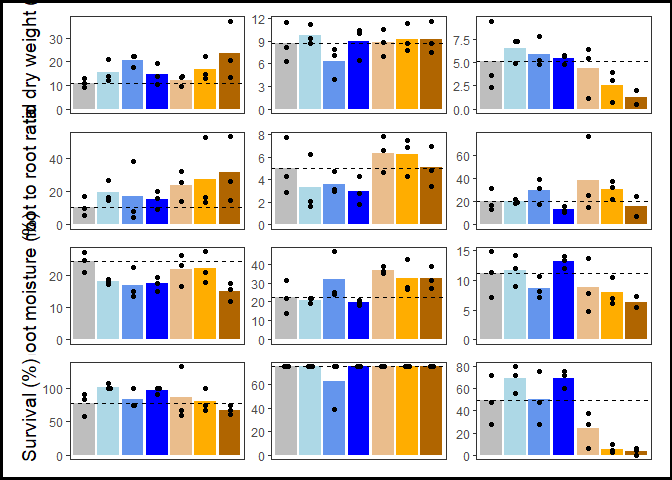<!-- -->

``` r
ggsave("./direct/figs/all_raw_data.png",
       width=6, height=8, units = "in")

##### Raw data (peas only) #####

## just the legend
legend <- get_legend(
  plots.out1[["dry_pod_weight"]] +
    theme(legend.position = "bottom"))
```

    ## Warning: Removed 1 rows containing missing values (`geom_point()`).

``` r
legend_fig <- plot_grid(legend)

##### Infection by contaminant level (peas only) #####

## model 3: infection and contaminant level
direct.f <- direct %>%
         filter(species == "pea" & contam == "BS") %>%
  droplevels(.)

### means
df.means <- direct.f %>% 
  group_by(spikeFac) %>%
  summarize(mean = mean(infected_peas_perc, 
                        na.rm = TRUE))

## plot
M3_plot <- ggplot(df.means,
                  aes(x = spikeFac, y = mean)) +
    geom_bar(aes(fill = spikeFac),
             stat = "identity") +
    geom_beeswarm(data = direct.f,
                  aes(y = infected_peas_perc)) +
    scale_fill_manual(values = c("#EABD8C",
                                 "#FFAD00",
                                 "#B06500")) +
    labs(x = "Spiking level", 
         y = "Infected (%)") +
    guides(fill = "none") +
    theme_bw() +
    theme(
      axis.text.x = element_text(size = 12),
      axis.title.x = element_text(size = 14),
      axis.text.y = element_text(size = 12),
      axis.title.y = element_text(size = 14),
      strip.text = element_text(size = 14, face = "bold"),
      panel.grid.major = element_blank(),
      panel.grid.minor = element_blank(),
    )
M3_plot
```

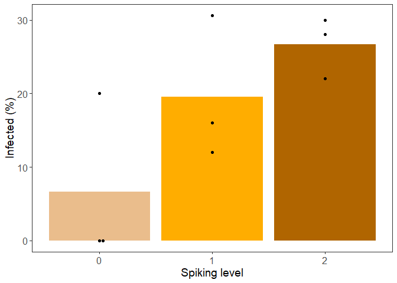<!-- -->

``` r
ggsave("./direct/figs/M3_plot.png", 
       width = 6, height = 6, 
       units = "in")

## model 4: infection and survival
##### Infection vs Survival (peas only) #####
M4_plot <- ggplot(direct %>%
         filter(species == "pea" & contam == "BS"),
       aes(x = infected_peas_perc, y = survival_perc)) +
  geom_smooth(method = "lm", colour = "black") +
  geom_point(aes(colour = spikeFac), size = 3) +
  scale_colour_manual(values = c("#EABD8C",
                                 "#FFAD00",
                                 "#B06500")) +
  labs(y = "Survival (%)", 
         x = "Infected (%)") +
    guides(colour = "none") +
    theme_bw() +
    theme(
      axis.text.x = element_text(size = 12),
      axis.title.x = element_text(size = 14),
      axis.text.y = element_text(size = 12),
      axis.title.y = element_text(size = 14),
      strip.text = element_text(size = 14, face = "bold"),
      panel.grid.major = element_blank(),
      panel.grid.minor = element_blank(),
    )
M4_plot
```

    ## `geom_smooth()` using formula = 'y ~ x'

<!-- -->

``` r
ggsave("./direct/figs/M4_plot.png", 
       width = 6, height = 6, 
       units = "in")
```

    ## `geom_smooth()` using formula = 'y ~ x'

``` r
## plot grid for just the pea traits
fig_peas <- plot_grid(
  plots.out1[["dry_pod_weight"]] + ## TL 
    labs(y = "Dry pod weight (g)"),
  plots.out1[["pods"]] + ## TR
    labs(y = "Pods (no.)"),
  plots.out1[["flowers"]] + ## ML
    labs(y = "Flowers (no.)"), 
  M3_plot, ## MR
  M4_plot, ## BL
  legend, ## BR
  ncol = 2,
  nrow = 3,
  #rel_heights = c(1,1,0.4),
  align = "hv",
  labels = NULL)
```

    ## Warning: Removed 1 rows containing missing values (`geom_point()`).
    ## Removed 1 rows containing missing values (`geom_point()`).
    ## Removed 1 rows containing missing values (`geom_point()`).

    ## `geom_smooth()` using formula = 'y ~ x'

    ## Warning: Graphs cannot be vertically aligned unless the axis parameter is set.
    ## Placing graphs unaligned.

    ## Warning: Graphs cannot be horizontally aligned unless the axis parameter is
    ## set. Placing graphs unaligned.

``` r
fig_peas.b <- ggdraw() +
  draw_plot(fig_peas, x = 0.02, y = 0.02, width = 0.96, height = 0.96) +
  theme_void() +
  theme(plot.background = element_rect(color = "black", 
                                       linewidth = 2, 
                                       fill = NA))
fig_peas.b
```

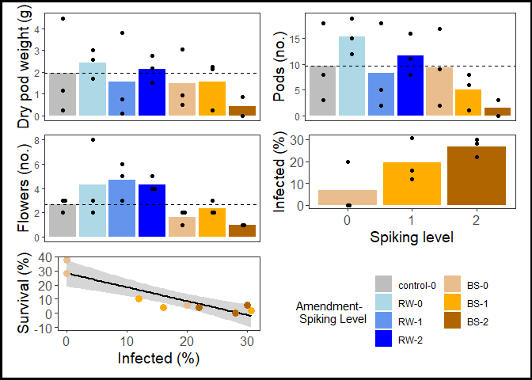<!-- -->

``` r
ggsave("./direct/figs/pea_raw_data.png", 
       width = 6, height = 6, 
       units = "in")
  
## plot grid for all traits
fig_all <- plot_grid(
          fig1.b, 
          fig_peas.b,
          ncol = 2,
          rel_widths = c(1, 1),
          align = "hv",
          axis = "tblr",
          labels = NULL)
fig_all
```

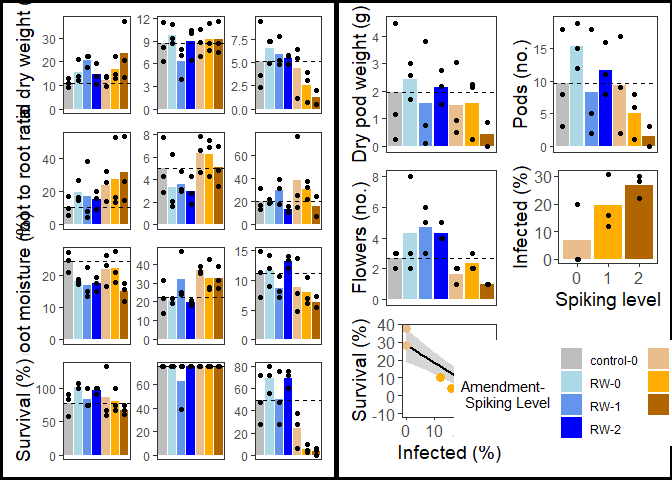<!-- -->

``` r
## add titles for each column

# Create a row of subtitles

# Create a row of four subtitles
x_coords <- seq(1/12, 11/12, length.out = 6)
subtitle_row <- ggdraw() +
  draw_label("Lettuce", x = x_coords[[1]] + 0.03, y = 0.5, 
             hjust = 0.5, size = 14, fontface = "bold") +
  draw_label("Radish", x = x_coords[[2]] + 0.02, y = 0.5, 
             hjust = 0.5, size = 14, fontface = "bold") +
  draw_label("Pea", x = x_coords[[3]], y = 0.5, 
             hjust = 0.5, size = 14, fontface = "bold") +
  draw_label("Pea", x = x_coords[[5]], y = 0.5, 
             hjust = 0.5, size = 14, fontface = "bold")

# Combine subtitle row and main panel
final_plot <- plot_grid(
  subtitle_row,
  fig_all,
  ncol = 1,
  rel_heights = c(0.02, 1)
)
final_plot
```

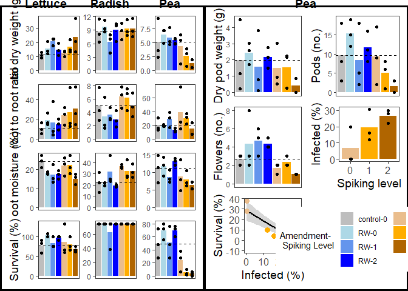<!-- -->

``` r
ggsave("./direct/figs/Fig1_direct.png", 
       width = 12, height = 10, 
       units = "in")
```

#### Post-hoc tests (supplementary figs)

``` r
## figures (contrasts)
load(file = "./direct/model_outputs/cont1.Rdata") ## loads cont

cont$contam <- ifelse(grepl("BS", cont$contrast, fixed = FALSE),
                      "BS", "RW")

cont$contam <- factor(cont$contam,
                      levels = c("RW",
                                 "BS"))

### sig traits
sig.traits <- c("survival_perc.corr",
                "shoot_moisture","shoot_root_ratio",
                "dry_total_weight")

### filter dataset to sig traits
cont.f <- cont %>%
         filter(trait %in% sig.traits) %>%
         droplevels(.)

cont.f$trait <- factor(cont.f$trait,
          levels = c(#"dry_shoot_weight","dry_root_weight",
         "dry_total_weight", 
         "shoot_root_ratio",
         "shoot_moisture",
         "survival_perc.corr"))

### rename traits
trait_names <- c(
  per_plant_weight = 'Per plant weight (g)',
  dry_shoot_weight = 'Dry shoot \n weight (g)',
  dry_total_weight = 'Dry total \n weight (g)',
  dry_root_weight = 'Dry root \n weight (g)',
  shoot_root_ratio = 'Shoot to root \n ratio',
  shoot_moisture = 'Shoot moisture \n (%)',
  germination_perc = 'Germination \n (%)',
  survival_perc.corr = 'Survival \n (%)',
  pods = "Pods (no.)"
)

species_names <- c(
  lettuce = 'Lettuce',
  pea = 'Pea',
  radish = 'Radish'
)

##### Contrasts (amendment type) #####
M1_plot <- ggplot(data = cont.f,
   aes(x = contam, 
       y = log2(ratio), 
       colour = contam)) +
  geom_pointrange(aes(ymin = log2(lower.CL),
                      ymax = log2(upper.CL)),
                  position = position_dodge(0.5)) +
  geom_hline(aes(yintercept = 0),
             linetype = 2) +
  coord_flip() +
   scale_colour_manual(values = c(
                                  "blue",
                                 "#B06500")) +
  facet_grid(trait~species, scales = "fixed",
             labeller = labeller(trait = trait_names,
                                 species = species_names)) +
  labs(x = NULL, y = expression(log[2]~"Fold Change (95% CL)")) +
  guides(colour = "none") +
  theme_bw() +
  theme(
    axis.text = element_text(size = 12),
    axis.title.x = element_text(size = 14),
    strip.text.y = element_blank(),
    strip.text.x = element_text(size = 14, face = "bold"),
    panel.grid.major = element_blank(),
    panel.grid.minor = element_blank(),
  )
M1_plot
```

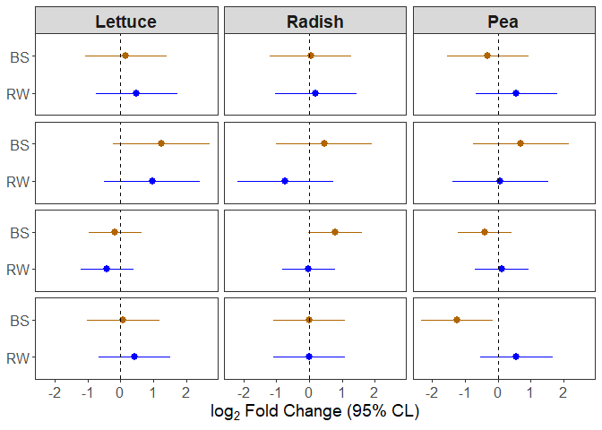<!-- -->

``` r
## M2

## emms (emmeans)
emms <- read_csv("./direct/model_outputs/emm2.csv")
```

    ## Rows: 204 Columns: 17
    ## ── Column specification ────────────────────────────────────────────────────────
    ## Delimiter: ","
    ## chr  (3): species, trait, amend
    ## dbl (14): spikeFac, emmean, SE, df, lower.CL, upper.CL, t.ratio, p.value, as...
    ## 
    ## ℹ Use `spec()` to retrieve the full column specification for this data.
    ## ℹ Specify the column types or set `show_col_types = FALSE` to quiet this message.

``` r
emms$amend <- factor(emms$amend,
                      levels = c("RW",
                                 "BS"))

emms$species <- ifelse(is.na(emms$species) == TRUE,
                       "pea", emms$species)
emms$species <- factor(emms$species,
                       levels = c("lettuce",
                                  "radish",
                                  "pea"))

### sig traits
sig.traits <- c("survival_perc.corr",
                "shoot_moisture",
                "shoot_root_ratio",
                "dry_total_weight")

### filter dataset to sig traits
emms.f <- emms %>%
         filter(trait %in% sig.traits) %>%
         droplevels(.)

## trait order
emms.f$trait <- factor(emms.f$trait,
          levels = c(#"dry_shoot_weight","dry_root_weight",
         "dry_total_weight", 
         "shoot_root_ratio",
         "shoot_moisture",
         "survival_perc.corr"))

### rename traits
trait_names <- c(
  per_plant_weight = 'Per plant weight \n (g)',
  dry_shoot_weight = 'Dry shoot \n weight (g)',
  dry_total_weight = 'Dry total \n weight (g)',
  dry_root_weight = 'Dry root \n weight (g)',
  shoot_root_ratio = 'Shoot to \n root ratio',
  shoot_moisture = 'Shoot \n moisture \n (%)',
  germination_perc = 'Germination \n (%)',
  survival_perc.corr = 'Survival \n (%)',
  pods = "Pods (no.)"
)

### rename species
species_names <- c(
  lettuce = 'Lettuce',
  pea = 'Pea',
  radish = 'Radish'
)

##### Contrasts (contamination level) #####
M2_plot <- ggplot(data = emms.f,
   aes(x = factor(spikeFac), 
       y = emmean, 
       colour = amend)) +
  geom_line(aes(group = amend),
            position = position_dodge(0.5)) +
  geom_pointrange(data = emms.f %>%
                    filter(trait != "pods"),
                           aes(ymin = lower.CL,
                      ymax = upper.CL),
                  position = position_dodge(0.5)) +
  geom_pointrange(data = emms.f %>%
                    filter(trait == "pods"),
                           aes(ymin = asymp.LCL,
                      ymax = asymp.UCL),
                  position = position_dodge(0.5)) +
   scale_colour_manual(values = c(
                                  "blue",
                                 "#B06500")) +
  facet_grid(trait~species, scales = "fixed",
             labeller = labeller(trait = trait_names,
                                 species = species_names)) +
  labs(y = expression("EM mean (95% CL)"), 
       x = "Contaminant spiking level") +
  guides(colour = "none") +
  theme_bw() +
  theme(
    axis.text = element_text(size = 12),
    axis.title.x = element_text(size = 14),
    axis.title.y = element_text(size = 14),
    strip.text = element_text(size = 14, face = "bold"),
    panel.grid.major = element_blank(),
    panel.grid.minor = element_blank(),
  )
M2_plot
```

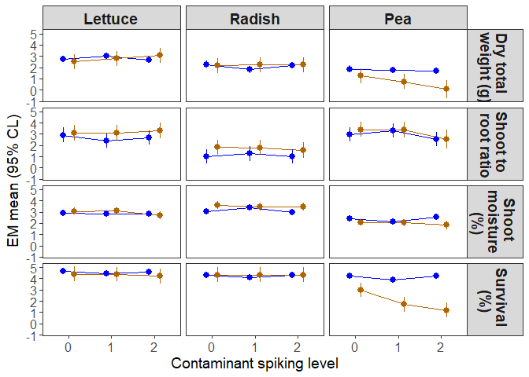<!-- -->

``` r
plots <- plot_grid(M1_plot, M2_plot,
                   ncol = 2,
                   align = "h",
                   labels = NULL)
plots
```

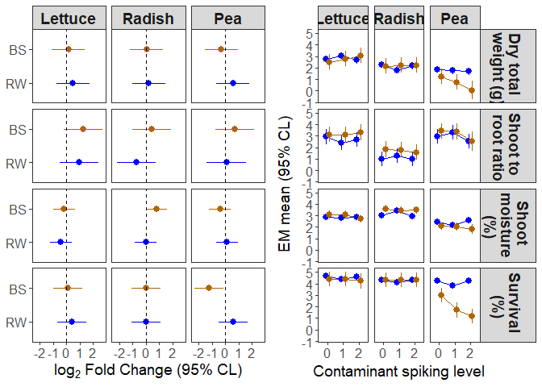<!-- -->

``` r
ggsave("./direct/figs/model_plots.png", 
       width = 10, height = 6, 
       units = "in")
```

## Microbially-mediated (i.e., indirect) impacts of contaminants

DESCRIPTION

### Load data

``` r
indirect <- read_csv("./indirect.csv")
```

    ## Rows: 73 Columns: 51
    ## ── Column specification ────────────────────────────────────────────────────────
    ## Delimiter: ","
    ## chr (16): treatment, control, contam, t1, t2, t3, t4, leaf_num_notes, chloro...
    ## dbl (32): pot_ID, num_seeds, num_plants, spiking_level, leaf_num, plant_heig...
    ## lgl  (3): nitrogen_content, num_flower_time, num_pods
    ## 
    ## ℹ Use `spec()` to retrieve the full column specification for this data.
    ## ℹ Specify the column types or set `show_col_types = FALSE` to quiet this message.

``` r
## calculate other traits
indirect$dry_total_weight <- indirect$dry_shoot_weight + 
  indirect$dry_root_weight
indirect$shoot_root_ratio <- indirect$dry_shoot_weight / 
  indirect$dry_root_weight
indirect$shoot_moisture <- (indirect$wet_shoot_weight - 
                              indirect$dry_shoot_weight) / 
  indirect$dry_shoot_weight

## set factors

### relevel treatment
indirect$treatment <- as.factor(indirect$treatment)
indirect$treatment <- relevel(indirect$treatment, ref = "Saline Control")

### specify spiking level as an ordered factor
indirect$spikeFac <- factor(indirect$spiking_level,
                          levels = c("0","1","2"),
                          ordered = TRUE)

### rename source to be consistent with direct
indirect$contam <- factor(indirect$contam,
                        levels = c("control",
                                   "no_treat",
                                   "saline",
                          "RW",
                          "BS"
                        ))

### spiking level plus contam
indirect$contam_spike <- paste0(indirect$contam, 
                                "-", 
                                indirect$spiking_level)

### order factor
indirect$contam_spike <- factor(indirect$contam_spike, 
                                levels = c("control-0",
                                           "saline-0",
                                           "no_treat-0",
                                           "BS-0",
                                           "BS-1",
                                           "BS-2",
                                           "RW-0",
                                           "RW-1",
                                           "RW-2"))


## save formatted data file
save(indirect, file = "./indirect-formatted.Rda")
```

### Models

#### Model 1: calculate emmeans for each trait and soil slurry

Impact of prior amendment type on pea traits. Exclude contaminants.
Include controls (from prior experiment). No interactions.

NOTE: recommended by data lunch to calculate the geometric means from
the soil slurries, then input those in the model

``` r
## loaf formatted data file
load(file = "./indirect-formatted.Rda") ## loads indirect

## set contrasts
options(contrasts=c("contr.sum","contr.poly")) 

## traits to run through
trait.list <- c("plant_height4",
                "chlorophyll_content4_mean", 
                "leaf_number2",
                "wet_shoot_weight", 
                "dry_shoot_weight",
                "wet_root_weight", 
                "dry_root_weight",
                "dry_total_weight",
                "shoot_root_ratio",
                "shoot_moisture")

## source function
source("./Source_code/emms.func.R")

mod1.out <- sapply(trait.list, 
                   emms.func,
                   df = indirect,
                   simplify = FALSE, 
                   USE.NAMES = TRUE)
```

    ## [1] "plant_height4"

    ## 
    ## Call:
    ## lm(formula = log(get(traits)) ~ treatment, data = df)
    ## 
    ## Residuals:
    ##      Min       1Q   Median       3Q      Max 
    ## -0.96957 -0.06594  0.01361  0.09587  0.63986 
    ## 
    ## Coefficients:
    ##             Estimate Std. Error t value Pr(>|t|)    
    ## (Intercept)  2.57572    0.03626  71.036  < 2e-16 ***
    ## treatment1   0.10100    0.11597   0.871 0.387950    
    ## treatment2   0.25634    0.17213   1.489 0.142705    
    ## treatment3  -0.50753    0.17213  -2.949 0.004843 ** 
    ## treatment4   0.11872    0.17213   0.690 0.493545    
    ## treatment5  -0.35425    0.17213  -2.058 0.044815 *  
    ## treatment6  -0.24015    0.17213  -1.395 0.169118    
    ## treatment7   0.16198    0.17213   0.941 0.351192    
    ## treatment8   0.19452    0.17213   1.130 0.263825    
    ## treatment9   0.26281    0.17213   1.527 0.133102    
    ## treatment10  0.08223    0.17213   0.478 0.634931    
    ## treatment11 -0.15684    0.17213  -0.911 0.366581    
    ## treatment12  0.24754    0.17213   1.438 0.156624    
    ## treatment13 -0.09504    0.17213  -0.552 0.583325    
    ## treatment14  0.19556    0.17213   1.136 0.261304    
    ## treatment15  0.06163    0.17213   0.358 0.721801    
    ## treatment16  0.10649    0.17213   0.619 0.538941    
    ## treatment17  0.20188    0.17213   1.173 0.246419    
    ## treatment18 -0.68720    0.17213  -3.992 0.000214 ***
    ## treatment19  0.02651    0.17213   0.154 0.878207    
    ## treatment20  0.14110    0.17213   0.820 0.416243    
    ## treatment21 -0.03183    0.17213  -0.185 0.854047    
    ## treatment22  0.18498    0.17213   1.075 0.287677    
    ## ---
    ## Signif. codes:  0 '***' 0.001 '**' 0.01 '*' 0.05 '.' 0.1 ' ' 1
    ## 
    ## Residual standard error: 0.305 on 50 degrees of freedom
    ## Multiple R-squared:  0.4873, Adjusted R-squared:  0.2618 
    ## F-statistic:  2.16 on 22 and 50 DF,  p-value: 0.01238

    ## Warning in ref_grid(lmm): There are unevaluated constants in the response formula
    ## Auto-detection of the response transformation may be incorrect

    ## [1] "chlorophyll_content4_mean"

    ## Warning: not plotting observations with leverage one:
    ##   46

    ## 
    ## Call:
    ## lm(formula = log(get(traits)) ~ treatment, data = df)
    ## 
    ## Residuals:
    ##      Min       1Q   Median       3Q      Max 
    ## -0.11609 -0.02825  0.00000  0.03124  0.08810 
    ## 
    ## Coefficients:
    ##              Estimate Std. Error t value Pr(>|t|)    
    ## (Intercept) -0.342025   0.006765 -50.557  < 2e-16 ***
    ## treatment1   0.013885   0.020106   0.691 0.493440    
    ## treatment2   0.020894   0.029702   0.703 0.485471    
    ## treatment3  -0.008265   0.036061  -0.229 0.819774    
    ## treatment4   0.007232   0.029702   0.243 0.808770    
    ## treatment5   0.050893   0.036061   1.411 0.165189    
    ## treatment6   0.022085   0.036061   0.612 0.543402    
    ## treatment7   0.004901   0.029702   0.165 0.869705    
    ## treatment8  -0.028616   0.029702  -0.963 0.340592    
    ## treatment9   0.004538   0.029702   0.153 0.879255    
    ## treatment10  0.007541   0.029702   0.254 0.800762    
    ## treatment11 -0.067651   0.029702  -2.278 0.027660 *  
    ## treatment12 -0.035807   0.029702  -1.206 0.234434    
    ## treatment13 -0.114438   0.029702  -3.853 0.000375 ***
    ## treatment14  0.003651   0.029702   0.123 0.902733    
    ## treatment15  0.017425   0.029702   0.587 0.560431    
    ## treatment16 -0.008463   0.029702  -0.285 0.777020    
    ## treatment17 -0.030609   0.029702  -1.031 0.308386    
    ## treatment18  0.032779   0.050547   0.648 0.520044    
    ## treatment19  0.026009   0.029702   0.876 0.385956    
    ## treatment20  0.018930   0.029702   0.637 0.527206    
    ## treatment21 -0.018431   0.029702  -0.621 0.538110    
    ## treatment22  0.032938   0.029702   1.109 0.273475    
    ## ---
    ## Signif. codes:  0 '***' 0.001 '**' 0.01 '*' 0.05 '.' 0.1 ' ' 1
    ## 
    ## Residual standard error: 0.05242 on 44 degrees of freedom
    ##   (6 observations deleted due to missingness)
    ## Multiple R-squared:  0.4146, Adjusted R-squared:  0.122 
    ## F-statistic: 1.417 on 22 and 44 DF,  p-value: 0.1603

    ## Warning in ref_grid(lmm): There are unevaluated constants in the response formula
    ## Auto-detection of the response transformation may be incorrect

    ## [1] "leaf_number2"

    ## 
    ## Call:
    ## lm(formula = log(get(traits)) ~ treatment, data = df)
    ## 
    ## Residuals:
    ##      Min       1Q   Median       3Q      Max 
    ## -0.99858 -0.07438  0.03512  0.10615  0.61086 
    ## 
    ## Coefficients:
    ##              Estimate Std. Error t value Pr(>|t|)    
    ## (Intercept)  2.076739   0.038417  54.057  < 2e-16 ***
    ## treatment1   0.049156   0.122871   0.400  0.69081    
    ## treatment2   0.190726   0.182371   1.046  0.30068    
    ## treatment3  -0.548417   0.182371  -3.007  0.00412 ** 
    ## treatment4   0.081224   0.182371   0.445  0.65797    
    ## treatment5  -0.385015   0.182371  -2.111  0.03978 *  
    ## treatment6  -0.002547   0.182371  -0.014  0.98891    
    ## treatment7   0.116345   0.182371   0.638  0.52641    
    ## treatment8   0.036714   0.182371   0.201  0.84127    
    ## treatment9   0.077084   0.182371   0.423  0.67435    
    ## treatment10 -0.114705   0.182371  -0.629  0.53224    
    ## treatment11 -0.011937   0.182371  -0.065  0.94807    
    ## treatment12  0.120485   0.182371   0.661  0.51186    
    ## treatment13  0.190726   0.182371   1.046  0.30068    
    ## treatment14  0.215005   0.182371   1.179  0.24400    
    ## treatment15  0.116345   0.182371   0.638  0.52641    
    ## treatment16  0.036714   0.182371   0.201  0.84127    
    ## treatment17  0.020451   0.182371   0.112  0.91116    
    ## treatment18 -0.464645   0.182371  -2.548  0.01396 *  
    ## treatment19  0.041963   0.182371   0.230  0.81895    
    ## treatment20  0.081224   0.182371   0.445  0.65797    
    ## treatment21  0.077084   0.182371   0.423  0.67435    
    ## treatment22  0.190726   0.182371   1.046  0.30068    
    ## ---
    ## Signif. codes:  0 '***' 0.001 '**' 0.01 '*' 0.05 '.' 0.1 ' ' 1
    ## 
    ## Residual standard error: 0.3232 on 50 degrees of freedom
    ## Multiple R-squared:  0.3467, Adjusted R-squared:  0.05926 
    ## F-statistic: 1.206 on 22 and 50 DF,  p-value: 0.2853

    ## Warning in ref_grid(lmm): There are unevaluated constants in the response formula
    ## Auto-detection of the response transformation may be incorrect

    ## [1] "wet_shoot_weight"

    ## 
    ## Call:
    ## lm(formula = log(get(traits)) ~ treatment, data = df)
    ## 
    ## Residuals:
    ##      Min       1Q   Median       3Q      Max 
    ## -1.26852 -0.13165  0.02989  0.15149  0.97427 
    ## 
    ## Coefficients:
    ##             Estimate Std. Error t value Pr(>|t|)    
    ## (Intercept)  6.90420    0.05714 120.820  < 2e-16 ***
    ## treatment1   0.03446    0.18277   0.189  0.85122    
    ## treatment2   0.32370    0.27127   1.193  0.23839    
    ## treatment3  -0.67605    0.27127  -2.492  0.01606 *  
    ## treatment4   0.03569    0.27127   0.132  0.89587    
    ## treatment5  -0.31218    0.27127  -1.151  0.25529    
    ## treatment6  -0.25798    0.27127  -0.951  0.34618    
    ## treatment7   0.22143    0.27127   0.816  0.41821    
    ## treatment8   0.20295    0.27127   0.748  0.45787    
    ## treatment9   0.25760    0.27127   0.950  0.34688    
    ## treatment10 -0.16787    0.27127  -0.619  0.53884    
    ## treatment11 -0.06612    0.27127  -0.244  0.80844    
    ## treatment12  0.18881    0.27127   0.696  0.48965    
    ## treatment13  0.13962    0.27127   0.515  0.60903    
    ## treatment14  0.17484    0.27127   0.645  0.52218    
    ## treatment15  0.38918    0.27127   1.435  0.15761    
    ## treatment16  0.04689    0.27127   0.173  0.86347    
    ## treatment17  0.24364    0.27127   0.898  0.37341    
    ## treatment18 -0.86248    0.27127  -3.179  0.00253 ** 
    ## treatment19  0.08580    0.27127   0.316  0.75310    
    ## treatment20  0.24502    0.27127   0.903  0.37073    
    ## treatment21 -0.05385    0.27127  -0.198  0.84346    
    ## treatment22  0.21846    0.27127   0.805  0.42444    
    ## ---
    ## Signif. codes:  0 '***' 0.001 '**' 0.01 '*' 0.05 '.' 0.1 ' ' 1
    ## 
    ## Residual standard error: 0.4807 on 50 degrees of freedom
    ## Multiple R-squared:  0.3687, Adjusted R-squared:  0.09091 
    ## F-statistic: 1.327 on 22 and 50 DF,  p-value: 0.2013

    ## Warning in ref_grid(lmm): There are unevaluated constants in the response formula
    ## Auto-detection of the response transformation may be incorrect

    ## [1] "dry_shoot_weight"

    ## 
    ## Call:
    ## lm(formula = log(get(traits)) ~ treatment, data = df)
    ## 
    ## Residuals:
    ##      Min       1Q   Median       3Q      Max 
    ## -1.39363 -0.17583  0.04005  0.24369  0.86211 
    ## 
    ## Coefficients:
    ##               Estimate Std. Error t value Pr(>|t|)    
    ## (Intercept)  4.7172500  0.0603938  78.108  < 2e-16 ***
    ## treatment1   0.1172119  0.1931591   0.607  0.54672    
    ## treatment2   0.3647919  0.2866958   1.272  0.20912    
    ## treatment3  -0.8056896  0.2866958  -2.810  0.00705 ** 
    ## treatment4   0.2932222  0.2866958   1.023  0.31134    
    ## treatment5  -0.3480939  0.2866958  -1.214  0.23039    
    ## treatment6  -0.3698665  0.2866958  -1.290  0.20295    
    ## treatment7   0.2344881  0.2866958   0.818  0.41730    
    ## treatment8   0.2502605  0.2866958   0.873  0.38688    
    ## treatment9   0.1910476  0.2866958   0.666  0.50823    
    ## treatment10 -0.0027754  0.2866958  -0.010  0.99231    
    ## treatment11 -0.0594725  0.2866958  -0.207  0.83651    
    ## treatment12  0.1718481  0.2866958   0.599  0.55161    
    ## treatment13  0.0685672  0.2866958   0.239  0.81196    
    ## treatment14  0.2362477  0.2866958   0.824  0.41383    
    ## treatment15 -0.0008945  0.2866958  -0.003  0.99752    
    ## treatment16  0.1885871  0.2866958   0.658  0.51369    
    ## treatment17  0.2407273  0.2866958   0.840  0.40510    
    ## treatment18 -0.8344238  0.2866958  -2.910  0.00538 ** 
    ## treatment19  0.0945924  0.2866958   0.330  0.74282    
    ## treatment20  0.2870053  0.2866958   1.001  0.32161    
    ## treatment21 -0.0513790  0.2866958  -0.179  0.85850    
    ## treatment22  0.2502311  0.2866958   0.873  0.38694    
    ## ---
    ## Signif. codes:  0 '***' 0.001 '**' 0.01 '*' 0.05 '.' 0.1 ' ' 1
    ## 
    ## Residual standard error: 0.508 on 50 degrees of freedom
    ## Multiple R-squared:  0.3783, Adjusted R-squared:  0.1048 
    ## F-statistic: 1.383 on 22 and 50 DF,  p-value: 0.17

    ## Warning in ref_grid(lmm): There are unevaluated constants in the response formula
    ## Auto-detection of the response transformation may be incorrect

    ## [1] "wet_root_weight"

    ## 
    ## Call:
    ## lm(formula = log(get(traits)) ~ treatment, data = df)
    ## 
    ## Residuals:
    ##     Min      1Q  Median      3Q     Max 
    ## -3.9718 -0.4124  0.1557  0.5965  2.3647 
    ## 
    ## Coefficients:
    ##              Estimate Std. Error t value Pr(>|t|)    
    ## (Intercept)  5.697758   0.141928  40.145   <2e-16 ***
    ## treatment1   0.394396   0.453931   0.869   0.3891    
    ## treatment2   0.333184   0.673746   0.495   0.6231    
    ## treatment3  -1.267239   0.673746  -1.881   0.0658 .  
    ## treatment4   0.204975   0.673746   0.304   0.7622    
    ## treatment5   0.754410   0.673746   1.120   0.2682    
    ## treatment6  -0.395902   0.673746  -0.588   0.5594    
    ## treatment7   0.574441   0.673746   0.853   0.3979    
    ## treatment8   0.489539   0.673746   0.727   0.4709    
    ## treatment9   0.036065   0.673746   0.054   0.9575    
    ## treatment10 -1.077659   0.673746  -1.600   0.1160    
    ## treatment11  0.218453   0.673746   0.324   0.7471    
    ## treatment12 -1.096033   0.673746  -1.627   0.1101    
    ## treatment13  0.427584   0.673746   0.635   0.5286    
    ## treatment14  0.465665   0.673746   0.691   0.4927    
    ## treatment15 -0.008446   0.673746  -0.013   0.9900    
    ## treatment16  1.002664   0.673746   1.488   0.1430    
    ## treatment17  0.402010   0.673746   0.597   0.5534    
    ## treatment18 -0.875486   0.673746  -1.299   0.1998    
    ## treatment19  0.086769   0.673746   0.129   0.8980    
    ## treatment20  0.097386   0.673746   0.145   0.8857    
    ## treatment21 -0.191610   0.673746  -0.284   0.7773    
    ## treatment22  0.620178   0.673746   0.920   0.3617    
    ## ---
    ## Signif. codes:  0 '***' 0.001 '**' 0.01 '*' 0.05 '.' 0.1 ' ' 1
    ## 
    ## Residual standard error: 1.194 on 50 degrees of freedom
    ## Multiple R-squared:  0.2966, Adjusted R-squared:  -0.01286 
    ## F-statistic: 0.9585 on 22 and 50 DF,  p-value: 0.5275

    ## Warning in ref_grid(lmm): There are unevaluated constants in the response formula
    ## Auto-detection of the response transformation may be incorrect

    ## [1] "dry_root_weight"

    ## 
    ## Call:
    ## lm(formula = log(get(traits)) ~ treatment, data = df)
    ## 
    ## Residuals:
    ##      Min       1Q   Median       3Q      Max 
    ## -2.95707 -0.18813 -0.00235  0.27900  1.74859 
    ## 
    ## Coefficients:
    ##              Estimate Std. Error t value Pr(>|t|)    
    ## (Intercept)  3.794702   0.082385  46.061   <2e-16 ***
    ## treatment1   0.352986   0.263494   1.340    0.186    
    ## treatment2   0.221483   0.391090   0.566    0.574    
    ## treatment3  -0.572825   0.391090  -1.465    0.149    
    ## treatment4   0.226344   0.391090   0.579    0.565    
    ## treatment5   0.442795   0.391090   1.132    0.263    
    ## treatment6  -0.145752   0.391090  -0.373    0.711    
    ## treatment7   0.253249   0.391090   0.648    0.520    
    ## treatment8   0.186422   0.391090   0.477    0.636    
    ## treatment9  -0.226741   0.391090  -0.580    0.565    
    ## treatment10 -0.521155   0.391090  -1.333    0.189    
    ## treatment11  0.159499   0.391090   0.408    0.685    
    ## treatment12 -0.146814   0.391090  -0.375    0.709    
    ## treatment13  0.080382   0.391090   0.206    0.838    
    ## treatment14  0.176809   0.391090   0.452    0.653    
    ## treatment15 -0.001363   0.391090  -0.003    0.997    
    ## treatment16  0.500818   0.391090   1.281    0.206    
    ## treatment17  0.152163   0.391090   0.389    0.699    
    ## treatment18 -0.485849   0.391090  -1.242    0.220    
    ## treatment19  0.231651   0.391090   0.592    0.556    
    ## treatment20 -0.043008   0.391090  -0.110    0.913    
    ## treatment21  0.097194   0.391090   0.249    0.805    
    ## treatment22  0.256014   0.391090   0.655    0.516    
    ## ---
    ## Signif. codes:  0 '***' 0.001 '**' 0.01 '*' 0.05 '.' 0.1 ' ' 1
    ## 
    ## Residual standard error: 0.693 on 50 degrees of freedom
    ## Multiple R-squared:  0.3043, Adjusted R-squared:  -0.001824 
    ## F-statistic: 0.994 on 22 and 50 DF,  p-value: 0.4877

    ## Warning in ref_grid(lmm): There are unevaluated constants in the response formula
    ## Auto-detection of the response transformation may be incorrect

    ## [1] "dry_total_weight"

    ## 
    ## Call:
    ## lm(formula = log(get(traits)) ~ treatment, data = df)
    ## 
    ## Residuals:
    ##      Min       1Q   Median       3Q      Max 
    ## -1.52967 -0.15872  0.04884  0.19533  0.92207 
    ## 
    ## Coefficients:
    ##             Estimate Std. Error t value Pr(>|t|)    
    ## (Intercept)  5.07677    0.05650  89.855  < 2e-16 ***
    ## treatment1   0.16841    0.18070   0.932  0.35585    
    ## treatment2   0.30925    0.26821   1.153  0.25439    
    ## treatment3  -0.75843    0.26821  -2.828  0.00673 ** 
    ## treatment4   0.25281    0.26821   0.943  0.35043    
    ## treatment5   0.01804    0.26821   0.067  0.94663    
    ## treatment6  -0.31352    0.26821  -1.169  0.24797    
    ## treatment7   0.22124    0.26821   0.825  0.41335    
    ## treatment8   0.21382    0.26821   0.797  0.42909    
    ## treatment9   0.07317    0.26821   0.273  0.78613    
    ## treatment10 -0.13376    0.26821  -0.499  0.62016    
    ## treatment11 -0.01200    0.26821  -0.045  0.96448    
    ## treatment12  0.07149    0.26821   0.267  0.79091    
    ## treatment13  0.04790    0.26821   0.179  0.85899    
    ## treatment14  0.19692    0.26821   0.734  0.46627    
    ## treatment15 -0.02552    0.26821  -0.095  0.92457    
    ## treatment16  0.26524    0.26821   0.989  0.32747    
    ## treatment17  0.19466    0.26821   0.726  0.47136    
    ## treatment18 -0.69342    0.26821  -2.585  0.01269 *  
    ## treatment19  0.11684    0.26821   0.436  0.66499    
    ## treatment20  0.17937    0.26821   0.669  0.50671    
    ## treatment21 -0.01883    0.26821  -0.070  0.94430    
    ## treatment22  0.23428    0.26821   0.873  0.38658    
    ## ---
    ## Signif. codes:  0 '***' 0.001 '**' 0.01 '*' 0.05 '.' 0.1 ' ' 1
    ## 
    ## Residual standard error: 0.4753 on 50 degrees of freedom
    ## Multiple R-squared:  0.3605, Adjusted R-squared:  0.07911 
    ## F-statistic: 1.281 on 22 and 50 DF,  p-value: 0.2305

    ## Warning in ref_grid(lmm): There are unevaluated constants in the response formula
    ## Auto-detection of the response transformation may be incorrect

    ## [1] "shoot_root_ratio"

    ## 
    ## Call:
    ## lm(formula = log(get(traits)) ~ treatment, data = df)
    ## 
    ## Residuals:
    ##      Min       1Q   Median       3Q      Max 
    ## -1.20965 -0.17749 -0.02373  0.19891  1.65748 
    ## 
    ## Coefficients:
    ##               Estimate Std. Error t value Pr(>|t|)    
    ## (Intercept)  0.9225478  0.0571416  16.145   <2e-16 ***
    ## treatment1  -0.2357745  0.1827577  -1.290   0.2030    
    ## treatment2   0.1433092  0.2712575   0.528   0.5996    
    ## treatment3  -0.2328651  0.2712575  -0.858   0.3947    
    ## treatment4   0.0668778  0.2712575   0.247   0.8063    
    ## treatment5  -0.7908894  0.2712575  -2.916   0.0053 ** 
    ## treatment6  -0.2241150  0.2712575  -0.826   0.4126    
    ## treatment7  -0.0187606  0.2712575  -0.069   0.9451    
    ## treatment8   0.0638381  0.2712575   0.235   0.8149    
    ## treatment9   0.4177889  0.2712575   1.540   0.1298    
    ## treatment10  0.5183796  0.2712575   1.911   0.0617 .  
    ## treatment11 -0.2189712  0.2712575  -0.807   0.4233    
    ## treatment12  0.3186623  0.2712575   1.175   0.2457    
    ## treatment13 -0.0118151  0.2712575  -0.044   0.9654    
    ## treatment14  0.0594385  0.2712575   0.219   0.8274    
    ## treatment15  0.0004687  0.2712575   0.002   0.9986    
    ## treatment16 -0.3122313  0.2712575  -1.151   0.2552    
    ## treatment17  0.0885642  0.2712575   0.326   0.7454    
    ## treatment18 -0.3485748  0.2712575  -1.285   0.2047    
    ## treatment19 -0.1370581  0.2712575  -0.505   0.6156    
    ## treatment20  0.3300130  0.2712575   1.217   0.2295    
    ## treatment21 -0.1485731  0.2712575  -0.548   0.5863    
    ## treatment22 -0.0057828  0.2712575  -0.021   0.9831    
    ## ---
    ## Signif. codes:  0 '***' 0.001 '**' 0.01 '*' 0.05 '.' 0.1 ' ' 1
    ## 
    ## Residual standard error: 0.4807 on 50 degrees of freedom
    ## Multiple R-squared:  0.3758, Adjusted R-squared:  0.1011 
    ## F-statistic: 1.368 on 22 and 50 DF,  p-value: 0.178

    ## Warning in ref_grid(lmm): There are unevaluated constants in the response formula
    ## Auto-detection of the response transformation may be incorrect

    ## [1] "shoot_moisture"

    ## 
    ## Call:
    ## lm(formula = log(get(traits)) ~ treatment, data = df)
    ## 
    ## Residuals:
    ##      Min       1Q   Median       3Q      Max 
    ## -0.38807 -0.08254 -0.00059  0.10607  0.44619 
    ## 
    ## Coefficients:
    ##              Estimate Std. Error t value Pr(>|t|)    
    ## (Intercept)  2.065670   0.021323  96.875  < 2e-16 ***
    ## treatment1  -0.091951   0.068198  -1.348  0.18364    
    ## treatment2  -0.044675   0.101223  -0.441  0.66086    
    ## treatment3   0.146149   0.101223   1.444  0.15502    
    ## treatment4  -0.293211   0.101223  -2.897  0.00558 ** 
    ## treatment5   0.042041   0.101223   0.415  0.67968    
    ## treatment6   0.127286   0.101223   1.257  0.21442    
    ## treatment7  -0.012987   0.101223  -0.128  0.89843    
    ## treatment8  -0.051334   0.101223  -0.507  0.61429    
    ## treatment9   0.075281   0.101223   0.744  0.46053    
    ## treatment10 -0.186771   0.101223  -1.845  0.07094 .  
    ## treatment11 -0.005497   0.101223  -0.054  0.95691    
    ## treatment12  0.020429   0.101223   0.202  0.84087    
    ## treatment13  0.080450   0.101223   0.795  0.43050    
    ## treatment14 -0.067310   0.101223  -0.665  0.50913    
    ## treatment15  0.427888   0.101223   4.227  0.00010 ***
    ## treatment16 -0.159490   0.101223  -1.576  0.12142    
    ## treatment17  0.005391   0.101223   0.053  0.95774    
    ## treatment18 -0.034132   0.101223  -0.337  0.73738    
    ## treatment19 -0.009099   0.101223  -0.090  0.92873    
    ## treatment20 -0.048191   0.101223  -0.476  0.63608    
    ## treatment21 -0.001627   0.101223  -0.016  0.98724    
    ## treatment22 -0.034267   0.101223  -0.339  0.73638    
    ## ---
    ## Signif. codes:  0 '***' 0.001 '**' 0.01 '*' 0.05 '.' 0.1 ' ' 1
    ## 
    ## Residual standard error: 0.1794 on 50 degrees of freedom
    ## Multiple R-squared:  0.4438, Adjusted R-squared:  0.1991 
    ## F-statistic: 1.814 on 22 and 50 DF,  p-value: 0.04146

    ## Warning in ref_grid(lmm): There are unevaluated constants in the response formula
    ## Auto-detection of the response transformation may be incorrect

``` r
### aovs
aov <- lapply(mod1.out, `[[`, 1) %>%
  bind_rows(.)
write.csv(aov, "./indirect/model_outputs/aov1.csv", 
          row.names = FALSE)

### emmeans
emm <- lapply(mod1.out, `[[`, 2) %>%
  bind_rows(.)
save(emm, file = "./indirect/model_outputs/emm1.Rda")
write.csv(emm, "./indirect/model_outputs/emm1.csv", 
          row.names = FALSE)
### CONTRASTS
cont <- lapply(mod1.out, `[[`, 3) %>%
  bind_rows(.)
write.csv(cont, "./indirect/model_outputs/cont1.csv", 
          row.names = FALSE)
```

#### M2: impact of prior amendment type on traits

``` r
## load emmeans
load(file = "./indirect/model_outputs/emm1.Rda") ## loads emm

## set contrasts
options(contrasts=c("contr.sum","contr.poly")) 

## traits to run through
trait.list <- c("plant_height4",
                "chlorophyll_content4_mean", 
                "leaf_number2",
                "wet_shoot_weight", 
                "dry_shoot_weight",
                "wet_root_weight", 
                "dry_root_weight",
                "dry_total_weight",
                "shoot_root_ratio",
                "shoot_moisture")

## source function
source("./Source_code/indirect_m2.func.R")

mod2.out <- sapply(trait.list, 
                   indirect_m2.func,
                   df = emm %>%
                         filter(!contam %in% c("saline","no_treat") &
                                  spikeFac == "0") %>%
                         droplevels(.),
                   simplify = FALSE, 
                   USE.NAMES = TRUE)
```

    ## [1] "plant_height4"

    ## 
    ## Call:
    ## lm(formula = log(response) ~ contam, data = df.f)
    ## 
    ## Residuals:
    ##      Min       1Q   Median       3Q      Max 
    ## -0.14332 -0.11530  0.04302  0.06528  0.20332 
    ## 
    ## Coefficients:
    ##             Estimate Std. Error t value Pr(>|t|)    
    ## (Intercept)  2.64198    0.04551  58.059 1.75e-09 ***
    ## contam1      0.03183    0.06435   0.495   0.6385    
    ## contam2     -0.16309    0.06435  -2.534   0.0444 *  
    ## ---
    ## Signif. codes:  0 '***' 0.001 '**' 0.01 '*' 0.05 '.' 0.1 ' ' 1
    ## 
    ## Residual standard error: 0.1365 on 6 degrees of freedom
    ## Multiple R-squared:  0.5461, Adjusted R-squared:  0.3948 
    ## F-statistic: 3.609 on 2 and 6 DF,  p-value: 0.09352
    ## 
    ## [1] "chlorophyll_content4_mean"

    ## 
    ## Call:
    ## lm(formula = log(response) ~ contam, data = df.f)
    ## 
    ## Residuals:
    ##       Min        1Q    Median        3Q       Max 
    ## -0.049641 -0.027898  0.009546  0.015450  0.040095 
    ## 
    ## Coefficients:
    ##             Estimate Std. Error t value Pr(>|t|)    
    ## (Intercept) -0.34695    0.01118 -31.043 7.42e-08 ***
    ## contam1      0.01607    0.01581   1.017    0.349    
    ## contam2     -0.01309    0.01581  -0.828    0.439    
    ## ---
    ## Signif. codes:  0 '***' 0.001 '**' 0.01 '*' 0.05 '.' 0.1 ' ' 1
    ## 
    ## Residual standard error: 0.03353 on 6 degrees of freedom
    ## Multiple R-squared:  0.1632, Adjusted R-squared:  -0.1158 
    ## F-statistic: 0.5849 on 2 and 6 DF,  p-value: 0.586
    ## 
    ## [1] "leaf_number2"

    ## 
    ## Call:
    ## lm(formula = log(response) ~ contam, data = df.f)
    ## 
    ## Residuals:
    ##       Min        1Q    Median        3Q       Max 
    ## -0.142326 -0.035120 -0.009957  0.049462  0.092864 
    ## 
    ## Coefficients:
    ##             Estimate Std. Error t value Pr(>|t|)    
    ## (Intercept)  2.12720    0.02754  77.231 3.17e-10 ***
    ## contam1      0.06589    0.03895   1.691    0.142    
    ## contam2     -0.04305    0.03895  -1.105    0.311    
    ## ---
    ## Signif. codes:  0 '***' 0.001 '**' 0.01 '*' 0.05 '.' 0.1 ' ' 1
    ## 
    ## Residual standard error: 0.08263 on 6 degrees of freedom
    ## Multiple R-squared:  0.3297, Adjusted R-squared:  0.1062 
    ## F-statistic: 1.475 on 2 and 6 DF,  p-value: 0.3012
    ## 
    ## [1] "wet_shoot_weight"

    ## 
    ## Call:
    ## lm(formula = log(response) ~ contam, data = df.f)
    ## 
    ## Residuals:
    ##      Min       1Q   Median       3Q      Max 
    ## -0.26072 -0.16558  0.08192  0.10847  0.16476 
    ## 
    ## Coefficients:
    ##             Estimate Std. Error t value Pr(>|t|)    
    ## (Intercept)  6.94986    0.06185 112.370 3.35e-11 ***
    ## contam1      0.09088    0.08747   1.039    0.339    
    ## contam2     -0.13807    0.08747  -1.578    0.166    
    ## ---
    ## Signif. codes:  0 '***' 0.001 '**' 0.01 '*' 0.05 '.' 0.1 ' ' 1
    ## 
    ## Residual standard error: 0.1855 on 6 degrees of freedom
    ## Multiple R-squared:  0.3003, Adjusted R-squared:  0.06704 
    ## F-statistic: 1.287 on 2 and 6 DF,  p-value: 0.3426
    ## 
    ## [1] "dry_shoot_weight"

    ## 
    ## Call:
    ## lm(formula = log(response) ~ contam, data = df.f)
    ## 
    ## Residuals:
    ##      Min       1Q   Median       3Q      Max 
    ## -0.28962 -0.12281  0.05181  0.08828  0.26884 
    ## 
    ## Coefficients:
    ##             Estimate Std. Error t value Pr(>|t|)    
    ## (Intercept)  4.78450    0.06781  70.553 5.46e-10 ***
    ## contam1      0.09471    0.09590   0.988    0.362    
    ## contam2     -0.14750    0.09590  -1.538    0.175    
    ## ---
    ## Signif. codes:  0 '***' 0.001 '**' 0.01 '*' 0.05 '.' 0.1 ' ' 1
    ## 
    ## Residual standard error: 0.2034 on 6 degrees of freedom
    ## Multiple R-squared:  0.2882, Adjusted R-squared:  0.0509 
    ## F-statistic: 1.215 on 2 and 6 DF,  p-value: 0.3607
    ## 
    ## [1] "wet_root_weight"

    ## 
    ## Call:
    ## lm(formula = log(response) ~ contam, data = df.f)
    ## 
    ## Residuals:
    ##      Min       1Q   Median       3Q      Max 
    ## -0.67097 -0.36693 -0.07793  0.44486  0.74861 
    ## 
    ## Coefficients:
    ##             Estimate Std. Error t value Pr(>|t|)    
    ## (Intercept)   5.6104     0.2001  28.038 1.36e-07 ***
    ## contam1       0.2627     0.2830   0.928    0.389    
    ## contam2       0.3625     0.2830   1.281    0.248    
    ## ---
    ## Signif. codes:  0 '***' 0.001 '**' 0.01 '*' 0.05 '.' 0.1 ' ' 1
    ## 
    ## Residual standard error: 0.6003 on 6 degrees of freedom
    ## Multiple R-squared:  0.4506, Adjusted R-squared:  0.2675 
    ## F-statistic: 2.461 on 2 and 6 DF,  p-value: 0.1658
    ## 
    ## [1] "dry_root_weight"

    ## 
    ## Call:
    ## lm(formula = log(response) ~ contam, data = df.f)
    ## 
    ## Residuals:
    ##      Min       1Q   Median       3Q      Max 
    ## -0.31727 -0.14641 -0.00621  0.15142  0.32930 
    ## 
    ## Coefficients:
    ##             Estimate Std. Error t value Pr(>|t|)    
    ## (Intercept)  3.78693    0.07838  48.315 5.27e-09 ***
    ## contam1      0.11117    0.11085   1.003    0.355    
    ## contam2      0.17929    0.11085   1.618    0.157    
    ## ---
    ## Signif. codes:  0 '***' 0.001 '**' 0.01 '*' 0.05 '.' 0.1 ' ' 1
    ## 
    ## Residual standard error: 0.2351 on 6 degrees of freedom
    ## Multiple R-squared:  0.5382, Adjusted R-squared:  0.3843 
    ## F-statistic: 3.496 on 2 and 6 DF,  p-value: 0.09848
    ## 
    ## [1] "dry_total_weight"

    ## 
    ## Call:
    ## lm(formula = log(response) ~ contam, data = df.f)
    ## 
    ## Residuals:
    ##      Min       1Q   Median       3Q      Max 
    ## -0.29343 -0.13739  0.04777  0.06953  0.28533 
    ## 
    ## Coefficients:
    ##             Estimate Std. Error t value Pr(>|t|)    
    ## (Intercept)  5.11515    0.06545  78.148 2.96e-10 ***
    ## contam1      0.09322    0.09257   1.007    0.353    
    ## contam2     -0.05848    0.09257  -0.632    0.551    
    ## ---
    ## Signif. codes:  0 '***' 0.001 '**' 0.01 '*' 0.05 '.' 0.1 ' ' 1
    ## 
    ## Residual standard error: 0.1964 on 6 degrees of freedom
    ## Multiple R-squared:  0.1473, Adjusted R-squared:  -0.137 
    ## F-statistic: 0.5181 on 2 and 6 DF,  p-value: 0.6201
    ## 
    ## [1] "shoot_root_ratio"

    ## 
    ## Call:
    ## lm(formula = log(response) ~ contam, data = df.f)
    ## 
    ## Residuals:
    ##       Min        1Q    Median        3Q       Max 
    ## -0.207125 -0.064335 -0.000488  0.032801  0.271461 
    ## 
    ## Coefficients:
    ##             Estimate Std. Error t value Pr(>|t|)    
    ## (Intercept)  0.99757    0.05203  19.174  1.3e-06 ***
    ## contam1     -0.01647    0.07358  -0.224  0.83034    
    ## contam2     -0.32679    0.07358  -4.441  0.00437 ** 
    ## ---
    ## Signif. codes:  0 '***' 0.001 '**' 0.01 '*' 0.05 '.' 0.1 ' ' 1
    ## 
    ## Residual standard error: 0.1561 on 6 degrees of freedom
    ## Multiple R-squared:  0.8219, Adjusted R-squared:  0.7626 
    ## F-statistic: 13.85 on 2 and 6 DF,  p-value: 0.005647
    ## 
    ## [1] "shoot_moisture"

    ## 
    ## Call:
    ## lm(formula = log(response) ~ contam, data = df.f)
    ## 
    ## Residuals:
    ##      Min       1Q   Median       3Q      Max 
    ## -0.15642 -0.02016  0.00707  0.05078  0.13985 
    ## 
    ## Coefficients:
    ##              Estimate Std. Error t value Pr(>|t|)    
    ## (Intercept)  2.042020   0.038620  52.875 3.07e-09 ***
    ## contam1     -0.004379   0.054617  -0.080    0.939    
    ## contam2      0.011083   0.054617   0.203    0.846    
    ## ---
    ## Signif. codes:  0 '***' 0.001 '**' 0.01 '*' 0.05 '.' 0.1 ' ' 1
    ## 
    ## Residual standard error: 0.1159 on 6 degrees of freedom
    ## Multiple R-squared:  0.006915,   Adjusted R-squared:  -0.3241 
    ## F-statistic: 0.02089 on 2 and 6 DF,  p-value: 0.9794

``` r
## combine dfs
### ANOVAs
aov <- lapply(mod2.out, `[[`, 1) %>%
  bind_rows(.)
write.csv(aov, "./indirect/model_outputs/aov2.csv", 
          row.names = FALSE)
### emmeans
emm <- lapply(mod2.out, `[[`, 2) %>%
  bind_rows(.)
write.csv(emm, "./indirect/model_outputs/emm2.csv", 
          row.names = FALSE)
### CONTRASTS
cont <- lapply(mod2.out, `[[`, 3) %>%
  bind_rows(.)
write.csv(cont, "./indirect/model_outputs/cont2.csv", 
          row.names = FALSE)
```

#### M3: impact of contaminant level

``` r
## load emmeans
load(file = "./indirect/model_outputs/emm1.Rda") ## loads emm

## set contrasts
options(contrasts=c("contr.sum","contr.poly")) 

### subset data to amendment types
  df.f <- emm %>%
    filter(trait == "plant_height4" &
      contam == "RW") %>%
    droplevels(.)
  
  ### model
  lmm <- lm(log(response) ~ spikeFac,
            data = df.f)

## traits to run through
trait.list2 <- rep(c("plant_height4",
                "chlorophyll_content4_mean", 
                "leaf_number2",
                "wet_shoot_weight", 
                "dry_shoot_weight",
                "wet_root_weight", 
                "dry_root_weight",
                "dry_total_weight",
                "shoot_root_ratio",
                "shoot_moisture"),2)

## create list of traits/amends to loop through:
amend.list <- c(rep(c("RW"),10), rep(c("BS"),10))
comb.list <- paste0(trait.list2, ", ", amend.list)

## source function
source("./Source_code/indirect_m3.func.R")

mod3.out <- mapply(FUN = indirect_m3.func, 
                      combs = comb.list, 
                      traits = trait.list2, 
                      amends = amend.list, 
                      USE.NAMES = TRUE, 
                      SIMPLIFY = FALSE,
                      MoreArgs = list(df = emm)
                   )
```

    ## [1] "plant_height4, RW"

    ## 
    ## Call:
    ## lm(formula = log(response) ~ spikeFac, data = df.f)
    ## 
    ## Residuals:
    ##     Min      1Q  Median      3Q     Max 
    ## -0.4634 -0.1433  0.1612  0.1938  0.3005 
    ## 
    ## Coefficients:
    ##              Estimate Std. Error t value Pr(>|t|)    
    ## (Intercept)  2.528973   0.104225  24.265 3.22e-07 ***
    ## spikeFac.L   0.069003   0.180523   0.382    0.715    
    ## spikeFac.Q  -0.003171   0.180523  -0.018    0.987    
    ## ---
    ## Signif. codes:  0 '***' 0.001 '**' 0.01 '*' 0.05 '.' 0.1 ' ' 1
    ## 
    ## Residual standard error: 0.3127 on 6 degrees of freedom
    ## Multiple R-squared:  0.02382,    Adjusted R-squared:  -0.3016 
    ## F-statistic: 0.07321 on 2 and 6 DF,  p-value: 0.9302
    ## 
    ## [1] "chlorophyll_content4_mean, RW"

    ## 
    ## Call:
    ## lm(formula = log(response) ~ spikeFac, data = df.f)
    ## 
    ## Residuals:
    ##       Min        1Q    Median        3Q       Max 
    ## -0.049641 -0.014885  0.000611  0.014274  0.041834 
    ## 
    ## Coefficients:
    ##              Estimate Std. Error t value Pr(>|t|)    
    ## (Intercept) -0.342802   0.012000 -28.568 1.22e-07 ***
    ## spikeFac.L   0.019141   0.020784   0.921    0.393    
    ## spikeFac.Q  -0.009059   0.020784  -0.436    0.678    
    ## ---
    ## Signif. codes:  0 '***' 0.001 '**' 0.01 '*' 0.05 '.' 0.1 ' ' 1
    ## 
    ## Residual standard error: 0.036 on 6 degrees of freedom
    ## Multiple R-squared:  0.1475, Adjusted R-squared:  -0.1367 
    ## F-statistic: 0.5191 on 2 and 6 DF,  p-value: 0.6196
    ## 
    ## [1] "leaf_number2, RW"

    ## 
    ## Call:
    ## lm(formula = log(response) ~ spikeFac, data = df.f)
    ## 
    ## Residuals:
    ##      Min       1Q   Median       3Q      Max 
    ## -0.45626 -0.01935  0.02930  0.17338  0.28288 
    ## 
    ## Coefficients:
    ##             Estimate Std. Error t value Pr(>|t|)    
    ## (Intercept)  2.02272    0.09277  21.803 6.08e-07 ***
    ## spikeFac.L  -0.05991    0.16069  -0.373    0.722    
    ## spikeFac.Q   0.04670    0.16069   0.291    0.781    
    ## ---
    ## Signif. codes:  0 '***' 0.001 '**' 0.01 '*' 0.05 '.' 0.1 ' ' 1
    ## 
    ## Residual standard error: 0.2783 on 6 degrees of freedom
    ## Multiple R-squared:  0.03591,    Adjusted R-squared:  -0.2855 
    ## F-statistic: 0.1117 on 2 and 6 DF,  p-value: 0.8961
    ## 
    ## [1] "wet_shoot_weight, RW"

    ## 
    ## Call:
    ## lm(formula = log(response) ~ spikeFac, data = df.f)
    ## 
    ## Residuals:
    ##     Min      1Q  Median      3Q     Max 
    ## -0.5705 -0.1656  0.1393  0.1656  0.4293 
    ## 
    ## Coefficients:
    ##             Estimate Std. Error t value Pr(>|t|)    
    ## (Intercept)  6.85068    0.11869  57.721 1.82e-09 ***
    ## spikeFac.L   0.09179    0.20557   0.446    0.671    
    ## spikeFac.Q   0.06373    0.20557   0.310    0.767    
    ## ---
    ## Signif. codes:  0 '***' 0.001 '**' 0.01 '*' 0.05 '.' 0.1 ' ' 1
    ## 
    ## Residual standard error: 0.3561 on 6 degrees of freedom
    ## Multiple R-squared:  0.04693,    Adjusted R-squared:  -0.2708 
    ## F-statistic: 0.1477 on 2 and 6 DF,  p-value: 0.8657
    ## 
    ## [1] "dry_shoot_weight, RW"

    ## 
    ## Call:
    ## lm(formula = log(response) ~ spikeFac, data = df.f)
    ## 
    ## Residuals:
    ##     Min      1Q  Median      3Q     Max 
    ## -0.7565 -0.2896  0.1889  0.2688  0.4140 
    ## 
    ## Coefficients:
    ##             Estimate Std. Error t value Pr(>|t|)    
    ## (Intercept)  4.68928    0.15215  30.820 7.75e-08 ***
    ## spikeFac.L   0.08896    0.26353   0.338    0.747    
    ## spikeFac.Q   0.02603    0.26353   0.099    0.925    
    ## ---
    ## Signif. codes:  0 '***' 0.001 '**' 0.01 '*' 0.05 '.' 0.1 ' ' 1
    ## 
    ## Residual standard error: 0.4564 on 6 degrees of freedom
    ## Multiple R-squared:  0.0202, Adjusted R-squared:  -0.3064 
    ## F-statistic: 0.06185 on 2 and 6 DF,  p-value: 0.9406
    ## 
    ## [1] "wet_root_weight, RW"

    ## 
    ## Call:
    ## lm(formula = log(response) ~ spikeFac, data = df.f)
    ## 
    ## Residuals:
    ##      Min       1Q   Median       3Q      Max 
    ## -1.02421 -0.11659 -0.03169  0.44800  0.72759 
    ## 
    ## Coefficients:
    ##             Estimate Std. Error t value Pr(>|t|)    
    ## (Intercept)   5.9105     0.2195  26.930 1.73e-07 ***
    ## spikeFac.L    0.2341     0.3801   0.616    0.561    
    ## spikeFac.Q    0.5582     0.3801   1.468    0.192    
    ## ---
    ## Signif. codes:  0 '***' 0.001 '**' 0.01 '*' 0.05 '.' 0.1 ' ' 1
    ## 
    ## Residual standard error: 0.6584 on 6 degrees of freedom
    ## Multiple R-squared:  0.297,  Adjusted R-squared:  0.06271 
    ## F-statistic: 1.268 on 2 and 6 DF,  p-value: 0.3474
    ## 
    ## [1] "dry_root_weight, RW"

    ## 
    ## Call:
    ## lm(formula = log(response) ~ spikeFac, data = df.f)
    ## 
    ## Residuals:
    ##      Min       1Q   Median       3Q      Max 
    ## -0.53116 -0.10773 -0.01202  0.26315  0.32930 
    ## 
    ## Coefficients:
    ##             Estimate Std. Error t value Pr(>|t|)    
    ## (Intercept)  3.93604    0.11121  35.394 3.39e-08 ***
    ## spikeFac.L   0.08672    0.19262   0.450    0.668    
    ## spikeFac.Q   0.22413    0.19262   1.164    0.289    
    ## ---
    ## Signif. codes:  0 '***' 0.001 '**' 0.01 '*' 0.05 '.' 0.1 ' ' 1
    ## 
    ## Residual standard error: 0.3336 on 6 degrees of freedom
    ## Multiple R-squared:  0.206,  Adjusted R-squared:  -0.05867 
    ## F-statistic: 0.7783 on 2 and 6 DF,  p-value: 0.5006
    ## 
    ## [1] "dry_total_weight, RW"

    ## 
    ## Call:
    ## lm(formula = log(response) ~ spikeFac, data = df.f)
    ## 
    ## Residuals:
    ##      Min       1Q   Median       3Q      Max 
    ## -0.69297 -0.13299  0.06279  0.28533  0.37471 
    ## 
    ## Coefficients:
    ##             Estimate Std. Error t value Pr(>|t|)    
    ## (Intercept)   5.0986     0.1302  39.146 1.86e-08 ***
    ## spikeFac.L    0.1210     0.2256   0.536    0.611    
    ## spikeFac.Q    0.1069     0.2256   0.474    0.652    
    ## ---
    ## Signif. codes:  0 '***' 0.001 '**' 0.01 '*' 0.05 '.' 0.1 ' ' 1
    ## 
    ## Residual standard error: 0.3907 on 6 degrees of freedom
    ## Multiple R-squared:  0.07867,    Adjusted R-squared:  -0.2284 
    ## F-statistic: 0.2561 on 2 and 6 DF,  p-value: 0.7821
    ## 
    ## [1] "shoot_root_ratio, RW"

    ## 
    ## Call:
    ## lm(formula = log(response) ~ spikeFac, data = df.f)
    ## 
    ## Residuals:
    ##      Min       1Q   Median       3Q      Max 
    ## -0.54229 -0.06046  0.03280  0.15087  0.31244 
    ## 
    ## Coefficients:
    ##              Estimate Std. Error t value Pr(>|t|)    
    ## (Intercept)  0.753236   0.098984   7.610 0.000268 ***
    ## spikeFac.L   0.002241   0.171445   0.013 0.989997    
    ## spikeFac.Q  -0.198106   0.171445  -1.156 0.291816    
    ## ---
    ## Signif. codes:  0 '***' 0.001 '**' 0.01 '*' 0.05 '.' 0.1 ' ' 1
    ## 
    ## Residual standard error: 0.297 on 6 degrees of freedom
    ## Multiple R-squared:  0.182,  Adjusted R-squared:  -0.09061 
    ## F-statistic: 0.6677 on 2 and 6 DF,  p-value: 0.5473
    ## 
    ## [1] "shoot_moisture, RW"

    ## 
    ## Call:
    ## lm(formula = log(response) ~ spikeFac, data = df.f)
    ## 
    ## Residuals:
    ##      Min       1Q   Median       3Q      Max 
    ## -0.22930 -0.04391  0.00707  0.04947  0.21006 
    ## 
    ## Coefficients:
    ##             Estimate Std. Error t value Pr(>|t|)    
    ## (Intercept) 2.037701   0.051402  39.643 1.72e-08 ***
    ## spikeFac.L  0.003635   0.089030   0.041    0.969    
    ## spikeFac.Q  0.044022   0.089030   0.494    0.639    
    ## ---
    ## Signif. codes:  0 '***' 0.001 '**' 0.01 '*' 0.05 '.' 0.1 ' ' 1
    ## 
    ## Residual standard error: 0.1542 on 6 degrees of freedom
    ## Multiple R-squared:  0.03941,    Adjusted R-squared:  -0.2808 
    ## F-statistic: 0.1231 on 2 and 6 DF,  p-value: 0.8864
    ## 
    ## [1] "plant_height4, BS"

    ## 
    ## Call:
    ## lm(formula = log(response) ~ spikeFac, data = df.f)
    ## 
    ## Residuals:
    ##      Min       1Q   Median       3Q      Max 
    ## -0.53426 -0.11530  0.05002  0.14151  0.35481 
    ## 
    ## Coefficients:
    ##             Estimate Std. Error t value Pr(>|t|)    
    ## (Intercept)  2.60860    0.09679  26.951 1.72e-07 ***
    ## spikeFac.L  -0.24782    0.16765  -1.478    0.190    
    ## spikeFac.Q  -0.02593    0.16765  -0.155    0.882    
    ## ---
    ## Signif. codes:  0 '***' 0.001 '**' 0.01 '*' 0.05 '.' 0.1 ' ' 1
    ## 
    ## Residual standard error: 0.2904 on 6 degrees of freedom
    ## Multiple R-squared:  0.2691, Adjusted R-squared:  0.02546 
    ## F-statistic: 1.104 on 2 and 6 DF,  p-value: 0.3905
    ## 
    ## [1] "chlorophyll_content4_mean, BS"

    ## 
    ## Call:
    ## lm(formula = log(response) ~ spikeFac, data = df.f)
    ## 
    ## Residuals:
    ##      Min       1Q   Median       3Q      Max 
    ## -0.08332 -0.02790  0.01545  0.02339  0.04855 
    ## 
    ## Coefficients:
    ##             Estimate Std. Error t value Pr(>|t|)    
    ## (Intercept) -0.35190    0.01616 -21.776 6.13e-07 ***
    ## spikeFac.L   0.01223    0.02799   0.437    0.677    
    ## spikeFac.Q   0.02602    0.02799   0.929    0.389    
    ## ---
    ## Signif. codes:  0 '***' 0.001 '**' 0.01 '*' 0.05 '.' 0.1 ' ' 1
    ## 
    ## Residual standard error: 0.04848 on 6 degrees of freedom
    ## Multiple R-squared:  0.1495, Adjusted R-squared:  -0.134 
    ## F-statistic: 0.5275 on 2 and 6 DF,  p-value: 0.6151
    ## 
    ## [1] "leaf_number2, BS"

    ## 
    ## Call:
    ## lm(formula = log(response) ~ spikeFac, data = df.f)
    ## 
    ## Residuals:
    ##      Min       1Q   Median       3Q      Max 
    ## -0.33057 -0.05768  0.04098  0.09286  0.17604 
    ## 
    ## Coefficients:
    ##             Estimate Std. Error t value Pr(>|t|)    
    ## (Intercept)  2.09926    0.06097  34.429    4e-08 ***
    ## spikeFac.L  -0.11434    0.10561  -1.083    0.321    
    ## spikeFac.Q  -0.18555    0.10561  -1.757    0.129    
    ## ---
    ## Signif. codes:  0 '***' 0.001 '**' 0.01 '*' 0.05 '.' 0.1 ' ' 1
    ## 
    ## Residual standard error: 0.1829 on 6 degrees of freedom
    ## Multiple R-squared:  0.4152, Adjusted R-squared:  0.2202 
    ## F-statistic:  2.13 on 2 and 6 DF,  p-value: 0.2
    ## 
    ## [1] "wet_shoot_weight, BS"

    ## 
    ## Call:
    ## lm(formula = log(response) ~ spikeFac, data = df.f)
    ## 
    ## Residuals:
    ##      Min       1Q   Median       3Q      Max 
    ## -0.68480 -0.09493  0.09596  0.16476  0.42132 
    ## 
    ## Coefficients:
    ##             Estimate Std. Error t value Pr(>|t|)    
    ## (Intercept)   6.9541     0.1260  55.211 2.37e-09 ***
    ## spikeFac.L   -0.1913     0.2182  -0.877    0.414    
    ## spikeFac.Q   -0.2261     0.2182  -1.037    0.340    
    ## ---
    ## Signif. codes:  0 '***' 0.001 '**' 0.01 '*' 0.05 '.' 0.1 ' ' 1
    ## 
    ## Residual standard error: 0.3779 on 6 degrees of freedom
    ## Multiple R-squared:  0.235,  Adjusted R-squared:  -0.01998 
    ## F-statistic: 0.9217 on 2 and 6 DF,  p-value: 0.4477
    ## 
    ## [1] "dry_shoot_weight, BS"

    ## 
    ## Call:
    ## lm(formula = log(response) ~ spikeFac, data = df.f)
    ## 
    ## Residuals:
    ##      Min       1Q   Median       3Q      Max 
    ## -0.66806 -0.10220  0.05181  0.13494  0.40710 
    ## 
    ## Coefficients:
    ##             Estimate Std. Error t value Pr(>|t|)    
    ## (Intercept)   4.7356     0.1165  40.655 1.48e-08 ***
    ## spikeFac.L   -0.2025     0.2018  -1.004    0.354    
    ## spikeFac.Q   -0.1016     0.2018  -0.504    0.632    
    ## ---
    ## Signif. codes:  0 '***' 0.001 '**' 0.01 '*' 0.05 '.' 0.1 ' ' 1
    ## 
    ## Residual standard error: 0.3494 on 6 degrees of freedom
    ## Multiple R-squared:  0.1737, Adjusted R-squared:  -0.1017 
    ## F-statistic: 0.6307 on 2 and 6 DF,  p-value: 0.5641
    ## 
    ## [1] "wet_root_weight, BS"

    ## 
    ## Call:
    ## lm(formula = log(response) ~ spikeFac, data = df.f)
    ## 
    ## Residuals:
    ##     Min      1Q  Median      3Q     Max 
    ## -0.7466 -0.3651  0.1326  0.2157  0.7486 
    ## 
    ## Coefficients:
    ##             Estimate Std. Error t value Pr(>|t|)    
    ## (Intercept)   5.5156     0.1859  29.676 9.71e-08 ***
    ## spikeFac.L    0.4127     0.3219   1.282    0.247    
    ## spikeFac.Q   -0.5843     0.3219  -1.815    0.119    
    ## ---
    ## Signif. codes:  0 '***' 0.001 '**' 0.01 '*' 0.05 '.' 0.1 ' ' 1
    ## 
    ## Residual standard error: 0.5576 on 6 degrees of freedom
    ## Multiple R-squared:  0.4515, Adjusted R-squared:  0.2686 
    ## F-statistic: 2.469 on 2 and 6 DF,  p-value: 0.165
    ## 
    ## [1] "dry_root_weight, BS"

    ## 
    ## Call:
    ## lm(formula = log(response) ~ spikeFac, data = df.f)
    ## 
    ## Residuals:
    ##      Min       1Q   Median       3Q      Max 
    ## -0.45184 -0.08664  0.07150  0.15142  0.26566 
    ## 
    ## Coefficients:
    ##             Estimate Std. Error t value Pr(>|t|)    
    ## (Intercept)  3.71238    0.08639  42.971 1.06e-08 ***
    ## spikeFac.L   0.18684    0.14964   1.249    0.258    
    ## spikeFac.Q  -0.20527    0.14964  -1.372    0.219    
    ## ---
    ## Signif. codes:  0 '***' 0.001 '**' 0.01 '*' 0.05 '.' 0.1 ' ' 1
    ## 
    ## Residual standard error: 0.2592 on 6 degrees of freedom
    ## Multiple R-squared:  0.3645, Adjusted R-squared:  0.1526 
    ## F-statistic:  1.72 on 2 and 6 DF,  p-value: 0.2567
    ## 
    ## [1] "dry_total_weight, BS"

    ## 
    ## Call:
    ## lm(formula = log(response) ~ spikeFac, data = df.f)
    ## 
    ## Residuals:
    ##      Min       1Q   Median       3Q      Max 
    ## -0.56611 -0.09862  0.06786  0.12382  0.32197 
    ## 
    ## Coefficients:
    ##             Estimate Std. Error t value Pr(>|t|)    
    ## (Intercept)  5.05991    0.09979  50.704 3.95e-09 ***
    ## spikeFac.L  -0.09259    0.17285  -0.536    0.611    
    ## spikeFac.Q  -0.11017    0.17285  -0.637    0.547    
    ## ---
    ## Signif. codes:  0 '***' 0.001 '**' 0.01 '*' 0.05 '.' 0.1 ' ' 1
    ## 
    ## Residual standard error: 0.2994 on 6 degrees of freedom
    ## Multiple R-squared:  0.1036, Adjusted R-squared:  -0.1952 
    ## F-statistic: 0.3466 on 2 and 6 DF,  p-value: 0.7204
    ## 
    ## [1] "shoot_root_ratio, BS"

    ## 
    ## Call:
    ## lm(formula = log(response) ~ spikeFac, data = df.f)
    ## 
    ## Residuals:
    ##       Min        1Q    Median        3Q       Max 
    ## -0.216219 -0.027846 -0.004702  0.043408  0.220920 
    ## 
    ## Coefficients:
    ##             Estimate Std. Error t value Pr(>|t|)    
    ## (Intercept)  1.02320    0.04683  21.849    6e-07 ***
    ## spikeFac.L  -0.38936    0.08111  -4.800    0.003 ** 
    ## spikeFac.Q   0.10364    0.08111   1.278    0.249    
    ## ---
    ## Signif. codes:  0 '***' 0.001 '**' 0.01 '*' 0.05 '.' 0.1 ' ' 1
    ## 
    ## Residual standard error: 0.1405 on 6 degrees of freedom
    ## Multiple R-squared:  0.8044, Adjusted R-squared:  0.7392 
    ## F-statistic: 12.34 on 2 and 6 DF,  p-value: 0.007483
    ## 
    ## [1] "shoot_moisture, BS"

    ## 
    ## Call:
    ## lm(formula = log(response) ~ spikeFac, data = df.f)
    ## 
    ## Residuals:
    ##       Min        1Q    Median        3Q       Max 
    ## -0.214319 -0.066559  0.003514  0.050783  0.280879 
    ## 
    ## Coefficients:
    ##             Estimate Std. Error t value Pr(>|t|)    
    ## (Intercept)  2.10035    0.05582  37.627 2.35e-08 ***
    ## spikeFac.L   0.01254    0.09668   0.130    0.901    
    ## spikeFac.Q  -0.13757    0.09668  -1.423    0.205    
    ## ---
    ## Signif. codes:  0 '***' 0.001 '**' 0.01 '*' 0.05 '.' 0.1 ' ' 1
    ## 
    ## Residual standard error: 0.1675 on 6 degrees of freedom
    ## Multiple R-squared:  0.2539, Adjusted R-squared:  0.005167 
    ## F-statistic: 1.021 on 2 and 6 DF,  p-value: 0.4154

``` r
## combine dfs
### ANOVAs
aov <- lapply(mod3.out, `[[`, 1) %>%
  bind_rows(.)
write.csv(aov, "./indirect/model_outputs/aov3.csv", 
          row.names = FALSE)
### emmeans
emm <- lapply(mod3.out, `[[`, 2) %>%
  bind_rows(.)
write.csv(emm, "./indirect/model_outputs/emm3.csv", 
          row.names = FALSE)
### CONTRASTS
cont <- lapply(mod3.out, `[[`, 3) %>%
  bind_rows(.)
write.csv(cont, "./indirect/model_outputs/cont3.csv", 
          row.names = FALSE)
```

#### M4: comparing effect sizes for direct and indirect

``` r
## load raw data
load(file = "./direct-formatted.Rda") ## loads direct

### filter direct to just peas
direct.p <- direct %>%
  filter(species == "pea") %>%
  droplevels(.)

### make slurry ID consistent
direct.p$spike_amend <- ifelse(direct.p$spiking_level == 0, "US",
                             ifelse(direct.p$spiking_level == 1, "SL1",
                                    "SL2"))
direct.p$slurry_ID <- ifelse(direct.p$contam == "control",
                             paste0(direct.p$sample_ID, "Control"),
                              paste0(direct.p$sample_ID,
                                     direct.p$spike_amend, "-",
                                     direct.p$contam, "-P"))

### calculate additional per-plant traits (to match indirect exp.)
direct.p$per_plant_total_weight <- direct.p$per_plant_weight
direct.p$per_plant_shoot_weight <- direct.p$dry_shoot_weight / direct.p$plants
direct.p$per_plant_root_weight <- direct.p$dry_root_weight / direct.p$plants

### wide to long (to normalize for each trait)
selected_traits <- c("wet_shoot_weight", "dry_shoot_weight",
                     "wet_root_weight", "dry_root_weight",
                     "shoot_root_ratio","shoot_moisture", 
                     "dry_total_weight","per_plant_total_weight",
                     "per_plant_shoot_weight","per_plant_root_weight",
                     "infected_peas_perc.corr", "survival_perc.corr",
                     "germination_perc",
                     "pods","flowers","wet_pod_weight","dry_pod_weight")

### convert to wide
direct.l <- direct.p %>%
  pivot_longer(
    cols = all_of(selected_traits),
    names_to = "trait",
    values_to = "raw_data",
    values_drop_na = TRUE
  )

### normalize to controls (log2 FC)
direct.controls <- direct.l %>%
  filter(contam == "control") %>%
  group_by(trait) %>%
  summarize(mean_controls = mean(raw_data, na.rm = TRUE))

direct.l$mean_controls <- 
  direct.controls$mean_controls[match(direct.l$trait, 
                                      direct.controls$trait)]
direct.l <- direct.l %>%
  mutate(raw_norm.ut = log2(raw_data/mean_controls),
         raw_norm = ifelse(is.infinite(raw_norm.ut) == TRUE, 
                             -6, 
                             raw_norm.ut))

colnames(direct.l) ## to select cols to keep
```

    ##  [1] "species"                "sample_ID"              "spiking_level"         
    ##  [4] "source"                 "treat"                  "plants"                
    ##  [7] "dry_shoot_weight_notes" "seeds_planted1"         "seeds_germinated"      
    ## [10] "seeds_planted2"         "seeds_germinated2"      "planting_date1"        
    ## [13] "planting_date2"         "fungus_presence"        "infected_peas"         
    ## [16] "seeds_planted_total"    "seeds_germinated_total" "per_plant_weight"      
    ## [19] "survival_perc"          "infected_peas_perc"     "wet_pod_weight.corr"   
    ## [22] "dry_pod_weight.corr"    "NDVI_mean"              "spikeFac"              
    ## [25] "contam"                 "contam_spike"           "spike_amend"           
    ## [28] "slurry_ID"              "trait"                  "raw_data"              
    ## [31] "mean_controls"          "raw_norm.ut"            "raw_norm"

``` r
cols_to_keep <- c("slurry_ID", "spikeFac",
                  "contam","contam_spike",
                  "trait", "raw_norm")

direct.s <- direct.l %>%
  select(all_of(cols_to_keep))

## convert back to wide (each row = pot)
direct.w <- direct.s %>%
  pivot_wider(
    names_from = trait,
    values_from = raw_norm,
    names_prefix = "direct.",
  )

## load emmeans
load(file = "./indirect/model_outputs/emm1.Rda") ## loads emm
## note that emmeans are on the response scale, not the log scale

### normalize to controls
emm.controls <- emm %>%
  filter(contam == "control") %>%
  group_by(trait) %>%
  summarize(mean_controls = mean(response, na.rm = TRUE))
emm$mean_controls <- 
  emm.controls$mean_controls[match(emm$trait, 
                                      emm.controls$trait)]
emm <- emm %>%
  mutate(resp_norm = log2(response/mean_controls))

emm$slurry_ID <- paste0(emm$treatment)

emm.s <- emm %>%
  select(resp_norm, slurry_ID, trait)

## convert back to wide (each row = pot), drop extra samples
indirect.w <- emm.s %>%
  filter(!slurry_ID %in% c("Saline Control",
                           "No treatment")) %>%
  droplevels(.) %>%
  pivot_wider(
    names_from = trait,
    values_from = resp_norm,
    names_prefix = "indirect.",
  )

## combine direct and indirect
comb <- left_join(direct.w, indirect.w, by = "slurry_ID")

# Identify relevant columns
direct_cols <- grep("^direct", names(comb), value = TRUE)
indirect_cols <- grep("^indirect", names(comb), value = TRUE)

# Initialize lists
results <- list()
quadrant_data_list <- list()

# Loop through all combinations
for (d in direct_cols) {
  for (i in indirect_cols) {
    # Prepare data
    plot_df <- comb %>%
      select(all_of(c(d, i, "contam"))) %>%
      rename(direct = !!d, indirect = !!i, treatment = contam)

    # Linear model and correlation
    model <- lm(indirect ~ direct, data = plot_df)
    tidy_model <- tidy(model)
    r_squared <- summary(model)$r.squared
    corr <- cor.test(plot_df$direct, plot_df$indirect)

    # Save regression results
    results[[paste(d, i, sep = "_vs_")]] <- data.frame(
      Direct = d,
      Indirect = i,
      R_squared = r_squared,
      P_value_regression = tidy_model$p.value[2],
      Pearson_corr = corr$estimate,
      P_value_correlation = corr$p.value
    )

    # Plot correlation
    if (corr$p.value < 0.1){
      p <- ggplot(plot_df, aes(x = direct, y = indirect)) +
         geom_hline(aes(yintercept = 0), linetype = 2) +
         geom_vline(aes(xintercept = 0), linetype = 2) +
        geom_point(alpha = 0.6, aes(colour = treatment)) +
        geom_smooth(method = "lm", se = TRUE, color = "blue") +
        labs(title = paste("Correlation:", d, "vs", i),
             subtitle = paste0("R² = ", round(r_squared, 3),
                               ", r = ", round(corr$estimate, 3),
                               ", p = ", signif(corr$p.value, 3))) +
        scale_colour_manual(values = c( "grey",
                                "blue",
                                "#B06500")) +
        theme_minimal()
      ggsave(filename = paste0("./indirect/figs/correlation_plots/", 
                               d, "_vs_", i, ".png"),
             plot = p, width = 6, height = 4)
    }
    
    # Quadrant classification
    plot_df <- plot_df %>%
      mutate(quadrant = case_when(
        direct > 0 & indirect > 0 ~ "D+/I+",
        direct <  0 & indirect > 0 ~ "D-/I+",
        direct <  0 & indirect <  0 ~ "D-/I-",
        direct > 0 & indirect <  0 ~ "D+/I-"
      ))

    # Count and calculate proportions
    quadrant_summary <- plot_df %>%
      filter(!is.na(quadrant)) %>%
      count(quadrant) %>%
      mutate(proportion = n / sum(n)) %>%
      ungroup() %>%
      mutate(pair = paste(d, "vs", i))

    quadrant_data_list[[paste(d, i, sep = "_")]] <- quadrant_summary
  }
}
```

    ## `geom_smooth()` using formula = 'y ~ x'

    ## Warning: Removed 1 rows containing non-finite values (`stat_smooth()`).

    ## Warning: Removed 1 rows containing missing values (`geom_point()`).

    ## `geom_smooth()` using formula = 'y ~ x'

    ## Warning: Removed 1 rows containing non-finite values (`stat_smooth()`).
    ## Removed 1 rows containing missing values (`geom_point()`).

    ## `geom_smooth()` using formula = 'y ~ x'

    ## Warning: Removed 1 rows containing non-finite values (`stat_smooth()`).
    ## Removed 1 rows containing missing values (`geom_point()`).

    ## `geom_smooth()` using formula = 'y ~ x'

    ## Warning: Removed 1 rows containing non-finite values (`stat_smooth()`).
    ## Removed 1 rows containing missing values (`geom_point()`).

    ## `geom_smooth()` using formula = 'y ~ x'

    ## Warning: Removed 1 rows containing non-finite values (`stat_smooth()`).
    ## Removed 1 rows containing missing values (`geom_point()`).

    ## `geom_smooth()` using formula = 'y ~ x'

    ## Warning: Removed 1 rows containing non-finite values (`stat_smooth()`).
    ## Removed 1 rows containing missing values (`geom_point()`).

    ## `geom_smooth()` using formula = 'y ~ x'

    ## Warning: Removed 1 rows containing non-finite values (`stat_smooth()`).
    ## Removed 1 rows containing missing values (`geom_point()`).

    ## `geom_smooth()` using formula = 'y ~ x'

    ## Warning: Removed 1 rows containing non-finite values (`stat_smooth()`).
    ## Removed 1 rows containing missing values (`geom_point()`).

    ## `geom_smooth()` using formula = 'y ~ x'

    ## Warning: Removed 1 rows containing non-finite values (`stat_smooth()`).
    ## Removed 1 rows containing missing values (`geom_point()`).

    ## `geom_smooth()` using formula = 'y ~ x'

    ## Warning: Removed 1 rows containing non-finite values (`stat_smooth()`).
    ## Removed 1 rows containing missing values (`geom_point()`).

    ## `geom_smooth()` using formula = 'y ~ x'

    ## Warning: Removed 1 rows containing non-finite values (`stat_smooth()`).
    ## Removed 1 rows containing missing values (`geom_point()`).

``` r
# Combine results
results_df <- bind_rows(results)

# visualize Pearson correlations as a heatmap
heatmap_data <- results_df %>%
  select(Direct, Indirect, Pearson_corr) %>%
  pivot_wider(names_from = Indirect, values_from = Pearson_corr)

heatmap_matrix <- as.matrix(heatmap_data[,-1])
rownames(heatmap_matrix) <- heatmap_data$Direct

# Plot heatmap
pheatmap(heatmap_matrix,
         display_numbers = TRUE,
         color = colorRampPalette(c("blue", "white", "red"))(100),
         breaks = seq(-1, 1, length.out = 101),  # Ensures white is at 0
         main = "Pearson Correlation Heatmap")
```

<!-- -->

``` r
## combine quadrant data
quadrant_data <- bind_rows(quadrant_data_list)

# Plot quadrant proportions as bar plots (only for select traits)

# Separate 'pair' into 'Direct' and 'Indirect' traits
quadrant_data_split <- quadrant_data %>%
  separate(pair, into = c("Direct", "Indirect"), sep = " vs ") 

quadrant_data_split <- quadrant_data_split %>%
  rowwise() %>%
  mutate(
    Indirect = str_remove(Indirect, "^direct\\.|^indirect\\."),
    Direct = str_remove(Direct, "^direct\\.|^indirect\\.")
    )

# Filter for partial matches between Direct and Indirect
filtered_quadrant_data <- quadrant_data_split %>%
  filter(str_detect(Direct, regex(Indirect, ignore_case = TRUE)) |
         str_detect(Indirect, regex(Direct, ignore_case = TRUE)))


filtered_quadrant_data$quadrant <- factor(filtered_quadrant_data$quadrant,
                                          levels = c(
                                            "D+/I+","D+/I-","D-/I+","D-/I-"   
                                          ))


# Assign colors to levels
colors <- c("D-/I-" = "purple", 
            "D-/I+" = "blue", 
            "D+/I-" = "orange",
            "D+/I+" = "red")


# Define new labels
new_labels <- c("wet_shoot_weight" = "Wet shoot weight",
                "wet_root_weight" = "Wet root weight",
                "dry_shoot_weight" = "Dry shoot weight",
                "dry_total_weight" = "Dry total weight",
                "dry_root_weight" = "Dry root weight",
                "shoot_root_ratio" = "Shoot to root ratio",
                "shoot_moisture" = "Shoot moisture")


## plot
eff_plot <- ggplot(filtered_quadrant_data, aes(x = Direct, 
                                   y = proportion,
                                   fill = quadrant)) +
  geom_bar(stat = "identity") +
  geom_hline(aes(yintercept = 0.5), linetype = 2) +
  scale_fill_manual(
    values = colors) +
  scale_x_discrete(labels = new_labels) +
  labs(x = "Trait", y = "Proportion", fill = "Effect direction") +
  coord_flip() +
  theme_minimal() +
  theme(axis.title.y = element_text(size = 16),
        axis.title.x = element_text(size = 16),
        panel.grid.major = element_blank(),
          panel.grid.minor = element_blank())
eff_plot
```

<!-- -->

``` r
ggsave(filename = "./indirect/figs/effect_directions.png",
       width = 6, height = 3, units = "in")
eff_plot
```

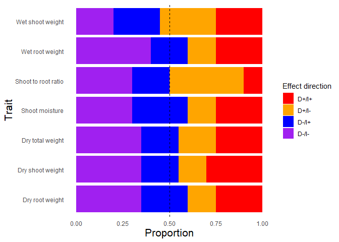<!-- -->

``` r
# Save the plot object
saveRDS(eff_plot, file = "./indirect/figs/eff_plot.rds")

## extract correlation results for shoot_root_ratio
corr_res <- results_df %>%
  filter(Direct == "direct.shoot_root_ratio" &
         Indirect == "indirect.shoot_root_ratio")
  


## correlation plot (shoot to root ratio)
corr_plot <- ggplot(comb, aes(x = direct.shoot_root_ratio, 
           y = indirect.shoot_root_ratio, 
           colour = contam_spike)) +
      geom_smooth(method = "lm", se = FALSE, color = "black",
                  linetype = 2) +
      geom_hline(aes(yintercept = 0), linetype = 2) +
      geom_vline(aes(xintercept = 0), linetype = 2) +
      geom_point(size = 3) +
      scale_color_manual(values = c("gray",
                                  "lightblue",
                                  "cornflowerblue",
                                  "blue",
                                  "#EABD8C",
                                  "#FFAD00",
                                  "#B06500")) +
      labs(y = "Indirect (shoot to root ratio)",
           x = "Direct (shoot to root ratio)",
           color = "Amendment - \n Spiking level",
        subtitle = paste0(
        "R² = ", round(corr_res$R_squared, 3),
        ", r = ", round(corr_res$Pearson_corr, 3),
        ", p = ", signif(corr_res$P_value_regression, 3))) +
      theme_minimal() +
  theme(axis.title.y = element_text(size = 16),
        axis.title.x = element_text(size = 16),
        panel.grid.major = element_blank(),
          panel.grid.minor = element_blank())
corr_plot
```

    ## `geom_smooth()` using formula = 'y ~ x'

    ## Warning: Removed 1 rows containing non-finite values (`stat_smooth()`).
    ## Removed 1 rows containing missing values (`geom_point()`).

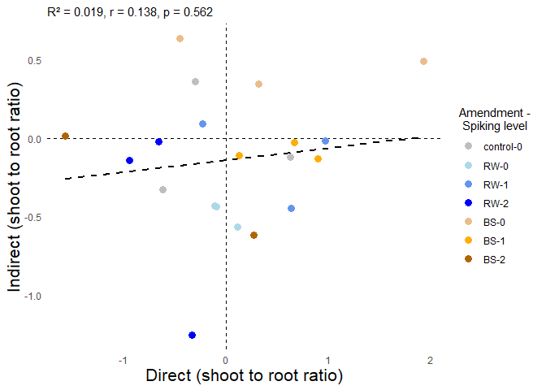<!-- -->

``` r
ggsave(filename = "./indirect/figs/effect_correlations.png",
       width = 5, height = 4, units = "in")
```

    ## `geom_smooth()` using formula = 'y ~ x'

    ## Warning: Removed 1 rows containing non-finite values (`stat_smooth()`).
    ## Removed 1 rows containing missing values (`geom_point()`).

``` r
# Save the plot object
saveRDS(corr_plot, file = "./indirect/figs/corr_plot.rds")


## code not used

# ## linear models
# ### set contrasts
# options(contrasts=c("contr.treatment","contr.poly")) 
# 
# ### source function
# source("./Source_code/lin_reg.func.R")
# 
# lreg.out <- sapply(selected_traits, 
#                    lin_reg.func,
#                    df = comb,
#                    simplify = FALSE, 
#                    USE.NAMES = TRUE)
# 
# ### combine dfs
# ### coeffs
# lregs <- lapply(lreg.out, `[[`, 1) %>%
#   bind_rows(.)
# write.csv(lregs, "./model_outputs/indirect/lin_regs.csv", 
#           row.names = TRUE)
# 
# ## counts for direction
# comb$direction <- ifelse(comb$raw_norm > 0 & 
#                            comb$resp_norm > 0,
#                          "both positive",
#                          ifelse(comb$raw_norm < 0 & 
#                                   comb$resp_norm > 0,
#                                 "microbes positive, \n contaminants negative",
#                                 ifelse(comb$raw_norm > 0 & 
#                                          comb$resp_norm < 0,
#                                 "microbes negative, \n contaminants positive",
#                                        "both negative")))
# 
# ## plot (proportion of effects)
# ggplot(comb, aes(x = raw_norm, y = resp_norm)) +
#   geom_point(aes(colour = contam_spike)) +
#   geom_hline(aes(yintercept = 0), linetype = 2) +
#   geom_vline(aes(xintercept = 0), linetype = 2) +
#   facet_wrap(~trait, scales = "free", ncol = 2) +
#   scale_colour_manual(values = c("gray",
#                                  "lightblue",
#                                  "cornflowerblue",
#                                  "blue",
#                                  "#EABD8C",
#                                  "#FFAD00",
#                                  "#B06500")) +
#   labs(x = "Direct effects", 
#        y = "Microbially-mediated effects")
# 
# ### counts per direction
# comb_sum <- comb %>%
#   filter(contam != "control" & is.na(direction) == FALSE) %>%
#   group_by(trait, direction, contam) %>%
#   summarize(prop = n_distinct(slurry_ID)/18)
#   
# comb_sum.w <- comb_sum %>%
#   pivot_wider(
#     names_from = direction,
#     values_from = prop
#   )
# 
# kable(comb_sum.w)
# 
# ggplot(comb_sum, aes(direction)) +
#   geom_bar(aes(weight = prop, fill = contam),
#            position = position_dodge2(0.2)) +
#   facet_wrap(~trait, ncol = 5) +
#   coord_flip() +
#   labs(y = "Proportion",
#        x = "Effect direction") +
#   scale_fill_manual(values = c( "blue",
#                                 "#B06500"))
```

### Figures (main text Fig. 3)

``` r
## loaf formatted data file
load(file = "./indirect-formatted.Rda") ## loads indirect
## load emmeans
load(file = "./indirect/model_outputs/emm1.Rda") ## loads emm

## traits to run through
trait.list <- c("plant_height4",
                "chlorophyll_content4_mean", 
                "leaf_number2",
                "wet_shoot_weight", 
                "dry_shoot_weight",
                "wet_root_weight", 
                "dry_root_weight",
                "dry_total_weight",
                "shoot_root_ratio",
                "shoot_moisture")

## source function
source("./Source_code/plot_emms.func.R")

plots.out2 <- sapply(trait.list, 
                   plot_emms.func,
                   df = indirect %>%
                     filter(!contam %in% c("saline","no_treat")) %>%
                     droplevels(.),
                   simplify = FALSE, 
                   USE.NAMES = TRUE)
```

    ## [1] "plant_height4"

    ## `summarise()` has grouped output by 'contam_spike', 'contam'. You can override
    ## using the `.groups` argument.
    ## `summarise()` has grouped output by 'contam_spike', 'contam'. You can override
    ## using the `.groups` argument.

    ## [1] "chlorophyll_content4_mean"

    ## `summarise()` has grouped output by 'contam_spike', 'contam'. You can override
    ## using the `.groups` argument.
    ## `summarise()` has grouped output by 'contam_spike', 'contam'. You can override
    ## using the `.groups` argument.

    ## [1] "leaf_number2"

    ## `summarise()` has grouped output by 'contam_spike', 'contam'. You can override
    ## using the `.groups` argument.
    ## `summarise()` has grouped output by 'contam_spike', 'contam'. You can override
    ## using the `.groups` argument.

    ## [1] "wet_shoot_weight"

    ## `summarise()` has grouped output by 'contam_spike', 'contam'. You can override
    ## using the `.groups` argument.
    ## `summarise()` has grouped output by 'contam_spike', 'contam'. You can override
    ## using the `.groups` argument.

    ## [1] "dry_shoot_weight"

    ## `summarise()` has grouped output by 'contam_spike', 'contam'. You can override
    ## using the `.groups` argument.
    ## `summarise()` has grouped output by 'contam_spike', 'contam'. You can override
    ## using the `.groups` argument.

    ## [1] "wet_root_weight"

    ## `summarise()` has grouped output by 'contam_spike', 'contam'. You can override
    ## using the `.groups` argument.
    ## `summarise()` has grouped output by 'contam_spike', 'contam'. You can override
    ## using the `.groups` argument.

    ## [1] "dry_root_weight"

    ## `summarise()` has grouped output by 'contam_spike', 'contam'. You can override
    ## using the `.groups` argument.
    ## `summarise()` has grouped output by 'contam_spike', 'contam'. You can override
    ## using the `.groups` argument.

    ## [1] "dry_total_weight"

    ## `summarise()` has grouped output by 'contam_spike', 'contam'. You can override
    ## using the `.groups` argument.
    ## `summarise()` has grouped output by 'contam_spike', 'contam'. You can override
    ## using the `.groups` argument.

    ## [1] "shoot_root_ratio"

    ## `summarise()` has grouped output by 'contam_spike', 'contam'. You can override
    ## using the `.groups` argument.
    ## `summarise()` has grouped output by 'contam_spike', 'contam'. You can override
    ## using the `.groups` argument.

    ## [1] "shoot_moisture"

    ## `summarise()` has grouped output by 'contam_spike', 'contam'. You can override
    ## using the `.groups` argument.
    ## `summarise()` has grouped output by 'contam_spike', 'contam'. You can override
    ## using the `.groups` argument.

``` r
##### Raw data (peas-only) #####
fig1 <- plot_grid(plots.out2[["dry_total_weight"]] +
                    labs(y = "Total dry weight (g)"),
                  plots.out2[["shoot_root_ratio"]] +
                    labs(y = "Shoot to root ratio"),
                  plots.out2[["shoot_moisture"]] +
                    labs(y = "Shoot moisture (%)"),
                  plots.out2[["plant_height4"]] +
                    labs(y = "Plant height (cm)"),
          ncol = 1,
          nrow = 4,
          align = "v",
          labels = NULL)
fig1
```

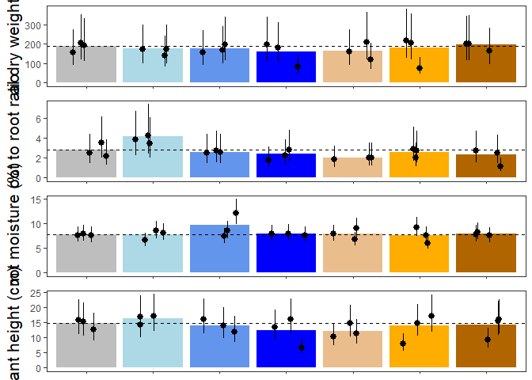<!-- -->

``` r
ggsave("./indirect/figs/raw_peas.png",
       width=5, height=8, units = "in")

## stitch together with effect comparisons
corr_plot <- readRDS("./indirect/figs/corr_plot.rds")
eff_plot <- readRDS("./indirect/figs/eff_plot.rds")

indirect_plot <- plot_grid(
  fig1,
  plot_grid(eff_plot,
            corr_plot,
            ncol = 1,
            nrow = 2,
            align = "v"),
  ncol = 2,
  nrow = 1,
  align = "h",
  rel_widths = c(0.5,1))
```

    ## `geom_smooth()` using formula = 'y ~ x'

    ## Warning: Removed 1 rows containing non-finite values (`stat_smooth()`).

    ## Warning: Removed 1 rows containing missing values (`geom_point()`).

``` r
indirect_plot
```

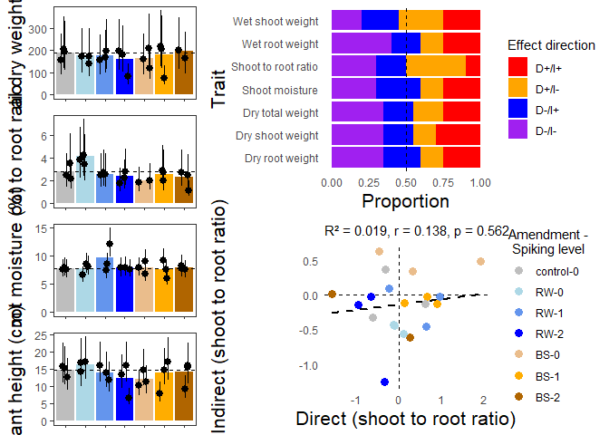<!-- -->

``` r
ggsave("./indirect/figs/Fig3.png",
       width=10, height=8, units = "in")
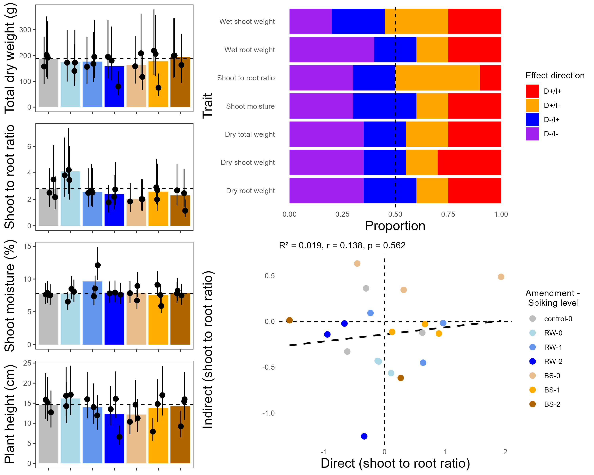
```


